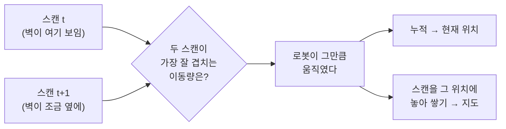
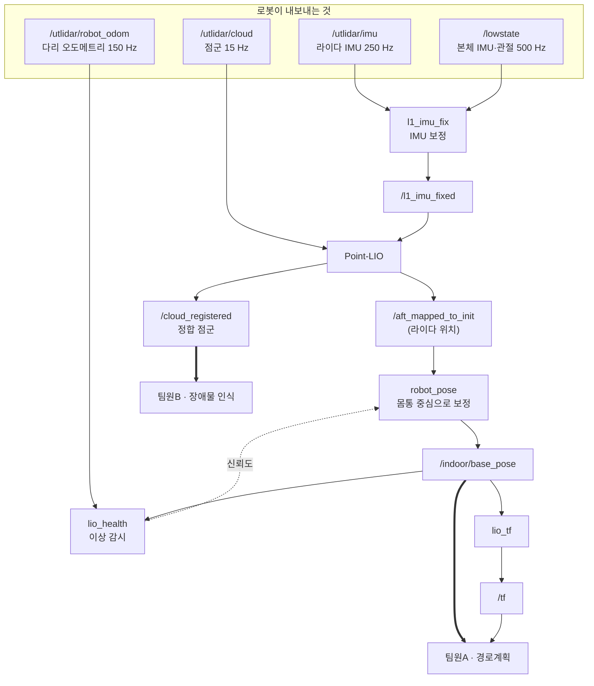
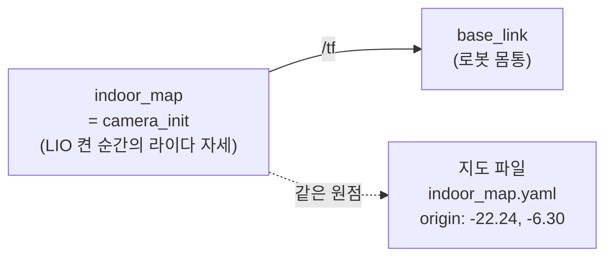

# Go2 실내 LIO 위치추정·지도 (HKNU)

Unitree Go2 X + L1 라이다로 **실내에서 로봇의 위치를 추정하고 지도를 만드는**
파이프라인입니다. 만들어진 지도와 위치는 경로계획(A*)과 장애물 회피에 쓰입니다.

담당: 효신 (위치추정·지도) · 갱신 2026-08-02

---

## 처음 오셨다면

| 하실 일 | 문서 |
|---|---|
| 1. 설치 | 아래 [설치](#설치) |
| 2. 실행 | 아래 [실행](#실행) |
| 3. 토픽 쓰는 법 | **[docs/INTERFACE_indoor.md](docs/INTERFACE_indoor.md)** ← 가장 중요 |

---

## 1. 무엇을 하는가

라이다는 **지금 주변이 어떻게 생겼는지**만 알려 줍니다. 로봇이 어디에 있는지는
모릅니다. LIO(LiDAR-Inertial Odometry)는 **연속한 스캔이 겹치는 정도**를 맞춰
그 사이에 로봇이 얼마나 움직였는지를 역산합니다.



**위치와 지도는 같은 계산에서 동시에 나옵니다.** 그래서 둘은 항상 같은 좌표계에
있고, 위치가 틀리면 지도도 같이 틀립니다.

IMU(가속도·각속도)는 스캔 사이 0.065초를 메우고, 라이다가 흔들릴 때 자세를
붙잡아 줍니다. 그래서 LiDAR-**Inertial** 입니다.

---

## 2. 파이프라인



### 왜 이렇게 여러 단계인가

| 노드 | 없으면 생기는 문제 |
|---|---|
| `l1_imu_fix` | L1 내부 IMU 는 **164.9° 기울어 장착**돼 있어 그대로 쓰면 중력 방향이 틀어져 발산합니다 |
| `robot_pose` | LIO 가 내는 건 **라이다 위치**입니다. 몸통 중심과 32 cm 차이가 나서 회전할 때 어긋납니다 |
| `lio_health` | LIO 는 **실패해도 조용히 틀린 좌표를 계속 냅니다.** 감시가 없으면 로봇이 자신 있게 벽으로 갑니다 |
| `lio_tf` | Nav2·RViz 가 쓰는 좌표변환. 신뢰도가 나빠지면 발행을 멈춥니다 |

---

## 3. 좌표계



**원점은 LIO 를 켠 순간 라이다가 있던 자리**입니다.

- 지도를 만든 세션과 주행 세션이 **같으면** 그대로 맞습니다
- 껐다 켜면 **원점이 바뀝니다.** 저장된 지도를 나중에 쓰려면 재위치추정이 필요한데
  아직 구현돼 있지 않습니다

그래서 지금 방식은 **"켜고 → 한 바퀴 돌아 지도 만들고 → 그 세션에서 주행"** 입니다.

---

## 설치

Ubuntu 22.04 + ROS2 Humble 이 이미 있어야 합니다.

```bash
tar xzf go2_handover.tar.gz -C ~        # 또는 git clone
~/fastlio_ws/tools/install_go2_lio.sh
```

6단계를 자동으로 진행합니다. **30분~1시간** 걸리며 `sudo` 비밀번호를 두 번 묻습니다.

```bash
~/fastlio_ws/tools/install_go2_lio.sh check   # 상태만 확인
~/fastlio_ws/tools/install_go2_lio.sh 4       # 4단계만 다시
```

중간에 실패해도 다시 실행하면 끝난 단계는 건너뜁니다.

---

## 실행

### 실시간 (로봇 연결)

```bash
source ~/setup_go2.sh
cd ~/fastlio_ws
./tools/run_indoor.sh
```

시작 전에 로봇 토픽 4개의 수신을 확인하고, 하나라도 없으면 중단합니다.

### 녹화본으로 시험

```bash
./tools/run_indoor.sh bag go2_corridor_all_0731_1931
```

### 상태 보기

```bash
tail -f /tmp/go2_indoor/health.log
```

---

## 지도 만들기

주행 전에 **한 바퀴 돌며 지도를 먼저 만듭니다.**


`run_indoor.sh` 로는 PCD 가 저장되지 않습니다(백그라운드 종료라서). 지도를 만들
때는 터미널 3개로 수동 실행하십시오. 각 창에서 `srcoff` 를 먼저 합니다.

```bash
# T1
python3 ~/fastlio_ws/tools/l1_imu_fix.py

# T2
ros2 launch point_lio mapping_unilidar_l1.launch.py

# T3 — 실시간이면 이 창 없이 로봇을 직접 주행시킵니다
cd ~/fastlio_ws && ros2 bag play <bag> -r 0.5
```

주행이 끝나면 **T2 에서 `Ctrl+C` 한 번**. 저장 로그가 뜰 때까지 기다립니다.

```bash
python3 tools/pcd_to_grid.py \
  ~/catkin_point_lio_unilidar/src/point_lio_ros2/PCD/scans.pcd \
  results/indoor_map 0.10
```

**z 범위가 4 m 이내**로 나오면 정상입니다. 12 m 처럼 크면 이전 회차가 섞였거나
LIO 가 발산한 것이니 지우고 다시 하십시오.

해상도는 **10 cm** 를 쓰십시오. 5 cm 는 점 밀도가 모자라 벽이 끊겨 보입니다.

---

## 받으실 것

자세한 것은 **[docs/INTERFACE_indoor.md](docs/INTERFACE_indoor.md)** 를 보십시오.
여기서는 요점만 적습니다.

### 팀원A — 토픽 하나

```
/indoor/base_pose     nav_msgs/Odometry     약 15 Hz
```

```python
def on_pose(self, msg):
    if msg.pose.covariance[0] > 100:
        self.stop()          # 위치 신뢰 불가 → 즉시 정지
        return
    x = msg.pose.pose.position.x
    y = msg.pose.pose.position.y
```

| covariance[0] | 뜻 |
|---|---|
| 0.01 | 정상 |
| 1000000.0 | **위치 추정 실패. 쓰면 안 됨** |

지도는 파일로 받습니다.

```
results/indoor_map_inflated.pgm / .yaml / .npy
```

25 cm 부풀린 판입니다. 로봇 폭 여유이며, A* 는 이쪽을 써야 경로가 벽에 붙지
않습니다.

### 팀원B — 점군 하나

```
/cloud_registered     sensor_msgs/PointCloud2     camera_init 프레임
```

Follow-the-Gap 은 센서 프레임에서 바로 하므로 지도가 필요 없습니다.

---

## 알아 두셔야 할 한계

**Point-LIO 는 회차마다 결과가 갈립니다.** 같은 녹화본을 여러 번 돌려도 성공할
때와 실패할 때가 있습니다. 원인 미규명이며, 그래서 위 covariance 조건이 현재로선
유일한 방어선입니다.

| 환경 | 루프 클로저 (참값 0.19 m) |
|---|---|
| 실내 방 | 0.79 m |
| 복도 (성공) | 0.24 ± 0.01 m |
| 복도 (실패) | 18 ~ 52 m |
| 실외 운동장 | 110 m ~ 27 km |

**실외에서는 이 파이프라인을 쓰지 마십시오.** 지면 평면밖에 안 보여 방향이
제약되지 않습니다. 실외는 GPS 가 주 위치원이며 별도 파이프라인을 씁니다.

**주행 시험 중에는 반드시 리모컨을 들고 계십시오.** 소프트웨어가 어디서 고장 나도
물리적으로 멈출 수 있는 건 그것뿐입니다.

---

## 문제가 생기면

| 증상 | 확인할 것 |
|---|---|
| 토픽 미수신으로 시작 실패 | USB-이더넷 연결. **내장 랜포트는 끊긴 사례가 있습니다** |
| `health=false` 가 자주 뜸 | LIO 발산. 파이프라인 재시작. 한 번 이상이 되면 자동 복구되지 않습니다 |
| 지도 z 범위가 큼 | 이전 PCD 가 섞임. 파일 지우고 다시 |
| 지도 벽이 끊겨 보임 | 격자 해상도를 10 cm 로 |
| 위치가 회전 시 튐 | `robot_pose` 가 떠 있는지 (LEVER 보정) |

로그는 모두 `/tmp/go2_indoor/` 에 있습니다.

---

## 폴더 구조

```
tools/     실행·분석 스크립트
  install_go2_lio.sh    설치 자동화
  run_indoor.sh         파이프라인 실행
  l1_imu_fix.py         IMU 보정 (모든 LIO 실험의 전제)
  robot_pose.py         라이다 위치 → 몸통 위치
  lio_health.py         이상 감시
  lio_tf.py             TF 발행
  pcd_to_grid.py        PCD → 2D 격자
docs/      문서 (INTERFACE_indoor.md 부터 보십시오)
results/   지도와 평가 그림
```
