# 2026-08-05 실험 기록

실내 SLAM 알고리즘 비교 및 IMU 구성 검증

---

## 오늘의 결론 요약

| 항목 | 결과 |
|---|---|
| L1 가속도계 사용 불가 판정 | ✅ **재확인** (A/B 비교, km vs cm) |
| 몸통 IMU 단독(C) | ❌ **미채택 확정** — 3회 시도 모두 B 미달 |
| LIO-SAM 적용 | ❌ **불가** — 엣지 특징 0개 |
| Unitree uSLAM | ❌ **부적합** — 앱 종속, 리모컨 조작 시 중단 |
| 층 전체 bag 확보 | ✅ 7분 22초, 유실 없음 |
| bag 재생 지도 | ✅ 실시간보다 개선 (85×87m → **35×73m**) |
| **IMU 초기화 영향** | ★ 초기화 성공 여부로 **x 범위 3배 차이** |
| 처음 지나가는 길 | ✅ **정상 생성** |
| 되돌아가는 길 | ❌ **맵 생성 오류** (루프 클로저 부재) |
| 지도 틀어짐 원인 | 통창 구역 정합 기준 소실 + 왕복 시 누적 오차 |

---

## 1. IMU 구성 비교 — 가속도계 문제 재확인

> **동기**: "가속도계가 정말 문제였나?"라는 의문. 7월 판단이 현재 config에서도
> 유효한지 실측 검증.

같은 점군(`/utlidar/cloud`), 같은 config, **IMU 소스만 변경**.

| 조건 | 자이로 | 가속도 | 타임스탬프 | `extrinsic_R` | 결과 |
|---|---|---|---|---|---|
| **A** | L1 | L1 원본 | L1 | 단위행렬 | ❌ 발산 |
| **B** | L1 | 몸통→`R_LB` | L1 | 단위행렬 | ✅ 정상 |
| **C1** | 몸통 | 몸통 | `now()` | `R_BL` | ❌ 방사형 |
| **C2** | 몸통 | 몸통 | tick v1 | `R_BL` | ❌ 방사형 |
| **C3** | 몸통 | 몸통 | tick v2 | `R_LB` | ❌ B 미달 |

### A — `/utlidar/imu` 원본

실험실 내 수 m 주행:

| 축 | 범위 |
|---|---|
| x | −4076.5 ~ −2798.7 m |
| y | +3079.4 ~ +5148.8 m |
| z | −5896.0 m |

**킬로미터 단위 발산.** z −5.9 km는 중력 방향이 완전히 무너졌다는 뜻.
7월 진단(−16 km 궤적)이 현재 config에서도 재현됨.

### B — `/l1_imu_fixed` 하이브리드 (현재 채택)

정지 구간:

| 축 | 폭 |
|---|---|
| x | ~0 mm |
| y | 74 mm |
| z | 20 mm |

**A와 5천 배 이상 차이.** → 가속도계가 원인이라는 판단 확정.

### C — 몸통 IMU 단독 → ❌ **미채택 확정**

몸통 IMU만 쓰려면 두 가지가 필요:
- `imu_topic` → 몸통 브리지 출력
- `extrinsic_R` → 몸통 프레임 그대로 나가므로 config 에서 회전

**3회 시도, 모두 B에 미달**

| 시도 | `extrinsic_R` | 타임스탬프 | 결과 |
|---|---|---|---|
| C1 | `R_BL` | `now()` | 완전 방사형. 정합 자체 실패 |
| C2 | `R_BL` | tick v1 | 완전 방사형. 동일 |
| C3 | `R_LB` | tick v2 | 부분 정합. **B보다 열등** |

**C1/C2 (`R_BL`)**

| 축 | C1 폭 |
|---|---|
| x | 0.14 m |
| y | 1.18 m |
| z | 0.016 m |

숫자상 발산은 아니나 RViz 에서 **방사형 폭발**. 시작점이 원점이 아님.
tick 으로 타임스탬프를 고쳐도(C2) 결과 불변 → **타임스탬프는 원인이 아님.**

| C1 (`now()`) | C2 (tick v1) |
|---|---|
| 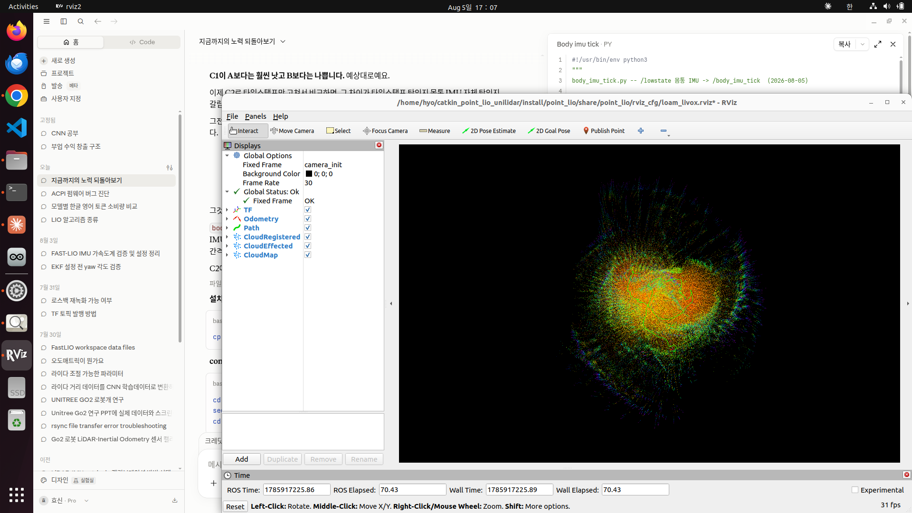 | 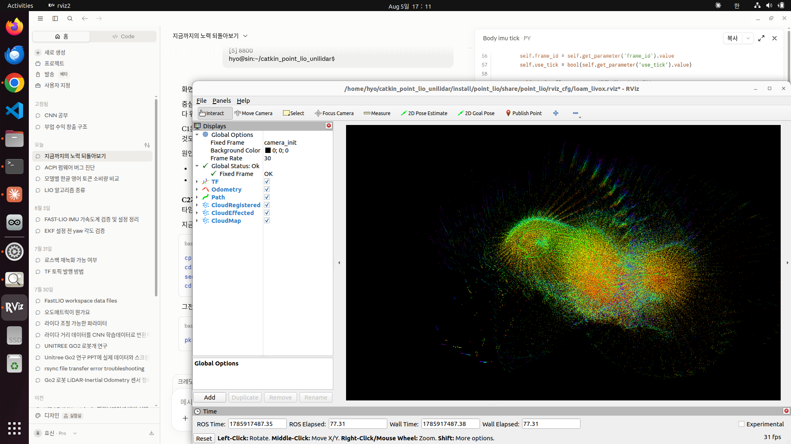 |

중심에서 사방으로 뻗는 형태. 스캔마다 위치가 틀어진 채 쌓인 것.

**C3 (`R_LB`)** — bag 전체 재생 후 지도 생성

| | B (`floor_clean2`) | C3 (`floor_C_RLB`) |
|---|---|---|
| x 범위 | **35.5 m** | 65.4 m |
| y 범위 | **72.6 m** | 92.0 m |
| z 퍼짐 | **6.37 m** | 8.81 m |
| 지면 추정 | −0.43 m | −1.22 m |
| **장애물 비율** | **18.8 %** | **42.4 %** |

- `R_LB` 가 `R_BL` 보다는 낫다 (방사형 → 부분 정합)
- 그러나 **격자에서 통로가 통째로 메워짐.** 벽이 아니라 덩어리
- 장애물 42.4% = 점군이 흩어져 지면 높이대를 벗어난 것이 많다는 뜻
- 높이 봉우리가 −1.22 / −1.00 / −2.55 세 군데로 분산 (B는 −0.43 하나)
- **이 지도로는 A\* 를 돌릴 수 없다.** 통로가 막혀 경로가 안 나온다

**C3 RViz (재생 중)**

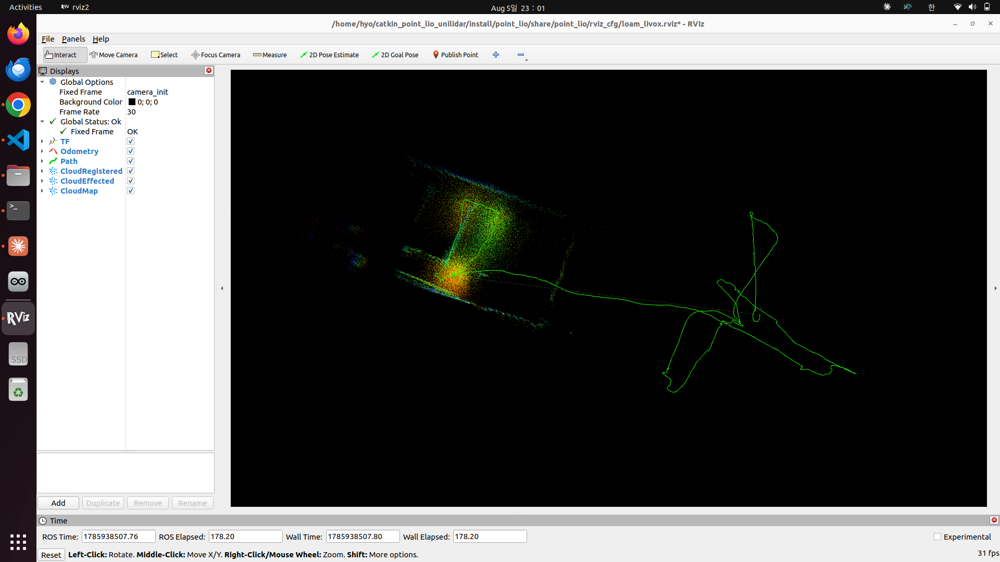

방사형은 아니다. 왼쪽에 구조물 형태가 보인다.
그러나 오른쪽 초록 궤적이 나비 날개처럼 접혀 있고, **점군 영역과 궤적 영역이
완전히 분리**되어 있다. 로봇이 있다고 믿는 곳과 실제 본 것이 따로 논다.

**C3 최종 지도**

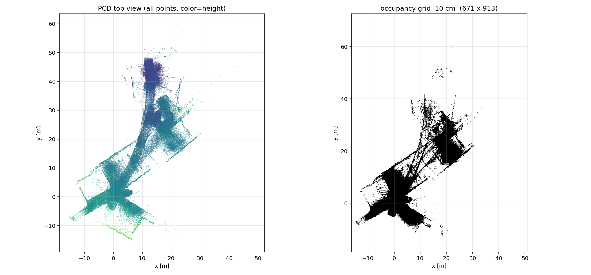

격자에서 통로가 통째로 메워짐. 벽이 아니라 덩어리.

### 판단

**B(하이브리드) 유지가 근거 있는 선택으로 확정.**

- 남은 조정 후보는 `extrinsic_T`(lever arm 0.322 m) 뿐이나,
  현재 격차가 x 1.8배라 미세 조정으로 뒤집힐 규모가 아님
- 성공해도 B보다 나을 보장이 없음 (자이로 250→500 Hz 이득 vs 브리지 추가 관리 비용)
- B는 이미 검증 완료 (정지검증 통과, 중력방향 0.89° 재현, 층 전체 지도 생성)

→ **"현 시점 미채택, 근거 기록."** 폐기가 아니라 보류.
   필요해지면 이 기록에서 이어갈 수 있음.

### 부산물 — `body_imu_tick2.py`

bag 재생에서 tick 기반 타임스탬프를 복원하는 브리지를 만들었다.

**v1 의 문제**: 기준점을 `now() - tick/1000` 으로 잡음.
실시간에서는 맞지만 bag 재생에서는 `now()` 가 현재 시각이라 통째로 밀린다.

```
실측: IMU stamp   1785938173 (22:56, 현재)
      LiDAR stamp 1785918060 (17:21, bag 녹화)
      → 5시간 35분 차이. Point-LIO 가 짝을 못 맞춰 초기화조차 안 됨
```

**v2 의 해결**: `/utlidar/imu` 의 header 를 기준으로 삼는다.
같은 bag 안에 있으므로 실시간이든 재생이든, 배속이 얼마든 항상 맞는다.

```python
offset = median(utlidar_imu.stamp - lowstate.tick/1000)
```

→ v2 적용 후 IMU 초기화 정상 진행 (1 → 24 → 79 → 100%)

**이 노드는 C 실험용이지만, 향후 bag 기반 실험에 재사용 가능.**

---

## 2. LIO-SAM 적용 시도 — 실패

루프 클로저가 필요해서 시도. GTSAM 설치 후 빌드 성공.

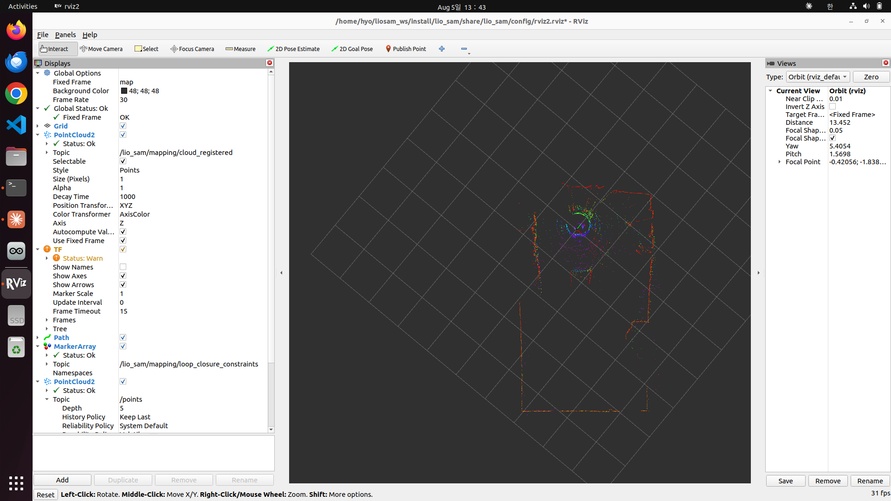

*빌드·구동 자체는 성공. `cloud_registered` Status Ok, 루프 클로저 모듈도 동작.
그러나 아래와 같이 특징 추출이 실패한다.*

### velodyne 모드 (N_SCAN 18, Horizon_SCAN 240)

```
Not enough features! Only 0 edge and 20 planar features available.
```

**엣지 특징이 계속 0개.** 그리고 `imuPreintegration` 노드가 즉사:

```
gtsam::IndeterminantLinearSystemException  near variable b0
```

`b0` = IMU 바이어스 변수. 정지 상태에서 관측 불가능 + 라이다 제약도 없어 미결정.

### livox 모드 (N_SCAN 6, Horizon_SCAN 4000)

발산. RViz 카메라 거리 1,272 m — 실험실 안에서 킬로미터 단위로 흩어짐.

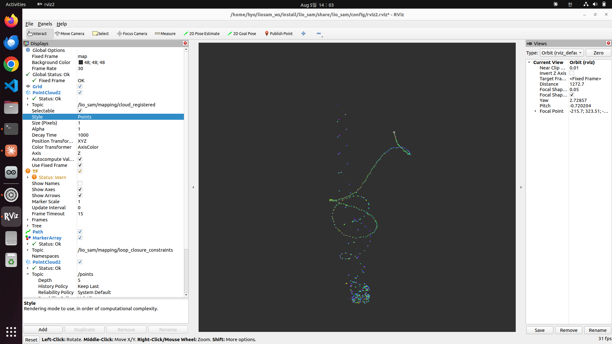

궤적이 나선·고리 모양으로 그려짐. 로봇은 그렇게 움직이지 않았다.

**참고 — TF 경고는 무시해도 된다**

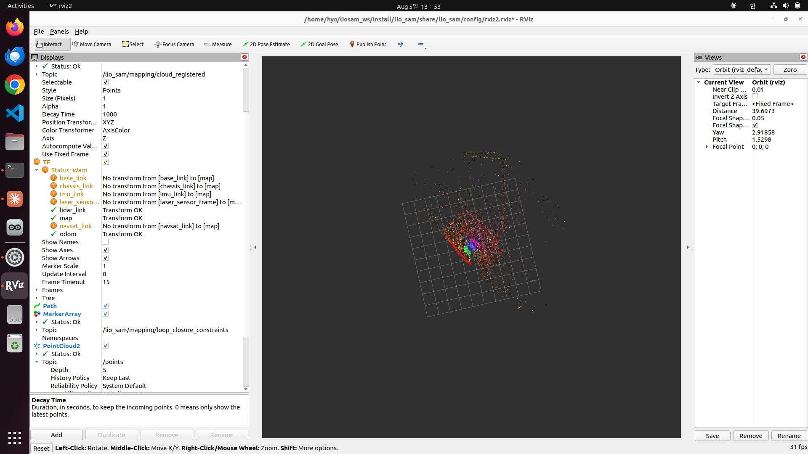

`base_link / chassis_link / imu_link / laser_sensor_frame / navsat_link` 경고는
LIO-SAM 에 딸려온 **예제 로봇 URDF** 의 프레임이다. Go2 에는 없다.
실제로 쓰이는 `map / odom / lidar_link` 는 모두 Transform OK.

### 원인

LIO-SAM은 점군을 **레인지 이미지**(N_SCAN × Horizon_SCAN)로 펼친 뒤
**같은 링 안의 이웃 점**으로 곡률을 계산해 엣지/평면을 나눈다.

- Velodyne VLP-16: 프레임당 28,800점, 규칙적 링
- **Unitree L1: 프레임당 약 4,000점, 비반복 스캔**

18×240 = 4,320칸에 4,000점이 불규칙하게 들어가니 대부분의 칸이 비고
이웃이 안 잡힘 → 곡률 계산 불가 → 엣지 0개.

### 결론

**특징점 기반 LOAM 계열은 이 센서와 맞지 않는다.**
원시 점군을 직접 정합하는 FAST-LIO / Point-LIO 계열이 적합하다는 것을
실측으로 확인. → **세 알고리즘 비교의 실질적 내용**

---

## 3. Unitree uSLAM 조사

### 명령 체계 확인 (앱 통신 감청)

`/uslam/client_command` (std_msgs/String)로 전부 제어 가능:

```
mapping/start, mapping/stop
localization/start, localization/stop
localization/set_initial_pose/<x>/<y>/<yaw>
navigation/start, navigation/stop
navigation/set_goal_pose/<x>/<y>/<yaw>     ← A* 대체 가능
patrol/pause, patrol/stop
common/set_map_id/<base64 경로>
```

터미널에서 직접 제어 성공:
```bash
ros2 topic pub --once /uslam/client_command std_msgs/msg/String '{data: "\"mapping/start\""}'
```

### 성능

- `/uslam/frontend/odom`: **149 Hz** (Point-LIO 15 Hz의 10배)
- `/uslam/frontend/cloud_world_ds`: 1.54 Hz (실시간 누적 지도)
- 내비게이션 상태 전이 관측: `WAITING / TRACKING / NO_PATH / FAILURE`

### ❌ 채택 불가 사유

서버 로그에서 확인:
```
Joystick button is pressed! Uslam is stopped now!
```

- **리모컨을 건드리면 uSLAM이 즉시 종료된다** → 조종하며 매핑 불가
- 지도가 **안드로이드 앱 내부 저장소**에 저장됨
  (`/storage/emulated/10/Android/data/com.unitree.doggo2/files/3DMapFile/`)
  → PC 파이프라인에서 사용 불가
- 내부 동작 비공개 → 비교·개선·연구 대상이 될 수 없음

---

## 4. 층 전체 bag 녹화

### ⚠ 1차 실패 (floor_0805_1440)

`ros2 bag record -a`로 녹화했으나 **라이다 토픽이 하나도 안 담김.**

**원인**: `-a`는 **녹화 시작 시점에 존재하는 토픽만** 잡는다.
`/utlidar/*` 계열이 그때 아직 안 떠 있었음.

→ **교훈: `-a` 대신 토픽을 명시할 것.** 명시하면 나중에 나타나는 토픽도 자동 구독.

### ✅ 2차 성공 (floor_0805_1720)

```
Duration: 442.4 s (7분 22초)
Size:     3.5 GiB
```

| 토픽 | 개수 | 환산 주기 |
|---|---|---|
| `/utlidar/cloud` | 6,620 | 15.0 Hz |
| `/utlidar/imu` | 107,893 | 244 Hz |
| `/lowstate` | 207,057 | 468 Hz |
| `/utlidar/robot_odom` | 64,637 | 146 Hz |

실시간 주기와 거의 동일 → **유실 없음, 무선 끊김 없음**

원본만 녹화(`/l1_imu_fixed` 제외)했으므로 `R_LB`·`ACC_SCALE`을 바꿔가며
브리지를 다시 돌려볼 수 있다.

---

## 5. bag 재생 지도 — 실행 조건별 비교

같은 bag(`floor_0805_1720`), 같은 config, `-r 0.5` 반속 재생.
**실행 조건만 다르게 하여 3회 비교.**

| 실행 | 조건 | x 범위 | y 범위 | z 퍼짐 | 지면 추정 |
|---|---|---|---|---|---|
| 아침 실시간 | 실주행, 다운샘플 적용 전 | 85.5 m | 87.4 m | 7.79 m | −0.60 m |
| `floor_loopback` | `imu loop back` 지속 발생 | ~55 m | ~50 m | — | — |
| `floor_clean` | loop back 없음, **초기화 실패** | 111.6 m | 100.1 m | 8.94 m | −0.91 m |
| **`floor_clean2`** | loop back 없음, **초기화 정상** | **35.5 m** | **72.6 m** | **6.37 m** | **−0.43 m** |

### 지도 4종 비교

| 아침 실시간 (85.5 × 87.4 m) | `floor_loopback` (~55 × 50 m) |
|---|---|
| 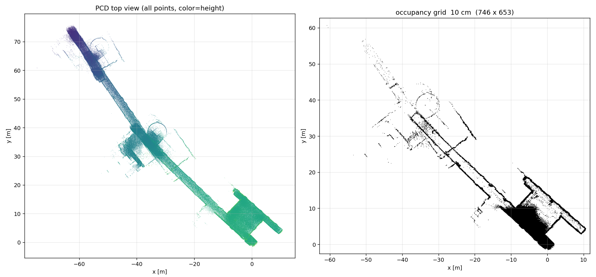 | 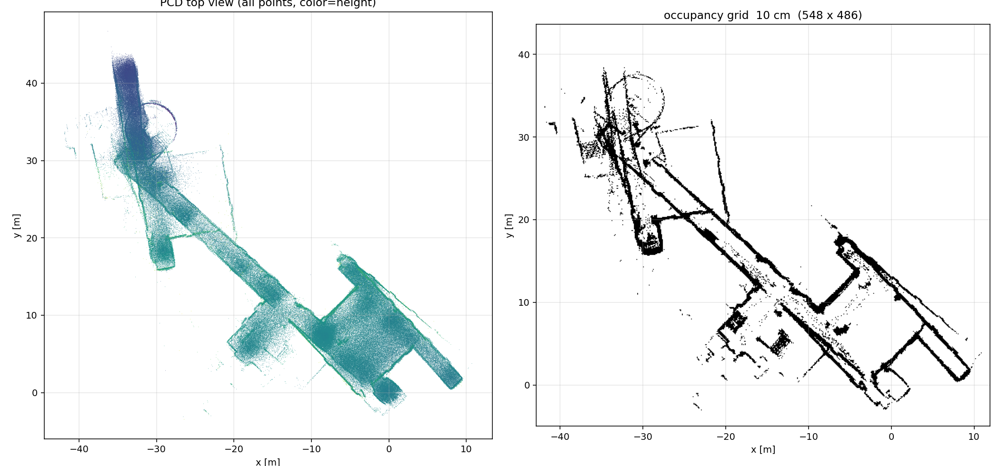 |

| `floor_clean` — 초기화 실패 (111.6 × 100.1 m) | **`floor_clean2` — 초기화 정상 (35.5 × 72.6 m)** |
|---|---|
| 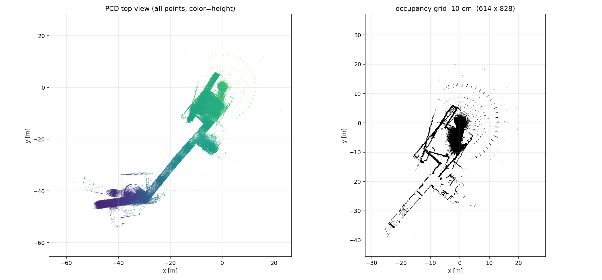 | 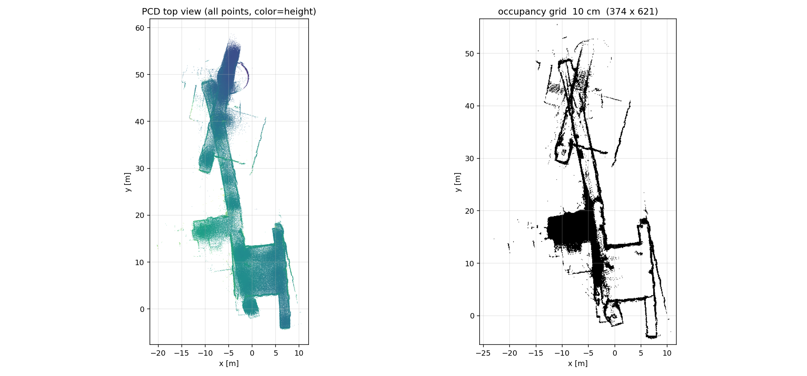 |

`floor_clean`(좌하)은 원점 주변에 **방사형 별 무늬**가 보인다 — 초기화 실패의 흔적.
`floor_clean2`(우하)는 아래쪽 절반의 벽이 직선으로 그려지고 색(높이)도 균일하다.

### ★ 핵심 발견 — IMU 초기화가 지도 품질을 좌우한다

같은 bag, 같은 config인데 **초기화 성공 여부만으로 x 범위가 3배 차이**.

**실패 (`floor_clean`)**
```
IMU Initializing: 1.0 %
[WARN] Reset ImuProcess
IMU Initializing: 100.0 %      ← 1% 에서 곧바로 점프
```
→ 초기화 안 된 상태로 시작. 원점 주변에 **방사형 별 무늬** 생성
   (로봇이 제자리에 고정된 채 스캔만 누적된 것)
→ 뒤늦게 정합이 붙어 궤적 전체가 어긋남

**방사형 무늬의 정체** (별도 관측 사례)

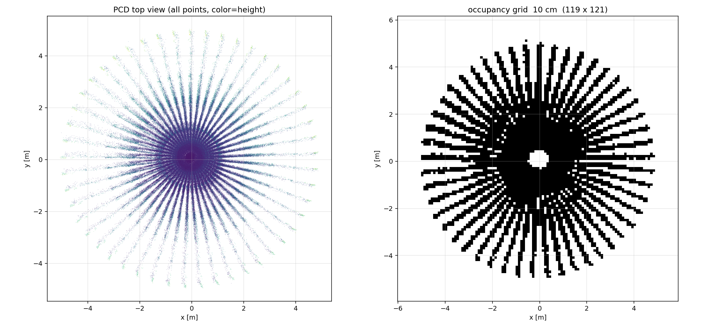

반경 약 5 m, 원점 중심. **지도가 아니라 "제자리에서 본 L1 스캔 패턴"이다.**
위치 추정이 전혀 진행되지 않아 비반복 스캔 패턴이 한 자리에 그대로 쌓였다.
2D 격자로 변환하면 방사 살이 그대로 장애물로 찍힌다.

이 형태가 보이면 **즉시 중단하고 재시작할 것.**

**성공 (`floor_clean2`)**
```
IMU Initializing: 1.0 %
[WARN] Reset ImuProcess
IMU Initializing: 6.0 %
IMU Initializing: 27.0 %
IMU Initializing: 64.0 %
IMU Initializing: 100.0 %      ← 단계적 상승
```

**차이를 만든 것**: T2(Point-LIO) 실행 후 **2~3초 여유**를 두고 T3(bag) 시작.
너무 빨리 시작하면 bag 앞부분의 정지 구간을 놓쳐 IMU 초기화가 무산된다.

> **운용 지침**: 실행할 때마다 초기화 로그를 확인할 것.
> `1% → 100%` 점프면 중단하고 재시작.

### 높이 분포 비교

**`floor_clean` (실패)** — 바닥이 두 군데로 갈라짐
```
-4.93 ~ -4.71 m   ##################
-0.91 ~ -0.68 m   ##################################################
```
→ 층 전체를 도는 동안 z가 약 4 m 밀림

**`floor_clean2` (정상)** — 봉우리가 −0.43 m 하나에 집중
```
-0.43 ~ -0.27 m   ##################################################
-0.59 ~ -0.43 m   ###############################
-0.75 ~ -0.59 m   ###########################
```
→ −1.5 m 근처의 작은 봉우리는 계단/구조물로 추정

### `floor_clean2` 구간별 평가

| 구간 | 상태 |
|---|---|
| y 0 ~ 20 m | ✅ **정상 생성.** 벽이 직선, 방 형태·문틈 식별 가능, 색(높이) 균일 |
| y 20 ~ 30 m | ✅ 직선 복도 정상 |
| y 30 ~ 50 m | ❌ **되돌아온 구간에서 맵 생성 오류.** 복도가 두 갈래로 갈라져 X자 교차 |
| y 50 m ~ | ❌ 통창 구역. z 드리프트 시작 (색이 급격히 어두워짐) |


**즉, 처음 지나가는 길은 정상적으로 생성된다.**
**지나온 길을 되돌아갈 때 맵 생성 오류가 발생한다.**

같은 복도를 두 번째로 통과할 때 누적된 각도 오차 때문에 첫 통과 궤적과
겹치지 않고 어긋난 위치에 새로 그려진다.

→ **루프 클로저가 필요한 전형적 상황.** 왕복 없이 편도만 도는 구간은
   Point-LIO 만으로도 쓸 만한 지도가 나온다.

### ⚠ `imu loop back` 원인 (해결법 확인)

```
[ERROR] [laserMapping]: imu loop back, clear deque
```

Point-LIO를 **먼저 띄우고 bag을 나중에** 재생하면 발생.
LIO는 실시간 시각으로 초기화를 끝냈는데 bag은 과거 시각(17:20)을 재생 →
시각이 뒤로 점프.

**해결**: T1(브리지) → T2(Point-LIO) → **2~3초 후** T3(bag).

⚠ `floor_loopback` 실행이 겉보기에 범위가 작았던 것은 개선이 아니다.
큐가 계속 리셋되어 오차가 누적될 시간이 없었던 것으로 보이며,
정합이 제대로 이루어진 결과가 아니다.

---

## 6. 지도 틀어짐 원인 — 통창 구역

지도에서 **왼쪽 위(x≈−35, y≈40) 구간이 유독 틀어짐.**
해당 위치에 **넓은 통창문 3~4개**가 있음을 확인.

### 메커니즘

라이다는 유리를 안정적으로 측정하지 못한다.
- 빔이 통과하거나
- 정반사되어 돌아오지 않거나
- 입사각에 따라 왔다갔다

→ 창문 방향으로 **정합에 쓸 점이 사라짐** → 그 축으로 위치가 미끄러짐

### 검증되지 않은 대안 가설 (기각)

"창문 근처에서 GPS가 잡혀 시각/좌표 보정이 들어간다"는 가설이 있었으나:
- Point-LIO는 `/gnss`를 **구독하지 않는다** (config상 입력은 점군 + IMU뿐)
- 이번 결과는 **bag 재생**이므로 실시간 GPS가 개입할 경로 자체가 없음

→ **유리에 의한 점군 소실이 유력.**

### 다음 확인

```bash
ros2 bag play ~/data/bags/indoor/floor_0805_1720 --start-offset <초> -r 0.3
```
해당 구간에서 RViz로 창문 방향 점군이 비는지 육안 확인.

⚠ 순천 대회는 야외 주차장이므로 유리창 문제는 해당 없음.
**실내 테스트 환경 고유의 현상.**

---

## 7. 미해결 / 다음 할 것

- [x] ~~C의 `extrinsic_R`에 `R_LB` 시도~~ **완료. B 미달로 미채택 확정**
- [ ] (보류) Point-LIO 소스에서 `extrinsic_R` 방향 확인 — C 재개 시에만 필요
- [ ] (보류) C의 `extrinsic_T`에 lever arm 0.322 m 적용 — 격차가 커서 효과 의문
- [x] ~~`imu loop back` 없이 bag 재생 → 지도 재생성 후 비교~~ **완료 (5절)**
- [ ] 통창 구간 점군 육안 확인
- [ ] B의 **이동 구간** 정확도 측정 (현재는 정지 구간만)
- [ ] Point-LIO 재시작 시 필요한 최소 대기 시간 측정
- [ ] **루프 클로저 대안 검토** — 되돌아가는 구간의 맵 생성 오류가 이것 때문임이
      확인됨. LIO-SAM 불가 확정. Point-LIO 뒤에 포즈 그래프 백엔드를 붙이는
      방식 등 검토 필요
- [ ] 편도 주행만으로 층을 커버하는 경로 설계 (왕복 회피) — 임시 대안
- [ ] **B 조건 PCD 로 `pcd_to_grid.py` 높이 필터 범위 비교**
      `Z_MIN, Z_MAX = 0.20, 1.50` (기본) vs `0.10, 0.60` (좁힘)
      - C3 PCD 로 예비 시험: 장애물 후보 42.4% → **31.1%**, 장애물 칸 8.5% → **7.0%**
      - 다만 C3 는 정합이 이미 어긋난 지도라 판단 근거로 부적절.
        B(`floor_clean2`) 조건으로 재현해서 비교할 것 (bag 재생 15분)
      - ⚠ 필터는 **지도를 보기 좋게** 만들 뿐 정합 오차를 고치지 않는다.
        LIO 정합에는 전체 점군을 그대로 쓰고, 후처리에서만 필터링하는 구조가 맞음

---

## 부록 A — bag 재생 절차

```bash
# 이전 프로세스 정리 + PCD 삭제
pkill -f pointlio; pkill -f l1_imu_fix; pkill -f "ros2 bag"; pkill rviz2
sleep 3
rm -f ~/catkin_point_lio_unilidar/src/point_lio_ros2/PCD/scans.pcd

# 공통 환경 (setup_go2.sh 는 로봇 없으면 중간에 멈추므로 직접 source)
source /opt/ros/humble/setup.bash
source ~/unitree_ros2/cyclonedds_ws/install/setup.bash
unset CYCLONEDDS_URI

# T1 → T2 → T3 순서.
# ★ T3 는 T2 의 "Multi thread started" 후 2~3초 여유를 두고 실행할 것.
#   너무 빠르면 bag 앞부분 정지 구간을 놓쳐 IMU 초기화가 무산된다.
python3 ~/fastlio_ws/tools/l1_imu_fix.py
ros2 launch point_lio mapping_unilidar_l1.launch.py
ros2 bag play ~/data/bags/indoor/floor_0805_1720 -r 0.5

# 재생 끝나면 T2 에서 Ctrl+C  (pkill 하면 PCD 저장 안 됨)
ls -lh ~/catkin_point_lio_unilidar/src/point_lio_ros2/PCD/scans.pcd

# 2D 격자 변환 (해상도 0.10 이 이 데이터에 적합. 0.05 는 벽이 끊김)
python3 ~/fastlio_ws/tools/pcd_to_grid.py \
  ~/catkin_point_lio_unilidar/src/point_lio_ros2/PCD/scans.pcd \
  ~/fastlio_ws/results/floor_map 0.10
```

## 부록 B — 실수하기 쉬운 것들

| 증상 | 원인 | 대응 |
|---|---|---|
| `No module named 'unitree_go'` | `setup_go2.sh`가 NIC 못 찾고 중단 | `unitree_ros2/cyclonedds_ws` 직접 source |
| bag에 라이다 없음 | `-a`는 시작 시점 토픽만 | 토픽 명시 |
| `imu loop back` 반복 | LIO를 bag보다 먼저 띄움 | T2 → T3 간격 5초 이내 |
| PCD 저장 안 됨 | `pkill`로 종료 | 반드시 Ctrl+C |
| `binary file matches` | 로그에 널바이트 | `grep -a` |
| echo 결과 비어 있음 | 같은 파일에 echo 두 개 | 하나만 실행 |
| 방사형 별 모양 지도 | 재시작 텀 없이 실행 → 초기화 실패 | 몇 초 텀 두고 재실행 |
| 지도가 2~3배로 벌어짐 | **IMU 초기화 실패** (`1% → 100%` 점프) | T2 후 2~3초 두고 T3 실행 |
| bag 재생 시 IMU 초기화 로그 자체가 안 뜸 | IMU/LiDAR stamp 가 수 시간 어긋남 | `body_imu_tick2.py` 사용 (bag 헤더 기준) |
| tick 브리지 지연 편차 1초 | v1 을 반속 재생에 사용 | v2 사용, 또는 정속 재생 |


---

## 부록 C — 이미지 색인

모든 이미지는 `images_0805/` 폴더에 있다.

| 파일 | 내용 |
|---|---|
| `map1_아침실시간.png` | 아침 실주행 지도 (85.5 × 87.4 m) |
| `map2_loopback.png` | `imu loop back` 지속 상태 지도 |
| `map3_clean_초기화실패.png` | IMU 초기화 실패 (111.6 × 100.1 m) |
| `map4_clean2_정상.png` | **IMU 초기화 정상 (35.5 × 72.6 m) — 최선 결과** |
| `map5_C3_RLB.png` | C3 몸통 IMU + `R_LB` (65.4 × 92.0 m) |
| `ref_방사형_재시작실패.png` | 초기화 실패 시 나오는 방사형 스캔 패턴 |
| `C1_rviz_방사형.png` | C1 (`R_BL`, now) RViz |
| `C2_rviz_방사형.png` | C2 (`R_BL`, tick v1) RViz |
| `C3_rviz_부분정합.png` | C3 (`R_LB`, tick v2) RViz — 궤적과 점군 분리 |
| `liosam_rviz_velodyne.png` | LIO-SAM velodyne 모드 구동 화면 |
| `liosam_rviz_livox발산.png` | LIO-SAM livox 모드 발산 |
| `liosam_tf경고.png` | LIO-SAM TF 경고 (예제 URDF, 무시 가능) |
