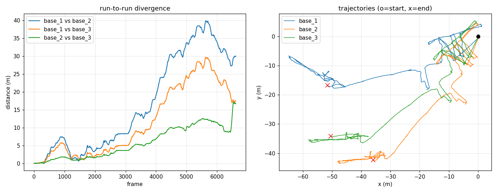
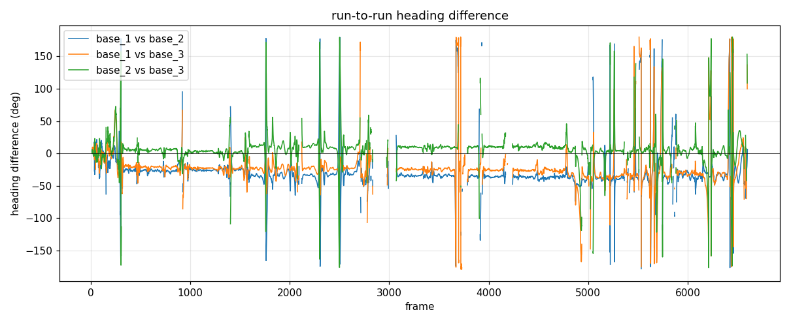
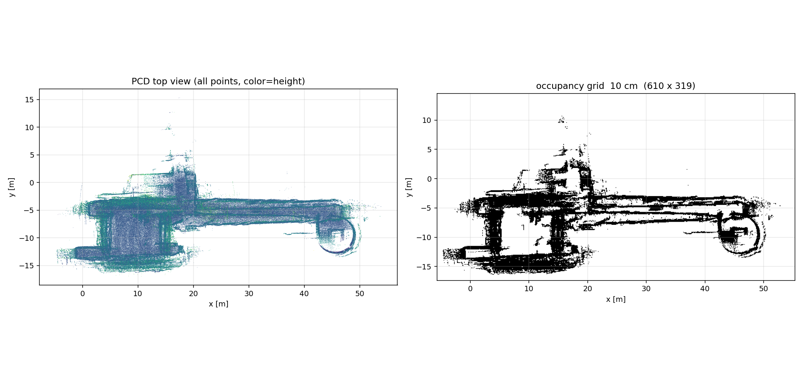
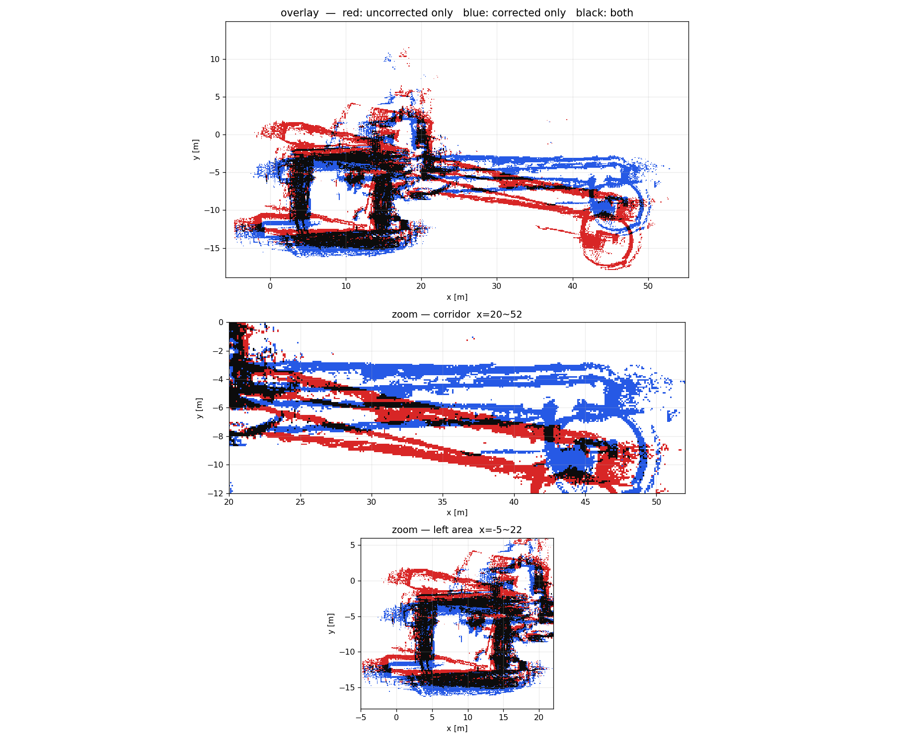
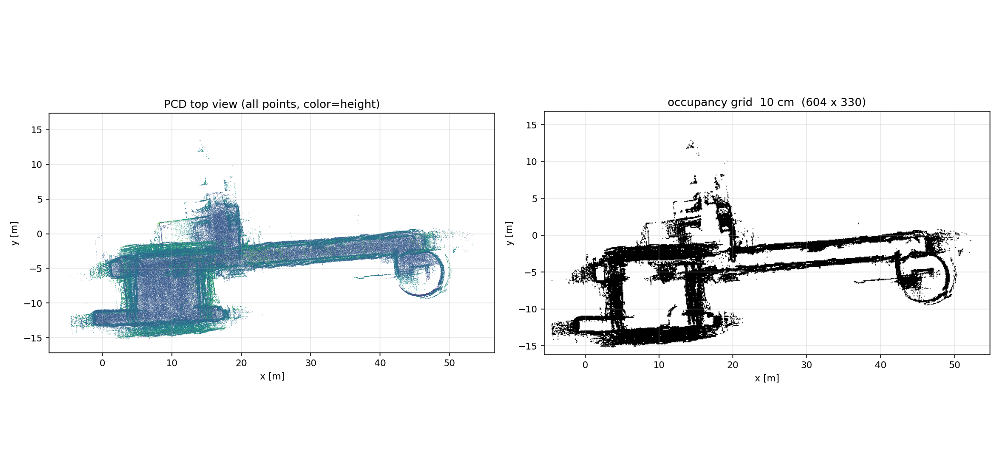
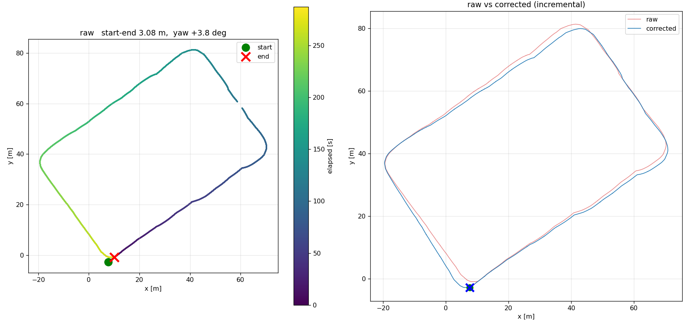
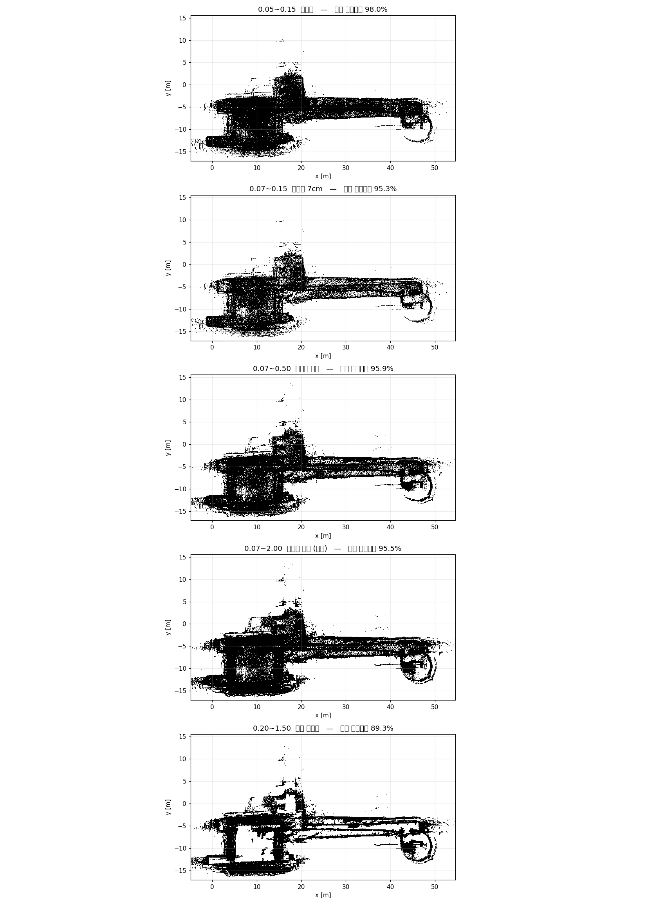
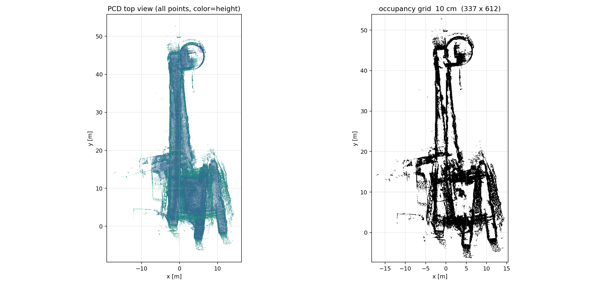
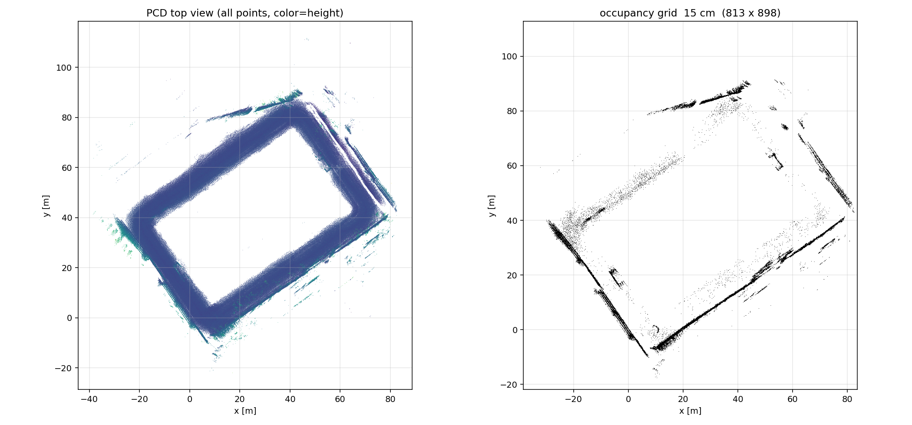
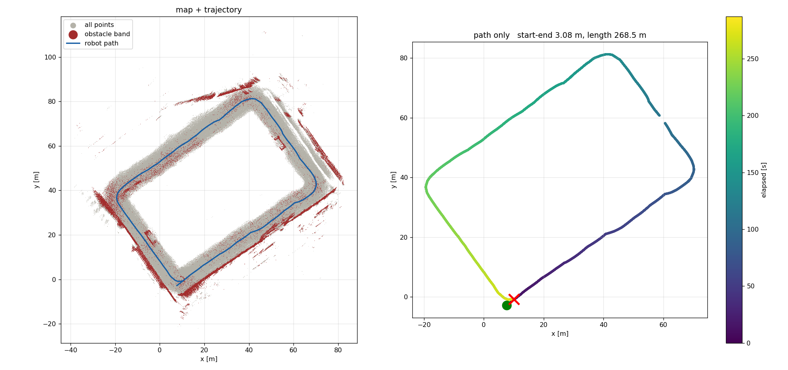

# 2026-08-07 실험 기록

재현성 검증 → 실내 매핑 방식 전환 (Point-LIO → 다리 오도메트리)

---

## 오늘의 결론 요약

| 항목 | 결과 |
|---|---|
| 재현성 3회 반복 | ✅ 완료. 입력·처리량 **완전 동일** (6,616 프레임 / 4,323,259 점) |
| CPU 드롭 가설 | ❌ **기각** — CPU 평균 4~5%, 경합 없음 |
| 브리지 런타임 추정 가설 | ❌ **소거** — `go2_calib.py` 상수 import, 정지검증은 로깅 전용 |
| 재현성 부족의 정체 | ★ **bag 17~24초 제자리 급회전에서 yaw 가 두 갈래로 갈림** |
| 실행 간 실제 차이 | 회전 정합 후 RMSE **0.4~2.0 m** — 형상은 재현됨, **각도만 다름** |
| 기존 "x 35 m vs 112 m" | ❌ **알고리즘 편차가 아니라 지도 회전각 차이.** 지표가 잘못됐던 것 |
| 다리 오도메트리 드리프트 | ✅ **2.63 %** (0805) / **2.90 %** (0807) — 2회 재현 |
| Point-LIO 드리프트 | ❌ **21.75 %** (같은 bag) |
| → 실내 매핑 | **다리 오도메트리 점군 누적으로 전환** |
| 루프 클로저 | ✅ 직접 구현. **v1(전역 나선) 실패 → v2(증분 재적분) 성공** |
| 실내 지도 겹침 | 4.02 m → **0.45 m** (v2) |
| 국소 오차 | ⚠ 전역 지표가 가리고 있었음. 기둥 실측 **2.07 m** |
| 높이 필터 비교 | ✅ 5종 비교. **`0.20~1.50` 유지가 최선** (변경 불필요) |
| `pcd_to_grid.py` 버그 | ✅ 지면 추정이 bin 왼쪽 끝 → **중앙으로 수정** |
| **실외 매핑** | ✅ **성공. 드리프트 1.15 %, 화단·골대가 실제 지형과 일치** |
| **실외 방향 확정** | **GPS + 다리 오도메트리 EKF.** LIO 불필요 |
| 축척 | ⚠ **미확정.** 다리 오도메트리가 5~20 % 짧게 잼 (줄자 필요) |
| 전달용 지도 | 실내 `odommap_v2` (92.0 %) / 실외 `odommap_outdoor` |
| 초반 제자리 회전 가설 | ❌ **기각** — 다리 오도메트리와 무관 (Point-LIO 한정) |
| "Point-LIO 실내 부적합" | ❌ **표현 정정.** 현 설정에서 22 %일 뿐, 원인 미규명 |

---

## 1. 재현성 검증 — 3회 반복

### 실험 설계

기존 문제: 같은 bag·config 인데 x 범위가 35~112 m 로 널뜀. 원인 미특정.

**"3회 반복해서 편차만 재면 '편차가 크다'만 알게 된다"**는 인식에서 출발.
편차의 크기가 아니라 **출처를 좁히는 것**이 목적이므로, 지도 지표뿐 아니라
**각 실행의 내부 상태**를 함께 기록하도록 설계.

### 통제한 변수

| 변수 | 조치 |
|---|---|
| T2→T3 간격 (사람 손) | 스크립트가 `"Multi thread started"` 감지 후 **고정 3초** 대기 |
| RViz 렌더링 부하 | **`rviz:=false`** — launch 파일 기본값이 `true` 였음 |
| 실행 순서·쿨다운 | 실행 간 120초 고정 |
| 종료 방식 | 노드 PID 에 **직접 SIGINT** (SIGTERM 이면 PCD 저장 안 됨) |

> ⚠ 지금까지의 모든 실행에 RViz 가 켜져 있었다. 창 크기·시점 조작이
> 기록에 남지 않는 통제 불가능한 변수였다. **앞으로 비교 실험은 RViz off 를 표준으로.**

### 결과

| 항목 | base_1 | base_2 | base_3 |
|---|---|---|---|
| 처리 프레임 (`/aft_mapped_to_init`) | **6616** | **6616** | **6616** |
| PCD 점 개수 | **4,323,259** | **4,323,259** | **4,323,259** |
| IMU 초기화 | 1→2→19→52→100 | 동일 | 동일 |
| `imu loop back` | 0 | 0 | 0 |
| CPU 평균 / 최대 (%) | 4.4 / 12.5 | 5.4 / 26.5 | 5.2 / 18.6 |
| 시작-끝 거리 xy (m) | 54.27 | 55.58 | 60.93 |
| 경로 길이 (m) | 263.98 | 256.41 | 264.88 |
| x p1~p99 (m) | 65.6 | 48.8 | 58.4 |
| y p1~p99 (m) | 22.8 | 48.5 | 42.3 |
| z p1~p99 (m) | 5.34 | 5.06 | 5.59 |

**점 개수가 자릿수까지 동일.** 같은 원시 점이 같은 개수로 처리됐다는 뜻.
→ **CPU 경합·드롭 가설 완전 기각.** 비결정성의 출처는 알고리즘 내부.

### ★ 지표가 잘못돼 있었다

`x p1~p99` 가 65.6 / 48.8 / 58.4 인데 `y p1~p99` 는 22.8 / 48.5 / 42.3.
base_1 은 x 가 크고 y 가 작은데 base_2 는 정반대. **총량은 비슷한데 x·y 사이에서
재분배**되고 있다. → 형상이 달라진 게 아니라 **지도가 실행마다 다른 각도로 돌아가 있다.**

강체 정합(Kabsch)으로 확인:

| 비교 | 구간 | yaw 차 | 정합 후 RMSE |
|---|---|---|---|
| base_1 vs base_2 | 전체 | +35.13° | **1.228 m** |
| | 전반 | +30.35° | **0.711 m** |
| base_1 vs base_3 | 전체 | +24.73° | **1.982 m** |
| | 전반 | +20.94° | **0.388 m** |
| base_2 vs base_3 | 전체 | −10.42° | **1.400 m** |
| | 전반 | −9.33° | **0.765 m** |

**회전 하나만 맞추면 260 m 궤적 전체가 0.4~2.0 m 안에서 겹친다.**



*왼쪽: 실행 간 이격이 90 % 지점 39.8 m 에서 끝에 31.5 m 로 **줄어든다.**
드리프트 누적이라면 줄어들 수 없다. 원점을 축으로 회전했다면 로봇이 출발점
근처로 돌아올 때 이격이 자연히 작아진다. 오른쪽: 궤적 3개 (o=시작, x=끝).*

→ **축 정렬 범위(x/y min~max, p1~p99)는 지도 품질 지표로 폐기.**
   회전에 그대로 흔들리므로 품질이 아니라 각도를 재고 있었던 것.
   기존 기록의 "`floor_clean2` 35.5 m vs `floor_nognss` 112.2 m" 도 같은 오류.

**대체 지표**: 시작-끝 거리(회전 불변), 경로 길이, z 퍼짐, **정합 후 RMSE**

### 재현성 판정 기준도 정정

스크립트에 넣었던 `sd < 1.0 m` 는 근거 없는 임의값이었다.
옳은 기준은 **재려는 효과 대비 잡음의 크기**.

| 앞으로 할 실험 | 기대 효과 | 잡음 | 판정 |
|---|---|---|---|
| 루프 클로저 도입 | 57 m → 수 m | 0.4~2.0 m | **충분** (S/N ≈ 30) |
| 높이 필터 미세 조정 | 수십 cm | 0.4~2.0 m | 불가 |

---

## 2. 발산 지점 추적 — 단일 사건이다

### 헤딩 차이 (deg, 중앙값)

자세(쿼터니언)를 저장하지 않았으므로 위치에서 진행 방향을 유도해 비교.

| 구간 | bag 경과 | 1-2 | 1-3 | 2-3 |
|---|---|---|---|---|
| 0~330 | 22s | −5.7 | −1.3 | +2.9 |
| **330~661** | **44s** | **−26.5** | **−20.7** | +5.4 |
| 661~992 | 66s | −26.6 | −21.3 | +5.3 |
| 1323~1654 | 110s | −25.7 | −23.6 | +2.1 |
| 3308~3638 | 243s | −34.2 | −24.8 | +9.5 |
| 6285~6616 | 442s | −32.3 | −30.0 | +2.9 |

**첫 22초는 셋 다 일치.** 프레임 330~661 에서 base_1 만 약 20° 틀어지고,
이후 400초 동안은 ±10° 잔떨림만 있다. **누적 드리프트가 아니라 단일 사건.**



*프레임 330 부근에서 계단처럼 한 번 벌어진 뒤 평평하게 유지된다.
누적 드리프트라면 우상향해야 한다.*

### 발산은 프레임 330 '이전'에 끝나 있었다

| 실행 | 330~661 누적 회전 | 진입 시 헤딩 |
|---|---|---|
| base_1 | −94.9° | **−137.1°** |
| base_2 | −95.8° | **−109.7°** |
| base_3 | −92.6° | **−118.5°** |

회전량은 3° 안에서 일치 — 그 구간의 회전 추정 자체는 정확하다.
그런데 **들어갈 때 방향이 이미 27° 벌어져 있다.**

### 그 직전에 일어난 일

| 프레임 | bag 경과 | 속도 (m/s) | 회전율 (deg/s) | 위치 |
|---|---|---|---|---|
| 250 | 17s | 0.38 | +13 | (0.0, 0.2) |
| 275 | 19s | 0.31 | **−122** | (0.2, −0.2) |
| 300 | 20s | **0.10** | — | (0.2, −0.2) |
| 325 | 22s | **0.08** | — | (0.2, −0.2) |
| 350 | 24s | 1.01 | −1 | (−0.1, −1.0) |

**로봇이 출발점에서 제자리 급회전했다** (bag 17~24초).

원리적으로 최악의 조건이 네 가지 겹침:
- 시작 20초라 **누적된 지도가 거의 없음** — 정합해 각도를 고정할 기준 부족
- **병진이 없어** 시차(parallax)가 안 생김 — 회전과 이동을 구분할 정보 약함
- L1 은 비반복 스캔이라 **회전 중 점이 번짐**
- 자력계가 없어 **yaw 는 절대 기준이 없음**

→ **답이 하나로 결정되지 않는 순간.** 실행마다 다른 값에 수렴.

> ⚠ 계산 방식의 한계: "회전율 상위 10" 은 전부 속도 0.05~0.16 m/s 구간에서
> 나온 수치 잡음(최대 1330 deg/s). 위치 변화에서 방향을 유도하는 방식이라
> 저속에서 무의미하다. 실제 Go2 는 그렇게 돌지 않는다.

---

## 3. ★ 다리 오도메트리 비교 — 방식 전환의 근거

### 동기

Point-LIO 의 시작-끝 거리 56.93 m ÷ 경로 261.8 m = **21.75 %**.
실내 LIO 통상 드리프트는 1~2 % 이므로 정상 범위 밖.
bag 에 `/utlidar/robot_odom` 이 이미 들어 있으므로 재생 없이 같은 지표를 측정.

### 결과 (`floor_0805_1720`, 442.4 s)

| | 다리 오도메트리 | Point-LIO |
|---|---|---|
| 경로 길이 (xy) | 183.7 m | **261.8 m** |
| 시작-끝 거리 (xy) | **4.83 m** | 56.93 m |
| 시작-끝 yaw 차 | −20.9° | — |
| **드리프트율** | **2.63 %** | **21.75 %** |
| z 범위 | **0.28 ~ 0.33 m** | — |

세 줄이 모두 같은 방향을 가리킨다:

- **경로 길이 78 m 차이** — 다만 이 중 **40 % 는 계측 방식 차이**다(아래 참조)
- **z 범위 4 cm** — 층이 평평하다는 것을 정확히 잡고 있다.
  Point-LIO 지도는 z 가 5 m 넘게 퍼졌다
- **드리프트 12배 차이**

### ⚠ 경로 길이 차이의 40 % 는 lever arm 이다

`/aft_mapped_to_init` 은 **라이다 원점**을, `/utlidar/robot_odom` 은 **몸통 원점**을
추적한다. 라이다는 몸통 앞 0.322 m 에 있으므로(`LEVER`), 회전할 때마다 라이다 원점은
반지름 0.322 m 의 호를 그린다. **몸통이 제자리여도 라이다는 이동한 것으로 기록된다.**

```
누적 절대 yaw   5,562°  (97.1 rad)
lever 기여      0.322 × 97.1 = 31.3 m
실제 차이       78.1 m
설명 비율       40 %
```

→ **"없던 이동을 만들어낸다"는 표현은 과했다.** 40 % 는 측정 방식의 문제다.
다만 남은 46.8 m 는 여전히 설명되지 않는다. 시작-끝 56.93 m 는 lever arm 으로
설명 가능한 범위(최대 0.64 m)를 훨씬 넘으므로 **실제 드리프트가 맞다.**

`tools/lever_check.py`(7월 30일 작성)로 몸통 기준 환산이 가능하다. 미적용.

### ⚠ "Point-LIO 는 실내에 부적합" — 표현 정정

Point-LIO 는 논문·벤치마크에서 실내 성능이 검증된 알고리즘이다.
21.75 % 는 **알고리즘의 실내 적합성이 아니라 현재 우리 설정에서의 결과**다.

> ❌ Point-LIO 는 실내에 부적합하다
> ✅ **현 설정의 Point-LIO 는** 이 bag 에서 21.75 % 를 냈다. 원인 미규명

정상 범위(1~2 %)를 10배 넘게 벗어난 것은 알고리즘의 한계가 아니라
**설정이나 입력에 문제가 있다는 증거**에 가깝다. 별도 과제로 남긴다.

가속도 스케일 가설은 기각됐다 — `ACC_SCALE_BODY = 9.807/9.465 = 1.03614`,
즉 **+3.6 %** 로 42 % 를 설명할 수 없다.

### 남는 한계 (객관적 유보)

- **yaw −20.9°** — 위치는 잘 돌아왔으나 방향은 21° 틀어짐. 다만 로봇이 실제로
  같은 방향으로 끝났는지 모르므로 전부 오차라 단정할 수 없음
- **z 가 거의 고정** — 평면 가정이 들어간 값일 가능성. 단층 실내에는 무해하나 계단은 못 잡음
- 다리 오도메트리는 **미끄러짐에 취약** — 경로 길이를 과소평가할 수도 있음
- **실외 보장 없음** — 흙·잔디·경사에서 실내만큼 좋을 이유가 없다

### IMU 는 어디로 갔는가 (오해 방지)

`/utlidar/robot_odom` 은 다리 관절각만으로 만드는 값이 **아니다.**
다리 기구학 + **몸통 IMU** 를 유니트리 펌웨어가 융합한 결과다.
z 범위 4 cm 가 그 증거다.

| 경로 | IMU 를 누가 쓰는가 | `l1_imu_fix.py` 필요? |
|---|---|---|
| 다리 오도메트리 (실내, 현재) | 유니트리 펌웨어 (몸통 IMU) | 불필요 |
| **Point-LIO / 모든 LIO** | **우리가 직접 L1+몸통 결합** | **필수** |

브리지 없이 Point-LIO 는 km 단위로 발산한다(A 조건 실측). **2월 순천 대회의
GPS 음영 구간은 LIO 담당이므로 브리지는 그대로 필요하다.**
오늘 바뀐 것은 "실내 층 지도" 라는 한 가지 용도뿐.

---

## 4. 점군 재누적 — LIO 없이 지도 만들기

`/utlidar/cloud_deskewed` 는 이미 **odom 좌표계** (7월 확인, 이번에 `frame_id: odom` 재확인).
변환 계산 없이 그대로 누적 가능.

### 결과 (`floor_0805_1720`, voxel 0.05)

| | Point-LIO (3회 평균) | **다리 오도메트리 누적** |
|---|---|---|
| 프레임 | 6,616 | 6,539 |
| 원시 점 | — | 76,348,670 → 1,173,234 |
| z p1~p99 | 5.33 m | **2.76 m** |
| 지면 추정 z | −0.76 m | **−0.063 m** |
| 높이 분포 | 봉우리 분산 (−0.91 / −4.93) | **단일 봉우리** |

```
-0.09 ~ -0.04 m  ##################################################
```

**7분 22초 층 전체 주행 내내 바닥이 하나의 평면으로 유지됐다.**

### 격자 (해상도 0.10)

| | 값 |
|---|---|
| 격자 | 610 × 339 (61 × 34 m) |
| 장애물 후보 | 43.8 % |
| 장애물 칸 | 13.7 % |
| 자유공간 덩어리 | 822 개 |
| **최대 덩어리** | **89.4 %** |

Point-LIO 지도는 107~121 m 로 벌어져 있었다. **실제 층 규모에 맞는 크기.**

---

## 5. 루프 클로저 직접 구현

### 왜 SimpleLoopClosure 를 안 썼는가

- Point-LIO 의 시작-끝 드리프트가 57 m. **반경 탐색(통상 5~20 m)에 안 걸린다**
- 다리 오도메트리로 전환하면서 드리프트가 4.83 m 로 줄어 **루프가 하나뿐인 단순 문제**가 됨
- 제약이 하나면 포즈 그래프 라이브러리(GTSAM)가 필요 없다

### 원리

```
❌ 후반부 전체를 4 m 밀어 맞추기 → 중간에 단차 발생
✅ 이동 거리에 비례해 분배        → 전 구간에 고르게 흡수

   T_a = exp(a · log(T_lc))     a = 누적 이동거리 / 전체
```

SE(2) 지수·로그 사상으로 보정량을 나눈다. 포즈 그래프 최적화의 가장 단순한 형태.

**오차는 가정하지 않고 측정한다.** 초반 700프레임 지도와 후반 700프레임 점군을
ICP 로 맞춰 실제 누적 오차를 잰다. 다리 오도메트리의 시작-끝 차이는 **ICP 초기값으로만** 사용.

### 결과 (`floor_0805_1720`)

ICP: fitness **0.976**, RMSE 0.427 m → 누적 오차 5.70 m / +15.12° / z −0.93 m

| 항목 | 보정 전 | z 포함 | **z 제외** |
|---|---|---|---|
| 전반-후반 평행이동 | 4.02 m | 1.71 m | **2.07 m** |
| 전반-후반 회전 | +7.85° | +3.56° | **+2.28°** |
| 정합 RMSE | 0.910 m | 0.859 m | 0.931 m |
| 지면 추정 z | −0.063 | **−0.440** | **−0.063** |
| z p1~p99 | 2.76 m | **3.11 m** | **2.76 m** |
| 장애물 칸 | 13.7 % | 17.1 % | 14.2 % |
| 자유공간 덩어리 | 822 | — | **682** |
| 최대 덩어리 | 89.4 % | — | **92.4 %** |

### ⚠ z 보정 실패 — 기록해 둘 것

`dz = −0.93 m` 를 경로에 분배하자 **바닥이 0.9 m 폭으로 번졌다.**

```
보정 전:  -0.09 ~ -0.04 m  ##################################################
z 포함:   -0.95 ~ -0.81 m  ########################################
          -0.53 ~ -0.38 m  ##################################################
          (−1.0 ~ −0.1 로 뭉개짐)
```

지면 추정이 −0.53 m 로 밀리고 장애물 높이대가 **−0.33 ~ 0.97 m** 로 잡혀
**바닥 자체가 장애물로 찍혔다.** 왼쪽 구역이 통째로 검게 메워져 A* 사용 불가.

원인: **수평 구조가 지배적인 실내에서 ICP 의 z 방향 정합은 제약이 약하다.**
다리 오도메트리는 이미 z 를 4 cm 안에서 잘 잡고 있었으므로 보정할 이유가 없었다.

→ **교훈: ICP 가 낸 6자유도를 전부 믿을 필요는 없다. 관측이 약한 축은 빼는 것이 낫다.**

### 채택

**z 제외 보정본.** 겹침 4.02 → 2.07 m, 최대 자유공간 89.4 → 92.4 %.



*긴 복도가 직선으로 뻗고, 높이 색이 균일하다(FAST-LIO 의 12° 기울어짐 없음).
오른쪽 아래 (44, −14) 의 원은 **실제 계단실** — 오차가 아니다.*



*빨강 = 무보정에만, 파랑 = 보정에만, 검정 = 공통.*

> 다만 `공통 14,130 / 무보정만 14,174 / 보정만 13,547` — 절반만 공통이다.
> 벽이 이동만 하고 정리는 덜 된 쪽에 가깝다.

### ★ v1 의 구조적 결함 — 전역 나선 운동

0807 bag 에 실측 제약(끝점 = 시작점)을 넣고 돌리자 **보정 궤적이 x = 45 m 까지
튕겨나갔다.** 건물은 x 방향 15 m 남짓인데 층 밖으로 나갔다.

원인은 입력값이 아니라 **수식의 구조**였다.

```
T_a = exp(a · log(T_lc))
```

SE(2) 에서 회전 성분이 있으면 이것은 **나선 운동(screw motion)** 이 된다.
어딘가 고정된 회전 중심이 생기고, 거기서 먼 점일수록 크게 밀린다.

| 회전 중심에서의 거리 | 20.9° 회전 시 이동 |
|---|---|
| 5 m | 1.8 m |
| 50 m | **18 m** |

**실제 드리프트는 그렇게 생기지 않는다.** 걸어가면서 조금씩 쌓인다.
수식이 수학적으로 옳아도 물리 모델이 틀렸다.

### v2 — 증분 재적분

궤적을 세계 좌표에서 통째로 변환하지 않고, **한 걸음씩의 상대 이동으로 분해한 뒤
각 걸음의 회전을 조금씩 고쳐 다시 쌓아 올린다.**

```
1. 상대 변환으로 분해           dX_k = X_{k-1}^-1 · X_k
2. 각 걸음의 회전에 delta 배분   (이동 거리 비례)
3. 재적분                       → 국소 모양 보존
4. 남은 위치 오차만 비례 분배    → 최대 이동량이 오차 크기로 제한
```

각 점군 프레임에 그 시점의 (옛 자세 → 새 자세) 변환 `T_k = X'_k · X_k^-1` 을 적용한다.

**합성 검증:** 60×20 m 직사각형에 yaw 드리프트 20° 주입(시작-끝 10.73 m 어긋남,
크기 61×33 m) → v2 보정 후 **참 궤적을 오차 0.000 m 로 완전 복원**,
크기도 60.0×20.0 m 로 정확히 회복.

| 항목 | 무보정 | v1 (ICP, z제외) | **v2 (증분)** |
|---|---|---|---|
| 전반-후반 평행이동 | 4.02 m | 2.07 m | **0.45 m** |
| 전반-후반 회전 | +7.85° | +2.28° | **+0.87°** |
| 정합 RMSE | 0.910 m | 0.931 m | **0.749 m** |
| 장애물 칸 | 13.7 % | 14.2 % | **12.3 %** |
| 자유공간 덩어리 | 822 | 682 | **599** |
| 최대 덩어리 | 89.4 % | 92.4 % | 92.0 % |
| 궤적 크기 변화 | — | **부풀어 오름** | **1.19배 (보존)** |

**v1 은 평행이동만 줄고 RMSE 는 그대로였다** — 벽이 옮겨지기만 하고 정리는 안 됨.
v2 는 잔차도 함께 줄었으므로 **점들이 실제로 같은 자리에 모였다.** → **v2 채택.**





*파란 보정 궤적이 빨간 원본과 같은 크기·모양을 유지한다(1.19배). v1 에서 45 m 로
튕겨나가던 것과 대조적이다. 끝점만 시작점으로 당겨졌다.*

### ⚠ 전역 지표가 국소 오차를 가리고 있었다

(11, −5) 부근 기둥을 확대하니 **한 기둥이 두 군데로 갈라져 있었다.**
관측 시각으로 색칠해 확인:

| 방문 | 시간 | 중심 |
|---|---|---|
| #1 | 0~75 s | (11.76, −5.41) |
| #2 | 101~240 s | (13.83, −5.30) |
| #4 | 336~442 s | (12.81, −5.14) |

**최대 어긋남 2.07 m.** 전반-후반 겹침 0.45 m 와 자릿수가 다르다.

전역 강체 정합은 지도 전체를 한 번에 맞춘 값이라, 국소 오차들의 방향이 제각각이면
**서로 상쇄되어 작게 나온다.** "0.45 m 면 충분하다"는 판단은 잘못된 지표에 근거했다.
1절의 축 정렬 범위 문제와 **같은 유형의 함정**이다.

→ 끝점 제약 하나로는 부족하다. **중간 루프 제약(포즈 그래프)이 필요하다.**

### 속도 가설 — 검증 후 기각

"이동이 빨라 인식 범위가 흔들린 것 아닌가" — bag 에서 직접 측정.

| 항목 | `/utlidar/cloud` | `/utlidar/cloud_deskewed` |
|---|---|---|
| 발행 주파수 | 14.97 Hz | 14.78 Hz |
| 프레임당 점 | 4,106 | **11,676** |
| 초당 점 | 61,446 | 172,596 |
| 시간 필드 | **`time` 있음** | 없음 |

| 속도 | 한 프레임 동안 이동 |
|---|---|
| p90 1.01 m/s | 6.7 cm |
| 최대 2.99 m/s | **20 cm** |

**실측 뭉개짐 100~200 cm 와 자릿수가 다르다.** 가장 빨랐던 순간조차 20 cm 이고,
이것도 디스큐가 전혀 작동하지 않았을 때의 상한이다. → **기각.**

> 부수 발견: `cloud_deskewed` 점 개수가 원본의 **2.8배**다. 7월에 확인한 중복 누적
> (11,286 중 9,999 중복)과 일치한다. 여러 시점의 점이 한 프레임에 섞여 있으므로
> 번짐의 후보로 남는다. **미검증.**

**L1 스캔 방식:** 비반복 스캔(non-repetitive)이라 회전식처럼 "1회전" 개념이 없다.
시야를 시간에 따라 다른 궤적으로 훑으므로 오래 볼수록 조밀해진다.
LIO-SAM 이 edge 특징 0개로 실패한 것도 이 성질 때문이다.

---

## 6. 높이 필터 비교 — 변경 불필요

미해결 목록 항목. `odommap_corrected` 점군으로 5종 비교 (지면 −0.049 m 기준 상대 높이).

| 높이대 | 점 수 | 장애물 칸 | 자유공간 덩어리 | 최대 덩어리 |
|---|---|---|---|---|
| 0.05~0.15 | 122,555 | 19.2 % | 1,752 | 98.0 % |
| 0.07~0.15 | 76,618 | 16.4 % | **2,686** | 95.3 % |
| 0.07~0.50 | 300,591 | 19.7 % | 2,186 | 95.9 % |
| 0.07~2.00 | 636,911 | 21.8 % | 1,945 | 95.5 % |
| 0.10~0.60 | 318,535 | 17.2 % | 1,590 | 93.2 % |
| **0.20~1.50 (기본값)** | 480,619 | **15.8 %** | **789** | 89.3 % |



*위에서부터 `0.05~0.15`, `0.07~0.15`, `0.07~0.50`, `0.07~2.00`, `0.20~1.50`.*

### 판정 — 그림을 보고 정정한 결론

**최대 자유공간 비율이 높다고 좋은 것이 아니다.** 벽이 사라져도 그 숫자는 올라간다.
`0.05~0.15` 의 98.0 % 가 그 예 — 그림에서는 왼쪽 전체가 시커먼 덩어리이고
복도도 폭 전체가 채워져 있다. **바닥 잡음을 지도로 만든 것.**

`0.07~2.00`(사전 권고안)도 그림에서는 **왼쪽 구역이 통째로 막혔다.**
높이 범위를 넓히면 서로 다른 높이의 벽면이 각각 어긋난 위치에 쌓여
겹침 2.07 m 가 더 크게 번진다.

**실제로 가장 나은 것은 `0.20~1.50` (기존 기본값).**
- 복도 벽이 가장 가늘고 선명
- 왼쪽 구역 방·통로가 흰 공간으로 뚫림
- 덩어리 789개로 가장 적음 = 지도가 안 부서짐
- 89.3 % 가 낮은 것은 **벽이 제대로 있어 방이 방으로 구분되기 때문**

→ **변경 불필요. 근거 있는 "그대로 둔다".**

### 7 cm 통행 기준에 대해 (팀원A)

지도 필터와 통행 판정은 층위가 다르다.

- **지도**는 정적 구조물(벽·기둥)을 담는다. `0.20~1.50` 은 "7 cm 문턱을 무시한다"가
  아니라 **"바닥 잡음과 천장을 빼고 벽만 남긴다"**는 뜻
- **7 cm 통행 판정은 주행 중 실시간 점군**으로 하는 것이 맞다 (팀원B 영역).
  지도에 넣으면 바닥 요철까지 장애물이 되어 경로가 안 나온다 — 실측으로 확인

---

## 7. 실주행 검증 (`floor_0807_1542`)

### 녹화

```
Duration 412.75 s,  3.4 GiB
/utlidar/cloud_deskewed   6,328
/utlidar/robot_odom      61,485
/utlidar/cloud            6,347
/utlidar/imu            102,956
/lowstate               206,110
/sportmodestate         122,195
/gnss                       412
```

토픽 명시 녹화, 유실 없음.

### 다리 오도메트리 — 재현됨

| | 0805 | **0807** |
|---|---|---|
| 경로 길이 (xy) | 183.7 m | 225.8 m |
| 시작-끝 거리 | 4.83 m | **6.55 m** |
| 시작-끝 yaw | −20.9° | **+162.5°** |
| **드리프트율** | **2.63 %** | **2.90 %** |
| z 범위 | 0.28~0.33 | 0.28~0.33 |

**두 bag 에서 2.6~2.9 % 로 일관.** 0805 의 결과가 우연이 아니었음이 확인됐다.

yaw +162.5° 는 **로봇이 실제로 반대 방향을 보고 끝난 것**이므로 오차가 아니다.

### ❌ 초반 제자리 회전 가설 기각

주행 규칙(시작 직후 3~5 m 직진 후 회전)을 지켰음에도 드리프트율은
2.63 → 2.90 % 로 오히려 늘었다.

**제자리 회전 문제는 Point-LIO 의 스캔 정합에서 나온 것이며,
다리 오도메트리와는 무관하다.** 두 경로의 문제를 섞어 규칙을 만든 것이 오류였다.

> 규칙 자체는 무의미하지 않다. **Point-LIO 를 실외에서 쓸 때는 여전히 유효.**

### ★ 루프 클로저 보정 실패 — 조건이 드러났다

| | 0805 | **0807** |
|---|---|---|
| 시작-끝 거리 | 4.83 m | **6.55 m** |
| **ICP fitness** | **0.976** | **0.665** |
| ICP RMSE | 0.427 m | 0.837 m |
| 초기값 → 결과 (yaw) | −20.9 → +15.1 | −162.5 → **−141.0** (21° 이탈) |

세 곳에서 경고:
1. **fitness 0.665** — 초반/후반 점군의 1/3 이 대응 안 됨
2. **초기값에서 21° 끌려감** — ICP 가 확신 없이 헤맴
3. 보정 후 **회전이 오히려 커짐** (+7.85 → +16.75°)

격자 비교 결과:

| | 무보정 | 보정 |
|---|---|---|
| 장애물 칸 | 15.4 % | 14.5 % |
| 자유공간 덩어리 | **951** | 1,948 |
| **최대 덩어리** | **89.3 %** | 88.3 % |
| 격자 크기 | 337 × 612 (34×59 m) | 588 × 537 (57×52 m) |

**보정본은 덩어리가 2배로 늘고 격자가 부풀었다.** 지도를 비튼 것.

→ **이번 주행은 무보정본 채택.**



*0805 와 x·y 가 뒤바뀐 것은 출발 방향이 달라 odom 좌표계가 90° 돌아간 것.
오차가 아니다. 다만 두 지도를 직접 겹쳐 비교할 수는 없다.*

### 확립된 규칙

> **`fitness < 0.9` 면 보정하지 말 것.**
> 이 값이 보정 신뢰도를 사전에 알려준다.

같은 스크립트인데 결과가 갈린 원인은 **출발점 복귀 정확도 하나**.
1.7 m 차이(4.83 → 6.55 m)가 fitness 0.976 → 0.665 을 만들었다.

---

## 8. 발견한 버그 — `pcd_to_grid.py` 지면 추정

```python
# 99행 (수정 전)
ground = edges[np.argmax(hist)]      # bin 의 왼쪽 경계
```

최빈 bin 의 **왼쪽 끝**을 지면으로 잡아 bin 폭의 절반만큼 항상 아래로 치우친다.
bin 개수가 데이터 범위에 따라 달라지므로 **PCD 마다 오차 크기가 달라진다.**

0807 bag 에서 처음 노출:

| | 수정 전 | **수정 후** |
|---|---|---|
| 추정 지면 | −0.18 m | **−0.11 m** |
| 장애물 높이대 | 0.02 ~ 1.32 m | **0.09 ~ 1.39 m** |
| 장애물 후보 | **52.0 %** | **44.4 %** |
| 장애물 칸 | 19.2 % | 15.4 % |

하한 0.02 m 가 바닥을 긁어 장애물 후보가 52 % 까지 치솟았다.

```python
# 수정 후
k = int(np.argmax(hist))
ground = (edges[k] + edges[k + 1]) / 2   # bin 왼쪽 끝이 아니라 중앙
```

> 0805 결과는 두 도구의 지면 추정이 −0.063 으로 일치했으므로 bin 폭이 작았던 경우.
> **결론(0.20~1.50 유지, 보정본 채택)은 바뀌지 않는다.**

---

## 9. ★ 실외 매핑 — 기존 bag 으로 검증

### 쓸 수 있는 실외 bag

| bag | Duration | `cloud_deskewed` | 비고 |
|---|---|---|---|
| `rosbag2_2026_07_30-16_50_28` | 944 s | — | **사용 불가.** `-a` 발견 실패 + 연결 끊김 |
| `go2_outdoor_0731_1114` | 306 s | **없음** | `cloud` 4,711 은 있으나 좌표계 변환 필요 |
| **`go2_outdoor_all_0731_1128`** | **287 s** | **4,209** | **사용** |

`1128` 은 토픽을 명시해 녹화한 것이라 온전하다. 학교 운동장 트랙 한 바퀴.

### 다리 오도메트리 — 실내보다 우수하다

| | 실내 (0805) | **실외 (1128)** |
|---|---|---|
| 경로 길이 | 183.7 m | **268.5 m** |
| 시작-끝 거리 | 4.83 m | **3.08 m** |
| **드리프트율** | 2.63 % | **1.15 %** |
| 시작-끝 yaw | −20.9° | **+3.8°** |

**더 멀리 걸었는데 오차는 더 작다.** 예상과 반대다 — 아스팔트/트랙은 접지가 좋아
미끄러짐이 실내 매끈한 바닥보다 적었던 것으로 보인다.

> 기존 기록의 "RMS 10.2 m, 최대 20.0 m"(356 m 주행)와 다르다. 그것은 GPS 기준
> **절대** 오차라 GPS 자체 오차 2~5 m 가 섞여 있다. 이번은 폐곡선 복귀 오차로
> 더 깨끗한 지표다.

### 지도 — 실제 지형과 일치

```
python3 odom_map_build.py ~/data/bags/outdoor/go2_outdoor_all_0731_1128 0.10
python3 pcd_to_grid.py .../scans.pcd .../grid 0.15
```

| 항목 | 값 |
|---|---|
| 프레임 | 4,209 |
| 원시 점 → 다운샘플 | 48,918,269 → 589,475 |
| 격자 | 813 × 898 (해상도 0.15 m) |
| 장애물 후보 | 15.7 % |
| 장애물 칸 | 2.0 % |

**실측 지형 대조 (효신 확인):**

| 지도상 | 실제 |
|---|---|
| 궤적을 감싼 사각 띠 | **운동장 트랙 노면** |
| 궤적 바깥 빨간 선 | **트랙 주변 화단** |
| (0, 20) ㄷ자 / (55, 60) 역ㄷ자 | **축구 골대 2개** |





*회색 = 로봇 주변 지면(트랙), 빨강 = 장애물 높이대(화단·골대), 파랑 = 로봇 궤적.
궤적이 회색 띠 한가운데를 지나고, 화단은 궤적 바깥에 선으로 뚜렷하다.*

골대는 로봇에서 20 m 넘게 떨어진 필드 안쪽인데도 형태가 남았다.
**원거리 측정까지 자세가 안정적으로 유지됐다는 증거다.**

실내와 성격이 다르다: 장애물 후보 41.8 % → 15.7 %, 장애물 칸 12.3 % → 2.0 %.
**주차장/운동장은 벽이 거의 없어** 0.3 m 위 점이 전체의 12 % 뿐이다.
지도가 비어 보이는 것은 정합 실패가 아니라 실제로 그 높이에 아무것도 없기 때문이다.

### ⚠ 축척 미확정 — 다리 오도메트리가 짧게 잰다

세 가지 독립 증거가 같은 방향을 가리킨다.

| 근거 | 추정 |
|---|---|
| 골대 기둥 간 거리 (눈으로 읽음) | 6.6 m vs 규격 **7.32 m** → −10 % |
| **GPS 경로 길이** | 다리 268.5 m vs GPS **332~342 m** → −20 % |
| 원리 | 발이 미끄러지면 "덜 갔다"고 계산 → **과소평가 방향** |

다만 GPS 도 측위 잡음(2~3 m, 2초 간격 284점)으로 경로가 부풀려진다.
**진실은 268~342 m 사이.** 축척이 5~20 % 작다고 보는 것이 안전하다.

→ **확정하려면 줄자 한 번.** 골대 폭이나 화단 사이 거리 하나면 된다(5분).

### 국소 드리프트는 실외에도 있다

출발점 부근(x 0~20, y −10~5)을 시각으로 색칠:

| 방문 | 시간 | 중심 |
|---|---|---|
| #1 | 0~20 s | (14.30, −3.58) |
| #2 | 253~287 s | (11.80, −5.48) |

**어긋남 3.14 m.** 시작-끝 거리 3.08 m 와 거의 같다 — 같은 지점을 두 번 지난 곳이
출발/도착뿐이므로 두 값이 사실상 같은 것을 재고 있다.

즉 **실외에서는 드리프트가 고르게 쌓였다.** 실내처럼 특정 구간에서 튀지 않았다.
균등 분배 보정이 실내보다 잘 맞을 조건이다.

### 여러 바퀴 도는 것에 대해

한 바퀴 268 m 에 3.1 m 가 쌓인다. **보정 없이 세 바퀴를 돌면 마지막 바퀴는 9 m 옆에
그려진다.** 화단이 세 겹이 된다.

→ **GPS 융합 이후에 하는 것이 맞다.** GPS 는 드리프트가 누적되지 않으므로,
붙이고 나면 여러 바퀴가 순수한 이득이 된다.

### 결론 — 실외 방향 확정

```
GPS (절대 위치, 드리프트 없음)  ─┐
GPS heading (heading_core.py)   ─┼→ EKF → (x, y, θ) ─┬→ 팀원A
다리 오도메트리 (1.15 %)         ─┤                   │
몸통 IMU                        ─┘                   └→ 점군 누적 → 지도
```

- **LIO 불필요.** 다리 오도메트리 1.15 % 로 충분
- 오늘 만든 매핑 도구가 **실외에서 그대로 동작**
- Point-LIO 22 % 원인 규명은 **우선순위에서 내려감**

> 단, 운동장 트랙은 평탄·개방된 이상적 조건이다. 대회장(주차장)은 경사·차량·건물이
> 있어 다를 수 있다. **"평탄한 개방 지형에서 1.15 %"** 로 기록한다.

---

## 10. 최종 산출물

### 전달용 지도

```
실내  ~/fastlio_ws/results/odommap_v2/
        grid.pgm / grid.yaml        해상도 0.10 m, 원점 (-5.59, -16.18)
        자유공간 최대 덩어리 92.0 %, 겹침 0.45 m

실외  ~/fastlio_ws/results/odommap_outdoor/
        grid.pgm / grid.yaml        해상도 0.15 m, 원점 (-38.34, -21.94)
        격자 813 x 898 (122 x 135 m)
```

### 작성한 도구 (오늘)

| 파일 | 용도 |
|---|---|
| `repro_run.sh` / `repro_all.sh` | 재현성 실행 자동화 (사람 손 제거) |
| `repro_monitor.py` | 처리 프레임·궤적·CPU 관측 |
| `repro_report.py` | 3층 판정 (브리지 → LIO 처리량 → 지도) |
| `repro_diverge.py` | 발산 곡선 + 강체 정합 |
| `repro_yaw.py` | 헤딩 차이 시계열 |
| `repro_event.py` | 발산 순간의 속도·회전율 |
| `legodom_check.py` | 다리 오도메트리 드리프트 측정 |
| `odom_map_build.py` | 점군 누적 지도 생성 |
| `map_split_check.py` | 전반/후반 겹침 측정 |
| `loop_correct.py` | 루프 클로저 v1 (전역 나선 — **폐기**) |
| **`loop_correct_v2.py`** | **루프 클로저 v2 (증분 재적분) — 채택** |
| `loop_correct_manual.py` | 실측 제약 입력형 (v1 기반) |
| `grid_compare.py` | 격자 겹쳐 비교 |
| `height_band_compare.py` | 높이 필터 비교 |
| `ground_inspect.py` | 바닥 판정 시각화 (칸별 바닥 높이) |
| `pillar_inspect.py` | 기둥 확대·뭉개짐 정량화 |
| `roi_time_inspect.py` | 구역을 관측 시각으로 색칠 (국소 드리프트) |
| `lidar_timing.py` | 라이다 발행 주기·점 개수·번짐 계산 |

## 11. 미해결 / 다음 할 것

- [x] ~~재현성 3회 반복~~ **완료. 원인 특정 (초반 제자리 회전, Point-LIO 한정)**
- [x] ~~높이 필터 범위 비교~~ **완료. `0.20~1.50` 유지가 최선**
- [x] ~~`pcd_to_grid.py` 지면 추정 버그~~ **수정 완료**
- [x] ~~실외 다리 오도메트리 드리프트~~ **완료. 1.15 % (기존 bag 활용)**
- [x] ~~실외 매핑 가능성~~ **완료. 지형과 일치 확인**

### 우선순위 1 — 팀 확인 (혼자 정할 문제가 아님)

- [ ] **실내·실외 지도를 교수님·팀원A 에게 보여주고 판정받기**
      - 이 정도 정확도로 A* 에 쓸 수 있는가
      - 더 정확해져야 하는가, 다음으로 넘어가도 되는가
- [ ] 팀원A 와 **인터페이스 확정** — 실외는 `map` 프레임 기준. 토픽·좌표계 협의
- [ ] 야외 지도의 **용도 확인** — 사전 지도(경로계획) / 실시간 로컬(장애물) / 위치 재인식

### 우선순위 2 — 실외 파이프라인

- [ ] **이중 EKF 구성** (`robot_localization`)
      - 재료는 이미 있음: `gnss_bridge.py`, `heading_core.py`, `gps_heading.py`
      - 기존 bag(`1128`)으로 오프라인 검증 가능. 로봇 불필요
      - 공분산 설정 기준: 다리 오도메트리 1.15 %, GPS 2~5 m
- [ ] **축척 확정** — 줄자로 골대 폭 또는 화단 간 거리 1회 측정 (5분)
- [ ] 실외 재녹화 — 토픽 명시, **무선/온보드**, 출발점 복귀, 2~3바퀴

### 우선순위 3 — 정밀도 개선 (필요하다고 판정되면)

- [ ] **중간 루프 제약** (포즈 그래프, GTSAM)
      - 실내 국소 오차 2.07 m 를 줄이는 유일한 방법
      - **실외 GPS 음영 구간에도 같은 구조로 적용됨**
- [ ] `cloud_deskewed` 중복 누적 검증 — 원본 `cloud` 로 지도 만들어 비교
- [ ] 칸별 바닥 기준 격자화 — 실외 경사면에서 필수
- [ ] 통창 구간 점군 육안 확인 (8월 5일부터 미완)

### 보류

- [ ] Point-LIO 22 % 원인 규명 — 실외에 LIO 가 불필요해져 우선순위 하락.
      다만 원인을 모른 채로 두면 나중에 따라올 수 있음
- [ ] 다리 관절 융합 노드 (`/lowstate` 12관절 + 발 접촉력)
      - 미끄러짐 검출 → **축척 문제의 근본 해결책**
      - 브리지에는 넣을 수 없음: `sensor_msgs/Imu` 에 선속도 칸이 없다

## 부록 A — 실험 규약 (갱신)

| 항목 | 규칙 |
|---|---|
| RViz | **비교 실험은 항상 off** (`rviz:=false`). 통제 불가능한 부하 |
| 반복 | 최소 3회. 지도 지표뿐 아니라 **내부 상태**를 함께 기록 |
| 종료 | 노드 PID 에 **직접 SIGINT**. `ros2 launch` 부모만으로는 전달 안 됨 |
| 판정 기준 | 절대값이 아니라 **재려는 효과 대비 잡음** |
| 지표 | 축 정렬 범위 **폐기**. 회전 불변량(시작-끝 거리, 경로 길이, 정합 RMSE) 사용 |
| 루프 보정 | **`fitness ≥ 0.9` 일 때만 적용** |
| 녹화 | 토픽 명시. `/utlidar/cloud_deskewed` 필수 |
| 주행 | **출발점에 정확히·같은 방향으로 복귀** (목표 2 m 이내) |
| set -u | ROS `setup.bash` 는 미정의 변수 참조 → source 구간만 `set +u` |

## 부록 B — 파이프라인 (현행)

### 실내 (확정)

```
/utlidar/cloud_deskewed  (odom 좌표계, 15 Hz)     ← 유니트리 펌웨어가
/utlidar/robot_odom      (다리+몸통 IMU, 146 Hz)     이미 융합한 결과
   ↓
odom_map_build.py    점군 누적 (voxel 0.05)
   ↓
loop_correct_v2.py   루프 클로저 (증분 재적분)
   ↓
pcd_to_grid.py       2D 격자 (0.20~1.50 m, 해상도 0.10)
   ↓
grid.pgm / grid.yaml → 팀원A (Nav2 map_server)
```

### 실외 (설계, 미구현)

```
/gnss → gnss_bridge.py → NavSatFix ─┐
heading_core.py / gps_heading.py   ─┼→ EKF → (x, y, θ) ─┬→ 팀원A
/utlidar/robot_odom (1.15 %)       ─┤                    │
/lowstate (몸통 IMU)                ─┘                    │
                                                          ↓
/utlidar/cloud_deskewed ──────→ 그 자세로 누적 ──→ 점군 → 격자
                                  (실내 도구 재사용)
```

**LIO 를 거치지 않는다.** Point-LIO + `l1_imu_fix.py` 는 별도 과제로 분리.

### `l1_imu_fix.py` 의 위치 (오해 방지)

`/utlidar/robot_odom` 은 다리 관절각만으로 만드는 값이 **아니다.**
다리 기구학 + **몸통 IMU** 를 유니트리 펌웨어가 융합한 결과다(z 범위 4 cm 가 증거).

| 경로 | IMU 를 누가 쓰는가 | 브리지 필요? |
|---|---|---|
| 다리 오도메트리 (현행) | 유니트리 펌웨어 | 불필요 |
| Point-LIO / 모든 LIO | **우리가 직접 L1+몸통 결합** | **필수** |

브리지가 확립한 것 — "L1 내장 가속도계는 쓸 수 없고, 몸통 가속도계를 `R_LB` 로
회전시켜야 한다" — 은 **하드웨어 수준의 사실**이라 알고리즘 선택과 무관하게 남는다.

### heading 은 위치추정 담당의 몫이다

`nav_msgs/Odometry`, `geometry_msgs/PoseStamped` 모두 자세(θ)가 필수 필드다.
위치만 주는 형식이 사실상 없고, 팀원A 는 "목표가 왼쪽인가 오른쪽인가"를 판단하려면
방향이 필요하다. 그리고 **점군 누적 자체가 방향을 전제로 한다**
(실내 yaw 오차 20.9° → 지도 전체가 20.9° 회전).

자력계가 없으므로 **GPS 진행방향으로 대체**한다(7월 완료).
로봇 내부 센서끼리 비교해서는 절대 방향이 나오지 않는다 — 로봇을 통째로 돌려도
몸통-라이다 상대 관계는 그대로이기 때문이다. 외부 기준이 반드시 필요하다.

| 이동 거리 | 방향 오차 (측위 오차 2.4 m 기준) |
|---|---|
| 1 m | 의미 없음 |
| **3 m** | **9.5°** ← 채택 기선 |
| 10 m | 6.1° |

한 번 관측으로는 9.5° 이고, 시정수 60 초 필터로 누적하면 **1.95°** 가 된다.
최초 관측 23.6 초, 수렴 32.6 초.

**운용 함의:** 출발 후 30 초는 직진 위주로 이동해야 heading 이 수렴한다.

## 부록 C — 이미지 색인

모든 이미지는 `images_0807/` 폴더에 있다.

### 전달용 지도

| 파일 | 내용 |
|---|---|
| **`map_final_v2.png`** | **실내 최종본** (v2 증분 보정, 자유공간 92.0 %) |
| **`map_outdoor.png`** | **실외 최종본** (운동장 트랙, 격자 0.15 m) |

### 실외 검증

| 파일 | 내용 |
|---|---|
| `outdoor_path_overlay.png` | 지도 + 궤적 겹침. 화단·골대가 지형과 일치 |

### 실내 분석

| 파일 | 내용 |
|---|---|
| `loop_v2_trajectory.png` | v2 보정 전후 궤적 — 모양 보존(1.19배) |
| `diverge.png` | 재현성 3회 발산 곡선 + 궤적 |
| `yaw_diff.png` | 헤딩 차이 시계열 — 프레임 330 계단형 분기 |
| `height_bands.png` | 높이 필터 5종 비교 |
| `compare_overlay.png` | 보정/무보정 격자 겹침 |

### 참고 (중간 산출물)

| 파일 | 내용 |
|---|---|
| `map_final_0805.png` | 실내 v1 보정본 — v2 로 대체됨 |
| `map_0807_무보정.png` | 0807 주행 무보정본 |

---

## 부록 D — 오늘 반복된 함정

같은 유형의 오류가 **세 번** 나왔다. 기록해 둘 값어치가 있다.

### 지표가 재려는 것을 재고 있지 않았다

| # | 잘못된 지표 | 실제로 재고 있던 것 | 발견 계기 |
|---|---|---|---|
| 1 | x/y 축 정렬 범위 | 지도의 **회전각** | 강체 정합 RMSE 0.4~2.0 m |
| 2 | 전반-후반 전역 겹침 0.45 m | 상쇄된 평균 | 기둥 확대 → 국소 **2.07 m** |
| 3 | 최대 자유공간 비율 | 벽이 사라져도 올라감 | 그림 확인 |

**공통점:** 숫자만 보고 판정했고, 그림을 보고서야 틀린 것을 알았다.

### 수식이 옳아도 물리 모델이 틀릴 수 있다

`T_a = exp(a·log(T_lc))` 는 SE(2) 보간으로서 수학적으로 정확하다.
합성 검증도 통과했다(α=0 항등, α=1 원본 복원). 그런데 **드리프트가 그렇게 쌓이지
않으므로** 실제 데이터에서는 궤적이 45 m 로 튕겨나갔다.

### ICP 6자유도를 전부 믿을 필요는 없다

수평 구조가 지배적인 실내에서 z 방향 정합은 제약이 약하다.
`dz = −0.93 m` 를 분배하자 바닥이 0.9 m 폭으로 번졌다.
**관측이 약한 축은 빼는 것이 낫다.**

### 교훈

> **판정은 그림으로 한다. 숫자는 그림을 확인한 뒤에 쓴다.**
> 그리고 지표를 새로 만들 때는 "이 값이 커지는 다른 이유가 있는가"를 먼저 묻는다.
