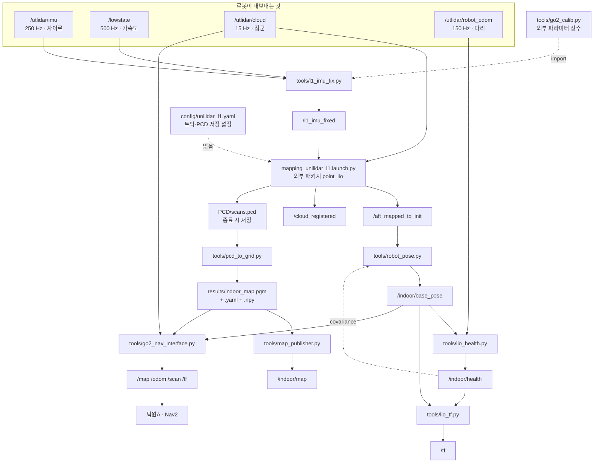

# 파일 의존 관계

각 파일이 무엇을 받고 무엇에 기대는지 정리했습니다.
갱신 2026-08-03 · 담당 효신

---

## 1. 전체 흐름



---

## 2. 파일별 의존

### `tools/go2_calib.py` — 외부 파라미터 상수

다른 파일들이 가져다 쓰는 원본입니다. 노드가 아니라 상수 모음입니다.

| 상수 | 값 | 뜻 |
|---|---|---|
| `R_LB` | 3×3 행렬 | 몸통 → 라이다 회전 (164.9° 기울어짐) |
| `R_BL` | `R_LB.T` | 라이다 → 몸통 |
| `LEVER` | (0.322, 0.005, 0.050) | 라이다 위치 (몸통 프레임) [m] |
| `ACC_REST_BODY` | 9.465 | 정지 시 본체 IMU 가속도 크기 |
| `ACC_SCALE_BODY` | 1.03614 | 9.807 / 9.465 |
| `EXPECTED_REST_ACC` | (1.66, −1.90, −9.48) | 정지 시 라이다 프레임 기대 가속도 |

**이 값들을 바꾸면 아래 절의 중복 문제를 먼저 해결해야 합니다.**

### `tools/l1_imu_fix.py`

```python
from go2_calib import R_LB, ACC_SCALE_BODY, EXPECTED_REST_ACC
```

| 받는 것 | `/utlidar/imu` (자이로), `/lowstate` (가속도) |
| 내는 것 | `/l1_imu_fixed` |
| 의존 | **`go2_calib.py`** |

L1 내부 IMU 는 164.9° 기울어 장착돼 있어 그대로 쓰면 중력 방향이 틀어집니다.
**모든 LIO 실험의 전제입니다.**

### `mapping_unilidar_l1.launch.py` — 외부 패키지

우리가 만든 것이 아닙니다.

| 위치 | `~/catkin_point_lio_unilidar/src/point_lio_ros2` |
| 노드 이름 | `laserMapping` |
| 소스 | `src/laserMapping.cpp` (C++) |
| 설정 | `config/unilidar_l1.yaml` |

우리가 건드린 것은 설정 세 줄뿐입니다.

```yaml
lid_topic:  "/utlidar/cloud"
imu_topic:  "/l1_imu_fixed"
pcd_save_en: true
```

내는 것: `/aft_mapped_to_init`, `/cloud_registered`, 종료 시 `PCD/scans.pcd`

### `tools/robot_pose.py`

| 받는 것 | `/aft_mapped_to_init`, `/indoor/health` |
| 내는 것 | `/indoor/base_pose` |
| 의존 | **없음 — 상수를 자체 보유** ⚠ |

`/aft_mapped_to_init` 은 라이다 위치입니다. 몸통 중심은 32 cm 뒤라 회전 시
어긋납니다. `LEVER` 로 보정합니다.

`/indoor/health` 를 받아 `pose.covariance[0]` 에 신뢰도를 싣습니다
(정상 0.01, 이상 1e6).

### `tools/lio_health.py`

| 받는 것 | `/indoor/base_pose`, `/utlidar/robot_odom` |
| 내는 것 | `/indoor/health`, `/indoor/health_info` |
| 의존 | 없음 |

`/utlidar/robot_odom`(다리 오도메트리)을 **기준**으로 씁니다. 장기적으로는
표류하지만(356 m 에 20 m) 단기 속도는 정확하므로 "로봇은 멈춰 있는데 LIO 가
움직인다"를 판정할 수 있습니다.

### `tools/lio_tf.py`

| 받는 것 | `/indoor/base_pose`, `/indoor/health` |
| 내는 것 | `/tf` (`indoor_map → base_link`) |
| 의존 | 없음 |

신뢰도가 나빠지면 TF 발행을 멈춥니다.

### `tools/pcd_to_grid.py`

| 받는 것 | `PCD/scans.pcd` (파일) |
| 내는 것 | `results/*.npy`, `*.pgm`, `*.yaml`, `*_preview.png` |
| 의존 | numpy, matplotlib |

토픽을 쓰지 않는 오프라인 도구입니다.

### `tools/map_publisher.py`

| 받는 것 | `results/*.yaml` + `*.pgm` (파일) |
| 내는 것 | `/indoor/map` (latched) |
| 의존 | numpy |

### `tools/go2_nav_interface.py`

| 받는 것 | `/indoor/base_pose`, `/utlidar/cloud`, 지도 파일 |
| 내는 것 | `/map`, `/odom`, `/scan`, `/tf` |
| 의존 | **없음 — 상수를 자체 보유** ⚠ |

Nav2 규약 이름으로 내보내는 다리입니다. 정적 TF 두 개(`map→odom`,
`base_link→utlidar_lidar`)도 이 노드가 냅니다.

### `tools/proximity_guard.py`

| 받는 것 | `/utlidar/cloud` (원시) |
| 내는 것 | `/indoor/safe`, `/indoor/obstacle` |
| 의존 | `go2_calib.py` (있으면 씀, 없으면 내장값) |

**LIO 에 의존하지 않습니다.** 위치가 발산해도 정상 동작합니다.

### `tools/run_indoor.sh`

source 하는 것:

```
/opt/ros/humble/setup.bash
~/unitree_ros2/cyclonedds_ws/install/setup.bash
~/catkin_point_lio_unilidar/install/setup.bash
~/setup_go2.sh                    (실시간 모드일 때만)
```

띄우는 것:

```
tools/l1_imu_fix.py
ros2 launch point_lio mapping_unilidar_l1.launch.py
ros2 run tf2_ros static_transform_publisher  ×2
tools/robot_pose.py
tools/lio_health.py
tools/map_publisher.py
tools/lio_tf.py
```

---

## 3. ⚠ 상수 중복 — 고쳐야 할 것

`R_LB` 와 `LEVER` 가 **세 곳**에 있습니다.

| 파일 | 방식 |
|---|---|
| `go2_calib.py` | 원본 |
| `l1_imu_fix.py` | `from go2_calib import` ✓ |
| `proximity_guard.py` | `import go2_calib` (없으면 내장값) ✓ |
| **`robot_pose.py`** | **자체 상수** ✗ |
| **`go2_nav_interface.py`** | **자체 상수** ✗ |

**`go2_calib.py` 를 고쳐도 아래 두 파일에는 반영되지 않습니다.**

라이다를 다시 장착하거나 재교정하면 값이 바뀌는데, 그때 일부만 갱신되어
위치가 조금씩 어긋나기 시작합니다. 증상이 미묘해서 원인 찾기가 어렵습니다.

**해결**: 두 파일이 `go2_calib` 을 import 하도록 바꾸십시오.

```python
import sys, os
sys.path.insert(0, os.path.dirname(os.path.abspath(__file__)))
from go2_calib import R_LB, LEVER
R_BL = R_LB.T
```

---

## 4. 외부 의존

| 대상 | 쓰는 곳 |
|---|---|
| ROS2 Humble | 전부 |
| `unitree_go` 메시지 | `l1_imu_fix.py` (`/lowstate`) |
| `point_lio` 패키지 | `run_indoor.sh` |
| `tf2_ros` | `lio_tf.py`, `run_indoor.sh`, `go2_nav_interface.py` |
| numpy | 대부분 |
| scipy | 부풀리기, 연결성 검사 |
| matplotlib | `pcd_to_grid.py` 미리보기 |
| `~/setup_go2.sh` | 로봇 연결 (CycloneDDS 설정) |

`setup_go2.sh` 는 저장소 밖(홈 디렉터리)에 있습니다. 새 PC 로 옮기실 때
잊기 쉬우므로 `install_go2_lio.sh` 가 함께 복사합니다.
