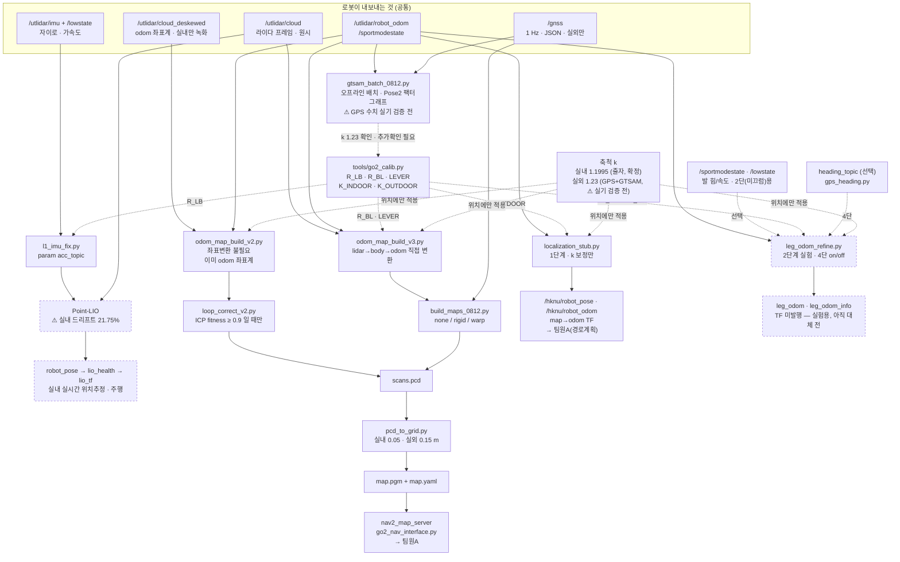
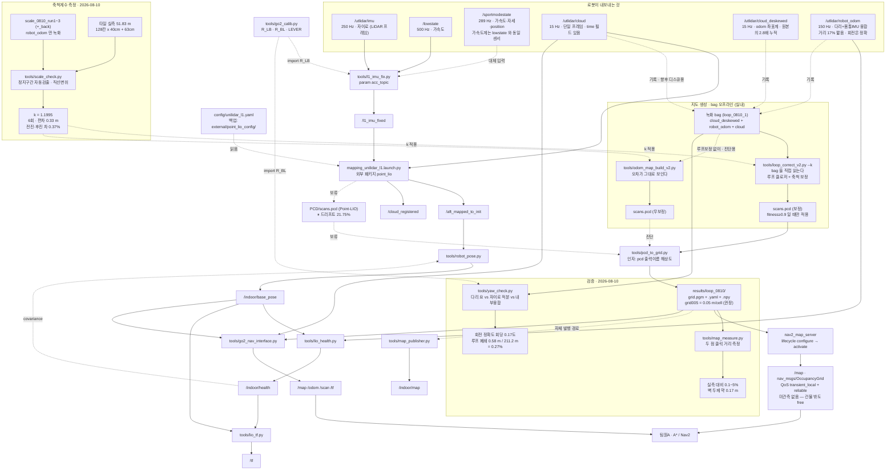
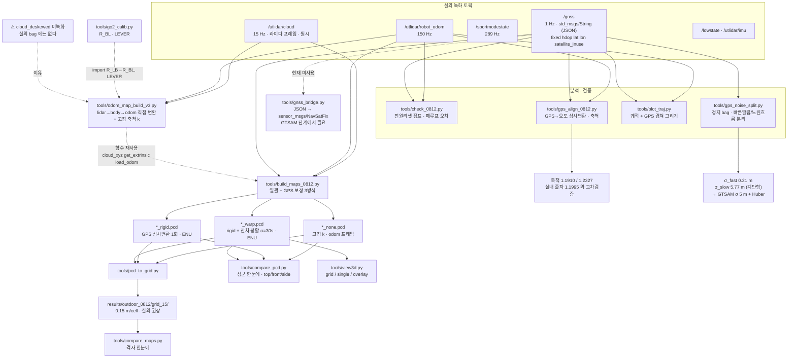
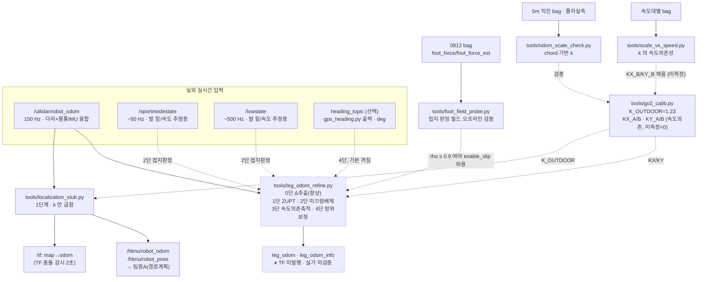

# 파일 의존 관계

각 파일이 무엇을 받고 무엇에 기대는지 정리했습니다.
갱신 2026-08-22 · 담당 효신

> **2026-08-13~19 갱신**: **실외 실시간 위치추정**이 새 네 번째 갈래(D)로
> 생겼습니다. `localization_stub.py`(1단계, k 보정 `map→odom`)와
> `leg_odom_refine.py`(2단계 실험, ZUPT·미끄럼배제·속도의존축척·방위보정을
> 단계별로 켜고 끌 수 있는 노드)입니다. 지도 생성(C)과는 무관한 실시간
> 경로입니다 — C 는 bag 오프라인으로 지도를 만들고, D 는 주행 중 좌표를
> 냅니다. `go2_calib.py` 에 `K_INDOOR`/`K_OUTDOOR`(=1.23) 중복 정의 버그가
> 있어 고쳤습니다. `gtsam_batch_0812.py` 오프라인 배치 최적화로 축척
> k=1.23 을 재확인했고(다음 작업 1번 일부 완료), GPS 위치오차 σ=5 m 를
> 실측으로 확정해 `gnss_bridge.py` 에 반영했습니다. 근거는
> `docs/COMMIT_PLAN_0813.md`, `docs/INTERFACE_outdoor.md` 3.2절.
>
> ⚠ **GPS 관련 수치(k=1.23, σ=5 m 등)는 전부 bag 오프라인 재분석이며
> 실기(로봇) 실시간 검증 전입니다 — 추가 확인 필요.** `gtsam_batch_0812.py`
> 의 Huber·hdop 가중 파라미터도 08-13 결론과 아직 안 맞습니다
> (`docs/COMMIT_PLAN_0813.md` "아직 안 한 것" 참고).

> **2026-08-12 갱신**: 실외 경로가 새로 생겼습니다. 실외 bag 에는
> `cloud_deskewed` 가 없어 `odom_map_build_v3.py` 가 원시 `/utlidar/cloud` 를
> 받아 `R_BL`·`LEVER` 로 직접 변환합니다. `/gnss` 를 쓰는 GPS 보정 경로
> (`build_maps_0812.py`)도 추가됐습니다. 근거는
> `results/outdoor_0812/NOTES.md`.

> **2026-08-07 갱신**: 지도 생성 경로가 바뀌었습니다. Point-LIO 의
> `PCD/scans.pcd` 대신 `odom_map_build.py` → `loop_correct_v2.py` 가 만든
> PCD 를 `pcd_to_grid.py` 가 받습니다. Point-LIO 관련 노드·설정은 지우지
> 않고 **보류**로 남겼습니다(실시간 위치추정에는 그대로 씁니다). 근거는
> `docs/2026-08-07_실험기록.md`.

---

## 0. 통합 개요 — 실내·실외 한 장

네 갈래가 있습니다. **실시간 위치추정**(Point-LIO, 실내), **실내 지도**,
**실외 지도**, 그리고 **실외 실시간 위치추정**(다리 오도메트리, 2026-08-13
신설). 지도 두 갈래는 입력 토픽 하나만 다르고 `pcd_to_grid.py` 부터 다시
합쳐집니다. D 는 지도를 만들지 않고 주행 중 좌표만 냅니다 — C(실외 지도)와는
입력 토픽만 겹칠 뿐 서로 독립입니다.



### 실내 vs 실외 — 무엇이 다른가

| | 실내 | 실외 |
|---|---|---|
| **입력 점군** | `/utlidar/cloud_deskewed` | `/utlidar/cloud` (원시) |
| **좌표 변환** | 불필요 (이미 odom) | `R_BL` + `LEVER` 2단계 |
| **모션 보정** | 되어 있음 | **안 됨** — 급회전 시 밀림 |
| **누적 도구** | `odom_map_build_v2.py` | `odom_map_build_v3.py` |
| **축척 출처** | `go2_calib.K_INDOOR` = 1.1995 (줄자, 고정) | `go2_calib.K_OUTDOOR` = 1.23 (GPS+GTSAM, ⚠ 실기 검증 전) |
| **드리프트 보정** | `loop_correct_v2.py` (ICP) | GPS `rigid`/`warp` |
| **좌표계** | odom (부팅 기준) | **ENU** (북쪽 위, 웨이포인트와 동일) |
| **격자 해상도** | 0.05 m | 0.15 m |
| **점 밀도** | 벽이 많아 조밀 | 개활지라 희소 |
| **동적 물체** | 적음 | 사람 — 유령 궤적 남음 |

### 실측 성적

| | 실내 | 실외 |
|---|---|---|
| 최고 폐루프 드리프트 | **0.275%** (loop_0810_1) | **0.31%** (loop1_1449, 276.7 m) |
| 자유공간 연결성 | 92% | 미측정 |
| 기준 산출물 | `results/loop_0810/grid005` | `results/outdoor_0812/grid_15/loop1_0812_1449_warp` |
| Point-LIO 비교 | 21.75% (⚠ 미해결) | 미실행 |

### 네 갈래의 관계

- **A(실시간·실내)** 는 지도 생성에 쓰지 않습니다. 주행 중 위치추정 전용입니다.
  Point-LIO 의 실내 드리프트 21.75% 는 원인 미규명 상태로 **보류**입니다.
- **B(실내 지도)** 는 완료됐습니다. 파이프라인·파라미터 모두 확정.
- **C(실외 지도)** 는 대회 코스처럼 GPS 웨이포인트만 있으면 지도가 굳이
  필요 없어, 현재는 D 가 주력이고 C 는 참고 자료로 남아 있습니다.
- **D(실외 실시간 위치추정)** 이 현행 주력입니다. 2026-08-13 1단계
  (`localization_stub.py`, k 보정만)로 시작해, 08-19 2단계 실험
  (`leg_odom_refine.py`)까지 왔습니다. 아직 GPS 앵커링(2단계)·GTSAM
  실시간화(3단계) 전이라 **웨이포인트 주행은 안 됩니다** (1-C절 참고).

네 갈래 모두 `go2_calib.py` 의 외부 파라미터에 의존합니다. **라이다를 다시
장착하거나 재교정하면 네 갈래가 한꺼번에 영향을 받습니다.**

---

## 1. 전체 흐름 — 실내



**읽는 법**: 위쪽(로봇 토픽 → `l1_imu_fix` → Point-LIO)은 실시간
위치추정·주행 경로로 현재도 그대로 씁니다. 가운데 `mapping` 상자가 지도를
만드는 실내 경로입니다 — LIO 를 거치지 않고 녹화된 bag 을 오프라인으로
직접 읽습니다. Point-LIO 가 저장하던 PCD 경로(점선, "보류")는 지우지
않았지만 지도 생성에는 더 이상 쓰지 않습니다.

---

## 1-B. 전체 흐름 — 실외 (2026-08-12 신설)



**읽는 법**: 실내와 갈라지는 지점은 **입력 토픽 하나**입니다. 실내는
`cloud_deskewed`(이미 odom 좌표계)를 그대로 쌓지만, 실외 bag 에는 그 토픽이
없어 원시 `/utlidar/cloud`(라이다 프레임)를 `R_BL`·`LEVER` 로 두 번 변환해야
합니다. 그 차이만 `odom_map_build_v3.py` 가 흡수하고, 이후 `pcd_to_grid.py`
부터는 실내와 완전히 같습니다.

GPS 보정(`rigid`/`warp`)은 **폐루프 경로에만** 유효합니다. 편도·직선 구간은
상사변환의 가로 방향 구속이 없어 축척이 GPS 노이즈를 흡수합니다
(slope_back 실측 1.7931 — 발산).

---

## 1-C. 전체 흐름 — 실외 실시간 위치추정 (2026-08-13~19 신설)

C(실외 지도)는 bag 을 오프라인으로 읽어 지도를 만듭니다. D 는 그와 무관하게
**주행 중** `/utlidar/robot_odom` 을 실시간으로 보정해 좌표를 냅니다.
현재 1단계와 2단계(실험)가 함께 존재합니다 — 아직 서로 대체 관계가 아니라
1단계가 기본이고, 2단계는 검증 중인 노드입니다.



**읽는 법**: `localization_stub.py`(1단계)가 지금 실제로 쓰는 유일한 실시간
출력입니다 — `/hknu/robot_pose`, `/hknu/robot_odom`, `map→odom` TF. k=1.23 을
곱할 뿐 절대 위치·방위는 고정하지 않아 **부팅 지점이 원점**입니다(GPS
웨이포인트를 아직 못 씀). `leg_odom_refine.py`(2단계)는 그 자리를 대체할
후보 노드로, 기본 파라미터로 돌리면 1단계와 수치적으로 동일하게 나오도록
설계됐습니다(회귀 없음 보장). **TF 는 전혀 발행하지 않으며**, `enable_slip`
은 `foot_field_probe.py` 검증 전까지 반드시 `False` 로 둡니다.

`run_outdoor_loc.sh`(1단계용)와 `run_leg_odom.sh`(2단계용)가 TF 리매핑
(`__ns:=/hknu`, `/tf`·`/tf_static` 은 전역 유지)을 고정해 실행 실수를
막습니다. **실내(`run_indoor.sh`)와 동시에 띄우면 안 됩니다** — 둘 다
`map→odom` 을 발행합니다.

> ⚠ **GPS 로 얻은 값(K_OUTDOOR=1.23, gnss_bridge σ=5 m, GTSAM 팩터
> 파라미터)은 전부 bag 재분석 결과이고 로봇 실기·실시간 검증 전입니다.**
> 앞으로 새 실외 bag 을 딸 때마다 `odom_scale_check.py`/`gtsam_batch_0812.py`
> 로 다시 확인하십시오. 노면(특히 눈)이 바뀌면 k 도 다시 잽니다.

---

## 2. 파일별 의존

### `tools/go2_calib.py` — 외부 파라미터 상수

다른 파일들이 가져다 쓰는 원본입니다. 노드가 아니라 상수 모음입니다.

| 상수 | 값 | 뜻 |
|---|---|---|
| `R_LB` | 3×3 행렬 | 몸통 → 라이다 회전 (164.9° 기울어짐) |
| `R_BL` | `R_LB.T` | 라이다 → 몸통 |
| `LEVER` | (0.322, 0.005, 0.050) | 라이다 위치 (몸통 프레임) [m] |
| `ACC_REST_BODY` | 9.465 | 정지 시 본체 IMU 가속도 크기 |
| `ACC_SCALE_BODY` | 1.03614 | 9.807 / 9.465 |
| `EXPECTED_REST_ACC` | (1.66, −1.90, −9.48) | 정지 시 라이다 프레임 기대 가속도 |
| `K_INDOOR` | 1.1995 | 실내 축척 (줄자 실측, 고정) |
| `K_OUTDOOR` | 1.23 | 실외 축척 (GPS+GTSAM, ⚠ 실기 검증 전) |
| `KX_A, KX_B` | (1.23, 0.0) | `leg_odom_refine.py` 3단 · 전진방향 속도의존 축척. B=0 이면 K_OUTDOOR 과 동일 |
| `KY_A, KY_B` | (1.23, 0.0) | 같음 · 횡방향. `scale_vs_speed.py` 로 B 를 채울 것(미측정) |

**이 값들을 바꾸면 아래 절의 중복 문제를 먼저 해결해야 합니다.**

> **2026-08-13 갱신**: `K_INDOOR`/`K_OUTDOOR` 블록이 주석까지 통째로
> 두 번 정의돼 있던 버그를 고쳤습니다(위쪽만 고치면 아래쪽이 조용히
> 덮어쓰는 구조였음). `build_maps_0812.py`, `odom_map_build_v3.py` 의
> `--k` 기본값도 이제 하드코딩 대신 `K_OUTDOOR` 을 직접 import 합니다.

### `tools/l1_imu_fix.py`

```python
from go2_calib import R_LB, ACC_SCALE_BODY, EXPECTED_REST_ACC
```

| 받는 것 | `/utlidar/imu` (자이로), `/lowstate` 또는 `/sportmodestate` (가속도) |
| 내는 것 | `/l1_imu_fixed` |
| 의존 | **`go2_calib.py`** |
| 파라미터 | `acc_topic` (기본 `/lowstate`), `frame_id`, `acc_scale`, `rest_check` |

L1 내부 IMU 는 164.9° 기울어 장착돼 있어 그대로 쓰면 중력 방향이 틀어집니다.
**모든 LIO 실험의 전제입니다.**

> **2026-08-12 갱신**: 가속도 출처를 `acc_topic` 파라미터로 뺐습니다.
> `/lowstate`(500 Hz)와 `/sportmodestate`(289 Hz)의 `imu_state.accelerometer`
> 는 **같은 센서**입니다(2026-08-10 확인: |a| 평균 9.4960 vs 9.4947, 축별
> 평균도 일치). bag 에 `/lowstate` 가 없을 때 대체용입니다. WiFi 대역폭이
> 빠듯해 `/lowstate` 를 빼고 녹화한 경우가 여기 해당합니다.

> **2026-08-18 재검증 (실험 1~4)**: `exp1_gravity_record.py`(정지 중력방향),
> `exp2_motion_record.py`(직진·회전 상관계수)로 이 파일의 `R_LB` 회전과
> `ACC_SCALE_BODY` 를 다시 확인했습니다. 결론은 기존 상수와 동일 — 값은
> 바뀌지 않았고 근거만 보강됐습니다. 실험 4(`실험4_오도메트리신뢰도_결과.md`)
> 는 odom 자체의 내부 일관성(위치 미분 vs twist)을 점검해, 향후 odom 을
> "정답지"로 쓰는 실험(3단계 leg_odom_refine 검증 등)의 전제를 뒷받침합니다.
> 결과 문서: `docs/실험1_정지중력방향_결과.md` ~ `실험4_오도메트리신뢰도_결과.md`.

### `mapping_unilidar_l1.launch.py` — 외부 패키지

우리가 만든 것이 아닙니다.

| 위치 | `~/catkin_point_lio_unilidar/src/point_lio_ros2` |
| 노드 이름 | `laserMapping` |
| 소스 | `src/laserMapping.cpp` (C++) |
| 설정 | `config/unilidar_l1.yaml` |

우리가 건드린 것은 설정 세 줄뿐입니다.

```yaml
lid_topic:  "/utlidar/cloud"
imu_topic:  "/l1_imu_fixed"
pcd_save_en: true
```

내는 것: `/aft_mapped_to_init`, `/cloud_registered`, 종료 시 `PCD/scans.pcd`

> ⏸ **2026-08-07 갱신**: 종료 시 저장하는 `PCD/scans.pcd` 는 지도 생성에
> **더 이상 쓰지 않습니다** (같은 bag 기준 드리프트 21.75%, 원인 미규명 —
> 보류). `/aft_mapped_to_init` 을 쓰는 실시간 위치추정 경로는 그대로
> 유효합니다. 이 설정 파일의 diff·이력 전문은 `external/point_lio_config/`
> 에 백업돼 있습니다(`external/README.md`).

> 📌 **미검증 항목**: `extrinsic_T` 가 Unitree 예제값 `[0.0077, 0.0147,
> -0.0067]`(크기 0.018 m)로 남아 있습니다. 그러나 `/l1_imu_fixed` 의 가속도는
> **몸통 IMU 위치**의 값(브리지가 회전만 시키고 평행이동은 안 함)이므로 실제
> IMU→라이다 변위는 **0.327 m**, 약 18배 차이입니다. `extrinsic_R` 은 항등이
> 맞습니다(브리지에서 회전을 이미 맞춤). B 조건에서 `extrinsic_T` 를 바꿔본
> 적은 없습니다. 다만 회차마다 성공/실패가 갈리는 비재현성은 상수 오차로
> 설명되지 않아, 단독 원인일 가능성은 낮습니다.

### `tools/odom_map_build.py` / `odom_map_build_v2.py` — 점군 누적 (실내)

| 받는 것 | 녹화 bag 안의 `/utlidar/cloud_deskewed` (파일, 오프라인) |
| 내는 것 | `PCD/scans.pcd` (voxel 다운샘플, 기본 0.05 m) |
| 의존 | open3d, rosbag2_py, sensor_msgs_py |

LIO 를 거치지 않습니다. `cloud_deskewed` 가 이미 다리 오도메트리와 같은
odom 좌표계이므로 좌표 변환 없이 그대로 누적합니다. bag 재생이 필요 없고
파일을 직접 읽습니다. v2 는 축척 보정 `k` 를 추가한 것입니다.

축척 보정 원리: 오차는 로봇 위치 `t(t)` 에만 있고 회전 `R(t)` 와 스캔
`p_body` 는 참값이므로, `p'(t) = p_odom(t) + (k-1)·t(t)` 로 각 프레임을
밀면 궤적만 k 배가 되고 스캔 자체는 그대로 남습니다.

### `tools/odom_map_build_v3.py` — 점군 누적 (실외, 2026-08-12 신설)

```python
from go2_calib import R_LB, LEVER      # R_BL = R_LB.T
```

| 받는 것 | 녹화 bag 안의 **`/utlidar/cloud`**(원시), `/utlidar/robot_odom` |
| 내는 것 | `scans.pcd` |
| 의존 | **`go2_calib.py`**, open3d, sqlite3 직접 읽기 |

**v2 와의 차이는 입력 토픽 하나입니다.** v2 가 쓰는 `cloud_deskewed` 는 이미
odom 좌표계라 변환이 필요 없지만, `/utlidar/cloud` 는 **라이다 프레임**이라
두 단계를 직접 해야 합니다.

```
p_body = R_BL · p_lidar + LEVER
p_odom = R_odom(t) · p_body + t_odom(t)
```

축척 보정은 v2 와 동일합니다(위치에만 적용).

주요 인자: `voxel`(실외 권장 0.15), `--k`(기본 `go2_calib.K_OUTDOOR`=1.23),
`--min-range` 0.6, `--max-range` 40, `--stride`, `--max-dt` 0.05,
`--invert-extrinsic`.

> ⚠ 원시 `cloud` 는 **모션 보정(deskew)이 안 되어 있습니다.** 회전이 빠르면
> 스캔이 밀립니다. 0812 폐루프는 제자리 회전을 피하고 호를 그리며 돌아
> 영향이 작았습니다(지면 봉우리 단일 유지 확인).

> 📌 `sensor_msgs_py.read_points_numpy` 는 못 씁니다. L1 점군은 `x,y,z`
> (float32)와 `ring`(uint16)의 datatype 이 섞여 있어 assertion 에 걸립니다.
> 버퍼 오프셋에서 직접 뜯는 `cloud_xyz()` 를 씁니다.

### `tools/build_maps_0812.py` — 일괄 + GPS 보정 (2026-08-12 신설)

```python
from odom_map_build_v3 import cloud_xyz, get_extrinsic, load_odom, \
                              nearest_odom, open_bag, quat_to_R, topic_id
```

| 받는 것 | bag 폴더들의 `/utlidar/cloud`, `/utlidar/robot_odom`, `/gnss` |
| 내는 것 | `<bag>_<mode>.pcd` × 방식 수, 그리고 `pcd_to_grid.py` 를 호출해 격자 |
| 의존 | **`odom_map_build_v3.py`**, **`go2_calib.py`**, **`pcd_to_grid.py`**, open3d |

보정 방식 세 가지:

| 방식 | 하는 일 | 좌표계 | 축척 출처 |
|---|---|---|---|
| `none` | 고정 k 만 적용 | odom (부팅 기준) | `--k` 기본 `go2_calib.K_OUTDOOR`(=1.23, 2026-08-13부터 하드코딩 아님) |
| `rigid` | GPS ENU 에 상사변환 1회 (yaw·축척·평행이동) | **ENU** | 그 bag 의 GPS |
| `warp` | rigid + 잔차를 σ초 가우시안으로 평활해 더함 | **ENU** | 그 bag 의 GPS |

`rigid` 는 전역 변환 하나뿐이라 GPS 순간 노이즈가 지도에 섞이지 않습니다.
`warp` 는 저주파 성분만 남겨 서서히 쌓인 드리프트를 잡습니다
(loop_correct_v2 의 증분 궤적 변형과 같은 발상).

> ⚠ **`rigid`/`warp` 는 폐루프 전용입니다.** 직선 궤적은 상사변환의 가로
> 방향 구속이 없어 축척이 GPS 노이즈를 흡수합니다. slope_back(편도) 실측
> 축척 1.7931, 잔차 RMS 13.17 m — 발산. 편도 구간은 `none` 을 쓰십시오.

> GPS fix 가 20개 미만이면 `rigid`/`warp` 는 자동으로 건너뜁니다
> (slope_out_1403 은 `fixed:0` 뿐이라 `none` 만 생성됨).

### `tools/gtsam_batch_0812.py` — 오프라인 배치 팩터그래프 (2026-08-13 신설)

```python
from go2_calib import K_OUTDOOR
```

| 받는 것 | bag 안의 `/utlidar/robot_odom`, `/gnss` |
| 내는 것 | `results/outdoor_0812/gtsam/<bag>_gtsam.png`, `_poses.npz` |
| 의존 | **`go2_calib.py`**, **gtsam**(`pip3 install gtsam`), numpy |

`build_maps_0812.py` 의 `rigid`(전역 상사변환 1회) / `warp`(사람이 정한
평활 세기)를 대신해, 두 센서의 신뢰도(sigma)로 최적점을 계산합니다.

- 변수: `Pose2(x, y, theta)` — GPS 시각마다 하나(1 Hz, 약 320개). **3D 가
  아닌 이유**는 다리 오도메트리 z 가 고도가 아니고 GPS 고도 필드도 없어서,
  관측 없는 변수를 넣으면 최적화가 불안정해지기 때문입니다.
- 팩터: `BetweenFactorPose2`(오도메트리 증분), `PriorFactorPose2`(GPS 위치,
  GTSAM 의 `GPSFactor` 가 Pose3 전용이라 이 방식을 씀), 첫 자세 프라이어.
- GPS 팩터에 Huber(1.345) 로버스트 — 0812 정지 실측에서 GPS 오차가 연속
  표류가 아니라 계단형 점프로 나타났기 때문입니다.
- k 를 스윕해 GPS 잔차가 최소인 지점을 찾음 → **k=1.23 확정**(실내 줄자
  1.1995, GPS 정렬 1.1910/1.2327 과 함께 교차검증).

> ⚠ **Huber·hdop 가중 파라미터가 08-13 GPS 재분석 결론과 아직 안 맞습니다.**
> hdop 가중은 폐기해야 하고(hdop 가 오차의 예측자가 아니었음, 아래
> `gnss_bridge.py` 참고), Huber δ 를 7.5 m 로 원하면 정규화 잔차 기준
> 1.5 를 넣어야 합니다(현재 1.345). `docs/COMMIT_PLAN_0813.md` "아직 안
> 한 것" 참고 — 실시간 코드로 옮기기 전에 고칠 것.

### `tools/localization_stub.py` — 실외 위치추정 1단계 (2026-08-13 신설)

```python
from go2_calib import K_OUTDOOR as K_DEFAULT
```

| 받는 것 | `/utlidar/robot_odom` |
| 내는 것 | `/hknu/robot_odom`(`nav_msgs/Odometry`), `/hknu/robot_pose`(`PoseWithCovarianceStamped`), `/tf`(`map→odom`) |
| 의존 | **`go2_calib.py`**(못 찾으면 즉시 실패 — 기본값을 지어내지 않음), tf2_ros |
| 실행 | `tools/run_outdoor_loc.sh` (TF 리매핑 고정) |

`/hknu` 네임스페이스 밑에 상대 이름으로 발행하고 실행 시 `__ns:=/hknu` 를
씌웁니다. `map→odom` 을 매 프레임 `(k-1)·p` 로 계산해 축척 오차를
상쇄합니다(회전은 그대로 — 축척의 영향을 받지 않음). z 는 축척을 곱하지
않고 그대로 통과(고도가 아니므로).

**하지 않는 것**: 절대 위치·방위 고정(부팅 지점이 원점, GPS 웨이포인트로
못 바꿈), IMU yaw 표류 보정, 루프 폐합·GPS 융합·지도 작성.

발행 전 2초간 `/tf` 를 엿들어 같은 연결선(`map→odom`)의 주인이 이미
있는지 확인하는 **TF 충돌 감시**가 있습니다(`tf_guard` 파라미터). 그래도
실행 순서에 따라 빠져나갈 수 있어 `ros2 run tf2_tools view_frames` 로
직접 확인하는 편이 안전합니다.

**실내(`go2_nav_interface.py`)와 동시에 띄우지 마십시오** — 둘 다
`map→odom` 을 발행합니다.

### `tools/leg_odom_refine.py` — 다리 오도메트리 증분 보정 (2단계 실험, 2026-08-19 신설)

```python
from go2_calib import KX_A, KX_B, KY_A, KY_B
```

| 받는 것 | `/utlidar/robot_odom`(필수), `/sportmodestate`·`/lowstate`(2단용, 선택), `heading_topic`(4단용, 선택, 기본 꺼짐) |
| 내는 것 | `leg_odom`(`nav_msgs/Odometry`), `leg_odom_info`(`std_msgs/String` JSON) |
| 의존 | **`go2_calib.py`**, `foot_field_probe.py` 로 2단 사전검증 필요 |
| 실행 | `tools/run_leg_odom.sh` |

`localization_stub.py` 의 스칼라 k 곱셈을 프레임 간 **증분(Δ)** 단위로
다시 짜서 네 단계를 독립적으로 켜고 끌 수 있게 한 실험 노드입니다.

| 단계 | 내용 | 기본값 |
|---|---|---|
| 0단 | Δ 추출(절대 위치 → body 프레임 증분) | 항상 켬 |
| 1단 | ZUPT — 정지 중 Δ=0 | `enable_zupt=False` |
| 2단 | 미끄럼배제 — 발 힘/속도로 접지 신뢰도 가중 | `enable_slip=False` |
| 3단 | 속도의존 축척 `k_x(v)=KX_A+KX_B·v`, `k_y(v)` | `enable_scale=True`, B=0 |
| 4단 | 방위 보정 — 외부 heading 으로 yaw 대체 | `enable_heading=False` |

**회귀 없음 보장**: 기본 파라미터(1·2·4단 꺼짐, `kx_b=ky_b=0`)로 돌리면
이 노드의 출력은 `localization_stub.py` 와 수치적으로 같습니다(누적
시작점을 첫 메시지 위치에 `k` 를 미리 곱해 anchor 로 잡아 텔레스코핑이
성립하도록 설계).

**하지 않는 것**: `/tf` 를 전혀 발행하지 않습니다(TF 소유권은
`localization_stub.py`). z 축에 축척을 곱하지 않습니다. twist 에 k 를
중복으로 곱하지 않도록(기존 `localization_stub.py` 의 `k²` 버그로 보이는
부분을 이 노드는 재계산으로 피함) 위치의 시간미분으로 twist 를 다시
채웁니다.

> ⏸ **`enable_slip` 은 `foot_field_probe.py` 결과가 나오기 전까지 반드시
> `False` 로 둡니다.** `foot_speed_body` 필드는 이 저장소에서 검증된 적이
> 없습니다.

> Go2 가 내는 세 토픽(`robot_odom`, `lowstate`, `sportmodestate`)은 전부
> `qos_profile_sensor_data`(BEST_EFFORT)로 구독합니다 — `survey_topics.py`
> 에서 겪은 QoS 이중 구독 버그(BEST_EFFORT 발행자에 RELIABLE 로 구독하면
> 콜백이 조용히 안 불림) 때문입니다.

### `tools/foot_field_probe.py` — 접지 판정 필드 사전검증 (2026-08-19 신설)

| 받는 것 | bag 안의 `/lowstate`(`foot_force`/`foot_force_est`), `/sportmodestate`(`foot_speed_body`), `/utlidar/robot_odom` |
| 내는 것 | 표준출력 — `rho = corr(발 속도로 계산한 몸통 속도, robot_odom twist)` |
| 의존 | numpy. **rclpy 노드 아님** — bag 오프라인 스크립트 |

`leg_odom_refine.py` 2단(미끄럼배제)을 켜기 전 필수 절차입니다. 판정 기준은
L1 라이다 가속도계를 기각할 때 쓴 것과 동일: `rho ≥ 0.9` 면 2단 진행,
`rho < 0.9` 면 2단 영구 폐기(그때 L1 가속도계는 `rho=0.19` 로 기각).

기본 bag 은 `scale_vs_speed.py` 와 동일한 `go2_loop1_0812_1449`.

### `tools/odom_scale_check.py` — 축척계수 k 재검증, chord 기반 (2026-08-13 신설)

| 받는 것 | 정지→직진→정지 bag 의 `/utlidar/robot_odom`, `/sportmodestate` |
| 내는 것 | 표준출력 — 두 소스 일치 여부, `--truth <m>` 주면 k = 실측/측정 |
| 의존 | numpy |

경로장(path length)은 보행 진동이 그대로 더해져 과대평가되므로, 시작-끝
**직선거리(chord)** 로 잽니다. 시작·끝 각 2초 이상 정지 구간의 평균 위치를
씁니다(`--settle` 로 조절). k 를 다시 잴 때 표준 절차:

```bash
python3 tools/odom_scale_check.py <5m_직진_bag> --truth 5.00
```

### `tools/scale_vs_speed.py` — 축척계수의 속도 의존성 (2026-08-13 신설)

| 받는 것 | bag 안의 `/sportmodestate`, `/gnss` |
| 내는 것 | 구간별 GPS/오도 변위비 vs 속도 |
| 의존 | numpy |

`leg_odom_refine.py` 3단(`KX_B`, `KY_B`)을 채우기 위한 실측 도구입니다.
K_OUTDOOR 이 GPS 정렬마다 1.1910~1.2327 로 흩어지는 것이 속도 의존성 때문일
가능성을 조사합니다. **현재 미측정** — `go2_calib.py` 의 `KX_B=KY_B=0` 은
이 도구의 결과를 아직 반영하지 않은 상태입니다.

### `tools/elev_from_pitch.py` — IMU 피치 적분 고도 추정 (2026-08-13 신설)

| 받는 것 | bag 안의 `/sportmodestate`(위치·이동거리), `/lowstate`(`imu_state.rpy[1]` 피치) |
| 내는 것 | `results/outdoor_0812/figs/elev_from_pitch.png` 등 — 추정 고도 변화 |
| 의존 | numpy, matplotlib |

4장의 "다리 오도메트리 z 는 고도가 아니다" 문제에 대한 실험적 해법입니다.
피치는 중력 기준이라 표류가 없으므로(yaw 는 분당 2~5° 표류하지만 roll·pitch
는 가속도계가 계속 중력 방향을 봄), `dz = Σ sin(pitch_i)·ds_i` 로 고도
변화를 근사합니다(`ds` 는 축척 k 적용된 오도메트리 이동거리).

> ⚠ **전제 미검증**: "몸통 피치 == 지면 경사"가 성립해야 합니다. 제어기가
> 몸통을 수평으로 유지하려 들면 경사에서도 피치가 0 에 가깝게 나와 이 방법이
> 무너집니다. 평지 폐루프(`loop1_1449`)에서 `dz~0` 이 나오는지가 1차 판정
> 기준입니다.

### `tools/gps_align_0812.py` — GPS↔오도메트리 정렬 분석 (2026-08-12)

| 받는 것 | bag 안의 `/sportmodestate`, `/gnss` |
| 내는 것 | 표준출력 — GPS 원시 폐루프 오차, 오도 폐루프 오차, 상사변환 축척·yaw·잔차 |
| 의존 | numpy |

**축척 교차검증의 출처입니다.** 실내 줄자 1.1995 와 독립적으로
1.1910(1440) / 1.2327(1449) 를 얻었습니다.

### `tools/gps_noise_split.py` — GPS 오차 성분 분리 (2026-08-12)

| 받는 것 | **정지** bag 의 `/gnss` (기본 `gps_static_0812_1415`) |
| 내는 것 | σ_fast, σ_slow, σ_total, 권장 GTSAM σ, `--plot` 시 PNG |
| 의존 | numpy, (선택) matplotlib |

정지 상태라 참값이 상수인 점을 이용합니다. 인접 fix 간 차이로 빠른 떨림을,
win 초 이동평균의 이동으로 느린 흐름을 잽니다.

0812 실측(콜드스타트 직후, 위성 4.5, hdop 2.11):

- σ_fast **0.21 m** — 예상보다 훨씬 정밀
- σ_slow **5.77 m** — 연속 표류가 아니라 **계단형 점프 2회**(해 갈아탐)
- → GTSAM GPS factor σ **5 m** 시작 + **Huber 로버스트** + **hdop 가중**

### `tools/check_0812.py` — bag 무결성·폐루프 점검 (2026-08-12)

| 받는 것 | bag 안의 `/sportmodestate`, `/gnss` |
| 내는 것 | 표준출력 — 위치 점프(전원 리셋 흔적), 경로장, 시종점차, 드리프트 %, yaw 차, fixed 분포 |
| 의존 | numpy |

> ⚠ 드리프트 % 는 **폐루프에서만** 의미가 있습니다. 편도 구간(slope_*)의
> 59%·62% 는 무시하십시오.

### `tools/plot_traj.py` — 궤적 시각화 (2026-08-12)

| 받는 것 | bag 안의 `/sportmodestate`, `/gnss` |
| 내는 것 | `<bagdir>/plots/traj_<name>.png`, `traj_all.png` |
| 의존 | numpy, matplotlib |

GPS(ENU)와 오도메트리를 정렬해 겹쳐 그립니다. 파랑이 매끄럽고 주황이 그
주위에서 떠는 형태가 정상입니다.

### `tools/compare_pcd.py` / `compare_maps.py` / `view3d.py` — 비교·조망 (2026-08-12)

| | 받는 것 | 내는 것 |
|---|---|---|
| `compare_pcd.py` | `results/**/*.pcd` | 점군 top/front/side 격자 배치 PNG |
| `compare_maps.py` | `grid*/map.pgm` + `map.yaml` | 격자 나란히 배치 PNG |
| `view3d.py` | `*.pcd` | Open3D 대화형 창 (`grid`/`single`/`overlay`) |

`view3d.py --mode overlay` 가 `none`/`rigid`/`warp` 정렬 비교에 가장
유용합니다.

### `tools/gnss_bridge.py` — JSON → NavSatFix (현재 미사용, 2026-08-13 공분산 재계산)

| 받는 것 | `/gnss` (`std_msgs/String`, JSON) |
| 내는 것 | **`/fix`**(`sensor_msgs/NavSatFix`) — 2026-08-13 이전에는 `/gps/fix` |

**여전히 0812/오프라인 분석에서는 쓰지 않습니다.** 아래 스크립트들이 bag 에서
JSON 을 직접 파싱합니다. **GTSAM 이 실시간으로 옮겨갈 때** 이 브리지를
쓰게 됩니다.

`/gnss` JSON 필드: `fixed`(0/1), `hdop`, `latitude`, `longitude`,
`satellite_total`, `satellite_inuse`, `timestamp`(Unix).

> ⚠ **`fixed:1` 만으로 부족합니다.** 콜드 스타트 중에는 `fixed:0` 이면서
> 마지막으로 잡았던 좌표를 그대로 들고 있습니다(0812 실측: 9일 전 좌표와
> timestamp). `satellite_inuse ≥ 4` 와 **timestamp 갱신**을 함께 확인하십시오.

> **2026-08-13 갱신 — 공분산 산출 방식 변경**: `sigma_h = hdop * UERE`
> 대신 `UERE=4.0` 로 hdop≈1.2 기준 σ≈5 m 가 되도록 맞췄습니다(`SIGMA_MIN`
> 2.0 / `SIGMA_MAX` 25.0 으로 클램프). `gps_vs_odom.py` 분석에서 hdop 가
> 위치오차의 예측자가 아니었기 때문입니다(스파이크 구간 잔차 1.59 m <
> 정상 구간 2.15 m). **함께 발견한 버그**: `max_hdop` 기본값이 5.0 이라
> hdop 5.10 스파이크 구간이 통째로 `STATUS_NO_FIX` 로 버려지고 있었습니다
> (잔차가 가장 작았던 샘플을 σ=1000 m 취급한 셈) — 20.0 으로 올렸습니다.
> ⚠ 이 σ=5 m 도 GPS 관련 다른 수치와 마찬가지로 bag 재분석 결과이며
> 실기 검증 전입니다.

### `tools/gps_vs_odom.py` / `check_gnss_0812.py` / `plot_gnss_quality.py` / `scan_gnss_bags.py` / `survey_topics.py` — GPS 품질 재분석 5종 (2026-08-13 신설)

| | 받는 것 | 내는 것 | 목적 |
|---|---|---|---|
| `gps_vs_odom.py` | bag `/gnss`, `/sportmodestate` | 잔차 PNG | hdop 불량 구간이 실제로 틀어졌나 — leg odom(0.31% 드리프트)을 기준으로 상사변환 잔차 비교. **σ=5m 의 직접 근거** |
| `check_gnss_0812.py` | bag `/gnss` | 표준출력 | bag 의 hdop 분포로 UERE 재산정. **내부 UERE 재산정 로직은 08-13 결론과 안 맞아 폐기됨** — 실행은 되지만 결과를 신뢰하지 말 것 |
| `plot_gnss_quality.py` | bag `/gnss` | PNG | hdop 스파이크가 시간·궤적 어디서 났는지 (콜드스타트 vs 지형 multipath 구분) |
| `scan_gnss_bags.py` | bag 여러 개 | 표준출력 한 줄씩 | 유선(랜투랜)/무선(공유기) 녹화본의 GPS 품질 비교 |
| `survey_topics.py` | 로봇 연결 상태(실기) | 표준출력/파일 — 토픽별 주기·샘플 | 발행자 있는 토픽만 관찰(무한대기 방지), 점군/이미지는 헤더·크기만 기록 |

전부 노드가 아니라 bag/실기를 직접 읽는 오프라인 스크립트입니다(rosbag2_py
또는 rclpy 구독).

> **2026-08-13 버그 수정**: `survey_topics.py` 가 BEST_EFFORT 와 RELIABLE
> 구독을 동시에 걸어 RELIABLE 발행자의 콜백이 두 번 불려 주기가 2배로
> 잘못 계산되던 문제를 고쳤습니다(BEST_EFFORT 하나만 걸면 양쪽 발행자와
> 모두 매칭됨 — `leg_odom_refine.py` 가 이 교훈을 그대로 따릅니다).

### `tools/play_bag_rviz.sh` — bag 재생 + RViz (2026-08-13 신설)

| 인자 | `<bag> [배속(기본 0.5)]` |

bag 안의 토픽을 확인해 RViz 설정을 그 bag 에 맞춰 생성하고, RViz 와 bag
재생을 함께 띄웁니다. **QoS 를 Best Effort 로 맞추는 것이 핵심** — 기본
Reliability 로 두면 토픽은 보이는데 점이 하나도 안 뜨는 문제가 있었습니다.
`source`/`./` 겸용, 서브셸로 감싸 `set -o pipefail`·trap 이 호출한 셸로
새지 않습니다. `set -u` 는 쓰지 않습니다(ROS 환경 source 시 `$AMENT_TRACE_SETUP_FILES`
미정의로 즉시 죽는 문제 회피).

### `tools/loop_correct_v2.py` — 루프 클로저 (실내)

| 받는 것 | 녹화 bag 안의 `/utlidar/cloud_deskewed`, `/utlidar/robot_odom` |
| 내는 것 | 보정된 `scans.pcd` |
| 의존 | open3d, rosbag2_py, sensor_msgs_py |

증분 재적분 방식. 출발-도착 오차를 걸음 수에 비례해 나눠 배분해 국소
모양을 보존합니다. **ICP `fitness ≥ 0.9` 일 때만 적용** — 낮으면
`odom_map_build.py` 의 무보정 출력을 그대로 씁니다. v1(`loop_correct.py`,
전역 나선 변환)은 회전 중심에서 먼 점을 크게 밀어내는 구조적 결함으로
**폐기**됐습니다(참고용으로만 보관).

> 실외에는 아직 적용하지 않았습니다. 개활지는 정합에 쓸 구조물이 적어
> fitness 0.9 를 넘기 어렵고, 0812 폐루프는 이미 0.31% 라 보정 없이도
> 쓸 만합니다.

### `tools/robot_pose.py`

| 받는 것 | `/aft_mapped_to_init`, `/indoor/health` |
| 내는 것 | `/indoor/base_pose` |
| 의존 | **없음 — 상수를 자체 보유** ⚠ |

`/aft_mapped_to_init` 은 라이다 위치입니다. 몸통 중심은 32 cm 뒤라 회전 시
어긋납니다. `LEVER` 로 보정합니다.

`/indoor/health` 를 받아 `pose.covariance[0]` 에 신뢰도를 싣습니다
(정상 0.01, 이상 1e6).

### `tools/lio_health.py`

| 받는 것 | `/indoor/base_pose`, `/utlidar/robot_odom` |
| 내는 것 | `/indoor/health`, `/indoor/health_info` |
| 의존 | 없음 |

`/utlidar/robot_odom`(다리 오도메트리)을 **기준**으로 씁니다. 장기적으로는
표류하지만(356 m 에 20 m) 단기 속도는 정확하므로 "로봇은 멈춰 있는데 LIO 가
움직인다"를 판정할 수 있습니다.

### `tools/lio_tf.py`

| 받는 것 | `/indoor/base_pose`, `/indoor/health` |
| 내는 것 | `/tf` (`indoor_map → base_link`) |
| 의존 | 없음 |

신뢰도가 나빠지면 TF 발행을 멈춥니다.

### `tools/pcd_to_grid.py`

| 받는 것 | `scans.pcd` (파일) |
| 내는 것 | `<out>.npy`, `.pgm`, `.yaml`, `_preview.png` |
| 의존 | numpy, matplotlib |

토픽을 쓰지 않는 오프라인 도구입니다. 입력 PCD 의 출처가 무엇이든(Point-LIO,
`odom_map_build_v2`, `odom_map_build_v3`) 형식이 같아 도구 자체는 그대로입니다.
2026-08-07 에 지면 추정 버그(최빈 bin 왼쪽 끝 → 중앙)를 고쳤습니다.

> ⚠ **인자 순서 주의**: `pcd_to_grid.py <pcd> <출력이름> <해상도>` 입니다.
> 해상도를 두 번째에 넣으면 그것이 **파일 이름**이 되고 해상도는 기본
> 0.05 로 남습니다(2026-08-12 에 `0.15.pgm` 이 생겨 확인).

> 실외 권장 해상도는 **0.15 m** 입니다. 0.05 로 하면 726만 칸에 장애물이
> 1만 칸(0.1%)뿐이라 지나치게 성깁니다. 0.15 에서는 2.0% 로 올라갑니다.

> 📌 지면 밴드가 전역 상수입니다. 실외는 지면 자체에 기복이 있어
> **셀별 국소 밴드**로 바꾸는 것이 낫습니다(미적용).

### `tools/pcd_view.py`

| 받는 것 | `*.pcd` |
| 내는 것 | `pcd_view_top/front/side/hist.png` (현재 디렉터리) |

> ⚠ **"z 범위 → 발산 의심" 경고는 실내 천장 기준입니다.** 실외는 나무·펜스·
> 건물이 있어 6~7 m 가 정상입니다. 실제 발산은 z 가 수십 m 로 튀고 점이
> 방사형으로 퍼집니다. 지면 추정값이 0.0~0.2 m 로 얇게 잡히면 정상입니다.

### `tools/map_publisher.py`

| 받는 것 | `results/*.yaml` + `*.pgm` (파일) |
| 내는 것 | `/indoor/map` (latched) |
| 의존 | numpy |

### `tools/go2_nav_interface.py`

| 받는 것 | `/indoor/base_pose`, `/utlidar/cloud`, 지도 파일 |
| 내는 것 | `/map`, `/odom`, `/scan`, `/tf` |
| 의존 | **없음 — 상수를 자체 보유** ⚠ |

Nav2 규약 이름으로 내보내는 다리입니다. 정적 TF 두 개(`map→odom`,
`base_link→utlidar_lidar`)도 이 노드가 냅니다.

### `tools/proximity_guard.py`

| 받는 것 | `/utlidar/cloud` (원시) |
| 내는 것 | `/indoor/safe`, `/indoor/obstacle` |
| 의존 | `go2_calib.py` (있으면 씀, 없으면 내장값) |

**LIO 에 의존하지 않습니다.** 위치가 발산해도 정상 동작합니다.

### `tools/run_indoor.sh`

source 하는 것:

```
/opt/ros/humble/setup.bash
~/unitree_ros2/cyclonedds_ws/install/setup.bash
~/catkin_point_lio_unilidar/install/setup.bash
~/setup_go2.sh                    (실시간 모드일 때만)
```

띄우는 것:

```
tools/l1_imu_fix.py
ros2 launch point_lio mapping_unilidar_l1.launch.py
ros2 run tf2_ros static_transform_publisher  ×2
tools/robot_pose.py
tools/lio_health.py
tools/map_publisher.py
tools/lio_tf.py
```

**실시간 위치추정·주행용입니다.** 지도 생성에는 더 이상 쓰지 않습니다.

### `tools/run_outdoor_loc.sh` — 실외 위치추정 1단계 실행 (2026-08-13 신설)

| 인자 | `[k값]` (생략 시 `go2_calib.K_OUTDOOR`) |

`localization_stub.py` 를 `-r __ns:=/hknu -r /tf:=/tf -r /tf_static:=/tf_static`
리매핑으로 실행합니다. `source`/`./` 겸용, 서브셸로 감싸 있어 source 로
실행해도 `set -e`·변수·마지막 `exec` 가 호출한 터미널로 새지 않습니다(끝내려면
Ctrl-C). **`run_indoor.sh` 와 동시에 띄우지 마십시오** — 둘 다 `map→odom`
을 발행합니다.

### `tools/run_leg_odom.sh` — leg_odom_refine.py 실행 (2026-08-19 신설)

| 인자 | `[indoor\|outdoor] [--bag]` (순서 무관, 기본 outdoor·실기) |

`indoor`/`outdoor` 는 `kx_a`/`ky_a` 에 넣을 k 값만 고릅니다(`go2_calib.K_INDOOR`
/ `K_OUTDOOR`) — 값을 스크립트에 박지 않고 매번 `python3 -c` 로 `go2_calib.py`
에서 직접 읽어 두 곳이 어긋나는 것을 막습니다. `run_outdoor_loc.sh` 와 같은
서브셸 방식. **TF 리매핑을 하지 않습니다** — `leg_odom_refine.py` 는 `/tf`
를 전혀 건드리지 않습니다.

### `tools/repro_run.sh`

| 인자 | `<실행이름> [간격초] [bag경로] [가속도토픽]` |

> **2026-08-12 갱신**: bag 경로와 `acc_topic` 을 인자로 받도록 바꿨습니다.
> 재생 토픽도 필요한 것만 추립니다 — 전체를 쏟으면 DDS 큐가 넘쳐 유실됩니다
> (2026-08-10 확인).

---

## 3. ⚠ 상수 중복 — 고쳐야 할 것

`R_LB` 와 `LEVER` 가 **여러 곳**에 있습니다.

| 파일 | 방식 |
|---|---|
| `go2_calib.py` | 원본 |
| `l1_imu_fix.py` | `from go2_calib import` ✓ |
| `odom_map_build_v3.py` | `from go2_calib import` ✓ |
| `build_maps_0812.py` | v3 경유 ✓ |
| `proximity_guard.py` | `import go2_calib` (없으면 내장값) ✓ |
| **`robot_pose.py`** | **자체 상수** ✗ |
| **`go2_nav_interface.py`** | **자체 상수** ✗ |

**`go2_calib.py` 를 고쳐도 아래 두 파일에는 반영되지 않습니다.**

라이다를 다시 장착하거나 재교정하면 값이 바뀌는데, 그때 일부만 갱신되어
위치가 조금씩 어긋나기 시작합니다. 증상이 미묘해서 원인 찾기가 어렵습니다.

**해결**: 두 파일이 `go2_calib` 을 import 하도록 바꾸십시오.

```python
import sys, os
sys.path.insert(0, os.path.dirname(os.path.abspath(__file__)))
from go2_calib import R_LB, LEVER
R_BL = R_LB.T
```

### 축척계수 `k` — 2026-08-13 통합 완료, 새 중복은 속도의존 항

| 출처 | 값 | 방법 |
|---|---|---|
| 실내 줄자 (2026-08-10) | **1.1995** | 타일 51.83 m, 6회, 편차 0.33 m |
| 실외 GPS loop1_1440 | **1.1910** | 상사변환 정렬 |
| 실외 GPS loop1_1449 | **1.2327** | 상사변환 정렬 |
| 실외 GTSAM 배치 (2026-08-13) | **1.23 (확정)** | `gtsam_batch_0812.py` k 스윕, GPS 잔차 최소 |

네 방법이 독립적으로 1.19~1.23 을 가리키므로 **다리 오도메트리가 거리를
약 20% 짧게 세는 것은 확정**입니다. `K_OUTDOOR=1.23` 으로 확정해
`go2_calib.py` 한 곳에 두었고, **`odom_map_build_v3.py`, `build_maps_0812.py`,
`localization_stub.py`, `leg_odom_refine.py`, `gtsam_batch_0812.py` 가 전부
여기서 import 합니다.** 더 이상 각자 기본값을 하드코딩하지 않습니다
(과거엔 `odom_map_build_v2/v3`, `loop_correct_v2`, `build_maps_0812` 가 각자
1.1995 를 들고 있었음 — 해결됨).

**새로 생긴 중복 후보**: `leg_odom_refine.py` 3단의 `KX_A/B`, `KY_A/B` 도
`go2_calib.py` 에 있지만, `run_leg_odom.sh` 는 이 값을 스크립트에 다시
박지 않고 매번 `python3 -c` 로 읽습니다(의도적 회피). 다만 `KX_B=KY_B=0`
(미측정) 이라 지금은 `K_OUTDOOR` 와 사실상 동일합니다 — `scale_vs_speed.py`
로 채우기 전까지는 실질적 위험이 없습니다.

> ⚠ **폐루프 시험으로는 축척 오차가 잡히지 않습니다.** 궤적 전체가 같은
> 비율로 줄어들 뿐 모양은 같아 출발점으로 그대로 돌아옵니다. 0812 의 폐루프
> 0.31% 와 축척 20% 오차는 모순이 아니라 서로 다른 것을 재고 있습니다.
> **GPS 웨이포인트 주행에는 축척 쪽이 직접 영향을 줍니다.**

> ⚠ **k=1.23 자체가 GPS 기반 재분석 결과라 실기 검증 전입니다.** 노면이
> 바뀌면(특히 눈) 다시 재야 합니다 — `odom_scale_check.py` 참고.

---

## 4. ⚠ 다리 오도메트리 z 는 고도가 아닙니다

`/sportmodestate` 의 `position[2]` 는 **지면 위 몸통 높이**입니다. 걸을 때
일정하게 유지되므로 고도 변화를 반영하지 않습니다.

2026-08-12 실측: 경사로를 246 m 내려가고 184 m 올라왔는데 **네 bag 모두
`dz` 가 ±0.01 m** 였습니다.

- 경사 구간의 z축 오차 측정은 이 방식으로 **불가능**합니다
- 고도차가 있는 코스에서는 지도가 **평면으로** 나옵니다
- 고도가 필요하면 **GPS altitude** 또는 **IMU 적분**을 별도로 붙여야 합니다

---

## 5. 외부 의존

| 대상 | 쓰는 곳 |
|---|---|
| ROS2 Humble | 전부 |
| `unitree_go` 메시지 | `l1_imu_fix.py`(`/lowstate`, `/sportmodestate`), 0812 분석 도구 전부 |
| `point_lio` 패키지 | `run_indoor.sh` |
| `tf2_ros` | `lio_tf.py`, `run_indoor.sh`, `go2_nav_interface.py` |
| numpy | 대부분 |
| scipy | 부풀리기, 연결성 검사 |
| matplotlib | `pcd_to_grid.py` 미리보기, `plot_traj.py`, `compare_*.py`, `gps_noise_split.py --plot` |
| open3d | 점군 누적·루프클로저·`view3d.py`·`compare_pcd.py` (0.19.0, 시스템 python3 에서 동작) |
| rosbag2_py / sensor_msgs_py | bag 오프라인 읽기 — 실내 도구들 |
| **sqlite3 직접 읽기** | **0812 실외 도구 전부** — DDS 를 거치지 않아 `srcoff` 불필요, 로봇이 움직일 위험 없음 |
| `~/setup_go2.sh` | 로봇 연결 (CycloneDDS 설정) |

`setup_go2.sh` 는 저장소 밖(홈 디렉터리)에 있습니다. 새 PC 로 옮기실 때
잊기 쉬우므로 `install_go2_lio.sh` 가 함께 복사합니다.

**`point_lio_ros2`, `go2_description`, `unitree_ros2` 의 수정본은
`external/`(2026-08-08 신설)에 백업돼 있습니다.** diff 전문·복원 절차는
`external/README.md` 참고.

---

## 6. 실외 녹화 규약 (2026-08-12 확립)

```bash
ros2 bag record -o go2_outdoor_$(date +%m%d_%H%M) \
  /utlidar/cloud /utlidar/imu /utlidar/robot_odom \
  /lowstate /gnss /sportmodestate
```

| 항목 | 값 | 근거 |
|---|---|---|
| 연결 | 로봇 위 공유기 + 노트북 WiFi | 유선은 케이블 장력으로 단선(7/30) |
| 대역폭 검증 | 30초 녹화 후 `cloud` Count ≈ 450 | 0812 실측 449/450 = 99.8% |
| GPS 시작 조건 | `fixed:1` + `inuse ≥ 4` + **timestamp 갱신** | 콜드스타트 시 옛 좌표 유지 |
| 경로 | 폐루프, 시작=도착, 방위 일치, **호를 그리며 선회** | 제자리 회전 회피가 0.31% 의 원인 |
| 시작·종료 | 각 10초 정지 | 바이어스 추정 |
| 정지 bag | 매 세션 3분 + 그때의 위성수·hdop 기록 | σ 를 조건의 함수로 알기 위함 |

> ⚠ **전원을 끄면 `/sportmodestate` 의 position 원점이 리셋됩니다.** bag 을
> 이어붙여 대폭루프를 만들 계획이면 중간에 끄지 마십시오. 배터리 교체 시점은
> 반드시 메모하십시오.

> 📌 `cloud_deskewed` 를 녹화 목록에 추가하면 실내 파이프라인(v2)을 실외에도
> 그대로 쓸 수 있습니다. 다음 세션에 검토.

---

## 7. 다음 작업

1. ~~**GTSAM + GPS factor**~~ → **오프라인 배치까지 완료** (`gtsam_batch_0812.py`,
   k=1.23 확정). 남은 것: Huber δ·hdop 가중을 08-13 결론에 맞게 고치고
   (`docs/COMMIT_PLAN_0813.md` 참고), **실시간 노드로 이식** — 지금은
   `localization_stub.py`(1단계, k 만) 가 실시간의 전부입니다.
2. **축척 재현성** — 1.19~1.23 편차는 GTSAM 배치로 1.23 확정했으나 ⚠ 실기
   검증 전. `scale_vs_speed.py` 로 속도의존성(`KX_B`/`KY_B`)도 채울 것.
3. **정지 3분 bag** 매 세션 + 위성수·hdop 동시 기록
4. **격자 지면 밴드** 전역 → 셀별 국소로 (실외 기복 대응)
5. **루프 안쪽 미관측** — 라이다 40 m 로 중앙 미도달, 경로 설계 또는 보간 필요
6. ~~`k` 를 `go2_calib.py` 로 통합~~ → **완료**(`K_INDOOR`/`K_OUTDOOR`, 중복
   정의 버그도 수정). `robot_pose.py`·`go2_nav_interface.py` 의 `R_LB`/`LEVER`
   자체 상수 중복은 **아직 미해결**(3절 표 참고 — 이 둘은 축척이 아니라
   좌표변환 상수라 별개 문제).
7. **`leg_odom_refine.py` 실기 검증** — 이 세션에서는 `py_compile` 문법
   확인만 했습니다. ZUPT·미끄럼배제·방위보정 4단계를 실제 로봇/bag 재생으로
   하나씩 검증할 것. `enable_slip` 은 `foot_field_probe.py` 결과(rho≥0.9)
   전까지 금지.
8. **`localization_stub.py` → 2단계(GPS 앵커링)** — 지금은 `map` 원점이
   부팅 지점이라 GPS 웨이포인트를 못 씁니다. GPS 원점 + 진북 정렬이 필요.
9. **`elev_from_pitch.py` 전제 검증** — 몸통 피치가 지면 경사를 그대로
   반영하는지 평지/경사 폐루프로 교차검증.
10. **`/hknu/robot_map`** — 이름만 잡혀 있고 비어 있음. `pcd_to_grid.py`
    출력을 실어야 함.
11. **팀원A 합의 필요** — 팀원A의 경로계획 노드가 아직 `/lf/sportmodestate`
    를 직접 구독함. `localization_stub.py`/`leg_odom_refine.py` 를 띄워도
    팀원A 쪽 구독이 안 바뀌면 아무 효과가 없음.
