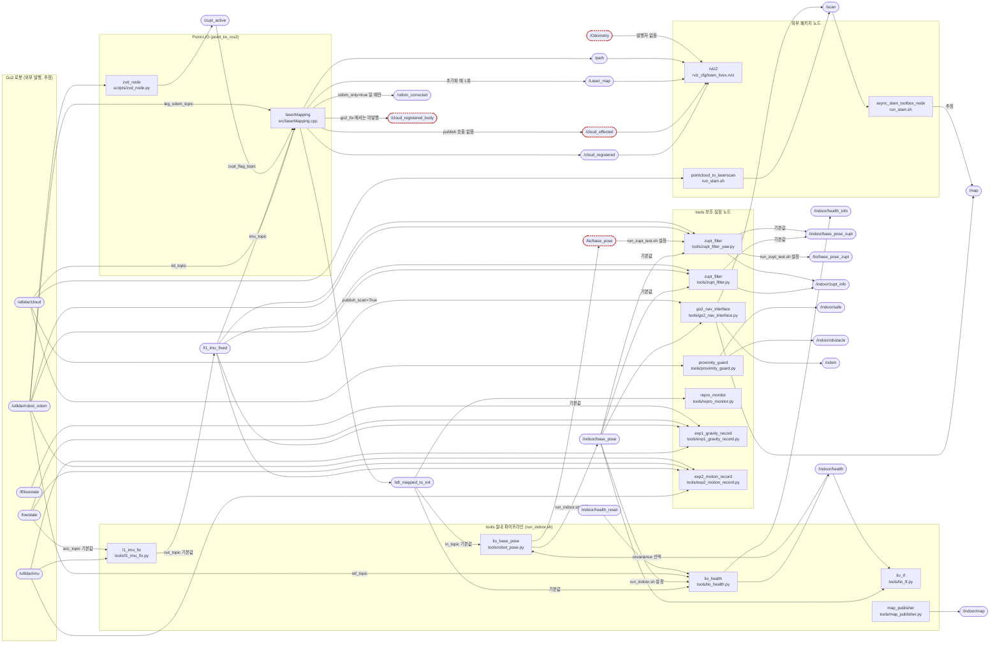
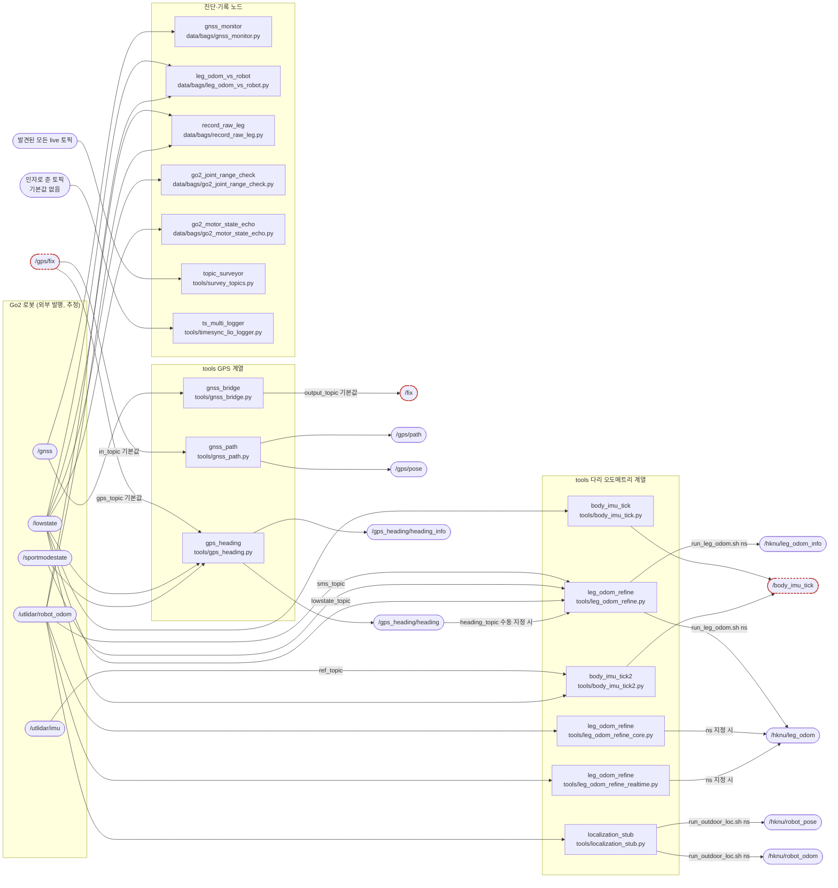
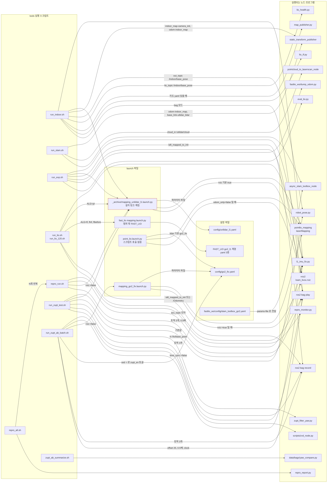
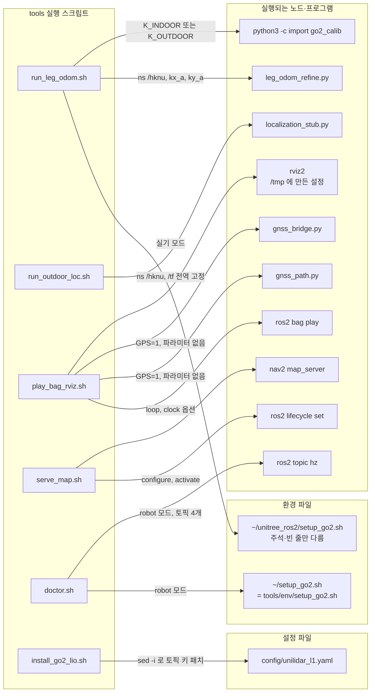
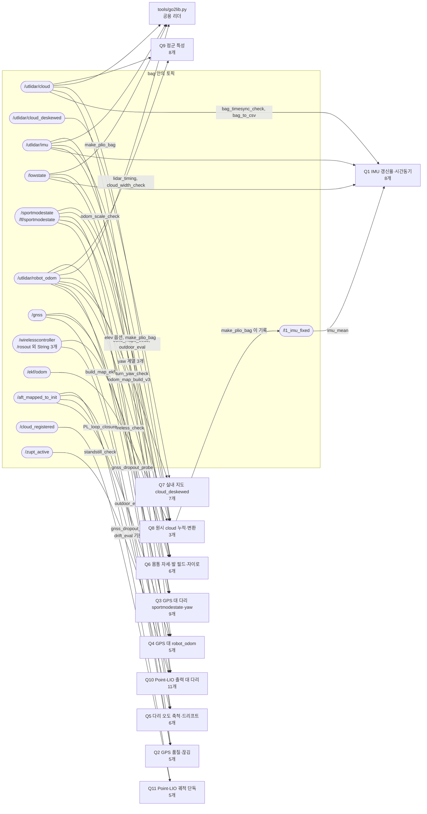
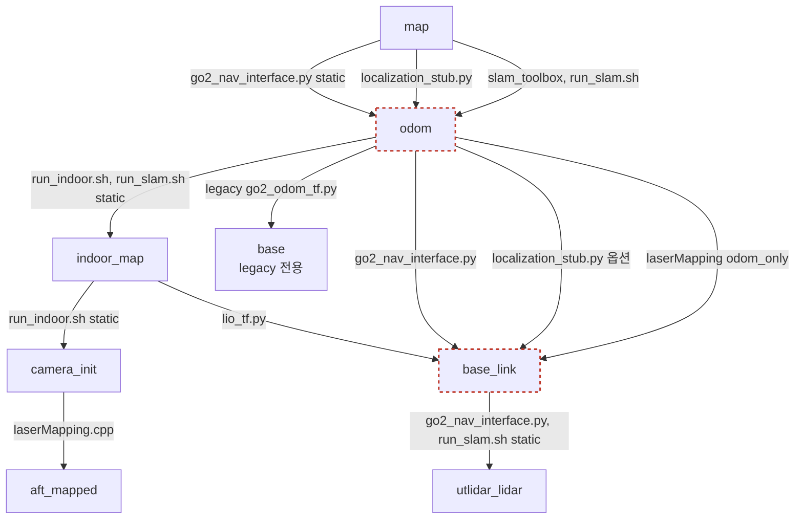
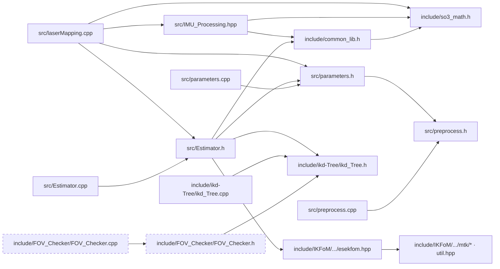

# 파일 의존 관계 v2

각 파일이 무엇을 받고 무엇을 내보내며 어디에 기대는지 코드를 다시 읽어 정리했습니다.
갱신 2026-09-30 · 읽기 전용 코드 분석(원본 파일은 하나도 고치지 않았습니다)

> **범위**
> - `~/catkin_point_lio_unilidar/src/point_lio_ros2` — 이 문서에서는 `point_lio_ros2/…` 로 적습니다. `include/IKFoM/` 은 서드파티 수학 라이브러리라 제외했고, 커스텀이 들어간 `esekfom.hpp` 만 봤습니다.
> - `~/fastlio_ws/tools` — `tools/…` 로 적습니다. `legacy/`·`env/` 포함, `*.bak*` 8개는 제외(부록 A-6).
> - `~/data/bags/*.py` 49개 — `data/bags/…` 로 적습니다.
>
> **기준 문서**: `fastlio_ws/docs/FILE_DEPENDENCIES.md` (갱신 2026-08-22, 커밋 `8802930`). `~/Downloads/FILE_DEPENDENCIES.md`(08-13)와 `docs/FILE_DEPENDENCIES.md.bak`(08-10)은 옛 사본이라 비교에 쓰지 않았습니다.
>
> **만든 방법**: 파일 묶음별 추출 → 다른 에이전트가 원본과 대조해 고치고 채우는 독립 검증 → 절별 작성 → 비판 검토(정확성: 구체적 주장 185개를 원본과 대조, 완성도: 누락·모순·형식 41항목 점검) → 지적 반영 → 조립 후 최종 점검(내부 참조·수치 일관성 112항목, 수정된 내용의 원본 재대조 140항목) → 반영. 모든 사실에 `파일:줄` 근거를 달았습니다.
>
> **한계**
> - 코드를 실행하지 않고 읽기만 했습니다. 실행 시 동작에 대한 판단은 '추정'으로 표시했습니다.
> - mermaid-cli(`mmdc`)가 설치돼 있지 않아 Mermaid는 렌더 테스트 대신 규칙 검사(id 문자, 예약어, 따옴표, 점선+라벨 금지, subgraph 짝)만 했습니다.
> - 근거는 모두 `파일:줄` 형식이고, 줄 번호는 2026-09-30 작업본 기준입니다.
> - `data/bags` 는 git 저장소가 아니라 변경 시점은 파일 수정 시각(mtime)으로만 판단했습니다.

## 경로 표기 규칙

| 문서 속 표기 | 원 경로 | 비고 |
|---|---|---|
| `point_lio_ros2/…` | `/home/hyo/catkin_point_lio_unilidar/src/point_lio_ros2/…` | Point-LIO ROS2 패키지입니다 |
| `tools/…` | `/home/hyo/fastlio_ws/tools/…` | `tools/legacy/`, `tools/env/` 도 여기에 포함됩니다 |
| `data/bags/…` | `/home/hyo/data/bags/…` | git 저장소가 아니어서 시점은 mtime 으로만 판단했습니다 |
| `fastlio_ws/…` | `/home/hyo/fastlio_ws/…` | tools 밖의 파일(`config/slam_toolbox_go2.yaml`, `dump_odom.py` 등)을 가리킬 때만 씁니다 |
| `FILE_DEPENDENCIES.md:n`, `FD:n` | `/home/hyo/fastlio_ws/docs/FILE_DEPENDENCIES.md` 의 n행 | 기준 문서(HEAD `8802930`)입니다 |
| 파일 이름 없이 `:n` 만 적은 것 | 같은 칸이나 행에서 바로 앞에 나온 파일의 n행 | 절마다 따로 둔 줄임 규칙은 2절 머리의 표기 규칙과 부록 A 머리를 참고하세요 |

## 목차

1. 노드–토픽 연결도 — 실시간 그래프, 실행 구성도, 오프라인 소비자, 토픽 표, TF, 짝 안 맞는 토픽, legacy
2. yaml 파라미터 — 규모 요약(2-0), yaml 선택 경로, Point-LIO 키 75개 → 코드 표, 죽은 키·누락 키, yaml 을 고치는 스크립트, tools 노드 파라미터, 주의점
3. 하드코딩된 상수 — 3-0 교차 중복·불일치(가장 중요), 3-1 Point-LIO, 3-2 tools, 3-3 data/bags
4. 기존 FILE_DEPENDENCIES.md 대비 변경점 — 범위, 파일 목록, 토픽·입출력, Point-LIO, 상수, 문서 주장 현황, 08-22 이후 연표
- 부록 A. 파일 인벤토리 · 부록 B. 읽으며 발견한 의심점

## 먼저 볼 것 — 핵심 발견

아래는 원본 줄을 직접 다시 확인한 것만 골랐습니다. 자세한 내용은 오른쪽 절에 있습니다.

| # | 내용 | 근거 | 자세히 |
|---|---|---|---|
| 1 | **GPS 토픽 이름이 끊겨 있습니다.** `gnss_bridge` 는 `/fix` 로 내보내는데 `gnss_path`·`gps_heading` 은 `/gps/fix` 를 기다립니다. 따로 리매핑하지 않으면 GPS 경로·방위가 비어 있을 것으로 추정합니다 | tools/gnss_bridge.py:78, tools/gnss_path.py:52, tools/gps_heading.py:51 | 1-6, 3-0 |
| 2 | **`mapping_unilidar_l1.launch.py` 가 `launch/_archive/` 로 옮겨졌는데 tools 스크립트 6개(legacy/run_pointlio.sh 까지 7개)가 아직 이 이름으로 부릅니다.** 설치 폴더의 같은 이름 심볼릭 링크는 끊겨 있습니다. 이 launch 가 읽는 `unilidar_l1.yaml` 에는 다리 융합·ZUPT 키도 없습니다 | tools/run_indoor.sh, run_lio.sh, run_lio_120.sh, run_exp.sh, repro_run.sh, run_zupt_test.sh; install/point_lio/share/point_lio/launch/mapping_unilidar_l1.launch.py(끊긴 링크) | 1-2, 2-1, 4-2 |
| 3 | **`go2_fix.yaml` 의 `/l1_imu_fix`·`/zvd_node` 섹션은 실제로 적용되지 않습니다.** 두 노드 모두 `python3 x.py` 로 `--params-file` 없이 실행됩니다. 지금은 yaml 값이 코드 기본값과 같아 동작 차이가 없지만, yaml 을 고쳐도 반영되지 않습니다 | point_lio_ros2/config/go2_fix.yaml:94, 105; tools/run_zupt_ab_batch.sh:98; tools/run_lio.sh:89 | 2-3, 4-4 |
| 4 | **Point-LIO C++ 기본값과 주력 yaml 값이 다릅니다.** `leg_scale` 1.2 vs 1.23, `use_imu_as_input` 기본 true vs yaml false. ZUPT·다리 융합은 `use_imu_as_input=false` 분기 안에만 있어서, yaml 과 런치 dict 양쪽에서 이 키가 빠지면(예: `mapping_go2_fix.launch.py` 로 띄우는데 yaml 에 키가 없을 때) 두 기능이 조용히 꺼집니다 | point_lio_ros2/src/parameters.cpp:13, 55, 65; point_lio_ros2/config/go2_fix.yaml:4, 84; point_lio_ros2/src/laserMapping.cpp:991 | 2-7, 3-0 |
| 5 | **축척 k=1.1995 가 아직 하드코딩돼 있습니다.** 기존 문서는 k 통합을 '완료'로 적었지만 두 파일의 `--k` 기본값이 그대로입니다 | tools/odom_map_build_v2.py:95, tools/loop_correct_v2.py:130 | 3-0, 4-5 |
| 6 | **다리 속도 축척이 data/bags 안에서 0.95 와 1.23 으로 갈립니다.** `patch_legR.py` 는 yaml 의 `leg_scale` 을 0.95 로 바꾸고, 지금 `go2_fix.yaml` 과 다른 분석 스크립트는 1.23 입니다 | data/bags/patch_legR.py:43, legvel_lever.py:7 vs check_v1.py:20, outdoor_eval.py:16, outdoor_scan.py:9 | 2-5, 3-3 |
| 7 | **RViz 설정이 Point-LIO 가 내지 않는 토픽을 봅니다.** `/Odometry` 를 보지만 노드는 `/aft_mapped_to_init` 를 냅니다. `/cloud_effected` 는 퍼블리셔만 있고 publish 호출이 없습니다 | point_lio_ros2/rviz_cfg/loam_livox.rviz:111, 205; point_lio_ros2/src/laserMapping.cpp:843 | 1-6 |
| 8 | **기존 문서는 08-22 시점에도 일부 틀렸습니다.** `robot_pose.py`·`go2_nav_interface.py` 는 08-09 커밋 `ca54d8a` 부터 이미 `go2_calib` 를 import 합니다 | git -C fastlio_ws show ca54d8a | 4-5 |
| 9 | **범위가 크게 늘었습니다.** 기존 문서는 파일 53개(산출물 `scans.pcd` 포함)를 다뤘고 v2 는 252개를 봤습니다. Point-LIO 에는 필터 안 ZUPT·다리 속도 융합 v1(`f2b0c98`)과 파라미터 통합(`2e92498`)이 들어갔습니다 | git -C point_lio_ros2 log | 4-1, 4-4 |

---

## 1. 노드–토픽 연결도

이 절에서는 `point_lio_ros2`, `tools/`, `data/bags/` 의 ROS2 노드와 실행 스크립트, 오프라인 스크립트가 어떤 토픽과 TF 로 이어지는지 정리했습니다.
토픽 이름은 **코드 기본값**으로 적었습니다. 실행 스크립트가 `-p`, yaml, `-r __ns` 로 이름을 바꾸는 경우에는 엣지 라벨에 스크립트 이름을 붙였습니다.
근거 형식과 '추정' 표기는 문서 머리의 '한계'와 경로 표기 규칙을 따릅니다.

| 그림 기호 | 뜻 |
|---|---|
| 사각형 `["..."]` | 노드 또는 프로그램입니다. 첫 줄은 노드 이름, 둘째 줄은 파일입니다 |
| 둥근 막대 `(["..."])` | 토픽입니다 |
| 빨간 점선 테두리 | 그림마다 뜻이 다릅니다. 1-1 에서는 연결이 실제로 끊기거나 겹치는 토픽입니다: 이름 불일치(`/fix`·`/gps/fix`, `/Odometry`, 기본값 `/lio/base_pose`), 발행기만 있고 내보내지 않음(`/cloud_effected`, go2_fix 의 `/cloud_registered_body`), 두 파일이 같은 이름으로 발행(`/body_imu_tick`). 구독자나 발행자가 없을 뿐인 나머지 토픽은 1-6 (a)(b) 표에만 적고 그림에는 표시하지 않았습니다. 1-2-A 에서는 설치 링크가 깨진 launch 파일, 1-5 에서는 부모 연결을 내는 발행자가 여럿이라 함께 켜면 겹칠 수 있는 프레임(`base_link` 는 부모 후보 2개, `odom` 은 map→odom 발행자 3개)입니다 |
| 엣지 라벨 `기본값` / `run_indoor.sh 설정` | 코드 기본 이름인지, 해당 스크립트가 바꾼 이름인지 구분합니다 |

---

### 1-1. 실시간 ROS2 그래프

그림이 60 노드를 넘지 않도록 두 장으로 나눴습니다. TF 는 1-5 에 따로 그렸고, `tools/legacy/` 노드는 1-7 에서 다룹니다.

#### 1-1-A. Point-LIO · 실내 파이프라인 · 실험 노드

그림에서 읽어야 할 점은 다음과 같습니다.

| 항목 | 내용 | 근거 |
|---|---|---|
| Point-LIO 입력 4개 | `lid_topic`, `imu_topic` 은 yaml 에서 정합니다. `zupt_flag_topic`, `leg_odom_topic` 은 `zupt_en`/`leg_en` 값과 상관없이 **항상** 구독합니다 | point_lio_ros2/src/laserMapping.cpp:799-816 |
| yaml 별 입력 | go2_fix·unilidar_l1 은 `/utlidar/cloud`+`/l1_imu_fixed` 를 쓰고, go2_raw 는 `/utlidar/imu` 를 직접 씁니다. yaml 이 없으면 `/livox/lidar`, `/livox/imu` 를 씁니다 | point_lio_ros2/config/go2_fix.yaml:15-16, unilidar_l1.yaml:4-5, go2_raw.yaml:4-5, point_lio_ros2/src/parameters.cpp:82-83 |
| `/zupt_active` 발행자 | zvd_node 는 run_zupt_ab_batch.sh 에서만 실행됩니다. run_indoor·run_exp·run_lio·run_lio_120·run_zupt_test·repro_run 은 zupt 키가 없는 unilidar_l1.yaml 을 씁니다. 이때 C++ 기본값 `zupt_en=true` 가 적용되지만 발행자가 없어 `zupt_active` 가 초기값 false 로 남습니다. 그래서 ZUPT 갱신은 걸리지 않는다고 봅니다(추정) | tools/run_zupt_ab_batch.sh:98, point_lio_ros2/src/parameters.cpp:56, point_lio_ros2/src/laserMapping.cpp:49, :1087 |
| `/cloud_effected` | 발행기만 만들고 `publish` 를 부르지 않습니다. RViz 는 이 토픽을 구독하지만 받는 메시지가 없습니다 | point_lio_ros2/src/laserMapping.cpp:828-829, point_lio_ros2/rviz_cfg/loam_livox.rviz:205 |
| `/cloud_registered_body` | 발행 조건은 `scan_pub_en && scan_body_pub_en` 입니다. go2_fix 에서는 `scan_bodyframe_pub_en: false` 라서 발행되지 않습니다 | point_lio_ros2/src/laserMapping.cpp:1325, point_lio_ros2/config/go2_fix.yaml:67 |
| RViz 오도메트리 표시 | RViz 는 `/Odometry` 를 기다리는데, Point-LIO 가 내는 토픽은 `/aft_mapped_to_init` 입니다 | point_lio_ros2/rviz_cfg/loam_livox.rviz:111, point_lio_ros2/src/laserMapping.cpp:843 |
| robot_pose 출력 이름 | 기본값은 `/lio/base_pose` 입니다. run_indoor.sh 는 `/indoor/base_pose` 로 바꾸고, run_zupt_test.sh 는 기본값을 그대로 씁니다 | tools/robot_pose.py:93, tools/run_indoor.sh:150-151, tools/run_zupt_test.sh:105 |
| 되먹임 고리 | robot_pose 가 `/indoor/base_pose` 를 내면 lio_health 가 `/indoor/health` 를 내고, 이 값이 다시 robot_pose 의 covariance(0.01 또는 1e6)를 정합니다. 위치 값 자체에는 영향이 없습니다 | tools/robot_pose.py:102-105, tools/lio_health.py:96-99 |
| 실행 스크립트가 없는 노드 | zupt_filter, proximity_guard, go2_nav_interface, exp1/exp2 는 tools/*.sh 에서 실행하지 않습니다(grep). run_outdoor_loc.sh:11 주석에는 "run_indoor.sh (go2_nav_interface.py)" 라고 적혀 있지만, run_indoor.sh 는 go2_nav_interface 를 띄우지 않습니다 | tools/run_indoor.sh:135-169, tools/run_outdoor_loc.sh:11 |

#### 1-1-B. 실외 · GPS · 다리 오도메트리 · 진단 노드

| 항목 | 내용 | 근거 |
|---|---|---|
| **`/fix` ↔ `/gps/fix` 불일치** | gnss_bridge 는 `/fix` 를 발행하는데, gnss_path 와 gps_heading 은 `/gps/fix` 를 기다립니다. play_bag_rviz.sh 는 두 노드를 파라미터 없이 띄운 뒤 "/gps/path 발행 중"이라고 출력하지만, 실제로는 경로가 나오지 않는다고 봅니다(추정, 실행 확인 안 함) | tools/gnss_bridge.py:78, tools/gnss_path.py:52, tools/gps_heading.py:51, tools/play_bag_rviz.sh:160-164 |
| 낡은 docstring | gnss_path.py:7, gps_heading.py:15, run_indoor.sh:15 는 아직도 gnss_bridge 출력을 `/gps/fix` 로 적고 있습니다. 기존 문서는 "2026-08-13 이전에는 `/gps/fix`"라고 적어 이름이 바뀐 사실을 이미 알고 있습니다 | tools/gnss_path.py:7, tools/gps_heading.py:15, tools/run_indoor.sh:15, FILE_DEPENDENCIES.md:757 |
| `/hknu/*` 이름 | 코드에서는 상대 이름(`robot_odom`, `leg_odom`)이고, 실행 스크립트의 `-r __ns:=/hknu` 가 붙어야 `/hknu/…` 가 됩니다 | tools/localization_stub.py:156-158, tools/leg_odom_refine.py:218-219, tools/run_outdoor_loc.sh:33-38, tools/run_leg_odom.sh:88-94 |
| heading 연결 | leg_odom_refine 의 `heading_topic` 기본값은 빈 문자열이라 구독하지 않습니다. gps_heading 출력은 `~/heading`, 즉 `/gps_heading/heading` 입니다. 두 노드를 연결하는 스크립트는 없습니다 | tools/leg_odom_refine.py:216, :352, tools/gps_heading.py:54 |
| 같은 노드 이름 | leg_odom_refine 계열 3개 파일이 모두 `leg_odom_refine` 이라는 이름으로 뜹니다. run_leg_odom.sh 만 `__node` 로 이름을 바꿉니다 | tools/leg_odom_refine.py:209, tools/leg_odom_refine_core.py:36, tools/leg_odom_refine_realtime.py:41, tools/run_leg_odom.sh:90 |
| `/body_imu_tick` | v1 과 v2 가 같은 토픽을 발행하고, frame_id 는 `base` 입니다. 이 토픽을 구독하는 코드나 config 는 없습니다 | tools/body_imu_tick.py:52-53, tools/body_imu_tick2.py:44-46 |
| data/bags 노드의 `lowstate` | 상대 이름으로 구독하므로 네임스페이스 없이 실행했을 때만 `/lowstate` 가 됩니다 | data/bags/go2_joint_range_check.py:42, data/bags/go2_motor_state_echo.py:34, data/bags/leg_odom_vs_robot.py:62, data/bags/record_raw_leg.py:31 |

---

### 1-2. 실행 구성도

#### 1-2-A. Point-LIO · 실내 · 실험 스크립트

#### 1-2-B. 실외 · 재생 · 유틸 스크립트

| 스크립트 | 띄우는 것 (파일:줄) | 이름을 바꾸는 인자 | 비고 |
|---|---|---|---|
| tools/run_indoor.sh | l1_imu_fix(:135), Point-LIO mapping_unilidar_l1(:137-138), static TF 2개(:142-144, :147-149), robot_pose(:150-151), lio_health(:152-156), map_publisher(:160-162), lio_tf(:166-169), bag 모드일 때 ros2 bag play(:190) | `NS=/indoor`(:63). robot_pose `out_topic`, lio_health `lio_topic/out_topic/out_info_topic`, lio_tf `in_topic/health_topic/parent_frame/child_frame` | live 모드에서는 `~/setup_go2.sh`(:116)를 씁니다 |
| tools/run_slam.sh | static TF 2개(:76-77, :84-87), pointcloud_to_laserscan(:90-99), slam_toolbox(:102-104) | `-r cloud_in:=/utlidar/cloud -r scan:=/scan`(:92) | 먼저 run_indoor.sh 가 떠 있어야 하고, `/indoor/base_pose` hz 로 이를 확인합니다(:66) |
| tools/run_exp.sh | l1_imu_fix(:62), mapping_unilidar_l1(:67), bag record(:73), bag play(:79), dump_odom(:91), eval_lio(:103) | 없음 | dump_odom.py 는 tools 가 아니라 fastlio_ws 루트에 있습니다 |
| tools/run_lio.sh, run_lio_120.sh | l1_imu_fix(:89 / :83), LAUNCH 배열(:47-57), bag record(:114 / :108), bag play(:135 / :129) | `ALG` 로 Point-LIO 와 FAST-LIO 중 하나를 고릅니다 | FAST-LIO 는 이 문서의 범위 밖입니다 |
| tools/repro_all.sh | repro_run.sh ×N(:25), repro_report.py(:34) | 없음 | |
| tools/repro_run.sh | repro_monitor(:75), l1_imu_fix(:80), mapping_unilidar_l1(:86), bag play(:112) | `acc_topic:=$ACC_TOPIC`(:80) | 재생 토픽은 `/utlidar/cloud /utlidar/imu $ACC_TOPIC` 입니다(:21, :112) |
| tools/run_zupt_test.sh | l1_imu_fix(:88), mapping_unilidar_l1(:95), robot_pose(:105), zupt_filter_yaw(:114), bag record(:121-122), bag play(:142) | zupt_filter_yaw `in_topic:=/lio/base_pose out_topic:=/lio/base_pose_zupt` | 안내문에 나오는 `tools/traj_to_csv_v3.py` 는 실제로 data/bags 에 있어 경로가 틀립니다(:164-165) |
| tools/run_zupt_ab_batch.sh | zvd_node(:98), l1_imu_fix(:99), mapping_go2_fix(:100), bag record(:103), bag play(:108) | `time_sync:=false`(:99) | go2_fix.yaml 의 `zupt_en` 을 `sed -i` 로 바꿉니다(:76-86) |
| tools/zupt_ab_summarize.sh | data/bags/yaw_compare.py(:33) | 없음 | |
| tools/run_leg_odom.sh | leg_odom_refine(:94) | `__ns:=/hknu`, `__node:=leg_odom_<MODE>`, `kx_a/ky_a`(:88-92) | 실기 모드에서는 `~/unitree_ros2/setup_go2.sh` 를 씁니다(:58). 다른 스크립트는 `~/setup_go2.sh` 를 쓰는데, 두 파일은 주석과 빈 줄만 다릅니다(diff 확인) |
| tools/run_outdoor_loc.sh | localization_stub(:50) | `__ns`, `__node:=localization_outdoor`, `/tf:=/tf`, `/tf_static:=/tf_static`, `publish_odom_base_tf`(:33-41) | |
| tools/play_bag_rviz.sh | rviz2(:154), gnss_bridge(:160), gnss_path(:162), bag play(:176) | 없음 | `/fix`·`/gps/fix` 불일치가 생기는 곳입니다(1-6) |
| tools/serve_map.sh | map_server(:10), lifecycle set(:13-14) | `yaml_filename` | |
| tools/doctor.sh | `ros2 topic hz` 로 4개 토픽 확인(:176) 외 점검 명령 | 없음 | |

실행 구성과 관련해 따로 확인한 사항은 다음과 같습니다.

- **설치 링크 깨짐(확인)**: `catkin_point_lio_unilidar/install/point_lio/share/point_lio/launch/` 바로 아래에 있는 `mapping_unilidar_l1.launch.py` 등 10개의 symlink 는 `src/point_lio_ros2/launch/` 를 가리킵니다. 그런데 원본이 `_archive/` 로 옮겨져서 링크가 모두 깨졌습니다(`test -e` 로 확인). 정상인 것은 `mapping_go2_fix.launch.py`, `point_lio.launch.py` 두 개뿐입니다. 이 launch 를 부르는 스크립트는 run_indoor.sh:138, run_exp.sh:67, run_lio.sh:47, run_lio_120.sh:47, repro_run.sh:86, run_zupt_test.sh:95, legacy/run_pointlio.sh:6 입니다. 설치된 `_archive/` 안의 링크는 정상이므로, `ros2 launch` 가 같은 이름의 파일을 두 개 찾아 실패할 수 있습니다(추정, 실행 확인 안 함).
- **go2_fix.yaml 의 다른 노드 섹션**: `/l1_imu_fix:`(:94)와 `/zvd_node:`(:105) 섹션이 있지만, 이 yaml 을 `--params-file` 로 l1_imu_fix 나 zvd_node 에 넘기는 스크립트는 없습니다. mapping_go2_fix.launch.py 는 이 yaml 을 laserMapping 에만 넘깁니다(:16-29). 따라서 이 두 섹션은 적용되지 않는다고 봅니다(추정). 값은 코드 기본값과 같습니다(point_lio_ros2/scripts/zvd_node.py:10-14, tools/l1_imu_fix.py:77-83, :101-103).
- **point_lio.launch.py** 는 어느 .sh 에서도 호출하지 않습니다(grep). `odom_only:=true` 로 띄우면 TF 가 `odom→base_link` 로 바뀝니다(point_lio.launch.py:78-82, :125-130).

---

### 1-3. 오프라인 소비자 그림

bag 에 녹화된 토픽을 오프라인 스크립트가 어떻게 읽는지 그렸습니다. 스크립트가 70개가 넘어서, 같은 토픽 묶음을 쓰는 스크립트는 한 노드(Q1–Q11)로 묶었습니다. 파일 목록은 아래 표에 있습니다.

| 그룹 | 파일 (토픽을 읽는 줄) | 읽는 토픽 | 읽는 방식 |
|---|---|---|---|
| Q1 | tools/accel_diff_sim.py:64,74 · tools/accel_rate_confirm.py:50 · tools/accel_step_check.py:42 · tools/bag_timesync_check.py:156,160,164 · tools/imu_deadreckon.py:47,92 · tools/yaw_spin_check.py:22 · data/bags/bag_to_csv.py:87,99,110 · data/bags/imu_mean.py:59 | /lowstate, /utlidar/imu, (/utlidar/cloud), (모든 Imu 토픽) | sqlite3 직접(accel_*, imu_deadreckon), rosbag2_py(그 외) |
| Q2 | tools/check_gnss_0812.py:49 · tools/gps_noise_split.py:70 · tools/plot_gnss_quality.py:46 · tools/scan_gnss_bags.py:61 · tools/gnss_dropout_probe.py:79,100,126,153 | /gnss, (/rosout, /multiplestate, /lf/battery_alarm, /gpt_state, /lf/sportmodestate) | JSON 파싱. gnss_dropout_probe 는 수동 CDR 로 읽습니다 |
| Q3 | tools/baseline_sweep.py:49,58,66 · tools/check_0812.py:18 · tools/gps_align_0812.py:30,33 · tools/gps_vs_odom.py:57 · tools/plot_traj.py:71,77 · tools/scale_vs_speed.py:24,27 · tools/verify_heading.py:39 · tools/yaw_gps_check.py:45 · tools/legodom_vs_gps.py:57,81 | /gnss, /sportmodestate(또는 /lf/sportmodestate), /lowstate | sqlite3 직접 또는 rosbag2_py |
| Q4 | tools/gtsam_batch_0812.py:115,123 · tools/build_maps_0812.py:95,159,215 · data/bags/speed_ratio.py:26 · data/bags/outdoor_scan.py:67 · data/bags/outdoor_eval.py:51,58,102 | /gnss, /utlidar/robot_odom, (/utlidar/cloud, /aft_mapped_to_init) | build_maps_0812 는 odom_map_build_v3.load_odom 을 import 해서 씁니다 |
| Q5 | tools/legodom_check.py:76 · tools/scale_check.py:56 · tools/odom_scale_check.py:196 · tools/eval_lio.py:70 · tools/summarize.py:73 · tools/drift_eval.py:160 | /utlidar/robot_odom, (/lf/sportmodestate, /sportmodestate), drift_eval 는 /aft_mapped_to_init | summarize 는 eval_lio.load_ref 를 거쳐 읽습니다 |
| Q6 | tools/foot_field_probe.py:67-69 · tools/elev_from_pitch.py:69 · tools/yaw_check.py:109 · tools/yaw_static_drift.py:34 · tools/wireless_check.py:36 · data/bags/gyro_bias_check.py:50-52 | /sportmodestate, /lowstate, /utlidar/robot_odom, /utlidar/imu, /wirelesscontroller | |
| Q7 | tools/loop_correct.py:100-101 · tools/loop_correct_manual.py:131-132 · tools/loop_correct_v2.py:139-140 · tools/map_split_check.py:50 · tools/odom_map_build.py:57 · tools/odom_map_build_v2.py:67,127 · tools/roi_time_inspect.py:115-116 | /utlidar/cloud_deskewed, /utlidar/robot_odom | rosbag2_py |
| Q8 | tools/odom_map_build_v3.py:157,228,246 · tools/build_map_ekf.py:154,228,243 · tools/make_plio_bag.py:44-45,65 | /utlidar/cloud, /utlidar/robot_odom, /ekf/odom, /sportmodestate, /utlidar/imu | make_plio_bag 는 `/utlidar/cloud`+`/l1_imu_fixed` 로 된 새 bag 을 씁니다(:117-119) |
| go2lib | tools/go2lib.py:111,119,130,140 | /utlidar/imu, /utlidar/robot_odom, /lowstate, /utlidar/cloud | sqlite3 + 수동 CDR 로 읽는 라이브러리입니다 |
| Q9 | tools/check_pc2_fields.py:83 · tools/lidar_timing.py:46,72 · data/bags/cloud_point_count.py:58 · data/bags/cloud_width_check.py:55,60 · data/bags/lidar_pattern_repeat.py:35 · data/bags/lidar_pattern_shift.py:41 · data/bags/lidar_spin_check.py:35 · data/bags/wall_info_probe.py:108 | /utlidar/cloud(인자로 바꿀 수 있음), /utlidar/robot_odom | |
| Q10 | data/bags/endpoint_err.py:19 · data/bags/legvel_check.py:14,17 · data/bags/legvel_fit.py:14,17 · data/bags/legvel_lever.py:16,19 · data/bags/standstill_check.py:17,20,23 · data/bags/traj3d_compare.py:30-31 · data/bags/traj_plot.py:13 · data/bags/yaw_compare.py:37-38 · data/bags/z_plot.py:17,21 · data/bags/turn_yaw_check.py:23,25,31 · tools/zupt_ab_summarize.sh:33 | /aft_mapped_to_init, /utlidar/robot_odom, (/zupt_active, /utlidar/imu) | 입력은 run_zupt_ab_batch.sh:103 이 녹화한 plout_* bag 입니다(추정: 녹화 토픽 3개가 일치) |
| Q11 | data/bags/traj_to_csv.py:56 · data/bags/traj_to_csv_v2.py:56 · data/bags/traj_to_csv_v3.py:69 · data/bags/ztilt_check.py:11 · data/bags/PL_loop_closure.py:148,282 | /aft_mapped_to_init, (/cloud_registered) | traj_to_csv(v1/v2)는 sqlite3 직접으로 읽습니다 |
| (메타만) | data/bags/bag_inventory.py:47-55 · tools/play_bag_rviz.sh:62 | metadata.yaml 의 메시지 수 또는 `ros2 bag info` 결과 | 메시지를 역직렬화하지 않습니다 |

그림에서 뺀 파일도 있습니다. grep 기준으로 bag 이나 토픽을 직접 읽지 않고 CSV·PCD·npy 만 다루는 파일들입니다.
tools 쪽은 compare_lio_gps, compare_maps, compare_pcd, fix_rosbag2_metadata, go2_calib, grid_compare, ground_inspect, heading_core, height_band_compare, lever_check, map_measure, pcd_to_grid, pcd_view, pillar_inspect, plot_legodom_gps, repro_diverge, repro_event, repro_report, repro_yaw, spin_check, view3d 입니다. 여기에 소스 파일을 텍스트로 고치는 1회성 패치 patch_health(lio_health.py 대상), patch_pose_cov(robot_pose.py 대상)와 RViz 창을 mp4 로 녹화하는 rec_rviz.sh 도 토픽을 읽지 않아 뺐습니다(tools/patch_health.py:1, tools/patch_pose_cov.py:19, tools/rec_rviz.sh:4-13).
data/bags 쪽은 analyze_leg_odom_csv, check_v1(yaml 점검), consolidate_params, fix_legRate, go2_leg_kinematics, gps_log_analyze, patch_*, pl_bifurcation, pl_window_probe, sweep_leg_odom, zupt_offline 입니다.

---

### 1-4. 토픽 표

`Q번호`는 1-3 의 오프라인 그룹입니다. "발행자 없음"은 저장소 세 경로 안에서 찾지 못했다는 뜻입니다.
legacy 노드만 쓰는 토픽(`/joint_states`, `/body_imu`, `/go2/camera/image_raw`, `/go2/camera/camera_info`)은 이 표에 행을 두지 않고 1-7 에만 적었습니다(tools/legacy/go2_lowstate_to_jointstates.py:78, tools/legacy/body_imu_bridge.py:36, tools/legacy/go2_camera_info_publisher.py:56-57, tools/legacy/go2_camera_publisher.py:39).

| 토픽 | 메시지 타입 | 발행 (파일:줄) | 구독 (파일:줄) | bag 오프라인 소비 | 비고 (바꾸는 파라미터) |
|---|---|---|---|---|---|
| /utlidar/cloud | sensor_msgs/PointCloud2 | Go2 로봇(외부, 추정) | point_lio_ros2/src/laserMapping.cpp:799 · tools/proximity_guard.py:141 · tools/go2_nav_interface.py:207 · pointcloud_to_laserscan(tools/run_slam.sh:92) | Q1·Q4·Q8·Q9·go2lib | laserMapping `common.lid_topic`(go2_fix.yaml:15). proximity_guard `in_topic`(:103). go2_nav_interface `in_cloud`(:156) |
| /utlidar/cloud_deskewed | sensor_msgs/PointCloud2 | Go2 로봇(외부, 추정) | legacy만(1-7) | Q7 | 실외 bag 에는 이 토픽이 없습니다(FILE_DEPENDENCIES.md:22-23) |
| /utlidar/imu | sensor_msgs/Imu | Go2 로봇(외부, 추정) | tools/l1_imu_fix.py:128 · tools/body_imu_tick2.py:62 · tools/exp1_gravity_record.py:79 · tools/exp2_motion_record.py:80 · laserMapping(go2_raw.yaml:5 을 쓸 때) | Q1·Q6·Q8·Q10·go2lib | l1_imu_fix 에서는 하드코딩입니다. body_imu_tick2 `ref_topic`(:45) |
| /lowstate | unitree_go/LowState | Go2 로봇(외부, 추정) | tools/l1_imu_fix.py:126 · tools/body_imu_tick.py:71 · tools/body_imu_tick2.py:65 · tools/exp1_gravity_record.py:85 · tools/exp2_motion_record.py:86 · tools/gps_heading.py:96 · tools/leg_odom_refine.py:347 · data/bags/go2_joint_range_check.py:42 · data/bags/go2_motor_state_echo.py:34 · data/bags/leg_odom_vs_robot.py:62 · data/bags/record_raw_leg.py:31 | Q1·Q3·Q6·go2lib | l1_imu_fix `acc_topic`(:81). gps_heading `lowstate_topic`(:52). leg_odom_refine `lowstate_topic`(:215). data/bags 노드는 상대 이름 `lowstate` 로 구독합니다 |
| /lf/lowstate | unitree_go/LowState | Go2 로봇(외부, 추정) | tools/exp1_gravity_record.py:88 | 없음 | |
| /sportmodestate | unitree_go/SportModeState | Go2 로봇(외부, 추정) | tools/gps_heading.py:98 · tools/leg_odom_refine.py:345 | Q2·Q3·Q5·Q6·Q8 | gps_heading `sport_topic`(:53). leg_odom_refine `sms_topic`(:214) |
| /lf/sportmodestate | unitree_go/SportModeState | Go2 로봇(외부, 추정) | 없음 | Q2·Q3(legodom_vs_gps)·Q5(odom_scale_check) | |
| /utlidar/robot_odom | nav_msgs/Odometry | Go2 로봇(외부, 추정) | point_lio_ros2/src/laserMapping.cpp:805 · point_lio_ros2/scripts/zvd_node.py:17 · tools/lio_health.py:99 · tools/localization_stub.py:210 · tools/leg_odom_refine.py:343 · tools/leg_odom_refine_core.py:74 · tools/leg_odom_refine_realtime.py:93 · tools/zupt_filter.py:145 · tools/zupt_filter_yaw.py:146 · tools/exp2_motion_record.py:89 · data/bags/leg_odom_vs_robot.py:63 · data/bags/record_raw_leg.py:32 | Q4·Q5·Q6·Q7·Q8·Q9·Q10·go2lib | laserMapping `leg_odom_topic`(parameters.cpp:66, go2_fix.yaml:85). lio_health `ref_topic`(:61). zvd_node 는 하드코딩입니다 |
| /gnss | std_msgs/String (JSON) | Go2 로봇(외부, 추정) | tools/gnss_bridge.py:94 · data/bags/gnss_monitor.py:56 | Q2·Q3·Q4 | gnss_bridge `input_topic`(:77) |
| /l1_imu_fixed | sensor_msgs/Imu | tools/l1_imu_fix.py:122 | point_lio_ros2/src/laserMapping.cpp:801 · tools/zupt_filter.py:147 · tools/zupt_filter_yaw.py:148 · tools/exp1_gravity_record.py:82 · tools/exp2_motion_record.py:83 | Q1(imu_mean), bag_inventory. tools/make_plio_bag.py:119 가 기록합니다 | l1_imu_fix `out_topic`(:77). laserMapping `common.imu_topic`(go2_fix.yaml:16). frame_id 는 `utlidar_lidar`(:78) |
| /zupt_active | std_msgs/Bool | point_lio_ros2/scripts/zvd_node.py:16 | point_lio_ros2/src/laserMapping.cpp:802 | Q10(standstill_check). tools/run_zupt_ab_batch.sh:103 이 녹화합니다 | laserMapping `zupt_flag_topic`(parameters.cpp:61) |
| /aft_mapped_to_init | nav_msgs/Odometry | point_lio_ros2/src/laserMapping.cpp:843 (odom_only=false) | tools/robot_pose.py:106 · tools/lio_health.py:98(기본값) · tools/repro_monitor.py:65 | Q4·Q5·Q10·Q11. 녹화: run_exp.sh:73, run_lio.sh:114, run_zupt_test.sh:122, run_zupt_ab_batch.sh:103 | 이름은 하드코딩입니다. robot_pose `in_topic`(:92), lio_health `lio_topic`(:60, run_indoor.sh:154 가 `/indoor/base_pose` 로 바꿉니다) |
| /odom_corrected | nav_msgs/Odometry | point_lio_ros2/src/laserMapping.cpp:840 (odom_only=true) | 없음 | 없음 | point_lio.launch.py `odom_only:=true` 일 때만 생깁니다 |
| /cloud_registered | sensor_msgs/PointCloud2 | point_lio_ros2/src/laserMapping.cpp:825 | point_lio_ros2/rviz_cfg/loam_livox.rviz:171 · legacy/cloud_to_csv.py:65 | Q11(PL_loop_closure) | frame 은 `odom_header_frame_id`(기본 camera_init, laserMapping.cpp:556). 다운샘플된 점군입니다 |
| /cloud_registered_body | sensor_msgs/PointCloud2 | point_lio_ros2/src/laserMapping.cpp:827 | 없음 | 없음 | frame `body`(:606). go2_fix 설정에서는 발행하지 않습니다(:1325, go2_fix.yaml:67) |
| /cloud_effected | sensor_msgs/PointCloud2 | point_lio_ros2/src/laserMapping.cpp:829 (발행기만 있음) | point_lio_ros2/rviz_cfg/loam_livox.rviz:205 | 없음 | `publish` 호출이 없습니다 |
| /Laser_map | sensor_msgs/PointCloud2 | point_lio_ros2/src/laserMapping.cpp:831 | point_lio_ros2/rviz_cfg/loam_livox.rviz:239 | 없음 | 초기화 때 1회만 발행합니다(:956) |
| /path | nav_msgs/Path | point_lio_ros2/src/laserMapping.cpp:833 | point_lio_ros2/rviz_cfg/loam_livox.rviz:139 | 없음 | `publish.path_en` 이 켜져 있을 때 발행합니다(:1323) |
| /Odometry | nav_msgs/Odometry | 발행자 없음 (FAST-LIO 로 추정, 범위 밖) | point_lio_ros2/rviz_cfg/loam_livox.rviz:111 | tools/run_lio.sh:51 이 ALG=fl* 일 때 녹화합니다 | Point-LIO RViz 설정과 이름이 맞지 않습니다(1-6) |
| /lio/base_pose | nav_msgs/Odometry | tools/robot_pose.py:98 (기본값 :93) | tools/zupt_filter_yaw.py:144 (run_zupt_test.sh:114 설정) | run_zupt_test.sh:122 가 녹화합니다 | robot_pose `out_topic` |
| /indoor/base_pose | nav_msgs/Odometry | tools/robot_pose.py:98 (run_indoor.sh:151 설정) | tools/lio_health.py:98 (run_indoor.sh:154) · tools/lio_tf.py:68 · tools/go2_nav_interface.py:204 · tools/zupt_filter.py:143 · tools/zupt_filter_yaw.py:144 | 없음 | 팀원 인터페이스입니다(run_indoor.sh:41). lio_tf `in_topic`(:53), go2_nav_interface `in_pose`(:155) |
| /indoor/health | std_msgs/Bool | tools/lio_health.py:96 | tools/robot_pose.py:103 · tools/lio_tf.py:71 | 없음 | lio_health `out_topic`(:69). robot_pose·lio_tf `health_topic`(:102, :56) |
| /indoor/health_info | std_msgs/String | tools/lio_health.py:97 | 없음 | 없음 | `out_info_topic`(:70). 팀원 인터페이스입니다(run_indoor.sh:43) |
| /indoor/health_reset | std_msgs/Empty | 발행자 없음 | tools/lio_health.py:100 | 없음 | 이름은 `out_topic + '_reset'` 으로 만들어집니다. 수동 `ros2 topic pub` 용으로 추정합니다 |
| /indoor/map | nav_msgs/OccupancyGrid | tools/map_publisher.py:109 | 없음 | 없음 | `topic`(:82). TRANSIENT_LOCAL 입니다 |
| /indoor/base_pose_zupt | nav_msgs/Odometry | tools/zupt_filter.py:141 · tools/zupt_filter_yaw.py:142 | 없음 | 없음 | `out_topic`(:108 / :103) |
| /lio/base_pose_zupt | nav_msgs/Odometry | tools/zupt_filter_yaw.py:142 (run_zupt_test.sh:114 설정) | 없음 | run_zupt_test.sh:122 녹화, data/bags/traj_to_csv_v3.py 안내(run_zupt_test.sh:164) | |
| /indoor/zupt_info | std_msgs/String | tools/zupt_filter.py:142 · tools/zupt_filter_yaw.py:143 | 없음 | 없음 | 하드코딩이라 파라미터로 바꿀 수 없습니다 |
| /indoor/safe | std_msgs/Bool | tools/proximity_guard.py:139 | 없음 | 없음 | `out_topic`(:116) |
| /indoor/obstacle | std_msgs/String | tools/proximity_guard.py:140 | 없음 | 없음 | `out_info_topic`(:117) |
| /odom | nav_msgs/Odometry | tools/go2_nav_interface.py:185 | 없음 (Nav2 로 추정) | 없음 | 하드코딩 |
| /map | nav_msgs/OccupancyGrid | tools/go2_nav_interface.py:186 · nav2 map_server(tools/serve_map.sh:10) · slam_toolbox(run_slam.sh:102, 추정) | 없음 (Nav2 로 추정) | 없음 | 세 발행자를 동시에 켜면 충돌합니다(추정) |
| /scan | sensor_msgs/LaserScan | tools/go2_nav_interface.py:187 · pointcloud_to_laserscan(tools/run_slam.sh:92) | slam_toolbox(fastlio_ws/config/slam_toolbox_go2.yaml:27) | 없음 | |
| /fix | sensor_msgs/NavSatFix | tools/gnss_bridge.py:93 | **없음** | 없음 | `output_topic`(:78). frame `gps_link`(:79) |
| /gps/fix | sensor_msgs/NavSatFix | **발행자 없음** | tools/gnss_path.py:79 · tools/gps_heading.py:94 | 없음 | gnss_path `in_topic`(:52), gps_heading `gps_topic`(:51) |
| /gps/path | nav_msgs/Path | tools/gnss_path.py:76 | 없음 (RViz 수동) | 없음 | latched. frame `gps_local`(:53) |
| /gps/pose | geometry_msgs/PoseStamped | tools/gnss_path.py:77 | 없음 (RViz 수동) | 없음 | |
| /gps_heading/heading | std_msgs/Float32 | tools/gps_heading.py:91 | tools/leg_odom_refine.py:352 (heading_topic 을 지정했을 때만) | 없음 | `out_topic='~/heading'`(:54) |
| /gps_heading/heading_info | std_msgs/String | tools/gps_heading.py:92 | 없음 | 없음 | `out_info_topic`(:55) |
| /hknu/robot_odom | nav_msgs/Odometry | tools/localization_stub.py:205 | 없음 (팀원A 로 추정) | 없음 | 상대 이름 `out_topic`(:157)과 run_outdoor_loc.sh 의 ns 가 합쳐진 이름입니다 |
| /hknu/robot_pose | geometry_msgs/PoseWithCovarianceStamped | tools/localization_stub.py:206 | 없음 (팀원A 로 추정) | 없음 | `out_pose_topic`(:158) |
| /hknu/leg_odom | nav_msgs/Odometry | tools/leg_odom_refine.py:335 · tools/leg_odom_refine_core.py:73 · tools/leg_odom_refine_realtime.py:92 | 없음 | 없음 | 상대 이름 `out_topic`(:218)과 run_leg_odom.sh 의 ns 가 합쳐진 이름입니다. run_leg_odom.sh:63-79 가 이중 발행을 검사합니다 |
| /hknu/leg_odom_info | std_msgs/String | tools/leg_odom_refine.py:336 | 없음 | 없음 | `out_info_topic`(:219) |
| /body_imu_tick | sensor_msgs/Imu | tools/body_imu_tick.py:69 · tools/body_imu_tick2.py:59 | 없음 | 없음 | `out_topic`(:52 / :44). frame `base` |
| /tf | tf2_msgs/TFMessage | 1-5 표 참고 | RViz(loam_livox.rviz:32), tools/localization_stub.py:251 (tf_guard, 시작 후 2 s 동안만) | 없음 | |
| /tf_static | tf2_msgs/TFMessage | 1-5 표 참고 | tools/localization_stub.py:251 (tf_guard) | 없음 | |
| /clock | rosgraph_msgs/Clock | ros2 bag play --clock (tools/play_bag_rviz.sh:176, tools/run_zupt_ab_batch.sh:108) | use_sim_time 을 쓰는 노드 없음 | 없음 | run_zupt_ab_batch.sh:33 |
| /initialpose, /goal_pose, /clicked_point | geometry_msgs 각종 | RViz 도구(loam_livox.rviz:266, :273, :281) | 없음 | 없음 | |
| /ekf/odom | nav_msgs/Odometry | 발행자 없음 | 없음 | Q8(build_map_ekf:154) | 발행 노드가 세 경로 밖에 있다고 추정합니다 |
| /wirelesscontroller, /rosout, /multiplestate, /lf/battery_alarm, /gpt_state | 각종 | Go2 로봇·ROS 런타임(외부, 추정) | 없음 | Q2·Q6 | 오프라인 전용입니다 |
| /livox/lidar, /livox/imu | PointCloud2 / Imu | Livox 드라이버(외부, 추정) | laserMapping(yaml 이 없을 때의 기본값) | 없음 | parameters.cpp:82-83. _archive/gdb_debug_example 에서만 해당합니다 |
| (인자로 지정) | 동적 | – | tools/survey_topics.py:141 · tools/timesync_lio_logger.py:53-66 | – | 기본 토픽이 없습니다 |

---

### 1-5. TF

| parent → child | 발행 (파일:줄) | static | 조건·비고 |
|---|---|---|---|
| camera_init → aft_mapped | point_lio_ros2/src/laserMapping.cpp:691-692, 전송 :705 | 동적 | 프레임 이름은 `odom_header_frame_id`, `odom_child_frame_id` 입니다(parameters.cpp:51-52). go2_fix.yaml 에는 이 키가 없어 기본값을 씁니다 |
| odom → base_link | point_lio_ros2/src/laserMapping.cpp:691-692 | 동적 | point_lio.launch.py 를 `odom_only:=true` 로 띄울 때만 해당합니다(:78-82, 기본값 :125-130) |
| indoor_map → camera_init | tools/run_indoor.sh:142-144 | static | 항등 변환입니다 |
| odom → indoor_map | tools/run_indoor.sh:147-149 · tools/run_slam.sh:76-77 | static | 같은 항등 변환을 두 번 발행합니다. 값이 같아서 충돌하지는 않습니다 |
| indoor_map → base_link | tools/lio_tf.py:94-95 (전송 :102) | 동적 | `parent_frame`/`child_frame`(:54-55). `/indoor/health` 가 false 이면 멈춥니다 |
| map → odom | tools/go2_nav_interface.py:226-227 | static | 항등 변환입니다 |
| map → odom | tools/localization_stub.py:345-346 | 동적 | `publish_map_odom_tf=True` 가 기본값입니다(:174) |
| map → odom | slam_toolbox (tools/run_slam.sh:102-104) | 동적 | fastlio_ws/config/slam_toolbox_go2.yaml:24-25 |
| odom → base_link | tools/go2_nav_interface.py:299-300 | 동적 | `cov_threshold` 를 넘으면 멈춥니다(:158) |
| odom → base_link | tools/localization_stub.py:357-358 | 동적 | 기본값은 꺼짐입니다(`publish_odom_base_tf=False`, :177). run_outdoor_loc.sh 에서는 `PUBLISH_ODOM_BASE=true` 일 때만 켜집니다(:31, :38) |
| base_link → utlidar_lidar | tools/go2_nav_interface.py:234-235 · tools/run_slam.sh:84-87 | static | 값은 go2_calib 의 R_BL·LEVER 입니다. run_slam.sh 에는 숫자로 직접 적혀 있습니다 |
| odom → base | tools/legacy/go2_odom_tf.py:61-62 | 동적 | legacy 입니다(1-7) |

**TF 조회(lookup)와 Fixed Frame**

| 사용처 | target ← source | 근거 |
|---|---|---|
| RViz (loam_livox.rviz) | Fixed Frame `camera_init` 기준으로 표시하고, TF 트리 표시는 camera_init→aft_mapped 입니다 | point_lio_ros2/rviz_cfg/loam_livox.rviz:69, :246 |
| pointcloud_to_laserscan | `base_link` ← `utlidar_lidar` (/utlidar/cloud frame) | tools/run_slam.sh:93, :84-87 |
| slam_toolbox | `odom` ← `base_link` | fastlio_ws/config/slam_toolbox_go2.yaml:24-26 |
| play_bag_rviz.sh 가 만드는 RViz 설정 | 점군 frame(base_link / utlidar_lidar / odom)을 Fixed Frame 으로 씁니다 | tools/play_bag_rviz.sh:65-70 |
| localization_stub tf_guard | 조회는 하지 않고, `/tf`·`/tf_static` 을 2 s 동안 엿들어 같은 연결선이 있는지 검사합니다 | tools/localization_stub.py:229, :251 |
| legacy/go2_pc_to_scan.sh | `base` ← cloud_deskewed frame | tools/legacy/go2_pc_to_scan.sh:6 |

**TF 에서 주의할 점**

| 항목 | 내용 | 근거 |
|---|---|---|
| base_link 부모 중복 가능성 | run_indoor.sh 체인에서는 base_link 의 부모가 `indoor_map`(lio_tf)입니다. 같은 시점에 go2_nav_interface, localization_stub(옵션), `odom_only` Point-LIO 중 하나라도 켜면 `odom→base_link` 가 추가되어 base_link 의 부모가 둘이 됩니다(추정: 함께 실행하는 스크립트는 없음) | tools/lio_tf.py:94-95, tools/go2_nav_interface.py:299-300, tools/localization_stub.py:175-177 주석 |
| map → odom 발행자 3개 | go2_nav_interface 는 docstring 에서 "AMCL·slam_toolbox 를 꺼야 한다"고 스스로 경고합니다. run_slam.sh 는 slam_toolbox 로 같은 연결을 발행합니다 | tools/go2_nav_interface.py:38-39, tools/run_slam.sh:102 |
| TF 트리에 없는 frame_id | `/cloud_registered_body` 의 `body`(laserMapping.cpp:606), `/fix` 의 `gps_link`(gnss_bridge.py:79), `/gps/path` 의 `gps_local`(gnss_path.py:53, 의도된 독립 프레임), `/body_imu_tick` 의 `base`(body_imu_tick.py:53) | 각 줄 |
| 낡은 docstring | lio_tf.py 는 "camera_init -> base_link", "/lio/base_pose", "/lio/health" 라고 적혀 있습니다. 하지만 코드 기본값은 indoor_map, /indoor/base_pose, /indoor/health 입니다 | tools/lio_tf.py:3, :28-34 vs :53-56 |

---

### 1-6. 짝 안 맞는 토픽

**(a) 구독은 있는데 저장소 안에 발행자가 없는 토픽**

| 토픽 | 구독 (파일:줄) | 판단 |
|---|---|---|
| /utlidar/cloud, /utlidar/imu, /lowstate, /lf/lowstate, /sportmodestate, /utlidar/robot_odom, /gnss | 1-4 표 | Go2 로봇 내장 발행으로 추정합니다. doctor.sh 가 기대 주기를 /utlidar/cloud 15, /lowstate 500, /utlidar/imu 250, /utlidar/robot_odom 150 Hz 로 점검합니다(tools/doctor.sh:174-176) |
| /utlidar/cloud_deskewed | legacy 노드, Q7 오프라인 | Go2 로봇 발행으로 추정합니다. 실외 bag 에는 없습니다 |
| **/gps/fix** | tools/gnss_path.py:79, tools/gps_heading.py:94 | **불일치**입니다. 저장소 안 NavSatFix 발행자는 gnss_bridge 하나이고, 그 출력 이름은 `/fix` 입니다(gnss_bridge.py:78) |
| **/Odometry** | point_lio_ros2/rviz_cfg/loam_livox.rviz:111 | **불일치**입니다. Point-LIO 는 `/aft_mapped_to_init` 을 발행합니다. `/Odometry` 는 FAST-LIO 쪽 이름으로 추정합니다(tools/run_lio.sh:51) |
| /indoor/health_reset | tools/lio_health.py:100 | 수동 발행용으로 추정합니다. docstring 에는 아직 옛 이름 `/lio/health_reset` 이 적혀 있습니다(:36) |
| /ekf/odom | tools/build_map_ekf.py:154 (오프라인) | 발행 노드가 세 경로 안에 없습니다 |
| /livox/lidar, /livox/imu | laserMapping 기본값(parameters.cpp:82-83) | yaml 없이 띄울 때만 구독합니다. 외부 Livox 드라이버로 추정합니다 |
| /zupt_active (unilidar_l1 계열 실행 시) | point_lio_ros2/src/laserMapping.cpp:802 | run_zupt_ab_batch.sh 외의 스크립트는 zvd_node 를 띄우지 않아서 발행자가 없습니다(1-1-A 참고) |

**(b) 발행은 되는데 저장소 안에 구독자가 없는 토픽**

| 토픽 | 발행 (파일:줄) | 판단 |
|---|---|---|
| /fix | tools/gnss_bridge.py:93 | 받는 노드가 없습니다. `/gps/fix` 와 짝이 맞지 않습니다 |
| /odom_corrected | point_lio_ros2/src/laserMapping.cpp:840 | odom_only 모드 전용이고, 소비자가 없습니다 |
| /cloud_registered_body | point_lio_ros2/src/laserMapping.cpp:827 | 발행기는 있지만 go2_fix 설정에서는 실제로 발행하지 않습니다 |
| /cloud_effected | point_lio_ros2/src/laserMapping.cpp:829 | RViz 가 구독하지만 publish 호출이 없어 항상 비어 있습니다 |
| /indoor/health_info, /indoor/map | tools/lio_health.py:97, tools/map_publisher.py:109 | 팀원 인터페이스로 외부에서 소비한다고 추정합니다(run_indoor.sh:40-45) |
| /indoor/base_pose_zupt, /indoor/zupt_info | tools/zupt_filter.py:141-142, tools/zupt_filter_yaw.py:142-143 | 소비자가 없습니다. `/lio/base_pose_zupt` 는 녹화만 합니다(run_zupt_test.sh:122) |
| /indoor/safe, /indoor/obstacle | tools/proximity_guard.py:139-140 | 노드를 실행하는 스크립트도 없습니다 |
| /odom, /map | tools/go2_nav_interface.py:185-186 | Nav2 가 소비한다고 추정합니다 |
| /gps/path, /gps/pose | tools/gnss_path.py:76-77 | RViz 에서 수동으로 추가합니다(gnss_path.py:26-27). 입력이 `/gps/fix` 라서 play_bag_rviz.sh 경로에서는 비어 있다고 추정합니다 |
| /gps_heading/heading_info | tools/gps_heading.py:92 | 소비자가 없습니다 |
| /gps_heading/heading | tools/gps_heading.py:91 | leg_odom_refine 의 `heading_topic` 을 직접 지정해야만 연결됩니다(기본값은 빈 문자열, :216) |
| /hknu/robot_odom, /hknu/robot_pose, /hknu/leg_odom, /hknu/leg_odom_info | tools/localization_stub.py:205-206, tools/leg_odom_refine.py:335-336 | 팀원A(경로계획)가 소비한다고 추정합니다 |
| /body_imu_tick | tools/body_imu_tick.py:69, tools/body_imu_tick2.py:59 | 구독하는 config 나 노드가 없습니다 |
| /clock | ros2 bag play --clock | use_sim_time 을 켜는 노드가 없습니다 |
| /initialpose, /goal_pose, /clicked_point | loam_livox.rviz:266-281 | RViz 기본 도구입니다 |

**(c) 이름이 비슷해 혼동이나 오타가 의심되는 쌍**

| 쌍 | 위치 | 설명 |
|---|---|---|
| `/fix` ↔ `/gps/fix` | tools/gnss_bridge.py:78 ↔ tools/gnss_path.py:52, tools/gps_heading.py:51 | 2026-08-13 에 gnss_bridge 출력만 `/fix` 로 바뀌고, 받는 쪽 두 노드와 docstring 3곳(gnss_path.py:7, gps_heading.py:15, run_indoor.sh:15)은 그대로 남았습니다(FILE_DEPENDENCIES.md:757) |
| `/Odometry` ↔ `/aft_mapped_to_init` | loam_livox.rviz:111 ↔ laserMapping.cpp:843 | RViz 의 Odometry 표시가 비어 있게 됩니다 |
| `/lio/base_pose` ↔ `/indoor/base_pose` | tools/robot_pose.py:93 ↔ tools/lio_tf.py:53, tools/zupt_filter*.py, tools/go2_nav_interface.py:155 | robot_pose 만 기본 출력이 `/lio/…` 입니다. 인자 없이 띄우면 하류 노드와 연결되지 않습니다. run_indoor.sh 는 인자로 맞추지만 run_zupt_test.sh 는 하류 쪽을 `/lio/…` 로 바꿔 맞춥니다 |
| `/lio/health*` ↔ `/indoor/health*` | tools/lio_health.py:32-43, :105(로그 문구) ↔ :69-70 | patch_health.py 로 코드는 바뀌었지만 docstring 과 시작 로그는 옛 이름 그대로입니다 |
| `/indoor/zupt_info` (공유) | tools/zupt_filter.py:142, tools/zupt_filter_yaw.py:143 | 두 파일 모두 노드 이름이 `zupt_filter` 이고 info 토픽이 하드코딩되어 있습니다. 동시에 켜면 이름과 토픽이 겹칩니다(추정) |
| `/body_imu` ↔ `/body_imu_tick` | tools/legacy/body_imu_bridge.py:36 ↔ tools/body_imu_tick.py:52 | 의도적으로 다른 이름입니다. body_imu_tick.py:5-9 가 대체 관계를 설명합니다 |
| `robot_odom`(상대) ↔ `/utlidar/robot_odom` | tools/localization_stub.py:157 | ns 없이 실행하면 `/robot_odom` 이 되어 로봇 토픽과 헷갈릴 수 있습니다. run_outdoor_loc.sh 는 `/hknu` 를 붙입니다 |
| `/livox/*` ↔ `/utlidar/*` | parameters.cpp:82-83 ↔ go2_fix.yaml:15-16 | yaml 을 빼먹으면 Livox 기본 토픽을 기다리며 조용히 멈춥니다(추정) |

---

### 1-7. legacy/ 노드와 현재 그래프의 관계

`tools/legacy/` 에 있는 파일입니다. 저장소 안의 어떤 실행 스크립트도 이 파일들을 부르지 않습니다(grep). 예외는 legacy 끼리의 참조뿐입니다.

| 파일 | 노드 | 구독 (줄) | 발행 (줄) | 현재 그래프와의 관계 |
|---|---|---|---|---|
| tools/legacy/body_imu_bridge.py | body_imu_bridge | /lowstate (:38) | /body_imu (:36) | tools/body_imu_tick.py(:5-9)가 stamp 문제로 대체했습니다. `/body_imu` 소비자는 범위 밖의 FAST_LIO archive config 뿐입니다 |
| tools/legacy/check_imu.py | imu_checker | /utlidar/imu (:24) | – | legacy/run_fastlio.sh:21 에서 echo 로 안내만 합니다 |
| tools/legacy/cloud_to_csv.py | cloud_to_csv | /cloud_registered (:65, `--topic`) | – | 현재 laserMapping.cpp:825 가 발행하는 토픽과 이름이 같아 지금도 붙일 수 있다고 봅니다(추정) |
| tools/legacy/go2_camera_info_publisher.py | go2_camera_info_publisher | – (gst-launch 멀티캐스트, :62) | /go2/camera/image_raw (:56), /go2/camera/camera_info (:57) | 현재 그래프에는 카메라 소비자가 없습니다 |
| tools/legacy/go2_camera_publisher.py | go2_camera_publisher | – (gst-launch, :42) | /go2/camera/image_raw (:39) | 위 노드의 이전판으로 추정합니다. 둘을 같이 켜면 같은 토픽에 발행자가 2개 생깁니다(추정) |
| tools/legacy/go2_csv_logger.py | go2_csv_logger | /utlidar/robot_odom (:74), /utlidar/cloud_deskewed (:77) | – | 기록 전용입니다 |
| tools/legacy/go2_highlevel_reader.py | go2_highlevel_reader | /sportmodestate (:53), /utlidar/robot_odom (:56) | – | 읽기 전용입니다 |
| tools/legacy/go2_lowlevel_reader.py | go2_lowlevel_reader | /lowstate (:57) | – | 읽기 전용입니다 |
| tools/legacy/go2_lowstate_to_jointstates.py | go2_lowstate_to_jointstates | /lowstate (:74) | /joint_states (:78) | run_indoor.sh:50-51 이 "필요할 때만 따로" 실행하라고 적어 둔 RViz 모델용 노드입니다 |
| tools/legacy/go2_odom_tf.py | go2_odom_tf | /utlidar/robot_odom (:49) | /tf odom→base (:51, :61-62) | lio_tf.py 로 대체되었습니다(run_indoor.sh:48-49, lio_tf.py:5-9). child 가 `base` 라서 현재 트리의 `base_link` 와 바로 부딪히지는 않지만, 별도의 `base` 가지가 생깁니다 |
| tools/legacy/go2_pc_to_scan.sh | (pointcloud_to_laserscan) | /utlidar/cloud_deskewed (:4) | /scan (:5) | run_slam.sh:90-99 가 입력을 `/utlidar/cloud` 로 바꿔 대체했습니다. `target_frame:=base`(:6)는 현재 트리에 없습니다. 같이 켜면 `/scan` 발행자가 2개 생깁니다(추정) |
| tools/legacy/go2_power_monitor.py | go2_power_monitor | /lowstate (:27) | – | 기록 전용입니다 |
| tools/legacy/power_logger_a.py | power_logger_a | /lowstate (:43) | – | 기록 전용입니다 |
| tools/legacy/go2_yolo_detect.py | (ROS 아님) | gst-launch 멀티캐스트 (:85) | – | ROS 그래프와 관계없습니다 |
| tools/legacy/pose2_demo.py | (ROS 아님) | – | – | GTSAM Pose2 예제입니다. `gtsam_loop.png` 를 저장합니다(:55) |
| tools/legacy/run_fastlio.sh | – | – | – | 환경 source(:6-12)와 echo 안내만 합니다. launch 는 하지 않습니다 |
| tools/legacy/run_pointlio.sh | – | – | – | `ros2 launch point_lio mapping_unilidar_l1.launch.py`(:6)를 부르는데, 설치 링크가 깨져 있습니다(1-2 참고) |

## 2. yaml 파라미터 — 어디서 읽히고 어디에 쓰이는가

Point-LIO 노드(`laserMapping`)가 선언하는 파라미터는 75개입니다. 이 절은 그 75개를 Go2 용 yaml 에 적힌 값과 코드 사용처까지 이어서 정리합니다. 이어서 같은 패키지의 `zvd_node`, yaml 을 읽거나 고치는 스크립트, `tools/`·`data/bags` 의 ROS2 노드 파라미터를 다룹니다. 줄 번호는 모두 2026-09-30 현재 파일에서 확인한 값입니다.

> **표기 규칙**
> - 표 안의 `parameters.cpp`, `laserMapping.cpp`, `Estimator.cpp`, `preprocess.cpp`, `preprocess.h`, `IMU_Processing.hpp` 는 모두 `point_lio_ros2/src/` 아래 파일입니다. `esekfom.hpp` 는 `point_lio_ros2/include/IKFoM/IKFoM_toolkit/esekfom/esekfom.hpp`, `common_lib.h` 는 `point_lio_ros2/include/common_lib.h` 입니다.
> - yaml 파일 이름만 적은 것(`go2_fix.yaml` 등)은 `point_lio_ros2/config/` 아래 파일입니다.
> - yaml 값 뒤 괄호의 숫자는 그 yaml 의 줄 번호입니다. 예를 들어 go2_fix 열의 `false (4)` 는 go2_fix.yaml:4 입니다.
> - `없음→X` 는 yaml 에 키가 없어서 코드 기본값 X 로 동작한다는 뜻입니다. `dict X` 는 `point_lio.launch.py` 의 dict 가 X 를 넣는다는 뜻이고, 그 런치로 띄울 때만 해당합니다.
> - unilidar_l1 열은 실행 스크립트 7개(tools 6 + legacy/run_pointlio.sh, 2-1 표 `_archive/mapping_unilidar_l1.launch.py` 행)가 넣는 unilidar_l1.yaml 의 값입니다. 이 열의 `dict X (:NN)` 는 `point_lio.launch.py` 가 아니라 `_archive/mapping_unilidar_l1.launch.py` 의 dict 와 그 줄 번호입니다. 두 런치의 dict 10키 값은 같습니다.
> - go2_fix_leg_v1.yaml 은 go2_fix.yaml 과 바이트 단위로 같아(`cmp` 동일, md5 `93502ef7…`) 2-2·2-4-c 표에 열을 따로 두지 않았습니다. go2_fix 열의 값과 줄 번호가 그대로 go2_fix_leg_v1 에도 해당합니다.

### 2-0. 규모 한눈에

| 항목 | 개수 | 근거 |
|---|---|---|
| 코드가 선언하는 키 | 75 | parameters.cpp:50-125 (declare), 128-202 (get) |
| go2_fix.yaml `/**` 키 | 70 (코드 75 중 5개 없음) | go2_fix.yaml:1-92 |
| go2_fix.yaml 의 다른 노드 섹션 | 11 (`/l1_imu_fix` 8, `/zvd_node` 3) | go2_fix.yaml:94-109 |
| go2_fix_leg_v1.yaml | go2_fix.yaml 과 같은 81 | 바이트 동일 |
| go2_raw.yaml 키 | 48 (코드 75 중 27개 없음) | go2_raw.yaml:1-67 |
| v1_effective_params_dump.yaml 키 | 84 (코드 75 + qos_overrides 8 + use_sim_time 1) | v1_effective_params_dump.yaml:1-127 |
| 벤더 yaml 7종 (unilidar_l1/l2, avia, horizon, mid360, ouster64, velody16) | 각 42 | 키 줄 grep 집계 |

---

### 2-1. yaml 선택 경로 — 어느 실행 경로가 어느 yaml 을 노드에 넣는가

| 진입점 | 넣는 yaml | 뒤에서 덮어쓰는 값 | 호출하는 곳 | 비고 |
|---|---|---|---|---|
| `point_lio_ros2/launch/mapping_go2_fix.launch.py:16-21` | go2_fix.yaml 하나 (:19) | 없음. dict 10키는 2e92498 에서 yaml 로 옮기고 지웠습니다(백업 `~/patch_backups_0930/mapping_go2_fix.launch.py.153044:20-32`) | tools/run_zupt_ab_batch.sh:100 (`rviz:=false`) | 노드 이름 laserMapping (:27). 런치 인자는 `rviz` 하나 (:12) |
| `point_lio_ros2/launch/point_lio.launch.py:29-39, 54, 62` | `lidar:=` 키로 고릅니다. go2_fix(기본값, :114), go2_raw, l1(→unilidar_l1), l2, avia, mid360, ouster64, velody16, horizon | dict 10키 (:63-74)가 yaml 뒤에 있어 우선합니다. `odom_only:=true` 면 3키를 더 넣습니다 (:78-83) | 스크립트에서 호출하는 곳 없음(tools·data/bags grep 0건). 수동 실행용 | 없는 키를 주면 RuntimeError (:50-53). 인자는 lidar, rviz, odom_only, debug, odom_frame, base_frame (:113-130) |
| `point_lio_ros2/launch/_archive/mapping_unilidar_l1.launch.py:19` | unilidar_l1.yaml | dict 10키 (:21-32) | tools/run_indoor.sh:138, tools/run_lio.sh:47, tools/run_lio_120.sh:47, tools/run_exp.sh:67, tools/repro_run.sh:86, tools/run_zupt_test.sh:95, tools/legacy/run_pointlio.sh:6 | f2b0c98 에서 `_archive/` 로 옮겼습니다. 설치 트리의 `launch/mapping_unilidar_l1.launch.py` symlink 는 깨졌고 `launch/_archive/` 쪽만 살아 있습니다(ls 확인). `ros2 launch` 가 파일 이름으로 찾을 때 두 개가 잡혀 실패하는지는 실행해 보지 않았습니다(추정: 다중 일치 오류 가능) |
| `_archive/mapping_{unilidar_l2, avia, horizon, mid360, ouster64, velody16}.launch.py:19` | 각 벤더 yaml | dict 10키 (:21-32). 값은 파일마다 다릅니다(예: mapping_avia.launch.py:28-30 filter 0.3/0.2, cube 2000.0) | 없음 | avia/horizon/mid360 은 lidar_type 1 이라 preprocess.cpp:82-84 에서 'Error LiDAR Type' 으로 점군이 0 입니다 |
| `_archive/correct_odom_unilidar_l1.launch.py:14` / `_l2.launch.py:14` | unilidar_l1 / unilidar_l2 | dict 13키. odom_only True, header 'odom', child 'base'(l1) 또는 'base_link'(l2) (:27-29) | 없음 | `point_lio.launch.py odom_only:=true` 가 이 역할을 대신합니다 |
| `_archive/gdb_debug_example.launch.py:17-28` | 없음 (yaml 줄은 :29-32 에서 주석 처리) | dict 10키만 | 없음 | 나머지는 코드 기본값(lidar_type 1, `/livox/*` 토픽)이라 동작하지 않습니다 |
| go2_fix_leg_v1.yaml | — | — | launch 참조 0건. 설치 트리 `install/point_lio/share/point_lio/config/` 에 symlink 도 없습니다(마지막 빌드 뒤에 생긴 파일, ls 확인) | data/bags/check_v1.py:8,11 이 비교 기준으로, data/bags/consolidate_params.py:12 가 패치 대상으로 씁니다 |
| v1_effective_params_dump.yaml | — | — | 참조 0건, 설치 트리에도 없음 | 2e92498 에서 추가한 `ros2 param dump` 결과입니다(추정: 실행 중인 `/laserMapping` 에서 덤프) |
| go2_fix.yaml:94-109 의 `/l1_imu_fix`, `/zvd_node` 섹션 | — | — | 두 노드 모두 `--params-file` 없이 python3 로만 실행됩니다: tools/run_zupt_ab_batch.sh:98-99, run_indoor.sh:135, run_lio.sh:89, run_lio_120.sh:83, run_exp.sh:62, run_zupt_test.sh:88, repro_run.sh:80 | 이 섹션이 실제로 들어가는 경로가 없습니다. 지금은 코드 기본값과 값이 같아 동작 차이는 없습니다 |

설치 트리의 `config/*.yaml` 은 src 를 가리키는 symlink(`--symlink-install`)입니다. 그래서 src 의 yaml 을 고치면 재빌드 없이 다음 실행부터 반영됩니다(ls 확인). 같은 폴더의 `go2_fix.yaml.bak_*`·`unilidar_l1.yaml.bak*` symlink 는 원본이 e40a17c 에서 빠져 모두 깨져 있습니다.

**결론**: 현재 주력 경로는 `tools/run_zupt_ab_batch.sh:100` → `mapping_go2_fix.launch.py:19` → **go2_fix.yaml 하나**(ZUPT + 다리 융합 v1)입니다. 다만 실내 파이프라인 `tools/run_indoor.sh:138` 을 포함한 tools 실행 스크립트 6개(legacy 포함 7개)는 아직 `_archive/mapping_unilidar_l1.launch.py` → unilidar_l1.yaml 을 씁니다. 이 yaml 에는 다리 키가 없습니다. zupt_en 은 코드 기본값(true)으로 켜지지만, 이 경로에는 `/zupt_active` 발행자(zvd_node)가 없어 실제 ZUPT 갱신은 일어나지 않는 것으로 추정합니다(1-1-A).

---

### 2-2. Point-LIO 키 → 코드

열 순서는 yaml 키, C++ 변수, 코드 기본값, 읽는 곳(`parameters.cpp` declare/get 줄), 쓰이는 곳, yaml 값 3종(go2_fix, unilidar_l1, go2_raw), 비고입니다. 75개를 모두 적었습니다. unilidar_l1.yaml 의 42키는 go2_raw.yaml 48키에서 zupt_* 6키를 뺀 것과 같고, 공통 키 가운데 값이 다른 것은 common.imu_topic 하나입니다.

#### 2-2-a. 최상위 키 — 런치 dict 에서 옮겨 온 10개

| yaml 키 | C++ 변수 | 코드 기본값 | 읽는 곳 | 쓰이는 곳 — 용도 | go2_fix | unilidar_l1 | go2_raw | 비고 |
|---|---|---|---|---|---|---|---|---|
| use_imu_as_input | use_imu_as_input | true | 55 / 144 | laserMapping.cpp:991 — 출력모델/입력모델 분기(ZUPT·다리 융합은 출력모델 쪽에만 있음). 136, 613, 634, 754, 978, 1344 — 상태 선택. Estimator.cpp:408, 419 | false (4) | 없음 (dict False, _archive/mapping_unilidar_l1.launch.py:22) | 없음 (dict False, point_lio.launch.py:64) | 사용 12곳(laserMapping 102, 110 포함). 기본값이 true 라서 키와 dict 가 둘 다 없으면 ZUPT·다리 융합이 경고 없이 꺼집니다 |
| prop_at_freq_of_imu | prop_at_freq_of_imu | true | 54 / 143 | laserMapping.cpp:1060 — false 면 점마다 공분산 전파(출력모델). 1115 — imu_en=false 일 때 주기 전파. 1238 — 입력모델 | true (5) | 없음 (dict True, :23) | 없음 (dict True, :65) | 주석 속 참조 3곳(1179, 1221, 1270) |
| check_satu | check_satu | true | 74 / 151 | Estimator.cpp:361 — IMU 포화 채널을 측정에서 뺌 | true (6) | 없음 (dict True, :24) | 없음 (dict True, :66) | 출력모델의 h_model_IMU_output 에서만 씁니다 |
| init_map_size | init_map_size | 100 | 75 / 152 | laserMapping.cpp:953 — 초기 ikd-tree 를 만들 최소 점 수 | 10 (7) | 없음 (dict 10, :25) | 없음 (dict 10, :67) | |
| point_filter_num | p_pre->point_filter_num | 2 (Preprocess 생성자는 1, preprocess.cpp:7) | 81 / 158 | preprocess.cpp:147 (ouster), 247 (velodyne), 380 (hesai) — 점 솎기. 562 give_feature(호출하는 곳 없음) | 1 (8) | 없음 (dict 1, :26) | 없음 (dict 1, :68) | unilidar_handler(preprocess.cpp:259-302)는 이 값을 쓰지 않습니다. lidar_type 5 에서는 효과가 없습니다 |
| space_down_sample | space_down_sample | true | 76 / 153 | laserMapping.cpp:927 — 스캔 복셀 다운샘플 여부 | true (9) | 없음 (dict True, :27) | 없음 (dict True, :69) | |
| filter_size_surf | filter_size_surf_min | 0.5 | 89 / 166 | laserMapping.cpp:749 — downSizeFilterSurf leaf 크기 | 0.1 (10) | 없음 (dict 0.1, :28) | 없음 (dict 0.1, :70) | |
| filter_size_map | filter_size_map_min | 0.5 | 90 / 167 | laserMapping.cpp:475-494 — map_incremental 복셀 판정(12줄). 750 — downSizeFilterMap 설정(filter 호출 없음). 943 — ikdtree.set_downsample_param | 0.1 (11) | 없음 (dict 0.1, :29) | 없음 (dict 0.1, :71) | |
| cube_side_length | cube_len | 200 | 91 / 168 | laserMapping.cpp:173-174 — 로컬맵 박스. 191 — 맵 이동거리 | 1000.0 (12) | 없음 (dict 1000.0, :30) | 없음 (dict 1000.0, :72) | |
| runtime_pos_log_enable | runtime_pos_log | false | 123 / 200 | laserMapping.cpp:1133, 1286 — 점마다 mat_out 기록. 1328 — 시간 통계·pos_log | false (13) | 없음 (dict False, :31) | 없음 (dict False, :73) | 로그 파일(782-787)은 이 값과 상관없이 항상 엽니다 |

#### 2-2-b. 출력 프레임·오도메트리 전용 모드 3개

| yaml 키 | C++ 변수 | 코드 기본값 | 읽는 곳 | 쓰이는 곳 — 용도 | go2_fix | unilidar_l1 | go2_raw | 비고 |
|---|---|---|---|---|---|---|---|---|
| odom_only | odom_only | false | 50 / 128 | laserMapping.cpp:511, 525 — 초기 지도 발행 생략. 535 — publish_frame_world 조기 반환(PCD 누적도 빠짐). 593 — body 점군 생략. 665 — odom 공분산을 P 블록과 고정값(666-684)으로 채움. 710 — path 생략. 823 — 점군·path 퍼블리셔 미생성. 838 — 출력 토픽 `/odom_corrected` / `/aft_mapped_to_init` 선택 | 없음→false | 없음→false | 없음→false | point_lio.launch.py:80 에서 `odom_only:=true` 일 때만 True 가 됩니다 |
| odom_header_frame_id | odom_header_frame_id | "camera_init" | 51 / 129 | laserMapping.cpp:524, 556 — 점군 frame_id. 654 — odom header. 691 — TF 부모. 715, 737 — path | 없음→camera_init | 없음→camera_init | 없음→camera_init | odom_only 모드에서는 point_lio.launch.py:81 이 odom_frame(기본 'odom', :126)을 넣습니다. tools/run_indoor.sh:143-144 의 정적 TF `indoor_map→camera_init` 이 이 이름에 기댑니다 |
| odom_child_frame_id | odom_child_frame_id | "aft_mapped" | 52 / 130 | laserMapping.cpp:655 — odom child_frame_id. 692 — TF 자식 | 없음→aft_mapped | 없음→aft_mapped | 없음→aft_mapped | odom_only 모드에서는 point_lio.launch.py:82 가 base_frame(기본 'base_link', :129)을 넣습니다 |

#### 2-2-c. `common.*` 7개

| yaml 키 | C++ 변수 | 코드 기본값 | 읽는 곳 | 쓰이는 곳 — 용도 | go2_fix | unilidar_l1 | go2_raw | 비고 |
|---|---|---|---|---|---|---|---|---|
| common.lid_topic | lid_topic | "/livox/lidar" | 82 / 159 | laserMapping.cpp:799 — PointCloud2 구독(SensorDataQoS) | "/utlidar/cloud" (15) | "/utlidar/cloud" (4) | "/utlidar/cloud" (4) | |
| common.imu_topic | imu_topic | "/livox/imu" | 83 / 160 | laserMapping.cpp:801 — Imu 구독(depth 200000) | "/l1_imu_fixed" (16) | "/l1_imu_fixed" (5) | "/utlidar/imu" (5) | `/l1_imu_fixed` 는 tools/l1_imu_fix.py:77, 121-122 가 발행합니다 |
| common.con_frame | con_frame | false | 84 / 161 | laserMapping.cpp:254 — 여러 프레임 합치기 | false (17) | false (6) | false (6) | |
| common.con_frame_num | con_frame_num | 1 | 85 / 162 | laserMapping.cpp:258 — 합칠 프레임 수 | 1 (18) | 1 (7) | 1 (7) | con_frame=false 라 효과 없음 |
| common.cut_frame | cut_frame | false | 86 / 163 | laserMapping.cpp:232 — 프레임 나누기 | false (19) | false (8) | false (8) | |
| common.cut_frame_time_interval | cut_frame_time_interval | 0.1 | 87 / 164 | laserMapping.cpp:239 — 나누는 간격 | 0.1 (20) | 0.1 (9) | 0.1 (9) | cut_frame=false 라 효과 없음 |
| common.time_lag_imu_to_lidar | time_lag_imu_to_lidar | 0.0 | 88 / 165 | laserMapping.cpp:355 — IMU stamp 에서 뺌 | 0.0 (21) | 0.0 (10) | 0.0 (10) | 다리 샘플 stamp(813)에는 적용하지 않으므로 leg_delay 로 따로 맞춥니다 |

#### 2-2-d. `preprocess.*` 5개

| yaml 키 | C++ 변수 | 코드 기본값 | 읽는 곳 | 쓰이는 곳 — 용도 | go2_fix | unilidar_l1 | go2_raw | 비고 |
|---|---|---|---|---|---|---|---|---|
| preprocess.lidar_type | lidar_type → p_pre->lidar_type, p_imu->lidar_type | 1 (AVIA) | 109 / 186 | laserMapping.cpp:734 — 콘솔 출력. 762 — p_pre·p_imu 에 대입. preprocess.cpp:65 — 핸들러 switch(1 은 default 82-84 'Error LiDAR Type'). 683 plane_judge(호출 경로 없음) | 5 (25) | 5 (14) | 5 (14) | 5 = UNILIDAR (preprocess.h:14). p_imu 쪽 멤버(IMU_Processing.hpp:48)는 쓰는 곳이 없습니다 |
| preprocess.scan_line | p_pre->N_SCANS | 16 (생성자는 6, preprocess.cpp:9) | 110 / 187 | preprocess.cpp:185 (velodyne), 317 (hesai) — 링별 버퍼 크기 | 18 (26) | 18 (15) | 18 (15) | unilidar 에서는 쓰지 않습니다 |
| preprocess.scan_rate | p_pre->SCAN_RATE | 10 | 111 / 188 | preprocess.cpp:184, 316 — omega_l(점 시각이 없을 때 추정) | 없음→10 | 없음→10 | 없음→10 | unilidar 에서는 쓰지 않습니다. 표의 yaml 3종 모두 키가 없습니다 |
| preprocess.timestamp_unit | p_pre->time_unit | 1 (ms) | 112 / 189 | preprocess.cpp:47 — time_unit_scale 선택. 288 — unilidar 점 시각을 curvature(ms)로 | 0 (27) | 0 (16) | 0 (16) | 0 = 초 |
| preprocess.blind | p_pre->blind | 1.0 (생성자는 0.01, preprocess.cpp:7) | 108 / 185 | preprocess.cpp:290 — unilidar 최소 거리² 필터. 152, 250, 381 — ouster/velodyne/hesai | 0.5 (28) | 0.5 (17) | 0.5 (17) | |

#### 2-2-e. `mapping.*` 26개

| yaml 키 | C++ 변수 | 코드 기본값 | 읽는 곳 | 쓰이는 곳 — 용도 | go2_fix | unilidar_l1 | go2_raw | 비고 |
|---|---|---|---|---|---|---|---|---|
| mapping.imu_en | imu_en | true | 94 / 171 | laserMapping.cpp:375 — false 면 LiDAR 단독 동기화. 763 — p_imu->imu_en(IMU_Processing.hpp:112). 884 — 초기 중력 분기. 1004 — 첫 프레임 IMU 시각 정렬. 1022 — IMU 측정 갱신. 1117 — IMU 없을 때 주기 전파 | true (31) | true (20) | true (20) | |
| mapping.start_in_aggressive_motion | non_station_start | false | 95 / 172 | laserMapping.cpp:892 — true 면 gravity_init 을 초기 중력으로 | false (32) | false (21) | false (21) | |
| mapping.extrinsic_est_en | extrinsic_est_en | true (전역 초기값도 true, parameters.cpp:42) | 96 / 173 | laserMapping.cpp:135, 753, 977 — 추정/고정 외부파라미터 선택. Estimator.cpp:241, 328 — h_x 외부파라미터 열. 406 — pointBodyToWorld | false (33) | false (22) | false (22) | |
| mapping.imu_time_inte | imu_time_inte | 0.005 | 97 / 174 | laserMapping.cpp:1117 — imu_en=false 일 때 전파 주기 | 0.004 (34) | 0.004 (23) | 0.004 (23) | imu_en=true 라 효과 없음 |
| mapping.satu_acc | satu_acc | 3.0 | 77 / 154 | Estimator.cpp:381, 387, 393 — 가속 포화 판정(0.99배) | 30.0 (35) | 30.0 (24) | 30.0 (24) | |
| mapping.satu_gyro | satu_gyro | 35.0 | 78 / 155 | Estimator.cpp:363, 369, 375 — 자이로 포화 판정 | 35.0 (36) | 35.0 (25) | 35.0 (25) | |
| mapping.acc_norm | acc_norm | 1.0 | 79 / 156 | Estimator.cpp:359 — IMU 가속 측정 단위. laserMapping.cpp:898-900 — 정지 초기 중력. 1197, 1218 — 입력모델 가속 | 9.81 (37) | 9.81 (26) | 9.81 (26) | common_lib.h:16 의 `G_m_s2 = 9.81` 과 함께 `G_m_s2/acc_norm` 로 씁니다 |
| mapping.lidar_meas_cov | laser_point_cov | 0.1 | 98 / 175 | Estimator.cpp:231 (입력모델), 318 (출력모델) — LiDAR 측정 잡음 | 0.01 (38) | 0.01 (27) | 0.01 (27) | |
| mapping.acc_cov_output | acc_cov_output | 0.1 | 103 / 180 | Estimator.cpp:55 — Q_output 가속 블록 | 500.0 (39) | 500.0 (28) | 500.0 (28) | |
| mapping.gyr_cov_output | gyr_cov_output | 0.1 | 102 / 179 | Estimator.cpp:54 — Q_output 각속도 블록 | 1000.0 (40) | 1000.0 (29) | 1000.0 (29) | |
| mapping.b_acc_cov | b_acc_cov | 0.0001 | 105 / 182 | Estimator.cpp:40 (Q_input), 57 (Q_output) | 0.0001 (41) | 0.0001 (30) | 0.0001 (30) | |
| mapping.b_gyr_cov | b_gyr_cov | 0.0001 | 104 / 181 | Estimator.cpp:39 (Q_input), 56 (Q_output) | 0.0001 (42) | 0.0001 (31) | 0.0001 (31) | |
| mapping.imu_meas_acc_cov | imu_meas_acc_cov | 0.1 | 106 / 183 | Estimator.cpp:360 — R_IMU 가속 | 0.1 (43) | 0.1 (32) | 0.1 (32) | |
| mapping.imu_meas_omg_cov | imu_meas_omg_cov | 0.1 | 107 / 184 | Estimator.cpp:360 — R_IMU 자이로 | 0.1 (44) | 0.1 (33) | 0.1 (33) | |
| mapping.gyr_cov_input | gyr_cov_input | 0.1 | 101 / 178 | Estimator.cpp:37 — Q_input 자이로 | 0.01 (45) | 0.01 (34) | 0.01 (34) | 입력모델 전용이라 효과 없음 |
| mapping.acc_cov_input | acc_cov_input | 0.1 | 99 / 176 | Estimator.cpp:38 — Q_input 가속 | 0.1 (46) | 0.1 (35) | 0.1 (35) | 입력모델 전용이라 효과 없음 |
| mapping.vel_cov | vel_cov | 20 | 100 / 177 | Estimator.cpp:53 — Q_output 속도 블록. laserMapping.cpp:779 에서 Q_output 을 만들어 1036, 1047, 1063, 1067, 1120 전파에 씁니다 | 없음→20 | 없음→20 | 없음→20 | 출력모델에서 실제로 쓰이는 튜닝값인데 표의 yaml 3종 모두 키가 없습니다(config/ 에서는 v1_effective_params_dump.yaml:84 에만 있음) |
| mapping.plane_thr | plane_thr (float) | 0.05f | 80 / 157 | Estimator.cpp:209 (입력모델), 295 (출력모델) — esti_plane 평면 판정 | 0.1 (47) | 0.1 (36) | 0.1 (36) | `declare_parameter<float>` |
| mapping.match_s | match_s | 81 | 113 / 190 | Estimator.cpp:213, 299 — 점-평면 대응 채택 | 81.0 (48) | 81.0 (37) | 81.0 (37) | |
| mapping.fov_degree | fov_deg | 180 | 93 / 170 | laserMapping.cpp:745-746 — FOV_DEG, HALF_FOV_COS 계산뿐 | 180.0 (49) | 180.0 (38) | 180.0 (38) | 계산 결과를 쓰는 곳이 없습니다 |
| mapping.det_range | DET_RANGE (float) | 300.f | 92 / 169 | laserMapping.cpp:184-200 — 로컬맵 경계·이동 판정(MOV_THRESHOLD 1.5, :35 와 곱) | 100.0 (50) | 100.0 (39) | 100.0 (39) | `declare_parameter<float>` |
| mapping.gravity_align | gravity_align | true | 114 / 191 | laserMapping.cpp:902 — 월드 z 를 지정 중력으로 정렬 | true (51) | true (45) | true (40) | |
| mapping.gravity | gravity | {0, 0, -9.810} | 115 / 192 | laserMapping.cpp:904 — p_imu->gravity_ 로 넣어 Set_init(IMU_Processing.hpp:148-163) | [0.0, 0.0, -9.810] (52) | [0.0, 0.0, -9.810] (46) | [0.0, 0.0, -9.810] (41) | gravity_align=true 일 때만 씁니다 |
| mapping.gravity_init | gravity_init | {0, 0, -9.810} | 116 / 193 | laserMapping.cpp:893-895 (non_station_start), 917-919 (imu_en=false) | [0.0, 0.0, -9.810] (53) | [0.0, 0.0, -9.810] (47) | [0.0, 0.0, -9.810] (42) | 현재 설정에서는 효과 없음 |
| mapping.extrinsic_T | extrinT → Lidar_T_wrt_IMU | {0, 0, 0} | 117 / 194 | laserMapping.cpp:751 — 설정. 167-169 — 로컬맵용 LiDAR 위치. 984 — 점 변환. Estimator.cpp:421 | [0.007698, 0.014655, -0.00667] (56) | 같은 값 (50) | 같은 값 (45) | Unitree 예제값 그대로입니다. 기존 문서 docs/FILE_DEPENDENCIES.md:465-466 이 미검증으로 지적했습니다 |
| mapping.extrinsic_R | extrinR → Lidar_R_wrt_IMU | 단위행렬 | 118 / 195 | laserMapping.cpp:752 — 설정. 142 — body 점군 변환. 984 — 점 변환. Estimator.cpp:421 | 단위행렬 (57-59) | 단위행렬 (51-53) | 단위행렬 (46-48) | |

#### 2-2-f. 출력 — `odometry.*`, `publish.*`, `pcd_save.*` 6개

| yaml 키 | C++ 변수 | 코드 기본값 | 읽는 곳 | 쓰이는 곳 — 용도 | go2_fix | unilidar_l1 | go2_raw | 비고 |
|---|---|---|---|---|---|---|---|---|
| odometry.publish_odometry_without_downsample | publish_odometry_without_downsample | false | 119 / 196 | laserMapping.cpp:657 — odom stamp 선택. 1129 (출력모델), 1282 (입력모델) — 점마다 odom 발행. 1310 — 스캔당 발행. 1343 — 로그 분기 | false (62) | false (56) | false (51) | 벤더 yaml 중 unilidar_l2.yaml:51 만 true |
| publish.path_en | path_en | true | 120 / 197 | laserMapping.cpp:1323 — `/path` 발행 | true (65) | true (59) | true (54) | |
| publish.scan_publish_en | scan_pub_en | true | 121 / 198 | laserMapping.cpp:537 — `/cloud_registered`. 1324, 1325 — 호출 조건 | true (66) | true (60) | true (55) | |
| publish.scan_bodyframe_pub_en | scan_body_pub_en | true | 122 / 199 | laserMapping.cpp:1325 — `/cloud_registered_body` | false (67) | false (61) | false (56) | 코드 기본값은 true 이고 표의 yaml 3종은 모두 false 입니다 |
| pcd_save.pcd_save_en | pcd_save_en | false | 124 / 201 | laserMapping.cpp:564 — pcl_wait_save 누적. 1324 — publish_frame_world 호출 조건. 1371 — 종료 시 `ROOT_DIR/PCD/scans.pcd` 저장 | true (70) | true (64) | true (59) | ROOT_DIR 은 src 경로입니다(point_lio_ros2/CMakeLists.txt:13). odom_only 면 535 에서 먼저 반환해 저장하지 않습니다 |
| pcd_save.interval | pcd_save_interval | -1 | 125 / 202 | laserMapping.cpp:579 — 0보다 크면 N 프레임마다 나눠 저장 | -1 (71) | -1 (65) | -1 (60) | -1 은 전체를 메모리에 모읍니다 |

#### 2-2-g. ZUPT 6개 (커스텀)

| yaml 키 | C++ 변수 | 코드 기본값 | 읽는 곳 | 쓰이는 곳 — 용도 | go2_fix | unilidar_l1 | go2_raw | 비고 |
|---|---|---|---|---|---|---|---|---|
| zupt_en | zupt_en | true (전역 초기값 parameters.cpp:21) | 56 / 145 | laserMapping.cpp:1087 — `zupt_en && zupt_active` 이면 update_zupt 호출 | true (74) | 없음→true | true (62) | 다리 갱신 억제(1090)는 zupt_en 을 보지 않고 zupt_active 만 봅니다 |
| zupt_vel_en | zupt_vel_en | true | 57 / 146 | laserMapping.cpp:1088 → esekfom.hpp:340 — 속도(12-14) 0 측정 포함 | true (75) | 없음→true | true (63) | |
| zupt_omg_en | zupt_omg_en | true | 58 / 147 | laserMapping.cpp:1088 → esekfom.hpp:341 — 각속도(15-17) 0 측정(ZARU) 포함 | true (76) | 없음→true | true (64) | |
| zupt_cov_vel | zupt_cov_vel | 0.01 | 59 / 148 | laserMapping.cpp:1088 → esekfom.hpp:340 (rdiag 저장), 357 (HPHᵀ 대각에 더함) | 0.01 (77) | 없음→0.01 | 0.01 (65) | |
| zupt_cov_omg | zupt_cov_omg | 0.0001 | 60 / 149 | laserMapping.cpp:1088 → esekfom.hpp:341, 357 | 0.0001 (78) | 없음→0.0001 | 0.0001 (66) | |
| zupt_flag_topic | zupt_flag_topic | "/zupt_active" | 61 / 150 | laserMapping.cpp:802-804 — std_msgs/Bool 구독 → 원자변수 zupt_active | "/zupt_active" (79) | 없음→"/zupt_active" | "/zupt_active" (67) | 구독은 zupt_en 과 상관없이 항상 만듭니다. 발행하는 scripts/zvd_node.py:16 은 토픽을 코드에 박아 두었습니다 |

#### 2-2-h. 다리 속도 융합 12개 (커스텀, leg fusion v1)

| yaml 키 | C++ 변수 | 코드 기본값 | 읽는 곳 | 쓰이는 곳 — 용도 | go2_fix | unilidar_l1 | go2_raw | 비고 |
|---|---|---|---|---|---|---|---|---|
| leg_en | leg_en | false (전역 12) | 62 / 131 | laserMapping.cpp:1090 — `leg_en && !zupt_active` 일 때 다리 갱신 | true (81) | 없음→false | 없음→false | 출력모델 분기(991) 안에서만 동작합니다 |
| leg_use_z | leg_use_z | false (12) | 63 / 132 | laserMapping.cpp:1105 → esekfom.hpp:376 — 측정 차원 3 또는 2(x, y) | false (82) | 없음→false | 없음→false | |
| leg_cov | leg_cov | 0.01 (13) | 64 / 133 | laserMapping.cpp:1105 → esekfom.hpp:404 (S = HPHᵀ + σ²I), 415 (Joseph 공분산) | 0.01 (83) | 없음→0.01 | 없음→0.01 | σ² 입니다(parameters.cpp:13 주석) |
| leg_scale | leg_scale | 1.2 (13) | 65 / 134 | laserMapping.cpp:1104 — 다리 속도에 축척 k 곱 | 1.23 (84) | 없음→1.2 | 없음→1.2 | 코드 기본값 1.2 와 yaml 1.23(= tools/go2_calib.py:93 K_OUTDOOR)이 다릅니다 |
| leg_odom_topic | leg_odom_topic | "/utlidar/robot_odom" (14) | 66 / 135 | laserMapping.cpp:805-815 — Odometry 구독 → leg_buf(최대 300, :814) | "/utlidar/robot_odom" (85) | 없음→같은 값 | 없음→같은 값 | 구독은 leg_en 과 상관없이 항상 만듭니다 |
| leg_R_ib | leg_R_ib → leg_Rib (Matrix3d) | 단위행렬 (15) | 67 / 136 | laserMapping.cpp:729 — 9개면 row-major 3×3 생성(아니면 730 에서 단위행렬 유지). 731 — [0,0] 로그. 732 — 레버암 회전. 1104 — 다리 속도를 base→L1 로 회전 | [0.523029, -0.838576, 0.152420, -0.810712, -0.544668, -0.214668, 0.263034, -0.011292, -0.964721] (86) | 없음→단위행렬 | 없음→단위행렬 | tools/go2_calib.py:26-30 R_LB 와 같은 값입니다 |
| leg_lever | leg_lever → leg_rL (Vector3d) | [0, 0, 0] (16) | 68 / 137 | laserMapping.cpp:732 — r_L = leg_Rib·lever. 733 — 로그. 1105 → esekfom.hpp:384-387 — 예측 h = Rᵀv + ⌊r_L⌋ω | [0.322, 0.005, 0.05] (92) | 없음→[0,0,0] | 없음→[0,0,0] | tools/go2_calib.py:46 LEVER 와 같은 값입니다 |
| leg_rate_hz | leg_rate_hz | 20.0 (17) | 69 / 138 | laserMapping.cpp:1102 — 필터 시각 기준 최소 간격 1/leg_rate_hz | 20.0 (87) | 없음→20.0 | 없음→20.0 | 0 이하 값을 막는 검사가 없습니다 |
| leg_att_en | leg_att_en | false (17) | 70 / 139 | laserMapping.cpp:1105 → esekfom.hpp:395 — δθ 야코비안 열 포함 | false (88) | 없음→false | 없음→false | esekfom.hpp:373 의 함수 기본값은 true 입니다(호출부가 항상 값을 넘깁니다) |
| leg_omg_en | leg_omg_en | false (18) | 71 / 140 | laserMapping.cpp:1105 → esekfom.hpp:397 — δω(레버암) 야코비안 열 포함 | true (89) | 없음→false | 없음→false | |
| leg_vel_only | leg_vel_only | false (19) | 72 / 141 | laserMapping.cpp:1105 → esekfom.hpp:406 — 이득을 pos·vel 행으로 제한(Schmidt 식) | true (90) | 없음→false | 없음→false | |
| leg_delay | leg_delay | 0.0 (20) | 73 / 142 | laserMapping.cpp:1096 — 조회 시각 tq = time_current + leg_delay, 가장 가까운 다리 샘플 선택(50 ms 게이트는 :1099 에 고정) | 0.0 (91) | 없음→0.0 | 없음→0.0 | |

---

### 2-3. Point-LIO 패키지의 다른 노드 — `scripts/zvd_node.py`

Point-LIO 패키지 안에서 파라미터를 가진 노드는 `laserMapping`(C++)과 `zvd_node`(Python) 둘뿐입니다. RViz 노드는 인자(`-d loam_livox.rviz`)만 받습니다.

| 파라미터 | 선언 / 읽기 | 기본값 | 쓰이는 곳 | go2_fix.yaml | 실제 적용 값 |
|---|---|---|---|---|---|
| v_th | point_lio_ros2/scripts/zvd_node.py:10 / 11 | 0.05 | :26 — speed < v_th 면 정지 후보. :34 — 해제 임계 v_th × release | 0.05 (107) | 코드 기본값(params-file 없이 실행) |
| dwell | :12 / 13 | 0.25 | :29 — 정지가 이 시간 이상 이어져야 active. 시간은 노드 시계 now()(:24) 기준입니다 | 0.25 (108) | 코드 기본값 |
| release | :14 / 15 | 1.5 | :34 — 해제 배수(히스테리시스) | 1.5 (109) | 코드 기본값 |

- 파라미터가 아닌 고정값도 있습니다. 발행 토픽 `/zupt_active`(QoS 10, :16)와 구독 토픽 `/utlidar/robot_odom`(QoS 20, :17)입니다. `laserMapping` 은 같은 두 토픽을 파라미터(zupt_flag_topic, leg_odom_topic)로 받으므로, 한쪽만 바꾸면 연결이 끊깁니다.
- 실행하는 곳은 tools/run_zupt_ab_batch.sh:22, 98 (`setsid python3 $ZVD`, 인자 없음) 하나뿐입니다. point_lio_ros2/CMakeLists.txt:93-96 은 config·launch·rviz_cfg 만 설치하므로 `ros2 run` 으로는 띄울 수 없습니다.
- 2e92498 에서 상수를 파라미터로 바꿨습니다. 이전 코드는 `~/patch_backups_0930/zvd_node.py.153044:10-12` 에 있고, 값은 같습니다.

---

### 2-4. 죽은 키 · 누락 키 · 파일 간 값 차이

#### 2-4-a. 죽은 키 — yaml 에만 있거나, 읽혀도 효과가 없는 키

| yaml | 키 | 분류 | 근거 |
|---|---|---|---|
| go2_fix (= go2_fix_leg_v1) | `/l1_imu_fix.*` 8개 (94-103) | laserMapping 은 읽지 않음. 대상 노드도 params-file 없이 실행돼 적용되지 않음 | tools/l1_imu_fix.py:77-106 이 선언합니다. 실행처는 2-1 표 마지막 행 |
| go2_fix (= go2_fix_leg_v1) | `/zvd_node.*` 3개 (105-109) | 위와 같음 | scripts/zvd_node.py:10-15, tools/run_zupt_ab_batch.sh:98 |
| v1_effective_params_dump | `qos_overrides./parameter_events.publisher.*` 4개, `qos_overrides./tf.publisher.*` 4개 (105-117) | 사용자 코드는 읽지 않음 | rclcpp·tf2_ros 가 내부에서 선언한 것입니다(추정) |
| v1_effective_params_dump | use_sim_time (121) | 사용자 코드는 읽지 않음 | ROS 내장 파라미터 |
| go2_fix · go2_raw 공통 | point_filter_num | 읽히지만 효과 없음 | unilidar_handler(preprocess.cpp:259-302)가 쓰지 않습니다 |
| go2_fix · go2_raw 공통 | preprocess.scan_line | 읽히지만 효과 없음 | velodyne/hesai 전용(preprocess.cpp:185, 317) |
| go2_fix · go2_raw 공통 | mapping.fov_degree | 읽히지만 효과 없음 | HALF_FOV_COS(laserMapping.cpp:746)를 쓰는 곳이 없습니다 |
| go2_fix · go2_raw 공통 | mapping.imu_time_inte | 읽히지만 효과 없음 | imu_en=false 일 때만 씁니다(laserMapping.cpp:1117) |
| go2_fix · go2_raw 공통 | mapping.gravity_init | 읽히지만 효과 없음 | start_in_aggressive_motion=false, imu_en=true (laserMapping.cpp:892, 916-919) |
| go2_fix · go2_raw 공통 | mapping.acc_cov_input, mapping.gyr_cov_input | 읽히지만 효과 없음 | 입력모델 전용인데 use_imu_as_input=false 입니다 |
| go2_fix · go2_raw 공통 | common.con_frame_num, common.cut_frame_time_interval | 읽히지만 효과 없음 | con_frame, cut_frame 이 false 입니다 |
| 벤더 yaml 7종 | (없음) | 42키 모두 코드가 읽음 | avia/horizon/mid360 은 lidar_type 1 을 지원하지 않아 파일 전체가 효과 없습니다(preprocess.cpp:82-84) |

#### 2-4-b. 누락 키 — 코드 기본값으로 동작하는 키

| 키 | 코드 기본값 | 빠진 yaml | 영향 |
|---|---|---|---|
| odom_only | false | go2_fix, go2_fix_leg_v1, go2_raw, unilidar_l1 | 기본값이 원하는 값이라 영향 없습니다 |
| odom_header_frame_id | "camera_init" | 같음 | TF 가 `camera_init → aft_mapped` 입니다. tools/run_indoor.sh:143-144 가 이 이름에 기댑니다 |
| odom_child_frame_id | "aft_mapped" | 같음 | 위와 같음 |
| mapping.vel_cov | 20 | 같음 | 출력모델 프로세스 잡음(Estimator.cpp:53)이라 실제로 영향이 있는 값인데 yaml 로 조정할 수 없습니다 |
| preprocess.scan_rate | 10 | 같음 | unilidar 에서 쓰지 않아 영향 없습니다 |
| `/l1_imu_fix.acc_scale` | float(ACC_SCALE_BODY) ≈ 1.03614 (tools/go2_calib.py:53) | go2_fix 의 `/l1_imu_fix` 섹션 | data/bags/consolidate_params.py:37 정규식 `[^)]+?` 가 `float(ACC_SCALE_BODY` 까지만 잡고, :39 literal_eval 이 실패해 :40-41 `except: pass` 로 건너뛰었습니다 |
| 런치 dict 10키 (use_imu_as_input 등) | use_imu_as_input true, init_map_size 100, point_filter_num 2, filter 0.5/0.5, cube 200 … | go2_raw, unilidar_l1 | go2_raw 는 point_lio.launch.py(:63-74)로 띄울 때만, unilidar_l1 은 _archive/mapping_unilidar_l1.launch.py(:22-31) 또는 point_lio.launch.py 로 띄울 때 dict 가 같은 값을 채웁니다. dict 없는 경로로 쓰면 입력모델로 바뀌고 ZUPT 가 꺼집니다 |
| leg_* 12키 | leg_en false, leg_R_ib 단위행렬, leg_lever 0 … | go2_raw, unilidar_l1 | 다리 융합이 꺼진 프로파일입니다. mapping_unilidar_l1 경로(스크립트 7개, 2-1)(2-1)는 다리 융합 없이 돕니다 |
| zupt_* 6키 | zupt_en true, zupt_vel_en true, zupt_omg_en true, zupt_cov_vel 0.01, zupt_cov_omg 0.0001, zupt_flag_topic "/zupt_active" (parameters.cpp:56-61) | unilidar_l1 | 기본값이 go2_fix.yaml:74-79 값과 같습니다. mapping_unilidar_l1 경로(스크립트 7개, 2-1)도 `/zupt_active` 발행자가 있으면 ZUPT 가 켜집니다(2-7-a #3) |

#### 2-4-c. go2_fix ↔ unilidar_l1 ↔ v1_effective_params_dump ↔ go2_raw 값 차이

go2_fix_leg_v1 은 go2_fix 와 `cmp` 결과 바이트 단위로 같아 열을 따로 두지 않았습니다. go2_raw 의 48키는 go2_fix·v1_dump 에 모두 있고, unilidar_l1 의 42키는 그 48키에서 zupt_* 6키를 뺀 것입니다. 네 파일에 모두 있는 42키 가운데 41개는 값이 같습니다. 값이 다르거나 키가 한쪽에만 있는 것만 적었습니다.

| 키 | go2_fix | unilidar_l1 | v1_dump | go2_raw | 비고 |
|---|---|---|---|---|---|
| 노드 스코프 | `/**` + `/l1_imu_fix` + `/zvd_node` | `/**` (1) | `/laserMapping` (1) | `/**` | |
| common.imu_topic | "/l1_imu_fixed" (16) | "/l1_imu_fixed" (5) | /l1_imu_fixed (9) | "/utlidar/imu" (5) | 공통 키 중 값이 실제로 다른 유일한 키. go2_raw 만 원시 IMU 를 받습니다 |
| 런치 이관 10키 | 같은 값 (4-13) | 없음 (dict 로만, _archive/mapping_unilidar_l1.launch.py:22-31) | 같은 값 (3, 12-15, 93, 100, 118-120) | 없음 (dict 로만) | 2e92498 에서 go2_fix 에 추가 |
| zupt_* 6키 | true / true / true / 0.01 / 0.0001 / "/zupt_active" (74-79) | 없음→같은 값 | 같은 값 (122-127) | 같은 값 (62-67) | unilidar_l1 도 코드 기본값이 같아 실효값은 같습니다 |
| leg_en | true (81) | 없음→false | true (29) | 없음→false | |
| leg_scale | 1.23 (84) | 없음→1.2 | 1.23 (37) | 없음→1.2 | |
| leg_R_ib | 보정값 (86) | 없음→단위행렬 | 같은 값 (16-25, `0.15242` 로 표기) | 없음→단위행렬 | |
| leg_lever | [0.322, 0.005, 0.05] (92) | 없음→[0,0,0] | 같은 값 (30-33) | 없음→[0,0,0] | |
| leg_omg_en | true (89) | 없음→false | true (35) | 없음→false | |
| leg_vel_only | true (90) | 없음→false | true (39) | 없음→false | |
| leg_use_z / leg_cov / leg_odom_topic / leg_rate_hz / leg_att_en / leg_delay | false / 0.01 / "/utlidar/robot_odom" / 20.0 / false / 0.0 (82, 83, 85, 87, 88, 91) | 없음 | 같은 값 (38, 27, 34, 36, 26, 28) | 없음 | unilidar_l1·go2_raw 도 코드 기본값이 같아 실효값은 같습니다 |
| mapping.vel_cov | 없음→20 | 없음→20 | 20.0 (84) | 없음→20 | 덤프에만 있음(기본값) |
| preprocess.scan_rate | 없음→10 | 없음→10 | 10 (98) | 없음→10 | 덤프에만 있음 |
| odom_only / odom_header_frame_id / odom_child_frame_id | 없음→false / camera_init / aft_mapped | 없음 | 같은 값 (85-87) | 없음 | 덤프에만 있음 |
| use_sim_time | 없음 | 없음 | false (121) | 없음 | ROS 내장 |
| qos_overrides 8개 | 없음 | 없음 | depth 1000/100, volatile, keep_last, reliable (105-117) | 없음 | ROS 내장 |
| `/l1_imu_fix.*` 8개 | out_topic '/l1_imu_fixed', frame_id 'utlidar_lidar', rest_check true, acc_topic '/lowstate', time_sync false, alpha_beta 0.75, lever_centri_en true, lever_tangent_en true (96-103) | 없음 | 없음 | 없음 | 2e92498 에서 추가 |
| `/zvd_node.*` 3개 | v_th 0.05, dwell 0.25, release 1.5 (107-109) | 없음 | 없음 | 없음 | 2e92498 에서 추가 |
| (표기만 다름) mapping.gravity, gravity_init | -9.810 (52, 53) | -9.810 (46, 47) | -9.81 (66, 71) | -9.810 (41, 42) | 수치는 같습니다 |

---

### 2-5. yaml 을 읽거나 고치는 스크립트

#### 2-5-a. Point-LIO yaml 을 고치는 것 (시간순)

| 스크립트 (파일 시각) | 대상 | 바꾸는 키·문자열 | 전 → 후 | 백업 |
|---|---|---|---|---|
| data/bags/patch_legR.py (09-24 01:45) | go2_fix.yaml (:40-44). 같은 실행에서 parameters.h/.cpp, laserMapping.cpp 도 고칩니다(:23-39) | :41-42 `leg_odom_topic:` 줄 뒤에 `leg_R_ib: [0.523029, …]` 삽입. :43 `leg_scale` 을 조건 없이 0.95 로 치환 | leg_R_ib 없음 → 추가. leg_scale 1.23 → 0.95 (백업 `~/patch_backups_0927/go2_fix.yaml.bak_legR:73` 이 1.23) | `.bak_legR` (:18) |
| data/bags/patch_legRate.py (09-24 02:03) | go2_fix.yaml (:44-45), esekfom.hpp, parameters.h/.cpp, laserMapping.cpp | :45 `leg_R_ib:` 줄 뒤에 `leg_rate_hz: 20.0`, `leg_att_en: false` 삽입 의도. :5 가 `re.M \| re.S` 라 `.*$` 가 파일 끝까지 걸려, 코드상 두 줄이 파일 끝에 붙습니다 | 없음 → 추가(위치 틀림) | `.bak_legRate` (:7) |
| data/bags/fix_legRate.py (09-24 02:06) | go2_fix.yaml (:26), parameters.h/.cpp, laserMapping.cpp | 위 두 줄의 마지막 출현을 지우고 `leg_R_ib:` 바로 뒤로 다시 넣습니다 | 값은 그대로, 위치만 이동 | 없음 |
| data/bags/patch_lever.py (09-25 18:28) | go2_fix.yaml (:44), esekfom.hpp, parameters.h/.cpp, laserMapping.cpp | `leg_att_en:` 줄 뒤에 `leg_lever: [0.322, 0.005, 0.05]` 삽입 | 없음 → 추가 | `.bak_lever` (:8) |
| data/bags/patch_omg.py (09-25 18:55) | go2_fix.yaml (:19), esekfom.hpp, parameters.h/.cpp, laserMapping.cpp | `leg_att_en:` 줄 뒤에 `leg_omg_en: false` 삽입 | 없음 → false | `.bak_omg` (:8) |
| data/bags/patch_align.py (09-25 19:31) | go2_fix.yaml (:63-65), parameters.h/.cpp, laserMapping.cpp | :64 `leg_omg_en:` 줄 뒤에 `leg_delay: 0.0` 삽입. :65 `leg_omg_en` 을 조건 없이 true 로 치환 | leg_delay 없음 → 0.0. leg_omg_en false → true (`.bak_align:78` 이 false) | `.bak_align` (:9). :65 의 두 번째 쓰기는 백업이 없습니다 |
| data/bags/patch_velonly.py (09-27 01:13) | go2_fix.yaml (:59-61), esekfom.hpp, parameters.h/.cpp, laserMapping.cpp | :60 `leg_omg_en:` 줄 뒤에 `leg_vel_only: true` 삽입(표식이 있으면 건너뜀). :61 `leg_cov` 를 조건 없이 0.01 로 치환 | leg_vel_only 없음 → true. leg_cov 0.01 → 0.01 (추정: `.bak_align:72` 가 이미 0.01 이라 실질 변화 없음) | yaml 백업 없음(:44 는 esekfom.hpp 만) |
| data/bags/consolidate_params.py (09-30 15:25, 적용 15:30:44) | go2_fix.yaml, go2_fix_leg_v1.yaml (:12, 109-135). 같은 실행에서 launch/mapping_go2_fix.launch.py (:45-56), tools/l1_imu_fix.py (:58-84), scripts/zvd_node.py (:86-106) 도 고칩니다 | :122 `ros__parameters:` 바로 아래에 주석 한 줄과 런치 dict 10키 삽입. :127 파일 끝에 `/l1_imu_fix`(8키), `/zvd_node`(3키) 섹션 추가. :113-115 값 충돌 검사, :128-132 재파싱으로 값·타입 검사 | 키 없음(런치 dict 에만 있음) → yaml 에 추가(값 같음) | `~/patch_backups_0930/*.153044` (:142-146) |
| tools/run_zupt_ab_batch.sh | go2_fix.yaml (:21) | :78-79 `sed -i` 로 `zupt_en: true` ↔ `false` 토글, :80-85 grep 으로 확인. :151 끝나면 `false` 로 되돌림 | 현재 go2_fix.yaml:74 는 true. 배치를 끝까지 돌리면 false 로 남습니다 | 없음 |
| tools/install_go2_lio.sh | unilidar_l1.yaml (:171) | :173 `lid_topic`, :174 `imu_topic` 을 `sed -i` 로 치환. :175-176 `pcd_save_en` 이 true 가 아니면 true 로 | 현재 unilidar_l1.yaml:4, 5, 64 가 이미 목표값입니다 | 없음 |

`leg_*` 12키 가운데 위 스크립트들이 추가한 것은 7개(leg_R_ib, leg_rate_hz, leg_att_en, leg_lever, leg_omg_en, leg_delay, leg_vel_only)입니다. 나머지 5개(leg_en, leg_use_z, leg_cov, leg_scale, leg_odom_topic)와 zupt_* 6키는 patch_legR 이전 백업(`go2_fix.yaml.bak_legR:63-74`)에 이미 있었습니다. 이 키들을 만든 스크립트는 data/bags 에 없습니다(추정: 수동 편집). `.bak_legR` → `.bak_legRate` 사이에 바뀐 leg_en false→true, leg_cov 0.001→0.01, zupt_en false→true 와, `.bak_align` 이후 f2b0c98 사이에 바뀐 leg_scale 0.95→1.23 도 스크립트 흔적이 없습니다(추정: 수동 편집). `.bak_*` 는 e40a17c 에서 git 추적을 끊었고 지금은 `~/patch_backups_0927/` 에 있습니다.

#### 2-5-b. Point-LIO yaml 을 읽기만 하는 것

| 스크립트 | 대상 | 읽는 것 | 용도 |
|---|---|---|---|
| data/bags/check_v1.py | go2_fix.yaml, go2_fix_leg_v1.yaml (:7-8) | :11 파일 전체 비교(`filecmp`). :18 `/**` 파싱. :19-22 EXPECT(zupt_en True, leg_scale 1.23, leg_cov 0.01, leg_rate_hz 20.0 등)와 값·타입 대조. :39 imu_topic, lid_topic, lidar_type, use_imu_as_input 출력. :44-47 leg_R_ib, leg_lever 를 go2_calib.R_LB, LEVER 와 대조 | 실기 전 v1 설정 점검(읽기 전용, :2) |
| data/bags/consolidate_params.py | go2_fix.yaml, go2_fix_leg_v1.yaml | :111 safe_load, :128 재파싱 | 이관 전후 검사(2-5-a 참고) |
| tools/doctor.sh | unilidar_l1.yaml (:139) | :141-146 grep 으로 lid_topic `"/utlidar/cloud"`, imu_topic `"/l1_imu_fixed"`, `pcd_save_en: true` 확인 | 설치 점검. 주력인 go2_fix.yaml 은 점검하지 않습니다 |
| tools/repro_run.sh | 설치 트리 `config/*.yaml` 전부 (:69) | `cat` 으로 condition.txt 에 붙임 | 재현성 실험 조건 기록 |

#### 2-5-c. 그 밖의 yaml 입출력 (Point-LIO 외)

| 종류 | 읽는 곳 | 쓰는 곳 | 비고 |
|---|---|---|---|
| 격자지도 yaml (Nav2 형식) | tools/map_publisher.py:52 (정규식, image/resolution/origin), tools/go2_nav_interface.py:112 (정규식), tools/compare_maps.py:74 (startswith 파싱), tools/grid_compare.py:38 (safe_load), tools/map_measure.py:89 (safe_load), tools/serve_map.sh:10 (nav2 map_server) | tools/pcd_to_grid.py:137-141. tools/build_maps_0812.py:275 가 subprocess 로 pcd_to_grid 를 부릅니다 | 직접 파서들은 negate/occupied_thresh/free_thresh 를 무시합니다 |
| **tools/map_run1.yaml** | **읽는 곳 없음** (fastlio_ws·data/bags 전체 grep 에서 자기 자신만 나옴) | 추정: tools/pcd_to_grid.py 산출물. 형식이 :137-141 과 같고(`resolution: 0.0500`, origin 소수 4자리), map_run1.npy/.pgm/_preview.png 와 같은 시각(2026-08-23 20:38)에 생겼습니다 | git 미추적 |
| rosbag2 `metadata.yaml` | tools/legodom_check.py:31, lidar_timing.py:32, loop_correct.py:35, loop_correct_manual.py:43, loop_correct_v2.py:47, map_split_check.py:27, odom_map_build.py:27, odom_map_build_v2.py:41, make_plio_bag.py:53, roi_time_inspect.py:38, scale_check.py:40, yaw_check.py:42; data/bags/bag_inventory.py:83, outdoor_eval.py:19, outdoor_scan.py:14, speed_ratio.py:15, PL_loop_closure.py:63 | tools/fix_rosbag2_metadata.py:131 (Humble version 5 로 되돌림) | 대부분 storage_identifier 만 봅니다 |
| FAST-LIO 설정 | tools/run_lio.sh:50, 53, 56 / run_lio_120.sh — `config_file:=go2_l1*.yaml` 인자로 넘김 | — | |
| slam_toolbox 설정 | tools/run_slam.sh:104 `--params-file ~/fastlio_ws/config/slam_toolbox_go2.yaml` | — | tools 에서 `--params-file` 을 쓰는 유일한 곳 |
| RViz 설정 | — | tools/play_bag_rviz.sh:90-140 (`/tmp/play_bag_$$.rviz`) | |

---

### 2-6. `tools/`·`data/bags` ROS2 노드 파라미터 (declare_parameter)

"외부 설정" 열은 run_*.sh 의 `-p` 인자입니다. 이 저장소에는 이 노드들을 띄우는 launch 파일이 없고 `--params-file` 도 쓰지 않습니다. **기본값만** 은 어디서도 값을 넣지 않아 선언 기본값으로만 동작한다는 뜻입니다.

#### 2-6-a. 스크립트가 실제로 띄우는 노드

| 노드 파일 (노드 이름) | 파라미터 = 기본값 (선언 줄) | 쓰이는 곳 | 외부 설정 | 상태 |
|---|---|---|---|---|
| tools/l1_imu_fix.py (l1_imu_fix) | out_topic = '/l1_imu_fixed' (77) | :121-122 발행 토픽(→ Point-LIO common.imu_topic) | 없음 | 기본값만 |
| 〃 | frame_id = 'utlidar_lidar' (78) | :85, 279 출력 header.frame_id | 없음 | 기본값만 |
| 〃 | acc_scale = float(ACC_SCALE_BODY) ≈ 1.03614 (79) | :86, 244 본체 가속 축척 | 없음 (yaml 섹션에도 없음) | 기본값만 |
| 〃 | rest_check = True (80) | :87, 289 기동 시 정지 검증 | 없음 | 기본값만 |
| 〃 | acc_topic = '/lowstate' (81) | :124-127 가속 구독, 'sportmode' 가 들어 있으면 SportModeState 형 | tools/repro_run.sh:80 `-p acc_topic:=$ACC_TOPIC` (기본 /lowstate, :19) | 설정됨 |
| 〃 | time_sync = False (83) | :88, 156, 182 보간 분기, 316 report | tools/run_zupt_ab_batch.sh:99 `-p time_sync:=false` | 설정됨(기본과 같은 값) |
| 〃 | alpha_beta = 0.75 (101) | :104, 263 각가속도 EMA | 없음 | 기본값만 |
| 〃 | lever_centri_en = True (102), lever_tangent_en = True (103) | :105, 252 원심항 / :106, 266 접선항 | 없음 | 기본값만 |
| tools/robot_pose.py (lio_base_pose) | in_topic = '/aft_mapped_to_init' (92) | :107 구독 | 없음 | 기본값만 |
| 〃 | out_topic = '/lio/base_pose' (93) | :99 발행 | tools/run_indoor.sh:151 → `/indoor/base_pose`. run_zupt_test.sh:105 는 인자 없음 | 경로에 따라 다름 |
| 〃 | print_hz = 2.0 (94), apply_lever = True (95) | :109-111 보고 타이머 / :121 레버암 보정 | 없음 | 기본값만 |
| 〃 | health_topic = '/indoor/health' (102) | :103-105 Bool 구독 → covariance 0.01 / 1e6 (:142-150) | 없음 | 기본값만. run_zupt_test.sh 경로에는 발행자가 없어 초기값 0.01(:101)이 유지됩니다 |
| tools/lio_health.py (lio_health) | lio_topic = '/aft_mapped_to_init' (60) | :98 | tools/run_indoor.sh:154 → `/indoor/base_pose` | 설정됨 |
| 〃 | out_topic = '/indoor/health' (69), out_info_topic = '/indoor/health_info' (70) | :96, 100 / :97 | run_indoor.sh:154-155 (기본과 같은 값) | 설정됨 |
| 〃 | auto_recover = False (73) | :209 NG 래치 자동 해제 | run_indoor.sh:156 → True | 설정됨 |
| 〃 | ref_topic '/utlidar/robot_odom' (61), timeout 0.5 (62), still_speed 0.05 (63), still_window 2.0 (64), still_drift_max 0.20 (65), speed_window 3.0 (66), speed_err_max 0.40 (67), z_rate_max 0.50 (68), persist 3 (71), yaw_rate_max 0.15 (72) | :99, 156, 172, 129·164-165, 174, 178-179, 185, 192, 201-202, 171 | 없음 | 기본값만 |
| tools/lio_tf.py (lio_tf) | in_topic '/indoor/base_pose' (53), parent_frame 'indoor_map' (54), child_frame 'base_link' (55), health_topic '/indoor/health' (56) | :69, 59→94, 60→95, 71 | tools/run_indoor.sh:168-169 (모두 기본과 같은 값) | 설정됨 |
| 〃 | ignore_health = False (57) | :61, 88 | 없음 | 기본값만 |
| tools/map_publisher.py (map_publisher) | yaml = '~/fastlio_ws/results/indoor_map_inflated.yaml' (79-81), topic '/indoor/map' (82), frame_id 'indoor_map' (83) | :86-91 로드, :110 발행, :95 frame | tools/run_indoor.sh:161-162 (yaml 은 env GO2_MAP, 기본 같은 경로 :158) | 설정됨 |
| 〃 | period = 0.0 (84) | :113-115 재발행 주기(0 = 한 번) | 없음 | 기본값만 |
| tools/zupt_filter_yaw.py (zupt_filter) | in_topic '/indoor/base_pose' (100), out_topic '/indoor/base_pose_zupt' (103), hold_yaw True (116) | :144, 142, 125·270 | tools/run_zupt_test.sh:112 → `/lio/base_pose`, `/lio/base_pose_zupt`, `$HOLDYAW` | 설정됨 |
| 〃 | still_speed = 0.05 (106) | :119→191 | run_zupt_test.sh:113 (6번째 인자가 있을 때만) | 선택 |
| 〃 | ref_topic '/utlidar/robot_odom' (101), imu_topic '/l1_imu_fixed' (102), still_gyro 0.15 (107), still_window 1.0 (108), timeout 0.5 (111), max_hold 60.0 (112), max_lio_move 2.0 (113) | :146, 148, 193, 167·185-186, 180·182, 212, 219 | 없음 | 기본값만 |
| tools/leg_odom_refine.py (leg_odom_refine, run_leg_odom.sh:90 이 `leg_odom_<MODE>` 로 바꿈) | kx_a = KX_A (240), ky_a = KY_A (242). 둘 다 1.23 (tools/go2_calib.py:104-105) | :500-501 anchor, :544-545 축척 | tools/run_leg_odom.sh:91-92 → go2_calib.K_INDOOR(1.1995) 또는 K_OUTDOOR(1.23) (:44) | 설정됨 |
| 〃 | 토픽 7개: in_topic '/utlidar/robot_odom', sms_topic '/sportmodestate', lowstate_topic '/lowstate', heading_topic '', heading_unit 'deg', out_topic 'leg_odom', out_info_topic 'leg_odom_info' (213-219). 프레임 2개: odom_frame 'odom', base_frame 'base_link' (221-222) | :343-352, 257, 394, 335-336, 581-582 | 없음(`__ns:=/hknu` 리매핑만, run_leg_odom.sh:89) | 기본값만 |
| 〃 | 단계 스위치 enable_zupt False, enable_slip False, enable_scale True, enable_heading False (224-227). still_speed 0.05, still_gyro 0.15, still_window 1.0 (229-231). input_timeout 0.5 (233). force_field 'foot_force', force_th 20.0, resid_th 0.10, min_contact 2 (235-238). kx_b 0.0, ky_b 0.0, k_min 1.0, k_max 1.5 (241-245). heading_timeout 2.0 (247). pos_var 0.05, yaw_var 0.02, info_rate 5.0 (249-251) | :530, 538, 546, 654 / 433-444 / 412·423·455·513 / 461-481 / 544-545·639 / 661 / 593-598·610 | 없음 | 기본값만 |
| tools/localization_stub.py (localization_stub, run_outdoor_loc.sh:35 가 `localization_outdoor` 로 바꿈) | k = K_DEFAULT (= K_OUTDOOR 1.23, :134, 166), k_verified = False (167) | :186, 305, 327-328, 347-348 / :187, 223 | tools/run_outdoor_loc.sh:41 → `k:=$1`, `k_verified:=true` (`$1` 이 있을 때만) | 선택 |
| 〃 | publish_odom_base_tf = False (177) | :192, 281, 287, 354 | run_outdoor_loc.sh:38 ← env PUBLISH_ODOM_BASE (기본 false, :31) | 설정됨 |
| 〃 | in_topic '/utlidar/robot_odom', out_topic 'robot_odom', out_pose_topic 'robot_pose' (156-158). map/odom/base_frame 'map'/'odom'/'base_link' (160-162). tf_guard True, tf_guard_sec 2.0 (171-172). publish_map_odom_tf True (174). pos_sigma 1.0, yaw_sigma_deg 10.0 (181-182) | :210, 205, 207 / 188-190 / 193-194, 229, 256 / 191, 271, 342 / 195-196 | 없음 | 기본값만 |
| tools/gnss_bridge.py (gnss_bridge) | input_topic '/gnss' (77), output_topic '/fix' (78), frame_id 'gps_link' (79), use_json_time False (80) | :94, 93, 160, 149-156 | tools/play_bag_rviz.sh:160 인자 없음 | 기본값만 |
| tools/gnss_path.py (gnss_path) | in_topic '/gps/fix' (52), frame_id 'gps_local' (53), max_points 20000 (54), min_step 0.0 (55) | :79, 70·116, 124-125, 108 | tools/play_bag_rviz.sh:162 인자 없음 | 기본값만. 입력 기본값이 gnss_bridge 출력 기본값과 다릅니다(2-7 참고) |

#### 2-6-b. 실행하는 스크립트가 없는 노드 (docstring 사용 예만 있음, 모두 기본값만)

| 노드 파일 (노드 이름) | 파라미터 = 기본값 (선언 줄) |
|---|---|
| tools/go2_nav_interface.py (go2_nav_interface) | in_pose '/indoor/base_pose', in_cloud '/utlidar/cloud', map_yaml '~/fastlio_ws/results/indoor_map.yaml', cov_threshold 100.0, publish_scan True, scan_min_height -0.15, scan_max_height 0.60, scan_range_min 0.35, scan_range_max 12.0, scan_bins 720 (155-165) |
| tools/proximity_guard.py (proximity_guard) | in_topic '/utlidar/cloud', stop_dist 0.70, clear_dist 0.90, sector_deg 50.0, half_width 0.35, ground_min 0.12, ceil_max 0.90, min_range 0.30, self_radius 0.55, self_height 0.40, persist 3, min_points 5, timeout 1.0, out_topic '/indoor/safe', out_info_topic '/indoor/obstacle' (103-117) |
| tools/gps_heading.py (gps_heading) | gps_topic '/gps/fix', lowstate_topic '/lowstate', sport_topic '/sportmodestate', out_topic '~/heading', out_info_topic '~/heading_info' (51-55). baseline 3.0, max_span 20.0, bow_ratio 0.20, min_speed 0.20, max_lateral 0.40, beta_correct True, tau 60.0, init_tau 4.0, init_count 8, outlier_deg 40.0 (57-66). rate 20.0, info_rate 5.0, gps_timeout 5.0, obs_timeout 30.0 (68-71) |
| tools/zupt_filter.py (zupt_filter) | zupt_filter_yaw.py 와 같은 10개(hold_yaw 없음): in_topic '/indoor/base_pose', ref_topic, imu_topic, out_topic '/indoor/base_pose_zupt', still_speed 0.05, still_gyro 0.15, still_window 1.0, timeout 0.5, max_hold 60.0, max_lio_move 2.0 (105-118) |
| tools/leg_odom_refine_core.py (leg_odom_refine) | in_topic, out_topic 'leg_odom', odom_frame, base_frame, enable_scale True, kx_a/ky_a = K_DEFAULT(1.23), kx_b/ky_b 0.0, k_min 1.0, k_max 1.5, input_timeout 0.5, pos_var 0.05, yaw_var 0.02 (39-54) |
| tools/leg_odom_refine_realtime.py (leg_odom_refine) | leg_odom_refine_core.py 와 같은 14개 (44-58) |
| tools/body_imu_tick.py (body_imu_tick) | out_topic '/body_imu_tick', frame_id 'base', use_tick True (52-54) |
| tools/body_imu_tick2.py (body_imu_tick2) | out_topic '/body_imu_tick', ref_topic '/utlidar/imu', frame_id 'base' (44-46) |
| data/bags/leg_odom_vs_robot.py (leg_odom_vs_robot) | use_gyro True, stance_mode 'force', stance_margin 0.02, force_thr 20.0, reject_outliers True, alpha 1.0, csv_path 'leg_odom_cmp.csv' (52-58) |
| data/bags/record_raw_leg.py (record_raw_leg) | csv_path 'leg_raw.csv' (28) |

tools/repro_monitor.py, exp1_gravity_record.py, exp2_motion_record.py, survey_topics.py, timesync_lio_logger.py 와 tools/legacy/*.py 는 ROS 파라미터 대신 argv/argparse 를 씁니다. data/bags 의 rclpy 노드 5개 가운데 위 표의 2개를 뺀 3개도 declare_parameter 가 없습니다. data/bags/gnss_monitor.py 는 argparse(`--topic` 기본 '/gnss', `--csv`, `--stale` 3.0, :139-143)를 쓰고, data/bags/go2_joint_range_check.py(노드 :37-39, 구독 :42)와 data/bags/go2_motor_state_echo.py(노드 :25-27, 구독 :34)는 인자 없이 `lowstate` 구독과 코드 안 상수만 씁니다. 그래서 이 표에서 뺐습니다.

---

### 2-7. 주의점

#### 2-7-a. 기본값과 yaml·dict 값의 모순

| # | 내용 | 근거 | 영향 |
|---|---|---|---|
| 1 | 런치 dict 10키가 go2_fix.yaml 과 이중으로 정의돼 있습니다. dict 가 yaml 뒤에 있어 우선합니다 | point_lio.launch.py:63-73 ↔ go2_fix.yaml:4-13. data/bags/consolidate_params.py:11 은 mapping_go2_fix.launch.py 만 정리했습니다 | `point_lio.launch.py lidar:=go2_fix`(기본)로 띄우면 yaml 의 이 10키를 고쳐도 반영되지 않습니다 |
| 2 | use_imu_as_input 코드 기본값이 true(입력모델)입니다 | parameters.cpp:55. ZUPT(laserMapping.cpp:1087)와 다리 융합(1090)은 출력모델 분기(991) 안에만 있습니다 | 이 키가 없는 yaml(go2_raw, unilidar_l1)을 dict 없는 경로로 쓰면 두 기능이 경고 없이 꺼집니다 |
| 3 | zupt_en 코드 기본값이 true 이고, `/zupt_active`·다리 오도메트리 구독은 플래그와 상관없이 항상 만듭니다 | parameters.cpp:56. laserMapping.cpp:802-806 | 키가 없는 unilidar_l1.yaml 경로(run_indoor.sh 등)도 `/zupt_active` 발행자가 있으면 ZUPT 가 적용됩니다 |
| 4 | 다리 갱신 억제는 zupt_en 이 아니라 zupt_active 만 봅니다 | laserMapping.cpp:1090. tools/run_zupt_ab_batch.sh:6(두 조건 모두 zvd ON), :98 | A/B 의 'off'(zupt_en:false)에서도 정지 구간에는 다리 갱신이 빠져 비교가 섞일 수 있습니다 |
| 5 | leg_scale 코드 기본값 1.2 와 yaml 1.23 이 다릅니다 | parameters.cpp:13, 65 ↔ go2_fix.yaml:84, tools/go2_calib.py:93 | 기본값이 오래된 값입니다. patch_legR.py:43 이 0.95 로 바꿨던 이력도 있습니다 |
| 6 | 다리 융합 스위치 기본값이 모두 꺼짐이고, leg_R_ib 는 단위행렬, leg_lever 는 0 입니다 | parameters.cpp:12-19, 62-73 | leg_en 만 켜고 나머지를 안 넣으면 base→L1 회전 없이 잘못 융합합니다 |
| 7 | publish.scan_bodyframe_pub_en 코드 기본값 true, Go2 yaml 과 unilidar_l1.yaml 은 모두 false | parameters.cpp:122 ↔ go2_fix.yaml:67, go2_raw.yaml:56, unilidar_l1.yaml:61 | 퍼블리셔는 만들지만(laserMapping.cpp:826-827) 발행하지 않습니다 |
| 8 | lidar_type 코드 기본값 1(AVIA)은 이 빌드에서 처리 핸들러가 없습니다 | parameters.cpp:109, preprocess.cpp:82-84 | yaml 없는 경로(gdb_debug_example)와 avia/horizon/mid360 선택지(point_lio.launch.py:34, 35, 38)는 점군이 0 입니다 |
| 9 | unilidar_l1.yaml 주석은 gravity_align=false 를 권하는데 값은 true 입니다 | unilidar_l1.yaml:40-44 ↔ :45 | 주석과 설정이 어긋납니다 |
| 10 | go2_fix.yaml 의 `/l1_imu_fix`·`/zvd_node` 섹션은 적용 경로가 없고, acc_scale 은 섹션에서 빠졌습니다 | go2_fix.yaml:94-109. data/bags/consolidate_params.py:37-41 | 섹션 값을 고쳐도 동작이 바뀌지 않습니다. 지금은 값이 같아 차이가 없습니다 |
| 11 | tools/ 노드끼리 기본 토픽이 어긋납니다. gnss_bridge 는 `/fix` 로 내고 gnss_path·gps_heading 은 `/gps/fix` 를 받습니다 | tools/gnss_bridge.py:78 ↔ tools/gnss_path.py:52, tools/gps_heading.py:51. tools/play_bag_rviz.sh:160, 162 는 둘 다 인자 없이 띄웁니다 | `GPS=1` 재생에서 gnss_path 가 받는 메시지가 없습니다(추정: bag 에 `/gps/fix` 가 따로 없으면) |
| 12 | go2_nav_interface 와 map_publisher 의 기본 지도 경로가 다릅니다 | tools/go2_nav_interface.py:157 `indoor_map.yaml` ↔ tools/map_publisher.py:79-81 `indoor_map_inflated.yaml` | go2_nav_interface.py:270 은 inflated 지도를 넣으면 경고합니다. 의도된 차이로 보입니다(추정) |
| 13 | zvd_node 의 dwell 은 노드 시계(now) 기준인데 use_sim_time 을 켜는 곳이 없습니다 | scripts/zvd_node.py:24, 29. tools/run_zupt_ab_batch.sh:33 (`-r 0.5 --clock`). 실행 스크립트(.sh)·launch 에서 use_sim_time 을 켜는 곳 0건. py 에는 사용법 안내만 있습니다(tools/gnss_bridge.py:18, 145, data/bags/leg_odom_vs_robot.py:22) | 0.5배속 재생에서는 벽시계 0.25 s 가 bag 시간 0.125 s 에 해당합니다(추정) |
| 14 | 배치를 돌리면 go2_fix.yaml 의 zupt_en 이 false 로 남아 go2_fix_leg_v1 과 달라집니다 | tools/run_zupt_ab_batch.sh:151. data/bags/check_v1.py:11, 19 | check_v1 에서 파일 동일성·zupt_en 이 ✗ 로 나옵니다. 현재는 두 파일 md5 가 같습니다 |

#### 2-7-b. 정수/실수 타입 불일치 위험

- **현재는 불일치가 없습니다.** 11개 yaml 에서 정수로 적힌 키는 init_map_size, point_filter_num, con_frame_num, lidar_type, scan_line, timestamp_unit, pcd_save.interval 뿐입니다(grep 확인). 코드도 모두 int 로 선언합니다(parameters.cpp:75, 81, 85, 109-112, 125). double 키와 벡터 키는 모두 소수점이 붙어 있고, 런치 dict 도 `1000.0`, `0.1` 로 적혀 있습니다. data/bags/consolidate_params.py:131 은 이관할 때 값과 타입을 다시 확인했습니다.
- **위험 지점**(추정, 실행해 보지 않음): rclcpp 의 `declare_parameter<double>` 키에 정수를 주면 타입 예외로 노드가 멈춥니다. 예를 들어 `leg_rate_hz: 20`, `cube_side_length: 1000`, `leg_lever: [0, 0, 0.05]` 같은 표기입니다. velody16.yaml:44-49 에 주석 처리된 정수 extrinsic_R 을 되살려도 같은 문제가 생깁니다.
- rclpy 노드도 float 기본값 파라미터에 정수를 넘기면 같은 위험이 있습니다(추정). tools/run_outdoor_loc.sh:41 은 사용자가 준 `$1` 을 `k:=` 로 그대로 넘기므로 `1` 처럼 주면 걸립니다. tools/run_zupt_test.sh:113 의 `still_speed:=$STILLV` 도 같습니다. tools/run_leg_odom.sh:91-92 는 go2_calib 값을 print 해서 넘기므로(1.23, 1.1995) 안전합니다.
- `mapping.plane_thr`, `mapping.det_range` 는 `declare_parameter<float>` 입니다(parameters.cpp:80, 92). 덤프 값 0.1 / 100.0(v1_effective_params_dump.yaml:80, 46)과 맞아 문제는 없습니다.

#### 2-7-c. 같은 값이 yaml 과 코드 상수에 이중으로 있는 경우

| 값 | yaml 쪽 | 코드·스크립트 쪽 | 비고 |
|---|---|---|---|
| R_LB (base↔L1 회전 9개) | go2_fix.yaml:86 `leg_R_ib` | tools/go2_calib.py:26-30 `R_LB`. laserMapping.cpp:731 로그 문자열 `expect +0.523029`. data/bags/check_v1.py:45 대조. data/bags/patch_legR.py:42 삽입 문자열. tools/run_slam.sh:86 정적 TF 쿼터니언 `0.870692 -0.473557 0.119288 -0.058395` | run_slam 값은 R_LBᵀ(= R_BL)의 쿼터니언입니다. 손계산으로 [0,0] = 0.5230, [0,1] = −0.8107 을 확인했습니다 |
| LEVER [0.322, 0.005, 0.05] | go2_fix.yaml:92 `leg_lever` | tools/go2_calib.py:46. tools/run_slam.sh:86 `0.322 0.005 0.050`. data/bags/patch_lever.py:44. data/bags/check_v1.py:46 대조 | |
| 축척 k = 1.23 | go2_fix.yaml:84 `leg_scale` | tools/go2_calib.py:93 K_OUTDOOR. data/bags/check_v1.py:20 EXPECT. tools/leg_odom_refine_core.py:24, leg_odom_refine_realtime.py:30 (go2_calib import 실패 시 1.23) | 코드 기본값은 1.2 로 다릅니다(parameters.cpp:13, 65) |
| `/zupt_active` | go2_fix.yaml:79 | scripts/zvd_node.py:16 (고정). parameters.cpp:23, 61 기본값 | |
| `/utlidar/robot_odom` | go2_fix.yaml:85 | scripts/zvd_node.py:17 (고정). parameters.cpp:14, 66 | |
| `/l1_imu_fixed` | go2_fix.yaml:16, 96 | tools/l1_imu_fix.py:77 기본값. tools/doctor.sh:143, tools/install_go2_lio.sh:174 (unilidar_l1.yaml 기준 기대값) | |
| 런치 dict 10키 | go2_fix.yaml:4-13 | point_lio.launch.py:64-73. `_archive/*.launch.py:21-32` | 2-7-a #1 |
| zvd 세 값 | go2_fix.yaml:107-109 | scripts/zvd_node.py:10, 12, 14 | yaml 쪽은 적용되지 않습니다 |
| l1_imu_fix 여덟 값 | go2_fix.yaml:96-103 | tools/l1_imu_fix.py:77-103 | yaml 쪽은 적용되지 않습니다 |
| 다리·ZUPT 기본값 (코드 내부 이중) | — | parameters.cpp:12-23 전역 초기값과 :56-73 declare 기본값 | 두 곳이 같은 값을 따로 들고 있습니다 |
| gps_heading 기본값 (코드 내부 이중) | — | tools/gps_heading.py:57-66 ↔ tools/heading_core.py:74-84 | 같은 숫자를 두 파일에 적었습니다 |
| extrinsic_T | go2_fix.yaml:56, go2_raw.yaml:45, unilidar_l1.yaml:50 | Unitree 예제값 | LEVER 크기(약 0.32 m)와 다르다는 점은 docs/FILE_DEPENDENCIES.md:465-466 이 이미 지적했습니다 |

## 3. 하드코딩된 상수

세 범위(Point-LIO, tools, data/bags)의 코드에 숫자·문자열로 박혀 있는 상수를 모았습니다. 먼저 3-0 에서 **같은 개념의 값이 여러 파일에 흩어진 곳**을 대조하고, 이어지는 3-1 Point-LIO, 3-2 tools, 3-3 data/bags 에 파일별 전체 목록을 싣습니다.
기준 정의는 Python 쪽이 `tools/go2_calib.py`, Point-LIO 쪽이 `point_lio_ros2/config/go2_fix.yaml` 입니다. 줄 번호와 값은 모두 원본에서 grep 으로 다시 확인했습니다. 손으로 계산한 값은 '(손계산)', 코드만으로 확정할 수 없는 판단은 '추정'으로 표시했습니다.

### 3-0. 교차 중복·불일치 (가장 중요)

표기: ✓ 기준 값을 import·yaml 로 받음 · △ 값은 같지만 리터럴 복사본이라 기준이 바뀌어도 따라가지 않음 · ✗ 값·이름이 기준과 다름 · — 기준 정의가 없어 파일끼리 비교함.

#### 3-0-0. 먼저 고칠 것 — 확인된 불일치 요약

| # | 불일치 | 근거(파일:줄) | 영향 | 정본 판단 근거 |
|---|---|---|---|---|
| 1 | tools 실행 스크립트 6개가 `mapping_unilidar_l1.launch.py` 를 띄웁니다. 이 파일은 `launch/_archive/` 로 옮겨졌고, 설치 폴더의 심볼릭 링크는 끊겨 있습니다(`stat -L` 실패 확인) | tools/run_indoor.sh:138, tools/run_lio.sh:47, tools/run_lio_120.sh:47, tools/repro_run.sh:86, tools/run_exp.sh:67, tools/run_zupt_test.sh:95 ↔ point_lio_ros2/launch/_archive/mapping_unilidar_l1.launch.py:19 | share 폴더에 같은 이름이 두 곳(끊긴 링크 `launch/mapping_unilidar_l1.launch.py` 와 정상 링크 `launch/_archive/mapping_unilidar_l1.launch.py`)에서 잡혀 `MultipleLaunchFilesError` 로 실패할 것으로 추정합니다(/opt/ros/humble/lib/python3.10/site-packages/ros2launch/api/api.py:49-58, 실행 미확인, 4-2-b 참고). 되살려도 `unilidar_l1.yaml` 을 읽는데, 이 yaml 에는 `leg_*`·`zupt_*` 키가 하나도 없어 다리 융합이 꺼집니다 | 이동은 커밋 f2b0c98(2026-09-27)에서 했습니다. 주력 프로파일은 `go2_fix`(point_lio_ros2/launch/point_lio.launch.py:30,114)입니다. tools 에서 go2_fix 를 쓰는 곳은 tools/run_zupt_ab_batch.sh:21,100 하나뿐입니다 |
| 2 | 점검·설치 스크립트가 `go2_fix.yaml` 이 아니라 `unilidar_l1.yaml` 을 봅니다 | tools/doctor.sh:139-143, tools/install_go2_lio.sh:171-174 | 주력 yaml 의 토픽이 틀려도 doctor 가 잡지 못합니다 | #1 과 같습니다 |
| 3 | GNSS 브리지는 `/fix` 로 내보내는데 받는 쪽은 `/gps/fix` 를 구독합니다 | tools/gnss_bridge.py:78 ↔ tools/gnss_path.py:52, tools/gps_heading.py:51, tools/run_indoor.sh:15(주석) | tools/play_bag_rviz.sh:160-162 가 리매핑 없이 두 노드를 띄우므로 `/gps/path` 가 비게 됩니다(추정) | 커밋 0cd3360(2026-08-13)에서 브리지 쪽만 `out_topic '/gps/fix'` → `output_topic '/fix'` 로 바뀌었습니다. 어느 쪽으로 맞출지는 확인 필요 |
| 4 | Point-LIO C++ 기본 `leg_scale` 이 1.2 인데 yaml 은 1.23 입니다 | point_lio_ros2/src/parameters.cpp:13,65 ↔ point_lio_ros2/config/go2_fix.yaml:84 | yaml 에 키가 없는 프로파일에서 `leg_en` 을 켜면 1.2 로 돕니다. 기본 `leg_en=false`(parameters.cpp:62)라 평소에는 무관합니다 | 1.23 이 정본입니다. 커밋 f2b0c98 메시지 "k=1.23", tools/go2_calib.py:93 `K_OUTDOOR` |
| 5 | `check_gnss_0812.py` 가 브리지의 "현재 UERE" 를 3.0 으로 적었지만 실제는 4.0 입니다 | tools/check_gnss_0812.py:28 ↔ tools/gnss_bridge.py:50 | 권고 출력(check_gnss_0812.py:124)의 "현재값 → 새 값" 이 틀리게 나옵니다 | 4.0 이 정본입니다. 0cd3360 diff 에서 3.0 → 4.0 으로 바뀌었습니다 |
| 6 | 그림 기준선과 설명문에 "GPS 자체 오차 2.4 m" 가 고정돼 있지만, 현재 권고 σ 는 5 m 입니다 | tools/plot_legodom_gps.py:47,57,114-115, tools/compare_lio_gps.py:101-102, tools/verify_heading.py:156, tools/yaw_gps_check.py:10, tools/heading_core.py:41, tools/legodom_vs_gps.py:27 ↔ tools/check_gnss_0812.py:29, tools/gtsam_batch_0812.py:266 | GPS 오차를 작게 잡은 판단선이 그림에 그대로 그려집니다 | 2.4 m 는 HDOP 0.78 × 옛 UERE 3.0 ≈ 2.34 입니다(손계산). legodom_vs_gps.py:27 에 "HDOP 0.78 기준" 이라고 적혀 있습니다 |
| 7 | 몸통 pose 토픽 기본값이 노드마다 다릅니다. `robot_pose` 는 `/lio/base_pose`, 받는 쪽은 `/indoor/base_pose` 입니다 | tools/robot_pose.py:93 ↔ tools/zupt_filter.py:105, tools/zupt_filter_yaw.py:100, tools/lio_tf.py:53 | 인자 없이 띄우면 연결되지 않습니다. tools/run_indoor.sh:151 은 robot_pose 쪽을 `/indoor` 로, tools/run_zupt_test.sh:112 는 zupt 쪽을 `/lio` 로 맞춰 스크립트마다 방향이 반대입니다 | 다수와 health 계열(tools/lio_health.py:69)이 `/indoor` 이므로 `/indoor` 가 최신으로 보입니다(추정) |
| 8 | 오프라인 bag 생성기는 레버암 가속도 항을 넣지 않습니다 | tools/make_plio_bag.py:139 ↔ tools/l1_imu_fix.py:97,251-266 (`lever_centri_en`·`lever_tangent_en` 기본 True, 102-103) | `make_plio_bag.py` 로 만든 `/l1_imu_fixed` 는 실시간 브리지 출력과 다릅니다 | 커밋 43a0f54(2026-09-30) "bridge used since 2026-09-15". make_plio_bag.py 의 마지막 수정은 7d53eb8(2026-08-13)입니다 |
| 9 | 지도 생성기 docstring 은 "기본값 1.1995" 라고 하지만 코드 기본값은 `K_OUTDOOR`(1.23)입니다 | tools/odom_map_build_v3.py:28 ↔ :188, tools/build_map_ekf.py:28 ↔ :188, tools/build_maps_0812.py:9 ↔ :301 | 설명만 믿고 실내 지도를 만들면 실외 k 가 적용됩니다 | 코드가 정본입니다(실외 1.23 확정 2026-08-13, tools/go2_calib.py:86) |
| 10 | RViz 설정이 Point-LIO 가 내지 않는 토픽을 봅니다 | point_lio_ros2/rviz_cfg/loam_livox.rviz:111 `/Odometry`, :205 `/cloud_effected` ↔ point_lio_ros2/src/laserMapping.cpp:843 `/aft_mapped_to_init`, :829 (publisher 생성만 하고 publish 호출 없음) | Odometry 화살표와 effected 점군이 표시되지 않습니다 | `/Odometry` 는 FAST-LIO 쪽 이름입니다(tools/run_lio.sh:51) |

#### 3-0-A. 라이다↔몸체 회전 `R_LB` / `R_BL`

기준: tools/go2_calib.py:26-30 `R_LB`(base_link→LiDAR), :32 `R_BL = R_LB.T`.

| 개념 | 파일:줄 | 이름 | 값 | 기준과 일치? | 비고 |
|---|---|---|---|---|---|
| 회전 정본 | tools/go2_calib.py:26-30 | `R_LB` | `[[+0.523029,-0.838576,+0.152420],[-0.810712,-0.544668,-0.214668],[+0.263034,-0.011292,-0.964721]]` | 기준 | 두 자이로 Kabsch 정렬(19-24 주석) |
| Point-LIO | point_lio_ros2/config/go2_fix.yaml:86 | `leg_R_ib` | 같은 9개 값(row-major) | △ | C++ 라 import 할 수 없습니다. data/bags/check_v1.py:42-47 이 최대차 1e-5 로 대조합니다 |
| Point-LIO 기본값 | point_lio_ros2/src/parameters.cpp:15,67 | `leg_R_ib` | 항등행렬 | ✗(기본값) | yaml 에 키가 없으면 조용히 항등입니다. 원소 수가 9가 아닐 때만 ERROR 로그(laserMapping.cpp:729-730) |
| 기대값 리터럴 | point_lio_ros2/src/laserMapping.cpp:731, tools/l1_imu_fix.py:134,142 | 로그·검사 | `+0.523029` (l1_imu_fix 는 1e-6 비교) | △ | 재교정하면 함께 고쳐야 하는 문자열입니다 |
| import(tools) | tools/l1_imu_fix.py:59, tools/robot_pose.py:39, tools/go2_nav_interface.py:76-77, tools/make_plio_bag.py:42, tools/odom_map_build_v3.py:110, tools/build_map_ekf.py:110, tools/lever_check.py:39, tools/yaw_check.py:146 | `R_LB`·`R_BL` | — | ✓ | tools/build_maps_0812.py:62,156 은 v3 의 `get_extrinsic` 을 거쳐 받습니다 |
| import(data/bags) | data/bags/standstill_check.py:7, data/bags/turn_yaw_check.py:7, data/bags/legvel_lever.py:6, data/bags/legvel_fit.py:53, data/bags/z_plot.py:7, data/bags/check_v1.py:42 | `R_LB` | — | ✓ | `~/fastlio_ws/tools` 를 sys.path 에 넣고 import 합니다 |
| 폴백 복사 | tools/proximity_guard.py:68-72 | `R_LB` | 같은 값 | △ | go2_calib 이 있으면 76-77 에서 덮어씁니다 |
| 자체 복사 | tools/imu_deadreckon.py:34-38 | `R_LB` | 같은 값 | △ | import 없음. 2026-08-02 커밋(70c760c), 파일 mtime 은 2026-07-31 18:26 |
| 자체 복사 | data/bags/wall_info_probe.py:52-56 | `R_LB` | 같은 값(`0.15242` 표기) | △ | 51행 주석 "컨테이너에 go2_calib 없음" |
| 패치 주입 | data/bags/patch_legR.py:42 | yaml `leg_R_ib` | 같은 값 | △ | 일회성 패치가 yaml 에 리터럴로 써 넣습니다 |
| 정적 TF | tools/run_slam.sh:86 | base_link→utlidar_lidar 쿼터니언 | `0.870692 -0.473557 0.119288 -0.058395` | △ | R_BL 에 해당합니다(손계산: R_LB 대각합 -0.98636 → w 크기 0.058395, x·y·z 부호 반전 확인). 83행 "go2_calib 으로 계산한 값" |
| 기울기 주석 | tools/go2_nav_interface.py:73, tools/run_slam.sh:83, tools/zupt_filter.py:15, tools/zupt_filter_yaw.py:32, data/bags/wall_info_probe.py:8 | "164.9°" | 164.9° | ✗(약 0.2°) | R_LB[2,2]=-0.964721 에서 약 164.7° 입니다(손계산, 추정). tools/yaw_check.py:143 의 "15.3도" 와는 맞습니다. 주석뿐이라 동작 영향은 없습니다 |

#### 3-0-B. 레버암 `LEVER` 와 IMU↔LiDAR 평행이동

기준: tools/go2_calib.py:46 `LEVER = [0.322, 0.005, 0.050]`(base_link 원점→LiDAR 원점, base_link 프레임).

| 개념 | 파일:줄 | 이름 | 값 | 기준과 일치? | 비고 |
|---|---|---|---|---|---|
| 레버암 정본 | tools/go2_calib.py:46 | `LEVER` | `[0.322, 0.005, 0.050]` | 기준 | z 는 관측 불가 근사값(42-44 주석) |
| Point-LIO | point_lio_ros2/config/go2_fix.yaml:92 | `leg_lever` | `[0.322, 0.005, 0.05]` | △ | data/bags/check_v1.py:46 이 최대차 1e-6 로 대조합니다 |
| Point-LIO 기본값 | point_lio_ros2/src/parameters.cpp:16,68 | `leg_lever` | `{0,0,0}` | ✗(기본값) | yaml 에 없으면 레버암 0 으로 돕니다 |
| import | tools/l1_imu_fix.py:59,97, tools/robot_pose.py:39, tools/go2_nav_interface.py:76, tools/lever_check.py:39, tools/odom_map_build_v3.py:110, tools/build_map_ekf.py:110, data/bags/legvel_lever.py:6 | `LEVER` | — | ✓ | |
| 정적 TF | tools/run_slam.sh:86 | 평행이동 | `0.322 0.005 0.050` | △ | |
| 수평 성분 | tools/spin_check.py:40 | `LEVER_H` | 0.322 | △ | √(0.322²+0.005²) ≈ 0.3220 과 같습니다(손계산) |
| 출력문 | tools/loop_correct_manual.py:164 | 리터럴 | 0.322 | △ | 경로 증가 추정 출력용 |
| 패치 주입 | data/bags/patch_lever.py:44 | yaml `leg_lever` | 같은 값 | △ | |
| 동작 차이 | tools/make_plio_bag.py:139 | (레버암 항 없음) | — | ✗ | 요약 #8 |
| IMU→LiDAR 평행이동 | point_lio_ros2/config/go2_fix.yaml:56 | `extrinsic_T` | `[0.007698, 0.014655, -0.00667]` | — | 주석 "ulhk". unilidar_l1.yaml:50·unilidar_l2.yaml:45·go2_raw.yaml:45 와 같은 L1 원본 IMU 오프셋입니다. `/l1_imu_fixed` 는 가속도를 R_LB 로 돌리고 레버암 항까지 더해 LiDAR 원점 기준으로 내보내므로(tools/l1_imu_fix.py:244-266) 이 값을 0 으로 둬야 하는지 확인 필요(추정) |

#### 3-0-C. 거리 축척 k (다리 오도메트리) 와 Point-LIO `leg_scale`

기준: tools/go2_calib.py:92 `K_INDOOR = 1.1995`, :93 `K_OUTDOOR = 1.23`, :104-105 `KX_A = KY_A = K_OUTDOOR`, `KX_B = KY_B = 0.0`.

| 개념 | 파일:줄 | 이름 | 값 | 기준과 일치? | 비고 |
|---|---|---|---|---|---|
| Point-LIO | point_lio_ros2/config/go2_fix.yaml:84 | `leg_scale` | 1.23 | △(=K_OUTDOOR) | 실내·실외 구분 없이 1.23 고정입니다. 실내 주행에 K_INDOOR 를 넣어야 하는지 확인 필요 |
| Point-LIO 기본값 | point_lio_ros2/src/parameters.cpp:13,65 | `leg_scale` | 1.2 | ✗ | 요약 #4 |
| 검증 스크립트 | data/bags/check_v1.py:20 | EXPECT `leg_scale` | 1.23 | △ | K_OUTDOOR 와 직접 비교하지 않고 리터럴로 비교합니다(50행은 둘을 나란히 출력만) |
| import, 실패 시 중단 | tools/localization_stub.py:134, tools/leg_odom_refine.py:149 | `K_OUTDOOR`, `KX_A/B`·`KY_A/B` | — | ✓ | ImportError 로 멈춥니다(localization_stub.py:135-142, leg_odom_refine.py:150-156) |
| import | tools/odom_map_build_v3.py:75, tools/build_map_ekf.py:75, tools/build_maps_0812.py:82, tools/gtsam_batch_0812.py:88 | `K_OUTDOOR` | — | ✓ | |
| 실행 시 조회 | tools/run_leg_odom.sh:47-49 | `K_OUTDOOR`/`K_INDOOR` | — | ✓ | `python3 -c` 로 매번 읽습니다 |
| import + 폴백 | tools/leg_odom_refine_core.py:21-24, tools/leg_odom_refine_realtime.py:27-30, tools/elev_from_pitch.py:51-53 | `K_DEFAULT`·`K_OUTDOOR` | 폴백 1.23 | △ | import 에 실패하면 조용히 1.23 을 씁니다. localization_stub.py:136-138 의 "지어내지 말고 실패" 원칙과 다릅니다 |
| 하드코딩 | tools/odom_map_build_v2.py:95, tools/loop_correct_v2.py:130 | `--k` 기본 | 1.1995 | △(=K_INDOOR) | 마지막 수정 b73a0f9(2026-08-10). 기존 문서는 "해결됨" 이라 적었지만 여전히 리터럴입니다 |
| 하드코딩 | data/bags/outdoor_eval.py:16, data/bags/outdoor_scan.py:9 | `K` | 1.23 | △(=K_OUTDOOR) | 2026-09-28 작성 |
| docstring | tools/odom_map_build_v3.py:28, tools/build_map_ekf.py:28, tools/build_maps_0812.py:9 | 설명문 | 1.1995 | ✗ | 요약 #9 |
| 예시값 | tools/localization_stub.py:109, tools/run_outdoor_loc.sh:20 | 사용 예 | 1.2007 | ✗(출처 불명) | go2_calib 값에도, 근거 목록(go2_calib.py:85-88)에도 없는 값입니다. 확인 필요 |
| 실내 주석 | tools/leg_odom_refine_realtime.py:18 | 주석 | 1.1995 | △ | K_INDOOR 와 같습니다 |
| 옛 속도 스케일 | data/bags/patch_legR.py:43, data/bags/legvel_lever.py:7 | yaml `leg_scale` 치환, `K` | 0.95 | ✗(옛 값) | PL 속도 ÷ 다리 속도 비에서 나온 실험값입니다(data/bags/legvel_check.py:45). 이후 f2b0c98(2026-09-27)에서 1.23 으로 확정됐습니다 |
| 속도의존 항 | tools/go2_calib.py:104-105 | `KX_B`, `KY_B` | 0.0 | 기준 | 미측정(103행 주석). 쓰는 곳은 tools/leg_odom_refine.py:149 뿐입니다 |

#### 3-0-D. 중력·가속도 스케일

| 개념 | 파일:줄 | 이름 | 값 | 기준과 일치? | 비고 |
|---|---|---|---|---|---|
| 본체 가속도 스케일 정본 | tools/go2_calib.py:52-53 | `ACC_REST_BODY`, `ACC_SCALE_BODY` | 9.465, 9.807/9.465 (=1.03614) | 기준 | |
| import | tools/l1_imu_fix.py:59,79, tools/make_plio_bag.py:42 | `ACC_SCALE_BODY` | — | ✓ | l1_imu_fix 는 `acc_scale` 파라미터 기본값으로 씁니다. go2_fix.yaml:94-103 에는 `acc_scale` 이 없어 go2_calib 값이 그대로 쓰입니다 |
| 자체 복사 | tools/imu_deadreckon.py:39-40 | `ACC_SCALE`, `G` | 9.807/9.465, 9.807 | △ | |
| 정지 비력(=up) 정본 | tools/go2_calib.py:62 | `EXPECTED_REST_ACC` | 계산값 ≈ (+1.66, -1.90, -9.48)(63 주석) | 기준 | |
| 폴백 복사 | tools/proximity_guard.py:67 | `UP_L` | `[1.66, -1.90, -9.48]` | △ | 78행에서 go2_calib 값으로 덮어씁니다 |
| 자체 복사 | tools/spin_check.py:38 | `UP` | `[1.66, -1.90, -9.48]` | △ | 26행 주석이 go2_calib 값이라고 밝힙니다 |
| Point-LIO 중력 | point_lio_ros2/include/common_lib.h:16, point_lio_ros2/config/go2_fix.yaml:37,52-53 | `G_m_s2`, `acc_norm`, `gravity` | 9.81, 9.81, -9.810 | — | tools 는 표준중력 9.807 을 씁니다(go2_calib.py:53). 차이는 0.03% 라 영향은 미미합니다(손계산, 추정) |
| Point-LIO 기본값 | point_lio_ros2/src/parameters.cpp:79 | `mapping.acc_norm` | 1.0 | ✗(기본값) | yaml 이 9.81 로 덮습니다 |

#### 3-0-E. GPS 위경도→미터 변환과 원점

go2_calib 에는 정의가 없습니다. 여러 파일의 docstring 이 "이전 상수 110540/111320 은 위도 37도에서 각각 0.40%/0.12% 작았다" 고 적고 있어(tools/build_maps_0812.py:86, tools/gps_align_0812.py:15, tools/gps_noise_split.py:57, tools/gtsam_batch_0812.py:92, tools/plot_traj.py:45) 위도별 Snyder 식을 최신 기준으로 봤습니다.

| 개념 | 파일:줄 | 이름 | 값 | 기준과 일치? | 비고 |
|---|---|---|---|---|---|
| 위도별 m/deg | tools/build_maps_0812.py:88-89, tools/gps_align_0812.py:17-18, tools/gps_noise_split.py:59-60, tools/gtsam_batch_0812.py:94-95, tools/plot_traj.py:47-48, tools/scale_vs_speed.py:14-15 | `_m_per_deg` 등 | m_lat = 111132.92 − 559.82cos2φ + 1.175cos4φ, m_lon = 111412.84cosφ − 93.5cos3φ | 기준(△ 6곳 각자 복사) | 공용 모듈이 없습니다. k=1.23 을 낸 gtsam_batch_0812.py 가 이 식을 씁니다 |
| 위·경도 공통 111320 | tools/gnss_path.py:45, tools/legodom_vs_gps.py:53, data/bags/outdoor_eval.py:75-76, data/bags/speed_ratio.py:45-46, data/bags/gps_log_analyze.py:82-83 | `MLAT` 등 | 111320 (경도는 ×cos) | ✗(위도 방향) | 위도 37° 에서 Snyder m_lat ≈ 110978 보다 약 0.3% 큽니다(손계산, 추정). speed_ratio.py 는 k 를 산출하므로 k 에 그대로 반영됩니다(추정) |
| 옛 조합 | data/bags/outdoor_scan.py:130 | 리터럴 | 경도 111320·cos, 위도 110540 | ✗ | docstring 이 말한 "이전 상수" 그대로입니다(위도 0.40% 작음) |
| 구면 반경 | tools/baseline_sweep.py:32, tools/gps_vs_odom.py:39, tools/heading_core.py:53, tools/plot_gnss_quality.py:32, tools/scan_gnss_bags.py:27, tools/yaw_gps_check.py:35 | `R_EARTH` | 6378137.0 | — | 1도당 ≈ 111319.5 m 로 111320 계열입니다(손계산). 주로 방위각 계산이라 영향은 작습니다(추정) |
| ENU 원점 | tools/gnss_path.py:96, tools/gps_align_0812.py:42, tools/gtsam_batch_0812.py:142, tools/heading_core.py:131, tools/plot_gnss_quality.py:69, tools/plot_traj.py:92, tools/gps_vs_odom.py:88 | 원점 | 첫 유효 fix | ✓ | 하드코딩된 좌표 원점은 없습니다. tools/gps_noise_split.py:98 만 전체 평균(정지 bag 용)입니다 |

#### 3-0-F. GPS 잡음 σ

| 개념 | 파일:줄 | 이름 | 값 | 기준과 일치? | 비고 |
|---|---|---|---|---|---|
| 브리지 공분산 정본 | tools/gnss_bridge.py:50-54 | `UERE`, `SIGMA_MIN`/`MAX`, `VERT_FACTOR`, `HDOP_FALLBACK` | 4.0, 2.0/25.0, 1.8, 2.0 | 기준 | σ_h = clamp(hdop×UERE)(171). 커밋 0cd3360 메시지는 "상수 sigma=5.0" 이라 했지만 코드는 hdop 비례입니다 |
| 옛 UERE | tools/check_gnss_0812.py:28 | `UERE_CURRENT` | 3.0 | ✗ | 요약 #5 |
| 클램프 | tools/check_gnss_0812.py:128 | 리터럴 | 2.0 / 25.0 | ✓ | |
| 권고 σ | tools/check_gnss_0812.py:29, tools/gtsam_batch_0812.py:266 | `SIGMA_TARGET`, `--gps-sigma` | 5.0 | ✓ | tools/gnss_bridge.py:49 주석 "권고 σ≈5m" 와 같습니다 |
| 오차 문구 | tools/plot_legodom_gps.py:47,57,114-115 외 5곳(요약 #6) | "GPS 자체 오차" | 2.4 m | ✗ | 요약 #6 |
| 권장 산식 | tools/gps_noise_split.py:167-169 | 리터럴 | max(σ)×1.5, 하한 3.0 m | — | |

#### 3-0-G. 다리 기구학 치수·관절 순서

| 개념 | 파일:줄 | 이름 | 값 | 기준과 일치? | 비고 |
|---|---|---|---|---|---|
| 치수 정본 | data/bags/go2_leg_kinematics.py:17-19, 22-27 | `L1`, `L2`, `D_H`, `HIP_XYZ` | 0.213, 0.213, 0.0955, (±0.1934, ±0.0465, 0) | — (URDF 기준, 4행 주석) | 유일한 정의입니다. data/bags/leg_odom_vs_robot.py:35, data/bags/sweep_leg_odom.py:13 이 import 합니다 ✓. tools 에는 치수 상수가 없습니다 |
| calf 관절 한계 | data/bags/go2_joint_range_check.py:29-32, data/bags/go2_leg_kinematics.py:151 | `LIMIT`, `linspace` | -2.7227 ~ -0.83776 | △ | 두 파일에 따로 있습니다 |
| motor_state 순서 | data/bags/go2_leg_kinematics.py:32-35, data/bags/go2_joint_range_check.py:24, data/bags/go2_motor_state_echo.py:17, tools/legacy/go2_lowlevel_reader.py:36, tools/legacy/go2_highlevel_reader.py:40 | `MOTOR_IDX`, `JOINTS` 등 | FR, FL, RR, RL | ✓ | 서로 일치합니다 |
| URDF 재배치 | tools/legacy/go2_lowstate_to_jointstates.py:55 | `LOWSTATE_INDEX` | `[3,4,5,0,1,2,9,10,11,6,7,8]` | ✓ | URDF 순서(FL, FR, RL, RR, 35행)로 옮기면 위 순서와 맞습니다(손확인) |
| 관절·다리 수 | data/bags/leg_odom_vs_robot.py:90, data/bags/record_raw_leg.py:44, tools/legacy/go2_lowlevel_reader.py:42, tools/leg_odom_refine.py:467 | 리터럴 | 12 / 다리 4 | ✓ | |

#### 3-0-H. 토픽 이름

| 개념 | 파일:줄 | 이름 | 값 | 기준과 일치? | 비고 |
|---|---|---|---|---|---|
| Point-LIO 오도 | point_lio_ros2/src/laserMapping.cpp:843 | publisher | `/aft_mapped_to_init` | 기준 | tools/lio_health.py:60, tools/robot_pose.py:92, tools/drift_eval.py:197, tools/repro_monitor.py:33, tools/run_exp.sh:27, tools/run_lio.sh:48, data/bags/bag_inventory.py:50, data/bags/traj3d_compare.py:30, data/bags/yaw_compare.py:37 이 같은 이름을 씁니다 ✓ |
| RViz | point_lio_ros2/rviz_cfg/loam_livox.rviz:111,205 | Topic | `/Odometry`, `/cloud_effected` | ✗ | 요약 #10 |
| IMU 입력 | point_lio_ros2/config/go2_fix.yaml:16 | `imu_topic` | `/l1_imu_fixed` | 기준 | tools/l1_imu_fix.py:77, go2_fix.yaml:96, tools/make_plio_bag.py:46, tools/zupt_filter.py:107, tools/doctor.sh:143, tools/install_go2_lio.sh:174, data/bags/bag_inventory.py:47 ✓ |
| 다리 오도 | point_lio_ros2/config/go2_fix.yaml:85 | `leg_odom_topic` | `/utlidar/robot_odom` | 기준 | point_lio_ros2/src/parameters.cpp:66 기본값 ✓. point_lio_ros2/scripts/zvd_node.py:17 은 하드코딩이라 yaml 을 바꿔도 따라가지 않습니다 △ |
| ZUPT 플래그 | point_lio_ros2/config/go2_fix.yaml:79 | `zupt_flag_topic` | `/zupt_active` | 기준 | point_lio_ros2/src/parameters.cpp:23,61 ✓, point_lio_ros2/scripts/zvd_node.py:16 하드코딩 △ |
| GNSS | tools/gnss_bridge.py:78 ↔ tools/gnss_path.py:52 | 출력·입력 | `/fix` ↔ `/gps/fix` | ✗ | 요약 #3 |
| 몸통 pose | tools/robot_pose.py:93 ↔ tools/zupt_filter.py:105 | 출력·입력 | `/lio/base_pose` ↔ `/indoor/base_pose` | ✗ | 요약 #7 |
| health | tools/lio_health.py:69-70 | `out_topic` | `/indoor/health`, `/indoor/health_info` | 기준 | tools/robot_pose.py:102, tools/lio_tf.py:56 ✓. 다만 lio_health.py:105 시작 로그와 32-43 docstring 은 아직 `/lio/health` 입니다 ✗. tools/patch_health.py:9-13 치환이 로그 문자열은 건드리지 않았습니다 |
| 라이다 점군 | point_lio_ros2/config/go2_fix.yaml:15 ↔ tools/loop_correct_v2.py:139, tools/odom_map_build_v2.py:33, tools/roi_time_inspect.py:115 등 | `lid_topic`, `CLOUD` | `/utlidar/cloud` ↔ `/utlidar/cloud_deskewed` | — | 서로 다른 토픽입니다(deskewed 는 odom 좌표, tools/odom_map_build_v2.py:183 에서 검사). v3·build_map_ekf 는 원시 `/utlidar/cloud` 로 바뀌었습니다(:70). 의도된 차이로 보입니다(추정) |
| launch 파일명 | tools/run_indoor.sh:138 외 5곳 | 리터럴 | `mapping_unilidar_l1.launch.py` | ✗ | 요약 #1 |

#### 3-0-I. 좌표계 이름

| 개념 | 파일:줄 | 이름 | 값 | 기준과 일치? | 비고 |
|---|---|---|---|---|---|
| 몸통 | tools/go2_nav_interface.py:69, tools/robot_pose.py:132, tools/lio_tf.py:55, tools/leg_odom_refine.py:222, tools/localization_stub.py:162, tools/run_indoor.sh:65, tools/run_slam.sh:87,93, point_lio_ros2/launch/point_lio.launch.py:129 | frame | `base_link` | 기준 | tools/lio_tf.py:19-20 "기존 노드는 base 를 썼는데 … base_link 로 바꿨다" |
| 몸통(옛 이름) | tools/body_imu_tick.py:53, tools/body_imu_tick2.py:46, tools/legacy/go2_odom_tf.py:36, tools/legacy/go2_pc_to_scan.sh:6, point_lio_ros2/launch/_archive/correct_odom_unilidar_l1.launch.py:29 | frame | `base` | ✗ | body_imu_tick(2) 는 legacy 폴더 밖인데도 `base` 입니다 |
| 라이다 | tools/go2_nav_interface.py:70, tools/l1_imu_fix.py:78, point_lio_ros2/config/go2_fix.yaml:97, tools/make_plio_bag.py:144, tools/run_slam.sh:87 | frame | `utlidar_lidar` | ✓ | |
| 지도 | point_lio_ros2/src/parameters.cpp:51, point_lio_ros2/rviz_cfg/loam_livox.rviz:246 / tools/lio_tf.py:54, tools/map_publisher.py:83, tools/run_indoor.sh:64 / tools/go2_nav_interface.py:67, tools/localization_stub.py:160 | frame | `camera_init` / `indoor_map` / `map` | — | 세 이름이 공존합니다. tools/run_indoor.sh:143-149 가 indoor_map→camera_init, odom→indoor_map 을 항등 정적 TF 로 잇고, tools/go2_nav_interface.py:226-228 은 map→odom 항등을 직접 발행합니다 |
| odom_only 부모 | point_lio_ros2/launch/point_lio.launch.py:126 ↔ point_lio_ros2/src/parameters.cpp:51 | `odom_header_frame_id` | `odom` ↔ `camera_init` | — | odom_only=true 일 때만 덮어씁니다(point_lio.launch.py:81). 의도된 차이입니다 |

#### 3-0-J. 주기·시간 가정

| 개념 | 파일:줄 | 이름 | 값 | 기준과 일치? | 비고 |
|---|---|---|---|---|---|
| 라이다 프레임 | tools/doctor.sh:174, tools/install_go2_lio.sh:230, tools/go2_nav_interface.py:345, tools/run_slam.sh:98, tools/legacy/go2_pc_to_scan.sh:13, tools/eval_lio.py:137, tools/summarize.py:76 | Hz·scan_time | 15 Hz (1/15, 0.0667 s) | 다수 기준 | tools/check_pc2_fields.py:298 기본 0.1 s(10 Hz) ✗. data/bags/lidar_pattern_shift.py:11 실측 0.064964 s(≈15.4 Hz, 손계산), data/bags/lidar_spin_check.py:8 은 0.1 s 가설. point_lio_ros2/src/preprocess.cpp:10 `SCAN_RATE` 10 은 velodyne·hesai 경로(184, 316)에서만 씁니다 |
| L1 IMU | point_lio_ros2/config/go2_fix.yaml:34, tools/doctor.sh:174, tools/l1_imu_fix.py:64 | `imu_time_inte`, want, `REST_CHECK_N` | 0.004 s, 250 Hz, 750(=250×3 s) | ✓ | point_lio_ros2/src/parameters.cpp:97 기본 0.005 는 yaml 이 덮습니다 |
| /lowstate | tools/doctor.sh:174, tools/accel_rate_confirm.py:87, tools/accel_step_check.py:105, tools/body_imu_tick.py:48, tools/baseline_sweep.py:30, tools/verify_heading.py:28, tools/yaw_gps_check.py:27, tools/wireless_check.py:52 | Hz, 솎기 간격 | 500 Hz, 25(→20 Hz) | ✓ | wireless_check.py 는 25 를 상수로 빼지 않았습니다 |
| tick 단위 | tools/l1_imu_fix.py:160, data/bags/bag_to_csv.py:92, tools/body_imu_tick.py:90, tools/body_imu_tick2.py:82, tools/accel_diff_sim.py:92, tools/bag_timesync_check.py:115 | 환산 | ms (÷1000) | ✓ | |
| 다리 갱신 | point_lio_ros2/config/go2_fix.yaml:87, point_lio_ros2/src/parameters.cpp:17,69, data/bags/patch_legRate.py:22, data/bags/fix_legRate.py:20 | `leg_rate_hz` | 20.0 | ✓ | |
| 최근접 시각창 | point_lio_ros2/src/laserMapping.cpp:1099, data/bags/patch_align.py:42, tools/odom_map_build_v3.py:197, tools/build_map_ekf.py:197 | 게이트·`--max-dt` | 0.05 s | ✓ | laserMapping 쪽은 yaml 로 바꿀 수 없습니다 |
| 재생 배속 | tools/repro_run.sh:112, tools/run_zupt_ab_batch.sh:33, tools/run_zupt_test.sh:35, tools/play_bag_rviz.sh:37, data/bags/pl_window_probe.py:135, data/bags/traj_to_csv_v3.py:70, data/bags/zupt_offline.py:118 | `-r`, `--rate` | 0.5 | ✓ | CSV 벽시계 → bag 시간 환산에도 쓰므로 다른 배속으로 녹화하면 틀립니다 |
| 재생 시작 오프셋 | tools/run_zupt_ab_batch.sh:33, data/bags/bag_inventory.py:238 | `--start-offset` | 25 s | ✓ | tools/run_zupt_test.sh:36 기본값은 0 입니다(10-11 주석은 25 권장) △ |
| 정지 속도 문턱 | point_lio_ros2/config/go2_fix.yaml:107, point_lio_ros2/scripts/zvd_node.py:10, tools/lio_health.py:63, tools/zupt_filter.py:111, tools/zupt_filter_yaw.py:106 | `v_th`, `still_speed` | 0.05 m/s | ✓ | 값은 같지만 노드마다 따로 선언합니다 |

#### 3-0-K. 잡음·공분산

| 개념 | 파일:줄 | 이름 | 값 | 기준과 일치? | 비고 |
|---|---|---|---|---|---|
| 다리 측정 잡음 | point_lio_ros2/config/go2_fix.yaml:83, point_lio_ros2/src/parameters.cpp:13,64, data/bags/patch_velonly.py:61, data/bags/check_v1.py:20 | `leg_cov` | 0.01 | ✓ | σ = 0.1 m/s |
| ZUPT | point_lio_ros2/config/go2_fix.yaml:77-78, point_lio_ros2/src/parameters.cpp:22,59-60 | `zupt_cov_vel`, `zupt_cov_omg` | 0.01, 0.0001 | ✓ | |
| IMU 잡음 | point_lio_ros2/config/go2_fix.yaml:38-46 ↔ point_lio_ros2/config/unilidar_l1.yaml:27-35 | `lidar_meas_cov` 외 8개 | 0.01, 500, 1000, 0.0001 … | ✓ | 두 yaml 값이 같습니다. parameters.cpp:98-107 기본값은 yaml 이 덮지만, `mapping.vel_cov`(parameters.cpp:100, 20)는 yaml 에 없어 기본값이 쓰입니다(Estimator.cpp:53) |
| pose health 공분산 | tools/robot_pose.py:101,105 ↔ tools/patch_pose_cov.py:41,45 | `health_cov` | 정상 0.01 / 이상 1e6 | ✓ | patch 스크립트가 원본입니다 |
| offset 분위 | tools/l1_imu_fix.py:69 ↔ data/bags/bag_to_csv.py:20 | `OFF_Q` | 0.90 | △ | bag_to_csv 가 값을 복사했습니다 |
| launch 파라미터 | point_lio_ros2/launch/point_lio.launch.py:63-74 ↔ point_lio_ros2/config/go2_fix.yaml:4-13 | `use_imu_as_input` 외 9개 | 같은 값 | △ | 이중 정의입니다. point_lio_ros2/launch/mapping_go2_fix.launch.py:16-21 은 2e92498 에서 dict 를 뺐지만 point_lio.launch.py 에는 남아 있습니다 |

#### 3-0-L. go2_calib.py 를 import 하지 않고 값을 복사해 쓰는 파일

| 파일 | 복사한 값(줄) | go2_calib 대응 | 현재 값 일치 | 비고 |
|---|---|---|---|---|
| tools/imu_deadreckon.py | `R_LB`(34-38), `ACC_SCALE`(39), `G`(40) | `R_LB`, `ACC_SCALE_BODY` | ✓ | import 없음 |
| tools/proximity_guard.py | `UP_L`(67), `R_LB`(68-72) | `EXPECTED_REST_ACC`, `R_LB` | ✓ | 폴백 전용. go2_calib 이 있으면 76-78 에서 덮어씁니다 |
| tools/spin_check.py | `UP`(38), `LEVER_H`(40) | `EXPECTED_REST_ACC`, `LEVER` 수평 성분 | ✓ | |
| tools/run_slam.sh | 평행이동·쿼터니언(86) | `LEVER`, `R_BL` | ✓(손계산) | 셸이라 import 불가. run_leg_odom.sh:47-49 처럼 `python3 -c` 로 읽는 방법이 있습니다 |
| tools/loop_correct_manual.py | 0.322(164) | `LEVER[0]` | ✓ | 출력문 |
| tools/odom_map_build_v2.py, tools/loop_correct_v2.py | 1.1995(95, 130) | `K_INDOOR` | ✓ | |
| tools/leg_odom_refine_core.py, tools/leg_odom_refine_realtime.py, tools/elev_from_pitch.py | 1.23(24, 30, 53) | `K_OUTDOOR` | ✓ | import 실패 때만 쓰는 폴백 |
| data/bags/wall_info_probe.py | `R_LB`(52-56) | `R_LB` | ✓ | 컨테이너에 go2_calib 이 없어 복사했다고 적혀 있습니다(51) |
| data/bags/outdoor_eval.py, data/bags/outdoor_scan.py | `K` 1.23(16, 9) | `K_OUTDOOR` | ✓ | |
| data/bags/patch_legR.py, data/bags/patch_lever.py | yaml 리터럴(42, 44) | `R_LB`, `LEVER` | ✓ | 일회성 패치. patch_legR.py:43 의 `leg_scale 0.95` 는 옛 값입니다 |
| point_lio_ros2/config/go2_fix.yaml | `leg_R_ib`(86), `leg_lever`(92), `leg_scale`(84) | `R_LB`, `LEVER`, `K_OUTDOOR` | ✓ | C++ 쪽이라 불가피합니다. go2_fix_leg_v1.yaml:84,86,92 와 v1_effective_params_dump.yaml 에도 스냅숏이 있습니다 |
| point_lio_ros2/src/laserMapping.cpp, tools/l1_imu_fix.py | `+0.523029`(731, 134·142) | `R_LB[0,0]` | ✓ | 무결성 확인용 리터럴 |

#### 3-0-M. go2_fix.yaml ↔ tools 상수 대조

| yaml 키(go2_fix.yaml 줄) | yaml 값 | tools 기준(파일:줄) | 일치 | C++ 기본값(파일:줄) | 비고 |
|---|---|---|---|---|---|
| `leg_R_ib` (86) | R_LB 9개 값 | tools/go2_calib.py:26-30 | ✓ | 항등(point_lio_ros2/src/parameters.cpp:15) | data/bags/check_v1.py:45-47 로 자동 대조 |
| `leg_lever` (92) | `[0.322, 0.005, 0.05]` | tools/go2_calib.py:46 | ✓ | `{0,0,0}`(parameters.cpp:16) | 같은 스크립트로 대조 |
| `leg_scale` (84) | 1.23 | tools/go2_calib.py:93 `K_OUTDOOR` | ✓ | 1.2(parameters.cpp:13) ✗ | K_INDOOR 1.1995 를 넣는 경로는 없습니다 |
| `leg_odom_topic` (85) | `/utlidar/robot_odom` | tools/localization_stub.py:156, tools/zupt_filter.py:106 | ✓ | 같음(parameters.cpp:66) | |
| `imu_topic` (16) | `/l1_imu_fixed` | tools/l1_imu_fix.py:77 | ✓ | `/livox/imu`(parameters.cpp:83) | |
| `lid_topic` (15) | `/utlidar/cloud` | tools/make_plio_bag.py:44, tools/doctor.sh:141 | ✓ | `/livox/lidar`(parameters.cpp:82) | doctor 는 unilidar_l1.yaml 을 검사합니다(요약 #2) |
| `acc_norm` (37) | 9.81 | tools/go2_calib.py:53 (출력 크기 9.807 기준) | ✓(0.03% 차) | 1.0(parameters.cpp:79) | |
| `imu_time_inte` (34) | 0.004 | tools/doctor.sh:174 (250 Hz) | ✓ | 0.005(parameters.cpp:97) | |
| `extrinsic_R` (57-59) | 항등 | tools/l1_imu_fix.py:244 (가속도를 R_LB 로 LiDAR 프레임에 옮김) | ✓ | 항등(parameters.cpp:118) | 자이로는 L1 내장 IMU 가 LiDAR 프레임과 같다고 가정(추정) |
| `extrinsic_T` (56) | `[0.007698, 0.014655, -0.00667]` | tools/l1_imu_fix.py:251-266 (레버암 보정으로 LiDAR 원점 기준) | 확인 필요 | 0(parameters.cpp:117) | 3-0-B 표 마지막 행 참고 |
| `/l1_imu_fix` 블록 (94-103) | out_topic·frame_id·acc_topic·alpha_beta 0.75·lever_*_en true | tools/l1_imu_fix.py:77-81, 101-103 | ✓ | — | 2e92498 "values unchanged" |
| `/zvd_node` 블록 (105-109) | v_th 0.05, dwell 0.25, release 1.5 | point_lio_ros2/scripts/zvd_node.py:10-15 | ✓ | — | 토픽 두 개는 zvd_node.py:16-17 하드코딩 |

#### 3-0-N. 기존 FILE_DEPENDENCIES.md 3절 항목의 현재 상태

여기서 `FD:n` 은 기존 문서 `docs/FILE_DEPENDENCIES.md`(원 경로 /home/hyo/fastlio_ws/docs/FILE_DEPENDENCIES.md, 기준본 8802930, 2026-08-22)의 n행을 뜻하며 4절과 같은 표기입니다. 기존 문서 3절 표(FD:968-1011)의 항목별 현재 상태는 4-5-b 표(기존 문서 3절 "상수 중복" 항목별 현재 상태)에, 문서에 없던 복사본은 4-5-c 표(기존 문서 3절에 없는 중복)에 정리했으므로 여기서는 되풀이하지 않습니다. 이 절과 관련된 요점만 적습니다.

- 문서가 ✗ 로 적은 `robot_pose.py`·`go2_nav_interface.py` 자체 상수(FD:973-974)는 커밋 ca54d8a(2026-08-09)부터 import 로 바뀌어 있었습니다(tools/robot_pose.py:39, tools/go2_nav_interface.py:76-77). 그 뒤 08-22(8802930)까지 문서를 다섯 번 갱신하면서도 이 두 행은 고치지 않았고, e176101(08-22)에서는 오히려 FD:1099-1102 에 "아직 미해결" 문장을 새로 넣었습니다.
- "과거 v2·loop_correct_v2 의 1.1995 해결됨"(FD:1004-1005)은 부분만 맞습니다. tools/odom_map_build_v2.py:95, tools/loop_correct_v2.py:130 에 리터럴이 남아 있습니다(3-0-C 표).
- 3-0-0 요약의 #1-#5, #7, #8, #10 은 기존 문서에 없던 새 불일치입니다.

### 3-1. Point-LIO (point_lio_ros2)

대상은 `point_lio_ros2/` 아래 34개 파일(C++ 노드·라이브러리 15 — 커스텀이 들어간 `include/IKFoM/IKFoM_toolkit/esekfom/esekfom.hpp` 포함, launch 12, `scripts/zvd_node.py`, `Log/*.py` 3, `CMakeLists.txt`·`package.xml`·`rviz_cfg/loam_livox.rviz`)입니다.
원 경로는 `/home/hyo/catkin_point_lio_unilidar/src/point_lio_ros2/` 입니다. 표의 줄 번호는 모두 원본 파일에서 다시 확인했습니다.

**먼저 볼 것 (커스텀 leg/ZUPT 경로에서 yaml 로 바꿀 수 없는 값)**

| 항목 | 근거 | 왜 중요한가 |
|---|---|---|
| 다리 샘플 시각 게이트 50 ms | `point_lio_ros2/src/laserMapping.cpp:1099` | `leg_delay` 를 크게 잡아도 50 ms 밖 샘플은 버려집니다 |
| 다리 링버퍼 300 샘플 | `point_lio_ros2/src/laserMapping.cpp:814` | 버퍼 길이보다 긴 지연은 보정할 수 없습니다 |
| R_LB 기대값 `+0.523029` | `point_lio_ros2/src/laserMapping.cpp:731` | 재교정 후에도 로그는 옛 값을 "기대값"으로 찍습니다 |
| zvd_node 토픽 하드코딩 | `point_lio_ros2/scripts/zvd_node.py:16-17` | yaml `leg_odom_topic`·`zupt_flag_topic` 을 바꿔도 zvd_node 는 따라가지 않습니다 |
| launch dict 가 yaml 을 덮어씀 | `point_lio_ros2/launch/point_lio.launch.py:61-74` | 9개 프로파일 전부에 voxel 0.1·`point_filter_num` 1 이 강제됩니다 |

#### 3-1-a. extrinsic — 외부 파라미터

다리 속도를 L1 프레임으로 옮기는 R_LB·레버암과 라이다→IMU 외부 파라미터입니다. 코드 기본값은 전부 항등/0 이고 실제 값은 yaml 이 넣습니다.
`leg_R_ib` 원소가 9개가 아니면 ERROR 로그만 남기고 항등행렬로 달립니다(`point_lio_ros2/src/laserMapping.cpp:730`).

| 이름 | 값 | 파일:줄 | 의미 |
|---|---|---|---|
| `leg_Rib` 초기값 | `Eigen::Matrix3d::Identity()` | `point_lio_ros2/src/laserMapping.cpp:58` | R_LB(base_link→L1) 기본값. :729 에서 yaml `leg_R_ib` 로 덮어씀 |
| `leg_rL` 초기값 | `Eigen::Vector3d::Zero()` | `point_lio_ros2/src/laserMapping.cpp:59` | 레버암 r_L = R_LB·LEVER 기본값. :732 에서 설정 |
| `leg_R_ib[0,0]` 기대값(로그) | `+0.523029` | `point_lio_ros2/src/laserMapping.cpp:731` | 확인용 로그 문자열에 박힌 값. go2_fix.yaml:86 첫 원소와 같음 |
| `leg_R_ib` 기본값 | `{1,0,0, 0,1,0, 0,0,1}` | `point_lio_ros2/src/parameters.cpp:15` | 항등. :67 declare 기본값으로도 씀 |
| `leg_lever` 기본값 | `{0.0, 0.0, 0.0}` | `point_lio_ros2/src/parameters.cpp:16` | 레버암 0. :68 declare 기본값으로도 씀 |
| `mapping.extrinsic_T` 기본값 | `{0, 0, 0}` | `point_lio_ros2/src/parameters.cpp:117` | 라이다→IMU 평행이동 |
| `mapping.extrinsic_R` 기본값 | `{1, 0, 0, 0, 1, 0, 0, 0, 1}` | `point_lio_ros2/src/parameters.cpp:118` | 라이다→IMU 회전 |
| `Lidar_T_wrt_IMU` 초기값 | `Zero3d` | `point_lio_ros2/src/Estimator.cpp:24` | laserMapping.cpp:751 에서 extrinT 로 덮어씀 |
| `Lidar_R_wrt_IMU` 초기값 | `Eye3d` | `point_lio_ros2/src/Estimator.cpp:25` | laserMapping.cpp:752 에서 extrinR 로 덮어씀 |
| `L_offset_to_I` (주석) | `{0.04165, 0.02326, -0.0284}` | `point_lio_ros2/src/Estimator.h:92` | Avia 레버암 예시. 주석 처리돼 비활성 |

#### 3-1-b. scale — 단위·축척

IMU 가속도 단위(g ↔ m/s²)와 점 시간 단위(→ ms)를 맞추는 계수입니다. `acc_norm` 코드 기본값은 1.0(g 가정)이고 go2_fix.yaml:37 은 9.81 입니다.
yaml 에서 이 키가 빠지면 가속도가 `G_m_s2 / 1.0` 배, 즉 9.81 배로 들어갑니다(IMU 가 m/s² 를 낸다면).

| 이름 | 값 | 파일:줄 | 의미 |
|---|---|---|---|
| `G_m_s2` | `9.81` (주석 "Gravity const in GuangDong/China") | `point_lio_ros2/include/common_lib.h:16` | 중력가속도 매크로 |
| 초기 중력·가속 스케일 | `-1 * p_imu->mean_acc * G_m_s2 / acc_norm` | `point_lio_ros2/src/laserMapping.cpp:898` | 898-900 gravity/acc 초기화 |
| IMU 입력 가속 스케일 | `input_in.acc * G_m_s2 / acc_norm` | `point_lio_ros2/src/laserMapping.cpp:1197` | 입력모델 가속도 정규화(1197, 1218) |
| IMU 관측 가속 스케일 | `acc_avr * G_m_s2 / acc_norm` | `point_lio_ros2/src/Estimator.cpp:359` | 출력모델 IMU 관측 정규화 |
| `mapping.acc_norm` 기본값 | `1.0` | `point_lio_ros2/src/parameters.cpp:79` | g 단위 가정. go2_fix.yaml:37 은 `9.81` |
| `leg_scale` 기본값 | `1.2` | `point_lio_ros2/src/parameters.cpp:13` | 다리 속도 축척 k. :65 declare 도 1.2, go2_fix.yaml:84 는 `1.23` |
| leg 측정식 | `leg_Rib * (Eigen::Vector3d(ls.vx, ls.vy, ls.vz) * leg_scale)` | `point_lio_ros2/src/laserMapping.cpp:1104` | z = R_LB·k·v_leg (L1 프레임) |
| `time_unit_scale` (SEC) | `1.e3f` | `point_lio_ros2/src/preprocess.cpp:49` | 초 → ms |
| `time_unit_scale` (MS) | `1.f` | `point_lio_ros2/src/preprocess.cpp:52` | ms 그대로 |
| `time_unit_scale` (US) | `1.e-3f` | `point_lio_ros2/src/preprocess.cpp:55` | µs → ms |
| `time_unit_scale` (NS) | `1.e-6f` | `point_lio_ros2/src/preprocess.cpp:58` | ns → ms |
| `time_unit_scale` (default) | `1.f` | `point_lio_ros2/src/preprocess.cpp:61` | 알 수 없는 단위는 ms 로 간주 |
| ouster 시간 필드 | `pl_orig.points[i].t * time_unit_scale` (주석 "curvature unit: ms") | `point_lio_ros2/src/preprocess.cpp:163` | ouster `t`(uint32) → ms |
| velodyne 시간 필드 | `pl_orig.points[i].time * time_unit_scale` | `point_lio_ros2/src/preprocess.cpp:219` | velodyne `time` → ms |
| unilidar 시간 필드 | `pl_orig.points[i].time * time_unit_scale` | `point_lio_ros2/src/preprocess.cpp:288` | L1 `time` → ms. go2_fix.yaml:27 `timestamp_unit: 0` → ×1e3 |
| hesai 시간 필드 | `(pl_orig.points[i].timestamp - time_head) * 1000.f` | `point_lio_ros2/src/preprocess.cpp:351` | 351-352. `time_unit_scale` 을 주석 처리하고 초 가정 |

#### 3-1-c. noise_cov — 잡음·공분산

필터 초기 공분산 `P_init*` 과 odom_only 출력 공분산은 코드에 박혀 있어 yaml 로 바꿀 수 없습니다. 반면 `mapping.*_cov` 는 기본값만 코드에 있고 yaml 이 덮어씁니다.
`mapping.vel_cov` 는 go2_fix.yaml 에 키가 없어 코드 기본값 20 이 그대로 쓰입니다(`grep` 결과 없음).

| 이름 | 값 | 파일:줄 | 의미 |
|---|---|---|---|
| odom_only pose cov[21] | `0.0` (주석 roll) | `point_lio_ros2/src/laserMapping.cpp:675` | roll 공분산 |
| odom_only pose cov[28] | `0.0` (주석 pitch) | `point_lio_ros2/src/laserMapping.cpp:676` | pitch 공분산 |
| odom_only pose cov[35] | `0.05` (주석 yaw) | `point_lio_ros2/src/laserMapping.cpp:677` | yaw 공분산 |
| odom_only twist cov[0] | `0.1` | `point_lio_ros2/src/laserMapping.cpp:679` | vx 공분산 |
| odom_only twist cov[7] | `0.1` | `point_lio_ros2/src/laserMapping.cpp:680` | vy 공분산 |
| odom_only twist cov[14] | `0.0` | `point_lio_ros2/src/laserMapping.cpp:681` | vz 공분산 |
| odom_only twist cov[21] | `0.0` | `point_lio_ros2/src/laserMapping.cpp:682` | ωx 공분산 |
| odom_only twist cov[28] | `0.0` | `point_lio_ros2/src/laserMapping.cpp:683` | ωy 공분산 |
| odom_only twist cov[35] | `0.05` | `point_lio_ros2/src/laserMapping.cpp:684` | ωz 공분산 |
| `P_init` 전체 | `MD(24, 24)::Identity() * 0.01` | `point_lio_ros2/src/laserMapping.cpp:767` | 입력모델(kf_input) 초기 공분산 |
| `P_init` block(21,21) 3×3 | `0.0001` | `point_lio_ros2/src/laserMapping.cpp:768` | 중력 |
| `P_init` block(15,15) 6×6 | `0.001` | `point_lio_ros2/src/laserMapping.cpp:769` | bg/ba |
| `P_init` block(6,6) 6×6 | `0.0001` | `point_lio_ros2/src/laserMapping.cpp:770` | 외부 파라미터(R,T) |
| `P_init_output` 전체 | `MD(30, 30)::Identity() * 0.01` | `point_lio_ros2/src/laserMapping.cpp:772` | 출력모델(kf_output) 초기 공분산 |
| `P_init_output` block(21,21) 3×3 | `0.0001` | `point_lio_ros2/src/laserMapping.cpp:773` | 중력 |
| `P_init_output` block(6,6) 6×6 | `0.0001` | `point_lio_ros2/src/laserMapping.cpp:774` | 외부 파라미터(R,T) |
| `P_init_output` block(24,24) 6×6 | `0.001` | `point_lio_ros2/src/laserMapping.cpp:775` | bg/ba |
| `leg_cov` 기본값 | `0.01` (주석 "σ=0.1 → 0.01") | `point_lio_ros2/src/parameters.cpp:13` | 다리 속도 측정잡음 σ². :64 declare 도 0.01 |
| `zupt_cov_vel` 기본값 | `0.01` | `point_lio_ros2/src/parameters.cpp:22` | ZUPT 속도 잡음. :59 declare 도 0.01 |
| `zupt_cov_omg` 기본값 | `0.0001` | `point_lio_ros2/src/parameters.cpp:22` | ZARU 각속도 잡음. :60 declare 도 0.0001 |
| `mapping.lidar_meas_cov` 기본값 | `0.1` | `point_lio_ros2/src/parameters.cpp:98` | 점-평면 측정잡음 |
| `mapping.acc_cov_input` 기본값 | `0.1` | `point_lio_ros2/src/parameters.cpp:99` | 입력모델 가속 잡음 |
| `mapping.vel_cov` 기본값 | `20` | `point_lio_ros2/src/parameters.cpp:100` | 출력모델 속도 프로세스 잡음. go2_fix.yaml 에 없음 |
| `mapping.gyr_cov_input` 기본값 | `0.1` | `point_lio_ros2/src/parameters.cpp:101` | 입력모델 자이로 잡음 |
| `mapping.gyr_cov_output` 기본값 | `0.1` | `point_lio_ros2/src/parameters.cpp:102` | 출력모델 ω 프로세스 잡음 |
| `mapping.acc_cov_output` 기본값 | `0.1` | `point_lio_ros2/src/parameters.cpp:103` | 출력모델 가속 프로세스 잡음 |
| `mapping.b_gyr_cov` 기본값 | `0.0001` | `point_lio_ros2/src/parameters.cpp:104` | 자이로 바이어스 랜덤워크 |
| `mapping.b_acc_cov` 기본값 | `0.0001` | `point_lio_ros2/src/parameters.cpp:105` | 가속 바이어스 랜덤워크 |
| `mapping.imu_meas_acc_cov` 기본값 | `0.1` | `point_lio_ros2/src/parameters.cpp:106` | 출력모델 IMU 가속 관측잡음 |
| `mapping.imu_meas_omg_cov` 기본값 | `0.1` | `point_lio_ros2/src/parameters.cpp:107` | 출력모델 IMU 각속도 관측잡음 |
| leg 혁신 공분산 | `HPHT(m,m) += r_leg` (주석 "S = HPHᵀ + σ²I") | `point_lio_ros2/include/IKFoM/IKFoM_toolkit/esekfom/esekfom.hpp:404` | r_leg = leg_cov (yaml 0.01) |
| Q_input block(3,3) | `gyr_cov_input` ×3 | `point_lio_ros2/src/Estimator.cpp:37` | rot 자리 |
| Q_input block(12,12) | `acc_cov_input` ×3 | `point_lio_ros2/src/Estimator.cpp:38` | vel 자리 |
| Q_input block(15,15) | `b_gyr_cov` ×3 | `point_lio_ros2/src/Estimator.cpp:39` | bg 자리 |
| Q_input block(18,18) | `b_acc_cov` ×3 | `point_lio_ros2/src/Estimator.cpp:40` | ba 자리 |
| Q_output block(12,12) | `vel_cov` ×3 | `point_lio_ros2/src/Estimator.cpp:53` | vel 자리 |
| Q_output block(15,15) | `gyr_cov_output` ×3 | `point_lio_ros2/src/Estimator.cpp:54` | omg 자리 |
| Q_output block(18,18) | `acc_cov_output` ×3 | `point_lio_ros2/src/Estimator.cpp:55` | acc 자리 |
| Q_output block(24,24) | `b_gyr_cov` ×3 | `point_lio_ros2/src/Estimator.cpp:56` | bg 자리 |
| Q_output block(27,27) | `b_acc_cov` ×3 | `point_lio_ros2/src/Estimator.cpp:57` | ba 자리 |
| `INIT_COV` | `0.0001` | `point_lio_ros2/include/common_lib.h:21` | 미사용 매크로 |

#### 3-1-d. kinematics — 운동학

다리 속도 측정의 예측식입니다. 레버암 항 덕분에 회전 중에도 base 원점 속도와 비교합니다.

| 이름 | 값 | 파일:줄 | 의미 |
|---|---|---|---|
| leg 예측식 | `h = Rtv + skr * w` (주석 "R̂ᵀv̂ − ω̂×r_L") | `point_lio_ros2/include/IKFoM/IKFoM_toolkit/esekfom/esekfom.hpp:387` | base 원점 속도를 L1 프레임으로 표현. `skr`=⌊r_L⌋× 는 384-386 |

#### 3-1-e. gps — 해당 없음

`point_lio_ros2/` 의 `.cpp/.h/.hpp/.py/.yaml` 에서 `gps|gnss|navsat|utm` 을 검색했으나 일치하는 곳이 없습니다.

#### 3-1-f. frame — 좌표 프레임

프레임 이름은 코드 기본값·launch·rviz 에 흩어져 있습니다. odom_only 의 child frame 이 파일마다 `base`/`base_link` 로 갈립니다.

| 이름 | 값 | 파일:줄 | 의미 |
|---|---|---|---|
| body 스캔 frame | `"body"` | `point_lio_ros2/src/laserMapping.cpp:606` | `/cloud_registered_body` 의 frame_id |
| `odom_header_frame_id` 기본값 | `"camera_init"` | `point_lio_ros2/src/parameters.cpp:51` | 월드 프레임 |
| `odom_child_frame_id` 기본값 | `"aft_mapped"` | `point_lio_ros2/src/parameters.cpp:52` | 몸체 프레임 |
| 특징 클라우드 frame | `"livox"` | `point_lio_ros2/src/preprocess.cpp:603` | `pub_func` 용(발행 안 함) |
| launch `odom_frame` 기본값 | `'odom'` | `point_lio_ros2/launch/point_lio.launch.py:126` | odom_only 모드 header frame |
| launch `base_frame` 기본값 | `'base_link'` | `point_lio_ros2/launch/point_lio.launch.py:129` | odom_only 모드 child frame |
| correct_odom_l1 header | `"odom"` | `point_lio_ros2/launch/_archive/correct_odom_unilidar_l1.launch.py:28` | 오돔 부모 프레임 |
| correct_odom_l1 child | `"base"` | `point_lio_ros2/launch/_archive/correct_odom_unilidar_l1.launch.py:29` | l2·point_lio.launch.py 의 `base_link` 와 다름 |
| correct_odom_l2 child | `"base_link"` | `point_lio_ros2/launch/_archive/correct_odom_unilidar_l2.launch.py:29` | 오돔 자식 프레임 |
| RViz Fixed Frame | `camera_init` | `point_lio_ros2/rviz_cfg/loam_livox.rviz:246` | parameters.cpp:51 기본값과 같음 |

#### 3-1-g. topic — 토픽

`laserMapping` 의 발행 토픽 7개는 문자열로 박혀 있어 이름을 바꾸려면 재빌드해야 합니다. 구독 토픽은 모두 파라미터입니다.
RViz 설정의 오도메트리 토픽 `/Odometry` 는 이 노드가 발행하지 않는 이름입니다.

| 이름 | 값 | 파일:줄 | 의미 |
|---|---|---|---|
| `/cloud_registered` | `"/cloud_registered"`, depth `100000` | `point_lio_ros2/src/laserMapping.cpp:825` | 월드 좌표 스캔(`odom_only=false` 일 때만) |
| `/cloud_registered_body` | `"/cloud_registered_body"`, depth `100000` | `point_lio_ros2/src/laserMapping.cpp:827` | body 좌표 스캔 |
| `/cloud_effected` | `"/cloud_effected"`, depth `100000` | `point_lio_ros2/src/laserMapping.cpp:829` | 생성만 하고 한 번도 발행하지 않음 |
| `/Laser_map` | `"/Laser_map"`, depth `100000` | `point_lio_ros2/src/laserMapping.cpp:831` | 초기 맵 |
| `/path` | `"/path"`, depth `100000` | `point_lio_ros2/src/laserMapping.cpp:833` | 궤적 |
| `/odom_corrected` | `"/odom_corrected"`, depth `100000` | `point_lio_ros2/src/laserMapping.cpp:840` | odom_only 모드 오돔 |
| `/aft_mapped_to_init` | `"/aft_mapped_to_init"`, depth `100000` | `point_lio_ros2/src/laserMapping.cpp:843` | 기본 모드 오돔 |
| `common.lid_topic` 기본값 | `"/livox/lidar"` | `point_lio_ros2/src/parameters.cpp:82` | 라이다 입력 |
| `common.imu_topic` 기본값 | `"/livox/imu"` | `point_lio_ros2/src/parameters.cpp:83` | IMU 입력 |
| `leg_odom_topic` 기본값 | `"/utlidar/robot_odom"` | `point_lio_ros2/src/parameters.cpp:14` | 다리 오돔 입력. :66 declare 도 같음 |
| `zupt_flag_topic` 기본값 | `"/zupt_active"` | `point_lio_ros2/src/parameters.cpp:23` | ZUPT 플래그 입력. :61 declare 도 같음 |
| zvd_node 발행 | `'/zupt_active'` | `point_lio_ros2/scripts/zvd_node.py:16` | ZUPT 플래그 출력(파라미터 아님) |
| zvd_node 구독 | `'/utlidar/robot_odom'` | `point_lio_ros2/scripts/zvd_node.py:17` | 다리 오돔 입력(파라미터 아님) |
| RViz Odometry 토픽 | `/Odometry` | `point_lio_ros2/rviz_cfg/loam_livox.rviz:111` | 실제 발행 토픽(:843, :840)과 다름 |

#### 3-1-h. path — 파일 경로

로그·PCD 는 모두 **소스 트리**(`ROOT_DIR` = CMake 소스 디렉터리)에 씁니다. 설치 경로가 아니므로 소스 폴더를 옮기면 다시 빌드해야 합니다.

| 이름 | 값 | 파일:줄 | 의미 |
|---|---|---|---|
| `ROOT_DIR` 정의 | `-DROOT_DIR=\"${CMAKE_CURRENT_SOURCE_DIR}/\"` | `point_lio_ros2/CMakeLists.txt:13` | 소스 트리 절대경로, `/` 로 끝남 |
| `root_dir` | `ROOT_DIR` | `point_lio_ros2/src/laserMapping.cpp:40` | 로그·PCD 루트 |
| `DEBUG_FILE_DIR(name)` | `string(ROOT_DIR) + "Log/" + name` | `point_lio_ros2/include/common_lib.h:31` | 디버그 로그 경로 매크로 |
| pos_log 경로 | `root_dir + "/Log/pos_log.txt"` | `point_lio_ros2/src/laserMapping.cpp:782` | 상태 덤프. `ROOT_DIR` 끝 `/` 와 겹쳐 `//Log` 가 됨 |
| 디버그 로그 | `DEBUG_FILE_DIR("mat_out.txt")`, `DEBUG_FILE_DIR("imu_pbp.txt")` | `point_lio_ros2/src/laserMapping.cpp:786` | 786-787 |
| PCD 분할 저장 | `ROOT_DIR + "PCD/scans_" + pcd_index + ".pcd"` | `point_lio_ros2/src/laserMapping.cpp:581` | `interval > 0` 일 때 |
| PCD 최종 저장 | `ROOT_DIR + "PCD/" + "scans.pcd"` | `point_lio_ros2/src/laserMapping.cpp:1373` | 종료 시 전체 맵(1372-1373) |
| `fov_data.csv` (주석) | `/home/ecstasy/catkin_ws/fov_data.csv` | `point_lio_ros2/include/FOV_Checker/FOV_Checker.cpp:4` | 원저자 경로. 4·36 모두 주석 |
| `LIDAR_CFG` | `go2_fix`·`go2_raw`·`l1`·`l2`·`avia`·`mid360`·`ouster64`·`velody16`·`horizon` → 각 `*.yaml` | `point_lio_ros2/launch/point_lio.launch.py:29` | 29-39. `go2_fix_leg_v1.yaml` 은 목록에 없음 |
| RViz 설정 | `rviz_cfg/loam_livox.rviz` | `point_lio_ros2/launch/point_lio.launch.py:104` | mapping_go2_fix.launch.py:40 도 같음 |
| go2_fix 전용 launch yaml | `'go2_fix.yaml'` | `point_lio_ros2/launch/mapping_go2_fix.launch.py:19` | 프로파일 선택 없이 고정 |
| _archive launch yaml | `unilidar_l1`/`unilidar_l2`/`avia`/`horizon`/`mid360`/`ouster64`/`velody16` `.yaml` | `point_lio_ros2/launch/_archive/mapping_*.launch.py:19` | 7개 파일 모두 19행. correct_odom_l1/l2 는 14행 |
| Log 스크립트 입력 | `'mat_out.txt'` / `'mat_out.txt'`·`'imu_pbp.txt'` / `'imu_pbp.txt'` | `point_lio_ros2/Log/plot.py:6`, `Log/plot_out.py:7`·`:61`, `Log/plot_imu.py:8` | 상대경로라 `Log/` 에서 실행해야 함 |

#### 3-1-i. timing — 주기·시간

메인 루프 5 kHz 와 IMU 초기화 100 샘플은 원본 Point-LIO 값입니다. leg 갱신 주기는 `leg_rate_hz` 로 조절되지만 샘플 선택 창(50 ms)과 버퍼(300)는 고정입니다.

| 이름 | 값 | 파일:줄 | 의미 |
|---|---|---|---|
| 메인 루프 주기 | `rclcpp::Rate rate(5000)` | `point_lio_ros2/src/laserMapping.cpp:851` | 5 kHz |
| 점 시간 ms→s | `curvature / 1000.0`, `curvature / double(1000)`, `end_time / double(1000)` | `point_lio_ros2/src/laserMapping.cpp:1001` | 238, 245, 391, 418, 1001, 1165 |
| 연결 프레임 시간 보정 | `(last_timestamp_lidar - time_con) * 1000` | `point_lio_ros2/src/laserMapping.cpp:260` | s → ms |
| `leg_buf` 최대 크기 | `300` | `point_lio_ros2/src/laserMapping.cpp:814` | 다리 샘플 링버퍼. 150 Hz 기준 약 2 s 분량(추정) |
| leg 갱신 주기 게이트 | `time_current - leg_t_last >= 1.0 / leg_rate_hz` | `point_lio_ros2/src/laserMapping.cpp:1102` | yaml 20 Hz → 0.05 s. 같은 샘플 재사용 금지(`ls.t != leg_t_used`) |
| leg 관련 기본값 | `leg_rate_hz = 20.0`, `leg_att_en = false`, `leg_omg_en = false`, `leg_vel_only = false`, `leg_delay = 0.0` | `point_lio_ros2/src/parameters.cpp:17` | 17-20. declare 69-73 도 같음 |
| `MAX_INI_COUNT` | `100` | `point_lio_ros2/src/IMU_Processing.hpp:27` | IMU 초기화 샘플 수(85, 122) |
| `SCAN_RATE` 생성자 기본 | `10` | `point_lio_ros2/src/preprocess.cpp:10` | Hz. `preprocess.scan_rate` 로 덮어씀 |
| `omega_l` | `0.361 * SCAN_RATE` | `point_lio_ros2/src/preprocess.cpp:184` | velodyne(184)·hesai(316) 스캔 각속도 deg/ms |
| `get_ros_time` 나노초 | `* 1e9` | `point_lio_ros2/include/common_lib.h:184` | double 초 → sec/nanosec |
| ikd-Tree 대기 | `usleep(1)` (264, 299), `tmp_counter % 10 == 0` (298), `usleep(100)` (364) | `point_lio_ros2/include/ikd-Tree/ikd_Tree.cpp:264` | 검색 락 대기·재구축 양보·재구축 스레드 루프 |
| `prop_at_freq_of_imu` | `True` | `point_lio_ros2/launch/point_lio.launch.py:65` | IMU 주기 전파 |
| zvd `dwell` 기본값 | `0.25` (주석 "s 유지") | `point_lio_ros2/scripts/zvd_node.py:12` | 정지 유지 시간 |

#### 3-1-j. threshold — 임계값

실제로 동작에 영향을 주는 것은 맵 관리(`MOV_THRESHOLD`, 1.732), 매칭(2.236 m / 5 m²), IMU 포화 99%, leg 50 ms 게이트입니다.
`preprocess.cpp` 의 특징 추출 임계는 `give_feature` 전용인데, 이 함수는 정의(`point_lio_ros2/src/preprocess.cpp:389`)·선언(`point_lio_ros2/src/preprocess.h:172`)만 있고 호출하는 곳이 없어 죽은 코드입니다.

| 이름 | 값 | 파일:줄 | 의미 |
|---|---|---|---|
| `MOV_THRESHOLD` | `1.5f` | `point_lio_ros2/src/laserMapping.cpp:35` | 로컬맵 이동 판정 배수(×`DET_RANGE`, 184-200) |
| `mov_dist` 식 | `max((cube_len - 2.0 * MOV_THRESHOLD * DET_RANGE) * 0.5 * 0.9, double(DET_RANGE * (MOV_THRESHOLD - 1)))` | `point_lio_ros2/src/laserMapping.cpp:191` | 로컬맵 이동 거리(191-192) |
| 다운샘플 박스 판정 | `> 1.732 * filter_size_map_min` | `point_lio_ros2/src/laserMapping.cpp:482` | √3·복셀 밖이면 다운샘플 없이 추가(482-484) |
| `FOV_DEG` | `(fov_deg + 10.0) > 179.9 ? 179.9 : (fov_deg + 10.0)` | `point_lio_ros2/src/laserMapping.cpp:745` | :746 `HALF_FOV_COS` 를 계산하지만 사용처 없음 |
| leg 최근접 샘플 게이트 | `std::fabs(ls.t - tq) < 0.05` (주석 "50 ms 이내 샘플만") | `point_lio_ros2/src/laserMapping.cpp:1099` | 파라미터로 바꿀 수 없음 |
| 스캔 최소 점수 | `feats_down_size < 1` 스킵 / `> 4` 맵 추가 | `point_lio_ros2/src/laserMapping.cpp:1317` | 1078·1257 스킵, 1317 `map_incremental` |
| `Preprocess()` 기본 | `lidar_type(AVIA), blind(0.01), point_filter_num(1)` | `point_lio_ros2/src/preprocess.cpp:7` | 파라미터로 덮어씀 |
| `inf_bound` | `10` | `point_lio_ros2/src/preprocess.cpp:8` | 무한점 판정 거리(475, 죽은 코드) |
| 특징 추출 생성자 임계 (죽은 코드) | `group_size=8`(11), `disA=0.01`→`0.1`(12-13, 주석 "B?"), `p2l_ratio=225`(14), `limit_maxmid=6.25`·`limit_midmin=6.25`·`limit_maxmin=3.24`(15-17), `jump_up_limit=cos(170°)`·`jump_down_limit=cos(8°)`(18-19, 27-28), `cos160=cos(160°)`(20, 29), `edgea=2`·`edgeb=0.1`(21-22), `smallp_intersect=cos(172.5°)`·`smallp_ratio=1.2`(23-24, 30) | `point_lio_ros2/src/preprocess.cpp:11` | 13행 재대입은 `disB` 의도로 추정 |
| `give_feature` 매직넘버 (죽은 코드) | `last_direct.norm() > 0.1`(433), `mod` ±`0.707`(435), `dista < 1e-16`(461), `dista > 0.0225` & `4 *`(495-496, 502-503), `dista < 1e-8`(532) | `point_lio_ros2/src/preprocess.cpp:433` | 특징 분류 |
| `given_offset_time` 판정 | `pl_orig.points[plsize - 1].time > 0` / `.timestamp > 0` | `point_lio_ros2/src/preprocess.cpp:191` | velodyne 191, hesai 323. 거짓이면 yaw 로 시간 추정 |
| `IS_VALID(a)` | `abs(a)>1e8` | `point_lio_ros2/src/preprocess.h:8` | 미사용 매크로 |
| 짐벌 특이점 | `0.49999*unit` | `point_lio_ros2/src/Estimator.cpp:158` | `SO3ToEuler` 극점(158, 165) |
| 최근접 탐색 반경 | `2.236` | `point_lio_ros2/src/Estimator.cpp:200` | ≈√5 m (200, 286) |
| 매칭 제외 | `pointSearchSqDis[NUM_MATCH_POINTS - 1] > 5` | `point_lio_ros2/src/Estimator.cpp:202` | 5번째 이웃 제곱거리 5 m² 초과(202, 288) |
| IMU 포화 비율 | `>= 0.99 * satu_gyro` / `>= 0.99 * satu_acc` | `point_lio_ros2/src/Estimator.cpp:363` | 363-393. 해당 축 관측 제외 |
| `Set_init` 정렬 | `align_norm < 1e-6`, `align_cos > 1e-6` | `point_lio_ros2/src/IMU_Processing.hpp:154` | 평행/반평행 판정(154-155) |
| `NUM_MATCH_POINTS` | `5` | `point_lio_ros2/include/common_lib.h:22` | 점-평면 매칭 이웃 수 |
| so3_math 수치 임계 | `ang_norm > 0.0000001`(24), `ang_vel_norm > 0.0000001`(44), `norm > 0.00001`(67), `R.trace() > 3.0 - 1e-6`(86), `std::abs(theta) < 0.001`(88), `sy < 1e-6`(95) | `point_lio_ros2/include/so3_math.h:24` | 영각·Log 소각·짐벌락 판정. 67 은 `Set_init`(IMU_Processing.hpp:162)에서 씀 |
| FOV_Checker 임계 | `eps_value 1e-6`(h:9), `vec² < 0.4 * box_length²`(cpp:449), `fabs(vec.norm()) <= 1e-4`·`theta + 0.0175`(cpp:458) | `point_lio_ros2/include/FOV_Checker/FOV_Checker.cpp:449` | 기하 허용오차·근접 포함·약 1° 여유 |
| ikd-Tree 매크로 | `EPSS 1e-6`(13), `Minimal_Unbalanced_Tree_Size 10`(14), `Multi_Thread_Rebuild_Point_Num 1500`(15), `ForceRebuildPercentage 0.2`(17, 미사용) | `point_lio_ros2/include/ikd-Tree/ikd_Tree.h:13` | 동일점·재균형 생략·별도 스레드 재구축 기준 |
| ikd-Tree 재구축 기준 | 멤버 `delete 0.5f / balance 0.7f / downsample 0.2f`(277-279), 생성자 기본 `0.5 / 0.6 / 0.2`(309), `InitializeKDTree` 기본 `0.5 / 0.7 / 0.2`(323) | `point_lio_ros2/include/ikd-Tree/ikd_Tree.h:309` | 전역 `ikdtree`(Estimator.cpp:10)는 생성자 기본 0.6 을 받음(ikd_Tree.cpp:13) |
| ikd-Tree 내부 판정 | `PointType_CMP` `1e-10`(h:104), `max_dist * max_dist`(cpp:1067), `TreeSize <= 10`·`> delete_criterion_param`·`balance` 양쪽(cpp:1337, 1348, 1352), `0.5 - EPSS`(cpp:1621) | `point_lio_ros2/include/ikd-Tree/ikd_Tree.cpp:1337` | 힙 동률·반경 제곱·재구축 판정·균형지표 대칭화 |
| launch 고정 dict | `check_satu=True`(66), `init_map_size=10`(67), `filter_size_surf=0.1`(70), `filter_size_map=0.1`(71) | `point_lio_ros2/launch/point_lio.launch.py:66` | yaml 뒤에 붙어 모든 프로파일의 yaml 값을 덮어씀 |
| _archive voxel (l1·l2) | `filter_size_surf=0.1`, `filter_size_map=0.1`, `init_map_size=10` | `point_lio_ros2/launch/_archive/mapping_unilidar_l1.launch.py:28` | 28-29, 25. l2 도 같은 줄·같은 값 |
| _archive voxel (avia·gdb) | `filter_size_surf=0.3`, `filter_size_map=0.2` | `point_lio_ros2/launch/_archive/mapping_avia.launch.py:28` | avia 28-29, gdb_debug_example 24-25 |
| _archive voxel (horizon·mid360·ouster64·velody16) | `filter_size_surf=0.5`, `filter_size_map=0.5` | `point_lio_ros2/launch/_archive/mapping_horizon.launch.py:28` | 네 파일 모두 28-29 |
| zvd `v_th` 기본값 | `0.05` (주석 "m/s 정지 판정") | `point_lio_ros2/scripts/zvd_node.py:10` | 정지 판정 속도 |
| zvd `release` 기본값 | `1.5` (주석 "해제 배수(히스테리시스)") | `point_lio_ros2/scripts/zvd_node.py:14` | ZUPT 해제 배수 |

#### 3-1-k. filter_gain — 필터 이득

커스텀 leg 갱신에서 이득을 일부 행만 남기는 Schmidt 방식을 쓰므로, 공분산 갱신도 임의 이득에 맞는 Joseph 형으로 바꿨습니다.

| 이름 | 값 | 파일:줄 | 의미 |
|---|---|---|---|
| Schmidt 갱신 행 | `Kv.block(0, 0, 3, md)`, `Kv.block(12, 0, 3, md)` 만 유지 | `point_lio_ros2/include/IKFoM/IKFoM_toolkit/esekfom/esekfom.hpp:406` | `vel_only=true` 일 때 pos(0-2)·vel(12-14)만 갱신(406-411) |
| Joseph 공분산 갱신 | `IKH * P_ * IKH.transpose() + K * (r_leg * K.transpose())`, 이후 `0.5 * (P_ + P_ᵀ)` | `point_lio_ros2/include/IKFoM/IKFoM_toolkit/esekfom/esekfom.hpp:415` | 415-417. 대칭 유지 |

#### 3-1-l. other — 기타(배열 크기·QoS·인덱스·이름)

성능 여유용 배열 크기와 QoS, 상태 인덱스, 쓰이지 않는 매크로입니다. 상태 인덱스(12..17)는 `update_zupt`·`update_leg` 의 H 열 위치와 직결되므로 상태 순서를 바꾸면 함께 고쳐야 합니다.

| 이름 | 값 | 파일:줄 | 의미 |
|---|---|---|---|
| `MAXN` | `720000` | `point_lio_ros2/src/laserMapping.cpp:32` | 시간 로그 배열 크기 |
| `PUBFRAME_PERIOD` | `20` | `point_lio_ros2/src/laserMapping.cpp:33` | `publish_count` 감소량(558, 608). 읽는 곳이 없어 효과 없음 |
| `pcl_wait_pub` 용량 | `PointCloudXYZI(500000, 1)` | `point_lio_ros2/src/laserMapping.cpp:530` | 미리 잡지만 쓰지 않는 버퍼 |
| 라이다 구독 QoS | `rclcpp::SensorDataQoS()` | `point_lio_ros2/src/laserMapping.cpp:799` | best-effort |
| IMU 구독 depth | `200000` | `point_lio_ros2/src/laserMapping.cpp:801` | IMU 큐 깊이 |
| ZUPT/leg 구독 QoS | `rclcpp::QoS(10)` | `point_lio_ros2/src/laserMapping.cpp:803` | `/zupt_active`(803), leg 오돔(806) |
| leg 정적 초기값 | `leg_t_used = -1.0, leg_t_last = -1e9; leg_n = 0` | `point_lio_ros2/src/laserMapping.cpp:1092` | leg 갱신 상태 변수 |
| leg 로그 주기 | `++leg_n % 100 == 0` | `point_lio_ros2/src/laserMapping.cpp:1107` | 혁신 RMS·평균 시각차 출력(1107-1110) |
| leg/ZUPT 스위치 기본값 | `leg_en=false, leg_use_z=false`(12), `zupt_en=true, zupt_vel_en=true, zupt_omg_en=true`(21) | `point_lio_ros2/src/parameters.cpp:12` | declare 56-58, 62-63 도 같음 |
| `extrinsic_est_en` 초기값 | `true` | `point_lio_ros2/src/parameters.cpp:42` | declare :96 도 true |
| `use_imu_as_input` 기본값 | `true` | `point_lio_ros2/src/parameters.cpp:55` | true 면 입력모델이라 ZUPT/leg 경로가 꺼짐 |
| `mapping.gravity` / `gravity_init` 기본값 | `{0, 0, -9.810}` | `point_lio_ros2/src/parameters.cpp:115` | 115-116 |
| ZUPT 상태 인덱스 | `idxs = 12+i` (vel), `15+i` (omg) | `point_lio_ros2/include/IKFoM/IKFoM_toolkit/esekfom/esekfom.hpp:340` | 340-341. Estimator.h:49-60 레이아웃과 일치 |
| `update_leg` 기본 인자 | `att_en = true`, `r_lever = Zero()`, `omg_en = false`, `vel_only = false` | `point_lio_ros2/include/IKFoM/IKFoM_toolkit/esekfom/esekfom.hpp:372` | 372-374. 호출부(laserMapping.cpp:1105)는 모두 명시 |
| leg 측정 차원 | `md = use_z ? 3 : 2` | `point_lio_ros2/include/IKFoM/IKFoM_toolkit/esekfom/esekfom.hpp:376` | L1 프레임 x,y(,z) |
| leg H 열 위치 | att `H.block(0, 3, …)`, vel `H.block(0,12, …)`, omg `H.block(0,15, …)` | `point_lio_ros2/include/IKFoM/IKFoM_toolkit/esekfom/esekfom.hpp:395` | 395-397. att·omg 는 플래그 조건부 |
| `RETURN0` / `RETURN0AND1` | `0x00` / `0x10` | `point_lio_ros2/src/preprocess.cpp:3` | :3-4 에 정의만 있고 미사용 |
| `N_SCANS` 생성자 기본 | `6` | `point_lio_ros2/src/preprocess.cpp:9` | 파라미터 기본 16(parameters.cpp:110)과 다름 |
| rad→deg (preprocess) | `57.29578` (195, 200, 327, 332) / `57.2957` (222, 355) | `point_lio_ros2/src/preprocess.cpp:195` | 행마다 자릿수 다름 |
| yaw wrap | `360.0` | `point_lio_ros2/src/preprocess.cpp:238` | 238, 241, 371, 374 |
| `LID_TYPE` | `AVIA = 1, VELO16, OUST64, HESAIxt32, UNILIDAR` | `point_lio_ros2/src/preprocess.h:14` | 1~5. `preprocess.lidar_type` 값 |
| `TIME_UNIT` | `SEC = 0, MS = 1, US = 2, NS = 3` | `point_lio_ros2/src/preprocess.h:17` | `preprocess.timestamp_unit` 값 |
| PointCloud2 필드 정의 | velodyne `x,y,z,intensity,time(float),ring(uint16)`(58-65), unilidar `x,y,z,intensity,ring(uint16),time(float)`(80-87), hesai `…,timestamp(double),ring`(99-106), ouster `…,t(uint32),reflectivity,ring(uint8),ambient,range`(123-134) | `point_lio_ros2/src/preprocess.h:80` | 드라이버 필드명과 맞아야 함 |
| `pl_buff` / `typess` 크기 | `[128]` (주석 "maximum 128 line lidar") | `point_lio_ros2/src/preprocess.h:152` | 152-153 |
| `normvec` 초기 크기 | `PointCloudXYZI(100000, 1)` | `point_lio_ros2/src/Estimator.cpp:4` | 이후 resize |
| `point_selected_surf` | `bool[100000]` | `point_lio_ros2/src/Estimator.cpp:12` | Estimator.h:22 extern 과 같은 크기 |
| rad→deg (Estimator) | `57.3` | `point_lio_ros2/src/Estimator.cpp:161` | 161, 167, 176 |
| `S2` typedef | `MTK::S2<double, 98090, 10000, 1>` | `point_lio_ros2/src/Estimator.h:34` | 크기 9.809. 미사용(gravity 는 vect3) |
| `state_input` 순서 | `pos, rot, offset_R_L_I, offset_T_L_I, vel, bg, ba, gravity` | `point_lio_ros2/src/Estimator.h:38` | 24차 |
| `state_output` 순서 | `pos, rot, offset_R_L_I, offset_T_L_I, vel, omg, acc, gravity, bg, ba` | `point_lio_ros2/src/Estimator.h:49` | 30차 |
| esekf 차원 | `kf_input` 24 / `kf_output` 30 | `point_lio_ros2/src/Estimator.h:82` | 82-83 |
| IMU 로거 이름 | `rclcpp::get_logger("laserMapping")` | `point_lio_ros2/src/IMU_Processing.hpp:65` | 노드명과 별개로 하드코딩 |
| `mean_acc` 초기값 | `V3D(0, 0, -1.0)` | `point_lio_ros2/src/IMU_Processing.hpp:68` | 68, 76 |
| common_lib 매크로 | `PI_M 3.14159265358`(15), `DIM_STATE 18`(17), `DIM_PROC_N 12`(18), `CUBE_LEN 6.0`(19), `LIDAR_SP_LEN 2`(20), `MAX_MEAS_DIM 10000`(23) | `point_lio_ros2/include/common_lib.h:15` | `PI_M` 만 사용(laserMapping.cpp:746), 나머지 미사용 |
| `SKEW_SYM_MATRX(v)` | `0.0,-v[2],v[1],v[2],0.0,-v[0],-v[1],v[0],0.0` | `point_lio_ros2/include/so3_math.h:9` | 반대칭행렬 매크로 |
| `round_v3d` 자릿수 | `cur_pose` 4, `axis` 3 | `point_lio_ros2/include/FOV_Checker/FOV_Checker.cpp:33` | 33-34 |
| ikd-Tree 크기·스위치 | `DOWNSAMPLE_SWITCH true`(h:16), `Q_LEN 1000000`(h:18, 207), `MANUAL_HEAP` 기본 `100`(h:115), `alpha_bal_tmp = 0.5, alpha_del_tmp = 0.0`(h:276), 힙 `2 * k_nearest`(cpp:428), 템플릿 `PointXYZ/PointXYZI/PointXYZINormal`(cpp:1725-1727) | `point_lio_ros2/include/ikd-Tree/ikd_Tree.h:16` | 원본 ikd-Tree 값 |
| launch 이름·기본값 | `PACKAGE = 'point_lio'`(26), `('1','true','yes','on')`(43), `lidar` 기본 `'go2_fix'`(114), `executable='pointlio_mapping'`(89), `name='laserMapping'`(90), `'gdb -ex run --args'`(95) | `point_lio_ros2/launch/point_lio.launch.py:26` | 통합 launch |
| launch 고정 dict (기타) | `use_imu_as_input=False`(64), `point_filter_num=1`(68), `space_down_sample=True`(69), `cube_side_length=1000.0`(72), `runtime_pos_log_enable=False`(73) | `point_lio_ros2/launch/point_lio.launch.py:64` | yaml 값을 덮어씀 |
| mapping_go2_fix 노드 | `executable='pointlio_mapping'`, `name='laserMapping'` | `point_lio_ros2/launch/mapping_go2_fix.launch.py:26` | 26-27 |
| _archive `point_filter_num`·`cube_side_length` | l1·l2 `1`·`1000.0`, avia `1`(주석 "options: 4, 3")·`2000.0`(주석 "option: 1000"), horizon·mid360 `3`·`1000.0`, ouster64·velody16 `4`·`1000.0`(주석 "changed from 2000"), gdb `1`·`1000.0` | `point_lio_ros2/launch/_archive/mapping_avia.launch.py:26` | 각 파일 26·30(gdb 22·26) |
| _archive gdb prefix | `'gdb -ex run --args'` | `point_lio_ros2/launch/_archive/gdb_debug_example.launch.py:42` | 디버거 |
| zvd_node 이름·QoS | `'zvd_node'`(9), 발행 depth `10`(16), 구독 depth `20`(17) | `point_lio_ros2/scripts/zvd_node.py:9` | go2_fix.yaml:105 `/zvd_node:` 섹션과 이름 일치 |
| plot_out 열 수 분기 | `(a_out.shape[1] != 19) & (a_out.shape[1] != 20)` | `point_lio_ros2/Log/plot_out.py:8` | 참이면 ikfom 분기 |
| CMake 설정 | `CMAKE_CXX_STANDARD 14`(6), `-O3 -pthread -fexceptions`(14), `MP_PROC_NUM` 4 / `N-2` / 1(24, 29, 32, 35) | `point_lio_ros2/CMakeLists.txt:6` | `MP_PROC_NUM` 은 src·include 에서 참조 없음 |
| 패키지명 | `point_lio` | `point_lio_ros2/package.xml:3` | launch `PACKAGE` 와 같음 |

#### 3-1-m. 범위 내 중복 (point_lio_ros2 안)

같은 개념이 이 패키지 안 여러 곳에 박힌 경우입니다. 교차 범위(tools/, data/bags/) 중복은 3-0 에서 다룹니다.

| 개념 | 위치와 값 | 판정 |
|---|---|---|
| 중력 크기 | `common_lib.h:16` `9.81` / `parameters.cpp:115-116` `-9.810` / `Estimator.h:34` S2 `98090/10000`=9.809 | 불일치(9.809 는 미사용이라 영향 없음) |
| rad→deg | `preprocess.cpp:195,200,327,332` `57.29578` / `preprocess.cpp:222,355` `57.2957` / `Estimator.cpp:161,167,176` `57.3` | 불일치(자릿수. 상대차 1e-4 미만) |
| SO(3) 영각 임계 | `so3_math.h:24,44` `1e-7` / `so3_math.h:67` `1e-5` | 불일치 |
| 스캔 각속도 | `preprocess.cpp:184`, `:316` `0.361 * SCAN_RATE` | 일치 |
| `SCAN_RATE` | `preprocess.cpp:10` `10` / `parameters.cpp:111` `10` | 일치 |
| 스캔 라인 수 | `preprocess.cpp:9` `6` / `parameters.cpp:110` `16` / go2_fix.yaml:26 `18` | 불일치(yaml 이 최종) |
| `blind` | `preprocess.cpp:7` `0.01` / `parameters.cpp:108` `1.0` | 불일치(파라미터가 덮어씀) |
| `point_filter_num` | `parameters.cpp:81` `2` / `preprocess.cpp:7` `1` / `point_lio.launch.py:68` `1` / go2_fix.yaml:8 `1` | 불일치(코드 기본값만 다름) |
| `init_map_size` | `parameters.cpp:75` `100` / `point_lio.launch.py:67` `10` / go2_fix.yaml:7 `10` | 불일치(코드 기본값만 다름) |
| `use_imu_as_input` | `parameters.cpp:55` `true` / `point_lio.launch.py:64` `False` / go2_fix.yaml:4 `false` / `_archive/mapping_*.launch.py:22` `False` | 불일치(yaml·launch 둘 다 없이 실행하면 입력모델이라 ZUPT/leg 꺼짐. ZUPT/leg 는 `laserMapping.cpp:991` `!use_imu_as_input` 분기 안) |
| launch dict vs _archive | `point_lio.launch.py:60` 주석 "스톡 mapping_*.launch.py와 동일" 이지만 dict 는 `0.1/0.1/pfn 1/cube 1000.0`. avia `0.3/0.2/2000.0`, horizon·mid360 `0.5/0.5/pfn 3`, ouster64·velody16 `0.5/0.5/pfn 4` | 불일치(l1·l2 만 일치) |
| leg/ZUPT 기본값 이중 선언 | 전역 `parameters.cpp:12-23` / declare `parameters.cpp:56-73` | 일치(스칼라는 두 곳을 같이 고쳐야 함. `leg_R_ib`·`leg_lever` 는 전역을 declare 에 넘겨 한 곳) |
| `leg_scale` | `parameters.cpp:13`, `:65` `1.2` / go2_fix.yaml:84 `1.23` | 불일치(yaml 우선이라 실효 1.23) |
| R_LB[0,0] | `laserMapping.cpp:731` 로그 `+0.523029` / go2_fix.yaml:86 `0.523029` | 일치(재교정 시 로그 문자열도 고쳐야 함) |
| R_LB·레버 기본값 | `parameters.cpp:15-16` 항등/0 / `laserMapping.cpp:58-59` `Identity()`/`Zero()` | 일치 |
| 라이다→IMU 외부 파라미터 기본값 | `parameters.cpp:117-118` 0/항등 / `Estimator.cpp:24-25` `Zero3d`/`Eye3d` | 일치 |
| `P_init*` 블록 값 | 외부 파라미터 `0.0001`(`laserMapping.cpp:770`, `:774`), bg/ba `0.001`(`:769` idx 15, `:775` idx 24), 중력 `0.0001`(`:768`, `:773`) | 일치(인덱스는 각 상태 레이아웃에 맞춤) |
| 최근접 반경 | `Estimator.cpp:200,286` `2.236` / `Estimator.cpp:202,288` `> 5` (m²) | 일치(2.236² ≈ 5.0) |
| ikd-Tree 균형 기준 | `ikd_Tree.h:278` 멤버 `0.7f` / `ikd_Tree.h:309` 생성자 기본 `0.6` / `ikd_Tree.h:323` `InitializeKDTree` `0.7` | 불일치(실제 전역 `ikdtree` 는 0.6) |
| 맵 큐브 길이 | `common_lib.h:19` `CUBE_LEN 6.0` / `point_lio.launch.py:72` `1000.0` | 불일치(`CUBE_LEN` 미사용) |
| 노드·로거 이름 `laserMapping` | `laserMapping.cpp:727`, `:1108` / `IMU_Processing.hpp:65` / `point_lio.launch.py:90` / `mapping_go2_fix.launch.py:27` | 일치(launch `name` 을 바꾸면 두 로거 이름은 안 따라감) |
| 실행 파일 `pointlio_mapping` | `point_lio.launch.py:89` / `mapping_go2_fix.launch.py:26` | 일치 |
| 패키지명 `point_lio` | `package.xml:3` / `point_lio.launch.py:26` / `mapping_go2_fix.launch.py:18`, `:25` | 일치 |
| ZUPT 토픽 `/zupt_active` | `parameters.cpp:23`, `:61` / `zvd_node.py:16` / go2_fix.yaml:79 | 일치(zvd_node 는 하드코딩) |
| 다리 오돔 토픽 `/utlidar/robot_odom` | `parameters.cpp:14`, `:66` / `zvd_node.py:17` / go2_fix.yaml:85 | 일치(zvd_node 는 하드코딩) |
| odom_only child frame | `point_lio.launch.py:129` `'base_link'` / `_archive/correct_odom_unilidar_l2.launch.py:29` `"base_link"` / `_archive/correct_odom_unilidar_l1.launch.py:29` `"base"` | 불일치 |
| 월드 프레임 | `parameters.cpp:51` `"camera_init"` / `loam_livox.rviz:246` `camera_init` | 일치 |
| 오돔 토픽(RViz) | `loam_livox.rviz:111` `/Odometry` / 실제 발행 `laserMapping.cpp:843` `/aft_mapped_to_init`, `:840` `/odom_corrected` | 불일치(RViz 오돔 표시가 비어 있을 것으로 추정) |
| 로그 파일명 | `laserMapping.cpp:786-787` `mat_out.txt`·`imu_pbp.txt` / `Log/plot.py:6`, `Log/plot_out.py:7`·`:61`, `Log/plot_imu.py:8` | 일치(스크립트는 상대경로) |
| Log 디렉터리 표기 | `laserMapping.cpp:782` `root_dir + "/Log/…"` / `common_lib.h:31` `ROOT_DIR + "Log/"` | 불일치(782 는 `//Log`. 동작에는 무해 추정) |

### 3-2. fastlio_ws/tools

대상은 `tools/` 바로 아래 110개 파일(.py·.sh·`map_run1.yaml`, `.bak*`·png·npy 제외), `tools/env/` 2개, `tools/legacy/` 17개입니다. legacy 는 맨 끝 소절에 따로 모았습니다.
원 경로는 `/home/hyo/fastlio_ws/tools/` 입니다. 모듈 상수뿐 아니라 함수 안 지역 상수, `argparse`·`declare_parameter` 기본값, 셸 변수도 "하드코딩" 으로 보았습니다.
`(import)` 는 값이 그 파일이 아니라 `tools/go2_calib.py` 에 있다는 뜻입니다. 1회성 분석 임계값은 파일별로 한 행에 `이름=값(줄)` 으로 묶었고, extrinsic·scale·noise_cov·kinematics·gps 는 모두 개별 행입니다.

**먼저 볼 것**

| 항목 | 근거 | 왜 중요한가 |
|---|---|---|
| R_LB 를 import 없이 복사 | `tools/imu_deadreckon.py:34` | `go2_calib.py` 를 재교정해도 따라오지 않습니다 |
| base_link→utlidar_lidar 정적 TF 를 셸에 직접 기록 | `tools/run_slam.sh:86` | 주석(83)은 go2_calib 값으로 계산했다고 하지만 숫자가 박혀 있어 재교정 시 따로 고쳐야 합니다 |
| 실내 k=1.1995 를 argparse 기본값으로 직접 기록 | `tools/loop_correct_v2.py:130`, `tools/odom_map_build_v2.py:95` | `K_INDOOR` 를 import 하지 않습니다. 기존 문서의 "해결됨" 과 다릅니다. 3-0-C 참고 |
| docstring 의 k 가 코드와 다름 | `tools/odom_map_build_v3.py:28`, `tools/build_map_ekf.py:28`, `tools/build_maps_0812.py:9` | 설명은 1.1995, 실제 기본값은 `K_OUTDOOR`=1.23 입니다. 3-0-0 #9 참고 |
| 브리지 UERE 를 다르게 기록 | `tools/check_gnss_0812.py:28` vs `tools/gnss_bridge.py:50` | 점검 스크립트는 "현재 값 3.0" 이라 적지만 브리지는 4.0 입니다. 3-0-0 #5 참고 |
| 위경도→m 변환이 세 방식 | `tools/gnss_path.py:45`, `tools/heading_core.py:53`, `tools/gtsam_batch_0812.py:94` | 같은 GPS 를 파일마다 조금씩 다른 미터로 환산합니다. 37°에서 `R_EARTH`·`MLAT`(111320) 계열은 Snyder 식보다 위도 방향 약 +0.31%, 경도 방향 약 −0.12% 입니다(`tools/gtsam_batch_0812.py:92` 주석, 손계산). 3-0-E 참고 |
| 자이로 입력 토픽이 파라미터가 아님 | `tools/l1_imu_fix.py:129` | `/utlidar/imu` 를 바꾸려면 코드를 고쳐야 합니다 |
| CDR 바이트 오프셋 직접 사용 | `tools/go2lib.py:12`, `tools/legodom_vs_gps.py:47-50`, `tools/gnss_dropout_probe.py:154,165`, `tools/imu_deadreckon.py:101` | unitree_go 메시지 정의가 바뀌면 예외 없이 틀린 값을 읽습니다 |

#### 3-2-a. extrinsic — 외부 파라미터·정적 변환

원본은 `tools/go2_calib.py` 한 곳이고 대부분 import 합니다. 자체 숫자가 남은 곳은 `imu_deadreckon.py`(R_LB), `run_slam.sh`(정적 TF), `spin_check.py`(UP·0.322), `loop_correct_manual.py`(0.322) 네 곳입니다.
`proximity_guard.py` 는 import 에 실패할 때만 내장값을 씁니다. `robot_pose.py`·`go2_nav_interface.py` 는 이제 import 합니다(기존 문서 3장의 ✗ 표시와 다름).

| 이름 | 값 | 파일:줄 | 의미 |
|---|---|---|---|
| `R_LB` | `[[+0.523029,-0.838576,+0.152420],[-0.810712,-0.544668,-0.214668],[+0.263034,-0.011292,-0.964721]]` | `tools/go2_calib.py:26` | base_link→LiDAR 회전 원본(26-30). 두 자이로 Kabsch 정렬, 설명력 98%, yaw -126.9~-128.4° |
| `R_BL` | `R_LB.T` | `tools/go2_calib.py:32` | LiDAR→base_link 회전 |
| `FWD_L` | `R_LB @ [1,0,0]` | `tools/go2_calib.py:36` | 로봇 정면(+x)의 LiDAR 프레임 표현 |
| `LEVER` | `[0.322, 0.005, 0.050]` | `tools/go2_calib.py:46` | base_link 원점→LiDAR 원점 [m]. z 는 관측 불가, 역산 근사 |
| `R_LB` (자체 복사) | go2_calib.py:26-30 과 같은 3×3 | `tools/imu_deadreckon.py:34` | import 없이 하드코딩 |
| `R_LB` (fallback) | go2_calib.py:26-30 과 같은 3×3 | `tools/proximity_guard.py:68` | go2_calib import 실패 시만 사용(76-77) |
| `UP_L` (fallback) | `[1.66, -1.90, -9.48]` | `tools/proximity_guard.py:67` | LiDAR 프레임 '위'. import 성공 시 `EXPECTED_REST_ACC` 로 대체(78), 82 정규화 |
| `FWD_L` | `R_LB @ [1,0,0]` 을 UP_L 에 수직 투영·정규화 | `tools/proximity_guard.py:83` | LiDAR 프레임 로봇 정면(83-85) |
| `LEFT_L` | `cross(UP_L, FWD_L)` | `tools/proximity_guard.py:86` | LiDAR 프레임 로봇 왼쪽 |
| `UP` | `[1.66, -1.90, -9.48]` (39 정규화) | `tools/spin_check.py:38` | 정지 비력=위. EXPECTED_REST_ACC 근사값 복사 |
| `LEVER_H` | `0.322` | `tools/spin_check.py:40` | LEVER 수평성분 [m], 기대 원 반지름 |
| 레버암 | `0.322` | `tools/loop_correct_manual.py:164` | 레버암으로 인한 경로 증가 추정 출력용 [m] |
| `R_LB`, `LEVER` (import) | go2_calib 값 | `tools/robot_pose.py:39` | 라이다 자세→base_link 자세 변환 |
| `FWD_L` | `R_LB @ [1,0,0]` | `tools/robot_pose.py:47` | 정의만 있고 쓰이지 않음 |
| `R_BL` | `R_LB.T` (import 76) | `tools/go2_nav_interface.py:77` | 정적 TF(231)·점군 변환(317)에 사용 |
| map→odom | 항등(`rotation.w=1`) | `tools/go2_nav_interface.py:228` | 전역 보정 없음 |
| map→odom | `z=0.0`, `rotation w=1.0` | `tools/localization_stub.py:349` | 순수 수평 평행이동 |
| `R_BL`·`LEVER` (import) | `R_LB.T` / go2_calib.LEVER | `tools/odom_map_build_v3.py:119` | import 110. `--invert-extrinsic` 면 `R_LB`(121) |
| `R_BL`·`LEVER` (import) | `R_LB.T` / go2_calib.LEVER | `tools/build_map_ekf.py:119` | odom_map_build_v3.py 와 같은 구조(110, 121) |
| `R_LB` (import) | go2_calib 값 | `tools/make_plio_bag.py:42` | 본체 가속도→LiDAR 회전(139) |
| `lever_l` | `R_LB @ LEVER` (import 59) | `tools/l1_imu_fix.py:97` | LiDAR 프레임 레버암 |
| `R_LB[0,0]` 기대값 | `0.523029` (tol `1e-6`) | `tools/l1_imu_fix.py:142` | go2_calib 무결성 확인, 다르면 ERROR |
| base_link→utlidar_lidar | `0.322 0.005 0.050  0.870692 -0.473557 0.119288 -0.058395` | `tools/run_slam.sh:86` | 셸 하드코딩. 수기 계산으로 R_BL 쿼터니언의 부호 반전(같은 회전)과 소수 3~4자리 일치 확인 |
| odom→indoor_map | `0 0 0 0 0 0` | `tools/run_slam.sh:77` | 항등 |
| indoor_map→camera_init, odom→indoor_map | `0 0 0 0 0 0` | `tools/run_indoor.sh:144` | 항등 2개(144, 149) |
| L1 기울기 (주석) | `164.9°` | `tools/zupt_filter.py:15` | 코드 미사용. zupt_filter_yaw.py:32, go2_nav_interface.py:73, run_slam.sh:83 도 164.9° |
| LiDAR 회전 (주석) | `165.6도` | `tools/robot_pose.py:10` | 코드 미사용 |
| `R_LB[2,2]` (주석) | `-0.9647 (15.3도, 3.5%)` | `tools/yaw_check.py:143` | go2_calib.py:29 `-0.964721` 과 일치 |

#### 3-2-b. scale — 축척·단위 환산

다리 오도메트리 축척 k 의 원본은 `go2_calib.K_INDOOR`/`K_OUTDOOR` 입니다. import 실패 대비 fallback `1.23` 이 세 곳, import 없이 `1.1995` 를 쓰는 실내 스크립트가 두 곳 있습니다.
본체 가속도 스케일 `9.807/9.465` 도 `imu_deadreckon.py` 에 한 번 더 복사돼 있습니다.

| 이름 | 값 | 파일:줄 | 의미 |
|---|---|---|---|
| `ACC_REST_BODY` | `9.465` | `tools/go2_calib.py:52` | /lowstate 가속도계 정지 크기 [m/s²] |
| `ACC_SCALE_BODY` | `9.807 / ACC_REST_BODY` (=1.03614) | `tools/go2_calib.py:53` | 본체 가속도계 스케일 보정 |
| `K_INDOOR` | `1.1995` | `tools/go2_calib.py:92` | 실내 다리 오도 축척(타일 51.83 m vs 43.21 m) |
| `K_OUTDOOR` | `1.23` | `tools/go2_calib.py:93` | 실외 축척(운동장 둘레 325 m, GTSAM k 스윕) |
| `KX_A, KX_B` | `K_OUTDOOR, 0.0` | `tools/go2_calib.py:104` | 전진 k_x(v)=A+B·v. B 미측정 |
| `KY_A, KY_B` | `K_OUTDOOR, 0.0` | `tools/go2_calib.py:105` | 횡 k_y(v)=A+B·v. B 미측정 |
| `ACC_SCALE` (자체 복사) | `9.807 / 9.465` | `tools/imu_deadreckon.py:39` | go2_calib.py:52-53 식 중복 |
| `ACC_SCALE_BODY` (import) | `9.807 / 9.465 ≈ 1.03614` | `tools/make_plio_bag.py:42` | 본체 가속도 스케일(사용 139) |
| `K_OUTDOOR` (fallback) | `1.23` | `tools/elev_from_pitch.py:53` | import(51) 실패 시 |
| `K_DEFAULT` (fallback) | `1.23` | `tools/leg_odom_refine_core.py:24` | import(22) 실패 시 |
| `K_DEFAULT` (fallback) | `1.23` | `tools/leg_odom_refine_realtime.py:30` | import(28) 실패 시 |
| 실내 k (주석) | `1.1995` | `tools/leg_odom_refine_realtime.py:18` | 실내 실행 예시 |
| `K_DEFAULT` (import) | `go2_calib.K_OUTDOOR` | `tools/localization_stub.py:134` | fallback 없음 |
| 예시 k (docstring) | `1.2007` | `tools/localization_stub.py:109` | 코드 미사용. run_outdoor_loc.sh:20 예시도 1.2007 |
| `--k` 기본 | `1.1995` | `tools/loop_correct_v2.py:130` | K_INDOOR 와 같은 값, import 안 함 |
| `--k` 기본 | `1.1995` | `tools/odom_map_build_v2.py:95` | K_INDOOR 와 같은 값, import 안 함(근거 docstring 17-19) |
| `--k` 기본 (import) | `K_OUTDOOR` | `tools/odom_map_build_v3.py:188` | import 75. docstring 25-28 은 "기본값 1.1995" 로 불일치 |
| `--k` 기본 (import) | `K_OUTDOOR` | `tools/build_map_ekf.py:188` | import 75. docstring 25-28 불일치(동일 문구) |
| `--k` 기본 (import) | `K_OUTDOOR` | `tools/build_maps_0812.py:301` | import 82. docstring 9 은 "k(=1.1995)" 로 불일치 |
| `--k` 기본 (import) | `K_OUTDOOR` | `tools/gtsam_batch_0812.py:274` | import 88 |
| k 스윕 | `1.10 ~ 1.35, 26점` | `tools/gtsam_batch_0812.py:276` | 스윕 범위(276-278) |
| k (런타임 조회) | `go2_calib.K_OUTDOOR` / `K_INDOOR` | `tools/run_leg_odom.sh:49` | `python3 -c` 로 매번 읽음. 셸에 숫자 없음 |
| 기존 범위 판정 | `1.15 <= k <= 1.27` | `tools/odom_scale_check.py:296` | 출력 문구(297, 301)는 "1.19~1.23" 로 범위가 다름 |
| 자이로 축척 후보 | `1/1.0311` | `tools/yaw_static_drift.py:112` | gyro_z 에 곱할 계수(yaw_spin_check +3.11%) |
| 지도 축척 오차·계수 | `(d_m / actual - 1) * 100`, `k = actual / d_m` | `tools/map_measure.py:133` | 133-134 |

#### 3-2-c. noise_cov — 잡음·공분산

GPS σ 는 `gnss_bridge.py`(hdop×UERE 4.0)와 `gtsam_batch_0812.py`(`--gps-sigma` 5.0)가 따로 정합니다.
공분산 대각 배치가 노드마다 달라(roll/pitch 칸에 yaw_var 를 넣는 곳과 0 으로 두는 곳) 하류 EKF 설정 때 확인이 필요합니다.

| 이름 | 값 | 파일:줄 | 의미 |
|---|---|---|---|
| `UERE` | `4.0` | `tools/gnss_bridge.py:50` | σ_h = hdop×UERE (hdop 1.2 → 약 4.8 m) |
| `SIGMA_MIN` | `2.0` | `tools/gnss_bridge.py:51` | 수평 σ 하한 [m] |
| `SIGMA_MAX` | `25.0` | `tools/gnss_bridge.py:52` | 수평 σ 상한 [m] |
| `VERT_FACTOR` | `1.8` | `tools/gnss_bridge.py:53` | 수직 σ = 수평×1.8 |
| `HDOP_FALLBACK` | `2.0` | `tools/gnss_bridge.py:54` | hdop 없을 때 가정 |
| `UERE_CURRENT` | `3.0` | `tools/check_gnss_0812.py:28` | 주석 "gnss_bridge.py 의 현재 값". 실제(4.0)와 불일치 |
| `SIGMA_TARGET` | `5.0` | `tools/check_gnss_0812.py:29` | 0812 노이즈 분석 권고 σ [m] |
| σ 클램프 | `min 2.0 / max 25.0` | `tools/check_gnss_0812.py:128` | 수정 후 σ 분포 계산용 |
| 권장 배수 | `max(sigma_total, sigma_fast) * 1.5` | `tools/gps_noise_split.py:167` | GTSAM GPS σ 권장값 |
| 권장 하한 | `3.0` m | `tools/gps_noise_split.py:169` | 보수적 권장 σ 최소 |
| `--gps-sigma` 기본 | `5.0` | `tools/gtsam_batch_0812.py:266` | GPS factor 기준 σ [m](0812 정지 실측 근거) |
| 첫 자세 prior σ | `[gps_sigma, gps_sigma, radians(10.0)]` | `tools/gtsam_batch_0812.py:192` | 초기 자세 구속 |
| hdop 중앙값 대체 | `1.0` | `tools/gtsam_batch_0812.py:194` | 중앙값이 0 일 때 |
| odom xy σ | `odom_rel*dist + 0.02` | `tools/gtsam_batch_0812.py:214` | 거리 비례 + 하한 2 cm |
| odom yaw σ | `odom_yaw_rate*max(dt,1e-3) + radians(0.05)` | `tools/gtsam_batch_0812.py:215` | 시간 비례 + 하한 |
| `--odom-rel` 기본 | `0.01` | `tools/gtsam_batch_0812.py:270` | 거리당 상대오차 1% |
| `--odom-yaw-rate` 기본 | `math.radians(0.02)` | `tools/gtsam_batch_0812.py:272` | yaw 드리프트 [rad/s] |
| GPS factor σ | `gps_sigma*hdop_i/hd_med`, θ `1e6` | `tools/gtsam_batch_0812.py:227` | hdop 가중, θ 사실상 비구속 |
| Huber k | `1.345` | `tools/gtsam_batch_0812.py:268` | GPS factor 로버스트 커널(argparse 기본) |
| `orientation_covariance[0]` | `-1.0` | `tools/l1_imu_fix.py:286` | orientation 미사용 표시 |
| `orientation_covariance[0]` | `-1.0` | `tools/body_imu_tick2.py:112` | orientation 미사용 표시 |
| `orientation_covariance[0]` | `-1.0` | `tools/make_plio_bag.py:149` | orientation 미사용 표시 |
| 공분산 배치 | `cov[0,7,14]=pos_var; cov[21,28,35]=yaw_var` | `tools/leg_odom_refine.py:592` | pose·twist 둘 다 같은 배열(593-600) |
| 공분산 배치 | `0,7,14=pos_var; 35=yaw_var` | `tools/leg_odom_refine_core.py:144` | roll/pitch·twist 는 0 |
| 공분산 배치 | `0,7,14=pos_var; 35=yaw_var` | `tools/leg_odom_refine_realtime.py:174` | roll/pitch·twist 는 0 |
| 공분산 배치 | `cov[0,7,14]=pos_var, cov[21,28,35]=yaw_var` | `tools/localization_stub.py:317` | roll/pitch 칸에도 yaw 분산 |
| `health_cov` | 정상 `0.01` / 이상 `1e6` | `tools/robot_pose.py:101` | 전환은 105, pose.covariance 대각 6개(143-149) |
| 정상 공분산 | `0.01` | `tools/patch_pose_cov.py:41` | robot_pose.py 에 삽입하는 초기값 |
| 이상 공분산 | `1e6` | `tools/patch_pose_cov.py:45` | health=False 일 때 |
| 공분산 행렬 | 6×6 대각 전부 `c`, 나머지 `0.0` | `tools/patch_pose_cov.py:55` | 삽입 코드(55-60) |

#### 3-2-d. kinematics — 기구학·적분식

피치로 고도를 적분하는 같은 식이 `elev_from_pitch.py` 와 `odom_map_build_v3.py` 에 각자 구현돼 있습니다. 부호 규약(머리 숙임 = 양수)을 바꾸면 두 곳을 같이 고쳐야 합니다.

| 이름 | 값 | 파일:줄 | 의미 |
|---|---|---|---|
| 다리 수 | `4` (`range(4)`) | `tools/leg_odom_refine.py:467` | foot_position_body 12 = 4×3 |
| 몸통 속도 식 | `v_i = -(fdot_i + ω × f_i)`, 4발 평균 | `tools/foot_field_probe.py:256` | 접지 여부 무관 전 발 평균(257) |
| 피치 고도 적분 | `dz = -sin(p_mid) * ds` | `tools/elev_from_pitch.py:97` | Unitree rpy[1] 은 머리 숙임이 양수(95-96 주석, 2026-08-13 확인) |
| 피치 고도 적분 | `z = cumsum(-sin(pitch_mid) * \|Δxy\| * k)` | `tools/odom_map_build_v3.py:239` | `--elev` 고도 추정(237-239) |
| 라이다 장착 높이 (주석) | 약 `0.32 m` | `tools/proximity_guard.py:168` | 지면 기준 보정 이유 설명 |

#### 3-2-e. gps — 좌표 변환·원점·유효 fix

위경도→미터 변환이 구면 `R_EARTH`(6곳), 고정 `MLAT=111320.0`(2곳), 위도별 Snyder 식(6곳)으로 갈립니다. ENU 원점은 모두 실행마다 동적으로 잡고, 하드코딩된 원점 좌표는 없습니다.
"유효 fix" 조건도 파일마다 다릅니다(아래 범위 내 중복 참고).

| 이름 | 값 | 파일:줄 | 의미 |
|---|---|---|---|
| `R_EARTH` | `6378137.0` | `tools/baseline_sweep.py:32` | 구면 근사 ENU |
| `R_EARTH` | `6378137.0` | `tools/gps_vs_odom.py:39` | 구면 근사 ENU |
| `R_EARTH` | `6378137.0` | `tools/heading_core.py:53` | 구면 근사 ENU(실시간 방위) |
| `R_EARTH` | `6378137.0` | `tools/plot_gnss_quality.py:32` | 등장방형 근사 |
| `R_EARTH` | `6378137.0` | `tools/scan_gnss_bags.py:27` | ENU 근사 |
| `R_EARTH` | `6378137.0` | `tools/yaw_gps_check.py:35` | ENU 근사 |
| `MLAT` | `111320.0` | `tools/gnss_path.py:45` | 위도 1도당 m, 경도는 ×cos(lat0)(99) |
| `MLAT` | `111320.0` | `tools/legodom_vs_gps.py:53` | 위도 1도당 m, 국소 평면 |
| Snyder m/deg | `m_lat=111132.92-559.82cos2φ+1.175cos4φ`, `m_lon=111412.84cosφ-93.5cos3φ` | `tools/build_maps_0812.py:88` | 88-89 |
| Snyder m/deg | 같은 식 | `tools/gps_align_0812.py:17` | 17-18 |
| Snyder m/deg | 같은 식 | `tools/gps_noise_split.py:59` | 59-60 |
| Snyder m/deg | 같은 식 | `tools/gtsam_batch_0812.py:94` | 94-95. docstring(92)에 111320 대비 오차 설명 |
| Snyder m/deg | 같은 식 | `tools/plot_traj.py:47` | 47-48 |
| Snyder m/deg | 같은 식 | `tools/scale_vs_speed.py:14` | 14-15 |
| ENU 원점 | `gps[0]` (bag 별 첫 fix) | `tools/build_maps_0812.py:115` | to_enu 원점 |
| ENU 원점 | 첫 GPS fix | `tools/gps_align_0812.py:42` | — |
| ENU 원점 | 전체 fix 평균 위경도 | `tools/gps_noise_split.py:98` | 정지 bag 기준 |
| ENU 원점 | 첫 GPS fix (npz 에 lat0, lon0 저장) | `tools/gtsam_batch_0812.py:142` | — |
| ENU 원점 | 첫 GPS fix | `tools/heading_core.py:131` | 국소 ENU |
| GPS 원점 | 첫 유효 측위(lat0, lon0) | `tools/gnss_path.py:96` | 동적 |
| GPS 원점 | 첫 유효 fix `G[0]` | `tools/legodom_vs_gps.py:132` | 동적 |
| GPS 원점 | 첫 fix `(lat[0], lon[0])` | `tools/plot_gnss_quality.py:69` | 동적 |
| GPS 원점 | 첫 fix | `tools/plot_traj.py:92` | 동적 |
| ENU 원점 | 첫 GPS 샘플 | `tools/gps_vs_odom.py:88` | 동적 |
| fix 조건 | `fixed == 1` | `tools/build_maps_0812.py:107` | 사용할 GPS |
| fix 조건 | `fixed == 1` | `tools/gps_align_0812.py:36` | 사용할 GPS |
| fix 조건 | `fixed != 1` 이면 건너뜀 | `tools/gtsam_batch_0812.py:128` | 사용할 GPS |
| fix 조건 | `fixed == 1` | `tools/plot_traj.py:82` | 사용할 GPS |
| fix 조건 | `fixed == 1` | `tools/scale_vs_speed.py:30` | 사용할 GPS |
| fix 조건 | `fixed==1`, `satellite_inuse>=4`, `0<hdop<=5.0` | `tools/legodom_vs_gps.py:91` | 91-96 |
| fix 조건 | `fixed!=0 and satellite_inuse!=0` | `tools/scan_gnss_bags.py:72` | 유효 판정 |
| GPS 자체 오차선 | `2.4` m | `tools/compare_lio_gps.py:101` | 그래프 기준선(101-102) |
| GPS 자체 오차선 | `2.4` m | `tools/plot_legodom_gps.py:114` | 데이터 무관 고정선(라벨 47, 57, 115) |
| GPS 측위 오차 (안내) | `2.4 m` | `tools/verify_heading.py:156` | 비교 문구 |
| GPS 잡음 (docstring) | `2.4 m` | `tools/yaw_gps_check.py:10` | 기선 설계 근거 |
| GPS 측위 오차 (docstring) | `2.4 m` | `tools/heading_core.py:41` | 60 s 창 선택 근거(횡방향 0.8 m 와 비교) |
| GPS 자체 오차 (docstring) | `2.4 m` | `tools/legodom_vs_gps.py:27` | "HDOP 0.78 기준". 이보다 작은 차이는 무의미하다는 설명 |

#### 3-2-f. frame — 좌표계 이름

LiDAR 프레임은 모두 `utlidar_lidar` 로 일치합니다. 몸통 프레임은 대부분 `base_link` 인데 `body_imu_tick*.py` 만 `base` 를 씁니다.

| 이름 | 값 | 파일:줄 | 의미 |
|---|---|---|---|
| frame 기본 | `base` | `tools/body_imu_tick.py:53` | 출력 프레임(몸통) |
| frame 기본 | `base` | `tools/body_imu_tick2.py:46` | 출력 프레임(몸통) |
| frame_id 기본 | `gps_link` | `tools/gnss_bridge.py:79` | NavSatFix 프레임 |
| frame_id 기본 | `gps_local` | `tools/gnss_path.py:53` | 국소 ENU 프레임 |
| `MAP_FRAME` | `'map'` | `tools/go2_nav_interface.py:67` | Nav2 전역 프레임 |
| `ODOM_FRAME` | `'odom'` | `tools/go2_nav_interface.py:68` | 오도메트리 프레임 |
| `BASE_FRAME` | `'base_link'` | `tools/go2_nav_interface.py:69` | 몸통, /scan frame_id 로도 사용 |
| `LIDAR_FRAME` | `'utlidar_lidar'` | `tools/go2_nav_interface.py:70` | /utlidar/cloud frame_id |
| frame_id 기본 | `utlidar_lidar` | `tools/l1_imu_fix.py:78` | /l1_imu_fixed 프레임 |
| frame_id | `utlidar_lidar` | `tools/make_plio_bag.py:144` | 출력 Imu 프레임 |
| frame 기본 | `odom` / `base_link` | `tools/leg_odom_refine.py:221` | header / child |
| frame 기본 | `odom` / `base_link` | `tools/leg_odom_refine_core.py:41` | 41-42 |
| frame 기본 | `odom` / `base_link` | `tools/leg_odom_refine_realtime.py:46` | 46-47 |
| parent_frame 기본 | `indoor_map` | `tools/lio_tf.py:54` | TF 부모 |
| child_frame 기본 | `base_link` | `tools/lio_tf.py:55` | TF 자식(legacy go2_odom_tf 는 base) |
| frame 기본 | `map` / `odom` / `base_link` | `tools/localization_stub.py:160` | map→odom→base_link |
| frame_id 기본 | `indoor_map` | `tools/map_publisher.py:83` | 지도 프레임 |
| origin 기본 | `[0,0,0]` | `tools/map_publisher.py:54` | yaml 에 없을 때 |
| origin 회전 | `orientation.w = 1.0` | `tools/map_publisher.py:101` | yaml origin yaw 무시 |
| origin | `[-35.1898, -46.6619, 0.0]` | `tools/map_run1.yaml:3` | 지도 좌하단 [m, m, rad] |
| odom 계열 frame_id | `{'odom', 'map', 'odom_frame'}` | `tools/odom_map_build_v2.py:183` | 점군이 odom 좌표인지 검사 |
| Fixed Frame 후보 | `base_link` / `utlidar_lidar` / `odom` | `tools/play_bag_rviz.sh:66` | 점군 토픽별(66, 68, 70) |
| GPS 프레임 안내 | `gps_local` | `tools/play_bag_rviz.sh:164` | gnss_path.py:53 과 일치 |
| child_frame_id | `'base_link'` | `tools/robot_pose.py:132` | 출력 자식 프레임 |
| `MAP_FRAME` | `indoor_map` | `tools/run_indoor.sh:64` | 실내 지도 프레임 |
| `BASE_FRAME` | `base_link` | `tools/run_indoor.sh:65` | 몸통 |
| TF 리매핑 | `/tf:=/tf, /tf_static:=/tf_static` | `tools/run_outdoor_loc.sh:36` | TF 를 네임스페이스에서 제외 |
| target_frame | `base_link` | `tools/run_slam.sh:93` | pointcloud_to_laserscan 기준 |

#### 3-2-g. topic — 토픽 이름

Point-LIO 입력 `/l1_imu_fixed` 와 출력 `/aft_mapped_to_init` 이 셸·노드 여러 곳에 흩어져 있어, 이름을 바꾸면 아래 행을 모두 같이 고쳐야 합니다.
점군은 raw `/utlidar/cloud`(실외 v3 계열)와 `/utlidar/cloud_deskewed`(실내 loop_correct·odom_map_build 계열)로 나뉩니다.

**ROS2 노드·라이브러리 (기본값과 하드코딩)**

| 이름 | 값 | 파일:줄 | 의미 |
|---|---|---|---|
| out / 구독 | `/body_imu_tick`(52) / `/lowstate`(71) | `tools/body_imu_tick.py:52,71` | 출력 기본값 / 입력 하드코딩 |
| out / ref / 구독 | `/body_imu_tick`(44) / `/utlidar/imu`(45) / `/lowstate`(65) | `tools/body_imu_tick2.py:44,45,65` | 출력·시각 기준·입력 |
| 구독 (하드코딩) | `/utlidar/imu, /l1_imu_fixed, /lowstate, /lf/lowstate` | `tools/exp1_gravity_record.py:79` | 파라미터 없음(79-88) |
| 구독 (하드코딩) | `/utlidar/imu, /l1_imu_fixed, /lowstate, /utlidar/robot_odom` | `tools/exp2_motion_record.py:80` | 파라미터 없음(80-89) |
| 입력·출력 기본 | `gps_topic=/gps/fix`(51), `lowstate_topic=/lowstate`(52), `sport_topic=/sportmodestate`(53), `out_topic=~/heading`(54), `out_info_topic=~/heading_info`(55) | `tools/gps_heading.py:51-55` | declare_parameter 기본값 |
| 발행 | `/odom`, `/map`, `/scan` | `tools/go2_nav_interface.py:185` | Nav2 기본 이름, 파라미터 아님 |
| 메서드 기본 토픽 | `/utlidar/imu, /utlidar/robot_odom, /lowstate, /utlidar/cloud` | `tools/go2lib.py:111` | 라이브러리 |
| out / acc / 자이로 | `/l1_imu_fixed`(77) / `/lowstate`(81) / `/utlidar/imu`(129) | `tools/l1_imu_fix.py:77,81,129` | 자이로 입력은 하드코딩 |
| 입력 기본 | `/utlidar/robot_odom, /sportmodestate, /lowstate` | `tools/leg_odom_refine.py:213` | 213-215 |
| 출력 기본 | `leg_odom, leg_odom_info` (상대) | `tools/leg_odom_refine.py:218` | `__ns` 로 /hknu/ 아래 |
| 입력→출력 기본 | `/utlidar/robot_odom → leg_odom` | `tools/leg_odom_refine_core.py:39` | 39-40 |
| 입력→출력 기본 | `/utlidar/robot_odom → leg_odom` | `tools/leg_odom_refine_realtime.py:44` | 44-45 |
| out / 리셋 / 로그 | `/indoor/health`(69) / `out_topic + '_reset'`(100) / `'/lio/health'`(105) | `tools/lio_health.py:69,100,105` | 시작 로그 문자열이 실제 out_topic 과 다름 |
| in_topic 기본 | `/utlidar/robot_odom` | `tools/localization_stub.py:156` | 절대 이름 |
| topic 기본 | `/indoor/map` | `tools/map_publisher.py:82` | 지도 발행 |
| `ODOM_TOPIC` | `'/aft_mapped_to_init'` | `tools/repro_monitor.py:33` | Point-LIO 오도메트리 |
| health_topic 기본 | `/indoor/health` | `tools/robot_pose.py:102` | 공분산 전환용 구독 |
| `SKIP_PREFIX` | `("/parameter_events", "/rosout")` | `tools/survey_topics.py:39` | 조사 제외 |
| in / ref / imu / out | `/indoor/base_pose`(105) / `/utlidar/robot_odom`(106) / `/l1_imu_fixed`(107) / `/indoor/base_pose_zupt`(108) | `tools/zupt_filter.py:105-108` | 파라미터 기본값 |
| zupt_info | `/indoor/zupt_info` | `tools/zupt_filter.py:142` | 하드코딩, 파라미터 없음 |
| in / ref / imu / out | 같은 네 값 | `tools/zupt_filter_yaw.py:100-103` | 파라미터 기본값 |
| zupt_info | `/indoor/zupt_info` | `tools/zupt_filter_yaw.py:143` | 하드코딩 |
| 새·옛 health 토픽 | 새 `/indoor/health`(6), `/indoor/health_info`(7) / 옛 `/lio/health`(9), `/lio/health_info`(11), `/lio/health_reset`(13) | `tools/patch_health.py:6-13` | lio_health.py 치환 패치 |
| health 기본 | `"/indoor/health"` | `tools/patch_pose_cov.py:42` | robot_pose.py 삽입 코드 |

**셸 스크립트**

| 이름 | 값 | 파일:줄 | 의미 |
|---|---|---|---|
| 기대 lid/imu_topic | `"/utlidar/cloud"`(141), `"/l1_imu_fixed"`(143) | `tools/doctor.sh:141,143` | unilidar_l1.yaml 점검 기준 |
| 패치 lid/imu_topic | `/utlidar/cloud`(173), `/l1_imu_fixed`(174) | `tools/install_go2_lio.sh:173,174` | unilidar_l1.yaml 에 기록 |
| `TOPICS` | `/utlidar/cloud /utlidar/imu $ACC_TOPIC` | `tools/repro_run.sh:21` | 재생 토픽 제한 |
| `TOPIC` | `/aft_mapped_to_init` | `tools/run_exp.sh:27` | 녹화 대상 |
| `NS` | `/indoor` | `tools/run_indoor.sh:63` | 실내 네임스페이스 |
| NS 기본 | `/hknu` | `tools/run_leg_odom.sh:27` | — |
| `TOPIC` (pl / fl*) | `/aft_mapped_to_init`(48) / `/Odometry`(51) | `tools/run_lio.sh:48,51` | 녹화 대상 |
| `TOPIC` (pl / fl*) | `/aft_mapped_to_init`(48) / `/Odometry`(51) | `tools/run_lio_120.sh:48,51` | 녹화 대상 |
| NS 기본 | `/hknu` | `tools/run_outdoor_loc.sh:30` | — |
| `REQUIRED_TOPICS` | `(/utlidar/cloud /utlidar/imu /utlidar/robot_odom)` | `tools/run_zupt_ab_batch.sh:32` | bag 필수 토픽 |
| zupt in/out | `/lio/base_pose -> /lio/base_pose_zupt` | `tools/run_zupt_test.sh:112` | `-p` 덮어쓰기 |
| 녹화 토픽 | `/aft_mapped_to_init /lio/base_pose /lio/base_pose_zupt` | `tools/run_zupt_test.sh:122` | record 대상 |

**오프라인 bag 스크립트 (읽는 토픽)**

| 이름 | 값 | 파일:줄 | 의미 |
|---|---|---|---|
| 필수 토픽 | `('/lowstate', '/utlidar/imu')` | `tools/accel_diff_sim.py:58` | — |
| 토픽 | `/lowstate` | `tools/accel_rate_confirm.py:50` | — |
| 필터 토픽 | `["/lowstate", "/gnss", "/sportmodestate"]` | `tools/baseline_sweep.py:42` | — |
| `CLOUD_TOPIC` / `ODOM_TOPIC` | `/utlidar/cloud`(70) / `/ekf/odom`(71) | `tools/build_map_ekf.py:70,71` | raw 점군 / EKF 궤적 |
| `CLOUD_TOPIC` / GNSS | `/utlidar/cloud`(74) / `/gnss`(95) | `tools/build_maps_0812.py:74,95` | — |
| 토픽 | `/sportmodestate, /gnss` | `tools/check_0812.py:18` | — |
| `TOPIC` | `/gnss` | `tools/check_gnss_0812.py:26` | — |
| 기본 토픽 | `/aft_mapped_to_init` | `tools/drift_eval.py:197` | Point-LIO 출력 |
| 기준 토픽 | `/utlidar/robot_odom` | `tools/eval_lio.py:70` | 참값 |
| `GNSS_TOPIC` / `ODOM_TOPIC` | `'/gnss'`(36) / `'/sportmodestate'`(37) | `tools/gps_vs_odom.py:36,37` | — |
| 자이로 / 가속도 | `/utlidar/imu`(47) / `/lowstate`(92) | `tools/imu_deadreckon.py:47,92` | SQL 하드코딩 |
| `TOPIC_DEFAULT` | `/utlidar/robot_odom` | `tools/legodom_check.py:24` | — |
| 토픽 | `/lf/sportmodestate, /sportmodestate, /gnss` | `tools/legodom_vs_gps.py:57` | SQL 하드코딩(57, 59, 81) |
| 점군 / ODOM | `/utlidar/cloud`(46) / `/utlidar/robot_odom`(72) | `tools/lidar_timing.py:46,72` | ODOM 은 함수 지역 |
| `CLOUD` / `ODOM` | `/utlidar/cloud_deskewed`(100) / `/utlidar/robot_odom`(101) | `tools/loop_correct.py:100,101` | 함수 지역 |
| `CLOUD` / `ODOM` | 같은 값 | `tools/loop_correct_manual.py:131,132` | 함수 지역 |
| `CLOUD` / `ODOM` | 같은 값 | `tools/loop_correct_v2.py:139,140` | 함수 지역 |
| `CLOUD` / `IMU` / `OUT_IMU` | `/utlidar/cloud`(44) / `/utlidar/imu`(45) / `/l1_imu_fixed`(46) | `tools/make_plio_bag.py:44-46` | 입출력 |
| `TOPIC` | `/utlidar/cloud_deskewed` | `tools/map_split_check.py:50` | 함수 지역 |
| `TOPIC` | `/utlidar/cloud_deskewed` | `tools/odom_map_build.py:57` | 함수 지역 |
| `CLOUD_TOPIC` / `ODOM_TOPIC` | `'/utlidar/cloud_deskewed'`(33) / `'/utlidar/robot_odom'`(34) | `tools/odom_map_build_v2.py:33,34` | — |
| `CLOUD_TOPIC` / `ODOM_TOPIC` / `--elev` | `"/utlidar/cloud"`(70) / `"/utlidar/robot_odom"`(71) / `'/sportmodestate'`(228) | `tools/odom_map_build_v3.py:70,71,228` | `--elev` 는 SQL 하드코딩 |
| `ODOM` / `SPORT` / fallback | `"/utlidar/robot_odom"`(53) / `"/lf/sportmodestate"`(54) / `"/sportmodestate"`(55) | `tools/odom_scale_check.py:53-55` | — |
| `TOPIC` | `"/gnss"` | `tools/plot_gnss_quality.py:30` | — |
| `CLOUD` / `ODOM` | `'/utlidar/cloud_deskewed'`(115) / `'/utlidar/robot_odom'`(116) | `tools/roi_time_inspect.py:115,116` | main 지역 |
| `--topic` 기본 | `/utlidar/robot_odom` | `tools/scale_check.py:138` | — |
| `TOPIC` | `/gnss` | `tools/scan_gnss_bags.py:26` | — |
| `ODOM` / `IMU` / `SPORT` | `/utlidar/robot_odom`(28) / `/utlidar/imu`(29) / `/sportmodestate`(30) | `tools/yaw_check.py:28-30` | — |

#### 3-2-h. path — 파일·디렉터리·URL

`/home/hyo/...` 절대경로가 박힌 곳(`baseline_sweep.py:201`, `verify_heading.py:86`, `yaw_spin_check.py:106`, `patch_pose_cov.py:19`)은 다른 계정에서 깨집니다.
Point-LIO PCD 경로는 셸 세 곳에 하드코딩되며 `point_lio_ros2/src/laserMapping.cpp:1372-1373` 의 `ROOT_DIR + "PCD/" + "scans.pcd"` 에 결합돼 있습니다.

| 이름 | 값 | 파일:줄 | 의미 |
|---|---|---|---|
| 기본 bag | `/home/hyo/data/bags/outdoor/go2_outdoor_0731_1114` | `tools/baseline_sweep.py:201` | 절대경로 |
| 기본 출력 | `~/fastlio_ws/results/outdoor_0812/scans.pcd` | `tools/build_map_ekf.py:187` | PCD |
| `BAGDIR` / `OUTDIR` / `GRID` | `~/data/bags/outdoor/0812`(70) / `~/fastlio_ws/results/outdoor_0812`(71) / `~/fastlio_ws/tools/pcd_to_grid.py`(72) | `tools/build_maps_0812.py:70-72` | 입력·출력·격자 스크립트 |
| `BASE` | `~/data/bags/outdoor/0812` | `tools/check_0812.py:6` | 대상 bag 폴더 |
| `BASE` | `~/fastlio_ws/results/outdoor_0812` | `tools/compare_maps.py:32` | 지도 루트 |
| `BASE` | `~/fastlio_ws/results/outdoor_0812` | `tools/compare_pcd.py:38` | pcd 폴더 |
| `WS` / `MAP` | tools 상위(11) / `$WS/results/indoor_map_inflated`(43) | `tools/doctor.sh:11,43` | — |
| `need_tools` | `l1_imu_fix.py robot_pose.py lio_health.py lio_tf.py go2_calib.py pcd_to_grid.py run_indoor.sh install_go2_lio.sh` | `tools/doctor.sh:23` | 필수 도구 |
| 워크스페이스 / `CFG` | `~/unitree_ros2/cyclonedds_ws ~/ws_livox ~/catkin_point_lio_unilidar`(122) / `~/catkin_point_lio_unilidar/src/point_lio_ros2/config/unilidar_l1.yaml`(139) | `tools/doctor.sh:122,139` | 빌드·설정 점검 대상 |
| `BAGDIR` / 그림 | `~/data/bags/outdoor/0812`(59) / `~/fastlio_ws/results/outdoor_0812/figs/elev_from_pitch.png`(217) | `tools/elev_from_pitch.py:59,217` | — |
| `ws` | `~/fastlio_ws` | `tools/go2_nav_interface.py:154` | 기본 지도 루트 |
| `BASE` / bag 목록 | `~/data/bags/outdoor/0812`(8) / `['go2_loop1_0812_1440','go2_loop1_0812_1449']`(62) | `tools/gps_align_0812.py:8,62` | 대상 하드코딩 |
| `DEFAULT` | `~/data/bags/outdoor/0812/gps_static_0812_1415` | `tools/gps_noise_split.py:51` | 정지 bag |
| `BASE` / `SETS` | `~/fastlio_ws/results`(26) / `odommap`, `odommap_corrected`(27) | `tools/grid_compare.py:26,27` | 비교 격자 |
| `DEFAULT_BAG` / `OUTDIR` | `~/data/bags/outdoor/0812/go2_loop1_0812_1449`(78) / `~/fastlio_ws/results/outdoor_0812/gtsam`(80) | `tools/gtsam_batch_0812.py:78,80` | — |
| `LOG` / 설치 경로 | `/tmp/go2_install.log`(24) / `~/unitree_ros2, ~/Livox-SDK2, ~/ws_livox, ~/catkin_point_lio_unilidar, ~/fastlio_ws`(41-46) | `tools/install_go2_lio.sh:24,41` | — |
| 저장소 URL | unitree_ros2(84), Livox-SDK2·livox_ros_driver2(107, 121), `https://github.com/dfloreaa/point_lio_ros2.git`(140) | `tools/install_go2_lio.sh:84,107,121,140` | 커밋 고정 없음 |
| `CFG` | `~/catkin_point_lio_unilidar/src/point_lio_ros2/config/unilidar_l1.yaml` | `tools/install_go2_lio.sh:171` | 패치 대상 |
| 검증 bag (docstring) | `~/data/bags/outdoor/0812/go2_loop1_0812_1449` | `tools/leg_odom_refine.py:121` | 검증 절차 예시 |
| 기본 bag / 출력 | `~/data/bags/indoor/floor_0805_1720`(47) / `~/fastlio_ws/results/repro/legodom_traj.csv`(137) | `tools/legodom_check.py:47,137` | — |
| 기본 bag | `~/data/bags/indoor/floor_0805_1720` | `tools/lidar_timing.py:45` | — |
| 출력 | `~/fastlio_ws/results/odommap_corrected` | `tools/loop_correct.py:92` | — |
| 출력 | `~/fastlio_ws/results/odommap_manual` | `tools/loop_correct_manual.py:121` | — |
| 출력 | `~/fastlio_ws/results/odommap_v2` | `tools/loop_correct_v2.py:128` | — |
| 기본 이미지명 | `grid.pgm` | `tools/map_measure.py:95` | yaml 에 image 없을 때 |
| yaml 기본 | `~/fastlio_ws/results/indoor_map_inflated.yaml` | `tools/map_publisher.py:81` | 지도 파일 |
| image | `map_run1.pgm` | `tools/map_run1.yaml:1` | 격자 이미지 |
| 출력 | `~/fastlio_ws/results/odommap` | `tools/map_split_check.py:41` | odom_map_build.py 와 공유 |
| 출력 | `~/fastlio_ws/results/odommap/scans.pcd` | `tools/odom_map_build.py:42` | — |
| bag / out 기본 | `~/data/bags/indoor/floor_0805_1720`(91) / `~/fastlio_ws/results/odommap_v3/scans.pcd`(94) | `tools/odom_map_build_v2.py:91,94` | v2 가 `odommap_v3` 폴더에 씀 |
| out 기본 / go2_calib 경로 | `~/fastlio_ws/results/outdoor_0812/scans.pcd`(187) / `~/fastlio_ws/tools`(108) | `tools/odom_map_build_v3.py:187,108` | sys.path 하드코딩 |
| 대상 파일 | `'tools/lio_health.py'` | `tools/patch_health.py:1` | 상대경로 |
| 대상 경로 | `'/home/hyo/fastlio_ws/tools/robot_pose.py'` | `tools/patch_pose_cov.py:19` | 절대경로 |
| `HERE` / RViz CFG | `$(dirname BASH_SOURCE[0])`(39) / `/tmp/play_bag_$$.rviz`(89) | `tools/play_bag_rviz.sh:39,89` | — |
| `OUTDIR` / 자동 탐색 | `~/data/bags/outdoor/0812/plots`(36) / `~/data/bags/outdoor/0812, ~`(191) | `tools/plot_traj.py:36,191` | — |
| 출력 폴더 | `~/fastlio_ws/videos` | `tools/rec_rviz.sh:3` | — |
| `DIR` / 리포트 루트 | `$(dirname $0)`(17) / `$HOME/fastlio_ws/results/repro`(34) | `tools/repro_all.sh:17,34` | — |
| root 기본 | `~/fastlio_ws/results/repro` | `tools/repro_diverge.py:43` | — |
| `PCD_SRC` / `BRIDGE` / `MONITOR` / `OUT` | `$HOME/catkin_point_lio_unilidar/src/point_lio_ros2/PCD/scans.pcd`(22) / `$HOME/fastlio_ws/tools/l1_imu_fix.py`(23) / `.../repro_monitor.py`(24) / `$HOME/fastlio_ws/results/repro/$RUN_NAME`(25) | `tools/repro_run.sh:22-25` | — |
| `WS` / `BAG` / `TOOLS` / `OUT` | `~/fastlio_ws`(23) / `~/data/bags/indoor/go2_run_full`(24) / `$WS/tools`(25) / `$WS/exp`(26) | `tools/run_exp.sh:23-26` | 고정 입력 bag |
| `WS` / PCD / 로그 | `~/fastlio_ws`(61) / `~/catkin_point_lio_unilidar/src/point_lio_ros2/PCD/scans.pcd`(130) / `/tmp/go2_indoor`(132) | `tools/run_indoor.sh:61,130,132` | — |
| `WS` | `~/fastlio_ws` | `tools/run_lio.sh:30` | — |
| `WS` | `~/fastlio_ws` | `tools/run_lio_120.sh:30` | — |
| `WS` / 로그 | `~/fastlio_ws`(25) / `/tmp/go2_slam`(62) | `tools/run_slam.sh:25,62` | — |
| `CATKIN` / `CFG` / `ZVD` / `IMUFIX` | `~/catkin_point_lio_unilidar/src/point_lio_ros2`(20) / `$CATKIN/config/go2_fix.yaml`(21) / `$CATKIN/scripts/zvd_node.py`(22) / `~/fastlio_ws/tools/l1_imu_fix.py`(23) | `tools/run_zupt_ab_batch.sh:20-23` | Point-LIO 설정·스크립트 결합 |
| `BAGDIR` / `LOGDIR` / `BAGS` | `~/data/bags`(24) / `~/data/zupt_ab_logs`(25) / `(lio_test_bag_loop_run1 lio_test_bag_loop_run2)`(29) | `tools/run_zupt_ab_batch.sh:24,25,29` | — |
| `WS` / bag 폴더 / launch / PCD / 로그 | `~/fastlio_ws`(31) / `~/data/bags`(39) / `point_lio mapping_unilidar_l1.launch.py`(95) / `~/catkin_point_lio_unilidar/src/point_lio_ros2/PCD/scans.pcd`(157) / `/tmp/zt_{bridge,pose,zupt,rec}.log`(88) | `tools/run_zupt_test.sh:31,39,95,157,88` | — |
| 기본 bag | `~/data/bags/outdoor/0812/go2_loop1_0812_1449` | `tools/scale_vs_speed.py:35` | — |
| `MAP` 기본 | `$HOME/fastlio_ws/results/loop_0810/grid005.yaml` | `tools/serve_map.sh:3` | 발행 지도 |
| outdir 기본 | `./lio_log` | `tools/timesync_lio_logger.py:108` | cwd 상대 |
| 기본 bag / 정답 CSV | `/home/hyo/data/bags/outdoor/go2_outdoor_0731_1114`(86, 178 중복) / `results/yaw_gps_diff_{tag}.csv → results/yaw_gps_diff.csv`(91) | `tools/verify_heading.py:86,91` | 절대경로 |
| `BASE` | `~/fastlio_ws/results/outdoor_0812` | `tools/view3d.py:43` | PCD 폴더 |
| 기본 bag | `/home/hyo/data/bags/outdoor/go2_outdoor_0731_1119` | `tools/yaw_spin_check.py:106` | 절대경로 |
| `BAGDIR` / `LOGDIR` / `YAWCMP` / `CSV` | `~/data/bags`(11) / `~/data/zupt_ab_logs`(12) / `$HOME/data/bags/yaw_compare.py`(13) / `$LOGDIR/summary.csv`(14) | `tools/zupt_ab_summarize.sh:11-14` | YAWCMP 는 data/bags/yaw_compare.py 에 결합 |
| 대상 bag 패턴 | `plout_run{1,2}_{off,on}_r{1,2,3}` (12개) | `tools/zupt_ab_summarize.sh:30` | run_zupt_ab_batch.sh 출력명과 결합 |
| `WORKDIR` | `${HOME}` | `tools/env/setup_go2_env.sh:27` | 클론·빌드 루트 |
| 다운로드·저장소 URL | Chrome deb(57), Microsoft 키(66), ROS 키(115), ROS apt(118), unitree_sdk2(148), unitree_ros2(163) | `tools/env/setup_go2_env.sh:57,66,115,118,148,163` | 외부 설치 소스 |
| unitree_sdk2 prefix | `/opt/unitree_robotics` | `tools/env/setup_go2_env.sh:152` | SDK 설치 경로 |

#### 3-2-i. timing — 주기·시간창·대기

먼저 센서 주기 가정입니다. `/utlidar/cloud` 15 Hz 를 가정하는 곳이 대부분인데 `check_pc2_fields.py` 만 10 Hz(0.1 s)를 기본으로 씁니다. `/lowstate` 는 500 Hz 발행, 실효 갱신은 약 200 Hz 로 다룹니다(`l1_imu_fix.py:71`).

**센서 주기·단위 가정**

| 이름 | 값 | 파일:줄 | 의미 |
|---|---|---|---|
| `want` | `[/utlidar/cloud]=15 [/lowstate]=500 [/utlidar/imu]=250 [/utlidar/robot_odom]=150` | `tools/doctor.sh:174` | 토픽별 기대 Hz |
| 기대 주파수 (안내문) | `/utlidar/cloud 15 Hz, /lowstate 500 Hz` | `tools/install_go2_lio.sh:230` | 출력 텍스트 |
| lowstate 발행율 가정 | `500.0` Hz | `tools/accel_rate_confirm.py:87` | 500/평균 run 으로 갱신율 역산 |
| 발행율 가정 | `500.0` Hz | `tools/accel_step_check.py:105` | est_hz = 500×(1-held 비율) |
| `CALIB_N` | `500` | `tools/body_imu_tick.py:48` | 500 Hz 기준 약 1초 |
| `REST_CHECK_N` | `750` | `tools/l1_imu_fix.py:64` | 250 Hz × 3 s |
| `FRESH_MAXLEN` | `400` | `tools/l1_imu_fix.py:71` | 200 Hz 표본 약 2 s |
| scan_time | `1.0 / 15.0` | `tools/go2_nav_interface.py:345` | LaserScan 15 Hz 가정 |
| scan_time | `0.0667` | `tools/run_slam.sh:98` | 15 Hz 가정 |
| 공통 격자 | `1/15.0` s, 양끝 `0.5` s 제외 | `tools/eval_lio.py:137` | 보간 비교 격자 |
| 보간 격자 | `1/15.0` s, 양끝 `0.5` s 제외 | `tools/summarize.py:76` | 기준·CSV 공통 시간축 |
| `W` | `15` | `tools/repro_yaw.py:22` | 헤딩 반폭, 15 Hz 가정 약 1초 |
| 스캔 주기 기본 | `0.1` s | `tools/check_pc2_fields.py:298` | 10 Hz 가정(다른 파일과 불일치) |
| `LOWSTATE_EVERY` / `SPORT_EVERY` | `25` / `15` | `tools/baseline_sweep.py:30,31` | 솎기 간격 |
| `LOWSTATE_EVERY` / `SPORT_EVERY` | `25` / `15` | `tools/verify_heading.py:28,29` | 500→20 Hz, 300→20 Hz |
| `LOWSTATE_EVERY` / `SPORT_EVERY` | `25` / `15` | `tools/yaw_gps_check.py:27,28` | 500→20 Hz, 약 300→20 Hz |
| lowstate 솎기 / `SPORT_EVERY` | `25`(52, 상수화 안 됨) / `15`(26) | `tools/wireless_check.py:52,26` | — |
| `EVERY` / `SPORT_EVERY` | `10` / `15` | `tools/yaw_static_drift.py:21,22` | lowstate 500→50 Hz |
| tick 단위 | `tick/1000.0` (ms) | `tools/accel_diff_sim.py:92` | 92, 108 |
| tick 단위 | `/1000.0` (ms) | `tools/accel_rate_confirm.py:75` | bag 길이 계산 |
| `tick_scale` 기본 | `1e-3` | `tools/bag_timesync_check.py:115` | tick=ms 가정 |
| tick 단위 | `/1000.0` (ms) | `tools/body_imu_tick.py:90` | wrap 처리 뒤(87-90) |
| tick 단위 | `/1000.0` (ms) | `tools/body_imu_tick2.py:82` | — |
| tick 단위 | `tick/1000.0` | `tools/l1_imu_fix.py:160` | LowState tick 1 kHz ms 카운터 |

**파일별 시간 상수 (묶음)**

| 이름 | 값 | 파일:줄 | 의미 |
|---|---|---|---|
| 묶음 | 조기 종료 `win_hi + 5.0` s(151) | `tools/bag_timesync_check.py:151` | 창 지난 뒤 읽기 중단 |
| 묶음 | `MAX_SPAN=40.0`(26), 평균 창 `30` s(190) | `tools/baseline_sweep.py:26,190` | 기선 최대 시간·실효 오차 창 |
| 묶음 | report `5.0` s(72) | `tools/body_imu_tick.py:72` | — |
| 묶음 | `CALIB_N=300`(40), report `5.0` s(66) | `tools/body_imu_tick2.py:40,66` | — |
| max-dt 기본 | `0.05` | `tools/build_map_ekf.py:197` | scan-odom 최대 시각차 s |
| subprocess timeout | `1800` s | `tools/build_maps_0812.py:279` | 격자 생성 제한 |
| hz 측정 시간 | `timeout 6` | `tools/doctor.sh:176` | 토픽당 |
| 묶음 | yaw rate 평활 창 `0.5` s(최소 3샘플)(106) | `tools/eval_lio.py:106` | — |
| 묶음 | `DURATION_DEFAULT=180.0`(47), 상태 타이머 `5.0` s(93) | `tools/exp1_gravity_record.py:47,93` | — |
| 묶음 | `DURATION_DEFAULT=180.0`(58), 상태 타이머 `5.0` s(95) | `tools/exp2_motion_record.py:58,95` | — |
| 리포트 주기 | `5.0` s | `tools/gnss_bridge.py:100` | — |
| `WIN` | `(430.0, 520.0)` | `tools/gnss_dropout_probe.py:23` | 특정 bag 전용 관심 구간 [s] |
| 리포트 주기 | `10.0` s | `tools/gnss_path.py:81` | — |
| report 타이머 | `10.0` s | `tools/go2_nav_interface.py:209` | 통계·/map 재발행 |
| 폐루프 창 | `10` s | `tools/gps_align_0812.py:73` | 처음/끝 10 s 평균 |
| watchdog | `5.0` s | `tools/gps_heading.py:103` | — |
| 표류 창 | 처음/끝 `10` s | `tools/gps_noise_split.py:150` | total_drift |
| `MAX_DT` | `0.6` | `tools/gps_vs_odom.py:40` | GPS-odom 매칭 허용 [s] |
| 묶음 | `max_span=20.0`(75), yaw 버퍼 `max_span + 5.0` s(116), 최소 span `0.1` s(241) | `tools/heading_core.py:75,116,241` | — |
| 요약 주기 | `60` | `tools/imu_deadreckon.py:182` | 60 s 마다 출력 |
| 묶음 | `OFF_REFRESH=100`(70), `DBUF_MAXLEN=1500`(72), report `5.0`(130) | `tools/l1_imu_fix.py:70,72,130` | — |
| watchdog timer | `0.2` s | `tools/leg_odom_refine.py:359` | 벽시계 |
| 묶음 | watchdog `1.0`(101), 끊김 임계 `1.0` s(108) | `tools/leg_odom_refine_realtime.py:101,108` | — |
| 구간 길이 | `120` s | `tools/legodom_vs_gps.py:168` | 오차 추이 |
| 묶음 | ns 판별 `t[0] > 1e12`(82), 표본율 목록 `(rate, 200, 100, 50, 20, 15, 10, 5, 2)`(112), yaw 누적 `200` Hz(153) | `tools/lever_check.py:82,112,153` | — |
| 묶음 | tick `0.1`(101), report `5.0`(102), 버퍼 여유 `max(...) + 1.0`(129), z 급변 창 `1.0`(189) | `tools/lio_health.py:101,102,129,189` | — |
| report 주기 | `10.0` s | `tools/lio_tf.py:73` | — |
| 묶음 | report `10.0`(212), guard spin `0.05` s(257) | `tools/localization_stub.py:212,257` | — |
| max-dt | `0.05` | `tools/odom_map_build_v3.py:197` | odom 최근접 허용 s |
| 묶음 | `SETTLE=1.5`(58), 앵커 여유 `0.1` s(133, 135) | `tools/odom_scale_check.py:58,133` | — |
| 묶음 | `RATE=0.5`(37), RViz 대기 `sleep 2`(156) | `tools/play_bag_rviz.sh:37,156` | — |
| 초기 수렴 창 | `30` s | `tools/plot_gnss_quality.py:138` | — |
| 폐합 비교 창 | 처음·마지막 `10` s | `tools/plot_traj.py:148` | 148-149 |
| 묶음 | 발행 `0.1` s(143), 보고 `5.0` s(144) | `tools/proximity_guard.py:143,144` | — |
| 묶음 | `DUR=120`(2), framerate `30`(11) | `tools/rec_rviz.sh:2,11` | — |
| 묶음 | `COOLDOWN=120`(15), 1회 추정 `16분`(21), T2→T3 `3`(25) | `tools/repro_all.sh:15,21,25` | — |
| 묶음 | `EVENT=(250, 750)`(21), 누적 회전 창 `[330:360]`, `[631:661]`, `[330:661]`(90, 91, 95) | `tools/repro_event.py:21,90` | 특정 실행 전용 프레임 구간 |
| 묶음 | CPU 샘플 `1.0` s(90), spin `0.2` s(185) | `tools/repro_monitor.py:90,185` | — |
| 묶음 | `DRAIN_S=20`(27), `SAVE_TIMEOUT=300`(28), 준비 `60` s(91), `-r 0.5`(112) | `tools/repro_run.sh:27,28,91,112` | — |
| 묶음 | bag 길이 `112` s + `15` s(35), 대기 3/6/3/3 s(64, 70, 75, 80) | `tools/run_exp.sh:35,64` | — |
| 묶음 | 종료 `80 × 0.5` s(73), 기동 `0.4` s(96), hz `5` s(123), health `5` s(202) | `tools/run_indoor.sh:73,96,123,202` | — |
| 중복 검사 | `10회 × 0.2` s | `tools/run_leg_odom.sh:66` | 66, 72 |
| 대기 상한 | 브리지 `20×0.5`(91), LIO `40×0.5`(102), record `30×0.5`(116), 종료 `20×0.5`(77) | `tools/run_lio.sh:91,102,116,77` | — |
| 묶음 | 재생 `timeout 120`(129), cleanup SIGTERM→`1` s→`kill -9`(75-77) | `tools/run_lio_120.sh:129,75` | — |
| 묶음 | `transform_tolerance=0.5`(94), 기동 `0.5` s·종료 `20×0.5` s(50, 33-37) | `tools/run_slam.sh:94,50` | — |
| 묶음 | `PLAY_OPTS=--start-offset 25 -r 0.5 --clock`(33), `INIT_WAIT=8`(36), `FLUSH_WAIT=5`(37), `TEARDOWN_WAIT=6`(38), record `1` s(105) | `tools/run_zupt_ab_batch.sh:33-38,105` | offset 25 는 필수 |
| 묶음 | `RATE=0.5`(35), `OFFSET=0`(권장 25)(36), wait_log `20×0.5`(90, 107, 116), 노드 `40×0.5`(97), record `30×0.5`(125), cleanup `20×0.5` 후 SIGKILL(71), `sleep 2`(146) | `tools/run_zupt_test.sh:35,36,90,97,125,71,146` | — |
| `SPEED_WIN` | `0.20` | `tools/scale_check.py:33` | 속도 계산 창 s |
| `WIN` | `8.0` | `tools/scale_vs_speed.py:34` | 구간 창 s |
| 기동 대기 | `sleep 3` | `tools/serve_map.sh:12` | lifecycle 전 |
| 구간 폭 | `5` s | `tools/spin_check.py:129` | 구간별 각속도 |
| 묶음 | discovery `1.5` s(81), spin `0.05` s(147) | `tools/survey_topics.py:81,147` | — |
| 묶음 | `MIN_IDLE=3.0`(23), `NOTURN_SETTLE=1.5`(24), `NOTURN_MIN=8.0`(25) | `tools/wireless_check.py:23-25` | — |
| 최소 회전구간 | `0.7` s | `tools/yaw_check.py:217` | — |
| 묶음 | `MAX_SPAN=25.0`(30), 직선 구간 최소 `15` s(241, 244) | `tools/yaw_gps_check.py:30,241` | — |
| 정지 최소 길이 | `1.0` s | `tools/yaw_spin_check.py:87` | 87, 90 |
| `MIN_WINDOW` | `10.0` | `tools/yaw_static_drift.py:24` | 정지 창 최소 s |
| 묶음 | `still_window=1.0`(113), `timeout=0.5`(116), `max_hold=60.0`(117), ref 버퍼 `win + 0.5`(164), report `5.0`(149) | `tools/zupt_filter.py:113,116,117,164,149` | 파라미터 기본값 포함 |
| 묶음 | `still_window=1.0`(108), `timeout=0.5`(111), `max_hold=60.0`(112), ref 버퍼 `win + 0.5`(167), report `5.0`(150) | `tools/zupt_filter_yaw.py:108,111,112,167,150` | zupt_filter.py 와 같은 값 |

#### 3-2-j. threshold — 판정 임계값 (파일별 묶음)

실시간 노드의 판정값(`l1_imu_fix`, `lio_health`, `zupt_filter*`, `proximity_guard`, `pcd_to_grid`)은 결과 지도와 로봇 동작에 직접 영향을 줍니다. 나머지는 1회성 분석 스크립트의 결론 분기입니다.
GPS 유효 fix 조건은 위 gps 표에 모았습니다.

| 이름 | 값 | 파일:줄 | 의미 |
|---|---|---|---|
| 묶음 | 최소 표본 `len(tick)<10 or len(hg)<10`(85), rest `wn<0.03` rad/s(118), dyn `wn>0.30`(119), 차이 `0.5` m/s²(136, 165 기준선) | `tools/accel_diff_sim.py:85,118,119,136` | 정지/동적 구간 판정 |
| run 상한 | `runs <= 12` | `tools/accel_rate_confirm.py:85` | 긴 held 구간 제외 |
| 묶음 | 최소 `10`(57), 정상 스텝 `1<=dt<=3` ms(74), rest `<0.03`(75), dyn `>0.30`(76), held `d['zero'] > 0.40`(115), SNR `ratio < 1.5`(120) / `< 2.5`(122) | `tools/accel_step_check.py:57,74,75,76,115,120,122` | 재설계 필요 판정 |
| 묶음 | FFT 최소 `32`(68), 주기 세기 `0.02`(99, 202), 최소 표본 `10`(179) | `tools/bag_timesync_check.py:68,99,179` | — |
| 묶음 | `BASELINES=[1.0,1.5,2.0,3.0,4.0,5.0,7.0,10.0]`(25), `MAX_BOW_RATIO=0.20`(27), `MIN_SPEED=0.20`(28), `MAX_LATERAL=0.40`(29), 속도 표본 `sel.sum() < 3`(109), 최소 관측 `10`(126), 이론 비교 `0.9 / 1.1`(179) | `tools/baseline_sweep.py:25,27,28,29,109,126,179` | 기선 길이 시험 |
| voxel 기본 | `0.15` | `tools/build_map_ekf.py:184` | 복셀 m |
| 최소 GPS 수 | `20` | `tools/build_maps_0812.py:170` | rigid/warp 수행 조건 |
| 묶음 | 점프 `0.5` m(39), 드리프트 출력 `L > 1` m(60) | `tools/check_0812.py:39,60` | — |
| p95 | `0.95` | `tools/check_gnss_0812.py:108` | HDOP 95분위 |
| 묶음 | span 0 `1e-9`(196), 주기 비 `0.2 <= ratio <= 5.0`(202, 204), 고유값 비율 `< 0.1`(211), 중복률 `> 0.05`(234) | `tools/check_pc2_fields.py:196,202,211,234` | — |
| 점유 판정 | `img < 128` | `tools/compare_maps.py:128` | 어두운 칸=점유 |
| z 색 상한 | percentile `99` | `tools/compare_pcd.py:109` | 하한은 min(108) |
| 묶음 | 해상도 허용 `0.05 ~ 0.5`(51), 장애물 비율 `0.5`(72), 주기 합격비 `0.7`(181) | `tools/doctor.sh:51,72,181` | 점검 합격 기준 |
| 묶음 | path_len `1e-6`(121), 회차 편차 `std(ddof=1) > 0.3*mean`(187) | `tools/drift_eval.py:121,187` | — |
| 묶음 | 이동 `ds > 1e-3`(101), 최소 메시지 `100`(143), 평지 폐루프 dz `3.0` m(167), 경사 부호 `out < -0.5`, `back > 0.5` m(175) | `tools/elev_from_pitch.py:101,143,167,175` | — |
| 묶음 | find_turns `thr=0.35` rad/s, `min_dur=0.8` s(103), z 차 경고 `30` mm(177) | `tools/eval_lio.py:103,177` | — |
| mag 하한 | `1e-6` | `tools/exp1_gravity_record.py:53` | 각도 계산 불가 판정 |
| 묶음 | `STILL_SPEED_TH=0.05`(49), rho `0.9`(269, 229), dt 하한 `1e-6`(215) | `tools/foot_field_probe.py:49,269,215` | — |
| 묶음 | JSON 시각 `t > 1.0e8` 초 / `t > 1.0e12` ms(151), 위성 `sats < 4 → STATUS_NO_FIX`(186) | `tools/gnss_bridge.py:151,186` | — |
| 묶음 | rosout 상한 `60`(115), 최소 길이 `4 + 112`(162) | `tools/gnss_dropout_probe.py:115,162` | — |
| 점유 판정 | `px < maxval/2` → 100/0 | `tools/go2_nav_interface.py:137` | 262 에서 기록 |
| 묶음 | still_segments `win=125, gthr=0.08, astd=0.20, minlen=1.0`(187), ransac_plane `th=0.02, it=2000, rmin=0.6, rmax=8.0`(212) | `tools/go2lib.py:187,212` | 라이브러리 기본 인자 |
| 최소 fix | `10` | `tools/gps_align_0812.py:67` | — |
| 최소 fix | `30` | `tools/gps_noise_split.py:92` | — |
| 묶음 | `HDOP_WARN=2.0`(38), 최소 매칭 `20`(127), 잔차비 `> 2.0`(156) / `> 1.3`(159) | `tools/gps_vs_odom.py:38,127,156,159` | — |
| 장애물 판정 | `G > 0` | `tools/grid_compare.py:44` | — |
| 묶음 | bins `200`(40), `NEAR=0.30`(62), 칸 최소 `n<5`, `near>=3`(68, 72), 칸 바닥 p`10`(73), 퍼짐 `spread < zlo*0.5`(86), 하한 후보 `(0.10, 0.15, 0.20, 0.25)`(100), 혼입 `+0.05` m(102) | `tools/ground_inspect.py:40,62,68,73,86,100,102` | — |
| 최소 fix | `20` | `tools/gtsam_batch_0812.py:136` | — |
| 묶음 | `baseline=3.0`(74), `bow_ratio=0.20`(76), `min_speed=0.20`(77), `max_lateral=0.40`(78), `outlier_deg=40.0`(83) | `tools/heading_core.py:74-83` | 실시간 방위 관측 채택 기준 |
| 묶음 | `BANDS=[(0.20,1.50 현행),(0.20,1.20),(0.20,1.00 상한 제안),(0.15,1.00),(0.15,1.50)]`(25), bins `200`(45) | `tools/height_band_compare.py:25,45` | — |
| 묶음 | 정지 최소 `10`(133), dt 게이트 `0 < dt < 0.05`(157) | `tools/imu_deadreckon.py:133,157` | — |
| 묶음 | `REST_TOL=0.60`(65), `CALIB_MIN=200`(68), `PENDING_CAP=64`(73), 접선항 dt `1e-4 < dt < 0.05`(261), 정지검증 `mean[2] > 0 → 실패`(305) | `tools/l1_imu_fix.py:65,68,73,261,305` | 실시간 브리지 |
| 미끄럼 분모 하한 | `1e-6` | `tools/leg_odom_refine.py:481` | 0 나눗셈 방지 |
| 묶음 | 최소 메시지 `2`(86), `LIO_SE, LIO_PATH = 56.93, 261.76`(116), 판정 `r < 0.3` / `r > 3.0`(126, 130) | `tools/legodom_check.py:86,116,126` | LIO 값은 주석 "base_1~3 평균"(floor_0805_1720 값으로 추정) |
| 묶음 | `MIN_LEN=4 + 112`(51), 최소 데이터 `10`(120), body_height `0.25~0.40`(126, 문구만) | `tools/legodom_vs_gps.py:51,120,126` | — |
| 묶음 | `TRUE_PATH=32.5`(44), `TRUE_LOOP=0.556`(45), `TRUE_YAW_ABS=2281.0`(46), `err < 0.10`, `d_l-d_b > 8.0`(172, 175) | `tools/lever_check.py:44-46,172` | 특정 bag 참값 |
| 묶음 | 앞 `400` 프레임(107), 최소 점 `10`(112), 주기 `0 < dt < 1.0`(121), 속도 상한 `3.0` m/s(162) | `tools/lidar_timing.py:107,112,121,162` | — |
| 묶음 | 최소 샘플 `5`, 커버율 `win * 0.6`(137) | `tools/lio_health.py:137` | — |
| 묶음 | `EDGE_N=700`(27), `ICP_MAX_CORR=2.0`(28), SE2 `1e-9`(51, 65), voxel `0.15`(164, 167), max_iteration `100`(174), fitness `0.3`(182), 검증 ICP `voxel 0.2, max_corr 3.0, max_iteration 60`(238-243) | `tools/loop_correct.py:27,28,51,164,174,182,238` | — |
| 묶음 | SE2 `1e-9`(58, 72), 경고 `shift > 15.0` m 또는 `\|yaw\| > 60.0`°(189), 검증 ICP `0.2 / 3.0 / 60`(290-295) | `tools/loop_correct_manual.py:58,189,290` | — |
| 묶음 | 궤적 확대 `1.3`(191), 검증 ICP `0.2 / 3.0 / 60`(287-290) | `tools/loop_correct_v2.py:191,287` | 검증 ICP 는 판정 미사용 |
| 정지 \|a\| 기대값 | `9.465` | `tools/make_plio_bag.py:111` | 안내용. go2_calib.ACC_REST_BODY(52)와 같은 값 복사 |
| 점유 판정 | `px < maxval / 2` | `tools/map_publisher.py:72` | 어두운 픽셀=장애물 |
| 묶음 | `occupied_thresh=0.65`(5), `free_thresh=0.196`(6) | `tools/map_run1.yaml:5,6` | Nav2 map yaml |
| 묶음 | 최소 겹침 `1000`(115), ICP `0.2 / 3.0 / 60`(120-126), 판정 `0.5` m / `2.0` m(139, 142) | `tools/map_split_check.py:115,120,139` | — |
| voxel 기본 | `0.05` | `tools/odom_map_build_v2.py:92` | 실내 복셀 m |
| 묶음 | quat eps `1e-12`(127), voxel `0.15`(184), range `0.6 / 40.0`(189, 191), z `-2.0 / 8.0`(193-194) | `tools/odom_map_build_v3.py:127,184,189,193` | — |
| 묶음 | `MOVE_SPEED=0.08`(57), 이동 최소 `5`(121), 앵커 최소 `3`(136), 겹침 `20`(245), 동일 토픽 `raw.max() < 0.02`(264), 스케일 동일 `\|s_fit-1\| < 0.01`(267), 보정 불필요 `\|k-1\| < 0.03`(298) | `tools/odom_scale_check.py:57,121,136,245,264,267,298` | — |
| 소비측 판정 예시 | `covariance[0] > 100` | `tools/patch_pose_cov.py:15` | docstring 속 A* 정지 조건 |
| 묶음 | `Z_MIN, Z_MAX = 0.20, 1.50`(32), `MIN_PTS=2`(34), res `0.05`(78), 최소 장애물 `100`(108), `0.65 / 0.196`(141) | `tools/pcd_to_grid.py:32,34,78,108,141` | 격자 지도 생성 |
| 묶음 | 봉우리 `hist > max*0.15`(139), 발산 z 범위 `4.0` m(144) | `tools/pcd_view.py:139,144` | — |
| 묶음 | 창 반폭 `2.5`(33), 높이대 `0.20 ~ 1.50`(34), 최소 `200`(50), 구간 최소 `30`(62), 기울어짐 `drift > 0.15` m(77) | `tools/pillar_inspect.py:33,34,50,62,77` | — |
| `HDOP_WARN` | `2.0` | `tools/plot_gnss_quality.py:31` | — |
| 묶음 | 최소 GPS `10`(131), 드리프트% `L > 1` m(129) | `tools/plot_traj.py:131,129` | — |
| 묶음 | 지면 백분위 `20`(172), 수평거리 eps `1e-6`(186) | `tools/proximity_guard.py:172,186` | 실시간 근접 경고 |
| 묶음 | 급증 `inc > 3.0` m(81), 이격 임계 `(0.05, 0.2, 1.0, 5.0, 10.0, 20.0)` m(97) | `tools/repro_diverge.py:81,97` | — |
| 묶음 | dt 하한 `1e-3`(34), 최소 변위 `0.03` m(41), 급회전 간격 `100` 프레임·상위 `10`(106, 113), 저속 `0.05` m/s(118) | `tools/repro_event.py:34,41,106,118` | — |
| 스톨 임계 | `gap > 1.0` s | `tools/repro_monitor.py:141` | — |
| 묶음 | 퍼센타일 `lo=1, hi=99`(79), 초기화 실패 `pcts[i] < 5 and pcts[i+1] > 95`(99), 재현성 `sd < 1.0` m(196) | `tools/repro_report.py:79,99,196` | pcts 는 94 regex 로 point_lio_ros2/src/IMU_Processing.hpp:85 로그에서 추출 |
| 묶음 | `MIN_DISP=0.05` m(23), 급변 `2.0`°(102), 기원 판정 `abs(e)>3.0 & abs(grow)<0.5*abs(e)` / `abs(grow)>1.5*abs(e)`(121-126) | `tools/repro_yaw.py:23,102,121` | — |
| 묶음 | 방문 최소 `200`(200), 어긋남 `worst > 1.0` m(217) | `tools/roi_time_inspect.py:200,217` | — |
| 최소 메시지 수 | `100` | `tools/run_lio.sh:154` | 미만이면 실패 |
| 최소 메시지 수 | `100` | `tools/run_lio_120.sh:148` | 미만이면 실패 |
| 묶음 | `min_height -0.15`, `max_height 0.60`(95), `range_min 0.35`, `range_max 12.0`(99) | `tools/run_slam.sh:95,99` | pointcloud_to_laserscan |
| 묶음 | still_speed 표시 `0.05`(저속확장 `0.12`)(37), 최소 메시지 `100`(153) | `tools/run_zupt_test.sh:37,153` | — |
| 묶음 | `STOP_SPEED=0.05`(32), 최소 `20`(96), 정지 `1.0` s(157), yaw 변화 `5.0`°(159) | `tools/scale_check.py:32,96,157,159` | — |
| 묶음 | 최소 GPS `20`(37), 최소 변위 `1.0` m(49), 속도대 `[(0,0.5),(0.5,0.9),(0.9,1.3),(1.3,2.0),(2.0,5.0)]`(56), 최소 구간수 `3`(58) | `tools/scale_vs_speed.py:37,49,56,58` | — |
| 묶음 | 최소 fix `5`(81), HDOP 분위 `95`(101), 불량 `> 2.0`(104), 정지 판정 안내 `10` m(149) | `tools/scan_gnss_bags.py:81,101,104,149` | — |
| 축 유효 기준 | `nv > 1e-6` | `tools/spin_check.py:76` | — |
| 판정 임계 | `\|bias\| < 2.0`°, `noise < 6.0`° | `tools/verify_heading.py:151` | 구현 정상 판정 |
| 묶음 | `DEADZONE=0.02`(22), 상관 최소 `len(st) > 10`(138), 자체회전 `\|rate\| < 1.0` °/분(207) | `tools/wireless_check.py:22,138,207` | — |
| 묶음 | `TURN_RATE=radians(20.0)`(32), `STOP_SPEED=0.05`(33), 정지 각속도 `radians(2)`(157), 최소 정지 `50`(158, 182) | `tools/yaw_check.py:32,33,157,158` | — |
| 묶음 | `MIN_BASELINE=5.0`(29), `MAX_BOW=1.0`(31), `MIN_SPEED=0.20`(32), `MAX_LATERAL=0.10`(33), `BETA_MAX_LATERAL=0.40`(34), 속도 표본 `5`(151), 최소 기선 `10`(177), 모델 우세 `0.95`(224, 226), 직선 `degrees(0.05)≈2.86`°/s(235), 직선내부 `0.4`(259), β 유의 `2 × 표준오차`(269) | `tools/yaw_gps_check.py:29-34,151,177,224,235,259,269` | — |
| 묶음 | 회전수 허용 `90`°(71), 정지 자이로 `\|ω\| < 0.03` rad/s(81) | `tools/yaw_spin_check.py:71,81` | — |
| 묶음 | `STILL_SPEED=0.05`(23), 무표류 `\|avg\| < 0.5` °/분(109), 동일 표류 `\|avg-2.17\| < 0.8`(113), 충분 정지 `60` s(120) | `tools/yaw_static_drift.py:23,109,113,120` | — |
| 묶음 | `still_speed=0.05`(111), `still_gyro=0.15`(112), `max_lio_move=2.0`(118), 최소 샘플 `5`·커버 `win * 0.6`(183), 앵커 재사용 `0.10` m(229) | `tools/zupt_filter.py:111,112,118,183,229` | 파라미터 기본값 포함 |
| 묶음 | `still_speed=0.05`(106), `still_gyro=0.15`(107), `max_lio_move=2.0`(113), `5`·`win * 0.6`(186), 앵커 재사용 `0.10` m(233) | `tools/zupt_filter_yaw.py:106,107,113,186,233` | zupt_filter.py 와 같은 값 |

#### 3-2-k. filter_gain — 필터 이득·통계 선택

시각 동기 offset 을 정하는 통계가 파일마다 다릅니다(하위 10%, 중앙값, 상위 90%). 같은 /lowstate tick 을 다루지만 목적(지연 최소 vs 지연 편향 제거)이 달라 의도된 차이로 보입니다(추정).

| 이름 | 값 | 파일:줄 | 의미 |
|---|---|---|---|
| 기준점 분위 | `np.quantile(_buf, 0.10)` | `tools/body_imu_tick.py:97` | 지연 최소 쪽 하위 10% 로 offset |
| 기준점 통계 | `np.median(_buf)` | `tools/body_imu_tick2.py:87` | ref_stamp - tick/1000 중앙값을 offset 으로 고정 |
| `OFF_Q` | `0.90` | `tools/l1_imu_fix.py:69` | offset 상단분위(지연 편향 제거) |
| sigma 기본 | `30.0` s | `tools/build_maps_0812.py:302` | warp 잔차 평활 시정수 |
| 시정수 기본 | `tau=60.0, init_tau=4.0, init_count=8` | `tools/heading_core.py:80` | 오프셋 1차 필터 `alpha = 1-exp(-span/tau)`(80-82) |

#### 3-2-l. other — 메시지 해석·QoS·기타

CDR 바이트 오프셋을 직접 박은 행이 가장 위험합니다. 그 밖에는 QoS, 표시용 상수, 특정 bag·실행 전용 값입니다.

**CDR 오프셋·메시지 해석**

| 이름 | 값 | 파일:줄 | 의미 |
|---|---|---|---|
| `LS_QUAT, LS_GYRO, LS_ACC, LS_RPY` | `24, 40, 52, 64` | `tools/go2lib.py:12` | /lowstate IMUState 바이트 오프셋(헤더 4바이트 뒤) |
| CDR 헤더 | `4` bytes (`self.p=4`, `4+LS_*`) | `tools/go2lib.py:21` | encapsulation 길이 |
| String CDR | 길이 `'<I'` @4, 본문 `blob[8:]` | `tools/gnss_dropout_probe.py:63` | 85, 93 도 `blob[8:]` |
| `OFF_POS, OFF_VEL` | `80, 96` | `tools/gnss_dropout_probe.py:154` | SportModeState position/velocity |
| mode/gait 오프셋 | `blob[4+65]`, `blob[4+72]` | `tools/gnss_dropout_probe.py:165` | mode, gait_type 바이트 위치 |
| `OFF_RPY` / `OFF_POS` / `OFF_BODY_H` / `OFF_VEL` | `52` / `80` / `92` / `96` | `tools/legodom_vs_gps.py:47-50` | SportModeState 오프셋(OFF_VEL 미사용) |
| LowState accel 오프셋 | `4 + 52` (최소 길이 `4+80`, 98) | `tools/imu_deadreckon.py:101` | imu_state.accelerometer |
| `OFF_ACC_LOWSTATE` | `None` | `tools/imu_deadreckon.py:42` | 정의만, 미사용 |
| tick wrap | `2**31` 판정 / `2**32` 보정 | `tools/body_imu_tick.py:87` | uint32 되감김(87-90) |
| PointField datatype | `7=FLOAT32, 8=FLOAT64` | `tools/build_map_ekf.py:91` | 지원 타입 |
| PointField datatype | `7=FLOAT32, 8=FLOAT64` | `tools/odom_map_build_v3.py:91` | 그 외 RuntimeError(96) |
| `DTYPE_MAP` / `DTYPE_NAME` / `TIME_CANDIDATES` | `{1:int8,...,8:float64}`(42) / 표시명(52) / `("time","t","timestamp","time_stamp","offset_time","time_offset","stamp")`(58) | `tools/check_pc2_fields.py:42,52,58` | 점군 필드 해석 |
| 시간 필드 후보 | `('t','time','timestamp','offset_time','time_offset','curvature')` | `tools/lidar_timing.py:95` | 탐색 순서 |
| cloud_xyz 가정 | 오프셋 0 의 float32 x,y,z 12바이트 | `tools/proximity_guard.py:95` | 필드 검사 없음 |
| `KEY_ALIASES` | lat/lon/alt/hdop/fix/sats/time 키 후보 | `tools/gnss_bridge.py:38` | JSON 키 후보 |
| fix 매핑 | `f<=0 NO_FIX, f>=4 GBAS_FIX, f==2 SBAS_FIX, 그 외 FIX`; 문자열 rtk·dgps·gps 매핑 | `tools/gnss_bridge.py:193` | 193-207 |
| hdop 기본 | `0` | `tools/gps_align_0812.py:37` | hdop 결측 |
| hdop 기본 | `1.0` (없거나 0이면) | `tools/gtsam_batch_0812.py:131` | hdop 결측 대체 |
| 메시지형 판별 | `'sportmode' in acc_topic` | `tools/l1_imu_fix.py:125` | SportModeState/LowState 선택 |
| 역직렬화 타입 | `get_message("...")` (SMS·STR·ODOM·PC2·LOW) | `tools/build_map_ekf.py:67` | 같은 방식: build_maps_0812.py:68, check_0812.py:7, elev_from_pitch.py:58, foot_field_probe.py:45-47, gps_align_0812.py:9-10, gps_noise_split.py:50, gtsam_batch_0812.py:75-76, odom_map_build_v3.py:67-68, plot_traj.py:33-34, scale_vs_speed.py:9-10 |
| storage 고정 | `sqlite3` | `tools/baseline_sweep.py:38` | 같은 고정: bag_timesync_check.py:31(기본), check_gnss_0812.py:35, odom_scale_check.py:66, plot_gnss_quality.py:38, roi_time_inspect.py:46(기본), scale_check.py:41, scan_gnss_bags.py:50, yaw_gps_check.py:41, make_plio_bag.py:116(출력) |
| storage 후보 | `("", "sqlite3", "mcap")` | `tools/check_pc2_fields.py:67` | drift_eval.py:45 동일. odom_map_build_v2.py:48-49 는 `'mcap'`/`'sqlite3'` 추정 |
| rosbag2 metadata | `TARGET_VERSION=5`(34), `V5_TOPIC_KEYS`(37), `V5_TOP_KEYS`(39), `V5_FILE_KEYS`(45), root `rosbag2_bagfile_information`(103) | `tools/fix_rosbag2_metadata.py:34,37,39,45,103` | Humble 호환 변환 |

**QoS·ROS 설정**

| 이름 | 값 | 파일:줄 | 의미 |
|---|---|---|---|
| QoS depth | `200` | `tools/body_imu_tick.py:65` | 발행 큐 |
| QoS depth | `200` | `tools/body_imu_tick2.py:55` | 발행 큐 |
| latched QoS | `depth=1, TRANSIENT_LOCAL, RELIABLE` | `tools/go2_nav_interface.py:179` | /map |
| QoS | `qos_profile_sensor_data` 구독, depth `10` 발행 | `tools/gps_heading.py:94` | 입력 BEST_EFFORT |
| pub depth | `200` (RELIABLE, KEEP_LAST) | `tools/l1_imu_fix.py:119` | /l1_imu_fixed |
| 발행 / heading 구독 | RELIABLE depth `10`(332) / depth `10`(352) | `tools/leg_odom_refine.py:332,352` | — |
| pub/sub depth | `50` | `tools/leg_odom_refine_core.py:73` | 기본 RELIABLE |
| `sensor_qos` / `pub_qos` | BEST_EFFORT depth `10` VOLATILE(78) / RELIABLE depth `50`(86) | `tools/leg_odom_refine_realtime.py:78,86` | 실기 구독 / 하류 발행 |
| QoS | RELIABLE, depth `10` (VOLATILE) | `tools/localization_stub.py:202` | 변수명은 latching |
| QoS | depth `1`, TRANSIENT_LOCAL, RELIABLE, KEEP_LAST | `tools/map_publisher.py:105` | 래치 발행 |
| pub QoS depth | `10` | `tools/proximity_guard.py:139` | — |
| QoS depth | `5` | `tools/survey_topics.py:137` | 구독 |
| QoS | BEST_EFFORT, KEEP_LAST, depth `800` | `tools/timesync_lio_logger.py:46` | 로거 드롭 최소화 |
| 발행 depth / 구독 | `10`(141, 142) / `qos_profile_sensor_data`(144, 146, 148) | `tools/zupt_filter.py:141,144` | — |
| 발행 depth / 구독 | `10`(142, 143) / `qos_profile_sensor_data`(145, 147, 149) | `tools/zupt_filter_yaw.py:142,145` | — |
| RViz 구독 | `Best Effort`(113), Depth `5`(111) | `tools/play_bag_rviz.sh:113,111` | 핵심 설정 |
| ROS_DOMAIN_ID | `99` | `tools/run_leg_odom.sh:55` | bag 재생 격리 |
| ROS_DOMAIN_ID | `99` | `tools/run_zupt_ab_batch.sh:53` | — |
| ROS_DOMAIN_ID | `99` | `tools/run_zupt_test.sh:60` | — |
| ROS_DOMAIN_ID | `99` | `tools/zupt_ab_summarize.sh:24` | — |
| ROS_DOMAIN_ID | `0` | `tools/serve_map.sh:6` | 팀 공유 도메인 |
| 노드 이름 | `/map_server` | `tools/serve_map.sh:13` | lifecycle 대상 |
| 노드 이름 | `localization_outdoor` | `tools/run_outdoor_loc.sh:35` | — |
| 필수 패키지 / 서브넷 / 로봇 IP | `unitree_go livox_ros_driver2 point_lio`(131) / `192.168.123`(158) / `192.168.123.161`(170) | `tools/doctor.sh:131,158,170` | — |
| 설치 판정·버전 | `ros-humble-desktop`(40), CycloneDDS `releases/0.10.x`(91), `pcd_save_en: true`(176) | `tools/install_go2_lio.sh:40,91,176` | — |
| `GO2_SUBNET` / `GO2_ROBOT_IP` | `192.168.123`(2) / `192.168.123.161`(3) | `tools/env/setup_go2.sh:2,3` | doctor.sh 와 같은 값 |
| `RMW_IMPLEMENTATION` / `CYCLONEDDS_URI` / `ROS_DOMAIN_ID` | `rmw_cyclonedds_cpp`(20) / 감지한 `${GO2_IFACE}` 바인딩(21) / `0`(22) | `tools/env/setup_go2.sh:20-22` | DDS 설정 |
| 환경 설치 상수 | `set -Eeuo pipefail`(23), `ROS_DISTRO=humble`(26), nodesource `setup_22.x`(84), 로케일 `en_US.UTF-8`(105-106), pip 핀 `numpy<2`, `opencv-python<4.10`(210-211) | `tools/env/setup_go2_env.sh:23,26,84,105,210` | — |
| NetworkInterface (생성 스크립트) | `enxc0eac369bf02` | `tools/env/setup_go2_env.sh:196` | 생성되는 setup_go2.sh 의 하드코딩 NIC |

**파일별 기타 (묶음)**

| 이름 | 값 | 파일:줄 | 의미 |
|---|---|---|---|
| 묶음 | `COLORS`(28), CSV 열 `t, gps_x, gps_y, leg_x, leg_y, err_m`(44-49), 축 배율 `span*0.85`(86-89), 제목 `306 m`(111) | `tools/compare_lio_gps.py:28,44,86,111` | 표시용 |
| 묶음 | read_yaml 기본 `res=0.05, origin=(0.0,0.0)`(76), span `1.05`(137), 축척 막대 `20` m(160) | `tools/compare_maps.py:76,137,160` | yaml 못 읽으면 조용히 기본값 |
| 묶음 | `MODE_COLOR`(41), 시드 `default_rng(0)`(94), span `1.05`(107) | `tools/compare_pcd.py:41,94,107` | 파일명 접미사로 모드 구분(49-53) |
| bag 역할 키 | `'loop1', 'slope_out', 'slope_back'` | `tools/elev_from_pitch.py:157` | 이름 부분일치(157-159) |
| `HEADER` | `['t','source','ax',...,'wz']` 21열 | `tools/exp2_motion_record.py:60` | CSV 스키마 |
| 묶음 | histogram nbins `20`(113), otsu nbins `64`(123) | `tools/foot_field_probe.py:113,123` | — |
| 묶음 | 마지막 `rows[-31:-1]`(83), rosout 필터 `'topics discovery'`(111) | `tools/gnss_dropout_probe.py:83,111` | — |
| map resolution 기본 | `'0.1'` | `tools/go2_nav_interface.py:119` | yaml 에 없을 때 |
| 묶음 | `ZOOMS`(31), 공통 해상도 `data[0] res`(84) | `tools/grid_compare.py:31,84` | 특정 지도 좌표 |
| 표본 | `600000`점, rng seed `0` | `tools/ground_inspect.py:109` | — |
| `KEEP` | `None` | `tools/gtsam_batch_0812.py:65` | GPS factor 마스크(globals 주입) |
| 묶음 | 격자 여유 `+2` 칸(52), 연결성 4-연결(69) | `tools/height_band_compare.py:52,69` | — |
| 묶음 | `G=9.807`(40), CSV 솎음 `len(t)//5000`(190) | `tools/imu_deadreckon.py:40,190` | G 는 168 에서 차감 |
| 디버그 로그 주기 | `n_imu % 200` | `tools/l1_imu_fix.py:272` | 임시 레버암 항 로그 |
| 묶음 | flush `400`(226), z 보정 없음 `T_a[2,3] = 0.0`(216), 보정 전 `4.02 m, +7.85 deg, RMSE 0.910 m`(251-253) | `tools/loop_correct.py:226,216,251` | 표에 박힌 비교값 |
| flush 주기 | `400` | `tools/loop_correct_manual.py:278` | — |
| flush 주기 | `400` | `tools/loop_correct_v2.py:276` | — |
| 묶음 | `_HAVE_KR`(34), 폰트 후보(35), `TITLE_KR`/`TITLE_EN`/`TITLE`(42-44) | `tools/map_measure.py:34,35,42` | 표시용 |
| 묶음 | resolution 기본 `0.1`(53), 점유값 `100 / 0`(102) | `tools/map_publisher.py:53,102` | -1(미지) 미사용 |
| 묶음 | resolution `0.0500`(2), negate `0`(4) | `tools/map_run1.yaml:2,4` | — |
| 묶음 | flush `200`(93), 복도 확대 `x 20~50` m(170) | `tools/map_split_check.py:93,170` | 특정 bag 전용 |
| 묶음 | flush `200`(102), 높이 hist `bins=100`, 상위 8(127, 132) | `tools/odom_map_build.py:102,127` | — |
| 묶음 | flush `200`(170), 지면 hist bins `100`(200) | `tools/odom_map_build_v2.py:170,200` | — |
| 삽입 앵커 | `"self.declare_parameter('yaw_rate_max'"` | `tools/patch_health.py:5` | — |
| 정규식 앵커 | `self.pub = self.create_publisher(…Odometry…)` / `self.pub.publish(out)` | `tools/patch_pose_cov.py:33` | 33, 36, 49 |
| 묶음 | 지면 hist bins `40`(88), 여백 `1.0` m(112-113), pgm `0=장애물, 254=자유`(133), maxval `255`(135), negate `0`(141) | `tools/pcd_to_grid.py:88,112,133,135,141` | — |
| 묶음 | `max_points=400000`(100), 시드 `default_rng(0)`(81), bins `120`(131) | `tools/pcd_view.py:100,81,131` | — |
| 묶음 | 기둥 중심 `(12.0, -5.0)`(31), bins `200`(41), `linspace 7`(58), 굵기 `p5~p95`(66) | `tools/pillar_inspect.py:31,41,58,66` | 특정 지도 좌표(추정) |
| cloud_deskewed 중복률 문구 | `88.6%` | `tools/play_bag_rviz.sh:71` | 안내문 |
| 묶음 | `KO`(41)·`EN`(51) 라벨 dict, 제목 `'실외 356 m 주행'`(45), CSV 열(69-74) | `tools/plot_legodom_gps.py:41,45,51,69` | 특정 주행 전용 |
| 인코딩 | `libx264, preset veryfast, crf 22, yuv420p` | `tools/rec_rviz.sh:13` | — |
| 묶음 | `N=3`(13), `PREFIX=base`(14) | `tools/repro_all.sh:13,14` | — |
| 묶음 | prefix `'base_'`(44), `linspace(0, n, 21)`(67), `half = n // 2`(109) | `tools/repro_diverge.py:44,67,109` | repro_all.sh:14 와 결합 |
| 묶음 | `W=8`(22), 기준 `runs[1]`(69), 표 간격 `25` 프레임(77) | `tools/repro_event.py:22,69,77` | — |
| 묶음 | 로그 `500` 프레임(84), stalls 상한 `20`(157) | `tools/repro_monitor.py:84,157` | — |
| 묶음 | IMU 초기화 regex `IMU Initializing:\s*([\d.]+)\s*%`(94), bins `100`(119), `ROWS` 16개(125), `KEY_METRICS`(144), `w=34` 미사용(159) | `tools/repro_report.py:94,119,125,144,159` | regex 는 point_lio_ros2/src/IMU_Processing.hpp:85 로그 문구와 결합 |
| 묶음 | `linspace(0, n, 21)`(78), `k = n // 10`(114) | `tools/repro_yaw.py:78,114` | — |
| 지면 히스토그램 | `bins=100` | `tools/roi_time_inspect.py:181` | — |
| 묶음 | angle `±3.14159`, increment `0.0087`(96), `use_inf=true`(100) | `tools/run_slam.sh:96,100` | — |
| `CONDS` | `(off on)` | `tools/run_zupt_ab_batch.sh:30` | — |
| 묶음 | 준비 문구 `'l1_imu_fix started'` 등(90), 고정 프레임 파싱 `grep -oP '고정 \K\d+'`(151) | `tools/run_zupt_test.sh:90,151` | 151 은 zupt_filter_yaw.py:305 로그 문구와 결합 |
| 분할 파일 제외 | stem `_1~_9` 끝이면 건너뜀 | `tools/scan_gnss_bags.py:40` | `_0` 만 대표 |
| 묶음 | `LABELS` 8개 지표(50), 단위 `1000`(m→mm)(41) | `tools/summarize.py:50,41` | — |
| 묶음 | `HEAVY`(30), `max_chars=700`(42) | `tools/survey_topics.py:30,42` | — |
| 묶음 | 수렴후 `len(err)//3`(135), 참고 반지름 `20` m(154) | `tools/verify_heading.py:135,154` | — |
| 묶음 | `PALETTE` 13색(45), 라벨 치환 `'go2_'`, `'_0812'`(56), 정렬 `{none:0, rigid:1, warp:2}`(61) | `tools/view3d.py:45,56,61` | 0812 전용 이름 규칙 |
| dt 하한 | `1e-6` | `tools/yaw_check.py:127` | 127, 167 |
| 회전수 후보 | `(1, 2, 3) × 360°` | `tools/yaw_spin_check.py:69` | — |
| 주행 heading 증가율 | `2.17` °/분 | `tools/yaw_static_drift.py:107` | 다른 분석 결과 하드코딩(113 판정에도) |
| 파싱 키워드 | `'전체 최대'` / `'루프A'` / `'루프B'` | `tools/zupt_ab_summarize.sh:34` | data/bags/yaw_compare.py:183, 180 출력 문구와 결합 |
| `hold_yaw` 기본 | `True` | `tools/zupt_filter_yaw.py:116` | 자세 고정 토글 |
| LIO yaw 표류 실측 (문서) | `−206°` | `tools/zupt_filter_yaw.py:22` | 코드 미사용 |

#### 3-2-m. 범위 내 중복 (tools 안에서 같은 개념을 여러 번 박은 곳)

3-0 에서 이미 대조한 개념(k 1.1995, UERE, GPS 오차 2.4 m, 위경도→m)은 판정 칸에 해당 3-0 소절·요약 번호를 적었고, 판정은 3-0 을 따릅니다. 위치 목록은 tools 안을 grep 한 전체 목록이라 3-0 보다 길 수 있습니다.

| 개념 | 위치와 값 | 판정 |
|---|---|---|
| R_LB 3×3 | 원본 `tools/go2_calib.py:26` ↔ `tools/imu_deadreckon.py:34`(복사), `tools/proximity_guard.py:68`(fallback) | 값 일치. imu_deadreckon 은 재교정 시 누락 위험 |
| LEVER·0.322 | `tools/go2_calib.py:46` ↔ `tools/run_slam.sh:86`(`0.322 0.005 0.050`), `tools/spin_check.py:40`(`0.322`), `tools/loop_correct_manual.py:164`(`0.322`) | 값 일치. spin_check 는 x 성분만 사용 |
| R_BL 쿼터니언 | `tools/run_slam.sh:86` ↔ go2_calib `R_LB.T` | 수기 계산상 같은 회전(부호 반전 쿼터니언) |
| '위' 벡터 | `tools/go2_calib.py:62` 주석 `(+1.66,-1.90,-9.48)` ↔ `tools/proximity_guard.py:67`, `tools/spin_check.py:38` | 값 일치(근사값 복사). proximity_guard 는 import 성공 시 계산값 사용 |
| 본체 가속도 스케일 | `tools/go2_calib.py:52-53` ↔ `tools/imu_deadreckon.py:39`, `tools/make_plio_bag.py:111`(9.465 안내) | 값 일치 |
| 실내 k 1.1995 | `tools/go2_calib.py:92` ↔ `tools/loop_correct_v2.py:130`, `tools/odom_map_build_v2.py:95` | 값 일치, import 안 함(3-0-C) |
| 실외 k 1.23 | `tools/go2_calib.py:93` ↔ fallback `tools/elev_from_pitch.py:53`, `tools/leg_odom_refine_core.py:24`, `tools/leg_odom_refine_realtime.py:30` | 값 일치 |
| k 설명문 | `tools/odom_map_build_v3.py:28`, `tools/build_map_ekf.py:28`, `tools/build_maps_0812.py:9` "1.1995" ↔ 코드 기본 `K_OUTDOOR`=1.23 | **불일치**(문서만, 3-0-0 #9) |
| k 판정 범위 | `tools/odom_scale_check.py:296` `1.15~1.27` ↔ 같은 파일 297·301 문구 `1.19~1.23` | **불일치**(문구만) |
| 브리지 UERE | `tools/gnss_bridge.py:50` `4.0` ↔ `tools/check_gnss_0812.py:28` `UERE_CURRENT = 3.0` ("gnss_bridge.py 의 현재 값") | **불일치**(3-0-0 #5, 3-0-F) |
| GPS σ 클램프 | `tools/gnss_bridge.py:51-52` `2.0/25.0` ↔ `tools/check_gnss_0812.py:128` | 값 일치 |
| GPS 기준 σ 5 m | `tools/check_gnss_0812.py:29` ↔ `tools/gtsam_batch_0812.py:266` | 값 일치(브리지는 hdop 1.2 기준 4.8 m) |
| 위경도→m | `R_EARTH` 6곳(`baseline_sweep.py:32` 외) / `MLAT` 2곳(`gnss_path.py:45`, `legodom_vs_gps.py:53`) / Snyder 6곳(`build_maps_0812.py:88` 외) | 각 묶음 안에서는 값 일치, **묶음 간 방식 불일치**(37°에서 위도 약 0.31%, 경도 약 0.12% 차이, 손계산. 3-0-E) |
| GPS 유효 fix | `fixed == 1` 5곳 / `tools/legodom_vs_gps.py:91` 은 위성 ≥4·hdop ≤5 추가 / `tools/scan_gnss_bags.py:72` 는 `fixed!=0` / `tools/gnss_bridge.py:186` 은 위성 <4 이면 NO_FIX | **불일치** |
| GPS 오차 2.4 m | 그림 기준선 `tools/compare_lio_gps.py:101-102`, `tools/plot_legodom_gps.py:114-115`(라벨 47, 57) / 문구 `tools/verify_heading.py:156`, `tools/yaw_gps_check.py:10`, `tools/heading_core.py:41`, `tools/legodom_vs_gps.py:27` | 서로는 값 일치. 현재 권고 σ 5 m(`tools/check_gnss_0812.py:29`)와는 **불일치**(3-0-0 #6, 3-0-F) |
| 실외 주행 길이 표기 | `tools/compare_lio_gps.py:111` `306 m` ↔ `tools/plot_legodom_gps.py:45` `356 m` | **불일치**(다른 주행일 수 있음, 추정) |
| 방위 추정 파라미터 | `tools/heading_core.py:74-83` ↔ `tools/gps_heading.py:57-66` declare_parameter 기본값 | 값 일치(이중 정의) |
| 기선 판정(구 분석) | `tools/baseline_sweep.py:26-29` `MAX_SPAN 40.0` / `tools/yaw_gps_check.py:29-34` `MIN_BASELINE 5.0`, `MAX_SPAN 25.0`, `MAX_LATERAL 0.10` ↔ heading_core `3.0`, `20.0`, `0.40` | **불일치**(분석 단계 차이) |
| 정지 속도 0.05 m/s | `tools/zupt_filter.py:111`, `tools/zupt_filter_yaw.py:106`, `tools/leg_odom_refine.py:229`, `tools/lio_health.py:63`, `tools/foot_field_probe.py:49`, `tools/yaw_static_drift.py:23`, `tools/scale_check.py:32`, `tools/yaw_check.py:33`, `tools/repro_event.py:118` | 값 일치(odom_scale_check.py:57 `MOVE_SPEED 0.08` 은 목적이 다름) |
| 정지 자이로 | `0.03` rad/s: `accel_diff_sim.py:118`, `accel_step_check.py:75`, `yaw_spin_check.py:81` / `0.15`: `zupt_filter.py:112`, `zupt_filter_yaw.py:107` / `0.08`: `go2lib.py:187` / `radians(2)`: `yaw_check.py:157` | 묶음마다 **불일치** |
| 창 커버리지 판정 | `tools/zupt_filter.py:183`, `tools/zupt_filter_yaw.py:186`, `tools/lio_health.py:137` `len<5 or span<win*0.6` | 값 일치(복사 구현) |
| 검증 ICP | `voxel 0.2 / max_corr 3.0 / iter 60`: `loop_correct.py:238`, `loop_correct_manual.py:290`, `loop_correct_v2.py:287`, `map_split_check.py:120` | 값 일치 |
| 누적 flush | `400`: loop_correct 3종(226, 278, 276) / `200`: `map_split_check.py:93`, `odom_map_build.py:102`, `odom_map_build_v2.py:170` | 계열별로 다름 |
| 지면 hist bins | `40`: `pcd_to_grid.py:88` / `200`: `pillar_inspect.py:41`, `ground_inspect.py:40`, `height_band_compare.py:45` / `100`: `odom_map_build.py:127`, `odom_map_build_v2.py:200`, `repro_report.py:119`, `roi_time_inspect.py:181` | **불일치** — 지면 z 추정이 파일마다 조금씩 다를 수 있음 |
| 장애물 높이대 | `tools/pcd_to_grid.py:32` `0.20/1.50` ↔ `tools/pillar_inspect.py:34`, `tools/height_band_compare.py:25`(현행) | 값 일치 |
| 점유 임계 | `tools/pcd_to_grid.py:141` `0.65/0.196` ↔ `tools/map_run1.yaml:5-6` | 값 일치 |
| pgm 점유 해석 | `tools/map_publisher.py:72`, `tools/go2_nav_interface.py:137` `px < maxval/2` ↔ `tools/compare_maps.py:128` `img < 128` | 사실상 같은 기준(maxval 255 일 때, 추정) |
| resolution fallback | `tools/map_publisher.py:53` `0.1`, `tools/go2_nav_interface.py:119` `'0.1'` ↔ `tools/compare_maps.py:76` `0.05` | **불일치** |
| 라이다 주기 | 15 Hz: `doctor.sh:174`, `go2_nav_interface.py:345`, `run_slam.sh:98`, `eval_lio.py:137`, `summarize.py:76`, `repro_yaw.py:22` ↔ `check_pc2_fields.py:298` `0.1` s | **불일치** |
| lowstate·sport 솎기 | `25`/`15`: `baseline_sweep.py:30-31`, `verify_heading.py:28-29`, `yaw_gps_check.py:27-28`, `wireless_check.py:52,26` | 값 일치(`yaw_static_drift.py:21` `10` 은 목적이 다름) |
| 공분산 배치 | `leg_odom_refine.py:592`·`localization_stub.py:317` roll/pitch 칸에 yaw_var ↔ `leg_odom_refine_core.py:144`·`leg_odom_refine_realtime.py:174` 35 만 | **불일치** |
| orientation 무효 | `l1_imu_fix.py:286`, `body_imu_tick2.py:112`, `make_plio_bag.py:149` `-1.0` | 값 일치 |
| health 공분산 | `tools/robot_pose.py:101,105` ↔ `tools/patch_pose_cov.py:41,45` `0.01/1e6` | 값 일치(패치가 이미 적용된 상태로 보임, 추정) |
| health 토픽 | `tools/lio_health.py:69`, `tools/robot_pose.py:102`, `tools/patch_pose_cov.py:42` `/indoor/health` ↔ `tools/lio_health.py:105` 시작 로그 `'/lio/health'` | 로그 문자열만 **불일치** |
| 몸통 프레임 | `base_link`(go2_nav_interface.py:69 외 다수) ↔ `base`(`body_imu_tick.py:53`, `body_imu_tick2.py:46`) | **불일치** |
| LiDAR 프레임 | `utlidar_lidar`: `l1_imu_fix.py:78`, `make_plio_bag.py:144`, `go2_nav_interface.py:70`, `run_slam.sh:86` | 값 일치 |
| `indoor_map` | `lio_tf.py:54`, `map_publisher.py:83`, `run_indoor.sh:64`, `run_slam.sh:77` | 값 일치 |
| `/l1_imu_fixed` | `l1_imu_fix.py:77`, `doctor.sh:143`, `install_go2_lio.sh:174`, `make_plio_bag.py:46`, `zupt_filter.py:107`, `zupt_filter_yaw.py:102`, `exp1_gravity_record.py:79`, `exp2_motion_record.py:80` | 값 일치 |
| `/aft_mapped_to_init` | `drift_eval.py:197`, `repro_monitor.py:33`, `run_exp.sh:27`, `run_lio.sh:48`, `run_lio_120.sh:48`, `run_zupt_test.sh:122` | 값 일치 |
| Point-LIO PCD 경로 | `repro_run.sh:22`, `run_indoor.sh:130`, `run_zupt_test.sh:157` | 값 일치 |
| ROS_DOMAIN_ID | `99`: `run_leg_odom.sh:55`, `run_zupt_ab_batch.sh:53`, `run_zupt_test.sh:60`, `zupt_ab_summarize.sh:24` ↔ `0`: `serve_map.sh:6`, `env/setup_go2.sh:22` | 의도된 분리(재생 격리 vs 팀 공유) |
| 로봇 네트워크 | `doctor.sh:158,170` ↔ `env/setup_go2.sh:2-3` `192.168.123` / `.161` | 값 일치 |
| 피치 고도 적분 | `tools/elev_from_pitch.py:97` ↔ `tools/odom_map_build_v3.py:239` `-sin(pitch_mid)·ds` | 값 일치(이중 구현) |
| L1 기울기 서술 | `164.9°`: `zupt_filter.py:15`, `zupt_filter_yaw.py:32`, `go2_nav_interface.py:73`, `run_slam.sh:83` / `165.6도`: `robot_pose.py:10` / `15.3도`: `yaw_check.py:143` | 주석끼리 **불일치**(코드 영향 없음) |

#### 3-2-n. tools/legacy/ — 별도 소절

`tools/` 의 다른 스크립트가 실행하지 않는 옛 도구 17개입니다(주석 언급만: `tools/run_indoor.sh:48-50`, `tools/lio_tf.py:5-7`, `tools/body_imu_tick.py:5-7`). 기구학(관절 순서)과 카메라 NIC 가 현재 파일과 겹치는 부분만 주의하면 됩니다.

**kinematics**

| 이름 | 값 | 파일:줄 | 의미 |
|---|---|---|---|
| `FOOT_NAMES` | `["FR", "FL", "RR", "RL"]` | `tools/legacy/go2_highlevel_reader.py:40` | foot_position_body 발 순서 |
| `JOINT_NAMES` | `[FR_hip, FR_thigh, FR_calf, FL_..., RR_..., RL_...]` | `tools/legacy/go2_lowlevel_reader.py:36` | motor_state 0-11 순서(SDK 기준, 실측 검증 권장) |
| `NUM_JOINTS` | `12` | `tools/legacy/go2_lowlevel_reader.py:42` | 다리 관절 수 |
| `JOINT_NAMES` | `[FL_hip_joint, ..., RR_calf_joint]` (FL, FR, RL, RR 순) | `tools/legacy/go2_lowstate_to_jointstates.py:35` | URDF 관절명 순서 |
| `LOWSTATE_INDEX` | `[3, 4, 5, 0, 1, 2, 9, 10, 11, 6, 7, 8]` | `tools/legacy/go2_lowstate_to_jointstates.py:55` | URDF 순서→motor_state 인덱스 |

**scale**

| 이름 | 값 | 파일:줄 | 의미 |
|---|---|---|---|
| 전압 환산 | `sum(cell_vol[:8]) / 1000.0` | `tools/legacy/go2_power_monitor.py:34` | mV→V |
| 전류 환산 | `abs(bms.current) / 1000.0` | `tools/legacy/go2_power_monitor.py:35` | mA→A, 부호 제거 |
| 전류 환산 | `abs(bms_state.current) / 1000.0` | `tools/legacy/power_logger_a.py:49` | mA→A |
| 셀합 | `sum(c for c in cell_vol if c > 0) / 1000.0` | `tools/legacy/power_logger_a.py:52` | mV→V, 0 셀 제외 |

**noise_cov**

| 이름 | 값 | 파일:줄 | 의미 |
|---|---|---|---|
| `prior_noise` | `Sigmas([0.05, 0.05, 0.02])` | `tools/legacy/pose2_demo.py:12` | 시작점 prior σ(x, y, θ) |
| `odom_noise` | `Sigmas([0.20, 0.20, 0.10])` | `tools/legacy/pose2_demo.py:13` | 오도메트리 σ |
| `loop_noise` | `Sigmas([2.0, 2.0, 1.0])` | `tools/legacy/pose2_demo.py:14` | 루프클로저 σ |

**frame·topic·path**

| 이름 | 값 | 파일:줄 | 의미 |
|---|---|---|---|
| 토픽 / frame | `/lowstate`(38) → `/body_imu`(36), frame `body_imu`(46) | `tools/legacy/body_imu_bridge.py:36,38,46` | 스케일 없이 필드 매핑(52-63) |
| sub topic | `/utlidar/imu` | `tools/legacy/check_imu.py:24` | — |
| `--topic` 기본 | `/cloud_registered` | `tools/legacy/cloud_to_csv.py:78` | FAST-LIO 월드 점군 |
| `FRAME_ID` / 토픽 | `camera_link`(12) / `/go2/camera/image_raw`(13), `/go2/camera/camera_info`(14) | `tools/legacy/go2_camera_info_publisher.py:12-14` | — |
| `FRAME_ID` / `TOPIC` | `camera_link` / `/go2/camera/image_raw` | `tools/legacy/go2_camera_publisher.py:12` | — |
| 토픽 | `/utlidar/robot_odom`(74), `/utlidar/cloud_deskewed`(77) | `tools/legacy/go2_csv_logger.py:74,77` | — |
| 토픽 | `/sportmodestate`(53), `/utlidar/robot_odom`(56) | `tools/legacy/go2_highlevel_reader.py:53,56` | — |
| 토픽 | `/lowstate` | `tools/legacy/go2_lowlevel_reader.py:57` | — |
| 토픽 | `/lowstate`(74) → `/joint_states`(78) | `tools/legacy/go2_lowstate_to_jointstates.py:74,78` | robot_state_publisher 입력 |
| `PARENT_FRAME` / `CHILD_FRAME` / 토픽 | `odom`(35) / `base`(36) / `/utlidar/robot_odom`(49) | `tools/legacy/go2_odom_tf.py:35,36,49` | 현재 lio_tf.py:55 는 `base_link` |
| target_frame | `base` | `tools/legacy/go2_pc_to_scan.sh:6` | 스캔 기준 |
| `MODEL_PATH` | `yolov8n.pt` | `tools/legacy/go2_yolo_detect.py:28` | YOLO 가중치 |
| config 안내값 | `go2_l1.yaml` / `go2_l1_lidar_imu.yaml` | `tools/legacy/run_fastlio.sh:23` | echo 문구(23-24) |
| launch | `point_lio mapping_unilidar_l1.launch.py` | `tools/legacy/run_pointlio.sh:6` | — |

**timing·threshold·other (파일별 묶음)**

| 이름 | 값 | 파일:줄 | 의미 |
|---|---|---|---|
| 묶음 | QoS RELIABLE depth `10`(31), 로그 `500` msgs(68) | `tools/legacy/body_imu_bridge.py:31,68` | — |
| 묶음 | `N=100`(15, 249 Hz 약 0.4초), 중력 `\|mag-9.8\| > 2.5` 경고(49), 몸통 IMU `mz > 7.0 and \|mx\| < 2.5`(52), L1 내장 `mz < -5.0 and \|mx\| > 1.5`(55) | `tools/legacy/check_imu.py:15,49,52,55` | — |
| 묶음 | `--voxel=0.05`(80), `'<f'` float32 LE 파싱(41-44) | `tools/legacy/cloud_to_csv.py:80,41` | — |
| 묶음 | `DEFAULT_IFACE=enxc0eac369bf02`(9), `230.1.1.1:1720`(10), `1280×720`(11), `DEFAULT_HFOV_DEG=100.0`(15), `FRAME_BYTES`(16), K/D 핀홀 `fx=fy=(W/2)/tan(hfov/2)`, `D=[0,0,0,0,0]`(41-49), 타이머 `1.0/30.0`(67) | `tools/legacy/go2_camera_info_publisher.py:9-16,41,67` | 미캘리브레이션 내부파라미터 |
| 묶음 | `DEFAULT_IFACE=enxc0eac369bf02`(9), `230.1.1.1:1720`(10), `1280×720`(11), `FRAME_BYTES`(13), 타이머 `1.0/30.0`(47) | `tools/legacy/go2_camera_publisher.py:9-13,47` | — |
| 묶음 | QoS BEST_EFFORT depth `10`(68), 로그 `10` frames(130) | `tools/legacy/go2_csv_logger.py:68,130` | — |
| QoS | BEST_EFFORT, KEEP_LAST, depth `10` | `tools/legacy/go2_highlevel_reader.py:47` | — |
| QoS | BEST_EFFORT, KEEP_LAST, depth `10` | `tools/legacy/go2_lowlevel_reader.py:51` | — |
| 로그 주기 | `500` msgs | `tools/legacy/go2_lowstate_to_jointstates.py:96` | 주석(94) "약 1초" |
| 로그 주기 | `100` msgs | `tools/legacy/go2_odom_tf.py:80` | — |
| 묶음 | `transform_tolerance 0.05`(7), `min_height -0.10`(8), `max_height 0.50`(9), angle `±3.14159`(10-11), increment `0.0087`(12), `scan_time 0.0667`(13), `range_min 0.20`(14), `range_max 15.0`(15), `use_inf true`(16) | `tools/legacy/go2_pc_to_scan.sh:7-16` | pointcloud_to_laserscan |
| 묶음 | `NUM_CELLS=8`(8), Wh 적분 `power*dt/3600.0`(39), 출력 `1.0` s(48), `BATTERY_WH_FULL=230.0`(66) | `tools/legacy/go2_power_monitor.py:8,39,48,66` | 가정 배터리 용량 |
| 묶음 | `IFACE=None`(24, enx* 자동감지), `MCAST_ADDR=230.1.1.1`(25), `MCAST_PORT=1720`(26), `1280, 720`(27), `CONF_THRES=0.4`(29, 사용 111), `FRAME_BYTES`(32) | `tools/legacy/go2_yolo_detect.py:24-32` | — |
| 묶음 | `drift_turn=np.deg2rad(85)`(20), 8 edges / 9 nodes(25), `Pose2(2.0, 0, 0)`(27), 루프 `BetweenFactorPose2(8, 0, Pose2(0,0,0), loop_noise)`(39) | `tools/legacy/pose2_demo.py:20,25,27,39` | GTSAM 데모 |
| 묶음 | 전압 `msg.power_v`(48), 활성 모터 `m.mode == 1`(53), 출력 `1.0` s(62), 에너지 `avg * dur / 3600`(82) | `tools/legacy/power_logger_a.py:48,53,62,82` | — |

**legacy 관련 중복**

| 개념 | 위치와 값 | 판정 |
|---|---|---|
| pointcloud_to_laserscan 설정 | `tools/legacy/go2_pc_to_scan.sh:6-16` (`base`, 0.05, -0.10/0.50, 0.20/15.0) ↔ `tools/run_slam.sh:93-100` (`base_link`, 0.5, -0.15/0.60, 0.35/12.0) | 프레임·허용지연·높이대·거리 **불일치**, 각도·scan_time·use_inf 일치 |
| 몸통 TF 자식 | `tools/legacy/go2_odom_tf.py:36` `base` ↔ `tools/lio_tf.py:55` `base_link` | **불일치**(lio_tf.py:5-7 docstring 이 go2_odom_tf 의 `odom -> base` 대체를 명시) |
| 카메라 NIC | `tools/legacy/go2_camera_info_publisher.py:9`, `tools/legacy/go2_camera_publisher.py:9` ↔ `tools/env/setup_go2_env.sh:196` `enxc0eac369bf02` | 값 일치(특정 USB-이더넷 어댑터 전용) |
| 관절 순서 | `tools/legacy/go2_lowlevel_reader.py:36` FR,FL,RR,RL ↔ `tools/legacy/go2_lowstate_to_jointstates.py:55` 인덱스 매핑 | 서로 맞음(FL→3,4,5 등) |
| 배터리 전압 | `tools/legacy/go2_power_monitor.py:34` 앞 8셀 합 ↔ `tools/legacy/power_logger_a.py:48,52` `power_v`·0 초과 셀합 | 방식 **불일치** |

### 3-3. data/bags

`data/bags/*.py` 49개 파일을 모두 훑어서 하드코딩 상수를 모았습니다. 대부분은 1회성 bag 분석
스크립트 안에서만 쓰이는 판정 문턱입니다. 다만 아래 두 부류는 값이 그 파일 밖으로 나가므로
따로 보셔야 합니다.

- **패치 스크립트**(`patch_align.py`, `patch_legR.py`, `patch_legRate.py`, `patch_lever.py`,
  `patch_omg.py`, `patch_velonly.py`, `fix_legRate.py`, `consolidate_params.py`)는 문자열로 가진 값을
  Point-LIO 의 C++ 전역 기본값, `declare_parameter` 기본값, `go2_fix.yaml` 에 **그대로 써 넣습니다**.
  이 상수들이 Point-LIO 다리 파라미터의 출처입니다. 표에는 **(주입)** 으로 표시했습니다.
  실행 순서는 코드만으로는 알 수 없지만 `~/patch_backups_0927/` 백업 파일 시각으로 확인됩니다.
  예를 들어 `leg_omg_en` 을 두고 값이 엇갈리는 두 스크립트는 `patch_omg.py`(`.bak_omg` 09-25 18:55) →
  `patch_align.py`(`.bak_align` 09-25 19:31) 순입니다(2-5-a, 4-7).
- **외부 파라미터·스케일 사본**: `R_LB`, `LEVER`, 다리 스케일 `K` 가 import 가 아니라 숫자
  리터럴로 들어 있는 파일이 있습니다(3-3-a, 3-3-b).

표기: 줄 번호는 모두 원본에서 직접 확인했습니다. 한 행에 여러 줄이 걸리면 `시작-끝` 이나
`,` 로 적었습니다. 1회성 분석 임계값은 파일별로 묶어 `이름=값 (줄)` 형태로 나열했습니다.

#### 3-3-a. extrinsic — 외부 파라미터

**중요한 점**: `R_LB`/`LEVER` 를 다시 교정하면 Point-LIO yaml 의 `leg_R_ib`/`leg_lever` 도
함께 고쳐야 합니다. 패치 스크립트 두 개가 yaml 에 숫자 리터럴을 써 넣었고,
`wall_info_probe.py` 는 `go2_calib` 을 import 하지 않고 값을 복사해 두었습니다.
나머지 분석 스크립트는 import 해서 씁니다 ✓.

| 이름 | 값 | 파일:줄 | 의미 |
|---|---|---|---|
| `leg_R_ib` (주입, yaml) | `[0.523029, -0.838576, 0.152420, -0.810712, -0.544668, -0.214668, 0.263034, -0.011292, -0.964721]` | data/bags/patch_legR.py:42 | base_link→L1 회전(row-major). `go2_fix.yaml` 의 `leg_odom_topic:` 다음 줄에 삽입(41) |
| `leg_R_ib` (주입, C++ 기본) | `{1,0,0, 0,1,0, 0,0,1}` | data/bags/patch_legR.py:26 | `parameters.cpp` 전역 기본값 = 단위행렬. yaml 에 키가 없으면 회전 없이 동작 |
| 로그 기대값 | `+0.523029` | data/bags/patch_legR.py:36 | `leg_Rib(0,0)` 확인용 로그 문자열 |
| `leg_lever` (주입, yaml) | `[0.322, 0.005, 0.05]` | data/bags/patch_lever.py:44 | base 원점→L1 원점(base 프레임, m). `leg_att_en:` 다음 줄에 삽입 |
| `leg_lever` (주입, C++ 기본) | `{0.0, 0.0, 0.0}` | data/bags/patch_lever.py:29 | 레버암 없음 |
| `R_LB` (사본) | `[[0.523029,-0.838576,0.15242],[-0.810712,-0.544668,-0.214668],[0.263034,-0.011292,-0.964721]]` | data/bags/wall_info_probe.py:52-56 | base_link→L1 회전. **import 가 아닌 리터럴 사본** ✗ |
| `R_BL` | `R_LB.T` | data/bags/wall_info_probe.py:57 | L1→몸통(위 사본에서 파생) |
| `R` | `np.array(c.R_LB, float)` | data/bags/check_v1.py:43 | yaml `leg_R_ib` 를 대조하는 기준(`import go2_calib as c`, 42) ✓ |
| `R_LB` | `from go2_calib import R_LB` | data/bags/standstill_check.py:7 | import ✓ |
| `R_LB` | `from go2_calib import R_LB` | data/bags/z_plot.py:7 | 몸통 자세 변환, import ✓ |
| `R_LB` | `from go2_calib import R_LB` | data/bags/turn_yaw_check.py:7 | L1 자이로→몸통, import ✓ |
| `R_LB` | `from go2_calib import R_LB` | data/bags/legvel_fit.py:53 | 적합 결과와 비교, import ✓ |
| `R_LB`, `LEVER` | `from go2_calib import R_LB, LEVER` | data/bags/legvel_lever.py:6 | `rL = R_LB @ LEVER`(22), import ✓ |

#### 3-3-b. scale — 스케일

**중요한 점**: 다리 속도 스케일이 **0.95 와 1.23 두 값으로 나뉘어** 있습니다.
`patch_legR.py` 는 yaml `leg_scale` 을 0.95 로 덮어쓰는데 `check_v1.py` 는 1.23 을 기대합니다.
`check_v1.py:50` 은 `K_OUTDOOR` 와 `leg_scale` 을 나란히 출력하므로, 1.23 은
`go2_calib.K_OUTDOOR` 에 맞춘 값이고 0.95 는 그보다 먼저 쓰던 값으로 보입니다(추정).

| 이름 | 값 | 파일:줄 | 의미 |
|---|---|---|---|
| `leg_scale` (주입, yaml 치환) | `leg_scale: 0.95` | data/bags/patch_legR.py:43 | `go2_fix.yaml` 의 `leg_scale:` 줄을 정규식으로 덮어씀 |
| `K` | `0.95` | data/bags/legvel_lever.py:7 | 다리 속도 스케일. `R_LB @ (K * v_leg)`(33) |
| `EXPECT['leg_scale']` | `1.23` | data/bags/check_v1.py:20 | v1 yaml 기대값(값과 타입을 함께 비교) |
| `K` | `1.23` | data/bags/outdoor_eval.py:16 | 다리 궤적 xy 를 첫 점 기준으로 확대(77) |
| `K` | `1.23` | data/bags/outdoor_scan.py:9 | 다리 경로장, 루프 판정 `3 + 0.05*K*L`(101) |
| tick 환산 | `int(m.tick) / 1000.0` | data/bags/bag_to_csv.py:92 | lowstate tick(ms)→s |

#### 3-3-c. noise_cov — 잡음·공분산

**중요한 점**: `leg_cov` 는 필터 이득을 직접 정합니다. 패치 스크립트가 yaml 을 치환하고,
`check_v1.py` 가 같은 값을 기대합니다(일치).

| 이름 | 값 | 파일:줄 | 의미 |
|---|---|---|---|
| `leg_cov` (주입, yaml 치환) | `leg_cov: 0.01` | data/bags/patch_velonly.py:61 | 다리 속도 측정 분산 σ²(σ=0.1 m/s) |
| `EXPECT['leg_cov']` | `0.01` | data/bags/check_v1.py:20 | v1 기대값 |
| `IMU_ACC_VAR` | `0.02  # IMU 정지 판정 (m/s^2)^2` | data/bags/pl_window_probe.py:43 | IMU 정지 판정 가속도 분산 |
| `IMU_GYR_VAR` | `0.001 # IMU 정지 판정 (rad/s)^2` | data/bags/pl_window_probe.py:44 | IMU 정지 판정 자이로 분산 |

#### 3-3-d. kinematics — 다리 기구학

**중요한 점**: Go2 URDF 치수는 `go2_leg_kinematics.py` 에만 있습니다. motor_state 관절 순서는
노드 두 개에 따로 복사돼 있습니다. **Unitree 네이티브 순서(FR, FL, RR, RL)는 URDF 순서와
다릅니다**(data/bags/go2_leg_kinematics.py:31, data/bags/go2_motor_state_echo.py:16 주석).

| 이름 | 값 | 파일:줄 | 의미 |
|---|---|---|---|
| `L1` | `0.213      # 허벅지 길이 (m)` | data/bags/go2_leg_kinematics.py:17 | 허벅지 길이 |
| `L2` | `0.213      # 종아리 길이 (m)` | data/bags/go2_leg_kinematics.py:18 | 종아리 길이 |
| `D_H` | `0.0955    # 고관절 좌우 오프셋 hip->thigh (m)` | data/bags/go2_leg_kinematics.py:19 | hip→thigh 좌우 오프셋 |
| `HIP_XYZ` | `FL [0.1934, 0.0465, 0.0]`, `FR [0.1934, -0.0465, 0.0]`, `RL [-0.1934, 0.0465, 0.0]`, `RR [-0.1934, -0.0465, 0.0]` | data/bags/go2_leg_kinematics.py:22-27 | base→고관절 장착 위치(m) |
| `SIDE` | `{"FL": +1.0, "FR": -1.0, "RL": +1.0, "RR": -1.0}` | data/bags/go2_leg_kinematics.py:29 | thigh y 오프셋 부호(좌 +, 우 −) |
| `MOTOR_IDX` | `FR (0,1,2), FL (3,4,5), RR (6,7,8), RL (9,10,11)` | data/bags/go2_leg_kinematics.py:32-35 | motor_state 인덱스 매핑 |
| `LEGS` | `("FL", "FR", "RL", "RR")` | data/bags/go2_leg_kinematics.py:36 | 다리 순회 순서 |
| `JOINTS` | `FR_hip, FR_thigh, FR_calf, FL_…, RR_…, RL_…` (12개) | data/bags/go2_joint_range_check.py:24-25 | 네이티브 인덱스 순서 |
| `LIMIT` hip (0·3·6·9) | `(-1.0472, 1.0472)` | data/bags/go2_joint_range_check.py:29-32 | URDF 한계(rad) |
| `LIMIT` 앞 thigh (1·4) | `(-1.5708, 3.4907)` | data/bags/go2_joint_range_check.py:29-30 | URDF 한계(rad). 앞다리와 뒷다리 값이 다름 |
| `LIMIT` 뒤 thigh (7·10) | `(-0.5236, 4.5379)` | data/bags/go2_joint_range_check.py:31-32 | URDF 한계(rad) |
| `LIMIT` calf (2·5·8·11) | `(-2.7227, -0.83776)` | data/bags/go2_joint_range_check.py:29-32 | URDF 한계(rad) |
| `JOINTS` | 위와 같은 12개 순서 | data/bags/go2_motor_state_echo.py:17-22 | 네이티브 관절 순서(사본) |
| 모터 수 | `msg.motor_state[:12]` | data/bags/leg_odom_vs_robot.py:90 | 4다리×3관절 |
| 모터 수 | `range(12)` | data/bags/record_raw_leg.py:44 | q/dq/tau_est 기록(44-46) |

#### 3-3-e. gps — GPS 환산·채택

**중요한 점**: 위경도를 m 로 바꾸는 계수는 **위도 방향만 파일마다 다릅니다**(111320 과 110540).
GPS 샘플 채택 조건도 파일마다 조금씩 다릅니다.

| 이름 | 값 | 파일:줄 | 의미 |
|---|---|---|---|
| m/deg (위도·경도) | `111320.0` (경도는 `× cos(lat)`) | data/bags/gps_log_analyze.py:82-84 | 샘플 간 속도 계산 |
| m/deg (위도·경도) | `111320` (경도는 `× cos(lat0)`) | data/bags/outdoor_eval.py:75-76 | GPS → 로컬 EN(m) |
| m/deg 경도 | `111320 * c` (`c = cos(lat0)`) | data/bags/outdoor_scan.py:129-130 | GPS → ENU(m) |
| m/deg 위도 | `110540` | data/bags/outdoor_scan.py:130 | **다른 파일의 111320 과 불일치** |
| m/deg (위도·경도) | `111320` (E 는 `× cos(lat0)`) | data/bags/speed_ratio.py:45-46 | GPS → EN(m) |
| fix 채택 | `str(fixed).lower() in ('1','1.0','true') and 0 < hdop < 90` (hdop 없으면 99→제외) | data/bags/outdoor_eval.py:65 | 궤적 비교용 GPS 샘플 |
| fix 채택 | 위와 같음 | data/bags/speed_ratio.py:33 | k 산출용 GPS 샘플 |
| fix 채택 | `fv is True or str(fv).lower() in ('1','1.0','true')`, hdop 조건 없음 | data/bags/outdoor_scan.py:115-116 | 위치 점은 hdop 으로 거르지 않음(hdop<99 는 통계에만, 121) |
| fix 판정 | `fixed >= 1` | data/bags/gnss_monitor.py:95 | 실시간 FIX 상태(101, 106) |
| valid_hdop | `0.0 < h < 90.0` | data/bags/gps_log_analyze.py:93 | 0.0=NO-FIX 표기, ≥90 센티넬 제외 |
| JSON 키 후보 | `fixed/fix`, `satellite_total/sat_total/total`, `satellite_inuse/sat_inuse/inuse`, `hdop`, `latitude/lat`, `longitude/lon`, `altitude/alt/height` | data/bags/gnss_monitor.py:79-85 | Go2 `/gnss` JSON 필드 이름 후보 |

#### 3-3-f. frame — 좌표·자세 표현

**중요한 점**: `zupt_offline.py` 는 yaw 만으로 쿼터니언을 다시 만듭니다. 그래서 출력 CSV 의
roll/pitch 는 모든 행에서 0 이 됩니다. 이 CSV 를 3D 자세로 다시 쓰면 안 됩니다.

| 이름 | 값 | 파일:줄 | 의미 |
|---|---|---|---|
| `yaw_to_quat_z` | `return 0.0, 0.0, math.sin(r), math.cos(r)` (`r = deg2rad(yaw)/2`) | data/bags/zupt_offline.py:78-79 | z축 회전만 남김. 108-110 에서 모든 행에 적용 |

#### 3-3-g. topic — 토픽 이름

**중요한 점**: 토픽 이름은 파일마다 따로 적혀 있지만 값은 모두 같습니다. `lowstate` 만
상대 이름(앞에 `/` 없음)과 절대 이름(`/lowstate`)이 섞여 있습니다.

| 이름 | 값 | 파일:줄 | 의미 |
|---|---|---|---|
| `TRAJ_TOPIC`, `T_LIO`, `TOPICS` 키, `PL_TOPIC`, `DEFAULT_TOPIC`, SQL·기본 토픽, 토픽 비교 문자열, `reader` 토픽 목록 | `/aft_mapped_to_init` | data/bags/PL_loop_closure.py:55, data/bags/bag_inventory.py:50, data/bags/endpoint_err.py:8, data/bags/traj3d_compare.py:30, data/bags/yaw_compare.py:37, data/bags/traj_to_csv.py:56, data/bags/traj_to_csv_v2.py:56, data/bags/traj_to_csv_v3.py:42, data/bags/ztilt_check.py:11, data/bags/legvel_check.py:14, data/bags/legvel_fit.py:14, data/bags/legvel_lever.py:16, data/bags/standstill_check.py:17, data/bags/traj_plot.py:13,15, data/bags/turn_yaw_check.py:31, data/bags/z_plot.py:17, data/bags/outdoor_eval.py:102 | Point-LIO 자세·궤적(17개 파일, `grep -l aft_mapped_to_init data/bags/*.py` 결과와 같음) |
| `CLOUD_TOPIC` | `/cloud_registered` | data/bags/PL_loop_closure.py:56 | Point-LIO world 좌표 정합 점군 |
| `T_LEG`, `LEG_TOPIC`, `TOPICS` 키, 구독, 토픽 비교 문자열, `reader` 토픽 목록 | `/utlidar/robot_odom` | data/bags/bag_inventory.py:48, data/bags/cloud_width_check.py:29, data/bags/endpoint_err.py:8, data/bags/leg_odom_vs_robot.py:63, data/bags/record_raw_leg.py:32, data/bags/traj3d_compare.py:31, data/bags/yaw_compare.py:38, data/bags/outdoor_scan.py:10,67,69, data/bags/check_v1.py:20, data/bags/legvel_check.py:17, data/bags/legvel_fit.py:17, data/bags/legvel_lever.py:19, data/bags/standstill_check.py:20, data/bags/traj_plot.py:13, data/bags/turn_yaw_check.py:25, data/bags/z_plot.py:21, data/bags/outdoor_eval.py:58, data/bags/speed_ratio.py:26 | 다리 오도메트리(코드에서 쓰는 18개 파일. traj_to_csv_v2.py:7,27, PL_loop_closure.py:8 은 주석·docstring 뿐) |
| `R_CLOUD`, `CLOUD_TOPIC`, `--cloud-topic`, `--topic` 기본 | `/utlidar/cloud` | data/bags/bag_inventory.py:55, data/bags/cloud_width_check.py:28, data/bags/bag_to_csv.py:49, data/bags/outdoor_scan.py:10, data/bags/wall_info_probe.py:108 | LiDAR 원본 점군 |
| `R_IMU_RAW`, `T_IMU`, `--imu-topic` | `/utlidar/imu` | data/bags/bag_inventory.py:53, data/bags/gyro_bias_check.py:50, data/bags/bag_to_csv.py:47, data/bags/outdoor_scan.py:10 | L1 IMU 원본 |
| `R_LOWSTATE`, `T_LOW`, `--acc-topic` | `/lowstate` | data/bags/bag_inventory.py:54, data/bags/gyro_bias_check.py:51, data/bags/bag_to_csv.py:48, data/bags/outdoor_scan.py:10 | 본체 IMU 가속, tick |
| 구독 (상대 이름) | `lowstate` | data/bags/leg_odom_vs_robot.py:62, data/bags/record_raw_leg.py:31, data/bags/go2_joint_range_check.py:42, data/bags/go2_motor_state_echo.py:34 | 네임스페이스가 없으면 `/lowstate` 와 같음(추정) |
| `T_SMS` | `/sportmodestate` | data/bags/gyro_bias_check.py:52 | 로봇 속도·높이 |
| `T_IMU_FIXED` | `/l1_imu_fixed` | data/bags/bag_inventory.py:47 | 보정 IMU(`/utlidar/imu`+`/lowstate` 로 재생성) |
| `T_GNSS`, `--topic` 기본 | `/gnss` | data/bags/bag_inventory.py:49, data/bags/gnss_monitor.py:140, data/bags/outdoor_scan.py:10 | GPS 원본 JSON |
| `EXPECT['zupt_flag_topic']` | `/zupt_active` | data/bags/check_v1.py:19 | ZUPT 플래그 토픽 기대값 |
| `NEED` | `['/utlidar/cloud', '/utlidar/imu', '/lowstate', '/utlidar/robot_odom', '/gnss']` | data/bags/outdoor_scan.py:10 | 필요 토픽(앞 4개 필수) |
| `TARGET_TOPICS`, `RAW_TOPICS` | `[T_IMU_FIXED, T_LEG, T_GNSS, T_LIO]`, `[R_IMU_RAW, R_LOWSTATE, R_CLOUD]` | data/bags/bag_inventory.py:57-58 | 정의만 있고 참조하는 곳 없음(grep 결과) |

#### 3-3-h. path — 경로

**중요한 점**: 패치 스크립트는 Point-LIO 패키지 경로와 대상 파일을 절대 경로로 들고 있습니다.
패키지를 옮기면 이 파일들이 조용히 실패하거나 다른 파일을 고칩니다(추정).
백업 폴더 이름에는 날짜 `0930` 이 박혀 있습니다.

| 이름 | 값 | 파일:줄 | 의미 |
|---|---|---|---|
| `PKG`, `WS` | `~/catkin_point_lio_unilidar/src/point_lio_ros2` | data/bags/consolidate_params.py:10, data/bags/fix_legRate.py:3, data/bags/patch_align.py:4, data/bags/patch_legR.py:4, data/bags/patch_legRate.py:3, data/bags/patch_lever.py:4, data/bags/patch_omg.py:4, data/bags/patch_velonly.py:4 | 패치 대상 패키지 |
| `CFG` | `~/catkin_point_lio_unilidar/src/point_lio_ros2/config` | data/bags/check_v1.py:7 | 설정 폴더(읽기 전용 비교) |
| `S` | `PKG / 'src'` | data/bags/fix_legRate.py:18, data/bags/patch_align.py:4, data/bags/patch_legR.py:22, data/bags/patch_legRate.py:20, data/bags/patch_lever.py:27, data/bags/patch_omg.py:11, data/bags/patch_velonly.py:4 | C++ 소스 폴더 |
| `L` | `S / 'laserMapping.cpp'` | data/bags/patch_align.py:4, data/bags/patch_legRate.py:28, data/bags/patch_lever.py:33 | 대상 C++ |
| `E` | `PKG / 'include/IKFoM/IKFoM_toolkit/esekfom/esekfom.hpp'` | data/bags/patch_legRate.py:15, data/bags/patch_lever.py:12, data/bags/patch_omg.py:11, data/bags/patch_velonly.py:5 | 필터 헤더 |
| `Y`, yaml 경로 | `PKG / 'config/go2_fix.yaml'` | data/bags/patch_align.py:63, data/bags/patch_legR.py:40, data/bags/patch_legRate.py:44, data/bags/patch_velonly.py:59, data/bags/patch_lever.py:44, data/bags/patch_omg.py:19 | 대상 yaml |
| `YAMLS` | `go2_fix.yaml`, `go2_fix_leg_v1.yaml` | data/bags/consolidate_params.py:12 | 대상 yaml 2개 |
| `cur, v1` | `go2_fix.yaml`, `go2_fix_leg_v1.yaml` | data/bags/check_v1.py:8 | 비교 대상 yaml |
| `LAUNCH` | `f'{WS}/launch/mapping_go2_fix.launch.py'` | data/bags/consolidate_params.py:11 | 대상 런치 |
| `FIX` | `~/fastlio_ws/tools/l1_imu_fix.py` | data/bags/consolidate_params.py:13 | 대상 노드(범위 밖 파일을 고침) |
| `ZVD` | `f'{WS}/scripts/zvd_node.py'` | data/bags/consolidate_params.py:14 | 대상 노드 |
| `BAK` | `~/patch_backups_0930` | data/bags/consolidate_params.py:15 | 백업 폴더(날짜 고정) |
| 결과 폴더 | `~/fastlio_ws/results/pl_loopclose` | data/bags/PL_loop_closure.py:174 | `--out` 기본 |
| `ROOT` 기본 | `~/data/bags` | data/bags/outdoor_scan.py:8 | bag 검색 루트 |
| 출력 파일 (묶음) | `bag_inventory.csv` (255), `bag_inventory.md` (275) | data/bags/bag_inventory.py:255,275 | `--outdir` 아래 |
| 출력 파일 (묶음) | `~/data/bags/traj_compare.png` | data/bags/traj_plot.py:33 | 그림 |
| 출력 파일 (묶음) | `~/data/bags/z_compare.png` | data/bags/z_plot.py:36 | 그림 |
| 출력 파일 (묶음) | `wall_info.csv` (199), `wall_info.png` (222) | data/bags/wall_info_probe.py:199,222 | 현재 작업 폴더(cwd)에 저장 |
| 출력 파일 (묶음) | `name + "_zupt.csv"` | data/bags/zupt_offline.py:160 | 입력 CSV 와 같은 폴더(없으면 `.`) |
| 기본 입출력 (묶음) | bag `traj_run1_fixafter/traj_run1_fixafter_0.db3` (47), 출력 `traj_run1_fixafter.csv` (49) | data/bags/traj_to_csv.py:47,49 | 인자를 생략했을 때 |
| 기본 입출력 (묶음) | bag 같음 (51), 출력 `traj.csv` (55) | data/bags/traj_to_csv_v2.py:51,55 | 인자를 생략했을 때 |

#### 3-3-i. timing — 시간·주기

**중요한 점**: Point-LIO 에 들어가는 `leg_rate_hz`, `leg_delay` 는 (주입) 행에 있습니다.
오프라인 분석 스크립트 세 개(`pl_window_probe.py`, `traj_to_csv_v3.py`, `zupt_offline.py`)는
**녹화할 때 0.5배속으로 재생했다고 가정**합니다(`--rate 0.5`). 배속이 다르면 bag 시각이 틀어집니다.

| 이름 | 값 | 파일:줄 | 의미 |
|---|---|---|---|
| `leg_rate_hz` (주입) | `20.0` (C++ 전역 22, `declare_parameter` 24, yaml 45) | data/bags/patch_legRate.py:22,24,45 | 다리 갱신 최대 주파수(Hz) |
| `leg_rate_hz` (주입, 위치 이동) | `20.0` | data/bags/fix_legRate.py:20-21 | 같은 문자열을 `leg_R_ib` 선언 뒤로 옮김 |
| `leg_delay` (주입) | `0.0` (C++ 60, declare 61, yaml 64) | data/bags/patch_align.py:60,61,64 | 다리 샘플 시각 보정(s) |
| 최근접 허용창 (주입) | `std::fabs(ls.t - tq) < 0.05` | data/bags/patch_align.py:42 | 50 ms 안에 있는 샘플만 사용 |
| `--rate` 기본 | `0.5` | data/bags/pl_window_probe.py:135, data/bags/traj_to_csv_v3.py:70, data/bags/zupt_offline.py:118 | 벽시계 t → bag 시간 배속 |
| bag_inventory (묶음) | 재생 안내 `--start-offset 25` (238) | data/bags/bag_inventory.py:238 | 안내 문자열 |
| bag_to_csv (묶음) | `PREROLL=2.0` (21), 창 종료 `t_end + 0.2` (84) | data/bags/bag_to_csv.py:21,84 | 가속 웜업, 읽기 중단 |
| endpoint_err (묶음) | `WIN=60.0` (9), `path_len step=0.5` (27) | data/bags/endpoint_err.py:9,27 | 앞/뒤 정지 평균 창, 경로 적분 간격 |
| gnss_monitor (묶음) | watchdog `1.0` (58), `--stale 3.0` (142) | data/bags/gnss_monitor.py:58,142 | 감시 주기, 끊김 판정(s) |
| go2_motor_state_echo (묶음) | `period_ns = 0.5 * 1e9` (36) | data/bags/go2_motor_state_echo.py:36 | 0.5 s 마다 출력 |
| gyro_bias_check (묶음) | `find_still min_len=5.0` (102), 양끝 트림 `0.5` (136) | data/bags/gyro_bias_check.py:102,136 | 정지 구간 |
| leg_odom_vs_robot (묶음) | report `2.0` (77), 적분 `0 < dt < 0.5` (133) | data/bags/leg_odom_vs_robot.py:77,133 | 로그 타이머, 적분 허용 간격 |
| legvel_* (묶음) | `DT=0.3` | data/bags/legvel_check.py:28, data/bags/legvel_fit.py:30, data/bags/legvel_lever.py:7 | PL 위치 미분 창(s) |
| lidar_* (docstring) | `T_frame 0.064964` (shift 11), `T_frame = 0.1 s` (spin 8) | data/bags/lidar_pattern_shift.py:11, data/bags/lidar_spin_check.py:8 | 가설 예측 예시값(판정에 안 쓰임) |
| outdoor_eval (묶음) | `ends win=5.0` (39), 경로장 `0.5` (94)/GPS `2.0` (99) | data/bags/outdoor_eval.py:39,94,99 | 시작/끝 평균 창, plen 간격 |
| outdoor_scan (묶음) | 속도 빈 `0.5` (72), 권장 offset `max(0, min(t_up+5, t_move-5))` (82)/`t_move >= 8` 이면 `'0'` (84), z 샘플 5 s·최대 60 s (87), 경로장 `0.5` (91), 시작창 `+1.0` (98), 끝창 `5` (99) | data/bags/outdoor_scan.py:72,82,84,87,91,98,99 | `--start-offset` 권장값 계산 |
| pl_bifurcation (묶음) | `DT=0.1` (38), `MIN_STILL=3.0` (41), `HOLD=2.0` (44) | data/bags/pl_bifurcation.py:38,41,44 | 격자, 정지 최소, 분기 유지(s) |
| pl_window_probe (묶음) | `PROBE_WIN=3.0` (39, `--probe-win` 기본 140 이지만 참조 없음), `MIN_STILL=5.0` (40) | data/bags/pl_window_probe.py:39,40,140 | 정지 판정(bag s) |
| speed_ratio (묶음) | `WIN=10.0` (12), GPS 공백 최대 `3` (51) | data/bags/speed_ratio.py:12,51 | k 산출 창(s) |
| standstill_check (묶음) | `[(0,25,'엎드림'),(25,65,'서서정지'),(65,120,'걷기시작'),(249,315,'정지#2')]` | data/bags/standstill_check.py:29 | T0 기준 진단 구간(s). 특정 bag 전용 |
| turn_yaw_check (묶음) | 바이어스 `T0 + 60` (38), 격자 `0.005` (42), lag `np.arange(-100, 101)` (44)·`×5` ms (47), 병합 `1.0` (58), 최소 회전 `1.0` (60), 여유 `0.5` (65, 71, 78), 직진 시작 `T0 + 65` (71), 최소 직진 `1.0` (74) | data/bags/turn_yaw_check.py:38-78 | 특정 bag 전용 구간 가정 |
| wall_info_probe (묶음) | 최소 퇴화 구간 `1.0` (183) | data/bags/wall_info_probe.py:183 | s |
| z_plot (묶음) | 정지#2 `249~315` (33) | data/bags/z_plot.py:33 | 평균 z 창(s) |
| zupt_offline (묶음) | `MIN_DUR=5.0` (44) | data/bags/zupt_offline.py:44 | 자동 정지 검출 최소 지속(s) |

#### 3-3-j. threshold — 판정 문턱

**중요한 점**: 거의 모두 1회성 분석용입니다. 그중 **정지 yaw 드리프트 기준값**이 네 가지
표기(−12.78, −12.7 deg/s, 0.227, 0.221 rad/s)로 흩어져 있습니다(3-3-m 참고).
`check_v1.py` 의 허용오차는 Point-LIO yaml 과 `go2_calib` 이 서로 맞는지 보는 검사입니다.

| 이름 | 값 | 파일:줄 | 의미 |
|---|---|---|---|
| PL_loop_closure (묶음) | 최소 궤적 `10` (182), 확대 경고 `ratio > 1.3` (212), ICP voxel `0.2`·대응거리 `3.0` (361), `max_iteration=60` (363) | data/bags/PL_loop_closure.py:182,212,361,363 | 루프 보정 ICP |
| analyze_leg_odom_csv (묶음) | `VMIN=0.05` (20), 최소 샘플 `50` (24), 상관 `abs(r) < 0.5` (26), 기울기 `0.85 <= slope <= 1.15` (30) | data/bags/analyze_leg_odom_csv.py:20,24,26,30 | 다리 odom 스케일 판정 |
| check_v1 (묶음) | `dR < 1e-5`, `dL < 1e-6` (47) | data/bags/check_v1.py:47 | `leg_R_ib`−`R_LB`, `leg_lever`−`LEVER` 최대차 |
| cloud_point_count (묶음) | 급감 최소 지속 `0.3` (121) | data/bags/cloud_point_count.py:121 | 짧은 급감은 노이즈 |
| cloud_width_check (묶음) | dt 하한 `1e-3` (70), 판정 `±10` % (123, 125) | data/bags/cloud_width_check.py:70,123,125 | 전반/후반 점 수 비교 |
| gnss_monitor | → 3-3-e `fix 판정` | data/bags/gnss_monitor.py:95 | |
| go2_joint_range_check (묶음) | `TOL=0.02` rad (34), calf `mx > 0` (73), `used >= 90` % (75) | data/bags/go2_joint_range_check.py:34,73,75 | 한계 이탈, 부호, 락 의심 |
| go2_leg_kinematics (묶음) | `stance_by_height margin=0.02` (70), `stance_by_force thr=20.0` (80), `k_reject=2.0` (101), 최소 다리 `>= 3` (118), MAD `+ 1e-6` (121) | data/bags/go2_leg_kinematics.py:70,80,101,118,121 | 함수 기본값. 호출하는 쪽 `leg_odom_vs_robot.py:54-55` 가 `declare_parameter` 로 덮어씀 |
| gps_log_analyze (묶음) | 센티넬 `hdop >= 90.0` (143), 품질 나쁨 `hdop >= 5.0` (180), inuse `4~5` 안내 (191) | data/bags/gps_log_analyze.py:143,180,191 | 191 은 출력 문구에만 쓰임 |
| gyro_bias_check (묶음) | `--expect 0.227` (194), `v_th=0.03` (102), 기상 `h.min + 0.8*(h.max-h.min)` (115), 최소 샘플 `10` (144, 174), 정지 속도 경고 `0.10` (226), 판정 `ratio > 0.5` (275)/`> 0.1` (279) | data/bags/gyro_bias_check.py:102-279 | 자이로 바이어스 원인 판정 |
| imu_mean (묶음) | 최소 샘플 `10` (105), 기준 `0.221` (138), 오염 `z > 0.11` (139), 부분 `z > 0.02` (141) | data/bags/imu_mean.py:105,138,139,141 | 정지 자이로 z 판정 |
| leg_odom_vs_robot (묶음) | report 최소 `n < 5` (151) | data/bags/leg_odom_vs_robot.py:151 | |
| legvel_* (묶음) | 보행 `> 0.2` (check 40) / `< 0.2 → continue` (fit 38, lever 31), lever 회전 `wz > 0.3`·직진 `wz < 0.1` (36, `wz = abs(ωz)` 35) | data/bags/legvel_check.py:40, data/bags/legvel_fit.py:38, data/bags/legvel_lever.py:31,36 | 보행 샘플 선택 |
| lidar_pattern_repeat (묶음) | `OBS=-12.78` (28), 수평거리 `> 0.5` (72), 점 `< 100` (73), 프레임 `< 30` (101), 허용 `< 0.05` (147) | data/bags/lidar_pattern_repeat.py:28-147 | 세차 가설 검정 |
| lidar_pattern_shift (묶음) | `OBS=-12.78` (25), 수평거리 `> 0.5` (70), 점 `< 200` (71), 프레임 `< a.q + 20` (83), 허용 `< 0.05` (120), 제자리 `abs(delta) < 0.5` (122) | data/bags/lidar_pattern_shift.py:25-122 | 같은 검정 |
| lidar_spin_check (묶음) | `OBS=-12.78` (135, 함수 지역), 점 `< 100` (79, 86), 수평거리 `> 0.5` (85), 프레임 `< 20` (106), 허용 `< 0.05` (139) | data/bags/lidar_spin_check.py:79-139 | 같은 검정 |
| outdoor_eval (묶음) | 최소 GPS `10` (72), 최소 겹침 `10` (84) | data/bags/outdoor_eval.py:72,84 | |
| outdoor_scan (묶음) | 이동 `> 0.15` (73), 연속 3빈 (74), 기상 `zlo + 0.8*(zhi-zlo)`·범위 `> 0.1` (78), 루프 `gap < 3 + 0.05*K*L` (101), hdop 통계 `< 99` (121), GPS 최소 `20` (128) | data/bags/outdoor_scan.py:73-128 | 이동 시작, 기상, 루프 판정 |
| pl_bifurcation (묶음) | `V_STILL=0.05` (39), `W_TURN=15.0` (40), `YAW_THR=5.0` (42), `POS_THR=0.5` (43) | data/bags/pl_bifurcation.py:39-43 | 분기 판정 |
| pl_window_probe (묶음) | `EPS=0.15` (38), `W_STABLE=1.0` (41), `W_COLLAPSE=5.0` (42), 최소 표본 `< 3` (86, 122) | data/bags/pl_window_probe.py:38-122 | 안정/붕괴 판정(deg/s) |
| speed_ratio (묶음) | 최소 GPS `10` (40), 커버리지 `0.7 * WIN` (51), `dg > 5 and dl > 1 and dg / WIN < 5` (56), 속도 bin `[(0.5,1.0),(1.0,1.5),(1.5,2.0),(2.0,5.0)]` (69) | data/bags/speed_ratio.py:40,51,56,69 | k 창 채택 조건 |
| sweep_leg_odom (묶음) | `THR_LIST=[10, 15, 20, 25, 30, 40, 50]` (15), `VMIN=0.05` (17), `dist <= 2.0 * mad` (67) | data/bags/sweep_leg_odom.py:15,17,67 | force_thr 스윕 |
| traj_plot (묶음) | `first_dir L=8.0` (18) | data/bags/traj_plot.py:18 | 초기 직진 방향 거리(m) |
| traj_to_csv 계열 (묶음) | 발산 `dist > 100.0` (csv 98, v2 103), `DIVERGE_M=100.0` (v3 43) | data/bags/traj_to_csv.py:98, data/bags/traj_to_csv_v2.py:103, data/bags/traj_to_csv_v3.py:43 | 원점거리(m) |
| traj_to_csv_v3 (묶음) | 최소 행 `< 10` (144), 붕괴 `abs(w) > 5.0` (171), 기준 `-12.7`/`12.7` (172-173), 감소 `abs(w) > 1.0` (174) | data/bags/traj_to_csv_v3.py:144-174 | 드리프트 재현 판정(deg/s) |
| turn_yaw_check (묶음) | 회전 `w_s > 0.3` rad/s (48) | data/bags/turn_yaw_check.py:48 | |
| wall_info_probe (묶음) | 원점점 `> 1e-3` (70), `max_pts=1200` (74), 벽점 `< 20` (77, 151), 법선 `< 10` (96), 퇴화 `nanmedian(ani) * 0.4` (171) | data/bags/wall_info_probe.py:70-171 | 벽 퇴화 판정 |
| z_plot (묶음) | 정지 `leg0[:, 1] < 0.05` (27) | data/bags/z_plot.py:27 | 다리 속도(m/s) |
| zupt_offline (묶음) | `EPS=0.15` (43), 열 수 `< 10` (49), hold 표본 `< 2` (98), 드리프트 표본 `< 3` (84, 150), 개선 `abs(wa) < 0.5` (155) | data/bags/zupt_offline.py:43-155 | 오프라인 ZUPT |

#### 3-3-k. filter_gain — 필터·평활 계수

**중요한 점**: 위쪽 세 행은 Point-LIO 필터 코드(`esekfom.hpp`)에 들어가는 값입니다.
특히 `vel_only` 이득 마스크는 **상태 벡터 순서**(pos 0-2, vel 12-14)를 하드코딩합니다.
상태 정의가 바뀌면 이 마스크는 조용히 틀어집니다.

| 이름 | 값 | 파일:줄 | 의미 |
|---|---|---|---|
| 대칭화 (주입) | `P_ = scalar_type(0.5) * Ps` (`Ps = P_ + P_.transpose()`) | data/bags/patch_legRate.py:18 | 다리 갱신 뒤 P 대칭 유지 |
| 이득 유지 행 (주입) | `K.block(0, 0, 3, md)`, `K.block(12, 0, 3, md)` | data/bags/patch_velonly.py:27-28 | vel_only 일 때 pos·vel 행만 남김 |
| δω H 블록 (주입) | `H.block(0,15, md, 3) = skr.topRows(md)` | data/bags/patch_lever.py:23 | 상태 omg 열 = 15. `patch_omg.py:13` 이 `if (omg_en)` 로 감쌈 |
| `OFF_Q` | `0.90` | data/bags/bag_to_csv.py:20 | offset 상단 분위 |
| `SMOOTH` | `3.0` | data/bags/lidar_pattern_shift.py:27 | 원형 가우시안 σ(칸) |
| `SMOOTH` | `5` | data/bags/pl_bifurcation.py:45 | 이동평균 5샘플 = 0.5 s |
| `ALPHA_LIST` | `[1.0, 0.3, 0.1, 0.05]` | data/bags/sweep_leg_odom.py:16 | EMA 후보(1.0 = 끔) |
| yaw alpha | `(1.0, 0.3, 0.1)` | data/bags/sweep_leg_odom.py:130 | yaw 비교용 EMA 후보 |
| 이동평균 창 | `np.ones(45) / 45` | data/bags/turn_yaw_check.py:48 | 몸통 `abs(wz)` 평활 |
| 평활 창 | `np.ones(45)/45 ... > 0.5` | data/bags/z_plot.py:27 | 정지 마스크 다수결 |

#### 3-3-l. other — 스위치·형식·기타

**중요한 점**: 맨 위 (주입) 스위치 행에서 **`leg_omg_en` 의 yaml 값이 스크립트끼리 반대**입니다.
`patch_omg.py` 는 false 로, `patch_align.py` 는 true 로 써 넣습니다. 백업 시각 기준으로
`patch_omg.py`(`.bak_omg` 09-25 18:55) → `patch_align.py`(`.bak_align` 09-25 19:31) 순으로 실행됐습니다(2-5-a, 4-7).
`~/patch_backups_0927/go2_fix.yaml.bak_align:78` 이 `leg_omg_en: false` 이므로 `patch_align.py` 가 false 를 true 로
바꿨고, 현재 point_lio_ros2/config/go2_fix.yaml:89 도 true 입니다. data/bags/check_v1.py:21 의 기대값 True 와도 맞습니다.
아래 파일별 묶음은 bag 스토리지와 CSV 형식에 관한 가정입니다. **20개 파일이 `storage_id` 를
`sqlite3` 로 고정**해 mcap bag 을 읽지 못합니다(3-3-m).

| 이름 | 값 | 파일:줄 | 의미 |
|---|---|---|---|
| `leg_att_en` (주입) | `false` (C++ 22, declare 24, yaml 45) | data/bags/patch_legRate.py:22,24,45 | 자세 야코비안 사용 스위치 |
| `att_en` hpp 기본 인자 (주입) | `bool att_en = true` | data/bags/patch_legRate.py:16 | `update_leg` 함수 기본 인자. 파라미터 기본값(false)과 다름 |
| `leg_att_en` (주입, 위치 이동) | `false` | data/bags/fix_legRate.py:20-21 | 선언 위치만 옮김 |
| `omg_en` / `leg_omg_en` (주입) | hpp `false` (12), C++ `false` (16), declare `false` (17), yaml `false` (19) | data/bags/patch_omg.py:12,16,17,19 | δω 야코비안 스위치 |
| `leg_omg_en` (주입, yaml 치환) | `leg_omg_en: true` | data/bags/patch_align.py:65 | **patch_omg.py:19 와 반대 값** |
| `leg_vel_only` (주입) | C++ `false` (56), declare `false` (57), yaml `true` (60) | data/bags/patch_velonly.py:56,57,60 | Schmidt 식 제한 갱신 |
| `leg_buf` 최대 (주입) | `leg_buf.size() > 300` | data/bags/patch_align.py:20 | 다리 샘플 링버퍼 |
| 로그 주기 (주입) | `++leg_n % 100 == 0` | data/bags/patch_align.py:50, data/bags/patch_legRate.py:39 | 100회마다 innov 로그 |
| `EXPECT` (나머지 키) | `zupt_en: True`, `leg_en: True`, `leg_rate_hz: 20.0`, `leg_vel_only: True`, `leg_omg_en: True`, `leg_att_en: False`, `leg_use_z: False` | data/bags/check_v1.py:19-22 | v1 yaml 기대값 |
| consolidate_params (묶음) | `APPLY = '--apply' in sys.argv` (8), `H = os.path.expanduser` (9), 주석 날짜 `'2026-09-30'` (122) | data/bags/consolidate_params.py:8,9,122 | 인자가 없으면 미리보기만 |
| PL_loop_closure (묶음) | 스토리지 기본 `'sqlite3'` (74, 80), flush `k % 400` (349), z bins `100` (377), 안내 `grid 0.10` (386) | data/bags/PL_loop_closure.py:74-386 | |
| bag_to_csv (묶음) | `CALIB_MIN=200` (19), `ConverterOptions('cdr','cdr')` (35) | data/bags/bag_to_csv.py:19,35 | offset 확정 최소 표본 |
| gnss_monitor (묶음) | 파싱 실패 로그 `<= 3` (75) | data/bags/gnss_monitor.py:75 | |
| go2_leg_kinematics (묶음) | `jacobian eps=1e-6` (60), `use_gyro=True, reject_outliers=False` (100-101), 자체점검 `(0, 0.9, -1.8)` (139)·`linspace(-2.7227, -0.83776, 15)` (151)·`dq (0, +0.5, 0)` (158) | data/bags/go2_leg_kinematics.py:60-158 | 함수 기본값, `__main__` 점검 |
| gyro_bias_check / imu_mean (묶음) | `R2D = 180.0 / math.pi` (54 / 43), 중력 `9.807` (182 / 133), `IMU_TYPE = "sensor_msgs/msg/Imu"` (imu_mean 44) | data/bags/gyro_bias_check.py:54,182, data/bags/imu_mean.py:43,44,133 | |
| leg_odom_vs_robot / record_raw_leg (묶음) | QoS `depth=10` BEST_EFFORT (61 / 30), quat eps `1e-12` (40), `ROS_DOMAIN_ID=99` (record 9, docstring) | data/bags/leg_odom_vs_robot.py:40,61, data/bags/record_raw_leg.py:9,30 | |
| lidar_* (묶음) | `NAZ=360` (repeat 29), 링 `NAZ * 64`·`np.minimum(rg, 63)` (repeat 91-92), 단위 `> 1e6` ns (repeat 79, spin 99), `NB=1440` (shift 26), `--q 9` (shift 44), 시간 필드 후보 `offset_time, time, t, timestamp, …` (spin 71) | data/bags/lidar_pattern_repeat.py:29,79,91-92, data/bags/lidar_pattern_shift.py:26,44, data/bags/lidar_spin_check.py:71,99 | 히스토그램, 점별 시간 단위 |
| outdoor_eval / outdoor_scan (묶음) | 오프셋 추정 `300` (eval 52), `DATE` 기본 `'2026-09-25'` (scan 7), `KST = UTC+9` (scan 11), 시작/끝 GPS `10` 점 (scan 131) | data/bags/outdoor_eval.py:52, data/bags/outdoor_scan.py:7,11,131 | 날짜가 코드에 박혀 있음 |
| pl_bifurcation (묶음) | `yaw = a[:, 8]` (64) | data/bags/pl_bifurcation.py:64 | CSV 9번째 열을 yaw_deg 로 가정 |
| speed_ratio (묶음) | 백분위 `[25, 50, 75]` (62) | data/bags/speed_ratio.py:62 | |
| sweep_leg_odom (묶음) | CSV 슬라이스 `q 1:13, dq 13:25, tau 25:37` (23), `w 37:40` (24), `vo 40:43` (25), `wo 45:48` (26), MAD `+ 1e-6` (66) | data/bags/sweep_leg_odom.py:23-26,66 | `record_raw_leg.py:36-38` 헤더를 가정 |
| traj3d_compare / yaw_compare (묶음) | dt 하한 `1e-3` (81 / 154) | data/bags/traj3d_compare.py:81, data/bags/yaw_compare.py:154 | 0 나눗셈 방지 |
| traj_to_csv_v3 (묶음) | `R2D` (44), 헤더 `t_sec,x,y,z,qx,qy,qz,qw,yaw_deg,dist_from_origin` (105), fmt `%.4f,%.6f×7,%.3f,%.3f` (107) | data/bags/traj_to_csv_v3.py:44,105,107 | 궤적 CSV 형식 원본 |
| turn_yaw_check (묶음) | 상위 `8` 개 (80) | data/bags/turn_yaw_check.py:80 | 출력 수 |
| wall_info_probe (묶음) | xyz 오프셋 `0:4 / 4:8 / 8:12` float32 (66-68), rng seed `0` (81) | data/bags/wall_info_probe.py:66-68,81 | PointCloud2 필드 위치 가정 |
| zupt_offline (묶음) | `skip_header=1` (48), 열 `t=0 … yaw=8, dist=9` (51, 94, 106-111), yaw 되감기 `(yaw + 180) % 360 - 180` (107), dist `np.hypot(x, y)` 2D (111), 헤더 (161)·fmt (163) | data/bags/zupt_offline.py:48-163 | dist 를 **2D 로 덮어씀**(원본 `traj_to_csv.py:26` 은 3D) |
| `storage_id` 고정 | `'sqlite3'` / `"sqlite3"` | 3-3-m 참고 | mcap 미지원 |

#### 3-3-m. 범위 내 중복

`data/bags` 안에서 같은 개념이 여러 파일에 하드코딩된 경우입니다.
`tools/`·Point-LIO 와 겹치는 중복은 3-0 에서 다룹니다.

| 개념 | 위치 | 값 | 판정 |
|---|---|---|---|
| **다리 속도 스케일** | data/bags/patch_legR.py:43, data/bags/legvel_lever.py:7 ↔ data/bags/check_v1.py:20, data/bags/outdoor_eval.py:16, data/bags/outdoor_scan.py:9 | 0.95 ↔ 1.23 | **불일치** — 패치 스크립트는 0.95 를 써 넣고, 검사 스크립트는 1.23 을 기대합니다 |
| **`leg_omg_en` yaml 값** | data/bags/patch_omg.py:19 ↔ data/bags/patch_align.py:65, data/bags/check_v1.py:21 | false ↔ true | **불일치** — 백업 시각상 `patch_align.py` 가 나중(09-25 19:31)에 실행돼 현재 값은 true 입니다(point_lio_ros2/config/go2_fix.yaml:89, 2-5-a) |
| **정지 yaw 드리프트 기준** | data/bags/lidar_pattern_repeat.py:28, data/bags/lidar_pattern_shift.py:25, data/bags/lidar_spin_check.py:135 / data/bags/traj_to_csv_v3.py:172-173 / data/bags/gyro_bias_check.py:194 / data/bags/imu_mean.py:138 | −12.78 deg/s / −12.7 deg/s / 0.227 rad/s(≈13.01 deg/s) / 0.221 rad/s(≈12.66 deg/s) | **근사 불일치** — 같은 관측을 네 가지 값으로 적음(−12.78 deg/s ≈ 0.2231 rad/s, 계산값) |
| **위도 m/deg** | data/bags/gps_log_analyze.py:82, data/bags/outdoor_eval.py:76, data/bags/speed_ratio.py:46 ↔ data/bags/outdoor_scan.py:130 | 111320 ↔ 110540 | **불일치**(약 0.7%). 경도 계수 `111320·cos` 는 모두 일치 |
| **GPS 채택 조건** | data/bags/outdoor_eval.py:65, data/bags/speed_ratio.py:33, data/bags/gps_log_analyze.py:93 ↔ data/bags/outdoor_scan.py:116,121 | `0 < hdop < 90` ↔ 위치 점은 hdop 조건 없음, 통계만 `< 99` | **불일치** |
| GPS JSON 키 | data/bags/gnss_monitor.py:79-85 ↔ data/bags/outdoor_eval.py:65-66, data/bags/speed_ratio.py:33-34, data/bags/gps_log_analyze.py:62,66 ↔ data/bags/outdoor_scan.py:123-124 | 후보 여러 개 ↔ `fixed`, `hdop`, `latitude`, `longitude` 고정 ↔ `lat/latitude`, `lon/lng/longitude` | 부분 불일치(키 이름이 바뀌면 고정 키 파일만 실패, 추정) |
| GPS 최소 샘플 | data/bags/outdoor_eval.py:72, data/bags/speed_ratio.py:40 ↔ data/bags/outdoor_scan.py:128 | 10 ↔ 20 | 불일치(용도가 조금 다름) |
| `R_LB` 리터럴 | data/bags/wall_info_probe.py:52-56, data/bags/patch_legR.py:42 | 같은 9개 값(`0.15242` 와 `0.152420` 은 표기만 다름) | 일치. 나머지 6개 파일은 import ✓ |
| `leg_lever` | data/bags/patch_lever.py:44 ↔ data/bags/check_v1.py:46 (import `LEVER` 와 비교) | `[0.322, 0.005, 0.05]` | 리터럴은 한 곳뿐. 일치 여부는 3-0-B·3-0-M 의 `leg_lever` 행 |
| `leg_rate_hz` | data/bags/patch_legRate.py:22,24,45, data/bags/fix_legRate.py:20-21, data/bags/check_v1.py:21 | 20.0 | 일치 |
| `leg_att_en` | data/bags/patch_legRate.py:22,24,45, data/bags/fix_legRate.py:20-21, data/bags/check_v1.py:22 ↔ data/bags/patch_legRate.py:16 | false ↔ hpp 기본 인자 true | 파라미터 층은 일치. 함수 기본 인자만 다름(호출할 때 값을 넘기면 영향 없음, 추정) |
| `leg_cov` | data/bags/patch_velonly.py:61, data/bags/check_v1.py:20 | 0.01 | 일치 |
| `leg_vel_only` | data/bags/patch_velonly.py:60 (yaml), data/bags/check_v1.py:21 | true | 일치(C++ 기본은 false, 56) |
| 로그 주기 100 | data/bags/patch_align.py:50, data/bags/patch_legRate.py:39 | 100 | 일치 |
| Point-LIO 패키지 경로 | data/bags/consolidate_params.py:10, data/bags/check_v1.py:7, data/bags/fix_legRate.py:3, data/bags/patch_*.py:3-4 | `~/catkin_point_lio_unilidar/src/point_lio_ros2` | 일치(9곳) |
| Point-LIO 궤적 토픽 | 3-3-g 첫 행(17곳) | `/aft_mapped_to_init` | 일치 |
| 다리 odom 토픽 | 3-3-g `/utlidar/robot_odom` 행(18곳) | `/utlidar/robot_odom` | 일치 |
| lowstate 토픽 | data/bags/bag_inventory.py:54, data/bags/gyro_bias_check.py:51, data/bags/bag_to_csv.py:48 ↔ data/bags/leg_odom_vs_robot.py:62 등 4곳 | `/lowstate` ↔ `lowstate` | 절대/상대 혼재(네임스페이스가 없으면 같음, 추정) |
| 관절 순서 | data/bags/go2_joint_range_check.py:24-25, data/bags/go2_motor_state_echo.py:17-22, data/bags/go2_leg_kinematics.py:32-35 | FR, FL, RR, RL × (hip, thigh, calf) | 일치 |
| calf 한계 | data/bags/go2_joint_range_check.py:29-32, data/bags/go2_leg_kinematics.py:151 | (−2.7227, −0.83776) | 일치 |
| MAD 이상치 제거 | data/bags/go2_leg_kinematics.py:101,121, data/bags/sweep_leg_odom.py:66-67 | 배수 2.0, eps 1e-6 | 일치 |
| 접지 힘 문턱 | data/bags/go2_leg_kinematics.py:80, data/bags/leg_odom_vs_robot.py:55 | 20.0 | 일치(`sweep_leg_odom.py:15` 후보에도 포함) |
| 정지 속도 문턱 | data/bags/analyze_leg_odom_csv.py:20, data/bags/sweep_leg_odom.py:17, data/bags/pl_bifurcation.py:39, data/bags/z_plot.py:27 ↔ data/bags/gyro_bias_check.py:102 | 0.05 ↔ 0.03 | 불일치(gyro_bias_check 는 sportmodestate 속도 기준으로 용도가 다름) |
| 정지 검출 반경·지속 | data/bags/pl_window_probe.py:38,40, data/bags/zupt_offline.py:43,44 | 0.15 m, 5.0 s | 일치 |
| 재생 배속 가정 | data/bags/pl_window_probe.py:135, data/bags/traj_to_csv_v3.py:70, data/bags/zupt_offline.py:118 | 0.5 | 일치 |
| 발산 임계 | data/bags/traj_to_csv.py:98, data/bags/traj_to_csv_v2.py:103, data/bags/traj_to_csv_v3.py:43 | 100.0 m | 일치 |
| 궤적 CSV 형식 | data/bags/traj_to_csv_v3.py:105,107 ↔ data/bags/zupt_offline.py:161,163 | 같은 헤더·fmt | 일치. 다만 `dist_from_origin` 은 3D(traj_to_csv.py:26) ↔ 2D(zupt_offline.py:111)로 **뜻이 다름** |
| CSV yaw 열 | data/bags/pl_bifurcation.py:64, data/bags/zupt_offline.py:94 | 열 8 | 일치 |
| record_raw_leg CSV 열 | data/bags/record_raw_leg.py:36-38 ↔ data/bags/sweep_leg_odom.py:23-26 | t, q×12, dq×12, tau×12, w×3, vo×3, om×2, wo×3 (48열) | 일치(43-44 열 `omx, omy` 는 sweep 에서 안 씀) |
| PL 미분 창 / 보행 문턱 | data/bags/legvel_check.py:28,40, data/bags/legvel_fit.py:30,38, data/bags/legvel_lever.py:7,31 | 0.3 s / 0.2 m/s | 일치 |
| LiDAR 세차 검정 | data/bags/lidar_pattern_repeat.py:72,73,147, data/bags/lidar_pattern_shift.py:70,71,120, data/bags/lidar_spin_check.py:85,86,139 | 수평거리 0.5, 허용 5 % / 최소 점 100·200·100 | 거리·허용은 일치. **최소 점 수는 shift 만 200** |
| dt 하한 | data/bags/cloud_width_check.py:70, data/bags/traj3d_compare.py:81, data/bags/yaw_compare.py:154 | 1e-3 | 일치 |
| 중력·R2D | data/bags/gyro_bias_check.py:54,182, data/bags/imu_mean.py:43,133, data/bags/traj_to_csv_v3.py:44 | 9.807, 180/π | 일치 |
| 기상 판정 비율 | data/bags/gyro_bias_check.py:115, data/bags/outdoor_scan.py:78 | 하한 + 0.8×범위 | 일치 |
| 정지#2 구간 | data/bags/standstill_check.py:29, data/bags/z_plot.py:33 | 249~315 s | 일치(특정 bag 전용) |
| 경로장·끝 창 | data/bags/endpoint_err.py:27, data/bags/outdoor_eval.py:39,94, data/bags/outdoor_scan.py:91,99 | 0.5 s / 5 s | 일치 |
| **`storage_id` 고정** | data/bags/cloud_point_count.py:49, data/bags/cloud_width_check.py:40, data/bags/endpoint_err.py:13, data/bags/gyro_bias_check.py:71, data/bags/imu_mean.py:66, data/bags/legvel_check.py:10, data/bags/legvel_fit.py:10, data/bags/legvel_lever.py:12, data/bags/lidar_pattern_repeat.py:42, data/bags/lidar_pattern_shift.py:48, data/bags/lidar_spin_check.py:27, data/bags/standstill_check.py:13, data/bags/traj3d_compare.py:49, data/bags/traj_plot.py:9, data/bags/traj_to_csv_v3.py:76, data/bags/turn_yaw_check.py:16, data/bags/wall_info_probe.py:121, data/bags/yaw_compare.py:61, data/bags/z_plot.py:13, data/bags/ztilt_check.py:7 ↔ data/bags/PL_loop_closure.py:74,80, data/bags/outdoor_eval.py:22, data/bags/outdoor_scan.py:47, data/bags/speed_ratio.py:18 ↔ data/bags/bag_to_csv.py:24-30 / data/bags/traj_to_csv.py:28,51, data/bags/traj_to_csv_v2.py:34,58 | `'sqlite3'` 고정(20곳) ↔ metadata 의 `storage_identifier` 를 먼저 쓰고 없을 때만 `'sqlite3'`(4곳) ↔ 확장자로 `mcap`/`sqlite3` 판별(1곳) / `sqlite3` 모듈로 db3 를 직접 엶(2곳) | 값은 일치. **mcap bag 은 고정 20곳과 직접 여는 2곳, 모두 22개 파일에서 못 읽음** |

## 4. 기존 FILE_DEPENDENCIES.md 대비 변경점

기준 문서는 `docs/FILE_DEPENDENCIES.md`(원 경로 `/home/hyo/fastlio_ws/docs/FILE_DEPENDENCIES.md`, 1115줄)입니다. 헤더는 "갱신 2026-08-22 · 담당 효신"(FD:4)이고, 마지막 커밋은 `8802930`(2026-08-22 22:55:29 +0900, "fix(docs): mermaid 점선 화살표 라벨의 소수점 숫자 파싱 오류 수정")입니다. 그 앞 이력은 `e176101`(08-22 22:34 작성, 22:44 커밋) ← `c8f6f31`(08-13)이고, 작업본은 HEAD 와 같습니다(`git status` 출력 없음).
아래에서 `FD:n` 은 이 기준 문서의 n행을 가리킵니다. "08-22 이후"는 위 커밋 시각(2026-08-22 22:55) 뒤의 mtime 을 뜻합니다. `data/bags` 는 git 저장소가 아니어서 mtime 으로만 판단했습니다.

### 4-1. 다루는 범위 변화

| 영역 | 기존 문서가 다룬 것 | v2 범위 | 새로 포함된 것 |
|---|---|---|---|
| Point-LIO (`point_lio_ros2/`) | 3개 파일과 산출물 1개: `mapping_unilidar_l1.launch.py`, `src/laserMapping.cpp`, `config/unilidar_l1.yaml`, `PCD/scans.pcd` (FD:173-178, 440-471). "외부 패키지, 우리가 건드린 것은 설정 세 줄뿐"(FD:442, 449) | 74개(`.git`·`image/` 제외). src 8, include 25, config 11, launch 2 + `_archive` 10, scripts 1, Log 8, PCD 2, 루트 6, rviz_cfg 1 | 직접 수정한 필터 소스(ZUPT, 다리 속도 융합), Go2 전용 yaml 4개, 통합 런치 2개, `zvd_node.py`, 파라미터 75개의 선언·기본값 |
| `tools/` | 이름이 나온 파일 49개(2절 항목, 다이어그램, 본문 언급) | `.py`/`.sh`/`.yaml` 129개(최상위 109, `legacy/` 17, `env/` 2, `map_run1.yaml` 1). `__pycache__`, `.bak`, 산출물은 뺐습니다 | 문서에 없던 80개. 08-22 이후 생긴 13개와 그 전부터 있던 67개 |
| `data/bags/*.py` | 언급 0건(`grep -E 'data/bags'`, `'~/data'`, `'bags/'` 결과 없음) | 49개 | 49개 전부. 08-22 이후 40개, 그 전 9개 |
| 합계 | 53개(Point-LIO 4 + tools 49) | 252개 | 199개 |

기존 문서는 파이프라인 네 갈래(A~D, FD:36-148)에 쓰이는 파일만 골라 적었습니다. 실험·진단 스크립트는 `docs/CODE_CATALOG.md`(마지막 커밋 `97cb912`, 08-10)에 맡겨 두었고, 누락된 tools 80개 중 28개만 그 문서에 이름이 있습니다. v2 는 세 경로를 모두 조사하며, 새로 들어온 영역은 셋입니다.

1. **Point-LIO 내부** — 필터 안의 다리 속도 융합(leg fusion v1)과 ZUPT입니다. yaml 키 18개와 새 구독 토픽 2개가 함께 생겼습니다(4-4절).
2. **`data/bags`** — 다리 융합을 만든 패치 스크립트(`patch_*.py`)와 그 검증 스크립트입니다. **Point-LIO 소스를 직접 고쳐 쓰는 파일 쓰기 의존**이 여기서 처음 나타납니다.
3. **`tools/` 의 실험 계열** — 08-23~09-18 에 생긴 ZUPT·시간동기·EKF 실험과, 문서 작성 전부터 있던 재현성·방위(yaw, GPS heading) 분석 도구입니다.

### 4-2. 파일 목록 변화

#### 4-2-a. 기존 문서에 없던 파일

**(a-1) Point-LIO** (문서 언급 4개를 뺀 70개)

| 묶음 | 파일 | mtime | 08-22 이후 | 근거·비고 |
|---|---|---|---|---|
| Go2 설정 (신규) | `point_lio_ros2/config/go2_fix.yaml`, `point_lio_ros2/config/go2_fix_leg_v1.yaml` | 09-30 15:30 | 신규 | `f2b0c98` 에서 추가(+81), `2e92498` 에서 +28. 두 파일 md5 동일(`93502ef7…`) |
| | `point_lio_ros2/config/go2_raw.yaml` | 09-01 10:13 | 신규 | `f2b0c98` 에서 추가(+67). `imu_topic "/utlidar/imu"`(L5), zupt 키(L62-67), leg 키 없음 |
| | `point_lio_ros2/config/v1_effective_params_dump.yaml` | 09-30 15:38 | 신규 | `2e92498` 에서 추가. 노드 스코프 `/laserMapping`(L1), 키 84개 |
| 런치 (신규) | `point_lio_ros2/launch/point_lio.launch.py` | 08-31 21:33 | 신규 | `f2b0c98`. lidar 선택키로 동작하는 통합 런치(4-4절) |
| | `point_lio_ros2/launch/mapping_go2_fix.launch.py` | 09-30 15:30 | 신규 | `f2b0c98` 에서 추가, `2e92498` 에서 dict 제거 |
| 노드 (신규) | `point_lio_ros2/scripts/zvd_node.py` | 09-30 15:30 | 신규 | `f2b0c98` 에서 추가, `2e92498` 에서 상수를 파라미터로 바꿈 |
| 업스트림 파일 수정 | `point_lio_ros2/src/parameters.cpp`, `point_lio_ros2/src/parameters.h`, `point_lio_ros2/include/IKFoM/IKFoM_toolkit/esekfom/esekfom.hpp` | 09-27 01:13 | 수정 | `f2b0c98` numstat 기준 +48/-1, +12, +90 |
| | `point_lio_ros2/.gitignore` | 09-27 02:24 | 수정 | `e40a17c`. `*.bak`, `*.bak_*` 추가 |
| 이동 | `point_lio_ros2/launch/_archive/` 아래 `mapping_avia`, `mapping_horizon`, `mapping_mid360`, `mapping_ouster64`, `mapping_velody16`, `mapping_unilidar_l2`, `correct_odom_unilidar_l1`, `correct_odom_unilidar_l2`, `gdb_debug_example` (각 `.launch.py`) | 07-20 (`correct_odom_unilidar_l1` 만 08-04) | 이동 | `f2b0c98` 의 rename, 변경 줄 0(`correct_odom_unilidar_l1` 만 +1/−1, child frame `base_link`→`base`). `_archive` 디렉터리 mtime 08-31 21:22. `correct_odom_unilidar_l1` 의 이 1줄 차이는 08-10 백업 `external/point_lio_config/my_changes.diff` 에 이미 있던 변경입니다 |
| 업스트림 그대로 | `point_lio_ros2/src/Estimator.cpp`, `src/Estimator.h`, `src/IMU_Processing.hpp`, `src/preprocess.cpp`, `src/preprocess.h` | 07-20 | 아니오 | 빌드 대상(`point_lio_ros2/CMakeLists.txt:71`) |
| | `point_lio_ros2/include/common_lib.h`, `include/so3_math.h`, `include/FOV_Checker/FOV_Checker.h`, `include/FOV_Checker/FOV_Checker.cpp`, `include/ikd-Tree/ikd_Tree.h`, `include/ikd-Tree/ikd_Tree.cpp`, `include/ikd-Tree/README.md` | 07-20 | 아니오 | FOV_Checker 는 빌드 대상이 아닙니다(CMakeLists.txt:71) |
| | `point_lio_ros2/include/IKFoM/` 아래 17개: `.gitignore`, `LICENSE`, `README.md`, `.vscode/settings.json`, `IKFoM_toolkit/.vscode/settings.json`, `IKFoM_toolkit/esekfom/.vscode/settings.json`, `IKFoM_toolkit/esekfom/util.hpp`, `IKFoM_toolkit/mtk/build_manifold.hpp`, `IKFoM_toolkit/mtk/startIdx.hpp`, `IKFoM_toolkit/mtk/src/SubManifold.hpp`, `IKFoM_toolkit/mtk/src/mtkmath.hpp`, `IKFoM_toolkit/mtk/src/vectview.hpp`, `IKFoM_toolkit/mtk/types/S2.hpp`, `.../SEn.hpp`, `.../SOn.hpp`, `.../vect.hpp`, `.../wrapped_cv_mat.hpp` | 07-20 | 아니오 | 서드파티 |
| | `point_lio_ros2/config/avia.yaml`, `horizon.yaml`, `mid360.yaml`, `ouster64.yaml`, `unilidar_l2.yaml`, `velody16.yaml` | 07-20 | 아니오 | `point_lio.launch.py:33-38` 선택키로만 쓰입니다 |
| | `point_lio_ros2/Log/plot.py`, `Log/plot_out.py`, `Log/plot_imu.py`, `Log/guide.md` | 07-20 | 아니오 | 상태 로그 그림 스크립트 |
| | `point_lio_ros2/rviz_cfg/loam_livox.rviz`, `CMakeLists.txt`, `package.xml`, `README.md`, `LICENSE`, `.gitmodules` | 07-20 | 아니오 | |
| 런타임 산출물 | `point_lio_ros2/Log/pos_log.txt`, `Log/mat_out.txt`, `Log/imu_pbp.txt` (09-30 18:17, 세 파일 모두 0 바이트), `Log/imu.txt` (07-20), `PCD/temp.txt` (07-20) | — | 일부 갱신 | `laserMapping.cpp:782-787` 이 기동할 때마다 이 세 파일을 쓰기 모드로 새로 엽니다. 18:17 에 Point-LIO 가 다시 기동돼 로그가 비워진 것으로 추정합니다. `PCD/scans.pcd`(09-30 15:37, git 무시)는 FD:457 에 이름만 나옵니다 |

**(a-2) tools — 08-22 이후 생긴 13개** (모두 git 미추적 `??`)

| 묶음 | 파일 (mtime) | 역할 |
|---|---|---|
| ZUPT 실험 | `tools/zupt_filter_yaw.py` (08-23 10:50) | `zupt_filter.py` 에 정지 중 자세·각속도 고정을 더한 노드. `run_zupt_test.sh:112-114` 가 실행 |
| | `tools/run_zupt_test.sh` (08-23 16:08) | ZUPT(yaw hold) 실시간 검증을 1회 자동 실행 |
| | `tools/run_zupt_ab_batch.sh` (09-17 16:01) | Point-LIO 필터 내 ZUPT A/B 무인 배치 12런 |
| | `tools/zupt_ab_summarize.sh` (09-18 09:31) | 위 12런을 `data/bags/yaw_compare.py` 로 집계 |
| 다리 오도 변형 | `tools/leg_odom_refine_core.py`, `tools/leg_odom_refine_realtime.py` (08-24 15:37) | `leg_odom_refine.py` 에서 0단(Δ 추출)과 3단(축척)만 남긴 축약판. 앞의 것은 bag 재생용, 뒤의 것은 실기용입니다. 참조하는 파일이 없습니다(grep) |
| 가속도·시간동기 | `tools/accel_step_check.py` (08-26 23:38), `tools/accel_rate_confirm.py` (08-27 00:12), `tools/accel_diff_sim.py` (08-27 00:23) | `/lowstate` 가속도의 실제 갱신율과, 시각 보간이 주는 차이를 측정 |
| | `tools/bag_timesync_check.py` (09-15 09:20), `tools/timesync_lio_logger.py` (09-15 10:32) | L1 클럭과 tick 클럭의 오프셋, LIO 도착시각 기록. 결과는 `tools/ts_out/`, `tools/lio_log/`, `tools/lio_log2/` (09-15) |
| EKF 지도 | `tools/build_map_ekf.py` (08-30 02:55) | `odom_map_build_v3.py` 사본. 차이는 71행 `ODOM_TOPIC = "/ekf/odom"` 하나(diff 확인) |
| 산출물 | `tools/map_run1.yaml` (08-23 20:38) | 같은 시각의 `.npy`·`.pgm`·`_preview.png` 와 한 벌. `pcd_to_grid.py` 산출물로 추정, 참조 없음 |

코드가 아닌 08-22 이후 파일도 있습니다. `tools/map_run1.{npy,pgm}`, `tools/map_run1_preview.png`(08-23), `tools/loop_out1114_ekf_map2_ekf_odom.png`(08-30), `tools/l1_imu_fix.py.bak_0911_1716`(09-11), `tools/ts_out/` 5개, `tools/lio_log/` 6개, `tools/lio_log2/` 5개(09-15)입니다.

**(a-3) tools — 08-22 전부터 있었으나 문서에서 빠진 67개**

| 묶음 | 파일 | mtime 범위 | 비고 |
|---|---|---|---|
| Point-LIO 실행·재현성 (15) | `tools/run_lio.sh`, `tools/run_lio_120.sh`, `tools/run_exp.sh`, `tools/repro_all.sh`, `tools/repro_monitor.py`, `tools/repro_report.py`, `tools/repro_diverge.py`, `tools/repro_event.py`, `tools/repro_yaw.py`, `tools/eval_lio.py`, `tools/summarize.py`, `tools/drift_eval.py`, `tools/make_plio_bag.py`, `tools/check_pc2_fields.py`, `tools/lidar_timing.py` | 07-29 ~ 08-11 | 문서에 있는 `repro_run.sh`(FD:952)의 짝. `run_lio.sh:47`, `run_lio_120.sh:47`, `run_exp.sh:67` 이 `mapping_unilidar_l1.launch.py` 를 호출합니다 |
| 실내 지도·진단 (8) | `tools/loop_correct_manual.py`, `tools/map_split_check.py`, `tools/roi_time_inspect.py`, `tools/grid_compare.py`, `tools/ground_inspect.py`, `tools/height_band_compare.py`, `tools/pillar_inspect.py`, `tools/legodom_check.py` | 08-07 ~ 08-10 | |
| 실내 실시간 보조 (7) | `tools/zupt_filter.py`, `tools/run_slam.sh`, `tools/serve_map.sh`, `tools/patch_health.py`, `tools/patch_pose_cov.py`, `tools/body_imu_tick.py`, `tools/body_imu_tick2.py` | 08-02 ~ 08-10 | `serve_map.sh:10` 이 FD:228 의 `nav2_map_server` 를 실제로 띄웁니다. `patch_*.py` 두 개는 이미 적용된 1회성 패치입니다 |
| 방위·GPS 분석 (13) | `tools/heading_core.py`, `tools/verify_heading.py`, `tools/baseline_sweep.py`, `tools/yaw_gps_check.py`, `tools/yaw_spin_check.py`, `tools/yaw_static_drift.py`, `tools/wireless_check.py`, `tools/gnss_path.py`, `tools/gnss_dropout_probe.py`, `tools/legodom_vs_gps.py`, `tools/plot_legodom_gps.py`, `tools/compare_lio_gps.py`, `tools/imu_deadreckon.py` | 07-29 ~ 08-10 | `heading_core.py` 는 문서에 있는 `gps_heading.py`(FD:90)의 본체입니다 |
| 외부 파라미터 검증 (2) | `tools/lever_check.py`, `tools/spin_check.py` | 07-30 ~ 07-31 | |
| 공용·환경 (5) | `tools/go2lib.py`, `tools/fix_rosbag2_metadata.py`, `tools/doctor.sh`, `tools/rec_rviz.sh`, `tools/env/setup_go2_env.sh` | 07-31 ~ 08-11 | `tools/env/setup_go2.sh` 는 `~/setup_go2.sh`(FD:915, 1051)와 바이트가 같은 저장소 사본입니다(`cmp`, `b4369aa` 08-09 편입). 문서는 홈 쪽만 적었습니다 |
| 보관 `legacy/` (17) | `tools/legacy/body_imu_bridge.py`, `check_imu.py`, `cloud_to_csv.py`, `go2_camera_info_publisher.py`, `go2_camera_publisher.py`, `go2_csv_logger.py`, `go2_highlevel_reader.py`, `go2_lowlevel_reader.py`, `go2_lowstate_to_jointstates.py`, `go2_odom_tf.py`, `go2_pc_to_scan.sh`, `go2_power_monitor.py`, `go2_yolo_detect.py`, `pose2_demo.py`, `power_logger_a.py`, `run_fastlio.sh`, `run_pointlio.sh` | 08-09 02:36 | `b4369aa` 에서 편입. `legacy/run_pointlio.sh:6` 도 `mapping_unilidar_l1.launch.py` 를 호출합니다 |

**(a-4) data/bags — 49개 전부**(08-22 전 9개는 "전"으로 표시)

| 묶음 | 파일 (mtime) | 비고 |
|---|---|---|
| Point-LIO 소스·설정 패치 (9) | `data/bags/patch_legR.py` (09-24), `data/bags/patch_legRate.py` (09-24), `data/bags/fix_legRate.py` (09-24), `data/bags/patch_lever.py` (09-25), `data/bags/patch_omg.py` (09-25), `data/bags/patch_align.py` (09-25), `data/bags/patch_velonly.py` (09-27), `data/bags/consolidate_params.py` (09-30), `data/bags/check_v1.py` (09-30) | `point_lio_ros2` 파일을 고쳐 씁니다(4-3-c). `check_v1.py` 만 읽기 전용 점검입니다 |
| 다리 융합 검증 (PL과 다리 비교, 11) | `data/bags/legvel_check.py` (09-24), `data/bags/legvel_fit.py` (09-24), `data/bags/legvel_lever.py` (09-25), `data/bags/standstill_check.py` (09-25), `data/bags/turn_yaw_check.py` (09-25), `data/bags/ztilt_check.py` (09-24), `data/bags/z_plot.py` (09-28), `data/bags/traj_plot.py` (09-25), `data/bags/traj3d_compare.py` (09-08), `data/bags/yaw_compare.py` (09-08), `data/bags/endpoint_err.py` (09-23) | `/aft_mapped_to_init` 과 `/utlidar/robot_odom` 을 비교 |
| 다리 기구학 오도메트리 (7) | `data/bags/go2_leg_kinematics.py` (09-04), `data/bags/leg_odom_vs_robot.py` (09-04), `data/bags/analyze_leg_odom_csv.py` (09-04), `data/bags/record_raw_leg.py` (09-04), `data/bags/sweep_leg_odom.py` (09-04), `data/bags/go2_joint_range_check.py` (09-04), `data/bags/go2_motor_state_echo.py` (09-03) | 관절값으로 다리 오도메트리를 직접 계산 |
| 정지 yaw 드리프트·ZUPT 원인 (11) | `data/bags/gyro_bias_check.py` (전, 08-20), `data/bags/imu_mean.py` (전, 08-20), `data/bags/lidar_spin_check.py` (전, 08-20), `data/bags/lidar_pattern_repeat.py` (전, 08-20), `data/bags/lidar_pattern_shift.py` (전, 08-20), `data/bags/pl_bifurcation.py` (08-23), `data/bags/pl_window_probe.py` (08-23), `data/bags/zupt_offline.py` (08-23), `data/bags/wall_info_probe.py` (08-23), `data/bags/cloud_point_count.py` (08-23), `data/bags/cloud_width_check.py` (09-08) | |
| 궤적 변환·폐루프 (4) | `data/bags/traj_to_csv.py` (전, 08-19), `data/bags/traj_to_csv_v2.py` (전, 08-19), `data/bags/traj_to_csv_v3.py` (전, 08-20), `data/bags/PL_loop_closure.py` (전, 08-21) | |
| 실외·GPS (5) | `data/bags/outdoor_eval.py` (09-28), `data/bags/outdoor_scan.py` (09-28), `data/bags/speed_ratio.py` (09-28), `data/bags/gnss_monitor.py` (09-23), `data/bags/gps_log_analyze.py` (09-23) | |
| 데이터 준비 (2) | `data/bags/bag_inventory.py` (08-27), `data/bags/bag_to_csv.py` (09-02) | |

#### 4-2-b. 문서에 있으나 이동·이름변경·제거된 파일

| 기존 문서 표기 (줄) | 현재 위치 | 근거 | 영향 |
|---|---|---|---|
| `mapping_unilidar_l1.launch.py` (FD:173, 440, 922) | `point_lio_ros2/launch/_archive/mapping_unilidar_l1.launch.py` | `f2b0c98` 의 `launch/{ => _archive}/mapping_unilidar_l1.launch.py`(변경 줄 0). 원본 `_archive` 디렉터리 mtime 08-31 21:22 | 설치 트리 `~/catkin_point_lio_unilidar/install/point_lio/share/point_lio/launch/mapping_unilidar_l1.launch.py` 는 옛 경로를 가리키는 **끊긴 링크**입니다(확인). `_archive/` 쪽 링크(09-01 10:00)도 따로 있어 같은 이름이 두 곳에 있습니다. `ros2launch` 는 share 를 `os.walk` 로 뒤져 2개 이상이면 `MultipleLaunchFilesError` 를 냅니다(`/opt/ros/humble/lib/python3.10/site-packages/ros2launch/api/api.py:49-58`). 따라서 이 이름으로 부르는 `tools/run_indoor.sh:138`, `tools/run_lio.sh:47`, `tools/run_lio_120.sh:47`, `tools/run_exp.sh:67`, `tools/repro_run.sh:86`, `tools/run_zupt_test.sh:95`, `tools/legacy/run_pointlio.sh:6` 은 실패할 것으로 **추정**합니다(실행하지 않음). 다른 스톡 런치 9개의 설치 링크도 모두 끊겨 있습니다 |
| (문서 미기재) 스톡 런치 9개 | `point_lio_ros2/launch/_archive/` | `f2b0c98` | `point_lio.launch.py:4-7` 주석이 대체 방법(lidar 키, `odom_only`, `debug`)을 적어 둡니다 |
| (문서 미기재) `point_lio_ros2` 의 `*.bak*` 35개(`.bak_*` 34, `.bak` 1) | git 과 작업본에서 제거하고 `~/patch_backups_0927/` 로 옮김 | `f2b0c98` 에서 추가했다가 `e40a17c` 에서 제거, `.gitignore` 에 `*.bak`, `*.bak_*` | 설치 트리 `share/point_lio/config/` 의 `*.bak*` 링크 12개(`go2_fix.yaml.bak_*`, `unilidar_l1.yaml.bak*`)는 모두 끊긴 채 남아 있습니다(확인) |
| `external/point_lio_config/` 백업 (FD:175, 462) | 그대로 존재 | 현재 `config/unilidar_l1.yaml` 이 백업본 `external/point_lio_config/config/unilidar_l1.yaml` 과 바이트 동일(`cmp`) | 백업은 유효합니다. 다만 08-22 이후 생긴 Go2 yaml, 소스 수정은 이 백업에 없습니다(git 커밋으로만 보존) |
| `gps_heading.py` (FD:90, 333; 디렉터리 미표기) | `tools/gps_heading.py` | 파일 존재 | 기존 문서의 "tools/ 추정"이 맞았습니다 |
| `exp1_gravity_record.py`, `exp2_motion_record.py` (FD:432-433; 경로 미표기) | `tools/exp1_gravity_record.py`, `tools/exp2_motion_record.py` | 파일 존재 | 변동 없음 |
| `install_go2_lio.sh` (FD:1054; 경로 미표기) | `tools/install_go2_lio.sh` | 파일 존재 | 변동 없음 |
| 삭제된 파일 | 없음 | 문서가 이름을 적은 `tools/`, `docs/`, `results/`, `~/setup_go2.sh` 경로는 모두 있습니다 | — |

업스트림의 런치 파일명 변경(`be754eb` 2025-03-07 "Renamed launchfiles", `cffb6eb` 2025-02-24 "Fixed filenames", `.py`→`.launch.py`)은 기존 문서보다 앞서므로 변경점에 넣지 않았습니다.

#### 4-2-c. 상태 변화

| 대상 | 기존 문서 상태 (줄) | 현재 | 근거 |
|---|---|---|---|
| Point-LIO (`laserMapping`) | 외부 패키지, 설정 세 줄만 수정(FD:442, 449). PCD 는 보류, 실시간 경로는 유효(FD:459-461). 실내 드리프트 21.75% 보류(FD:138) | **직접 수정한 필터**입니다. ZUPT 와 다리 속도 융합 v1 이 필터 안에 들어갔고, Go2 주력 프로파일은 `go2_fix`(`point_lio.launch.py:30` 주석, 기본값 L114)입니다 | `f2b0c98` 커밋 메시지는 "ekf_test1: 17.5m -> 2.1m, n=2"라고 적습니다(재현하지 않음). 판정은 4-6 a15·a18 |
| `mapping_unilidar_l1.launch.py` | 현행 실행 경로(FD:922) | 보관(`_archive`). 호출하는 스크립트 7개(tools 6 + legacy/run_pointlio.sh)는 그대로라 실행 실패 추정 | 위 (b), 4-6 a16 |
| `config/unilidar_l1.yaml` | 사용 중인 설정(FD:447) | `lidar:=l1` 선택키(`point_lio.launch.py:32`)와 옛 런치 경로에서만 씁니다. 다리·ZUPT 키가 없어 코드 기본값 `zupt_en=true`(`parameters.cpp:21`)로 `/zupt_active` 를 구독합니다. 발행자가 없으면 효과가 없을 것으로 추정합니다 | `laserMapping.cpp:802-804, 1087` |
| `tools/l1_imu_fix.py` | 현행. 회전·축척 보정(FD:412-424) | 레버암 원심·접선 보정이 추가됐고(기본 켬) 파라미터 4개(`time_sync`, `alpha_beta`, `lever_centri_en`, `lever_tangent_en`)가 늘었습니다. `out_topic` 은 원래 있었지만 문서에서 빠졌습니다. 커밋 메시지상 09-15 부터 쓰였습니다 | `43a0f54`, `2675029`(09-30). `out_topic` 은 `git show 8802930:tools/l1_imu_fix.py` 62행에도 있습니다. 판정은 4-6 a11·a12 |
| `tools/robot_pose.py`, `tools/go2_nav_interface.py` | 자체 상수 보유, 미해결(FD:829, 894, 973-974, 1099-1102) | 둘 다 `go2_calib` 을 import 합니다 | `tools/robot_pose.py:37-39`, `tools/go2_nav_interface.py:74-76`. `git log -S` 로 보면 `ca54d8a`(08-09)부터입니다. 판정은 4-6 a1 |
| `tools/gnss_bridge.py` | 현재 미사용(FD:305, 754, 759) | `GPS=1` 일 때 `play_bag_rviz.sh` 가 실행합니다. 다만 출력 `/fix` 를 받는 노드가 조사 범위에 없습니다(4-3-b) | `tools/play_bag_rviz.sh:158-162`(mtime 08-13). 판정은 4-6 a8·a9 |
| `tools/loop_correct_v2.py` | "ICP fitness ≥ 0.9 일 때만 적용"(FD:66, 816) | fitness 로 판정하는 코드가 없습니다. 끝자세 인자로 보정하고 ICP 는 사후 측정만 합니다 | `tools/loop_correct_v2.py:124-126, 166-167, 287-293`(mtime 08-10). 판정은 4-6 a20 |
| `tools/zupt_filter.py` (문서 없음) | — | `zupt_filter_yaw.py` 로 대체된 것으로 추정합니다. 실행하는 스크립트가 없습니다(grep) | `tools/run_zupt_test.sh:112-114` 는 `_yaw` 판만 실행 |
| `tools/leg_odom_refine.py` | 2단계 실험, 실기 미검증(FD:606, 1103) | 본체는 바뀌지 않았습니다(mtime 08-19). 축약 변형 2개가 생겼는데, 둘은 `go2_calib` 가 없으면 1.23 으로 조용히 넘어갑니다. 본체의 "즉시 실패" 원칙(FD:587)과 다릅니다 | `tools/leg_odom_refine_core.py:20-24`, `tools/leg_odom_refine_realtime.py:26-30` |
| `tools/build_maps_0812.py` 계열 | 실외 지도(C), 참고 자료(FD:140-141) | 파생판 `build_map_ekf.py` 가 다리 odom 대신 `/ekf/odom` 을 씁니다. `/ekf/odom` 발행 노드는 조사 범위에 없고 bag 에만 있습니다 | `tools/build_map_ekf.py:71`, `~/data/bags/ekf_test1_out_1/metadata.yaml:17` 등 |

### 4-3. 파일별 토픽·입출력 변화

#### 4-3-a. 기존 문서 기재와 현재 코드가 다른 항목

| 파일 | 항목 | 기존 문서 (줄) | 현재 코드 (파일:줄) | 비고 |
|---|---|---|---|---|
| `point_lio_ros2/src/laserMapping.cpp` | 구독 | `lid_topic`, `imu_topic` 둘 (FD:173-174, 452-453) | 추가 `zupt_flag_topic`(기본 `/zupt_active`, Bool) `laserMapping.cpp:802-804`, `leg_odom_topic`(기본 `/utlidar/robot_odom`, Odometry) `laserMapping.cpp:805-815` | `f2b0c98`. 두 구독은 `leg_en`·`zupt_en` 값과 상관없이 항상 만들어집니다. 4-6 a17 |
| 〃 | 발행 | `/aft_mapped_to_init`, `/cloud_registered`, PCD (FD:457) | `/cloud_registered_body`, `/cloud_effected`, `/Laser_map`, `/path` 도 발행(`laserMapping.cpp:824-833`), TF 는 `sendTransform`(`:705`). `odom_only` 이면 `/odom_corrected`(`:839-843`) | 업스트림부터 있던 발행입니다(문서 누락) |
| 〃 | 설정 입력 | `config/unilidar_l1.yaml` (FD:175, 447) | 런치마다 다릅니다. `go2_fix.yaml`(`mapping_go2_fix.launch.py:19`), 선택키 9개(`point_lio.launch.py:29-39`) | 4-4절 |
| `tools/l1_imu_fix.py` | 파라미터 | `acc_topic`, `frame_id`, `acc_scale`, `rest_check` (FD:421) | 추가 `time_sync`(`:83`), `alpha_beta`(`:101`), `lever_centri_en`(`:102`), `lever_tangent_en`(`:103`) | `43a0f54`, `2675029`. 문서 누락: `out_topic`(`:77`)은 `8802930` 에도 있음. 4-6 a11 |
| 〃 | import | `R_LB, ACC_SCALE_BODY, EXPECTED_REST_ACC` (FD:415) | `LEVER` 추가(`tools/l1_imu_fix.py:59`) | 레버암 보정에 씁니다. 4-6 a11 |
| `tools/robot_pose.py` | 발행 | `/indoor/base_pose` (FD:180, 828) | 기본값 `/lio/base_pose`(`tools/robot_pose.py:93`). `/indoor/base_pose` 는 `tools/run_indoor.sh:151` 이 지정할 때만입니다 | `run_zupt_test.sh:105` 는 기본값으로 실행 |
| 〃 | 의존 | 없음, 자체 상수 (FD:829) | `go2_calib` 의 `R_LB`, `LEVER`(`:37-39`) | 08-09 부터. 4-6 a1 |
| `tools/go2_nav_interface.py` | 의존·발행 | 자체 상수, `/map /odom /scan /tf` (FD:893-894) | `go2_calib` import(`:74-76`), 정적 TF 는 `/tf_static`(`StaticTransformBroadcaster` `:190, :245`) | import 판정은 4-6 a1 |
| `tools/lio_health.py` | 구독 | `/indoor/base_pose`, `/utlidar/robot_odom` (FD:839) | 기본 `lio_topic=/aft_mapped_to_init`(`:60`), `<out_topic>_reset` = `/indoor/health_reset`(`:100`) | `run_indoor.sh:154` 가 `lio_topic` 을 지정 |
| `tools/localization_stub.py` | TF 감시 구독 | `/tf` (FD:598) | `/tf` 와 `/tf_static` 둘 다(`:251-252`) | |
| `tools/odom_map_build_v2.py` | 입력·출력 | `cloud_deskewed` 만, `PCD/scans.pcd` (FD:475-476) | `/utlidar/robot_odom` 도 읽음(`:34`), 기본 출력 `results/odommap_v3/scans.pcd`(`:94`) | 0절 다이어그램(FD:65)은 맞음 |
| `tools/odom_map_build.py` | 출력 | `PCD/scans.pcd` (FD:476) | `results/odommap/scans.pcd`(`:42`) | |
| `tools/odom_map_build_v3.py` | 입력 | `/utlidar/cloud`, `/utlidar/robot_odom` (FD:493) | `--elev` 를 주면 `/sportmodestate` 도 읽음(`:228`) | `build_map_ekf.py` 도 같습니다 |
| `tools/elev_from_pitch.py` | 입력 | `/sportmodestate` + `/lowstate` 의 `imu_state.rpy[1]` (FD:687) | `/sportmodestate` 만 읽음(`:69`). 피치도 SportModeState 의 `imu_state.rpy`(`:79-80`) | 문서 오류(mtime 08-13) |
| `tools/odom_scale_check.py` | 입력 | `/utlidar/robot_odom`, `/sportmodestate` (FD:662) | `/lf/sportmodestate` 우선, 없으면 `/sportmodestate`(`:54-55`) | |
| `tools/loop_correct_v2.py` | 보정 입력·출력 | ICP fitness ≥ 0.9, `scans.pcd` (FD:812, 816) | 끝자세 인자 `--end-dx/--end-dy/--end-dyaw`(`:124-126`), 출력 `results/odommap_v2/`(`:128`) | 위 (c), 4-6 a20 |
| `tools/leg_odom_refine.py` | import | 기존 문서 3절은 `K_OUTDOOR` import 라고 적음 (FD:1002) | `KX_A, KX_B, KY_A, KY_B` 만(`:149`) | 기존 문서 2절(FD:609)은 맞음. 문서 내부 불일치 |
| `tools/odom_map_build_v2.py`, `tools/loop_correct_v2.py` | 축척 k 출처 | 각자 들고 있던 1.1995 는 "해결됨" (FD:1004-1005) | 둘 다 `--k` 기본값 1.1995 를 여전히 하드코딩(`odom_map_build_v2.py:95`, `loop_correct_v2.py:130`). `go2_calib` import 없음 | 값은 `K_INDOOR`(`go2_calib.py:92`)와 같습니다(mtime 08-10). 판정은 4-6 a3 |
| `tools/run_indoor.sh` | 실행 대상 | `ros2 launch point_lio mapping_unilidar_l1.launch.py` (FD:922) | 같은 호출(`:138`)이지만 대상 파일이 `_archive` 로 옮겨졌습니다 | 위 (b) |

#### 4-3-b. 기존 Mermaid 엣지 중 틀린 것

| 기존 문서 다이어그램 위치 (FD 절·줄) | 기존 엣지 | 현재 코드 | 근거 |
|---|---|---|---|
| 0절 FD:59-60, 1절 FD:173-177 | `/utlidar/cloud`·`/l1_imu_fixed` → `mapping_unilidar_l1.launch.py` | 런치는 `_archive` 로 이동했습니다. Go2 현행은 `mapping_go2_fix.launch.py` 또는 `point_lio.launch.py`(기본 `lidar:=go2_fix`). 노드명 `laserMapping` 은 그대로입니다 | `point_lio.launch.py:90, 114`, `mapping_go2_fix.launch.py:19, 27` |
| 1절 FD:175 | `config/unilidar_l1.yaml` -.읽음.-> LIO | go2_fix 경로는 `config/go2_fix.yaml` 을 읽습니다 | `mapping_go2_fix.launch.py:19` |
| 0절·1절 (엣지 없음) | LIO 입력은 cloud 와 IMU 둘뿐 | `/utlidar/robot_odom` → laserMapping(다리 속도), `/zupt_active` → laserMapping 두 엣지가 빠졌습니다 | `laserMapping.cpp:802-815` |
| 0절 FD:54, 3절 FD:973-974 | `go2_calib` → `robot_pose`, `go2_nav_interface` 엣지 없음 | 둘 다 import 합니다 | `robot_pose.py:37-39`, `go2_nav_interface.py:74-76`. 4-6 a1 |
| 0절 FD:58, 1절 FD:171 | `CAL -.R_LB.-> l1_imu_fix` | `R_LB`, `ACC_SCALE_BODY`, `EXPECTED_REST_ACC`, `LEVER` 를 import | `l1_imu_fix.py:59` |
| 0절 FD:66, 1절 FD:201, 203 | `loop_correct_v2.py` "ICP fitness ≥ 0.9 일 때만" | 끝자세로 보정하고 ICP 는 사후 측정만 합니다 | `loop_correct_v2.py:124-126, 287-293`. 4-6 a20 |
| 1-B FD:285, 287, 289 | `/utlidar/robot_odom` → `check_0812`, `gps_align_0812`, `plot_traj` | `/sportmodestate` + `/gnss` 를 읽습니다. 2절 표(FD:703, 727, 736)는 맞습니다 | `check_0812.py:18`, `gps_align_0812.py:30-33`, `plot_traj.py:71-77` |
| 1-B FD:305 | `/gnss` -.현재 미사용.-> `gnss_bridge.py` | `play_bag_rviz.sh` 가 실행합니다. 그런데 출력 `/fix` 를 받는 노드가 조사 범위에 없습니다. `gnss_path.py`, `gps_heading.py` 는 `/gps/fix` 를 구독하므로 **연결이 끊겨 있습니다**. 리매핑 없이는 `/gps/path` 가 안 나올 것으로 추정합니다 | `play_bag_rviz.sh:160, 162`, `gnss_bridge.py:78`, `gnss_path.py:52`, `gps_heading.py:51`. 4-6 a8·a9 |
| 0절 FD:90, 1-C FD:333 | `heading_topic (gps_heading.py)` -.4단.-> `leg_odom_refine` | `gps_heading` 의 실제 출력은 `/gps_heading/heading`(Float32, `~/heading`, 노드명 `gps_heading`)이고, 입력은 `/gps/fix`, `/lowstate`, `/sportmodestate` 입니다. `leg_odom_refine` 의 `heading_topic` 기본값은 빈 문자열이라 직접 지정해야 합니다 | `gps_heading.py:48, 51-55, 91`, `leg_odom_refine.py:216` |
| 1-C FD:357 | `5m 직진 bag` → `odom_scale_check.py` | 입력은 `/utlidar/robot_odom` + `/lf/sportmodestate`(없으면 `/sportmodestate`) | `odom_scale_check.py:53-55` |

#### 4-3-c. 새로 생긴 연결 (08-22 이후)

| 연결 | 매개 | 근거 | 시기 |
|---|---|---|---|
| `/utlidar/robot_odom` → `point_lio_ros2/scripts/zvd_node.py` → `/zupt_active` → laserMapping ZUPT 갱신 | Bool, 정지 판정 | `zvd_node.py:16-17`, `laserMapping.cpp:802-804, 1087-1088` | `f2b0c98`(09-27 커밋) |
| `/utlidar/robot_odom` → laserMapping 다리 속도 갱신 → `/aft_mapped_to_init` | `twist.linear`, `header.stamp` 링버퍼 300 | `laserMapping.cpp:805-815, 1090-1105`, `go2_fix.yaml:81-92` | `f2b0c98` |
| `tools/go2_calib.py` 값 → `go2_fix.yaml` 사본 | import 가 아니라 값 복사: `leg_R_ib`=`R_LB`, `leg_lever`=`LEVER`, `leg_scale`=`K_OUTDOOR` | `go2_fix.yaml:84, 86, 92`, `go2_calib.py:26-30, 46, 93`. 대조는 `data/bags/check_v1.py:41-49` | `f2b0c98` |
| `data/bags/patch_*.py`, `fix_legRate.py` → `point_lio_ros2/src/*.cpp`·`*.h`, `esekfom.hpp`, `config/go2_fix.yaml` | 파일 쓰기(`.bak_*` 백업 뒤 덮어씀) | 예: `data/bags/patch_legR.py:4, 18-19, 43`, `data/bags/patch_velonly.py:4, 44, 61`, `data/bags/fix_legRate.py:3, 16` | 09-24 ~ 09-27 |
| `data/bags/consolidate_params.py` → `mapping_go2_fix.launch.py`, `go2_fix*.yaml`, `tools/l1_imu_fix.py`, `zvd_node.py` | 파일 쓰기(`--apply`), 백업 `~/patch_backups_0930/` | `consolidate_params.py:10-14` | 09-30. 결과가 `2e92498`·`2675029` 로 커밋됨 |
| `tools/run_zupt_ab_batch.sh` → `go2_fix.yaml` | `zupt_en` 을 `sed -i` 로 토글하고 끝나면 `false` 로 되돌림. `zvd_node.py`, `l1_imu_fix.py`, `mapping_go2_fix.launch.py` 를 기동 | `run_zupt_ab_batch.sh:21-22, 78-79, 98-100, 151` | 09-17 |
| `tools/zupt_ab_summarize.sh` → `data/bags/yaw_compare.py` | 서로 다른 범위 사이의 실행 의존 | `zupt_ab_summarize.sh:13` | 09-18 |
| `tools/robot_pose.py` → `/lio/base_pose` → `tools/zupt_filter_yaw.py` → `/lio/base_pose_zupt` | ZUPT 출력단 필터 | `run_zupt_test.sh:105, 112-114`, `zupt_filter_yaw.py:100-103, 143` | 08-23 |
| `/utlidar/robot_odom` → `tools/leg_odom_refine_core.py` / `_realtime.py` → `leg_odom` | `__ns:=/hknu` 이면 `/hknu/leg_odom` | `leg_odom_refine_core.py:21-24, 39` | 08-24 |
| bag `/ekf/odom` + `/utlidar/cloud` → `tools/build_map_ekf.py` → `scans.pcd` | 오프라인 | `build_map_ekf.py:70-71` | 08-30 |
| `data/bags` → `tools/go2_calib.py` import | `sys.path` 에 `~/fastlio_ws/tools` 추가 | `data/bags/check_v1.py:42`, `legvel_fit.py:53`, `legvel_lever.py:6`, `standstill_check.py:7`, `turn_yaw_check.py:7`, `z_plot.py:7` | 09-24 ~ 09-30 |
| `data/bags/leg_odom_vs_robot.py`, `sweep_leg_odom.py` → `data/bags/go2_leg_kinematics.py` | import | `leg_odom_vs_robot.py:35`, `sweep_leg_odom.py:13` | 09-04 |
| Point-LIO 출력 bag(`/aft_mapped_to_init`) → `data/bags` 오프라인 분석 17개 | bag 읽기 | `grep -l aft_mapped_to_init data/bags/*.py`: `PL_loop_closure`, `endpoint_err`, `legvel_check`, `legvel_fit`, `legvel_lever`, `standstill_check`, `traj3d_compare`, `traj_plot`, `traj_to_csv`, `traj_to_csv_v2`, `traj_to_csv_v3`, `turn_yaw_check`, `yaw_compare`, `z_plot`, `ztilt_check`, `outdoor_eval`, `bag_inventory` | 08-19 ~ 09-28. `standstill_check.py` 는 `/zupt_active` 도 읽음 |
| `data/bags` 실시간 노드 → (발행 없음) | `/gnss`; `lowstate`(상대명); `/utlidar/robot_odom` | `gnss_monitor.py:140`; `record_raw_leg.py:31-32`; `leg_odom_vs_robot.py:62-63`; `go2_joint_range_check.py:42`; `go2_motor_state_echo.py:34` | 09-03 ~ 09-23 |

문서 작성 전부터 있었지만 문서에 없던 연결도 있습니다. `tools/run_slam.sh` 는 `/utlidar/cloud` → `pointcloud_to_laserscan` → `/scan` → `slam_toolbox` → `/map` 으로 이어집니다(`run_slam.sh:15-16, 92, 104`). 나머지는 다음과 같습니다.

- `tools/serve_map.sh`: `nav2_map_server` 로 `/map` 을 발행합니다(`:10`).
- `tools/gnss_path.py`: `/gps/fix` 를 받아 `/gps/path`, `/gps/pose` 를 냅니다(`:52, 76-77`).
- `tools/body_imu_tick.py`: `/lowstate` 를 받아 `/body_imu_tick` 을 냅니다(`:52, 71`).
- `tools/make_plio_bag.py`: bag 을 읽어 `/l1_imu_fixed` 가 담긴 bag 을 씁니다(`:46, 151`).
- `tools/exp1_gravity_record.py`: `/lf/lowstate` 도 구독합니다(`:88`).

### 4-4. Point-LIO 쪽 변화

#### 4-4-a. 커밋 이력 (`git -C ~/catkin_point_lio_unilidar/src/point_lio_ros2 log`)

| 커밋 | 시각 | 내용 | 규모 |
|---|---|---|---|
| `a8e2d0d` | 2025-08-14 | 업스트림(dfloreaa) 마지막 커밋입니다. 08-10 백업 기준점(`external/point_lio_config/base_commit.txt`)도 이 커밋입니다 | — |
| `f2b0c98` | 2026-09-27 02:23 | "in-filter leg fusion v1: R_LB frame, lever arm, 20Hz, vel-only Schmidt update, k=1.23". 로컬 수정을 **처음 커밋**했습니다(`unilidar_l1.yaml` 수정 포함) | 56 files, +15014 (`.bak` 포함) |
| `e40a17c` | 2026-09-27 02:24 | `.bak` 파일 추적 해제(`~/patch_backups_0927` 보관) | 36 files(`.bak*` 35 + `.gitignore`), +2/-14322 |
| `2e92498` | 2026-09-30 15:38 | "consolidate params into go2_fix.yaml (launch dict and zvd constants), values unchanged (param dump identical)" | 5 files, +191/-16 |

소스 수정 시기는 백업으로 짐작할 수 있습니다. `~/patch_backups_0927/laserMapping.cpp.bak_095713`(09-01 09:57)과 `esekfom.hpp.bak_095713` 은 `a8e2d0d` 와 diff 가 없습니다. 반면 `laserMapping.cpp.bak_legR`(09-24 01:45)에는 `update_zupt`·`update_leg` 가 이미 있습니다. 그래서 ZUPT 와 기본 다리 융합은 **09-01~09-24 사이**에 들어간 것으로 추정합니다. `go2_raw.yaml`(09-01 10:13)에 zupt 키가 있는 점도 이를 뒷받침합니다. 그 뒤 `data/bags/patch_legR.py`(09-24) → `patch_legRate.py`·`fix_legRate.py`(09-24) → `patch_lever.py`·`patch_omg.py`·`patch_align.py`(09-25) → `patch_velonly.py`(09-27) 순으로 고쳐 `f2b0c98` 에 커밋했습니다(mtime 기준).

#### 4-4-b. 새 구독 토픽과 필터 갱신 순서

| 항목 | 내용 | 근거 |
|---|---|---|
| ZUPT 플래그 구독 | `zupt_flag_topic`(기본 `/zupt_active`), `std_msgs/Bool`, QoS 10 | `laserMapping.cpp:802-804`, `parameters.cpp:23, 61` |
| 다리 속도 구독 | `leg_odom_topic`(기본 `/utlidar/robot_odom`), `nav_msgs/Odometry`, QoS 10. `twist.linear` 와 `header.stamp` 를 링버퍼 300개에 저장 | `laserMapping.cpp:805-815`, `parameters.cpp:14, 66` |
| ZUPT 갱신 | `zupt_en && zupt_active` 일 때 `kf_output.update_zupt(...)`. 속도(상태 idx 12)와 각속도(15)를 0 측정으로 넣습니다 | `laserMapping.cpp:1087-1088`, `esekfom.hpp:334` |
| 다리 갱신 | `leg_en && !zupt_active` 일 때 `time_current + leg_delay` 에서 50 ms 안의 최근접 샘플을 고릅니다. 호출은 `leg_rate_hz` 이하로 제한하고 측정값은 `vleg = leg_Rib·(v_leg·leg_scale)` 입니다. 예측값은 `R̂ᵀv̂ + ⌊r_L⌋×ω̂` 이고, `vel_only` 이면 이득을 위치(0-2)·속도(12-14) 행으로만 제한하며 Joseph 공분산 갱신을 씁니다 | `laserMapping.cpp:1090-1105`, `esekfom.hpp:372-420` |
| 적용 범위 | 두 갱신 모두 `!use_imu_as_input`(출력 모델) 분기 안에 있습니다. 따라서 `use_imu_as_input: false` 가 전제입니다 | `laserMapping.cpp:991-1157`, `go2_fix.yaml:4`, `point_lio.launch.py:64` 주석 |
| 시작 로그 | `leg_R_ib[0,0] = … (expect +0.523029)`, `leg lever r_L (L1 frame)`. `r_L = leg_Rib·leg_lever` | `laserMapping.cpp:729-733` |

#### 4-4-c. 새 yaml 키 18개 (코드 기본값 vs `go2_fix.yaml`)

| 키 | 코드 기본 (`parameters.cpp`) | `go2_fix.yaml` (줄) | 비고 |
|---|---|---|---|
| `zupt_en` | true (`:21, 56`) | true (L74) | `run_zupt_ab_batch.sh` 가 sed 로 토글 |
| `zupt_vel_en` / `zupt_omg_en` | true / true (`:21, 57-58`) | true / true (L75-76) | |
| `zupt_cov_vel` / `zupt_cov_omg` | 0.01 / 0.0001 (`:22, 59-60`) | 0.01 / 0.0001 (L77-78) | |
| `zupt_flag_topic` | `/zupt_active` (`:23, 61`) | `/zupt_active` (L79) | |
| `leg_en` | false (`:12, 62`) | **true** (L81) | |
| `leg_use_z` | false (`:12, 63`) | false (L82) | |
| `leg_cov` | 0.01 (`:13, 64`) | 0.01 (L83) | |
| `leg_scale` | 1.2 (`:13, 65`) | **1.23** (L84) | `go2_calib.K_OUTDOOR`(`go2_calib.py:93`)와 같은 값을 복사 |
| `leg_odom_topic` | `/utlidar/robot_odom` (`:14, 66`) | 같음 (L85) | |
| `leg_R_ib` | 단위행렬 (`:15, 67`) | **R_LB 9개 값** (L86) | `go2_calib.R_LB`(`go2_calib.py:26-30`) 복사 |
| `leg_rate_hz` | 20.0 (`:17, 69`) | 20.0 (L87) | |
| `leg_att_en` | false (`:17, 70`) | false (L88) | |
| `leg_omg_en` | false (`:18, 71`) | **true** (L89) | |
| `leg_vel_only` | false (`:19, 72`) | **true** (L90) | |
| `leg_delay` | 0.0 (`:20, 73`) | 0.0 (L91) | |
| `leg_lever` | [0,0,0] (`:16, 68`) | **[0.322, 0.005, 0.05]** (L92) | `go2_calib.LEVER`(`go2_calib.py:46`) 복사 |

`parameters.cpp` 가 선언하는 파라미터는 모두 75개입니다(`declare_parameter` 75건).

#### 4-4-d. 설정 파일 변화

| 파일 | 변화 | 근거 |
|---|---|---|
| `config/go2_fix.yaml` | 신규 Go2 주력 파일입니다. `/**` 70키, `/l1_imu_fix` 8키, `/zvd_node` 3키. `extrinsic_T` 는 여전히 예제값 `[0.007698, 0.014655, -0.00667]`(L56)이라, FD:465-471 의 "미검증 항목"이 이 파일에도 그대로 남아 있습니다. 다리 레버암은 `leg_lever`(L92)로 따로 넣었습니다 | yaml 키 수 확인(python yaml, 읽기 전용) |
| `config/go2_fix_leg_v1.yaml` | v1 동결 스냅샷입니다(`go2_fix.yaml` 과 md5 동일). 어떤 런치도 참조하지 않습니다. `patch_*.py` 는 `go2_fix.yaml` 만 고치므로 둘이 따로 관리됩니다 | `data/bags/check_v1.py:8, 12` |
| `config/go2_raw.yaml` | 원시 L1 IMU 프로파일입니다. `imu_topic "/utlidar/imu"`(L5), zupt 6키 있음, leg 키 없음(48키) | `point_lio.launch.py:31` |
| `config/v1_effective_params_dump.yaml` | `/laserMapping` 실효값 덤프입니다(84키). 실행 중 `ros2 param dump` 결과로 추정합니다. `2e92498` 의 "param dump identical" 근거 파일입니다 | `2e92498` |
| `config/unilidar_l1.yaml` | **내용은 08-10 백업과 같습니다**(`cmp`). mtime 만 08-28 입니다. 업스트림 대비 차이는 `lid_topic`, `imu_topic`, `publish_odometry_without_downsample` true→false, gravity 주석 추가(12+/7-)입니다. `pcd_save_en: true` 는 업스트림 원래 값입니다(FD:449-455 "세 줄" 판정은 4-6 a15). 주석(L40-44)은 `gravity_align=false` 를 권하는데 값(L45)은 true 입니다 | `f2b0c98` diff, `external/point_lio_config/my_changes.diff:9-12, 38-39, 45` |

#### 4-4-e. 런치 변화

| 항목 | 내용 | 근거 |
|---|---|---|
| 스톡 런치 10개 보관 | `mapping_{avia,horizon,mid360,ouster64,velody16,unilidar_l1,unilidar_l2}`, `correct_odom_unilidar_l{1,2}`, `gdb_debug_example` → `launch/_archive/` | `f2b0c98` rename |
| `point_lio.launch.py` 신규 | 선택키 `LIDAR_CFG`: `go2_fix`, `go2_raw`, `l1`, `l2`, `avia`, `mid360`, `ouster64`, `velody16`, `horizon`(`:29-39`). 기본값은 `lidar:=go2_fix`(`:114`)입니다. 공통 dict 10키가 yaml 뒤에 붙어 우선합니다(`:63-74`). `odom_only:=true` 이면 3키를 더하고 RViz 를 끕니다(`:78-84`). `debug:=true` 이면 gdb prefix(`:94-95`). 실행파일 `pointlio_mapping`, 노드명 `laserMapping`(`:88-90`) | `f2b0c98` |
| `mapping_go2_fix.launch.py` 신규 | `go2_fix.yaml` 만 넘깁니다(`:16-21`). 원래 dict 10키가 있었지만 `2e92498` 에서 지웠습니다(-13) | `2e92498` diff |
| 설치 트리 | `share/point_lio/launch/` 최상위의 옛 링크 10개가 끊긴 채 남아 있어, 같은 이름의 `_archive/` 링크와 겹칩니다. 다시 빌드해도 colcon 이 옛 링크를 지우지 않은 것으로 보입니다(추정) | `ls -la` 로 확인 |

#### 4-4-f. `scripts/zvd_node.py` (신규)

| 항목 | 내용 | 근거 |
|---|---|---|
| 입출력 | `/utlidar/robot_odom`(Odometry, depth 20)을 구독하고 `/zupt_active`(Bool)를 발행합니다. 속력이 `v_th` 미만인 상태가 `dwell` 초 이어지면 켜지고, `v_th·release` 를 넘으면 꺼집니다 | `zvd_node.py:16-17, 21-38` |
| 파라미터화 | `v_th` 0.05, `dwell` 0.25, `release` 1.5 를 상수에서 `declare_parameter` 로 바꿨습니다 | `2e92498`, `zvd_node.py:10-15` |
| 실행 경로 | CMake 는 `config launch rviz_cfg` 만 설치하고 `scripts/` 는 설치하지 않습니다. 어떤 런치에도 들어 있지 않고, `tools/run_zupt_ab_batch.sh:22, 98` 이 경로로 직접 `python3` 실행합니다 | `CMakeLists.txt:93-94` |

#### 4-4-g. 파라미터 통합 (`2e92498`)

| 옮긴 것 | 옮긴 곳 | 실효 |
|---|---|---|
| `mapping_go2_fix.launch.py` 의 dict 10키(`use_imu_as_input` … `runtime_pos_log_enable`) | `go2_fix.yaml:3-13` ("런치 파일에서 옮김 (2026-09-30, 값 동일)") | 적용됩니다(laserMapping 이 `/**` 로 읽음). `point_lio.launch.py:63-74` 에도 같은 값의 dict 가 남아 있어 이중 정의입니다 |
| `l1_imu_fix.py` 의 `ALPHA_BETA` 등 8키 | `go2_fix.yaml:94-103` (`/l1_imu_fix`) | **적용되지 않습니다.** `l1_imu_fix.py` 를 띄우는 스크립트가 모두 `--params-file` 없이 실행합니다. 저장소에서 `--params-file` 을 쓰는 곳은 `run_slam.sh:104`(slam_toolbox)뿐입니다. 이 섹션에는 `acc_scale` 도 없습니다 |
| `zvd_node.py` 상수 3개 | `go2_fix.yaml:105-109` (`/zvd_node`) | **적용되지 않습니다**(위와 같은 이유). 다만 값이 declare 기본값과 같아 결과는 동일합니다 |
| 근거 덤프 | `config/v1_effective_params_dump.yaml` | 공통 키 값이 `go2_fix.yaml` 과 같습니다(커밋 메시지) |

### 4-5. 상수 값 변화 — 기존 문서 대비

기준 문서는 `docs/FILE_DEPENDENCIES.md` 의 HEAD `8802930`(2026-08-22 22:55)입니다. "기존 문서 값(줄)" 칸의 숫자는 이 문서의 줄 번호입니다.
현재 값은 2026-09-30 작업본에서 다시 읽은 것입니다. tools 의 git 추적 파일은 작업본과 HEAD 가 같고(`git diff HEAD -- tools/` 결과 없음), point_lio_ros2 도 작업본과 HEAD(`2e92498`)가 같습니다.
git 에 없는 파일(tools 미추적 파일 14개(08-22 이후 13개 — 코드 12개와 `map_run1.yaml` — 와 `tools/run_leg_odom.sh`), data/bags 전부)은 mtime 으로만 시점을 판단했습니다.

#### 4-5-a. 상수별 비교

| 이름 | 기존 문서 값(줄) | 현재 값(파일:줄) | 변화 |
|---|---|---|---|
| `R_LB` | 3×3, 164.9° 기울어짐 (394, 964) | 같은 행렬 `tools/go2_calib.py:26-30` | 없음 |
| `R_BL` | `R_LB.T` (395) | `tools/go2_calib.py:32` | 없음 |
| `LEVER` | (0.322, 0.005, 0.050) m (396) | `tools/go2_calib.py:46` | 없음 |
| `ACC_REST_BODY` | 9.465 (397) | `tools/go2_calib.py:52` | 없음 |
| `ACC_SCALE_BODY` | 1.03614 = 9.807/9.465 (398) | `tools/go2_calib.py:53` | 없음 |
| `EXPECTED_REST_ACC` | (1.66, −1.90, −9.48) (399) | 계산식 `tools/go2_calib.py:62`, 근사 주석 `:63` | 없음 |
| `K_INDOOR` | 1.1995 (400, 994) | `tools/go2_calib.py:92` | 없음 |
| `K_OUTDOOR` | 1.23 (401, 997) | `tools/go2_calib.py:93` | 값은 같습니다. 복사본이 늘었습니다(아래 "문서에 없는 중복" 표) |
| `KX_A, KX_B` / `KY_A, KY_B` | (1.23, 0.0) (402-403) | `(K_OUTDOOR, 0.0)` `tools/go2_calib.py:104-105` | 없음. B 는 아직 0 입니다 |
| K 블록 중복 정의 | 08-13 수정 (407-410) | 정의가 한 번씩만 있음 `tools/go2_calib.py:92-93` | 수정 상태 유지 |
| `extrinsic_T` | [0.0077, 0.0147, -0.0067], 18배 차이 (465-468) | [0.007698, 0.014655, -0.00667] `point_lio_ros2/config/unilidar_l1.yaml:50`, `point_lio_ros2/config/go2_fix.yaml:56` | 값은 같고, 새 설정 파일에도 복사됐습니다. 전제가 바뀐 점은 4-6 의 a12·a13 에 있습니다 |
| Point-LIO 설정 3줄 | `lid_topic` "/utlidar/cloud", `imu_topic` "/l1_imu_fixed", `pcd_save_en` true (451-455) | `point_lio_ros2/config/unilidar_l1.yaml:4,5,64`와 `point_lio_ros2/config/go2_fix.yaml:15,16,70` | 값은 같습니다. 주력 설정은 `go2_fix.yaml` 로 바뀌었습니다(`point_lio_ros2/launch/point_lio.launch.py:30` 주석 "주력", 기본값 `:114`) |
| `l1_imu_fix` 파라미터 | `acc_topic`(기본 `/lowstate`), `frame_id`, `acc_scale`, `rest_check` (421) | 같은 기본값 `tools/l1_imu_fix.py:77-81`. 추가된 것: `time_sync`=False `:83`, `alpha_beta`=0.75 `:101`, `lever_centri_en`=True `:102`, `lever_tangent_en`=True `:103` | 파라미터 4개가 늘었습니다(43a0f54, 2675029) |
| `UERE` / `SIGMA_MIN` / `SIGMA_MAX` | 4.0 / 2.0 / 25.0 (770-772) | `tools/gnss_bridge.py:50-52` | 없음 |
| `max_hdop` | 20.0 (이전 5.0) (774-776) | `tools/gnss_bridge.py` 에 없습니다. 선언 파라미터는 `:77-80` 의 4개뿐입니다. 0cd3360 직전 판에는 `declare_parameter('max_hdop', 5.0)` 가 72행에 있었습니다 | 문서와 다릅니다. 0cd3360(08-13)에서 20.0 으로 올린 것이 아니라 게이트를 없앴습니다 |
| GTSAM Huber k / GPS σ | Huber 1.345, "hdop 가중은 폐기해야" (568, 574) | `--huber` 1.345 `tools/gtsam_batch_0812.py:268`, `--gps-sigma` 5.0 `:266`, hdop 가중 `:227` | 없음. 문서가 짚은 불일치가 그대로입니다 |
| ICP fitness 임계 | ≥ 0.9 일 때만 적용 (816) | `tools/loop_correct_v2.py:286-294` 는 ICP 결과를 출력만 하고 임계 비교가 없습니다 | 문서와 다릅니다. 파일이 08-10(b73a0f9) 이후 그대로이므로 문서 작성 때부터 달랐습니다 |
| `pcd_to_grid` 해상도 | 기본 0.05, 실외 권장 0.15 (866-869) | `tools/pcd_to_grid.py:78` 기본 0.05 | 없음 |
| `pcd_to_grid` 지면 밴드 | 전역 상수 (872) | `Z_MIN, Z_MAX = 0.20, 1.50` `tools/pcd_to_grid.py:32`, 최빈 bin 하나로 지면 결정 `:99-105` | 없음. docstring 은 "0.15~1.5 m" 라고 적어(`:10`) 코드와 다릅니다 |
| v3 인자 기본값 | voxel 0.15, `--k` K_OUTDOOR, `--min-range` 0.6, `--max-range` 40, `--max-dt` 0.05 (508-509) | `tools/odom_map_build_v3.py:184,188,189,191,197` | 없음. 복제본 `tools/build_map_ekf.py` 도 같은 값입니다 |
| odom_map_build voxel | 0.05 m (476) | `tools/odom_map_build.py:40`, `tools/odom_map_build_v2.py:92` | 없음 |
| robot_pose covariance | 정상 0.01, 이상 1e6 (835) | `tools/robot_pose.py:101,105` | 없음 |
| tf_guard 감시 시간 | 2초 (598) | `tf_guard_sec` 2.0 `tools/localization_stub.py:172` | 없음 |
| foot_field_probe rho 기준 | 0.9 (655) | `tools/foot_field_probe.py:229` | 없음 |
| warp σ / 최소 fix | 30 s / 20개 (276, 547) | `tools/build_maps_0812.py:302`, `:170` | 없음 |
| leg_odom_refine 기본 스위치 | zupt/slip/heading 끔, scale 켬, kx_b=ky_b=0 (620-627) | `tools/leg_odom_refine.py:224-227`, `:241-243` | 없음 |
| play_bag_rviz 배속 | 0.5 (800) | `tools/play_bag_rviz.sh:37` | 없음 |
| odom_scale_check 정지 구간 | 2초 이상 (667) | docstring "2초 이상" `tools/odom_scale_check.py:25`, 평균 길이 `SETTLE = 1.5` `:58` | 없음 |
| 과거 k 하드코딩 1.1995 | "해결됨" (1004-1005) | `--k` 기본 1.1995: `tools/odom_map_build_v2.py:95`, `tools/loop_correct_v2.py:130` | 문서와 다릅니다. 두 파일 다 08-10 이후 그대로라 처음부터 해결되지 않았습니다 |

#### 4-5-b. 기존 문서 3절 "상수 중복" 표의 항목별 현재 상태

| 3절 항목 (문서 줄) | 문서 판정 | 현재 코드 (근거) | 상태 |
|---|---|---|---|
| `go2_calib.py` (968) | 원본 | 값이 바뀌지 않았고, 마지막 커밋은 8f1cdde(08-19)입니다 | 유지 |
| `l1_imu_fix.py` (969) | import ✓ | `from go2_calib import R_LB, ACC_SCALE_BODY, EXPECTED_REST_ACC, LEVER` `tools/l1_imu_fix.py:59` | 유지. 레버암 보정 때문에 `LEVER` 까지 가져오게 됐습니다(43a0f54) |
| `odom_map_build_v3.py` (970) | import ✓ | `tools/odom_map_build_v3.py:75`, `:110` | 유지 |
| `build_maps_0812.py` (971) | v3 경유 ✓ | v3 함수를 import `tools/build_maps_0812.py:62`, `K_OUTDOOR` import `:82` | 유지 |
| `proximity_guard.py` (972) | import, 없으면 내장값 ✓ | 내장 사본 `R_LB`·`UP_L` 은 `tools/proximity_guard.py:67-72`, go2_calib 우선 사용은 `:73-80` | 유지. 내장 사본은 잠재적인 중복으로 남아 있습니다 |
| **`robot_pose.py`** (973, 829) | 자체 상수 ✗ | `from go2_calib import R_LB, LEVER` `tools/robot_pose.py:39`. 바뀐 커밋은 ca54d8a(2026-08-09)입니다 | **해소.** 문서를 쓴 08-22 에 이미 해소돼 있었으나 문서에 반영되지 않았습니다 |
| **`go2_nav_interface.py`** (974, 894) | 자체 상수 ✗ | `from go2_calib import R_LB, LEVER`, `R_BL = R_LB.T` `tools/go2_nav_interface.py:76-77`. ca54d8a 에서 새로 만들 때부터 import 였습니다 | **해소.** 위와 같습니다 |
| 축척 `k` (990-1005) | 통합 완료 | 다섯 파일 import 는 맞습니다. `odom_map_build_v2.py:95`, `loop_correct_v2.py:130` 에 1.1995 가 남아 있습니다 | 부분 잔존 |
| `KX/KY` (1007-1011) | 새 중복 후보, `run_leg_odom.sh` 는 `python3 -c` 로 읽음 | B=0 `tools/go2_calib.py:104-105`, 조회 `tools/run_leg_odom.sh:43-49` | 유지. 위험은 낮습니다 |

#### 4-5-c. 기존 문서 3절에 없는 중복 (새로 생겼거나 원래 빠져 있던 것)

| 복사본 (파일:줄) | 복사한 값 | 원본 | 생긴 시점 (근거) | 판정 |
|---|---|---|---|---|
| `point_lio_ros2/config/go2_fix.yaml:86`, `:92` (`go2_fix_leg_v1.yaml:86,92` 와 `v1_effective_params_dump.yaml:16-25, 30-33` 도 같음) | `leg_R_ib` 에 R_LB 9개, `leg_lever` 에 [0.322, 0.005, 0.05] | `tools/go2_calib.py:26-30`, `:46` | f2b0c98 (09-27) | **새 중복.** C++ 노드라 import 할 수 없습니다. 재교정하면 yaml 두 개와 dump 를 손으로 고쳐야 합니다. `data/bags/check_v1.py:41-47` 이 수동으로 대조합니다 |
| `point_lio_ros2/config/go2_fix.yaml:84` (v1:84, dump:37) | `leg_scale: 1.23` | `K_OUTDOOR` `tools/go2_calib.py:93` | f2b0c98. 09-25 19:31 백업(`~/patch_backups_0927/go2_fix.yaml.bak_align`)까지는 0.95 였습니다 | **새 중복.** C++ 기본값은 1.2(`point_lio_ros2/src/parameters.cpp:13`, `:65`)라 원본과도 값이 다릅니다. `data/bags/check_v1.py:20` 에도 기대값 1.23 이 박혀 있습니다 |
| `point_lio_ros2/src/laserMapping.cpp:731`, `tools/l1_imu_fix.py:134`, `:142` | R_LB[0,0] = 0.523029 | `tools/go2_calib.py:27` | f2b0c98 / 기존 | 검증용으로 일부러 둔 사본입니다. 재교정하면 로그와 경고가 옛 값을 기준으로 나옵니다 |
| `point_lio_ros2/launch/point_lio.launch.py:61-74` | 런치 파라미터 10개 dict | `point_lio_ros2/config/go2_fix.yaml:4-13` | 2e92498(09-30)에서 `mapping_go2_fix.launch.py` 쪽만 yaml 로 옮겼습니다 | **새 중복**(값은 같음). dict 가 yaml 뒤에 있어 yaml 값을 덮습니다 |
| `point_lio_ros2/config/go2_fix.yaml:94-109` (`/l1_imu_fix`, `/zvd_node` 블록) | 노드 선언 기본값 | `tools/l1_imu_fix.py:77-83,101-103`, `point_lio_ros2/scripts/zvd_node.py:10-15` | 2e92498 | **새 중복.** 범위 안에 이 yaml 을 `--params-file` 로 넘기는 호출이 없습니다(grep 0건). `tools/run_zupt_ab_batch.sh:98-99` 도 `-p` 만 씁니다. 그래서 지금은 선언 기본값이 쓰이는 것으로 보입니다(추정) |
| `tools/build_map_ekf.py` 전체 | `odom_map_build_v3.py` 와 71행 `ODOM_TOPIC="/ekf/odom"` 만 다름(diff 결과) | `tools/odom_map_build_v3.py` | 08-30 mtime, git 미추적 | 코드 복제입니다. docstring 도 v3 그대로입니다 |
| `tools/leg_odom_refine_core.py:20-24`, `tools/leg_odom_refine_realtime.py:26-30` | import 에 실패하면 `K_DEFAULT = 1.23` | `tools/go2_calib.py:93` | 08-24 mtime, git 미추적 | **새 중복.** 문서가 정한 "못 찾으면 즉시 실패" 원칙(587)과 반대로 조용히 대체값을 씁니다 |
| `data/bags/outdoor_eval.py:16`, `data/bags/outdoor_scan.py:9` | `K = 1.23` | `tools/go2_calib.py:93` | 09-28 mtime | **새 중복**(import 하지 않음) |
| `data/bags/wall_info_probe.py:52-57` | R_LB 사본 | `tools/go2_calib.py:26-30` | 08-23 mtime | **새 중복.** 주석에 "컨테이너에 go2_calib 없음"이라고 적혀 있습니다 |
| `data/bags/bag_to_csv.py:19-20` | `CALIB_MIN` 200, `OFF_Q` 0.90 | `tools/l1_imu_fix.py:68-69` | 09-02 mtime | time_sync 로직을 오프라인으로 복제한 것입니다 |
| `data/bags/patch_legR.py:42-43`, `data/bags/patch_lever.py:44`, `data/bags/legvel_lever.py:7` | leg_R_ib 문자열, `leg_scale: 0.95`, leg_lever, `K = 0.95` | go2_calib | 09-24~09-25 mtime | 한 번 쓰는 패치·분석 스크립트입니다. 0.95 는 현재 yaml 의 1.23 과 달라, 다시 실행하면 값이 되돌아갈 수 있습니다(추정) |
| `tools/run_slam.sh:86` | 정적 TF `0.322 0.005 0.050` + 쿼터니언 `0.870692 -0.473557 0.119288 -0.058395` | `LEVER`, `R_BL` | 08-03 mtime (문서 이전) | 원래 있던 중복인데 문서에서 빠졌습니다. 쿼터니언은 R_LB 에서 손으로 옮긴 값으로 보입니다(추정) |
| `tools/imu_deadreckon.py:34-39` | R_LB, `ACC_SCALE = 9.807 / 9.465` | `tools/go2_calib.py:26-30`, `:53` | 07-31 mtime | 원래 있던 중복, 문서 누락 |
| `tools/spin_check.py:38`, `:40` | `UP = [1.66, -1.90, -9.48]`, `LEVER_H = 0.322` | `EXPECTED_REST_ACC`, `LEVER` | 07-31 mtime | 원래 있던 중복, 문서 누락 |
| `tools/elev_from_pitch.py:50-53` | import 에 실패하면 `K_OUTDOOR = 1.23` | `tools/go2_calib.py:93` | af413c5 (08-13) | 원래 있던 조용한 대체값, 문서 누락 |

정리하면 기존 문서 3절의 ✗ 두 개는 문서를 쓰기 전에 이미 해소돼 있었습니다. 그 뒤로는 **Point-LIO yaml(leg_R_ib·leg_lever·leg_scale)** 과 **data/bags 분석 스크립트**에 새 중복이 생겼습니다. go2_calib 을 import 할 수 없는 C++ 노드와 컨테이너 환경에서 생긴 것이라 구조적으로 피하기 어렵습니다. 대조는 현재 `data/bags/check_v1.py` 를 손으로 돌려서 합니다.

### 4-6. 기존 문서의 사실 주장·다음 작업 항목 현황

#### 4-6-a. 사실 주장

| # | 항목 | 문서 주장(줄) | 현재 코드로 본 상태 | 근거 |
|---|---|---|---|---|
| a1 | R_LB/LEVER 중복 | `robot_pose.py`·`go2_nav_interface.py` 가 자체 상수를 가짐, 미해결 (829, 894, 973-976, 1099-1102) | **틀림.** 둘 다 go2_calib 을 import 합니다. 문서 작성(08-22) 전인 08-09 에 이미 바뀌었습니다 | `tools/robot_pose.py:39`, `tools/go2_nav_interface.py:76`, git ca54d8a |
| a2 | k 통합 | 다섯 파일이 모두 `go2_calib` 에서 import (1001-1003) | 맞습니다. 새로 생긴 `tools/build_map_ekf.py:75` 도 import 합니다 | `tools/odom_map_build_v3.py:75`, `tools/build_maps_0812.py:82`, `tools/localization_stub.py:134`, `tools/leg_odom_refine.py:149`(KX/KY), `tools/gtsam_batch_0812.py:88` |
| a3 | 과거 1.1995 하드코딩 | 해결됨 (1004-1005) | **부분적으로 틀림.** v2 와 loop_correct_v2 에 그대로 있습니다. "기본값 1.1995 를 쓴다"는 설명 주석도 낡았습니다 | `tools/odom_map_build_v2.py:95`, `tools/loop_correct_v2.py:130`, 주석 `tools/odom_map_build_v3.py:28`, `tools/build_map_ekf.py:28`, `tools/build_maps_0812.py:9` |
| a4 | K 중복 정의 버그 | 고쳤음 (11, 407) | 고친 상태가 유지됩니다 | `tools/go2_calib.py:92-93` |
| a5 | σ=5 m 반영 | GPS 위치오차 σ=5 m 를 gnss_bridge 에 반영 (13-14, 770-772) | **부분.** 고정 5 m 가 아니라 hdop×4.0 을 2~25 m 로 자릅니다(hdop 1.2 이면 4.8 m). 커밋 제목 "상수 sigma=5.0" 과도 다릅니다. GTSAM 쪽은 `--gps-sigma` 5.0 입니다 | `tools/gnss_bridge.py:50-52`, `:171`, `tools/gtsam_batch_0812.py:266`, git 0cd3360 |
| a6 | `max_hdop` | 기본 5.0 을 20.0 으로 올림 (774-776) | **틀림.** 파라미터 자체가 없습니다. 0cd3360 에서 게이트를 지웠습니다 | `tools/gnss_bridge.py:77-80`, `git show 0cd3360^:tools/gnss_bridge.py` 72행 |
| a7 | 콜드스타트 검사 | `satellite_inuse ≥ 4` 와 timestamp 갱신을 함께 확인해야 함 (766-768) | **브리지에 없습니다.** `sats < 4` 게이트는 있지만 별칭 목록에 `satellite_inuse`/`satellite_total` 이 없어 걸리지 않습니다(추정: JSON 키가 문서 763-764 와 같을 때). timestamp 갱신 검사는 없습니다 | `tools/gnss_bridge.py:44`, `:140`, `:186-187` |
| a8 | gnss_bridge 사용처 | 현재 미사용 (754, 759) | **부분적으로 틀림.** `play_bag_rviz.sh` 가 `GPS=1` 일 때 띄웁니다. `bag_inventory.py` 재생 안내에도 필요 노드로 적혀 있습니다 | `tools/play_bag_rviz.sh:158-161`, `data/bags/bag_inventory.py:237-238` |
| a9 | gnss_bridge 출력 토픽 | `/fix`, 08-13 이전에는 `/gps/fix` (757) | 맞습니다. 그런데 뒤에 붙는 `gnss_path.py`·`gps_heading.py` 는 아직 `/gps/fix` 를 구독합니다. 그래서 play_bag_rviz 조합에서 `/gps/path` 가 비어 있을 수 있습니다(추정) | `tools/gnss_bridge.py:78`, `tools/gnss_path.py:52`, `tools/gps_heading.py:51`, `tools/play_bag_rviz.sh:160-163` |
| a10 | check_gnss_0812 | UERE 재산정 로직 폐기, 결과 신뢰 금지 (785) | 그대로입니다. `UERE_CURRENT=3.0` 이라 gnss_bridge 의 4.0 과 계속 어긋납니다 | `tools/check_gnss_0812.py:28`, `tools/gnss_bridge.py:50` |
| a11 | l1_imu_fix 파라미터 | `acc_topic`, `frame_id`, `acc_scale`, `rest_check` (421) | 4개가 늘었습니다: `time_sync`, `alpha_beta`, `lever_centri_en`, `lever_tangent_en`. `LEVER` 도 import 합니다 | `tools/l1_imu_fix.py:59`, `:77-83`, `:101-103`, git 43a0f54·2675029 |
| a12 | 브리지 동작 | 회전만 하고 평행이동은 안 해서 가속도는 몸통 IMU 위치 값 (466-468) | **바뀌었습니다.** 기본으로 레버암 원심항 ω×(ω×r)과 접선항 α×r 을 더합니다(α 는 EMA 0.75). docstring 은 아직 "extrinsic 은 baseline 과 동일"이라고 적혀 있습니다 | `tools/l1_imu_fix.py:97`, `:251-267`, `:38-39`, `point_lio_ros2/config/go2_fix.yaml:101-103` |
| a13 | extrinsic_T | Unitree 예제값, 실제 0.327 m 와 18배 차이, 미검증 (465-471) | 값은 그대로입니다. a12 로 `/l1_imu_fixed` 가속도가 라이다 원점 기준이 되어 "0.327 m 여야 한다"는 전제가 약해졌습니다(추정) | `point_lio_ros2/config/unilidar_l1.yaml:50`, `point_lio_ros2/config/go2_fix.yaml:56` |
| a14 | R_LB·ACC_SCALE_BODY | 08-18 재검증에서 값 불변 (432-434) | 여전히 바뀌지 않았습니다 | `tools/go2_calib.py:26-30`, `:52-53`, 마지막 커밋 8f1cdde(08-19) |
| a15 | Point-LIO 설정 | 우리가 건드린 것은 설정 세 줄뿐 (449-455) | **부정확합니다.** 업스트림 대비 `unilidar_l1.yaml` 에서는 lid/imu_topic 말고도 `publish_odometry_without_downsample` true→false 와 중력 주석 블록이 바뀌었습니다. `pcd_save_en` true 는 원래 업스트림 값입니다. 그 뒤로 `go2_fix.yaml` 이 새로 생겼고 C++ 세 파일도 고쳤습니다 | `git show f2b0c98 -- config/unilidar_l1.yaml`, `external/point_lio_config/my_changes.diff`(작업본 = 08-10 백업, diff 없음) |
| a16 | Point-LIO launch | `mapping_unilidar_l1.launch.py` (440, 922) | 파일이 `launch/_archive/` 로 옮겨졌습니다. 그런데 tools 스크립트 6개와 legacy/run_pointlio.sh(모두 7개)는 아직 이 이름으로 launch 합니다. install 쪽 옛 심볼릭 링크 10개는 가리키는 파일이 없습니다. 이 스크립트들이 동작하는지는 코드로 확인할 수 없습니다(재빌드 뒤에도 옛 링크가 남아 MultipleLaunchFilesError 로 실패할 것으로 추정, 4-2-b) | git f2b0c98, `tools/run_indoor.sh:138`, `tools/run_lio.sh:47`, `tools/run_lio_120.sh:47`, `tools/run_exp.sh:67`, `tools/repro_run.sh:86`, `tools/run_zupt_test.sh:95`, `tools/legacy/run_pointlio.sh:6`, `find install/point_lio/share/point_lio/launch -xtype l` |
| a17 | Point-LIO 입출력 | 받는 것 lid/imu, 내는 것 `/aft_mapped_to_init`·`/cloud_registered`·PCD (457) | 구독이 둘 늘었습니다: `zupt_flag_topic`(`/zupt_active`)과 `leg_odom_topic`(`/utlidar/robot_odom`). `/zupt_active` 는 새 노드 `zvd_node.py` 가 발행합니다 | `point_lio_ros2/src/laserMapping.cpp:802-806`, `point_lio_ros2/src/parameters.cpp:14`, `:23`, `point_lio_ros2/scripts/zvd_node.py:16-17` |
| a18 | Point-LIO 상태 | 지도용으로는 보류, 실내 드리프트 21.75% 원인 미규명 (29-31, 59, 459-461) | **개발이 다시 시작됐습니다.** 필터 안에서 다리 속도를 융합합니다(v1). 커밋 메시지로는 ekf_test1 에서 17.5 m 가 2.1 m 로 줄었습니다(n=2). 지도에 다시 쓰는지는 코드로 확인할 수 없습니다 | git f2b0c98, `point_lio_ros2/launch/point_lio.launch.py:30` |
| a19 | 실시간 출력 | `localization_stub.py` 가 유일한 실시간 출력 (366) | 코드로 확인 불가. `localization_stub.py` 는 바뀌지 않았고(92b7b66), Point-LIO 다리 융합과 `leg_odom_refine_realtime.py` 가 새 후보로 생겼습니다 | git log, `tools/leg_odom_refine_realtime.py:1-12` |
| a20 | loop_correct_v2 | ICP fitness ≥ 0.9 일 때만 적용 (816) | **틀림.** ICP 는 전반·후반 겹침을 재서 출력만 하고 임계 비교는 없습니다. 08-10 이후 바뀌지 않아 문서 작성 때부터 달랐습니다 | `tools/loop_correct_v2.py:286-294`, git b73a0f9 |
| a21 | pcd_to_grid 지면 밴드 | 전역 상수 (872) | 그대로입니다. docstring 은 0.15~1.5 m, 코드는 0.20~1.50 m 입니다 | `tools/pcd_to_grid.py:10`, `:32`, `:99-105` |
| a22 | run_leg_odom.sh | 매번 `python3 -c` 로 go2_calib 을 읽음 (946-948) | 맞습니다. 단 이 파일은 git 에 추적되지 않습니다 | `tools/run_leg_odom.sh:43-49`, `git ls-files --others` |
| a23 | external/ 백업 | point_lio 수정본 diff 를 `external/` 에 백업 (462-463, 1056-1058) | 08-10 이후 갱신되지 않았습니다. 그 뒤 이력은 point_lio_ros2 저장소의 커밋 3개(f2b0c98, e40a17c, 2e92498)에만 있습니다 | `external/point_lio_config/` mtime 08-10, git log |
| a24 | 녹화 규약 | `/sportmodestate` 를 포함한 6개 토픽 (1064-1067) | 09-28 실외 점검 스크립트의 필요 목록에는 `/sportmodestate` 가 없습니다(앞 4개 필수 + `/gnss`). 규약 자체가 바뀌었는지는 코드로 확인할 수 없습니다 | `data/bags/outdoor_scan.py:10` |
| a25 | GPS 수치 검증 | 전부 bag 재분석이고 실기 검증 전 (17-18, 1018) | 코드로 확인 불가. 2026-09-23·09-25 실외 bag 을 GPS 기준으로 평가하는 스크립트가 생겼습니다 | `data/bags/outdoor_scan.py:7`, `data/bags/outdoor_eval.py:2`, `data/bags/speed_ratio.py:2`, bag 폴더 `gps_loop_all_20260923_*` |
| a26 | survey_topics 이중 구독 | BEST_EFFORT·RELIABLE 을 함께 구독해 주기가 2배로 나오던 버그를 2026-08-13 에 고침 (793-796) | **틀림.** 지금도 두 QoS 로 모두 구독합니다. RELIABLE 발행자는 두 콜백이 다 받아 수신 수와 Hz 가 2배로 나옵니다. 이 파일의 커밋은 0726a45(08-13 22:04) 하나뿐이고 작업본도 같아, 고친 판이 남아 있지 않습니다 | `tools/survey_topics.py:133-143`, Hz 계산 `:158`, git 0726a45 |
| a27 | localization_stub 의 k² | stub 의 twist 에 `k²` 버그로 보이는 부분이 있음 (634-636) | **틀림(오해로 추정).** 위치(`:305`)와 twist(`:327-328`)에 k 를 한 번씩만 곱합니다. d(k·p)/dt = k·v 라 정상입니다. 첫 판 841eb50 도 같습니다. `leg_odom_refine.py` docstring 도 같은 주장을 적고 있습니다 | `tools/localization_stub.py:305`, `:327-328`, `tools/leg_odom_refine.py:33-35` |
| a28 | elev_from_pitch 공식 | `dz = Σ sin(pitch_i)·ds_i` (693) | **부호가 다릅니다.** 코드는 `-np.sin(p_mid) * ds` 입니다. Unitree `rpy[1]` 은 머리를 숙일 때 양수라서 부호를 뒤집었다는 주석이 있습니다. 파일 docstring 도 + 부호라 코드와 다릅니다 | `tools/elev_from_pitch.py:97`, 주석 `:95-96`, docstring `:20` |
| a29 | compare_pcd 입력 | `results/**/*.pcd` (747) | **틀림.** `<base>/*.pcd` 비재귀 glob 이고 기본 base 는 `results/outdoor_0812` 입니다. 파일이 bdd8a92(08-12) 이후 그대로라 문서 작성 때부터 달랐습니다 | `tools/compare_pcd.py:38`, `:76`, git bdd8a92 |

#### 4-6-b. 기존 문서 7절 "다음 작업"

| # | 항목 | 문서 주장(줄) | 현재 코드로 본 상태 | 근거 |
|---|---|---|---|---|
| b1 | GTSAM 실시간 이식, Huber·hdop 수정 | 오프라인 배치까지 완료, 나머지 남음 (1090-1093) | **미완.** 파일이 바뀌지 않았습니다(b2c4ba0). Huber 1.345 와 hdop 가중이 그대로입니다. `import gtsam` 은 이 파일과 `legacy/pose2_demo.py` 에만 있습니다 | `tools/gtsam_batch_0812.py:227`, `:268`, grep `import gtsam` |
| b2 | 축척 재현성 (KX_B/KY_B) | 1.23 확정, 실기 검증 전, 속도의존 미측정 (1094-1095) | **값은 미반영**(B=0)입니다. 흔적으로 `speed_ratio.py`(09-28)가 GPS 속도 구간별 k 를 계산합니다. `scale_vs_speed.py` 는 바뀌지 않았습니다 | `tools/go2_calib.py:104-105`, `data/bags/speed_ratio.py:2`, `:68`, git af413c5 |
| b3 | 정지 3분 bag + 위성수·hdop 기록 | (1096) | 코드로 확인 불가. 흔적으로 위성수·hdop CSV 로거와 그 분석기가 09-23 에 생겼습니다 | `data/bags/gnss_monitor.py:6`, `:43-45`, `data/bags/gps_log_analyze.py:3-6` |
| b4 | 격자 지면 밴드를 셀별로 | 미적용 (1097) | **미완** | `tools/pcd_to_grid.py:32`, `:99-105` (ca54d8a 이후 그대로) |
| b5 | 루프 안쪽 미관측 | (1098) | 코드로 확인 불가 | — |
| b6 | R_LB/LEVER 자체 상수 중복 | 미해결 (1099-1102) | **이미 해소**(08-09)돼 있었습니다. 대신 yaml·data/bags 쪽에 새 중복이 생겼습니다(4-5 표) | `tools/robot_pose.py:39`, `tools/go2_nav_interface.py:76`, `point_lio_ros2/config/go2_fix.yaml:86`, `:92` |
| b7 | leg_odom_refine 실기 검증 | py_compile 만 함, enable_slip 금지 (1103-1106) | 코드로 확인 불가. `leg_odom_refine.py` 는 바뀌지 않았고 enable_slip 은 False 그대로입니다. 08-24 에 축소판 두 개(0단+3단, 실기용 QoS)가 생겼지만 어디서도 부르지 않습니다 | `tools/leg_odom_refine.py:225`, `tools/leg_odom_refine_core.py:1-10`, `tools/leg_odom_refine_realtime.py:1-12`, 참조 grep 0건 |
| b8 | localization_stub 2단계(GPS 앵커링) | (1107-1108) | **미완.** 파일이 바뀌지 않았습니다 | git 92b7b66(08-19) 이후 커밋 없음 |
| b9 | elev_from_pitch 전제 검증 | (1109-1110) | 코드로 확인 불가. `elev_from_pitch.py` 는 그대로입니다. `z_plot.py`(09-28)의 z·pitch 시계열 비교가 관련 흔적으로 보입니다(추정) | `data/bags/z_plot.py:2`, git af413c5 |
| b10 | `/hknu/robot_map` | 이름만 있고 비어 있음 (1111-1112) | **미완.** 범위 안 코드에 `robot_map` 문자열이 한 번도 없습니다 | grep 0건 (tools, data/bags) |
| b11 | 팀원A 구독 변경 | `/lf/sportmodestate` 직접 구독 (1113-1115) | 코드로 확인 불가(팀원A 코드는 범위 밖) | — |

7절에 없던 작업도 코드에 흔적이 있습니다. 이 네 가지는 다음 판 7절에 넣어야 합니다.
- Point-LIO 필터 안 ZUPT·다리 속도 융합 v1: 4-7 의 09-24~09-30 항목
- `l1_imu_fix.py` 의 time_sync·레버암 보정
- 시각 동기 측정 도구
- 관절각 기반 다리 오도메트리 재구현: `data/bags/go2_leg_kinematics.py` 등

### 4-7. 2026-08-22 이후 수정 연표

point_lio_ros2 와 fastlio_ws/tools 는 git 커밋이 근거입니다. 단, tools 의 미추적 파일은 mtime 이 근거입니다. data/bags 는 git 이 없어 mtime 만 봤습니다(`.py` 49개 중 40개가 08-22 22:55 이후 수정). mtime 은 마지막 저장 시각이라 처음 만든 날짜와 다를 수 있습니다.

| 날짜 | 파일 | 무엇이 바뀌었나 | 근거 |
|---|---|---|---|
| 08-22 22:34 / 22:55 | `docs/FILE_DEPENDENCIES.md` | 기준 문서입니다(D 갈래 반영, mermaid 라벨 수정) | git e176101, 8802930 |
| 08-23 01:30~03:10 | `data/bags/pl_bifurcation.py`, `data/bags/pl_window_probe.py` | Point-LIO 회차별 yaw 분기와 정지 중 yaw 드리프트를 수치화 | mtime |
| 08-23 10:50 | `tools/zupt_filter_yaw.py` | 위치에 yaw 까지 붙잡는 ZUPT 필터 (git 미추적) | mtime |
| 08-23 10:56 | `data/bags/zupt_offline.py` | 궤적 CSV 에 yaw hold 를 오프라인 적용 | mtime |
| 08-23 12:25 | `data/bags/cloud_point_count.py` | 프레임별 점 수로 유리·거울 구간 탐지 | mtime |
| 08-23 15:53 | `data/bags/wall_info_probe.py` | 벽 점의 yaw 정보량을 측정. R_LB 사본 포함 | mtime |
| 08-23 16:08 | `tools/run_zupt_test.sh` | ZUPT(yaw hold) 실시간 검증 1회 자동화. `mapping_unilidar_l1.launch.py` 사용 (미추적) | mtime |
| 08-23 20:38 | `tools/map_run1.yaml` / `.pgm` / `.npy` / `_preview.png` | 해상도 0.05 격자 지도 산출물(pcd_to_grid 출력 형식, 추정) | mtime |
| 08-24 15:37 | `tools/leg_odom_refine_core.py`, `tools/leg_odom_refine_realtime.py` | leg_odom_refine 축소판(0단+3단)과 실기용 BEST_EFFORT 구독판 (미추적) | mtime |
| 08-26 23:38~08-27 00:23 | `tools/accel_step_check.py`, `tools/accel_rate_confirm.py`, `tools/accel_diff_sim.py` | `/lowstate` 가속도의 실효 갱신율(약 200 Hz)과 held 영향 측정 (미추적) | mtime |
| 08-27 03:06 | `data/bags/bag_inventory.py` | bag 자동 스캔과 단계별 EKF 후보 추천 | mtime |
| 08-28 13:53 | `point_lio_ros2/config/unilidar_l1.yaml` | mtime 만 바뀌었습니다. 내용은 08-10 백업과 같습니다 | mtime, `external/point_lio_config/config/unilidar_l1.yaml` 와 diff 없음 |
| 08-30 02:55 | `tools/build_map_ekf.py` | v3 를 복제해 `/ekf/odom` 궤적으로 점군 누적 (미추적) | mtime, diff |
| 08-31 21:33 / 09-01 10:13 | `point_lio_ros2/launch/point_lio.launch.py`, `point_lio_ros2/config/go2_raw.yaml` | 선택형 통합 launch(기본 `go2_fix`)와 Go2 raw 설정 작성. 커밋은 f2b0c98 에 함께 들어갔습니다 | mtime, git f2b0c98 |
| 08-26~09-11 | `tools/l1_imu_fix.py` | time_sync(200 Hz 표본 보간) 추가. 09-11 백업에는 time_sync 가 있고 레버암은 없습니다 | docstring `tools/l1_imu_fix.py:3`, 백업 `tools/l1_imu_fix.py.bak_0911_1716` mtime·grep |
| 09-01~09-24 (추정) | `point_lio_ros2/src/laserMapping.cpp`, `point_lio_ros2/include/IKFoM/IKFoM_toolkit/esekfom/esekfom.hpp`, `point_lio_ros2/config/go2_fix.yaml` | ZUPT·다리 갱신 1차 추가. 09-01 09:57 스냅숏에는 없고, 09-24 01:45 스냅숏에는 있습니다(당시 yaml 은 `zupt_en`·`leg_en` 둘 다 false) | `~/patch_backups_0927/*.bak_095713`, `*.bak_legR` mtime·grep |
| 09-02 02:26 | `data/bags/bag_to_csv.py` | rev3, time_sync 보정 추가 (l1_imu_fix 로직 복제) | mtime |
| 09-03~09-04 | `data/bags/go2_motor_state_echo.py`, `data/bags/go2_joint_range_check.py`, `data/bags/analyze_leg_odom_csv.py`, `data/bags/go2_leg_kinematics.py`, `data/bags/leg_odom_vs_robot.py`, `data/bags/record_raw_leg.py`, `data/bags/sweep_leg_odom.py` | 관절각 기반 다리 오도메트리 자체 구현과 robot_odom 대조, 파라미터 스윕 | mtime |
| 09-08 | `data/bags/yaw_compare.py`, `data/bags/traj3d_compare.py`, `data/bags/cloud_width_check.py` | ekf_test1 출력 bag 의 yaw·3D 궤적 비교, 점 수 가설 검증 | mtime |
| 09-15 09:20~10:32 | `tools/bag_timesync_check.py`, `tools/timesync_lio_logger.py` (+ `tools/lio_log/`, `tools/lio_log2/`, `tools/ts_out/` 산출물) | 세 시계의 offset 측정과 도착시각 로거 (미추적) | mtime |
| 09-15 | `tools/l1_imu_fix.py` | 레버암 판 브리지 사용 시작 | git 43a0f54 커밋 메시지 "bridge used since 2026-09-15" |
| 09-17 16:01 / 09-18 09:31 | `tools/run_zupt_ab_batch.sh`, `tools/zupt_ab_summarize.sh` | 필터 안 ZUPT A/B 12런. `go2_fix.yaml` 의 `zupt_en` 을 `sed -i` 로 토글하고(`:78-79`) 끝에서 false 로 되돌립니다(`:151`). 현재 yaml 은 true 입니다 (미추적) | mtime, `point_lio_ros2/config/go2_fix.yaml:74` |
| 09-23 | `data/bags/gnss_monitor.py`, `data/bags/gps_log_analyze.py`, `data/bags/endpoint_err.py` | GPS 실시간 로거와 분석기, 왕복 bag 출발점 복귀오차 | mtime, bag 폴더 `gps_loop_all_20260923_*` |
| 09-24 00:22~02:20 | `data/bags/legvel_check.py`, `data/bags/legvel_fit.py`, `data/bags/patch_legR.py`, `data/bags/patch_legRate.py`, `data/bags/fix_legRate.py`, `data/bags/ztilt_check.py` | 다리 속도로 R_ib·k 추정. `leg_R_ib`·`leg_rate_hz` 패치(`leg_scale` 0.95) | mtime, 백업 `.bak_legR` 01:45, `.bak_legRate` 02:03 |
| 09-25 18:19~19:31 | `data/bags/legvel_lever.py`, `data/bags/patch_lever.py`, `data/bags/traj_plot.py`, `data/bags/standstill_check.py`, `data/bags/patch_omg.py`, `data/bags/turn_yaw_check.py`, `data/bags/patch_align.py` | 레버암 항, δω 스위치, 다리 샘플 시각 정렬 패치 | mtime, 백업 `.bak_lever` 18:28, `.bak_omg` 18:55, `.bak_align` 19:31 |
| 09-27 01:13 | `data/bags/patch_velonly.py` | vel-only Schmidt 갱신 + Joseph 공분산 패치 | mtime, 백업 `.bak_velonly` 01:06, `.bak_velonly2` 01:13 |
| 09-27 02:23 | point_lio_ros2 여러 파일 | "in-filter leg fusion v1: R_LB frame, lever arm, 20Hz, vel-only Schmidt update, k=1.23". `go2_fix.yaml`·`go2_fix_leg_v1.yaml`·`go2_raw.yaml`·`mapping_go2_fix.launch.py`·`point_lio.launch.py`·`scripts/zvd_node.py` 신규. `esekfom.hpp` +90, `laserMapping.cpp` +59, `parameters.cpp/h` 수정. 업스트림 launch 10개(`mapping_unilidar_l1` 포함, `correct_odom_unilidar_l1` 은 child frame 1줄 수정 포함)를 `_archive/` 로 이동. `leg_scale` 0.95→1.23 | git f2b0c98 |
| 09-27 02:24 | point_lio_ros2 `*.bak*` 35개, `.gitignore` | `*.bak*` 35개 추적 해제(`~/patch_backups_0927` 로 보관) + `.gitignore` 에 `*.bak`·`*.bak_*` 추가(36 files) | git e40a17c |
| 09-28 12:45~17:08 | `data/bags/outdoor_scan.py`, `data/bags/z_plot.py`, `data/bags/outdoor_eval.py`, `data/bags/speed_ratio.py` | 09-25 실외 bag 점검, Point-LIO OFF/ON·다리 궤적을 GPS 기준으로 평가, 속도 구간별 k. 모두 K=1.23 하드코딩 또는 go2_calib import | mtime |
| 09-30 10:49 | `data/bags/check_v1.py` | 실기 전 v1 설정 점검(`go2_fix.yaml == go2_fix_leg_v1.yaml`, go2_calib 대조) | mtime |
| 09-30 15:25 | `tools/l1_imu_fix.py` | 레버암 원심+접선(EMA 0.75)과 time_sync 를 한 번에 커밋 (+214/−65) | git 43a0f54 |
| 09-30 15:25 | `data/bags/consolidate_params.py` | launch dict, l1_imu_fix, zvd 상수를 yaml 로 옮기는 스크립트(`--apply` 시 `~/patch_backups_0930` 백업) | mtime |
| 09-30 15:37 | `point_lio_ros2/PCD/scans.pcd` | 실행 산출물 갱신(이때 Point-LIO 가 돌았음, 추정) | mtime |
| 09-30 15:38 | `tools/l1_imu_fix.py` | `ALPHA_BETA` 를 `alpha_beta` 파라미터로, 레버암 스위치 2개 추가(기본 on, 동작 불변) | git 2675029 |
| 09-30 15:38 | `point_lio_ros2/config/go2_fix.yaml`, `go2_fix_leg_v1.yaml`, `v1_effective_params_dump.yaml`(신규), `launch/mapping_go2_fix.launch.py`, `scripts/zvd_node.py` | launch dict 10개를 yaml 로 옮김. `/l1_imu_fix`·`/zvd_node` 블록 추가, zvd 상수 파라미터화. 커밋 메시지는 "param dump identical" | git 2e92498 |
| 09-30 18:17 | `point_lio_ros2/Log/{pos_log,mat_out,imu_pbp}.txt`(0 바이트) | laserMapping.cpp:782-787 이 기동할 때마다 쓰기 모드로 새로 열어 비웁니다 — 18:17 에 Point-LIO 가 다시 기동된 것으로 추정(이 분석 작업은 아무것도 실행하지 않았습니다) | mtime |

## 부록 A. 파일 인벤토리

분석 대상 파일 225개를 범위별로 217행에 정리했습니다(같은 역할의 스톡 런치·설정 파일은 한 행으로 묶음). 한 파일의 자세한 토픽·파라미터·상수는 1~3절에 있고, 여기서는 "무엇을 하는 파일이고, 누구와 import 로 묶이며, 무엇을 읽고 쓰는가" 만 적었습니다.

범위 총계가 절마다 다른 이유는 다음과 같습니다. 4-1 표의 v2 범위 252개(point_lio_ros2 74 + tools 129 + data/bags 49) 가운데 point_lio_ros2 의 27개(IKFoM 서드파티 17, Log/\*.txt 4, PCD 2, ikd-Tree README.md 1, 루트 LICENSE·.gitignore·.gitmodules 3)는 인벤토리에서 뺐습니다(A-6 참고). 그래서 이 부록은 225개(point_lio_ros2 47 + tools 110 + tools/legacy·env 19 + data/bags 49)입니다. tools(110 + 19 = 129)와 data/bags(49)는 4-1 과 같습니다. 3-1 절의 34개는 상수를 모은 point_lio_ros2 코드·빌드 파일만 센 것이라 A-1 의 47개보다 적습니다. config yaml 11개·README.md·Log/guide.md 13개가 빠졌기 때문입니다(C++ 15개는 A-1-a 와 같고 esekfom.hpp 를 포함합니다).

- **수정일**은 파일 시스템 mtime 입니다(2026년, `MM-DD HH:MM`). git 커밋 시각과 다를 수 있습니다. `git status` 에서 미추적(`??`)인 파일은 수정일 뒤에 **(미추적)** 을 붙였습니다(fastlio_ws 기준. data/bags 는 git 저장소가 아닙니다).
- **로컬 import** 열의 `→` 는 이 파일이 가져오는 로컬 모듈, `←` 는 이 파일을 가져가는 쪽입니다. 실행 관계는 `실행→`(이 파일이 띄우는 대상)·`실행←`(이 파일을 띄우는 쪽)으로, 설정 파일은 `읽기←`·`쓰기←`, 사용법 문구로만 가리키는 경우는 `안내←` 로 적었습니다. `—` 뒤 괄호의 '복사' 는 import 없이 값·함수를 복사해 둔 경우입니다.
- **주요 입력/출력**은 파일 입출력을 `경로(줄)` 로 적었습니다. 토픽은 1-4 토픽 표를 기준으로 하고 여기서는 대표 토픽만 적었습니다.
- 줄 번호의 파일 이름이 생략된 `(:NN)` 은 그 행의 파일 자신을 뜻합니다.

| 종류 표기 | 뜻 |
|---|---|
| C++ 노드 | rclcpp 실행파일의 main 소스 |
| C++ 라이브러리 | 노드에 링크·include 되는 헤더·소스 |
| 런치 | ROS2 `*.launch.py` |
| ROS2 노드 | rclpy 노드(토픽 구독·발행) |
| bag 분석 | rosbag2(db3) 를 직접 읽는 오프라인 스크립트 |
| 파일 분석 | CSV·PCD·yaml·pgm 같은 파일만 읽는 오프라인 스크립트 |
| 모듈 | 다른 스크립트가 import 하는 파이썬 모듈 |
| 셸 | bash 실행·설치 스크립트 |
| 설정 | yaml·xml·rviz·CMake |
| 패치 | 소스·설정 파일을 텍스트로 고치는 1회성 스크립트 |
| 기타 | 문서 등 |

### A-1. point_lio_ros2 (47개, 39행)

원 경로는 `/home/hyo/catkin_point_lio_unilidar/src/point_lio_ros2/` 입니다. `.git`·`image/` 를 뺀 74개(4-1 기준) 가운데 서드파티·산출물·저장소 메타 27개는 A-6 으로 돌려 47개만 적었습니다. src·include 의 소스·헤더 15개 가운데 git 초기 커밋(e793523) 이후 바뀐 것은 laserMapping.cpp(커밋 6개)·parameters.cpp(3개)·parameters.h(2개)·esekfom.hpp(1개, f2b0c98) 넷뿐입니다(`git log e793523..HEAD -- src include`, .bak 제외).

#### A-1-a. 소스·헤더

| 파일 | 종류 | 역할 | 로컬 import | 주요 입력 | 주요 출력 | 수정일 |
|---|---|---|---|---|---|---|
| point_lio_ros2/src/laserMapping.cpp | C++ 노드 | Point-LIO 본체입니다. 실행파일은 pointlio_mapping(CMakeLists.txt:71), 노드 이름은 laserMapping(:727)입니다. ESEKF 위에 커스텀 ZUPT(:1087)와 Go2 다리 속도 융합(:1090, f2b0c98)을 얹었습니다 | → IMU_Processing.hpp(:11), so3_math.h(:8), parameters.h(:28), Estimator.h(:29) | ROS 파라미터(2절), lid/imu 토픽, `/zupt_active`(:802), leg odom(:805) | Log/pos_log.txt(:783), Log/mat_out.txt(:786), Log/imu_pbp.txt(:787, 늘 빈 파일), PCD/scans_<n>.pcd(:581), PCD/scans.pcd(:1373) | 09-27 01:13 |
| point_lio_ros2/src/parameters.cpp | C++ 라이브러리 | `readParameters()` 로 파라미터 75개를 선언·조회하고 전역 변수를 정의합니다. leg 관련 declare(:63-73)는 커스텀 추가분입니다 | → parameters.h(:1) | ROS 파라미터 | 전역 변수 | 09-27 01:13 |
| point_lio_ros2/src/parameters.h | C++ 라이브러리 | 전역 설정 extern 선언입니다. zupt_\*/leg_\* 12줄(:22-33)은 f2b0c98, odom_only 3줄(:12-14)은 22db7b2 에서 추가됐습니다 | → preprocess.h(:10) / ← laserMapping.cpp:28, Estimator.h:6, parameters.cpp:1 | — | — | 09-27 01:13 |
| point_lio_ros2/src/Estimator.cpp | C++ 라이브러리 | 상태 전이 f·df/dx, 프로세스 잡음 Q, 점-평면 관측모델(h_model_input/output), IMU 출력 관측모델을 구현하고 ikdtree 등 전역을 정의합니다 | → Estimator.h(:2) | — | — | 07-20 12:43 |
| point_lio_ros2/src/Estimator.h | C++ 라이브러리 | 상태 매니폴드(state_input 24차, state_output 30차) 정의와 전역 선언입니다 | → esekfom.hpp(:4), common_lib.h(:5), parameters.h(:6), ikd_Tree.h(:11) / ← laserMapping.cpp:29, Estimator.cpp:2 | — | — | 07-20 12:43 |
| point_lio_ros2/src/IMU_Processing.hpp | C++ 라이브러리 | 첫 N개 IMU 평균으로 초기화하고 중력 정렬 회전(Set_init)을 구합니다. 왜곡 보정은 없습니다 | → so3_math.h(:9), common_lib.h(:11) / ← laserMapping.cpp:11 | — | — | 07-20 12:43 |
| point_lio_ros2/src/preprocess.cpp | C++ 라이브러리 | PointCloud2 를 라이다 타입별(ouster·velodyne·hesai·unilidar)로 변환하고 blind 거리로 거릅니다. AVIA 분기는 주석 처리돼 있습니다(:89-130) | → preprocess.h(:1) | — | — | 07-20 12:43 |
| point_lio_ros2/src/preprocess.h | C++ 라이브러리 | Preprocess 클래스, LID_TYPE enum(UNILIDAR=5, :14), 타입별 PCL 점 구조체입니다 | ← parameters.h:10, preprocess.cpp:1 | — | — | 07-20 12:43 |
| point_lio_ros2/include/common_lib.h | C++ 라이브러리 | 공용 상수·매크로·PointType·MeasureGroup 입니다. `DEBUG_FILE_DIR`(:31) 이 Log/ 경로를 만듭니다 | → so3_math.h(:4) / ← Estimator.h:5, IMU_Processing.hpp:11 | — | `ROOT_DIR/Log/<name>` 경로 매크로(:31) | 07-20 12:43 |
| point_lio_ros2/include/so3_math.h | C++ 라이브러리 | SO(3) 헬퍼(skew, Exp, Log, RotMtoEuler) 입니다. 실제로 쓰는 것은 3인자 Exp 와 SKEW_SYM_MATRX 뿐입니다 | ← common_lib.h:4, IMU_Processing.hpp:9, laserMapping.cpp:8 | — | — | 07-20 12:43 |
| point_lio_ros2/include/IKFoM/IKFoM_toolkit/esekfom/esekfom.hpp | C++ 라이브러리 | IKFoM ESEKF 템플릿입니다. f2b0c98 에서 커스텀 `update_zupt`(:334)·`update_leg`(:372)를 추가했습니다(분석은 커스텀 332-420 만) | → mtk/types/{vect,SOn,S2,SEn}.hpp, mtk/startIdx.hpp, mtk/build_manifold.hpp, util.hpp(:49-55) / ← Estimator.h:4 | — | — | 09-27 01:13 |
| point_lio_ros2/include/ikd-Tree/ikd_Tree.h | C++ 라이브러리 | 서드파티 증분 k-d 트리 선언입니다 | ← Estimator.h:11, ikd_Tree.cpp:1, FOV_Checker.h:5 | — | — | 07-20 12:43 |
| point_lio_ros2/include/ikd-Tree/ikd_Tree.cpp | C++ 라이브러리 | ikd-Tree 구현입니다. 생성자(:10-18)에서 재구축 스레드를 무조건 시작합니다(:201-202 'Multi thread started') | → ikd_Tree.h(:1) | — | stdout 'Multi thread started'(:202) | 07-20 12:43 |
| point_lio_ros2/include/FOV_Checker/FOV_Checker.h | C++ 라이브러리 | 원뿔 FOV·박스 교차 검사 선언입니다. 빌드 대상이 아닙니다(CMakeLists.txt:71) | → ikd_Tree.h(:5) / ← FOV_Checker.cpp:1 | — | — | 07-20 12:43 |
| point_lio_ros2/include/FOV_Checker/FOV_Checker.cpp | C++ 라이브러리 | FOV 안 맵 박스 탐색 구현입니다. 빌드·호출되지 않습니다 | → FOV_Checker.h(:1) | — | — | 07-20 12:43 |

#### A-1-b. 런치·스크립트·로그 도구

| 파일 | 종류 | 역할 | 로컬 import | 주요 입력 | 주요 출력 | 수정일 |
|---|---|---|---|---|---|---|
| point_lio_ros2/launch/point_lio.launch.py | 런치 | 통합 런치입니다. `lidar` 키(:29-39)로 yaml 을 고르고 dict(:63-74)로 10개 키를 덮어써 laserMapping 을 띄웁니다. odom_only·debug 모드가 있습니다 | 코드·스크립트 어디서도 호출하지 않음(grep) | config/<LIDAR_CFG>(:62, 기본 go2_fix.yaml), rviz_cfg/loam_livox.rviz(:104) | laserMapping 노드, rviz2(선택) | 08-31 21:33 |
| point_lio_ros2/launch/mapping_go2_fix.launch.py | 런치 | Go2 전용 런치입니다. 2e92498 부터 go2_fix.yaml 만으로 파라미터를 넘깁니다 | 실행← tools/run_zupt_ab_batch.sh:100 | config/go2_fix.yaml(:19), rviz_cfg/loam_livox.rviz(:40) | laserMapping 노드, rviz2(선택) | 09-30 15:30 |
| point_lio_ros2/launch/_archive/mapping_unilidar_l1.launch.py | 런치 | (보관) 스톡 L1 매핑 런치입니다. f2b0c98 에서 _archive 로 옮겨졌습니다 | 실행← tools/run_indoor.sh:138, run_lio.sh:47, run_lio_120.sh:47, repro_run.sh:86, run_exp.sh:67, run_zupt_test.sh:95, legacy/run_pointlio.sh:6 (최상위 경로 이름으로 호출) | config/unilidar_l1.yaml(:19), loam_livox.rviz(:52) | laserMapping, rviz2(기본 true, :12) | 07-20 12:43 |
| point_lio_ros2/launch/_archive/mapping_unilidar_l2.launch.py | 런치 | (보관) L2 판입니다. l1 과 yaml 이름만 다릅니다 | — | config/unilidar_l2.yaml(:19), loam_livox.rviz(:52) | laserMapping, rviz2 | 07-20 12:43 |
| point_lio_ros2/launch/_archive/mapping_{avia,horizon,mid360,ouster64,velody16}.launch.py (5개) | 런치 | (보관) 스톡 라이다별 매핑 런치입니다. dict 값이 point_lio.launch.py 의 같은 키와 다릅니다 | — | config/<각 yaml>(:19), loam_livox.rviz(:52) | laserMapping, rviz2 | 07-20 12:43 |
| point_lio_ros2/launch/_archive/correct_odom_unilidar_l1.launch.py | 런치 | (보관) L1 오도메트리 전용(odom_only=true) 런치입니다. child 프레임 'base'(:29)는 로컬 변경입니다 | — | config/unilidar_l1.yaml(:14) | laserMapping | 08-04 12:17 |
| point_lio_ros2/launch/_archive/correct_odom_unilidar_l2.launch.py | 런치 | (보관) L2 오도메트리 전용 런치입니다 | — | config/unilidar_l2.yaml(:14) | laserMapping | 07-20 12:43 |
| point_lio_ros2/launch/_archive/gdb_debug_example.launch.py | 런치 | (보관) yaml 없이 dict(:17-28)만 쓰고 gdb prefix 로 띄웁니다 | — | loam_livox.rviz(:52) | laserMapping(gdb), rviz2 | 07-20 12:43 |
| point_lio_ros2/scripts/zvd_node.py | ROS2 노드 | 다리 오도메트리 속도로 정지를 판정해 `/zupt_active`(Bool)를 냅니다. 히스테리시스(:14)와 유지시간(:12)이 있습니다 | 실행← tools/run_zupt_ab_batch.sh:98 (python3 직접. 설치 규칙 없음) | `/utlidar/robot_odom`(:17) | `/zupt_active`(:16) | 09-30 15:30 |
| point_lio_ros2/Log/plot.py | 파일 분석 | mat_out.txt 를 3x2 subplot 으로 그립니다 | — | mat_out.txt(:6, cwd 상대) | 화면 | 07-20 12:43 |
| point_lio_ros2/Log/plot_out.py | 파일 분석 | mat_out.txt 와 imu_pbp.txt 를 그립니다 | — | mat_out.txt(:7), imu_pbp.txt(:61) | 화면(time.pdf 저장은 주석, :177) | 07-20 12:43 |
| point_lio_ros2/Log/plot_imu.py | 파일 분석 | imu_pbp.txt 의 자이로·가속도를 그립니다 | — | imu_pbp.txt(:8) | 화면 | 07-20 12:43 |
| point_lio_ros2/Log/guide.md | 기타 | Log 디렉터리 설명 한 줄입니다 | — | — | — | 07-20 12:43 |

#### A-1-c. 설정·빌드·문서

| 파일 | 종류 | 역할 | 로컬 import | 주요 입력 | 주요 출력 | 수정일 |
|---|---|---|---|---|---|---|
| point_lio_ros2/config/go2_fix.yaml | 설정 | 현재 주력 Go2 설정(109줄)입니다. lid `/utlidar/cloud`(:15), imu `/l1_imu_fixed`(:16), lidar_type 5(:25), zupt_en(:74), leg_\*(:81-92), `/l1_imu_fix`(:94)·`/zvd_node`(:105) 섹션이 있습니다 | 읽기← mapping_go2_fix.launch.py:19, point_lio.launch.py:30,62, data/bags/check_v1.py:8 / 쓰기← tools/run_zupt_ab_batch.sh:78-79,151(sed -i), data/bags 패치 스크립트(A-4-a) | — | — | 09-30 15:30 |
| point_lio_ros2/config/go2_fix_leg_v1.yaml | 설정 | leg fusion v1 기준본입니다. 지금은 go2_fix.yaml 과 md5 가 같습니다(93502ef7…) | 읽기← data/bags/check_v1.py:8 / 쓰기← data/bags/consolidate_params.py:12 | — | — | 09-30 15:30 |
| point_lio_ros2/config/v1_effective_params_dump.yaml | 설정 | `/laserMapping` 실효 파라미터 덤프(128줄, :1)입니다. 코드 참조는 없습니다(grep) | — | — | — | 09-30 15:38 |
| point_lio_ros2/config/go2_raw.yaml | 설정 | 원시 `/utlidar/imu`(:5)를 쓰는 Go2 설정입니다. `use_imu_as_input` 키가 없습니다 | 읽기← point_lio.launch.py:31 | — | — | 09-01 10:13 |
| point_lio_ros2/config/unilidar_l1.yaml | 설정 | 스톡 L1 설정에 로컬 변경을 얹은 것입니다. imu `/l1_imu_fixed`(:5), lidar_type 5(:14) | 읽기← _archive/mapping_unilidar_l1:19, _archive/correct_odom_unilidar_l1:14, point_lio.launch.py:32, tools/doctor.sh:139 / 쓰기← tools/install_go2_lio.sh:173(sed -i) | — | — | 08-28 13:53 |
| point_lio_ros2/config/unilidar_l2.yaml | 설정 | 스톡 L2 설정입니다(`/unilidar/cloud`, :4) | 읽기← _archive L2 런치 2개, point_lio.launch.py:33 | — | — | 07-20 12:43 |
| point_lio_ros2/config/{avia,horizon,mid360,ouster64,velody16}.yaml (5개) | 설정 | 스톡 설정입니다. avia 는 lidar_type 1(:14)이라 PointCloud2 경로에서 처리되지 않습니다(추정, B1-15 참고) | 읽기← 각 _archive 런치, point_lio.launch.py:34-38 | — | — | 07-20 12:43 |
| point_lio_ros2/CMakeLists.txt | 설정 | ament_cmake 빌드입니다. 실행파일 pointlio_mapping(:71) 하나를 만들고 config·launch·rviz_cfg 를 설치합니다(:93). ROOT_DIR(:13)이 소스 트리입니다 | 소스 목록: laserMapping.cpp, ikd_Tree.cpp, parameters.cpp, preprocess.cpp, Estimator.cpp(:71) | — | install/point_lio/lib/point_lio/pointlio_mapping(:88), share/point_lio/{config,launch,rviz_cfg}(:93) | 07-20 12:43 |
| point_lio_ros2/package.xml | 설정 | ROS2 패키지 매니페스트(패키지명 point_lio)입니다 | — | — | — | 07-20 12:43 |
| point_lio_ros2/rviz_cfg/loam_livox.rviz | 설정 | RViz2 설정입니다. camera_init 기준으로 오도메트리·경로·점군·TF 를 표시합니다 | 읽기← 모든 매핑 런치 | `/Odometry`(:111) 등 | — | 07-20 12:43 |
| point_lio_ros2/README.md | 기타 | 업스트림(dfloreaa) 설치·실행 안내입니다. 스톡 mapping_\* 런치 기준입니다 | — | — | — | 07-20 12:43 |

### A-2. tools/ (110개)

원 경로는 `/home/hyo/fastlio_ws/tools/` 입니다. legacy/·env/ 는 A-3 에 따로 적었습니다. 종류별로 나누고 각 표 안에서는 이름순으로 정렬했습니다.

#### A-2-a. 공용 모듈·설정 (4개)

| 파일 | 종류 | 역할 | 로컬 import | 주요 입력 | 주요 출력 | 수정일 |
|---|---|---|---|---|---|---|
| tools/go2_calib.py | 모듈 | Go2 몸통-L1 외부 파라미터(R_LB :26-30, LEVER :46), 본체 가속도 스케일(:53), 다리 오도 축척 k(K_INDOOR·K_OUTDOOR :92-93)를 모은 상수 모듈입니다 | ← tools 16개 + run_leg_odom.sh:47 + data/bags 6개(A-5 그림 참고) | — | `__main__` 진단 출력(:66-) | 08-19 15:50 |
| tools/go2lib.py | 모듈 | ROS2 없이 sqlite3 와 수동 CDR 역직렬화로 db3 를 읽는 분석 모듈입니다. 쿼터니언·평면·Kabsch 유틸이 있습니다 | ← 코드 importer 없음(grep). docs/검증절차.md 등 문서에서 대화형으로만 씁니다 | `<임의>.db3`(:101) | — | 08-09 02:37 |
| tools/heading_core.py | 모듈 | ROS 비의존 절대 방위 추정기 `HeadingEstimator` 입니다. GPS 진행방향과 IMU yaw 차이를 1차 필터로 갱신합니다 | ← gps_heading.py:42, verify_heading.py:26 | — | — | 08-03 01:22 |
| tools/map_run1.yaml | 설정 | Nav2 map_server 형식 지도 메타입니다. pcd_to_grid.py 산출물로 추정합니다(같은 시각 생성된 .npy/.pgm/_preview.png) | 참조 없음(grep) | tools/map_run1.pgm(:1) | — | 08-23 20:38 (미추적) |

#### A-2-b. ROS2 노드 (23개)

| 파일 | 종류 | 역할 | 로컬 import | 주요 입력 | 주요 출력 | 수정일 |
|---|---|---|---|---|---|---|
| tools/body_imu_tick.py | ROS2 노드 | (v1) `/lowstate` 몸통 IMU 를 tick+offset 스탬프로 Imu 발행합니다. v2 로 대체됐고 `/body_imu_tick` 소비 설정이 없어 미사용으로 추정합니다 | — | `/lowstate` | `/body_imu_tick`(:52) | 08-05 17:08 |
| tools/body_imu_tick2.py | ROS2 노드 | (v2) `/utlidar/imu` header 를 기준으로 tick offset(중앙값)을 잡습니다. 미사용 추정 | — | `/lowstate`, `/utlidar/imu` | `/body_imu_tick` | 08-05 22:58 |
| tools/exp1_gravity_record.py | ROS2 노드 | 실험1: 정지 자세에서 IMU 소스 4개의 중력 크기·기울기를 3분 기록합니다 | — | L1·몸통·저주파·`/l1_imu_fixed` IMU | `exp1_gravity_<시각>.csv`(:142, cwd) | 08-18 10:13 |
| tools/exp2_motion_record.py | ROS2 노드 | 실험2: 조종 중 IMU 3종과 robot_odom 을 공통 스키마로 기록합니다 | — | IMU, `/utlidar/robot_odom` | `exp2_motion_<시각>.csv`(:157, cwd) | 08-18 10:44 |
| tools/gnss_bridge.py | ROS2 노드 | `/gnss`(JSON String)를 NavSatFix 로 바꾸고 hdop×UERE(4.0, :50)로 공분산을 냅니다 | 실행← play_bag_rviz.sh:160 | `/gnss`(:77) | `/fix`(:78) | 08-13 23:11 |
| tools/gnss_path.py | ROS2 노드 | NavSatFix 를 첫 측위 원점 ENU 로 바꿔 경로·자세를 RViz 용으로 냅니다 | 실행← play_bag_rviz.sh:162 | `/gps/fix`(:52) | `/gps/path`, `/gps/pose` | 07-31 01:54 |
| tools/go2_nav_interface.py | ROS2 노드 | Nav2 용 `/map`·`/odom`·`/scan` 과 TF(map→odom→base_link→utlidar_lidar)를 내는 실내 브리지입니다. 띄우는 스크립트가 없습니다(grep) | → go2_calib(R_LB, LEVER; :76) | results/indoor_map.yaml(:157) + pgm(:123), `/indoor/base_pose`, `/utlidar/cloud` | `/map`, `/odom`, `/scan`, TF | 08-03 16:49 |
| tools/gps_heading.py | ROS2 노드 | heading_core 를 토픽에 연결해 절대 방위(deg)와 상태 JSON 을 냅니다 | → heading_core(:42) | `/gps/fix`(:51), `/lowstate`(:52), `/sportmodestate`(:53) | `~/heading`(:54) | 08-03 01:22 |
| tools/l1_imu_fix.py | ROS2 노드 | L1 자이로와 본체 가속도를 R_LB·축척·레버암으로 보정해 `/l1_imu_fixed` 로 내는 Point-LIO IMU 브리지입니다 | → go2_calib(R_LB, ACC_SCALE_BODY, EXPECTED_REST_ACC, LEVER; :59) / 실행← run_indoor.sh, run_lio.sh, run_lio_120.sh, run_exp.sh, repro_run.sh, run_zupt_test.sh, run_zupt_ab_batch.sh:99 | `/utlidar/imu`, `/lowstate`(:81) | `/l1_imu_fixed` | 09-30 15:30 |
| tools/leg_odom_refine.py | ROS2 노드 | robot_odom 을 프레임 증분으로 분해해 ZUPT·미끄럼 배제·속도의존 축척·방위 보정을 단계별로 적용합니다 | → go2_calib(KX_A, KX_B, KY_A, KY_B; :149, 없으면 즉시 실패) / 실행← run_leg_odom.sh:94 | `/utlidar/robot_odom` 등 | `leg_odom`(TF 없음) | 08-19 15:53 |
| tools/leg_odom_refine_core.py | ROS2 노드 | leg_odom_refine 의 0단+3단만 남긴 축약판입니다(bag 재생용, realtime.py:4 주석). 참조가 없습니다 | → go2_calib(K_OUTDOOR; :21, 실패 시 1.23) | `/utlidar/robot_odom` | `leg_odom` | 08-24 15:37 (미추적) |
| tools/leg_odom_refine_realtime.py | ROS2 노드 | core 와 같은 로직을 BEST_EFFORT 구독·1 s 워치독으로 바꾼 실기판입니다. 참조가 없습니다 | → go2_calib(K_OUTDOOR; :27, 실패 시 1.23) | `/utlidar/robot_odom` | `leg_odom` | 08-24 15:37 (미추적) |
| tools/lio_health.py | ROS2 노드 | LIO 자세를 다리 오도와 비교해 신뢰 플래그와 사유 JSON 을 냅니다 | 실행← run_indoor.sh:152-156 | lio_topic(기본 `/aft_mapped_to_init`, 운용 `/indoor/base_pose`), `/utlidar/robot_odom` | `/indoor/health`(:69), `/indoor/health_info`(:70) | 08-03 15:14 |
| tools/lio_tf.py | ROS2 노드 | 몸통 자세를 TF(indoor_map→base_link)로 다시 내고 health=false 면 멈춥니다 | 실행← run_indoor.sh:166-169 | `/indoor/base_pose`, `/indoor/health` | TF indoor_map→base_link | 08-02 12:29 |
| tools/localization_stub.py | ROS2 노드 | 실외 1단계 스텁입니다. robot_odom 수평위치에 k 를 곱하고 map→odom=(k-1)·p TF 를 냅니다 | → go2_calib(K_OUTDOOR; :134) / 실행← run_outdoor_loc.sh:33-50 | `/utlidar/robot_odom` | robot_odom·robot_pose(ns /hknu), TF map→odom | 08-13 23:10 |
| tools/map_publisher.py | ROS2 노드 | Nav2 yaml+P5 pgm 을 OccupancyGrid 로 래치 발행합니다(nav2_map_server 대체) | 실행← run_indoor.sh:158-162 | results/indoor_map_inflated.yaml(:81) + pgm(:57) | `/indoor/map`(run_indoor 설정) | 08-03 13:40 |
| tools/proximity_guard.py | ROS2 노드 | 원시 점군에서 전방 최근접 거리를 재 `/indoor/safe` 를 10 Hz 로 냅니다. 띄우는 스크립트가 없습니다 | → go2_calib(R_LB, EXPECTED_REST_ACC; :76, 실패 시 내장값) | `/utlidar/cloud` | `/indoor/safe` | 08-02 22:17 |
| tools/repro_monitor.py | ROS2 노드 | 재현성 실험 관측 노드입니다. 궤적·CPU·스톨을 기록합니다 | 실행← repro_run.sh:24,75 | `/aft_mapped_to_init`, /proc/stat(:38) | `<outdir>/traj.csv`(:108), `cpu.csv`(:114), `monitor.json`(:159) | 08-07 14:30 |
| tools/robot_pose.py | ROS2 노드 | `/aft_mapped_to_init` 을 R_LB·LEVER 로 base_link 자세로 바꾸고 health 로 공분산을 채웁니다 | → go2_calib(R_LB, LEVER; :39) / 실행← run_indoor.sh:150-151, run_zupt_test.sh:105 | `/aft_mapped_to_init`, `/indoor/health`(:102) | `/lio/base_pose`(:93, run_indoor 는 `/indoor/base_pose`) | 08-03 16:49 |
| tools/survey_topics.py | ROS2 노드 | 발행 중인 토픽을 모두 구독해 주기와 샘플을 기록합니다 | — | 모든 토픽 | `topic_survey.txt`(:163, cwd) | 08-13 22:03 |
| tools/timesync_lio_logger.py | ROS2 노드 | bag 재생 중 토픽별 도착 시각과 헤더 스탬프를 CSV 로 남기는 시간동기 진단 로거입니다 | — | IMU·Odometry·PointCloud2·LowState | `<outdir>/{imu,odom,cloud,lowstate}__<토픽>.csv`(:123, 기본 ./lio_log) | 09-15 10:32 (미추적) |
| tools/zupt_filter.py | ROS2 노드 | 정지 중 LIO 위치 표류를 출력단에서 붙잡는 ZUPT(위치만)입니다. 띄우는 곳이 없어 zupt_filter_yaw 로 대체된 것으로 추정합니다 | — | `/indoor/base_pose`, `/utlidar/robot_odom`, IMU | 출력 odom, `/indoor/zupt_info` | 08-03 19:41 |
| tools/zupt_filter_yaw.py | ROS2 노드 | zupt_filter 에 자세·각속도 고정(hold_yaw)을 더한 판입니다 | 실행← run_zupt_test.sh:112-114 | in_topic(`/lio/base_pose`), robot_odom, IMU | out_topic(`/lio/base_pose_zupt`), `/indoor/zupt_info`(:143) | 08-23 10:50 (미추적) |

#### A-2-c. 셸 (17개)

| 파일 | 종류 | 역할 | 로컬 import·실행 | 주요 입력 | 주요 출력 | 수정일 |
|---|---|---|---|---|---|---|
| tools/doctor.sh | 셸 | 설치·지도·파이썬·ROS2 패키지·Point-LIO 설정·로봇 연결을 한 번에 점검합니다 | — | tools/\*.py 존재(:23-28), results/indoor_map_inflated.\*(:43), unilidar_l1.yaml(:139), ~/setup_go2.sh(:151) | stdout | 08-03 12:33 |
| tools/install_go2_lio.sh | 셸 | 새 PC 에 apt·unitree_ros2·Livox-SDK2·livox_ros_driver2·Point-LIO·도구를 단계별로 설치합니다 | — | /opt/ros/humble(:61), 단계별 완료 판정 파일(:41-46) | /tmp/go2_install.log(:25), ~/unitree_ros2(:84), ~/Livox-SDK2(:109), ~/ws_livox(:121), ~/catkin_point_lio_unilidar(:140), ~/fastlio_ws/{tools,docs,results}(:162), unilidar_l1.yaml(:173, sed -i), ~/setup_go2.sh(:185), ~/.bashrc(:195) | 08-02 14:14 |
| tools/play_bag_rviz.sh | 셸 | Best Effort QoS RViz 설정을 /tmp 에 만들고 rviz2 와 `ros2 bag play --loop --clock` 을 띄웁니다. GPS=1 이면 GNSS 노드도 띄웁니다 | 실행→ gnss_bridge.py(:160), gnss_path.py(:162) | `<bag>/metadata.yaml`(:50) | /tmp/play_bag_$$.rviz(:90, 종료 시 삭제) | 08-13 23:06 |
| tools/rec_rviz.sh | 셸 | RViz 창을 ffmpeg x11grab 으로 mp4 녹화합니다 | — | X 창 정보(wmctrl) | ~/fastlio_ws/videos/${NAME}.mp4(:3) | 07-31 00:17 |
| tools/repro_all.sh | 셸 | repro_run.sh 를 N회 반복하고 repro_report.py 로 리포트를 만듭니다 | 실행→ repro_run.sh(:25), repro_report.py(:34) | — | results/repro/${PREFIX}_${i}/(간접) | 08-07 12:33 |
| tools/repro_run.sh | 셸 | 재현성 실험 1회(관측 노드→브리지→Point-LIO→bag 재생→PCD 저장→신호 추출)입니다 | 실행→ repro_monitor.py(:24,75), l1_imu_fix.py, mapping_unilidar_l1.launch.py(:86) | ~/data/bags/indoor/floor_0805_1720(:17), install config/\*.yaml(:69), PCD/scans.pcd(:22) | results/repro/<RUN>/{condition.txt(:71), \*.log, scans.pcd(:149), signals.txt(:168)} | 08-11 00:09 |
| tools/run_exp.sh | 셸 | Point-LIO 재생 실험 N회 후 dump_odom 으로 CSV 를 뽑고 eval_lio 로 평가합니다 | 실행→ l1_imu_fix.py, mapping_unilidar_l1.launch.py(:67), ~/fastlio_ws/dump_odom.py(:91), eval_lio.py(:103) | ~/data/bags/indoor/go2_run_full(:24) | ~/fastlio_ws/exp/<NAME>_run<i>{.log,.lio.log,/,.csv}(:62-91) | 08-10 04:00 |
| tools/run_indoor.sh | 셸 | Go2 실내 LIO 위치추정 파이프라인(실시간·bag)을 띄웁니다 | 실행→ l1_imu_fix, mapping_unilidar_l1.launch.py(:138), 정적 TF(:142-149), robot_pose(:150-151), lio_health(:152-156), map_publisher(:158-162), lio_tf(:166-169) | ~/setup_go2.sh(:116), `$GO2_MAP` 또는 results/indoor_map_inflated.yaml(:158) | /tmp/go2_indoor/\*.log(:132), PCD/scans.pcd 삭제(:130) | 08-04 17:55 |
| tools/run_leg_odom.sh | 셸 | leg_odom_refine.py 를 /hknu 네임스페이스로 띄웁니다. k 는 go2_calib 에서 `python3 -c` 로 읽습니다 | → go2_calib(:47) / 실행→ leg_odom_refine.py(:94) | ~/unitree_ros2/setup_go2.sh(:58) | — | 08-19 16:22 (미추적) |
| tools/run_lio.sh | 셸 | LIO 재생 실험 1회(pl/fl/flnf/flbefore)를 자동 수행합니다 | 실행→ l1_imu_fix.py, mapping_unilidar_l1.launch.py(:47), fast_lio | `<BAG>/*.db3`(:127) | ~/fastlio_ws/exp/<NAME>/(:36), <NAME>.log(:37), /tmp/run_lio_{bridge,rec}.log(:89,114) | 08-10 04:00 |
| tools/run_lio_120.sh | 셸 | run_lio.sh 복제본입니다. 재생을 120 s 로 자르고(:129) SIGTERM 후 1 s 만에 kill -9 합니다(:75-77) | run_lio.sh 와 같음(:47) | `<BAG>/*.db3`(:121) | run_lio.sh 와 같음 | 08-10 04:00 |
| tools/run_outdoor_loc.sh | 셸 | localization_stub.py 를 /hknu 네임스페이스와 전역 /tf 리매핑으로 띄웁니다 | 실행→ localization_stub.py(:33-50) | — | — | 08-13 23:08 |
| tools/run_slam.sh | 셸 | run_indoor.sh 위에 pointcloud_to_laserscan 과 slam_toolbox 를 얹습니다 | 실행→ 정적 TF(:76-77, :85-86), pointcloud_to_laserscan(:90-99), async_slam_toolbox_node | ~/setup_go2.sh(:59), ~/fastlio_ws/config/slam_toolbox_go2.yaml(:104) | /tmp/go2_slam/\*.log(:62) | 08-03 15:08 |
| tools/run_zupt_ab_batch.sh | 셸 | Point-LIO in-filter ZUPT A/B 무인 배치(bag 2 × off/on × 3회)입니다 | 실행→ zvd_node.py(:98), l1_imu_fix.py(:99), mapping_go2_fix.launch.py(:100) | ~/data/bags/lio_test_bag_loop_run{1,2}(:29) | ~/data/bags/plout_\*(:92), ~/data/zupt_ab_logs/\*.log, go2_fix.yaml(sed -i :78-79,151) | 09-17 16:01 (미추적) |
| tools/run_zupt_test.sh | 셸 | ZUPT(yaw hold) 실시간 검증 1회를 자동 수행합니다 | 실행→ l1_imu_fix, mapping_unilidar_l1.launch.py(:95), robot_pose(:105), zupt_filter_yaw(:112-114) | `<bag>`(:39), PCD/scans.pcd(:157) | ~/fastlio_ws/exp/<NAME>/(:121), .liolog(:95), .pcd(:159), /tmp/zt_\*.log | 08-23 16:08 (미추적) |
| tools/serve_map.sh | 셸 | nav2 map_server 로 격자지도를 `/map` 에 발행합니다(DOMAIN 0) | — | ~/fastlio_ws/results/loop_0810/grid005.yaml(:3) | `/map` | 08-10 17:58 |
| tools/zupt_ab_summarize.sh | 셸 | plout_\* 12개를 yaw_compare.py 로 분석해 CSV 로 모읍니다 | 실행→ data/bags/yaw_compare.py(:13,33) | ~/data/bags/plout_run\*(:30) | ~/data/zupt_ab_logs/summary.csv(:14), yaw_<tag>.png(:33) | 09-18 09:31 (미추적) |

#### A-2-d. bag 분석 (45개)

| 파일 | 종류 | 역할 | 로컬 import | 주요 입력 | 주요 출력 | 수정일 |
|---|---|---|---|---|---|---|
| tools/accel_diff_sim.py | bag 분석 | baseline(held accel)과 redesign(tick 보간)의 가속도 차이를 bag 만으로 재현합니다 | — | argv[1] bag/db3(:37-45, 51) | `./accel_diff_<bag>.png`(:193) | 08-27 00:23 (미추적) |
| tools/accel_rate_confirm.py | bag 분석 | `/lowstate` accel·gyro 실제 갱신율을 두 방식으로 잽니다 | — | argv[1](:26-34) | stdout | 08-27 00:12 (미추적) |
| tools/accel_step_check.py | bag 분석 | (rev2) 인접 \|Δa\| 분포로 held 비율과 갱신율을 추정합니다 | — | argv[1](:26-32) | stdout | 08-26 23:38 (미추적) |
| tools/bag_timesync_check.py | bag 분석 | (rev1) L1 클럭과 tick 클럭의 offset·드리프트(ppm)·지터를 잽니다 | — | bag(:25-38, db3/mcap 자동) | `<outdir>/offset_{imu,acc,cld}.csv`(:211), `delta_L1_minus_tick.csv`(:215), `timesync.png`(:236), 기본 ./ts_out | 09-15 09:20 (미추적) |
| tools/baseline_sweep.py | bag 분석 | GPS 기선 길이별로 코스각과 IMU yaw 잔차를 비교해 heading 기선을 정합니다 | — | argv[1](:200, 기본 outdoor/go2_outdoor_0731_1114) | stdout | 08-10 03:59 |
| tools/build_map_ekf.py | bag 분석 | odom_map_build_v3.py 복사본으로 ODOM 만 `/ekf/odom`(:71)입니다 | → go2_calib(K_OUTDOOR :75; LEVER·R_LB :110) | `<bag>/*.db3`(:141, --elev :226) | args.out(기본 results/outdoor_0812/scans.pcd, :314) | 08-30 02:55 (미추적) |
| tools/build_maps_0812.py | bag 분석 | 0812 실외 bag 들을 none/rigid/warp 방식으로 PCD 누적하고 격자지도를 만듭니다 | → odom_map_build_v3(:62), go2_calib(K_OUTDOOR :82) / 실행→ pcd_to_grid.py(:72, subprocess :279) | ~/data/bags/outdoor/0812/go2_\*(:314) | results/outdoor_0812/<bag>_<mode>.pcd(:264), grid_<tag>/map.{pgm,yaml,npy}, map_preview.png(:273) | 08-13 12:09 |
| tools/check_0812.py | bag 분석 | 0812 bag 의 위치 점프·경로장·yaw 차와 GNSS fix 분포를 점검합니다 | — | outdoor/0812/{go2_\*,gps_\*}/\*.db3(:10-12, 22) | stdout | 08-12 15:22 |
| tools/check_gnss_0812.py | bag 분석 | `/gnss` hdop·위성 수로 UERE 를 다시 계산합니다(기존 문서상 폐기) | — | argv[1](:69) | stdout | 08-13 22:03 |
| tools/check_pc2_fields.py | bag 분석 | PointCloud2 필드·점별 시간·중복률을 검사하고 두 bag 을 비교합니다 | — | bag 인자(:291) | stdout | 08-11 17:40 |
| tools/drift_eval.py | bag 분석 | Odometry 토픽으로 폐루프 드리프트를 계산해 여러 회차를 집계합니다. 참조가 없습니다 | — | bag 또는 --runs(:157) | stdout | 08-11 17:40 |
| tools/elev_from_pitch.py | bag 분석 | `/sportmodestate` 피치와 이동거리로 고도 변화를 적분합니다 | → go2_calib(K_OUTDOOR :51, 실패 시 1.23) | outdoor/0812/go2_\*/\*.db3(:64-67, 130) | results/outdoor_0812/figs/elev_from_pitch.png(:217) | 08-13 12:36 |
| tools/eval_lio.py | bag 분석 | 원본 bag 의 robot_odom 을 기준으로 LIO CSV 를 평가합니다. 라이브러리로도 씁니다 | ← summarize.py:22 / 실행← run_exp.sh:103 | `<bag.db3>`(:128), `<csv...>`(:86) | stdout | 07-29 17:55 |
| tools/foot_field_probe.py | bag 분석 | leg_odom_refine 2단 전 사전검증(발 위치·힘·몸통속도 상관)입니다 | — | 기본 outdoor/0812/go2_loop1_0812_1449(:282) | stdout | 08-19 15:56 |
| tools/gnss_dropout_probe.py | bag 분석 | 특정 bag 에서 `/gnss` 가 끊긴 원인을 추적합니다 | — | `<bag_0.db3>`(:68) | stdout | 07-31 02:33 |
| tools/gps_align_0812.py | bag 분석 | loop bag 2개의 다리 오도를 GPS ENU 에 상사변환으로 정렬합니다 | — | go2_loop1_0812_{1440,1449}/\*.db3(:23, 62) | stdout | 08-13 11:58 |
| tools/gps_noise_split.py | bag 분석 | 정지 bag 의 GPS 오차를 떨림·흐름으로 나눠 σ 권장값을 냅니다 | — | `<bag>/*.db3`(:65) | `dirname(bag)/gps_noise_split.png`(:217, --plot) | 08-13 11:58 |
| tools/gps_vs_odom.py | bag 분석 | hdop 정상 구간만으로 다리 오도를 GPS 에 정렬하고 불량 구간 잔차를 봅니다 | — | argv[1](:115) | argv[2] 또는 ./gps_vs_odom.png(:113, 199) | 08-13 22:03 |
| tools/gtsam_batch_0812.py | bag 분석 | robot_odom 상대 팩터와 GPS prior 로 Pose2 그래프를 LM 으로 풀고 k 를 스윕합니다 | → go2_calib(K_OUTDOOR :88) | `<--bag>/*.db3`(:100) | results/outdoor_0812/gtsam/<bag>_poses.npz(:365), <bag>_gtsam.png(:408) | 08-13 12:09 |
| tools/imu_deadreckon.py | bag 분석 | L1 자이로와 본체 가속도만으로 IMU 추측항법 궤적을 만듭니다 | — (R_LB 복사 :34) | `<bag_0.db3>`(:107) | `imu_deadreckon.csv`(:187) | 07-31 18:26 |
| tools/legodom_check.py | bag 분석 | robot_odom 경로장·드리프트를 고정된 Point-LIO 값과 비교합니다 | — | indoor/floor_0805_1720(:47) | results/repro/legodom_traj.csv(:137) | 08-10 04:00 |
| tools/legodom_vs_gps.py | bag 분석 | SportModeState 다리 오도와 `/gnss` 궤적의 수평 오차를 계산합니다 | — | `<bag_0.db3>`(:109) | `legodom_vs_gps.csv`(:176) | 07-31 02:18 |
| tools/lidar_timing.py | bag 분석 | `/utlidar/cloud` 주기·점 수·적분시간과 robot_odom 속도로 모션 번짐을 추정합니다 | — | indoor/floor_0805_1720(:44) | stdout | 08-10 04:00 |
| tools/loop_correct.py | bag 분석 | (v1, 폐기) ICP 로 루프 오차를 재고 SE(2) exp 로 분배합니다 | — | indoor/floor_0805_1720(:90) | results/odommap_corrected/scans.pcd(:268) | 08-10 04:00 |
| tools/loop_correct_manual.py | bag 분석 | 사람이 준 끝자세 제약으로 SE(2) 분배를 합니다 | — (레버암 0.322 복사 :164) | indoor/floor_0807_1542(:112) | results/odommap_manual/{trajectory.png(:223), scans.pcd(:313)} | 08-10 04:00 |
| tools/loop_correct_v2.py | bag 분석 | 증분 재적분으로 폐루프를 보정하고 k 를 적용해 지도를 다시 만듭니다 | — (k 1.1995 하드코딩 :130) | indoor/floor_0805_1720(:122) | results/odommap_v2/{trajectory.png(:219), scans.pcd(:308)} | 08-10 15:36 |
| tools/make_plio_bag.py | bag 분석 | 본체 가속도를 R_LB·스케일로 바꿔 `/l1_imu_fixed` 와 원본 `/utlidar/cloud` 만 담은 재생용 bag 을 씁니다 | → go2_calib(R_LB, ACC_SCALE_BODY :42) | `<src bag>`(:63) | `<dst bag>`(:116) | 08-11 17:33 |
| tools/map_split_check.py | bag 분석 | cloud_deskewed 전반·후반 누적을 ICP 로 맞춰 왕복 어긋남을 잽니다 | — | indoor/floor_0805_1720(:39) | results/odommap/split_check.png(:181) | 08-10 04:00 |
| tools/odom_map_build.py | bag 분석 | cloud_deskewed 를 변환 없이 누적합니다(v1) | — | indoor/floor_0805_1720(:39) | results/odommap/scans.pcd(:42) | 08-10 04:00 |
| tools/odom_map_build_v2.py | bag 분석 | cloud_deskewed 에 (k-1)·t 를 더해 축척을 보정합니다 | — (k 1.1995 하드코딩 :95) | indoor/floor_0805_1720(:91) | results/odommap_v3/scans.pcd(:210) | 08-10 13:46 |
| tools/odom_map_build_v3.py | bag 분석 | 원시 `/utlidar/cloud` 를 외부파라미터와 robot_odom 으로 변환하고 K_OUTDOOR 를 적용합니다. 라이브러리로도 씁니다 | → go2_calib(K_OUTDOOR :75; LEVER·R_LB :110) / ← build_maps_0812.py:62 | `<bag>/*.db3`(:141, --elev :226) | results/outdoor_0812/scans.pcd(:314) | 08-13 12:19 |
| tools/odom_scale_check.py | bag 분석 | 정지→직진→정지 bag 으로 robot_odom 과 sportmodestate 의 변위·상호 스케일을 비교합니다 | — | `<bag_dir>`(:66) | ./odom_scale_check.png(:348, --plot) | 08-13 23:10 |
| tools/plot_gnss_quality.py | bag 분석 | `/gnss` hdop 을 시간축과 ENU 궤적에 함께 그립니다 | — | argv[1](:81) | ./gnss_quality.png(:124) | 08-13 22:03 |
| tools/plot_traj.py | bag 분석 | 실외 bag 의 다리 오도와 GPS 궤적을 정렬해 그립니다 | — | `<bag>/*.db3`(:54), 자동 탐색(:191-194) | ~/data/bags/outdoor/0812/plots/traj_<bag>.png(:219), traj_all.png(:237) | 08-13 11:58 |
| tools/roi_time_inspect.py | bag 분석 | 관심 구역 점을 관측 시각으로 색칠해 방문별 어긋남을 봅니다 | — (loop_correct_v2 함수 복제 :71) | indoor/floor_0805_1720(:93) | `<out>/roi_time_{raw,corr}.png`(:246) | 08-10 04:00 |
| tools/scale_check.py | bag 분석 | 앞뒤 정지구간을 자동 검출해 직선변위를 구하고 실측으로 k 를 냅니다 | — | `<bag>/metadata.yaml`(:37), bag 들(:137) | stdout | 08-10 11:42 |
| tools/scale_vs_speed.py | bag 분석 | 구간별 k(GPS/다리 변위비)의 속도 의존성을 봅니다 | — | `<bag>/*.db3`(:18, 35) | stdout | 08-13 12:21 |
| tools/scan_gnss_bags.py | bag 분석 | 디렉터리를 재귀 탐색해 bag 별 `/gnss` 품질을 한 줄씩 비교합니다 | — | `<root>/**/*.db3`(:35, 기본 ~/data/bags :111) | stdout | 08-13 22:03 |
| tools/summarize.py | bag 분석 | 반복 실행 LIO CSV 를 그룹별로 robot_odom 기준 집계합니다 | → eval_lio(load_ref, load_csv, path_len; :22) | `<bag.db3>`(:59), CSV 그룹(:89) | stdout | 07-30 17:42 |
| tools/verify_heading.py | bag 분석 | bag 을 HeadingEstimator 에 넣어 오프라인 정답 CSV 와 대조합니다 | → heading_core(:26) | 기본 outdoor/go2_outdoor_0731_1114(:86), results/yaw_gps_diff\*.csv(:91, cwd 상대) | stdout | 08-10 03:59 |
| tools/wireless_check.py | bag 분석 | `/wirelesscontroller` 무입력 구간·스틱 상관·무회전 yaw 변화율을 봅니다 | — | 기본 outdoor/go2_outdoor_all_0731_1128(:223) | stdout | 08-10 03:59 |
| tools/yaw_check.py | bag 분석 | 제자리 회전 구간에서 다리 오도 yaw·L1 자이로 적분·rpy 를 비교합니다 | → go2_calib(R_BL :146, 실패 시 경고만) | indoor/floor_0805_1720(:91) | results/yaw_check.png(:267) | 08-10 14:31 |
| tools/yaw_gps_check.py | bag 분석 | GPS 코스각과 IMU yaw 차이로 오프셋·표류율을 구하고 verify_heading 정답 CSV 를 만듭니다 | — | outdoor/go2_outdoor_0731_1114(:285) | results/yaw_gps_diff.csv(:277, cwd 상대) | 08-10 03:59 |
| tools/yaw_spin_check.py | bag 분석 | 제자리 회전 bag 으로 회전 스케일 오차와 정지 표류를 봅니다 | — | outdoor/go2_outdoor_0731_1119(:106) | stdout | 08-10 03:59 |
| tools/yaw_static_drift.py | bag 분석 | 정지 구간 yaw 기울기로 바이어스 표류를 재 축척 오차와 분리합니다 | — | outdoor/go2_outdoor_0731_1114(:125) | stdout | 08-10 03:59 |

#### A-2-e. 파일 분석 (19개)

| 파일 | 종류 | 역할 | 로컬 import | 주요 입력 | 주요 출력 | 수정일 |
|---|---|---|---|---|---|---|
| tools/compare_lio_gps.py | 파일 분석 | legodom_vs_gps 형식 CSV 여러 개로 궤적과 오차 추이를 비교합니다 | — | argv[2:] CSV(:42-50, 59) | argv[1] PNG(:115) | 07-31 16:47 |
| tools/compare_maps.py | 파일 분석 | outdoor_0812 격자지도를 같은 폭 패널로 나란히 그립니다 | — | `<base>/grid*_*/map.{pgm,yaml}`(:111, 122) | `<base>/compare_maps.png`(:171) | 08-12 16:37 |
| tools/compare_pcd.py | 파일 분석 | outdoor_0812/\*.pcd 를 top/front/side 산점도로 비교합니다 | — | `<base>/*.pcd`(:76, 비재귀) | `<base>/compare_pcd_<view>.png`(:158) | 08-12 16:39 |
| tools/fix_rosbag2_metadata.py | 파일 분석 | Jazzy 가 쓴 metadata.yaml 을 Humble(version 5) 형식으로 되돌립니다 | — | `<bag>/metadata.yaml`(:96) | 덮어쓰기(:130), `.bak`(:127) | 08-11 17:40 |
| tools/grid_compare.py | 파일 분석 | odommap 과 odommap_corrected 격자를 실좌표로 맞춰 비교합니다 | — | results/odommap{,_corrected}/grid.{npy,yaml}(:36-37) | results/compare_sidebyside.png(:78), compare_overlay.png(:124) | 08-07 15:08 |
| tools/ground_inspect.py | 파일 분석 | 전역 지면과 칸별 바닥 높이를 비교합니다 | — | argv[1] 또는 results/odommap_v2/scans.pcd(:28) | `<pcd 폴더>/ground_inspect.png`(:165) | 08-09 00:16 |
| tools/height_band_compare.py | 파일 분석 | 지면 기준 높이대별 격자와 자유공간 비율을 비교합니다 | — | 기본 results/odommap_corrected/scans.pcd(:35) | grid_band_\*.npy(:78), height_bands.png(:89) | 08-09 00:01 |
| tools/lever_check.py | 파일 분석 | LIO 궤적 CSV 에 LEVER 보정을 적용해 전후를 비교합니다 | → go2_calib(R_LB, LEVER :39) | `<csv>`(:134) | stdout | 07-30 12:53 |
| tools/map_measure.py | 파일 분석 | 격자지도에서 두 점을 클릭해 거리를 잽니다(대화형) | — | `<grid.yaml>`(:88), pgm(:95) | 화면 | 08-10 12:02 |
| tools/pcd_to_grid.py | 파일 분석 | PCD 를 2D 점유격자로 투영해 npy·pgm·Nav2 yaml·미리보기 PNG 로 저장합니다 | 실행← build_maps_0812.py:279(subprocess). 사용법 안내만: run_indoor.sh:57, doctor.sh:62, loop_correct\*.py, odom_map_build{,_v2}.py | argv[1] \*.pcd(:39, 76) | `<out>.npy`(:129), `.pgm`(:134), `.yaml`(:137), `_preview.png`(:157) | 08-07 16:07 |
| tools/pcd_view.py | 파일 분석 | PCD 산점도와 높이 히스토그램을 그리고 z 범위로 발산 여부를 판정합니다 | — | argv[1](:98) | `<out>_{top,front,side,hist}.png`(:117-135) | 08-03 18:15 |
| tools/pillar_inspect.py | 파일 분석 | 누적 PCD 에서 기둥 주변 높이별 중심 이동과 굵기를 봅니다 | — | 기본 results/odommap_v2/scans.pcd(:30) | `<pcd 폴더>/pillar_{cx}_{cy}.png`(:122) | 08-09 00:41 |
| tools/plot_legodom_gps.py | 파일 분석 | legodom_vs_gps.csv 로 보고용 그림을 만듭니다 | — | legodom_vs_gps.csv(:65) | legodom_vs_gps.png(:133) | 07-31 02:43 |
| tools/repro_diverge.py | 파일 분석 | repro 실행들의 traj.csv 를 프레임 인덱스로 맞춰 발산 곡선을 봅니다 | — | `<root>/<prefix>*/traj.csv`(:46) | `<root>/diverge.png`(:146) | 08-07 14:25 |
| tools/repro_event.py | 파일 분석 | 발산 구간의 속도·회전율·급회전을 표로 냅니다 | — | traj.csv(:56) | stdout | 08-07 14:32 |
| tools/repro_report.py | 파일 분석 | repro 실행 폴더들의 monitor.json·signals.txt·scans.pcd 를 모아 판정합니다 | 실행← repro_all.sh:34 | monitor.json(:86), signals.txt(:91), scans.pcd(:109) | `<root>/report_<prefix>.json`(:201) | 08-07 12:33 |
| tools/repro_yaw.py | 파일 분석 | 위치에서 헤딩을 유도해 실행 간 헤딩 차가 언제 생겼는지 봅니다 | — | traj.csv(:50) | `<root>/yaw_diff.png`(:142) | 08-07 14:29 |
| tools/spin_check.py | 파일 분석 | 제자리 회전 궤적 CSV 로 회전축과 LEVER 수평성분을 검증합니다 | — (UP·LEVER_H 복사 :38, 40) | exp/spin_pointlio.csv(:58, cwd 상대) | stdout | 07-31 11:55 |
| tools/view3d.py | 파일 분석 | outdoor_0812 PCD 들을 Open3D 창에서 3D 로 봅니다 | — | `<base>/*.pcd`(:80, 107, 120) | 화면 | 08-12 16:42 |

#### A-2-f. 패치 (2개)

| 파일 | 종류 | 역할 | 로컬 import | 주요 입력 | 주요 출력 | 수정일 |
|---|---|---|---|---|---|---|
| tools/patch_health.py | 패치 | lio_health.py 출력 토픽을 out_topic 파라미터 기반으로 바꾸는 1회성 치환입니다. 이미 적용됐습니다(lio_health.py:69-70) | — | tools/lio_health.py(:2, cwd 상대) | 같은 파일 덮어쓰기(:15, 백업 없음) | 08-02 12:29 |
| tools/patch_pose_cov.py | 패치 | robot_pose.py 에 health 구독과 공분산 채우기를 넣는 1회성 정규식 패치입니다. 이미 적용됐습니다(robot_pose.py:100-105) | — | /home/hyo/fastlio_ws/tools/robot_pose.py(:19) | 같은 파일 덮어쓰기(:63), robot_pose.py.bak_cov(:25) | 08-02 13:47 |

### A-3. tools/legacy · tools/env (19개)

legacy/ 17개와 env/ 2개는 모두 수정일이 08-09 02:36 으로 같습니다(한꺼번에 저장소로 옮겨진 흔적). legacy/ 파일은 tools/·data/bags 코드 어디서도 실행하거나 import 하지 않고, 주석·docstring 에서만 이름이 나옵니다(run_indoor.sh:48-51, lio_tf.py:5-7, body_imu_tick.py:5-7; grep). 기존 FILE_DEPENDENCIES.md 에는 'legacy' 문자열이 한 번도 나오지 않습니다.

| 파일 | 종류 | 역할 | 로컬 import·실행 | 주요 입력 | 주요 출력 | 수정일 |
|---|---|---|---|---|---|---|
| tools/legacy/body_imu_bridge.py | ROS2 노드 | `/lowstate` 몸통 IMU 를 stamp=now 로 `/body_imu` 에 냅니다. body_imu_tick.py:5-9 가 대체했다고 적어 미사용으로 추정합니다 | — | `/lowstate`(:38) | `/body_imu`(:36) | 08-09 02:36 |
| tools/legacy/check_imu.py | ROS2 노드 | `/utlidar/imu` 100샘플 평균 가속도로 몸통 IMU 인지 L1 내장 IMU 인지 판별합니다 | 안내← legacy/run_fastlio.sh:21(~/check_imu.py, 경로 없음) | `/utlidar/imu`(:24) | stdout | 08-09 02:36 |
| tools/legacy/cloud_to_csv.py | ROS2 노드 | PointCloud2 를 N프레임 모아 복셀 다운샘플 후 CSV 로 저장합니다 | — | 점군 토픽(:65) | `cloud_<시각>.csv` 또는 --out(:99) | 08-09 02:36 |
| tools/legacy/go2_camera_info_publisher.py | ROS2 노드 | 전면카메라 H.264 멀티캐스트를 gst-launch 로 디코딩해 Image+CameraInfo(HFOV 100° 가정)를 냅니다 | 외부 실행→ gst-launch-1.0 | 멀티캐스트 스트림 | `/go2/camera/image_raw`(:56), camera_info | 08-09 02:36 |
| tools/legacy/go2_camera_publisher.py | ROS2 노드 | 위 파일의 이전판입니다(CameraInfo 없음) | 외부 실행→ gst-launch-1.0 | 멀티캐스트 스트림 | `/go2/camera/image_raw`(:12) | 08-09 02:36 |
| tools/legacy/go2_csv_logger.py | ROS2 노드 | robot_odom 과 cloud_deskewed 를 CSV 로 실시간 기록합니다(MATLAB 용) | — | `/utlidar/robot_odom`, `/utlidar/cloud_deskewed` | `<outdir>/go2_odom_log_*.csv`(:51), `go2_lidar_log_*.csv`(:59) | 08-09 02:36 |
| tools/legacy/go2_highlevel_reader.py | ROS2 노드 | `/sportmodestate` 와 robot_odom 을 출력·CSV 기록하는 읽기 전용 리더입니다 | — | `/sportmodestate`, `/utlidar/robot_odom` | `go2_odom_<시각>.csv`(:70, --csv) | 08-09 02:36 |
| tools/legacy/go2_lowlevel_reader.py | ROS2 노드 | `/lowstate` 관절 q/dq/ddq/tau 와 IMU 를 출력·CSV 기록합니다 | — | `/lowstate` | `go2_lowstate_<시각>.csv`(:68, --csv) | 08-09 02:36 |
| tools/legacy/go2_lowstate_to_jointstates.py | ROS2 노드 | `/lowstate` motor_state 를 URDF 관절명 순서의 `/joint_states` 로 바꿉니다 | run_indoor.sh:50-51 이 '필요할 때만 따로' 로 명시 | `/lowstate` | `/joint_states` | 08-09 02:36 |
| tools/legacy/go2_odom_tf.py | ROS2 노드 | robot_odom 을 TF odom→base 로 냅니다. lio_tf.py 로 대체됐습니다(run_indoor.sh:48-49, lio_tf.py:5-7) | — | `/utlidar/robot_odom` | TF odom→base(:36) | 08-09 02:36 |
| tools/legacy/go2_pc_to_scan.sh | 셸 | pointcloud_to_laserscan 으로 cloud_deskewed 를 `/scan` 으로 바꿉니다. 현행 run_slam.sh:90-99 와 파라미터가 모두 다릅니다 | 외부 실행→ pointcloud_to_laserscan | `/utlidar/cloud_deskewed` | `/scan`(:5) | 08-09 02:36 |
| tools/legacy/go2_power_monitor.py | ROS2 노드 | BMS 셀전압 합·전류로 전력·누적 Wh 를 기록하고 잔여시간을 추정합니다 | — | `/lowstate` | `<outdir>/go2_power_log_*.csv`(:16) | 08-09 02:36 |
| tools/legacy/go2_yolo_detect.py | 기타 | ROS 없이 GStreamer 로 카메라를 받아 YOLOv8n(CPU)으로 탐지합니다 | 외부 실행→ gst-launch-1.0 | yolov8n.pt(:28, cwd 상대) | OpenCV 창 | 08-09 02:36 |
| tools/legacy/pose2_demo.py | 기타 | GTSAM Pose2 정사각형 주행과 루프클로저 교육용 데모입니다 | — | — | gtsam_loop.png(:55, cwd) | 08-09 02:36 |
| tools/legacy/power_logger_a.py | ROS2 노드 | 조건·시행별 BMS 총전력·SOC·모터 최고온도를 CSV 에 이어 씁니다 | — | `/lowstate` | power_log.csv(:31, append) | 08-09 02:36 |
| tools/legacy/run_fastlio.sh | 셸 | FAST-LIO 실행 전 환경을 source 하고 실행 방법을 echo 로 안내합니다(직접 launch 하지 않음) | — | ~/setup_go2.sh(:6), ~/ws_livox/install(:9), ~/fastlio_ws/install(:12) | stdout | 08-09 02:36 |
| tools/legacy/run_pointlio.sh | 셸 | 환경 source 후 mapping_unilidar_l1.launch.py 를 실행합니다. 대상 런치가 _archive 로 옮겨져 지금은 실패할 것으로 추정합니다 | 실행→ mapping_unilidar_l1.launch.py(:6) | ~/setup_go2.sh(:3), ~/ws_livox/install(:4), ~/catkin_point_lio_unilidar/install(:5) | — | 08-09 02:36 |
| tools/env/setup_go2.sh | 셸 | Go2 CycloneDDS 환경 설정(source 전용)입니다. 192.168.123.x NIC 를 자동 감지해 RMW·CYCLONEDDS_URI·ROS_DOMAIN_ID 를 export 합니다. ~/setup_go2.sh 와 바이트 동일합니다 | 같은 내용의 ~/setup_go2.sh 를 source← run_indoor.sh:116, run_slam.sh:59, doctor.sh:173(존재 확인 :151) | /opt/ros/humble(:18), ~/unitree_ros2/cyclonedds_ws/install(:19) | 환경변수 | 08-09 02:36 |
| tools/env/setup_go2_env.sh | 셸 | Ubuntu 22.04/Humble 개발환경 전체 재설치 스크립트입니다(apt·Chrome·VSCode·Claude Code·ROS2·unitree_sdk2·unitree_ros2·pip). 로봇 파이프라인 실행과는 무관합니다 | — | /etc/os-release(:113), ~/.bashrc(:91) | /etc/apt/…(:69, 74, 116, 119), ~/unitree_sdk2(:148), /opt/unitree_robotics(:152), ~/unitree_ros2(:163), ~/unitree_ros2/setup_go2.sh(:188, 덮어쓰기), ~/.bashrc(:92, 135, 139) | 08-09 02:36 |

### A-4. data/bags (49개)

원 경로는 `/home/hyo/data/bags/` 입니다. git 저장소가 아니어서 수정일만 적었습니다. 패치 스크립트는 적용 순서(수정 시각 순)로, 나머지는 종류별 이름순으로 정렬했습니다.

#### A-4-a. Point-LIO 패치 스크립트 (8개, 적용 순)

모두 point_lio_ros2 소스·설정을 직접 고칩니다. "현재 위치" 는 지금 파일에서 해당 코드가 있는 줄입니다. 각 스크립트의 `.bak_*` 백업은 지금 point_lio_ros2 아래에 없습니다(find 0개, ~/patch_backups_0927·~/patch_backups_0930 로 옮겨짐).

| 파일 | 종류 | 역할 | 로컬 import | 주요 입력(고치는 파일) | 주요 출력(현재 위치) | 수정일 |
|---|---|---|---|---|---|---|
| data/bags/patch_legR.py | 패치 | `leg_R_ib`(base_link→L1 회전) 파라미터를 넣고 leg_scale 을 0.95 로 바꿉니다 | — | src/{parameters.h, parameters.cpp, laserMapping.cpp}(:22), config/go2_fix.yaml(:40) | parameters.h:28, parameters.cpp:15,67,136, laserMapping.cpp:58,729-731 | 09-24 01:45 |
| data/bags/patch_legRate.py | 패치 | update_leg 에 att_en 인자와 P 대칭화를, leg_rate_hz·leg_att_en 파라미터와 rate 제한 호출 블록을 넣습니다 | — | esekfom.hpp(:15), src 3개(:20), go2_fix.yaml(:44) | esekfom.hpp:395,417, parameters.h:30, parameters.cpp:17,69-70,138-139, laserMapping.cpp:51-52,811 | 09-24 02:03 |
| data/bags/fix_legRate.py | 패치 | patch_legRate 가 파일 끝에 잘못 넣은 줄을 앵커(leg_R_ib 등) 뒤로 옮깁니다 | — | parameters.h(:19), parameters.cpp(:20-24), laserMapping.cpp(:25), go2_fix.yaml(:26) | 같은 파일(백업 없음, :16) | 09-24 02:06 |
| data/bags/patch_lever.py | 패치 | update_leg 예측에 레버암 항·δω 야코비안·잔차 norm 반환을, `leg_lever` 파라미터와 innov RMS 로그를 넣습니다 | — | esekfom.hpp(:12), src 3개(:27), go2_fix.yaml(:44) | esekfom.hpp:372-420(return :419), parameters.h:29, parameters.cpp:16,68,137, laserMapping.cpp:59,732-733 | 09-25 18:28 |
| data/bags/patch_omg.py | 패치 | δω 야코비안을 `leg_omg_en`(기본 false) 스위치로 감쌉니다 | — | esekfom.hpp(:11), src 3개(:11), go2_fix.yaml(:19) | esekfom.hpp:397, parameters.h:31, parameters.cpp:18,71,140 | 09-25 18:55 |
| data/bags/patch_align.py | 패치 | 다리 갱신을 header stamp 링버퍼 + `time_current+leg_delay` 최근접 샘플, 필터 시각 기준 rate 제한으로 바꿉니다. yaml 의 leg_omg_en 을 true 로 바꿉니다(:65) | — | laserMapping.cpp(:4), parameters.h(:59), parameters.cpp(:60), go2_fix.yaml(:63) | laserMapping.cpp:53-57, 812-814, 1090-1113, parameters.h:33, parameters.cpp:20,73,142 | 09-25 19:31 |
| data/bags/patch_velonly.py | 패치 | update_leg 에 vel_only 이득 마스크와 Joseph 공분산 갱신을, `leg_vel_only` 파라미터를 넣고 leg_cov 를 0.01 로 바꿉니다 | — | esekfom.hpp(:5), src 3개(:54), go2_fix.yaml(:59) | esekfom.hpp:374, 406-410, 414-416, laserMapping.cpp:1105, parameters.h:32, parameters.cpp:19,72,141 | 09-27 01:13 |
| data/bags/consolidate_params.py | 패치 | 런치 dict·l1_imu_fix ALPHA_BETA·zvd_node 상수를 go2_fix\*.yaml 로 옮깁니다(기본 미리보기, --apply 시 적용). 이미 적용됐습니다 | — | launch/mapping_go2_fix.launch.py(:11), config/go2_fix{,_leg_v1}.yaml(:12), tools/l1_imu_fix.py(:13), scripts/zvd_node.py(:14) | 같은 파일 덮어쓰기(:146), ~/patch_backups_0930/<파일>.<HHMMSS>(:145, 현재 \*.153044 5개) | 09-30 15:25 |

#### A-4-b. ROS2 노드 (5개)

| 파일 | 종류 | 역할 | 로컬 import | 주요 입력 | 주요 출력 | 수정일 |
|---|---|---|---|---|---|---|
| data/bags/gnss_monitor.py | ROS2 노드 | Go2 내장 GPS(`/gnss` JSON)를 실시간 수신해 fix·위성 수·hdop·끊김을 기록합니다 | — | `/gnss` | `gnss_log_<YYYYmmdd_HHMM>.csv`(:146, cwd) | 09-23 14:14 |
| data/bags/go2_joint_range_check.py | ROS2 노드 | bag 재생 중 관절각 min/max 를 URDF 한계와 대조합니다 | — | `lowstate`(상대 이름, :42) | stdout | 09-04 11:13 |
| data/bags/go2_motor_state_echo.py | ROS2 노드 | motor_state[0..11] 을 다리별로 0.5초마다 출력합니다 | — | `lowstate`(상대 이름, :34) | stdout | 09-03 14:03 |
| data/bags/leg_odom_vs_robot.py | ROS2 노드 | LowState 관절로 계산한 다리 오도 속도를 robot_odom twist 와 대조해 k_odom·잔차를 온라인 추정합니다 | → go2_leg_kinematics(:35) | `lowstate`(:62), `/utlidar/robot_odom` | leg_odom_cmp.csv(:73) | 09-04 13:09 |
| data/bags/record_raw_leg.py | ROS2 노드 | bag 재생 중 odom 샘플마다 lowstate 원시값과 odom 을 CSV 로 남깁니다(sweep_leg_odom 입력) | — | `lowstate`, `/utlidar/robot_odom` | leg_raw.csv(:34) | 09-04 15:52 |

#### A-4-c. 모듈 (1개)

| 파일 | 종류 | 역할 | 로컬 import | 주요 입력 | 주요 출력 | 수정일 |
|---|---|---|---|---|---|---|
| data/bags/go2_leg_kinematics.py | 모듈 | Go2 다리 순기구학·수치 자코비안·접지 판정·몸통속도 계산(ROS 비의존)입니다 | ← leg_odom_vs_robot.py:35, sweep_leg_odom.py:13 | — | — | 09-04 13:09 |

#### A-4-d. bag 분석 (28개)

| 파일 | 종류 | 역할 | 로컬 import | 주요 입력 | 주요 출력 | 수정일 |
|---|---|---|---|---|---|---|
| data/bags/PL_loop_closure.py | bag 분석 | Point-LIO 궤적을 증분 재적분으로 폐루프 보정하고 점군 bag 으로 보정 지도를 다시 만듭니다 | — (deform 은 tools/loop_correct_v2.py:80 복제, :103) | --traj-bag(:162), --cloud-bag(:164), metadata.yaml(:63) | ~/fastlio_ws/results/pl_loopclose/{trajectory_corrected.csv(:222), trajectory.png(:252), scans.pcd(:381)} | 08-21 01:52 |
| data/bags/bag_inventory.py | bag 분석 | 폴더 아래 bag 의 metadata.yaml 만 파싱해 EKF 단계(A/B/C) 후보를 추천합니다 | — | `<root>/**/metadata.yaml`(:65) | `<outdir>/bag_inventory.csv`(:255), `.md`(:275) | 08-27 03:06 |
| data/bags/bag_to_csv.py | bag 분석 | rosbag2 를 MATLAB 용 imu.csv·lidar.csv 로 바꿉니다(held 또는 time_sync) | — | bag(:46) | imu.csv(:148), lidar.csv(:156) | 09-02 02:26 |
| data/bags/cloud_point_count.py | bag 분석 | 프레임별 점 수 시계열에서 급감 구간을 찾습니다 | — | bag(:37-39), --traj CSV(:73) | `<db3>_ptcount.csv`(:135), `.png`(:155) | 08-23 12:25 |
| data/bags/cloud_width_check.py | bag 분석 | 프레임당 점 수를 전반·후반으로 비교합니다 | — | bag(:92) | cloud_width.png(:149) | 09-08 11:01 |
| data/bags/endpoint_err.py | bag 분석 | 왕복 bag 에서 Point-LIO·다리 오도의 출발점 복귀오차를 계산합니다 | — | argv[1](:36) | stdout | 09-23 17:04 |
| data/bags/gyro_bias_check.py | bag 분석 | 정지 구간 L1·몸통 자이로 바이어스로 정지 yaw 드리프트 원인을 판정합니다 | — | bag(:190, 첫 .db3 :60-66) | stdout | 08-20 00:50 |
| data/bags/imu_mean.py | bag 분석 | Imu 토픽별 자이로·가속도 평균, 적분각, 기울기를 냅니다 | — | bag(:47-53, 58) | stdout | 08-20 01:05 |
| data/bags/legvel_check.py | bag 분석 | PL 자세로 회전한 body 속도와 다리 속도의 속력비·축 상관을 봅니다 | — | argv[1](:27) | stdout | 09-24 00:22 |
| data/bags/legvel_fit.py | bag 분석 | 다리→PL body 회전과 스케일 k 를 Kabsch/최소제곱으로 추정합니다 | → go2_calib(R_LB :53) | argv[1](:30) | stdout | 09-24 01:41 |
| data/bags/legvel_lever.py | bag 분석 | 레버암 보정 방식별 다리 vs PL 속도 잔차를 비교합니다 | → go2_calib(R_LB, LEVER :6) | argv[1](:12) | stdout | 09-25 18:19 |
| data/bags/lidar_pattern_repeat.py | bag 분석 | L1 스캔 패턴 자기상관으로 반복 주기와 세차율을 잽니다 | — | bag(:34) | stdout | 08-20 15:10 |
| data/bags/lidar_pattern_shift.py | bag 분석 | 방위각 히스토그램 원형 상호상관으로 패턴 이동량을 잽니다 | — | bag(:40) | stdout | 08-20 15:13 |
| data/bags/lidar_spin_check.py | bag 분석 | 점별 시간으로 로터 회전율, 프레임 시작 위상으로 세차율을 잽니다 | — | bag(:34) | stdout | 08-20 14:59 |
| data/bags/outdoor_eval.py | bag 분석 | GPS 기준으로 다리(×K)·Point-LIO 궤적을 2D Kabsch 정렬해 비교합니다 | — (K 1.23 하드코딩 :16) | 원본 bag(:50), 출력 bag 들(:101), metadata.yaml(:19) | `<원본 상위>/outdoor_<끝4자>.png`(:117) | 09-28 16:46 |
| data/bags/outdoor_scan.py | bag 분석 | 날짜(KST)로 bag 을 찾아 레그 A/B 가능 여부·권장 offset·GPS 품질을 요약합니다 | — (K 1.23 :9) | ~/data/bags(:8) 의 metadata.yaml(:14) | stdout | 09-28 12:45 |
| data/bags/speed_ratio.py | bag 분석 | 10 s 창마다 GPS/다리 이동거리비 k 를 속도구간별로 모읍니다 | — | bag 들(:24), metadata.yaml(:15) | stdout | 09-28 17:08 |
| data/bags/standstill_check.py | bag 분석 | 하드코딩 구간별 다리 속도·zupt_active 비율·yaw 변화율을 진단합니다 | → go2_calib(R_LB :7) | argv[1](:13) | stdout | 09-25 18:54 |
| data/bags/traj3d_compare.py | bag 분석 | PL·다리 오도 3D 궤적을 겹쳐 그리고 정지 중 최대 이탈을 냅니다 | — | bag(:112) | traj3d.png(:188) | 09-08 02:04 |
| data/bags/traj_plot.py | bag 분석 | 여러 bag 의 PL xy 궤적과 첫 bag 다리 궤적을 겹쳐 그립니다 | — | bag 들(:22) | ~/data/bags/traj_compare.png(:33) | 09-25 18:33 |
| data/bags/traj_to_csv.py | bag 분석 | (v1) `/aft_mapped_to_init` 을 sqlite 직접 쿼리로 CSV 로 바꿉니다 | — | db3(:47) | traj_run1_fixafter.csv(:79) | 08-19 12:00 |
| data/bags/traj_to_csv_v2.py | bag 분석 | (v2) 임의 Odometry 토픽을 CSV 로 바꿉니다 | — | db3(:51) | traj.csv(:84) | 08-19 12:39 |
| data/bags/traj_to_csv_v3.py | bag 분석 | (v3) rosbag2_py 로 CSV 변환 + 배속 환산 정지 드리프트 지표를 냅니다 | 안내← pl_window_probe.py:23, cloud_point_count.py:20, tools/run_zupt_test.sh:164-165(경로 틀림) | bag(:47-53, 74) | out CSV(:104) | 08-20 01:31 |
| data/bags/turn_yaw_check.py | bag 분석 | 회전 구간 yaw 증분을 L1·몸통 자이로·PL·다리 오도로 비교합니다 | → go2_calib(R_LB :7) | argv[1] 원본, argv[2] PL 출력(:18) | stdout | 09-25 19:19 |
| data/bags/wall_info_probe.py | bag 분석 | 벽 점 수평 법선 다양성으로 yaw 관측 퇴화 구간을 찾습니다 | — (R_LB 복사 :51) | bag(:117), --traj CSV(:128) | wall_info.csv(:199), wall_info.png(:222) | 08-23 15:53 |
| data/bags/yaw_compare.py | bag 분석 | PL yaw 와 다리 yaw 를 시각 정렬해 누적·편차·폐루프 순 yaw 를 비교합니다 | 실행← tools/zupt_ab_summarize.sh:13,33 | bag(:130) | yaw_compare.png(:230) | 09-08 01:05 |
| data/bags/z_plot.py | bag 분석 | 여러 bag 의 PL z 와 몸통 pitch 를 비교합니다 | → go2_calib(R_LB :7) | bag 들(:25) | ~/data/bags/z_compare.png(:36) | 09-28 12:45 |
| data/bags/ztilt_check.py | bag 분석 | 평지 bag 에서 PL z 드리프트와 roll/pitch 통계를 냅니다 | — | argv[1](:7) | stdout | 09-24 02:20 |

#### A-4-e. 파일 분석 (7개)

| 파일 | 종류 | 역할 | 로컬 import | 주요 입력 | 주요 출력 | 수정일 |
|---|---|---|---|---|---|---|
| data/bags/analyze_leg_odom_csv.py | 파일 분석 | leg_odom_vs_robot.py CSV 로 축별 상관·기울기·RMS 를 진단합니다 | — | leg_odom_cmp.csv(:50) | cmp_scatter.png(:88), cmp_timeseries.png(:99), cmp_trajectory.png(:107) | 09-04 11:44 |
| data/bags/check_v1.py | 파일 분석 | go2_fix.yaml 과 go2_fix_leg_v1.yaml 동일성, zupt/leg 기대값, go2_calib 대조를 읽기 전용으로 점검합니다 | → go2_calib(:42) | 두 yaml(:8) | stdout | 09-30 10:49 |
| data/bags/gps_log_analyze.py | 파일 분석 | gnss_monitor.py CSV 로그로 FIX·정지/이동별 통계를 냅니다 | — | CSV(:41-72, 122) | --out CSV(:194, 선택) | 09-23 15:17 |
| data/bags/pl_bifurcation.py | 파일 분석 | 같은 bag 여러 재생본의 PL 궤적 분기 시작 시각을 찾습니다 | — | CSV 들(:144) | bifurcation_<이름>.png(:268) | 08-23 01:30 |
| data/bags/pl_window_probe.py | 파일 분석 | 기준 회차 정지창의 yaw 드리프트율·가짜속도를 회차별로 냅니다(v2) | — | CSV 들(:145), --imu(:110) | stdout | 08-23 03:10 |
| data/bags/sweep_leg_odom.py | 파일 분석 | record_raw_leg CSV 로 force_thr·alpha 조합을 오프라인 스윕합니다 | → go2_leg_kinematics(:13) | leg_raw.csv(:99) | stdout | 09-04 15:52 |
| data/bags/zupt_offline.py | 파일 분석 | 궤적 CSV 에 정지창 위치·yaw hold 를 오프라인 적용합니다 | — (find_windows 는 pl_window_probe.py:59-81 복제, :59) | CSV(:48) | `<입력>_zupt.csv`(:160) | 08-23 10:56 |

### A-5. 로컬 import 의존 그래프

#### A-5-a. 파이썬 (tools · data/bags)

공용 모듈을 누가 가져가는지 그렸습니다. 화살표는 **가져가는 쪽 → 모듈** 방향입니다. 엣지 근거는 A-2·A-4 표의 로컬 import 열(파일:줄)에 있습니다.

| 선 | 뜻 |
|---|---|
| 실선 `-->` | import 입니다(run_leg_odom.sh:47 의 `python3 -c "import go2_calib"` 포함) |
| 굵은 선 `==>` | subprocess 로 실행합니다(build_maps_0812.py:279 → pcd_to_grid.py) |
| 점선 `-.->` | import 없이 값·함수·파일을 복사했습니다. 원본을 고쳐도 따라 바뀌지 않습니다 |
| 점선 테두리 노드 | 코드에서 import 하는 곳이 없는 모듈·노드입니다 |

```mermaid
flowchart LR
    subgraph g_lib["공용 모듈"]
        m_calib["tools/go2_calib.py"]
        m_head["tools/heading_core.py"]
        m_v3["tools/odom_map_build_v3.py"]
        m_eval["tools/eval_lio.py"]
        m_grid["tools/pcd_to_grid.py"]
        m_kin["data/bags/go2_leg_kinematics.py"]
        m_go2lib["tools/go2lib.py<br/>importer 없음"]
    end

    subgraph g_rt["tools 실시간 노드·실행"]
        n_fix["l1_imu_fix.py"]
        n_rp["robot_pose.py"]
        n_nav["go2_nav_interface.py"]
        n_px["proximity_guard.py"]
        n_loc["localization_stub.py"]
        n_ref["leg_odom_refine.py"]
        n_core["leg_odom_refine_core.py<br/>참조 없음"]
        n_rtm["leg_odom_refine_realtime.py<br/>참조 없음"]
        n_gh["gps_heading.py"]
        s_leg["run_leg_odom.sh"]
    end

    subgraph g_off["tools 오프라인"]
        o_ekf["build_map_ekf.py"]
        o_b0812["build_maps_0812.py"]
        o_elev["elev_from_pitch.py"]
        o_gtsam["gtsam_batch_0812.py"]
        o_lever["lever_check.py"]
        o_plio["make_plio_bag.py"]
        o_yaw["yaw_check.py"]
        o_vh["verify_heading.py"]
        o_sum["summarize.py"]
        o_dead["imu_deadreckon.py"]
        o_spin["spin_check.py"]
        o_man["loop_correct_manual.py"]
        o_lcv2["loop_correct_v2.py"]
        o_roi["roi_time_inspect.py"]
        o_omb2["odom_map_build_v2.py"]
    end

    subgraph g_bags["data/bags"]
        b_chk["check_v1.py"]
        b_fit["legvel_fit.py"]
        b_lev["legvel_lever.py"]
        b_still["standstill_check.py"]
        b_turn["turn_yaw_check.py"]
        b_z["z_plot.py"]
        b_lvr["leg_odom_vs_robot.py"]
        b_sweep["sweep_leg_odom.py"]
        b_wall["wall_info_probe.py"]
        b_oeval["outdoor_eval.py"]
        b_oscan["outdoor_scan.py"]
        b_plc["PL_loop_closure.py"]
        b_zo["zupt_offline.py"]
        b_pwp["pl_window_probe.py"]
    end

    n_fix --> m_calib
    n_rp --> m_calib
    n_nav --> m_calib
    n_px --> m_calib
    n_loc --> m_calib
    n_ref --> m_calib
    n_core --> m_calib
    n_rtm --> m_calib
    s_leg --> m_calib
    n_gh --> m_head

    o_ekf --> m_calib
    o_b0812 --> m_calib
    o_b0812 --> m_v3
    o_b0812 ==> m_grid
    m_v3 --> m_calib
    o_elev --> m_calib
    o_gtsam --> m_calib
    o_lever --> m_calib
    o_plio --> m_calib
    o_yaw --> m_calib
    o_vh --> m_head
    o_sum --> m_eval

    b_chk --> m_calib
    b_fit --> m_calib
    b_lev --> m_calib
    b_still --> m_calib
    b_turn --> m_calib
    b_z --> m_calib
    b_lvr --> m_kin
    b_sweep --> m_kin

    o_dead -.-> m_calib
    o_spin -.-> m_calib
    o_man -.-> m_calib
    o_lcv2 -.-> m_calib
    o_omb2 -.-> m_calib
    b_wall -.-> m_calib
    b_oeval -.-> m_calib
    b_oscan -.-> m_calib
    o_ekf -.-> m_v3
    o_roi -.-> o_lcv2
    b_plc -.-> o_lcv2
    b_zo -.-> b_pwp

    classDef orphan stroke-dasharray: 5 5
    class m_go2lib,n_core,n_rtm orphan
```

정리하면 다음과 같습니다.

| 모듈 | import 하는 파일 수 | 가져가는 쪽 |
|---|---|---|
| tools/go2_calib.py | 23 | tools 16개(build_map_ekf:75,110 · build_maps_0812:82 · elev_from_pitch:51 · go2_nav_interface:76 · gtsam_batch_0812:88 · l1_imu_fix:59 · leg_odom_refine:149 · leg_odom_refine_core:21 · leg_odom_refine_realtime:27 · lever_check:39 · localization_stub:134 · make_plio_bag:42 · odom_map_build_v3:75,110 · proximity_guard:76 · robot_pose:39 · yaw_check:146), run_leg_odom.sh:47, data/bags 6개(check_v1:42 · legvel_fit:53 · legvel_lever:6 · standstill_check:7 · turn_yaw_check:7 · z_plot:7) |
| tools/heading_core.py | 2 | gps_heading.py:42, verify_heading.py:26 |
| tools/odom_map_build_v3.py | 1 | build_maps_0812.py:62 (함수 7개: cloud_xyz, get_extrinsic, load_odom, nearest_odom, open_bag, quat_to_R, topic_id) |
| tools/eval_lio.py | 1 | summarize.py:22 (load_ref, load_csv, path_len) |
| data/bags/go2_leg_kinematics.py | 2 | leg_odom_vs_robot.py:35, sweep_leg_odom.py:13 |
| tools/pcd_to_grid.py | 0 (subprocess 1) | build_maps_0812.py:279 가 subprocess 로 실행합니다 |
| tools/go2lib.py | 0 | 코드에서 import 하지 않습니다. docs/검증절차.md 등 문서에서 대화형 사용만 안내합니다 |
| tools/leg_odom_refine_core.py | 0 | 코드·문서 어디서도 참조하지 않습니다(grep). 자신은 go2_calib 을 import 합니다 |

data/bags 쪽 6개는 `sys.path.insert(0, ~/fastlio_ws/tools)` 로 다른 저장소의 go2_calib 을 가져갑니다(예: standstill_check.py:7). 저장소를 옮기면 함께 깨집니다.

#### A-5-b. C++ include (point_lio_ros2)

`"..."`·`<...>` 로컬 include 만 그렸습니다. 빌드 대상 소스는 CMakeLists.txt:71 의 5개(laserMapping.cpp, ikd_Tree.cpp, parameters.cpp, preprocess.cpp, Estimator.cpp)이고, 점선 테두리는 빌드되지 않는 파일입니다.

근거: laserMapping.cpp:8,11,28,29 · IMU_Processing.hpp:9,11 · common_lib.h:4 · Estimator.h:4,5,6,11 · esekfom.hpp:49-55 · parameters.h:10 · parameters.cpp:1 · Estimator.cpp:2 · preprocess.cpp:1 · ikd_Tree.cpp:1 · FOV_Checker.cpp:1 · FOV_Checker.h:5.

### A-6. 분석 대상에서 뺀 파일

| 대상 | 개수 | 뺀 이유 |
|---|---|---|
| tools/l1_imu_fix.py.bak, l1_imu_fix.py.bak_0911_1716, loop_correct_v2.py.bak, pcd_to_grid.py.bak, repro_run.sh.bak, robot_pose.py.bak, robot_pose.py.bak_cov, run_indoor.sh.bak | 8 | 수동 백업본입니다(`ls /home/hyo/fastlio_ws/tools/*.bak*` 로 확인). 현행 파일의 이전 상태라 동작에 관여하지 않습니다. `*.bak` 형식은 .gitignore:60 으로 무시됩니다 |
| tools/\_\_pycache\_\_/\*.pyc | 14 | 파이썬 바이트코드 캐시입니다 |
| tools/lio_log/, tools/lio_log2/ (CSV 11개) | 11 | timesync_lio_logger.py 산출물입니다(09-15) |
| tools/ts_out/ (CSV 4개, PNG 1개) | 5 | bag_timesync_check.py 산출물입니다(09-15) |
| tools/map_run1.npy, map_run1.pgm, map_run1_preview.png | 3 | pcd_to_grid.py 산출물로 추정합니다. 메타 파일 map_run1.yaml 만 A-2-a 에 넣었습니다 |
| tools/loop_out1114_ekf_map2_ekf_odom.png | 1 | 그림 산출물입니다 |
| point_lio_ros2/Log/pos_log.txt, mat_out.txt, imu_pbp.txt, imu.txt | 4 | 실행 로그입니다. 쓰는 곳은 A-1 laserMapping.cpp 행에 적었습니다 |
| point_lio_ros2/PCD/scans.pcd, PCD/temp.txt | 2 | 지도 산출물과 자리표시 파일입니다 |
| point_lio_ros2/include/IKFoM/ 의 esekfom.hpp 외 파일 — 헤더 11개(esekfom/util.hpp, mtk/{build_manifold,startIdx}.hpp, mtk/src/\*, mtk/types/\*), README.md·LICENSE·.gitignore 3개, .vscode/settings.json 3개(IKFoM/, IKFoM_toolkit/, IKFoM_toolkit/esekfom/ 아래) | 17 | 업스트림 IKFoM 서드파티 코드입니다. 커스텀 수정은 esekfom.hpp 한 파일(f2b0c98)뿐이고, 그 파일도 커스텀 332-420 만 분석했습니다 |
| point_lio_ros2/include/ikd-Tree/README.md, 패키지 루트의 point_lio_ros2/LICENSE, .gitignore, .gitmodules | 4 | 문서·저장소 메타입니다(`ls include/ikd-Tree/` 에는 ikd_Tree.cpp·ikd_Tree.h·README.md 만 있습니다). 루트 .gitignore 는 4-2·4-4·4-7(e40a17c)과 B2-09 에서 인용합니다 |
| catkin_point_lio_unilidar/build/, install/ | — | 빌드 산출물입니다. install/ 은 symlink 상태만 확인했습니다(B1-04 참고) |
| data/bags 의 bag 디렉터리 | 142 | 녹화 데이터입니다. metadata.yaml 은 필요할 때만 읽었습니다 |
| data/bags 최상위 CSV·TXT·PNG·LOG·PCD | 97·41·29·10·5 | 분석 스크립트 산출물입니다 |
| data/bags/\*.m (MATLAB 11개), imu.csv.mat, lidar.csv.mat | 13 | MATLAB 분석 코드·데이터입니다. 이번 범위(.py)에 들지 않습니다 |
| data/bags/params_before.yaml, params_after.yaml | 2 | `/laserMapping` 파라미터 덤프(:1)입니다. tools·data/bags 코드에서 참조하지 않습니다(grep) |
| data/bags/bag_inventory.md, CLEANUP_PLAN.md, LIO_비교_실험_문서_1.md | 3 | 문서입니다 |

## 부록 B. 읽으며 발견한 의심점

파일을 읽으며 모은 의심점을 심각도 순(**버그 의심 → 불일치 → 죽은 코드·정리 대상**)으로 정리했습니다.

- **버그 의심**: 실행하면 틀린 값, 예외, 데이터 손실, 조용한 기능 꺼짐이 생길 수 있는 것입니다. 영향 크기로 높음·중간·낮음을 붙였습니다.
- **불일치**: 코드와 주석·docstring·다른 파일의 값·설명이 어긋나는 것입니다. 상수 값 불일치는 3-0 절, 파라미터 기본값 문제는 2-4·2-7 절, 기존 FILE_DEPENDENCIES.md 와의 차이는 4 절에 자세히 있어 여기서는 한 줄로만 가리켰습니다.
- **죽은 코드·정리 대상**: 쓰이지 않는 코드·파일, 복제 코드, 재실행하면 위험한 1회성 스크립트입니다. 파일 단위로 묶었습니다.
- **재확인** 열: `확인` 은 이 부록을 쓰며 원본의 해당 줄을 다시 읽어 확인한 것입니다. `미확인` 은 앞 단계 검증 자료를 옮긴 것으로 이번에 다시 읽지 않은 것입니다. 실행해 보지 않고 코드만 보고 판단한 동작은 내용에 '추정' 이라고 적었습니다.
- 같은 종류의 문제가 여러 파일에 있으면 한 행으로 묶었습니다.

### B-1. 버그 의심

| # | 파일:줄 | 내용 | 심각도 | 재확인 |
|---|---|---|---|---|
| B1-01 | point_lio_ros2/src/laserMapping.cpp:991 | ZUPT(:1087)와 다리 융합(:1090)이 `if (!use_imu_as_input)`(kf_output) 분기 안에만 있고 kf_input 분기(:1157-)에는 없습니다. 기본값이 true(parameters.cpp:55)라 yaml·dict 에 false 가 빠지면 경고 없이 둘 다 꺼집니다. 지금은 go2_fix.yaml:4 와 point_lio.launch.py:64 가 false 라 동작합니다. go2_raw.yaml·unilidar_l1.yaml 은 이 키가 없습니다 | 버그 의심·높음 | 확인 |
| B1-02 | point_lio_ros2/src/laserMapping.cpp:1090 | 다리 갱신 조건이 `leg_en && !zupt_active.load()` 입니다. zupt_en 이 아니라 zupt_active 만 봐서 zupt_en=false 여도 `/zupt_active=true` 가 오면 다리 갱신이 막힙니다. zupt_active 는 콜백(:804)에서 최신값만 저장하고 타임아웃이 없어, zvd_node 가 true 상태로 죽거나 robot_odom 이 끊기면(zvd_node.py:38 은 odom 콜백에서만 발행) ZUPT 강제 적용과 다리 차단이 계속됩니다 | 버그 의심·높음 | 확인 |
| B1-03 | point_lio_ros2/src/laserMapping.cpp:1083 | 점 그룹 단위 라이다 갱신이 실패하면(유효 매칭 0개, Estimator.cpp:313-316 → esekfom.hpp:190-192) `continue`(:1085)로 그 그룹의 ZUPT·다리 갱신까지 건너뜁니다. 라이다 퇴화 구간처럼 다리 보강이 가장 필요할 때 적용 빈도가 줄어듭니다 | 버그 의심·높음 | 확인 |
| B1-04 | point_lio_ros2/CMakeLists.txt:94 (설치 트리 install/point_lio/share/point_lio) | `--symlink-install` 로 만든 링크 중 22개가 끊겨 있습니다(launch 최상위 10개, config/\*.bak 12개; `find -xtype l`). `launch/mapping_unilidar_l1.launch.py` 는 끊겼고 `launch/_archive/` 본은 유효합니다(test -e). tools/run_indoor.sh:138, run_lio.sh:47, run_lio_120.sh:47, repro_run.sh:86, run_exp.sh:67, run_zupt_test.sh:95, legacy/run_pointlio.sh:6 이 이 이름으로 `ros2 launch` 하므로 실패하거나 중복 파일 오류가 날 것으로 추정합니다(실행 미확인). 재빌드 전이라 go2_fix_leg_v1.yaml·v1_effective_params_dump.yaml 은 설치 트리에 없습니다 | 버그 의심·높음 | 확인(링크 상태) |
| B1-05 | tools/proximity_guard.py:224 | 점군을 한 번도 받지 못하면 `self.last is None` 이라 타임아웃 검사(:224-229)를 건너뛰고 초기값 `safe=True`(:132)를 계속 발행합니다. 시작부터 라이다가 없으면 '안전' 으로 보고하는 정지 안전장치 결함입니다 | 버그 의심·높음 | 확인 |
| B1-06 | tools/zupt_filter_yaw.py:206 | `last_anchor`·`last_quat` 은 해제 사유가 'moving' 일 때만 지웁니다(:206-210). 'rotating'·timeout 해제나 hold 없는 이동 뒤에도 남아, 제자리 회전 후 정지하면 재사용 조건(:229-233)이 robot_odom **위치만** 비교해 회전 전 자세(:245)로 다시 고정합니다. 틀린 yaw 를 최대 max_hold 동안 냅니다. tools/zupt_filter.py:204 도 위치 기준점이 같은 방식으로 남습니다 | 버그 의심·높음 | 확인 |
| B1-07 | tools/gnss_bridge.py:78 | 기본 출력이 `/fix` 인데 소비자 gnss_path.py:52 와 gps_heading.py:51 은 `/gps/fix` 를 구독합니다. play_bag_rviz.sh:160-162 는 리매핑 없이 둘을 띄우므로 GPS=1 모드의 `/gps/path` 가 비어 있을 것입니다 | 버그 의심·높음 | 확인 |
| B1-08 | point_lio_ros2/src/laserMapping.cpp:1099 | 다리 샘플 창 0.05 s(:1099)와 버퍼 300(:814)이 하드코딩입니다. leg_delay=0(go2_fix.yaml:91)에서 robot_odom header 시계와 필터 시각 time_current 가 50 ms 넘게 어긋나면 다리 갱신이 한 번도 일어나지 않습니다(추정). update_leg 에는 χ²·혁신 게이트가 없어(esekfom.hpp:372-420, `r.norm()` 반환 :419) 미끄럼 같은 이상치가 그대로 들어갑니다 | 버그 의심·중간 | 확인(1099, 814) |
| B1-09 | point_lio_ros2/src/laserMapping.cpp:1087 | update_zupt 호출에 주기 제한이 없어 정지 중 점 그룹마다 스캔당 여러 번 적용됩니다. update_zupt 는 `P_ -= K * HP`(esekfom.hpp:362, Joseph 형태·대칭화 없음)라 공분산을 과소 추정할 수 있습니다(추정). 다리는 leg_rate_hz 로 제한해 비대칭입니다 | 버그 의심·중간 | 확인 |
| B1-10 | point_lio_ros2/src/laserMapping.cpp:804 | zupt_active 는 헤더 없는 Bool 의 최신값이라 스캔 점 시각과 맞춰지지 않습니다. 정지·이동 전환 시점이 처리 지연만큼 어긋납니다(추정) | 버그 의심·중간 | 확인 |
| B1-11 | point_lio_ros2/src/laserMapping.cpp:226 | `last_timestamp_lidar = msg->header.stamp.sec` 로 정수 초만 넣어 루프백 검사(:217)와 con_frame 오프셋(:256,260)이 초 단위로 잘립니다. 업스트림 초기 커밋부터 있던 코드입니다 | 버그 의심·중간 | 확인 |
| B1-12 | point_lio_ros2/src/laserMapping.cpp:888 | `imu_deque.front()` 를 빈 큐 검사 없이 호출합니다(:888, 1007, 1033, 1169, 1204). :881 은 empty() 뒤에 nullptr 를 검사해 순서가 거꾸로입니다(업스트림) | 버그 의심·중간 | 확인(888) |
| B1-13 | point_lio_ros2/src/laserMapping.cpp:1104 | `leg_use_z=false` 는 L1(IMU) 프레임의 z 행을 버립니다. base 수직속도를 버리는 것과 다릅니다. R_LB 3행 [0.263, -0.011, -0.965] 이라 버리는 행에 전진속도 성분이, 남은 x·y 행에 base vz 성분이 섞입니다(수식 기반 추정) | 버그 의심·중간 | 미확인 |
| B1-14 | point_lio_ros2/src/laserMapping.cpp:635 | Odometry `twist.linear` 에 월드 좌표 속도, `twist.angular` 에 body 좌표 각속도를 넣어 프레임이 섞입니다. tools/robot_pose.py:141 은 이 twist 를 그대로 복사하면서 child 를 base_link 로 바꿉니다(추정) | 버그 의심·중간 | 미확인 |
| B1-15 | point_lio_ros2/src/preprocess.cpp:82 | switch(:65-83)에 lidar_type 1(AVIA) case 가 없어 매 프레임 'Error LiDAR Type'(개행 없음)만 찍고 빈 점군을 넘깁니다. avia·horizon·mid360.yaml(lidar_type 1), gdb_debug_example(C++ 기본 1, parameters.cpp:109), point_lio.launch.py 의 lidar:=avia·mid360·horizon 이 해당합니다(동작 불가는 추정, 실행 미확인) | 버그 의심·중간 | 확인 |
| B1-16 | point_lio_ros2/launch/point_lio.launch.py:63 | 2e92498 에서 dict 를 go2_fix.yaml:4-13 으로 옮겼지만 이 런치는 같은 10개 키를 여전히 dict(:63-74)로 덮어씁니다. go2_fix.yaml 에서 이 키를 고쳐도 `lidar:=go2_fix` 에는 반영되지 않습니다(현재 값은 같음) | 버그 의심·중간 | 확인 |
| B1-17 | point_lio_ros2/scripts/zvd_node.py:16 | 토픽 `/zupt_active`(:16)·`/utlidar/robot_odom`(:17)이 하드코딩이라 go2_fix.yaml 의 zupt_flag_topic(:79)·leg_odom_topic(:85)을 바꾸면 서로 어긋납니다. yaml 의 `/zvd_node` 섹션은 실행 경로(run_zupt_ab_batch.sh:98)가 --params-file 을 넘기지 않아 쓰이지 않습니다 | 버그 의심·중간 | 확인 |
| B1-18 | point_lio_ros2/scripts/zvd_node.py:24 | 판정에 노드 시계를 씁니다. run_zupt_ab_batch.sh:33 은 `-r 0.5 --clock` 으로 재생하지만 zvd 에 use_sim_time 이 없어 dwell 0.25 s 가 벽시계 기준, bag 시간으로 약 0.125 s 가 됩니다(추정) | 버그 의심·중간 | 확인 |
| B1-19 | tools/l1_imu_fix.py:160 | time_sync=True 이고 acc_topic 이 sportmodestate 면 `msg.tick` 에 접근하는데 SportModeState.msg 에는 tick 이 없습니다(LowState.msg:12 에만 있음). 콜백마다 AttributeError 가 납니다. :144 는 경고만 합니다 | 버그 의심·중간 | 확인 |
| B1-20 | tools/l1_imu_fix.py:198 | PENDING_CAP 강제 방출이 `self.offset is not None` 일 때만 동작합니다. offset 이 안 잡히면(`/lowstate` 미수신, B1-19) pending 이 무제한 쌓이고 발행이 0 입니다 | 버그 의심·중간 | 확인 |
| B1-21 | tools/zupt_filter.py:208, tools/zupt_filter_yaw.py:212 | max_hold 초과로 release 한 직후, 같은 콜백의 '붙잡기 시작' 조건(hold None·still True)이 성립해 바로 다시 고정합니다. max_hold 는 타이머만 리셋하고 안전 해제 역할을 못 합니다 | 버그 의심·중간 | 확인 |
| B1-22 | tools/zupt_filter_yaw.py:160 | 창·timeout 을 메시지 stamp 가 아니라 노드 시계로 잽니다. run_zupt_test.sh 는 use_sim_time·--clock 없이 기본 -r 0.5 로 재생하므로 속도=변위/벽시계 dt 가 bag 속도의 절반이 되어 still_speed 0.05 가 bag 기준 약 0.10 m/s 로 완화됩니다(계산상 추론). 같은 문제: gps_heading.py:110, leg_odom_refine_realtime.py:104, play_bag_rviz.sh:176 의 --clock 과 use_sim_time 미설정 | 버그 의심·중간 | 미확인 |
| B1-23 | tools/leg_odom_refine.py:513 | `dt > input_timeout` 프레임은 증분 자체를 버립니다(:512-516). 그 구간 이동이 p_corr 에서 빠져 localization_stub 과 '수치 동일' 보장(docstring 39-52)이 프레임 드롭 뒤 깨집니다. leg_odom_refine_core.py:91 도 같습니다 | 버그 의심·중간 | 확인 |
| B1-24 | tools/lio_health.py:184 | 속도 불일치 판정에서 LIO 속도 vl 도 ref 구간 dt 로 나눕니다(:181-185). 정지 검사 yaw 율도 ref dt(:167)를 씁니다. 두 구간 길이가 다르면 오판합니다 | 버그 의심·중간 | 확인 |
| B1-25 | tools/lio_tf.py:85 | health 를 마지막 수신값으로만 유지하고 타임아웃이 없어, lio_health 가 죽어도 TF 를 계속 냅니다(추정). tools/robot_pose.py 의 health 공분산(patch_pose_cov.py:41 이 넣은 코드)도 같은 구조입니다 | 버그 의심·중간 | 확인(80-90) |
| B1-26 | tools/localization_stub.py:251 | tf_guard 가 `/tf_static` 을 VOLATILE depth 10 으로 구독해 이미 발행된 static TF 를 받지 못합니다. go2_nav_interface.py 의 map→odom 은 StaticTransformBroadcaster(:190, 226-227)라 docstring 이 경고하는 바로 그 충돌을 놓칩니다. :202 의 변수 `latching` 도 TRANSIENT_LOCAL 이 아니라 실제로는 래치되지 않습니다 | 버그 의심·중간 | 확인 |
| B1-27 | tools/odom_scale_check.py:242 | 두 소스가 모두 있어도 한쪽 measure() 가 None 이면 res 에 키가 없는데(:219-221 continue) :238-242 가 `res["sport"]`·`res["odom"]` 을 읽어 KeyError 가 납니다 | 버그 의심·중간 | 확인 |
| B1-28 | tools/compare_maps.py:111 | 기본 glob `grid*_*` 는 grid_05·grid_15 폴더 자체만 잡는데 map.pgm 은 그 아래 하위 폴더(grid_05/loop1_0812_1440_none/ 등)에 있습니다. 기본 실행 시 '지도를 찾지 못했습니다'(:116)로 끝날 것입니다 | 버그 의심·중간 | 확인 |
| B1-29 | tools/survey_topics.py:133 | BEST_EFFORT·RELIABLE 두 QoS 로 모두 구독해 남깁니다(:133-143). RELIABLE 발행자는 두 콜백이 모두 받아 수신 수·Hz 가 2배로 나옵니다 | 버그 의심·중간 | 확인 |
| B1-30 | tools/gtsam_batch_0812.py:330 | k 스윕이 GPS 잔차가 아니라 그래프 오차(err) 최소인 k 를 고릅니다. 오도 팩터 σ 가 dist(∝k, :214)에 비례해 k 가 클수록 팩터가 느슨해져 오차가 작아지는 편향이 있을 수 있습니다(추정) | 버그 의심·중간 | 확인(330) |
| B1-31 | tools/run_zupt_ab_batch.sh:73 | 중단 trap(:73)과 set_zupt 실패 경로(:84)가 teardown 만 하고 zupt_en 을 원복하지 않습니다(원복은 정상 종료 :151 뿐). 추적 대상 소스 설정 go2_fix.yaml 이 토글된 채 남습니다. 지금 go2_fix.yaml:74 가 true 인 것은 중단·수동 변경의 흔적으로 보입니다(추정) | 버그 의심·중간 | 확인 |
| B1-32 | tools/install_go2_lio.sh:40 | have_apt 가 ros-humble-desktop 설치 여부만 보고 1단계 전체를 건너뜁니다. desktop 이 있으면 rmw-cyclonedds·pcl-ros·nav2-map-server·scipy·fonts-nanum 이 안 깔릴 수 있습니다 | 버그 의심·중간 | 확인 |
| B1-33 | tools/install_go2_lio.sh:184 | `$SRC/setup_go2.sh`(SRC=fastlio_ws, :158)를 찾지만 그 파일은 없고 사본은 tools/env/setup_go2.sh 에 있습니다. 새 PC 에서는 늘 '없습니다' 로 끝납니다 | 버그 의심·중간 | 확인 |
| B1-34 | tools/pcd_to_grid.py:133 | 관측되지 않은 칸도 254(자유)로 저장합니다(unknown 205 없음). 지도 밖·미관측 영역이 통과 가능으로 보입니다. map_publisher.py:72·go2_nav_interface.py:137 도 negate·thresh 를 무시하고 maxval/2 고정 임계를 씁니다 | 버그 의심·중간 | 확인(133) |
| B1-35 | tools/build_map_ekf.py:71 | ODOM 을 `/ekf/odom` 으로 바꿨지만 축척 k(K_OUTDOOR 1.23)를 그대로 곱합니다. 발행자(범위 밖 ~/go2/ekf_ws/tools/ekf_node.py:116)가 GPS ENU 미터 좌표라면 k 가 과대 적용됩니다(추정) | 버그 의심·중간 | 미확인 |
| B1-36 | tools/make_plio_bag.py:65 | l1_imu_fix 의 오프라인판이라고 하지만 가속도를 zero-order hold(:138)로 짝짓고 레버암 보정이 없으며, 기본 가속도 토픽이 `/sportmodestate`(:65, 실시간은 `/lowstate` l1_imu_fix.py:81)입니다. 재생 결과가 실시간과 달라질 수 있습니다 | 버그 의심·중간 | 확인 |
| B1-37 | data/bags/zupt_offline.py:8 | '실시간과 수학적으로 동일' 이라 하지만 모든 행의 쿼터니언을 z 회전만으로 다시 만들어(:75-79, 108-110) roll/pitch 가 0 이 됩니다. 정지창도 위치 spread 로만 정합니다(실시간은 robot_odom·자이로). 지금 _zupt.csv 쿼터니언 열을 읽는 소비자는 확인되지 않았습니다 | 버그 의심·중간 | 확인 |
| B1-38 | data/bags/PL_loop_closure.py:56 | 기본 CLOUD_TOPIC 이 `/cloud_registered` 인데 docstring 예시 bag lio_test_bag_loop_run2 의 metadata.yaml 에 이 토픽이 없습니다(grep 0건). 예시 명령 그대로면 :274-276 에서 종료합니다. docstring 대로 `/utlidar/cloud`(센서 좌표)로 바꾸면 world 좌표 가정(:344)이 깨져 지도가 틀어집니다 | 버그 의심·중간 | 확인 |
| B1-39 | data/bags/consolidate_params.py:124 | `/l1_imu_fix`·`/zvd_node` 섹션을 go2_fix.yaml 에 넣지만, mapping_go2_fix.launch.py 는 yaml 을 laserMapping 에만 넘기고 실행 경로(run_zupt_ab_batch.sh:98-99)도 --params-file 을 주지 않아 두 섹션은 쓰이지 않습니다. 또 `declared()` 정규식(:37)이 `declare_parameter('acc_scale', float(ACC_SCALE_BODY))`(l1_imu_fix.py:79)를 literal_eval 하지 못해(except pass :40-41) acc_scale 이 빠졌습니다 | 버그 의심·중간 | 확인 |
| B1-40 | data/bags/patch_align.py:65 | 백업·매치 수 검사 없이 yaml 의 leg_omg_en 을 true 로 바꿉니다. patch_omg.py:2 의 의도(false, 레버암은 h 보정으로만)와 반대이고 C++ 기본도 false(parameters.cpp:18)입니다. 현재 go2_fix.yaml:89 는 true 입니다 | 버그 의심·중간 | 확인 |
| B1-41 | data/bags/legvel_check.py:2 | 주석은 '프레임 정렬 + 스케일 k' 지만 R_LB 회전 없이 PL body(L1) 축과 다리 base 축을 직접 비교합니다. 축별 상관(:46)이 서로 다른 축끼리의 값입니다(추정) | 버그 의심·중간 | 미확인 |
| B1-42 | tools/run_lio_120.sh:75, tools/run_exp.sh:39, tools/run_lio.sh:77 | Point-LIO 종료를 SIGTERM 후 1 s(run_lio_120·run_exp) 또는 SIGINT 후 10 s(run_lio) 만에 kill -9 합니다. repro_run.sh 는 PCD 저장에 300 s 를 줍니다. PCD 가 안 써지거나 잘릴 수 있습니다(추정) | 버그 의심·낮음 | 미확인 |
| B1-43 | point_lio_ros2/src/laserMapping.cpp:806 | 다리 구독 QoS depth 10 이고 spin_some 은 메인 루프(:857)에서만 부릅니다. 150 Hz robot_odom 기준 스캔 처리가 약 67 ms 를 넘으면 샘플이 유실될 수 있습니다(추정) | 버그 의심·낮음 | 확인 |
| B1-44 | point_lio_ros2/src/laserMapping.cpp:732 | leg_lever 원소 수가 3이 아니면 에러 로그 없이 r_L=0 이 됩니다(:733 INFO 에 0 으로만 표시). leg_R_ib 는 :730 에서 ERROR 를 냅니다 | 버그 의심·낮음 | 확인 |
| B1-45 | point_lio_ros2/src/laserMapping.cpp:277 | `s_plot11[scan_count]`(:277, runtime_pos_log 와 무관하게 매 스캔)·`T1[time_log_counter]`(:1335) 등 MAXN 고정 배열에 경계 검사가 없습니다. 15 Hz 로 약 13시간 넘게 돌면 넘칩니다(추정) | 버그 의심·낮음 | 확인(277) |
| B1-46 | point_lio_ros2/src/laserMapping.cpp:564, 720 | pcd_save_en true·interval -1(go2_fix.yaml:70-71)이면 모든 프레임의 다운샘플 점을 메모리에 쌓았다가 종료 때 저장합니다. `path.poses`(:720)도 계속 늘어납니다. 장시간 실행 시 메모리·발행 크기가 커집니다 | 버그 의심·낮음 | 미확인 |
| B1-47 | point_lio_ros2/src/laserMapping.cpp:666 | odom_only 공분산은 use_imu_as_input 과 상관없이 `kf_output.get_P()` 를 씁니다. true 면 쓰이지 않는 필터의 P 가 발행됩니다 | 버그 의심·낮음 | 확인 |
| B1-48 | point_lio_ros2/src/IMU_Processing.hpp:158 | 중력이 반평행일 때 `rot = -Eye3d` 로 det=-1 반사행렬이 됩니다(유효한 회전 아님) | 버그 의심·낮음 | 확인 |
| B1-49 | point_lio_ros2/src/Estimator.cpp:12 | `point_selected_surf[100000]` 고정 크기라 다운샘플 후 점이 10만을 넘으면 범위를 넘습니다(추정) | 버그 의심·낮음 | 확인 |
| B1-50 | point_lio_ros2/src/preprocess.cpp:224 | velodyne·hesai 에서 점 시간이 없을 때 N_SCANS 크기 벡터에 ring 으로 접근합니다. ring ≥ scan_line 이면 범위 초과입니다(추정) | 버그 의심·낮음 | 미확인 |
| B1-51 | point_lio_ros2/include/ikd-Tree/ikd_Tree.cpp:326 | 재구축 스레드 안에서 문자열 리터럴을 throw 하는데 잡는 곳이 없어 발생 시 프로세스가 종료됩니다(추정). :246 은 'ERROR!!!' 출력 후 계속 진행합니다 | 버그 의심·낮음 | 미확인 |
| B1-52 | point_lio_ros2/rviz_cfg/loam_livox.rviz:111 | RViz 가 `/Odometry` 를 구독하지만 laserMapping 은 `/aft_mapped_to_init`(또는 odom_only 면 `/odom_corrected`)을 냅니다(laserMapping.cpp:839-843). 오도메트리 표시가 비어 있습니다 | 버그 의심·낮음 | 확인 |
| B1-53 | point_lio_ros2/launch/point_lio.launch.py:78 | odom_only 면 laserMapping 이 `/odom_corrected` 를 냅니다. `/aft_mapped_to_init` 을 기대하는 소비자(예: run_zupt_ab_batch.sh:104 녹화)와 맞지 않습니다 | 버그 의심·낮음 | 미확인 |
| B1-54 | point_lio_ros2/CMakeLists.txt:88 | scripts/zvd_node.py 설치 규칙(install(PROGRAMS))이 없어 ros2 run·런치 Node 로 띄울 수 없습니다. 어떤 런치도 zvd_node 를 포함하지 않습니다 | 버그 의심·낮음 | 확인 |
| B1-55 | point_lio_ros2/Log/plot_out.py:49 | `axs[j%3, j/3]` 에서 Python3 의 j/3 이 float 라 TypeError 가 납니다. else 분기(:40)는 로드가 주석(:6)인 a_pre 를 써 NameError 가 납니다. mat_out.txt 가 0 B(runtime_pos_log_enable=false)면 plot.py·plot_out.py 는 IndexError 가 날 것입니다(추정). 기록되더라도 현재 출력모델 26열(laserMapping.cpp:1347-1351) 기준으로 plot.py:20 의 bg/ba/Gravity 칸에 omg/acc/gravity 가 그려집니다 | 버그 의심·낮음 | 확인(49) |
| B1-56 | tools/gnss_bridge.py:44 | sats 후보 키에 실제 JSON 키 `satellite_inuse`·`satellite_total`(gnss_dropout_probe.py:89-90)이 없어 sats 가 늘 None 이고 sats<4 필터가 무효입니다. alt 키도 `/gnss` 에 없어 늘 0.0 입니다(:133) | 버그 의심·낮음 | 확인(44) |
| B1-57 | tools/lio_health.py:141 | on_reset 이 hits 카운터와 lio/ref 버퍼를 비우지 않아(:141-145) 원인이 남아 있으면 다음 tick 에 바로 다시 래치됩니다. auto_recover 는 OK 1틱만으로 즉시 해제해(:209) 경계에서 깜빡일 수 있습니다(추정) | 버그 의심·낮음 | 확인(141) |
| B1-58 | tools/leg_odom_refine_core.py:70, tools/leg_odom_refine_realtime.py:74 | p_corr 을 (0,0,0)에서 시작해(anchor 미적용) 주석의 'localization_stub 과 수치 동일' 과 원점이 다릅니다. 분해·복원에 현재 메시지 yaw(core :101, realtime :134)를 써서 직전 yaw 를 쓰는 leg_odom_refine.py:522 와 kx≠ky 일 때 결과가 다릅니다 | 버그 의심·낮음 | 확인(70) |
| B1-59 | tools/leg_odom_refine.py:555 | 4단 on 이면 증분만 GPS(ENU) heading 으로 회전하고 anchor·누적은 odom 원점 그대로라 odom/ENU 방위가 섞일 수 있습니다(추정) | 버그 의심·낮음 | 미확인 |
| B1-60 | tools/heading_core.py:240 | init_count 경계가 어긋납니다. tau 선택은 `n_obs < init_count`, 이상치 게이트(:235)·converged(:257)는 `n_obs > init_count` 라 n_obs==init_count 인 한 번은 이상치 게이트 없이 일반 tau 로 갱신합니다. vel_window 3 s(:122)가 기선 시간(최대 20 s)보다 짧아 β 보정 속도는 기선 마지막 약 3초 평균입니다 | 버그 의심·낮음 | 확인(233-258) |
| B1-61 | tools/gps_heading.py:110 | 입력 시각을 메시지 stamp 가 아니라 수신 시각으로 쓰고, NavSatFix status(fix 여부)를 보지 않고 push_gps 합니다(:125) | 버그 의심·낮음 | 미확인 |
| B1-62 | tools/go2lib.py:226 | ransac_plane 에서 인라이어가 한 번도 안 생기면 best=(0, None)(:215) 그대로라 `n, d = best[1]` 에서 TypeError 가 납니다. lowstate() 의 쿼터니언은 [w,x,y,z] 인데 q2R·yaw_of 는 [x,y,z,w] 를 가정합니다(:135, 추정) | 버그 의심·낮음 | 확인(226) |
| B1-63 | tools/eval_lio.py:189, 128 | 'RMS' 라고 출력하지만 `err.mean()` 입니다. run_exp.sh:103 이 `"$BAG"/*.db3` 를 넘기므로 분할 bag(db3 2개 이상)이면 두 번째 db3 를 CSV 로 오인합니다. 부분 겹침 CSV 는 np.interp 끝값 채움으로 오차가 왜곡됩니다(:155) | 버그 의심·낮음 | 확인(189, run_exp.sh:103) |
| B1-64 | tools/gps_align_0812.py:96 | '오도 -y 방향은 방위각' 이라 출력하지만 식 `(90-yaw+180)%360 = 270-yaw` 는 오도 -x 방향의 나침반 방위입니다. -y 라면 180-yaw 여야 합니다(수식 추정) | 버그 의심·낮음 | 확인(식) |
| B1-65 | tools/run_lio.sh:147, tools/run_lio_120.sh:141 | `grep -c … \|\| echo 0` 은 매치가 0이면 grep 이 '0' 을 찍고 1로 끝나 echo 까지 실행되어 값이 '0\n0' 이 됩니다(:148 도 같음) | 버그 의심·낮음 | 확인(147) |
| B1-66 | tools/repro_report.py:105, tools/repro_run.sh:167, tools/run_lio.sh:147 | 'No Effective Points' 는 FAST-LIO 로그 문자열(FAST_LIO/src/laserMapping.cpp:748)이고 Point-LIO src 에는 없습니다(grep 0건). Point-LIO 실행에서는 늘 0 입니다 | 버그 의심·낮음 | 확인 |
| B1-67 | tools/doctor.sh:62 | 지도가 없을 때 안내하는 명령은 results/indoor_map.\* 을 만들지만 점검 대상은 indoor_map_inflated(:43)입니다. tools 에 \*_inflated 를 만드는 스크립트가 없습니다 | 버그 의심·낮음 | 확인 |
| B1-68 | tools/play_bag_rviz.sh:79 | `has "/tf"` 는 부분 문자열 grep 이라 /tf_static 만 있어도 참이 됩니다. `has "/gnss"` 도 같습니다 | 버그 의심·낮음 | 확인 |
| B1-69 | tools/fix_rosbag2_metadata.py:64 | 시퀀스형 offered_qos_profiles 를 빈 문자열로 바꿔 QoS 정보가 사라집니다. /tf_static 같은 TRANSIENT_LOCAL 토픽의 재생 QoS 가 달라질 수 있습니다(추정). version<5 도 5로 올리고(:52) v5 외 키를 경고 없이 지웁니다(:78) | 버그 의심·낮음 | 미확인 |
| B1-70 | tools/run_zupt_ab_batch.sh:112, 125 | 로그 검사 정규식이 대소문자 무시 'nan' 이라 nanosec 에 걸리고 INFO 줄은 모두 뺍니다. 필수 토픽 검사는 부분 문자열이라 `/utlidar/cloud_deskewed` 만 있어도 `/utlidar/cloud` 가 있다고 통과합니다 | 버그 의심·낮음 | 미확인 |
| B1-71 | tools/repro_run.sh:39, tools/run_zupt_ab_batch.sh:67 | `pkill -f 'point_lio'`·`'ros2 bag'`·`component_container` 패턴이 넓어 무관한 프로세스(다른 bag 녹화 등)까지 종료할 수 있습니다 | 버그 의심·낮음 | 미확인 |
| B1-72 | tools/timesync_lio_logger.py:74 | 모든 행을 메모리에 쌓다가 종료 finally(:120-127)에서만 저장합니다. SIGKILL·비정상 종료면 전부 잃고, 긴 재생에서는 메모리가 늘어납니다 | 버그 의심·낮음 | 확인 |
| B1-73 | tools/lever_check.py:96 | 누적 yaw 를 LiDAR 몸체 z 축 기준으로 적분합니다. LiDAR 가 약 165° 기울어 수직축과 약 15° 차이가 나 순수 yaw 도 약 3.5% 과소가 되고 roll/pitch 가 섞일 수 있습니다(추정) | 버그 의심·낮음 | 미확인 |
| B1-74 | tools/loop_correct_v2.py:167 | 축척 k 는 점군 이동(:265)에만 적용되고 deform·target_p·그림은 비축척 좌표입니다. --end-dx/dy≠0 이면 지도상 끝 오프셋이 k 배로 늘어납니다 | 버그 의심·낮음 | 확인(263-266) |
| B1-75 | tools/odom_map_build_v3.py:232, tools/build_map_ekf.py:232 | --elev 에서 `/sportmodestate` 가 없으면 `_r=None`(:228)이라 `_r[0]` 에서 TypeError 가 납니다. :226 은 정렬 없는 glob [0] 이라 open_bag(:141, 정렬)과 다른 db3 를 고를 수 있습니다 | 버그 의심·낮음 | 확인 |
| B1-76 | tools/go2_nav_interface.py:28, tools/run_indoor.sh:147, tools/run_slam.sh:77 | go2_nav_interface 를 run_indoor.sh 와 같이 띄우면 base_link 부모가 둘이 됩니다(lio_tf 의 indoor_map→base_link 와 충돌, 추정). odom→indoor_map 정적 TF 를 run_indoor.sh 와 run_slam.sh 가 둘 다 냅니다 | 버그 의심·낮음 | 미확인 |
| B1-77 | tools/yaw_gps_check.py:277, tools/verify_heading.py:91 | 결과 CSV 를 cwd 상대 results/ 에 고정 이름으로 씁니다. tools/ 에서 실행하면 모든 출력 뒤 마지막에 실패합니다. verify_heading 은 bag 별 이름(_<tag>)을 먼저 찾으므로 수동 이름 변경이 필요합니다 | 버그 의심·낮음 | 미확인 |
| B1-78 | tools/verify_heading.py:170, tools/baseline_sweep.py:200, tools/foot_field_probe.py:280 | 인자를 손으로 파싱해 플래그 값이 bag 경로로 해석됩니다(`--tau 30 bag` → bag='30', `--nobeta` 만 주면 bag='--nobeta', `--nbins 30` 은 미구현이라 '30' 이 bag) | 버그 의심·낮음 | 미확인 |
| B1-79 | 빈 입력 처리(여러 파일) | 토픽·표본·목록이 비었을 때 친절한 메시지 없이 IndexError/ValueError/ZeroDivision 으로 끝납니다: tools/accel_rate_confirm.py:75, baseline_sweep.py:145, compare_lio_gps.py:55, compare_maps.py:137, compare_pcd.py:107, drift_eval.py:212, gnss_dropout_probe.py:93, imu_deadreckon.py:114, legodom_vs_gps.py:115, lidar_timing.py:127, plot_gnss_quality.py:64, summarize.py:113, view3d.py:168, yaw_gps_check.py:100, yaw_static_drift.py:65, scale_vs_speed.py:40, foot_field_probe.py:56, gps_align_0812.py:23 / data/bags/speed_ratio.py:43,67, standstill_check.py:26,32, turn_yaw_check.py:71, outdoor_scan.py:76 | 버그 의심·낮음 | 미확인 |
| B1-80 | 분할 bag 첫 파일만 읽음(여러 파일) | 폴더의 첫 .db3 만 읽어 분할 bag 의 뒷부분이 빠집니다(정렬 없는 glob[0] 이면 임의 파일): tools/accel_diff_sim.py:42, accel_step_check.py:26, accel_rate_confirm.py:26, check_0812.py:10, elev_from_pitch.py:67, foot_field_probe.py:56, gps_align_0812.py:23, plot_traj.py:54, scale_vs_speed.py:18, odom_map_build_v3.py:141, build_map_ekf.py:141, run_zupt_test.sh:132 / data/bags/cloud_point_count.py:39, gyro_bias_check.py:62, imu_mean.py:49, traj_to_csv_v3.py:49, wall_info_probe.py:119, scan_gnss_bags.py:50 | 버그 의심·낮음 | 미확인 |
| B1-81 | 구독 QoS(여러 파일) | 기본 RELIABLE 로 구독해 BEST_EFFORT 로 발행되는 Go2 토픽을 못 받을 수 있습니다(추정): tools/leg_odom_refine_core.py:75, tools/legacy/check_imu.py:24, legacy/cloud_to_csv.py:65, legacy/body_imu_bridge.py:38(단 docs/다음대화_인수인계_프롬프트.md:73-75 는 동작했다고 기록), data/bags/gnss_monitor.py:56, record_raw_leg.py:32 | 버그 의심·낮음 | 확인(core :75, bridge :30-38) |
| B1-82 | tools/legacy/run_fastlio.sh:30 | pipefail 이 없어 `env \| grep \| sed \|\| echo` 의 종료코드가 sed(0)라 '(없음…)' 폴백이 절대 출력되지 않습니다. :24 가 안내하는 config_file:=go2_l1_lidar_imu.yaml 은 config/archive/ 에만 있어 그대로는 경로가 없습니다(mapping.launch.py:49) | 버그 의심·낮음 | 확인(30) |
| B1-83 | tools/env/setup_go2_env.sh:188 | step_unitree 를 다시 실행하면 ~/unitree_ros2/setup_go2.sh 를 구버전(NIC 하드코딩, ROS_DOMAIN_ID·자동감지·ping 없음)으로 덮어씁니다. 현재 쓰는 자동감지판과 다릅니다 | 버그 의심·낮음 | 확인 |
| B1-84 | tools/env/setup_go2.sh:7 | wifi 모드는 `$WIFI_IFACE` 를 쓰는데 ~/.bashrc·tools 어디에도 정의가 없어(grep) 미리 export 하지 않으면 :13-15 에서 return 1 합니다. 192.168.123.x NIC 가 여럿이면 첫 번째만 고릅니다(:9) | 버그 의심·낮음 | 확인 |
| B1-85 | tools/legacy/go2_pc_to_scan.sh:6 | target_frame 'base' 는 legacy/go2_odom_tf.py 가 내던 이름이라 현행 TF 트리(base_link)에 없으면 변환이 실패합니다(추정) | 버그 의심·낮음 | 미확인 |
| B1-86 | data/bags/patch_legRate.py:5 | `re.M \| re.S` 로 `.*$` 앵커가 파일 끝까지 매치되어 'after' 삽입이 앵커 뒤가 아니라 파일 끝으로 갔습니다. data/bags/fix_legRate.py 가 이 줄들을 옮겨 보정했습니다 | 버그 의심·낮음(보정됨) | 확인 |
| B1-87 | data/bags/zupt_offline.py:165 | 출력하는 검증 명령이 잘못됐습니다. int() 로 창 시작을 잘라 hold 전 표본이 섞이고, 창 여러 개를 `--win a:b  c:d` 로 이어 붙여 pl_window_probe(action=append, :136)에서 unrecognized arguments 가 날 것으로 추정합니다. 디렉터리도 빠졌습니다(:160 outpath 와 다름) | 버그 의심·낮음 | 확인(160-166) |
| B1-88 | data/bags/bag_to_csv.py:128 | time_sync 표본이 부족하면 'held 로 대체' 라고 출력하지만 바로 뒤 :144 에서 종료합니다 | 버그 의심·낮음 | 확인 |
| B1-89 | data/bags/outdoor_eval.py:65, data/bags/outdoor_scan.py:116 | fixed 가 '1'·'1.0'·'true' 일 때만 GPS 를 받아 fixed=2(DGPS/RTK)를 버립니다. outdoor_eval.py:117 PNG 이름은 bag 이름 끝 4글자라 다른 bag 끼리 덮어쓸 수 있습니다 | 버그 의심·낮음 | 확인(65) |
| B1-90 | data/bags/record_raw_leg.py:38 | 헤더 'omx','omy' 열에 실제로는 pose.position 이 기록됩니다(:59). sweep_leg_odom.py 가 이 열 인덱스(:23-26)에 묶여 있습니다 | 버그 의심·낮음 | 확인 |
| B1-91 | data/bags/pl_bifurcation.py:38, 129 | 배속 환산이 없어 0.5배속 녹화 CSV 면 속도·각속도 임계가 절반 축에 적용됩니다(전제는 추정). first_sustained 가 `range(n - hn)` 이라 마지막 창을 빼는 off-by-one 입니다 | 버그 의심·낮음 | 미확인 |
| B1-92 | data/bags/traj3d_compare.py:135, data/bags/ztilt_check.py:14 | --align 이 L1 프레임 yaw(R_LB 미적용)와 몸통 yaw 차이로 돌려 약 128° 오정렬될 수 있습니다(추정). ztilt_check 는 R_LB 없이 약 165° 뒤집힌 L1 의 roll 을 평균해 ±180° 감김으로 통계가 무의미할 수 있습니다(추정) | 버그 의심·낮음 | 미확인 |
| B1-93 | data/bags/traj_plot.py:19, data/bags/traj_to_csv_v3.py:70 | traj_plot 은 궤적이 8 m 를 못 넘으면 방향 0 으로 조용히 오정렬합니다. traj_to_csv_v3 의 --rate 기본 0.5 는 1배속 bag 이면 시간·드리프트율을 2배 왜곡합니다 | 버그 의심·낮음 | 미확인 |
| B1-94 | data/bags/lidar_spin_check.py:72 | 시간 필드 후보에 'curvature'·'intensity' 가 있어 intensity 가 뽑히면 로터 회전율 회귀가 무의미해집니다 | 버그 의심·낮음 | 미확인 |
| B1-95 | data/bags/cloud_point_count.py:74, data/bags/wall_info_probe.py:129 | 궤적 CSV 의 t=0(PL 출력 첫 메시지)과 점군 t=0(원본 첫 프레임)의 원점 차이를 보정하지 않아 위치 매핑이 어긋날 수 있습니다(추정) | 버그 의심·낮음 | 미확인 |
| B1-96 | data/bags/leg_odom_vs_robot.py:73, data/bags/gnss_monitor.py:148, data/bags/gps_log_analyze.py:208 | leg_odom_vs_robot 은 CSV 를 flush 하지 않고 destroy_node(:170)에서만 닫아 비정상 종료 시 손실될 수 있습니다(추정). gnss_monitor 는 argparse 가 --ros-args 를 거부합니다. gps_log_analyze 출력 CSV 는 wall_time 에 H:M:S 만 써 날짜를 잃습니다 | 버그 의심·낮음 | 미확인 |

### B-2. 불일치

| # | 파일:줄 | 내용 | 심각도 | 재확인 |
|---|---|---|---|---|
| B2-01 | point_lio_ros2/src/parameters.cpp:55, 13, 65, 79 | C++ 기본값과 yaml 값이 크게 다릅니다. use_imu_as_input 기본 true(:55) vs go2_fix false, leg_scale 1.2(:13,65) vs go2_fix.yaml:84 1.23, mapping.acc_norm 1.0(:79) vs go2_fix.yaml:37 9.81. yaml 에서 키가 빠지면 동작이 조용히 바뀝니다(2-7-a 참고) | 불일치·중간 | 확인(55, 13, 65) |
| B2-02 | point_lio_ros2/src/parameters.cpp:56, laserMapping.cpp:802 | zupt_en 기본이 true 이고 `/zupt_active`·leg odom 구독(:802-815)은 zupt_en·leg_en 과 상관없이 늘 만들어집니다. 다른 설정에서도 `/zupt_active=true` 가 들어오면 ZUPT 가 걸리고, leg_en=false 여도 leg_buf 는 계속 채워집니다 | 불일치·중간 | 확인 |
| B2-03 | point_lio_ros2/src/preprocess.cpp:274 | unilidar_handler 는 point_filter_num 솎기를 하지 않습니다. go2_fix.yaml 의 point_filter_num 과 point_lio.launch.py:68(`'point_filter_num': 1  # 1 또는 3`)이 L1 에서는 효과가 없습니다 | 불일치·중간 | 미확인 |
| B2-04 | point_lio_ros2/src/Estimator.cpp:381 | 포화 판정이 G_m_s2/acc_norm 정규화 전 raw acc_avr·angvel_avr 와 비교합니다(:363-397). satu_acc 는 IMU 원시 단위여야 하는데 yaml 주석은 'not related to the units' 라고 합니다 | 불일치·중간 | 미확인 |
| B2-05 | point_lio_ros2/launch/point_lio.launch.py:60 | 주석은 '스톡 mapping_\*.launch.py 와 동일' 이지만 같은 것은 l1/l2 뿐입니다. avia(pfn 1, 0.3/0.2/2000), horizon·mid360(pfn 3, 0.5/0.5), ouster64·velody16(pfn 4, 0.5/0.5)와 다릅니다. debug:=true(:94)도 gdb_debug_example(yaml 없음, 0.3/0.2)과 다르고, base_frame 기본 base_link(:129)는 correct_odom_unilidar_l1 의 child 'base'(:29)와 다릅니다 | 불일치·중간 | 확인(60) |
| B2-06 | point_lio_ros2/launch/point_lio.launch.py:29 | go2_fix_leg_v1.yaml 은 선택키(:29-39)에 없고 설치 트리에도 없습니다. launch/tools/data/bags 어느 스크립트도 이 통합 런치를 호출하지 않습니다(grep) | 불일치·낮음 | 확인(29-39) |
| B2-07 | point_lio_ros2/include/IKFoM/IKFoM_toolkit/esekfom/esekfom.hpp:368 | update_leg 머리 주석(:366-371)은 레버암 없는 옛 식(h=R̂ᵀv̂, H 는 3-5·12-14열)입니다. 실제 식은 레버암 항(:387)과 ω 열(:397)을 포함합니다(patch_lever.py 가 본문만 고침) | 불일치·낮음 | 확인 |
| B2-08 | point_lio_ros2/src/laserMapping.cpp:731, 58 | 기대값 `+0.523029` 가 하드코딩이라 tools/go2_calib.py:26-30 과 손으로 맞춰야 합니다(현재 일치). 파라미터 이름 leg_R_ib 는 'IMU←body' 로 읽히지만 주석(parameters.h:28)·커밋은 R_LB(base_link→L1)입니다 | 불일치·낮음 | 확인(731) |
| B2-09 | point_lio_ros2/src/laserMapping.cpp:783 | pos_log.txt 를 runtime_pos_log 와 상관없이 매 실행 "w" 로 열어 비웁니다(fclose·NULL 검사 없음). .gitignore:4 는 `/Log/pos_log.csv` 라 실제 파일명과 다릅니다 | 불일치·낮음 | 확인(783) |
| B2-10 | point_lio_ros2/src/preprocess.h:15, preprocess.cpp:351 | LID_TYPE 주석이 `{1, 2, 3, 4}` 인데 UNILIDAR=5 까지 있습니다. hesai_handler 는 timestamp_unit 을 무시하고 1000.f 를 하드코딩합니다 | 불일치·낮음 | 확인(h:15) |
| B2-11 | point_lio_ros2/CMakeLists.txt:39-48, package.xml:22-31 | laserMapping.cpp:14 가 std_msgs/Bool 을 쓰지만 find_package·depend 어디에도 std_msgs 가 없습니다(전이 의존으로 빌드되는 것으로 추정). package.xml 에 launch·launch_ros·rviz2 exec_depend 가 없고, license BSD(:14)는 LICENSE(GPLv2)와 다릅니다 | 불일치·낮음 | 확인(std_msgs 없음) |
| B2-12 | point_lio_ros2/CMakeLists.txt:24 | MP_EN/MP_PROC_NUM 을 정의하지만 src·include 어디서도 참조하지 않습니다. 값 4(:24)와 메시지 'core for MP: 3'(:25)도 다릅니다 | 불일치·낮음 | 확인(23-24) |
| B2-13 | point_lio_ros2/README.md:192 외 | 안내하는 mapping_\*.launch.py 는 모두 _archive 로 옮겨졌습니다(:192). pcd 저장 키·경로 설명(:199), velodyne.yaml(실제 velody16.yaml, :165), unilidar_sdk2 오타(:114), livox_ros_driver2 '필수'(:92, 실제 주석 처리), 패키지명 livox_ros_driver(:142)가 코드와 다릅니다. Log/guide.md:1 의 '../log/plot.py' 경로도 틀립니다 | 불일치·낮음 | 미확인 |
| B2-14 | tools/go2_calib.py:8 | docstring 은 importer 가 l1_imu_fix.py·robot_pose.py 뿐이라고 하지만 실제로 23곳입니다(A-5). FWD_L·R_BL 을 robot_pose.py:47, proximity_guard.py:83, go2_nav_interface.py:77 이 각자 다시 계산합니다 | 불일치·중간 | 확인(8) |
| B2-15 | tools/go2_calib.py:66 | `__main__` 블록이 K_\* 정의(:92-105)보다 앞에 있어 진단 출력에 K_INDOOR·K_OUTDOOR·KX\*·KY\* 가 빠집니다. :22 주석의 두 IMU 시간지연 -6 ms 는 go2lib.py:131 의 약 -8 ms 와 다릅니다 | 불일치·낮음 | 확인(64-68, 90-93) |
| B2-16 | tools/lio_health.py:32 | docstring 은 출력 `/lio/health`·`/lio/health_info`, 리셋 `/lio/health_reset`, '한 번 NG 면 자동 복구 안 함'(:35)이라 하지만 코드는 `/indoor/health`·`/indoor/health_info`(:69-70), `/indoor/health_reset`(:100), auto_recover 파라미터(:73)가 있고 run_indoor.sh:156 은 True 로 띄웁니다. 시작 로그 '-> /lio/health'(:105)도 하드코딩입니다. patch_health.py 치환 뒤 문서가 안 바뀌었습니다 | 불일치·중간 | 확인 |
| B2-17 | tools/lio_tf.py:3 | docstring 은 '/lio/base_pose … camera_init -> base_link' 이지만 기본값은 in_topic `/indoor/base_pose`, parent `indoor_map`(:53-54)입니다. 입력 pose 는 camera_init 좌표라 run_indoor.sh:142-144 의 indoor_map→camera_init 항등 정적 TF 에 의존합니다 | 불일치·중간 | 확인 |
| B2-18 | tools/localization_stub.py:95, tools/run_outdoor_loc.sh:11-12 | 실외 실행 스크립트를 'run_outdoor.sh'(없는 파일)로 적었고, '실내 run_indoor.sh → go2_nav_interface.py'(:94)라 하지만 run_indoor.sh 는 go2_nav_interface 를 띄우지 않고 map→odom 도 내지 않습니다. k 표기도 1.2007(:109, run_outdoor_loc.sh:20)·1.23(go2_calib.py:93)·1.1995 로 엇갈립니다 | 불일치·중간 | 확인(93-95) |
| B2-19 | tools/leg_odom_refine.py:33 | docstring 이 localization_stub.py:327-328 을 twist 에 'k^2 이 되는 기존 버그' 라고 합니다. stub 은 위치(:305)와 twist(:327-328)에 k 를 한 번씩 곱할 뿐이고 d(k·p)/dt=k·v 이므로 정상입니다. 주장은 오해로 추정합니다(기존 FILE_DEPENDENCIES.md:634-636 도 같은 주장). :71 은 'gps_heading.py:53' 을 인용하지만 실제 out_topic 선언은 :54 입니다 | 불일치·중간 | 확인 |
| B2-20 | tools/check_gnss_0812.py:28 | `UERE_CURRENT = 3.0  # gnss_bridge.py 의 현재 값` 이지만 gnss_bridge.py:50 은 4.0 입니다(권고가 이미 반영됨). 클램프 2.0/25.0(:128)도 gnss_bridge.py:51-52 와 중복입니다 | 불일치·낮음 | 확인 |
| B2-21 | tools/gnss_path.py:7, tools/gps_heading.py:15 | docstring 도식 '/gnss → gnss_bridge → /gps/fix' 가 gnss_bridge 기본 출력 `/fix` 와 다릅니다(B1-07 의 원인) | 불일치·낮음 | 미확인 |
| B2-22 | tools/robot_pose.py:93, 102, tools/patch_pose_cov.py:3 | robot_pose 기본 출력은 `/lio/base_pose`(:93)인데 patch 의 docstring 은 `/indoor/base_pose` 입니다. health_topic 기본은 `/indoor/health`(:102) 고정이라 기본 출력으로 쓰는 run_zupt_test.sh:105 도 실내 health 를 구독합니다 | 불일치·낮음 | 확인(93, 102) |
| B2-23 | tools/l1_imu_fix.py:183 | 주석 'baseline (07-30 그대로)' 와 docstring(:38, time_sync 만 가속도가 바뀐다)과 달리 레버암 보정이 기본 on(:102-103)이라 time_sync=false 여도 07-30 baseline 과 출력이 다릅니다(git 43a0f54 추가, 2675029 파라미터화) | 불일치·중간 | 미확인 |
| B2-24 | tools/build_map_ekf.py:4, 28, 34 (odom_map_build_v3.py:28, 34, build_maps_0812.py:9 동일) | build_map_ekf 의 docstring 이 'odom_map_build_v3.py —' 로 시작합니다(복사 후 미갱신). 'k 기본값 1.1995'(:28)라 하지만 실제 기본은 K_OUTDOOR 1.23 이고, 없는 `--max-omega` 옵션을 권합니다(:34) | 불일치·중간 | 확인(ekf 4, 28, 34) |
| B2-25 | tools/odom_map_build_v2.py:163-165, odom_map_build_v3.py:280, build_map_ekf.py:280, build_maps_0812.py:208 | 수평 축척 k 를 z(몸통 높이)에도 곱합니다. v2 주석은 '궤적만 k 배'(:165)이고, leg_odom_refine.py:30-32·localization_stub 은 'z 에는 k 를 곱하지 않는다' 는 규칙입니다 | 불일치·중간 | 확인(v2 163-165, bm 208) |
| B2-26 | tools/gtsam_batch_0812.py:227, 268, 330 | 기존 FILE_DEPENDENCIES.md:573-577 은 'hdop 가중 폐기, Huber δ 7.5 m' 를 권했지만 코드는 여전히 hdop 가중(:227)과 Huber 1.345(:268)입니다. docstring(:36-37)은 'GPS 잔차 최소 k' 라 하지만 코드는 그래프 오차 최소(:330)입니다 | 불일치·중간 | 확인(227, 268, 330) |
| B2-27 | tools/loop_correct_v2.py:286, data/bags/PL_loop_closure.py:16 | 기존 FILE_DEPENDENCIES.md:816-817 은 'ICP fitness ≥ 0.9 일 때만 적용' 이라 하지만 v2 에는 게이트가 없습니다(측정·출력만). PL_loop_closure.py:16 은 'v2 는 bag 기록시각(t_ns)으로 짝지었다' 고 하지만 v2 는 header.stamp(:156, 259)로 짝짓습니다 | 불일치·낮음 | 미확인 |
| B2-28 | tools/run_zupt_test.sh:95, tools/run_zupt_ab_batch.sh:100 | 같은 ZUPT A/B 실험인데 run_zupt_test 는 mapping_unilidar_l1(unilidar_l1.yaml), ab_batch 는 mapping_go2_fix(go2_fix.yaml)로 띄웁니다. 녹화 토픽도 다릅니다(run_zupt_test.sh:122 에는 robot_odom 이 없고 ab_batch:104 에는 있음). 결과를 바로 비교하면 안 됩니다 | 불일치·중간 | 확인(ab_batch 100) |
| B2-29 | tools/run_zupt_test.sh:164-165 | 안내하는 `$WS/tools/traj_to_csv_v3.py` 는 없습니다(ls). 실제 파일은 data/bags/traj_to_csv_v3.py 입니다 | 불일치·낮음 | 확인 |
| B2-30 | tools/zupt_filter_yaw.py:143 | info 토픽이 `/indoor/zupt_info` 하드코딩이라 run_zupt_test.sh:112 가 in/out 을 `/lio/*` 로 바꿔도 `/indoor` 에 남고 녹화에서도 빠집니다. 노드 이름은 원본과 같은 'zupt_filter'(:98)입니다 | 불일치·낮음 | 확인(143) |
| B2-31 | tools/zupt_filter.py:118, tools/zupt_filter_yaw.py:113 | 주석·docstring 은 max_lio_move 를 넘으면 '해제' 라고 하지만 코드는 경고만 하고 계속 붙잡습니다(zupt_filter.py:211-218, yaw 판 :214-222). 경고 때 hold_lio 를 다시 잡아 drift_blocked 가 과소 산출됩니다 | 불일치·낮음 | 확인(코드) |
| B2-32 | tools/make_plio_bag.py:24 | docstring 은 '타임스탬프로 짝' 이라 하지만 가속도-IMU 짝맞춤은 bag 기록 시각 t_ns(:100, 127) 기준입니다(B1-36 과 같이 볼 것) | 불일치·낮음 | 미확인 |
| B2-33 | tools/pcd_to_grid.py:10, 38 | docstring 의 기본 높이대 0.15~1.5 m 는 Z_MIN 0.20(:32)과 다릅니다. 'binary_compressed 일부' 를 읽는다고 하지만 binary 가 아니면 종료합니다(:60-61) | 불일치·낮음 | 확인(10, 32, 38) |
| B2-34 | tools/pcd_view.py:138, 144, ground_inspect.py:39, height_band_compare.py:45, 66 | 지면 추정이 도구마다 다릅니다. pcd_view 는 최빈 bin 왼쪽 끝(:138), pcd_to_grid 는 bin 중앙(:100). ground_inspect·height_band 는 'pcd_to_grid 와 동일' 이라 주석하지만 bins 200 vs 40(pcd_to_grid.py:88)이고, height_band 는 점 1개로 장애물을 칩니다(pcd_to_grid MIN_PTS 2, :34). pcd_view 판정은 4.0 m(:144) 하나뿐으로 docstring(:27-28)의 봉우리·10 m 기준과 다릅니다 | 불일치·낮음 | 확인(pcd_view 138, 144) |
| B2-35 | tools/elev_from_pitch.py:20 | docstring 은 `dz = sum(sin(pitch)*ds)` 인데 코드(:97)는 `-np.sin(p_mid) * ds` 입니다(:95-96 주석이 부호 이유를 설명). 기존 FILE_DEPENDENCIES.md:693 도 + 부호로 적었습니다 | 불일치·낮음 | 확인 |
| B2-36 | tools/repro_monitor.py:17, tools/repro_yaw.py:6 | docstring 은 summary.json 을 저장한다지만 실제는 monitor.json(:159)입니다. repro_yaw 는 '쿼터니언을 저장하지 않았다' 는 전제인데 지금 repro_monitor.py:82-83,109 는 qx~qw 를 저장합니다. repro_event.py:22(W=8, 0.03 m)와 repro_yaw.py:22(W=15, 0.05 m)의 헤딩 정의도 다릅니다 | 불일치·낮음 | 확인(17, 159) |
| B2-37 | tools/odom_scale_check.py:296 | 판정 범위는 1.15~1.27(:296)인데 출력 문구는 '1.19~1.23'(:297, 301)입니다. docstring 의 '2초 이상 정지' 는 SETTLE 기본 1.5 s 와 다릅니다 | 불일치·낮음 | 확인(296-301) |
| B2-38 | tools/fix_rosbag2_metadata.py:97 | play_bag_rviz.sh:50 은 'metadata.yaml 이 없습니다' 일 때 이 도구를 권하지만, 도구는 metadata.yaml 이 없으면 종료합니다(생성 기능 없음) | 불일치·낮음 | 확인(97) |
| B2-39 | tools/odom_map_build_v2.py:94, tools/pillar_inspect.py:30 | v2 스크립트의 기본 출력 폴더가 results/odommap_v3 이고, pillar_inspect 기본 입력은 results/odommap_v2 라 이름이 엇갈립니다 | 불일치·낮음 | 미확인 |
| B2-40 | tools/map_measure.py:84 | --res help 는 'yaml 에 없을 때만' 이지만 `args.res or meta.get(...)`(:91)로 --res 가 늘 우선합니다 | 불일치·낮음 | 미확인 |
| B2-41 | tools/body_imu_tick.py:22, 32 | docstring 은 offset=median 이라 하지만 코드(:97)는 하위 10% 분위입니다. extrinsic_R=R_BL 을 권하지만 body_imu_tick2.py:25 는 'R_BL 로 시도 → 실패' 라고 적었습니다 | 불일치·낮음 | 미확인 |
| B2-42 | tools/imu_deadreckon.py:14 | 'l1_imu_fix.py 와 같은 신호' 라 하지만 l1_imu_fix 의 레버암 보정(기본 on)과 time_sync 가 반영되지 않았습니다 | 불일치·낮음 | 미확인 |
| B2-43 | tools/verify_heading.py:159, tools/yaw_gps_check.py:33 | '시정수를 늘려 볼 것 (--tau 30)' 인데 기본 tau 는 60(heading_core.py:80)이라 오히려 줄입니다. yaw_gps_check 주석의 BETA_CORRECT 는 없는 이름입니다. 오프라인 정답(yaw_gps_check)과 코어(heading_core.py:74-79)의 게이팅 값이 달라 비교 조건이 다릅니다 | 불일치·낮음 | 미확인 |
| B2-44 | tools/view3d.py:8, tools/compare_pcd.py:76 | view3d docstring 은 PCD '13개' 라 하지만 지금 results/outdoor_0812/\*.pcd 는 12개입니다(ls). compare_pcd 는 비재귀 glob 인데 기존 FILE_DEPENDENCIES.md:747 은 `results/**/*.pcd`(재귀)로 적었습니다 | 불일치·낮음 | 확인(ls) |
| B2-45 | tools/legacy/body_imu_bridge.py:30 | 주석 '센서 데이터용 QoS (best effort)' 인데 코드는 RELIABLE(:32)입니다 | 불일치·낮음 | 확인 |
| B2-46 | tools/legacy/cloud_to_csv.py:51, legacy/go2_power_monitor.py:34, legacy/power_logger_a.py:48 | cloud_to_csv docstring 은 '복셀 평균점' 인데 첫 점만 남깁니다. 두 전력 도구의 전압 정의가 셀 전압 합 vs power_v 로 다릅니다 | 불일치·낮음 | 미확인 |
| B2-47 | tools/legacy/go2_pc_to_scan.sh, tools/run_slam.sh:92-99 | 같은 pointcloud_to_laserscan 인데 입력 토픽(cloud_deskewed vs cloud)·target_frame(base vs base_link)·tolerance·height·range 가 모두 다릅니다 | 불일치·낮음 | 미확인 |
| B2-48 | tools/legacy/check_imu.py:54, tools/legacy/run_fastlio.sh:21 | 안내하는 go2_l1.yaml·go2_l1_lidar_imu.yaml 설명과 ~/check_imu.py 경로가 현행과 다릅니다(go2_l1.yaml 은 이제 `/l1_imu_fixed`, lidar_imu 는 archive/) | 불일치·낮음 | 미확인 |
| B2-49 | tools/env/setup_go2.sh (사본 3종) | tools/env/setup_go2.sh 와 ~/setup_go2.sh 는 바이트 동일하고 ~/unitree_ros2/setup_go2.sh 는 주석이 다른 변형입니다. ~/setup_go2.sh 를 run_indoor.sh:116, run_slam.sh:59, doctor.sh:151·173, install_go2_lio.sh:183·229, legacy/run_\*.sh 가, ~/unitree_ros2/setup_go2.sh 를 run_leg_odom.sh:58, leg_odom_refine.py:104·115 가 씁니다. setup_go2_env.sh:188 은 후자를 구버전으로 다시 씁니다 | 불일치·낮음 | 미확인 |
| B2-50 | data/bags/imu_mean.py:138, gyro_bias_check.py:194, lidar_pattern_repeat.py:28, traj_to_csv_v3.py:172 | 같은 정지 yaw 드리프트 기준이 0.221 rad/s, 0.227 rad/s(13.0 °/s), -12.78 °/s(≈0.2231 rad/s), -12.7 °/s 로 파일마다 다릅니다 | 불일치·낮음 | 확인(138, 194) |
| B2-51 | data/bags/analyze_leg_odom_csv.py:69 | 안내문은 '상관 r 높고(>0.8)' 인데 판정 코드는 0.5(:26) 기준입니다 | 불일치·낮음 | 확인 |
| B2-52 | data/bags/cloud_point_count.py:13, cloud_width_check.py:6 | '역직렬화 없이 빠름' 이라 하지만 :62 에서 전체 deserialize 합니다. cloud_width_check 는 'width' 라 부르지만 width\*height 를 씁니다 | 불일치·낮음 | 확인(13, 62) |
| B2-53 | data/bags/zupt_offline.py:111, 16 | dist_from_origin 을 2D hypot 으로 다시 계산해 traj_to_csv.py:26 의 3D 정의와 같은 열 이름·다른 의미가 됩니다. docstring 은 '위치(xy)' 고정이라 하지만 z 도 고정합니다(:104) | 불일치·낮음 | 확인(104, 111) |
| B2-54 | data/bags/check_v1.py:19-20 | EXPECT 에 zupt_vel_en·zupt_omg_en·zupt_cov_\*·leg_delay 가 없어 출력만 되고 검증되지 않습니다. leg_scale 기대 1.23 은 parameters.cpp:13 기본 1.2 와 다릅니다(yaml 이 안 읽히면 불일치) | 불일치·낮음 | 미확인 |
| B2-55 | data/bags/pl_window_probe.py:11 | docstring 판정식(±T/2 창, T=3 s)과 구현(구간 성장, MIN_STILL 5.0 s)이 다릅니다. 판정 임계 5.0/1.0(:41-42)이 traj_to_csv_v3.py:171,174 와 중복입니다 | 불일치·낮음 | 미확인 |
| B2-56 | 표준편차 집계(여러 파일) | tools/summarize.py:104 는 표본(ddof=1), tools/scale_check.py:171·zupt_ab_summarize.sh:49·scale_vs_speed.py:59 는 모집단 표준편차입니다 | 불일치·낮음 | 미확인 |
| B2-57 | GPS fix 판정(여러 파일) | 같은 bag 이라도 도구마다 GPS 점 집합이 다릅니다: scale_vs_speed.py:30·build_maps_0812.py:107(fixed==1), baseline_sweep.py:69(truthy), scan_gnss_bags.py:72(fixed!=0 & inuse!=0), gps_vs_odom.py:70·plot_gnss_quality.py:55(필터 없음), data/bags/outdoor_eval.py:65(1·1.0·true) | 불일치·낮음 | 미확인 |
| B2-58 | 상수 불일치 → 3-0 절 | R_LB·LEVER 복사본, 축척 k(parameters.cpp:13 1.2 / go2_fix.yaml:84 1.23 / patch_legR.py:43·legvel_lever.py:7 0.95 / loop_correct_v2.py:130·odom_map_build_v2.py:95 1.1995 / outdoor_eval.py:16·outdoor_scan.py:9 1.23), GPS→ENU 변환 방식, 중력 9.81·9.809·-9.810, L1 기울기 165.6°·164.9°(계산 약 164.7°, 추정)는 3-0 절 표에 정리했습니다 | 불일치 | — |
| B2-59 | 파라미터 → 2-4·2-7 절, 기존 문서 → 4 절 | 죽은 yaml 키·누락 키·기본값 모순은 2-4·2-7 절, 기존 FILE_DEPENDENCIES.md 서술과 코드가 다른 항목(go2_nav_interface·robot_pose '자체 상수' 표기, survey_topics '버그 수정' 기록, gnss_bridge max_hdop, Point-LIO '설정 세 줄만 수정' 등)은 4 절에 정리했습니다 | 불일치 | — |

### B-3. 죽은 코드·정리 대상

| # | 파일:줄 | 내용 | 심각도 | 재확인 |
|---|---|---|---|---|
| B3-01 | point_lio_ros2/src/laserMapping.cpp:7, 17 | `#include <Python.h>`(:7)와 visualization_msgs(:17)를 쓰는 곳이 없습니다. 그런데도 CMakeLists.txt:61 이 PythonLibs 를 REQUIRED 로 찾습니다 | 정리 대상 | 확인 |
| B3-02 | point_lio_ros2/src/laserMapping.cpp:50-53 | leg_vx/vy/vz·leg_seq atomic 은 콜백(:808-811)에서 쓰기만 하고 읽지 않습니다(patch_align 이후 leg_buf 로 대체). `#include <chrono>`(:51)는 미사용, `<mutex>`(:53)는 :2 와 중복입니다 | 죽은 코드 | 확인 |
| B3-03 | point_lio_ros2/src/laserMapping.cpp:745-750 | HALF_FOV_COS(:746)를 계산하고 쓰지 않아 mapping.fov_degree 가 사실상 무효입니다. downSizeFilterMap(:750)은 setLeafSize 만 하고 filter 호출이 없습니다(업스트림) | 죽은 코드 | 확인 |
| B3-04 | point_lio_ros2/src/laserMapping.cpp:829, 530, 787 | `/cloud_effected` 는 퍼블리셔만 만들고 발행하지 않습니다. pcl_wait_pub(:530)도 미사용입니다. imu_pbp.txt 는 열기만 하고 쓰기 코드(:1072, :1251)가 주석이라 늘 빈 파일이고, 그래서 Log/plot_imu.py·plot_out.py:61 이 쓸모없습니다 | 죽은 코드 | 확인 |
| B3-05 | point_lio_ros2/src/laserMapping.cpp:771, 776, 855 | kf_input.change_P(P_init) 를 두 번 부르고, 5 kHz 루프마다 SingleThreadedExecutor 를 새로 만듭니다(업스트림, 비효율) | 정리 대상 | 확인 |
| B3-06 | point_lio_ros2/src/preprocess.cpp, preprocess.h | give_feature·plane_judge·edge_jump_judge·pub_func(:389-, :603)는 어떤 핸들러도 부르지 않습니다. set()(:35) 미호출, `disA = 0.1; // B?`(:13, disB 미초기화, 죽은 경로), yaw_first/yaw_end(:195-203, 327-335) 미사용, countElimnated(:273, 296) 증가만, ouster time_stamp(:143) 미사용, rad→deg 57.29578 vs 57.2957 혼용(:195/200 vs :222). 헤더의 time_list_cut_frame(:29)·pl_buff/typess(:152-153)·small_plane(:179)·IS_VALID(:8) 미사용, livox 경로 주석(:4, 144, 162), 헤더의 `using namespace std`(:6)에 parameters.h:55 가 의존합니다 | 죽은 코드 | 확인(cpp:13) |
| B3-07 | point_lio_ros2/src/Estimator.cpp, Estimator.h | match_in_map·p_world(:183, 194, 269, 282) 미사용, 탐색 반경 튜닝 주석 잔재(:200), h_model_input 과 h_model_output 이 사실상 같은 코드(:267), typedef 중복(Estimator.cpp:27-31 vs Estimator.h:32-36), process_noise_input/output 매니폴드(Estimator.h:67-80) 미사용, `const bool` 반환형(Estimator.h:116), rad→deg 57.3 근사(Estimator.cpp:161) | 죽은 코드 | 미확인 |
| B3-08 | point_lio_ros2/src/IMU_Processing.hpp | mean_gyr(:105)를 계산하지만 쓰지 않아 자이로 바이어스 초기화가 없습니다. imu_need_init_ 재대입(:120), fout_imu(:46)·lidar_type(:48) 미사용, 미사용 include(:19), include guard 없음(:1, 한 곳에서만 include 되어 현재는 무해, 추정) | 죽은 코드 | 미확인 |
| B3-09 | point_lio_ros2/include/common_lib.h:17, 19, so3_math.h:84 | DIM_STATE(18)·DIM_PROC_N(12)은 현재 상태 차원(24/30)과 다른 FAST-LIO 잔재이고 CUBE_LEN·INIT_COV·VEC_FROM_ARRAY_SIX 등 여러 매크로·타입이 미사용입니다. so3_math 의 Log·RotMtoEuler·skew_sym_mat·Exp 2종이 미사용이고 0 판정 임계가 1e-7 vs 1e-5(:67)로 다릅니다 | 죽은 코드 | 미확인 |
| B3-10 | point_lio_ros2/include/FOV_Checker/FOV_Checker.cpp:1 | 빌드(CMakeLists.txt:71)도 include 도 되지 않는 파일입니다. case 6 주석은 'XY plane' 인데 값은 YZ 평면(:112), index 3/6 분기 축 불일치(:147), FILE \*fp 미사용(h:30) 같은 복붙 흔적도 있습니다 | 죽은 코드 | 확인(112) |
| B3-11 | point_lio_ros2/include/ikd-Tree/ikd_Tree.h:17, 207, 309 | ForceRebuildPercentage 미사용, Q_LEN=1e6 고정 배열이라 전역 ikdtree 하나에 수십 MB(추정), balance 기본값이 생성자 0.6·멤버 0.7·InitializeKDTree 0.7 로 다릅니다(실제 0.6) | 정리 대상 | 미확인 |
| B3-12 | point_lio_ros2/include/IKFoM/IKFoM_toolkit/esekfom/esekfom.hpp:379, 419 | '자세 멤버 이름 확인 필요' 주석이 남아 있고, patch_lever.py:24 가 넣은 `return r.norm();` 줄 끝에 원래 boxplus 주석이 붙어 있습니다 | 정리 대상 | 미확인 |
| B3-13 | point_lio_ros2/CMakeLists.txt:62, 41, 74, 49 외 | MATPLOTLIB_CPP_INCLUDE_DIRS 는 찾기만 하고 C++ 노드에 rclpy 의존(:41, 74)이 불필요합니다. livox 의존은 주석(:49, 82, 108). mapping_go2_fix.launch.py:42·52 는 같은 IfCondition 을 중복하고, _archive/correct_odom_unilidar_{l1,l2}.launch.py:2-4 는 미사용 import, loam_livox.rviz:37-62 TF Frames 목록은 다른 로봇 설정 잔재입니다 | 정리 대상 | 미확인 |
| B3-14 | point_lio_ros2/Log/plot.py:10, plot_out.py:13, 77-177, plot_imu.py:24-124 | plot_ind 미사용, 주석 처리된 죽은 코드 블록이 큽니다 | 죽은 코드 | 미확인 |
| B3-15 | tools 미사용 변수·import (1) | accel_diff_sim.py:103(taulow2), check_0812.py:2(sys), compare_lio_gps.py:87(cx), drift_eval.py:125,132(dur, max_z), eval_lio.py:133(deg↔rad 왕복), elev_from_pitch.py:195(n), gnss_dropout_probe.py:154(OFF_POS), go2lib.py:12(LS_RPY), gps_align_0812.py:32(rpy[2]), gps_noise_split.py:146(slow), imu_deadreckon.py:42(OFF_ACC_LOWSTATE), legodom_vs_gps.py:50(OFF_VEL), lidar_timing.py:74(k), compare_lio_gps.py:43(open 미close, hdop 미사용) | 죽은 코드 | 확인(go2lib:12) |
| B3-16 | tools 미사용 변수·import (2) | build_map_ekf.py·odom_map_build_v3.py:65(sensor_msgs_py import), :224(sqlite3 재import), :74·108(sys.path 두 번), pcd_to_grid.py:23(struct), :41(늘 True 인 조건식), proximity_guard.py:56(struct), repro_diverge.py:83(jump_at), repro_event.py:32, repro_report.py:118(y_minmax), :159(w), roi_time_inspect.py:190(bounds), summarize.py:16(csv), survey_topics.py:30(HEAVY), verify_heading.py:26(wrap), zupt_filter.py:92·zupt_filter_yaw.py:87(numpy), robot_pose.py:41-47(고아 주석·FWD_L 미사용), yaw_static_drift.py:94-95(polyfit 두 번) | 죽은 코드 | 미확인 |
| B3-17 | data/bags 미사용 변수·import | bag_inventory.py:57(TARGET/RAW_TOPICS), cloud_width_check.py:17(math), traj_to_csv_v2.py:121(두 번째 sqlite 연결), lidar_spin_check.py:94(phase1), lidar_pattern_shift.py:109(중복 계산), pl_window_probe.py:39(PROBE_WIN), record_raw_leg.py:17(numpy), sweep_leg_odom.py:35(contrib_n), gyro_bias_check.py:193(--auto 파싱만), zupt_offline.py:153-154(rb·ra 미사용, w_after 는 동어반복으로 늘 0) | 죽은 코드 | 확인(zupt_offline 149-154) |
| B3-18 | 복제 함수 | roi_time_inspect.py:71 ≈ loop_correct_v2.py:43,58,62,67,72,80, data/bags/PL_loop_closure.py:103 ≈ loop_correct_v2.py:80(deform), data/bags/zupt_offline.py:59 ≈ pl_window_probe.py:59-81, pcd_view.py:40 ≈ pcd_to_grid.py:37-72(read_pcd), legodom_check.py:27 ≈ lidar_timing.py:28(detect_storage), data/bags 의 quat_to_R(standstill_check.py:8, turn_yaw_check.py:9, z_plot.py:8)·read_bag(traj3d_compare.py:45 ≈ yaw_compare.py:45)·legvel_\*.py 읽기 코드, _m_per_deg(gps_align_0812.py:13, gps_noise_split.py:55, gtsam_batch_0812.py). 한쪽만 고치면 어긋납니다 | 정리 대상 | 미확인 |
| B3-19 | 복제 파일 | build_map_ekf.py ≈ odom_map_build_v3.py(71행만 다름)이고 ~/go2/ekf_ws/tools/build_map_ekf.py 사본도 있습니다. run_lio_120.sh ≈ run_lio.sh(헤더 주석 :2-27 동일), legacy/go2_camera_publisher.py ≈ go2_camera_info_publisher.py, rec_rviz.sh 원본이 docs/runbook_03_영상녹화.md:28 heredoc 에도 있습니다 | 정리 대상 | 미확인 |
| B3-20 | 상수 복사(3-0 참고) | R_LB·LEVER·UP: imu_deadreckon.py:34, spin_check.py:38,40, loop_correct_manual.py:164, data/bags/wall_info_probe.py:51, run_slam.sh:86, proximity_guard.py 폴백(:68-72). 기타: bag_to_csv.py:19 CALIB_MIN/OFF_Q ← l1_imu_fix.py:68-69, check_gnss_0812.py:128 ← gnss_bridge.py:51-52, accel_diff_sim 0.03/0.30 ↔ accel_step_check.py:75-76, pillar_inspect.py:34-35 ↔ pcd_to_grid.py:32 | 정리 대상 | 미확인 |
| B3-21 | 대체·미사용으로 보이는 파일 | tools/go2lib.py(코드 importer 0), leg_odom_refine_core.py·leg_odom_refine_realtime.py(참조 0, 미추적), body_imu_tick.py·body_imu_tick2.py(`/body_imu_tick` 소비자 없음), zupt_filter.py(실행처 없음), loop_correct.py(v1 폐기, loop_correct_v2.py:6-13), loop_correct_manual.py, odom_map_build.py, data/bags/traj_to_csv.py·traj_to_csv_v2.py(v3 로 대체 추정), check_gnss_0812.py(문서상 폐기), drift_eval.py·go2_nav_interface.py·proximity_guard.py(띄우는 스크립트 없음), tools/map_run1.\*(산출물이 tools/ 에 섞임), tools/legacy/ 17개 | 정리 대상 | 확인(grep 일부) |
| B3-22 | 1회성 패치 스크립트(재실행 금지 대상) | tools/patch_health.py·patch_pose_cov.py, data/bags/patch_legR·patch_legRate·fix_legRate·patch_lever·patch_omg·patch_align·patch_velonly·consolidate_params 는 이미 적용됐습니다. 대부분 skip 검사가 없고 호출마다 `.bak_*` 를 덮어씁니다(patch_legR.py:18, patch_legRate.py:7, patch_lever.py:8, patch_omg.py:8, patch_align.py:9, patch_velonly.py:44; fix_legRate.py:16 은 백업 없음, patch_health.py:5 는 치환 실패도 'ok'). 다시 돌리면 코드가 중복 삽입되거나 줄 순서가 또 바뀝니다(fix_legRate.py:10) | 정리 대상 | 확인(patch_legRate 5-7) |
| B3-23 | tools/check_0812.py:22, tools/gps_align_0812.py:62 | `if __name__ == '__main__'` 가드 없이 모듈 최상위에서 분석을 실행해 import 만 해도 돕니다 | 정리 대상 | 미확인 |
| B3-24 | storage sqlite3 고정(mcap 불가) | tools/baseline_sweep.py:38, check_gnss_0812.py:35, odom_scale_check.py:66, plot_gnss_quality.py:38, scan_gnss_bags.py:50, yaw_gps_check.py:41(목록은 3-2-l), data/bags 22개 파일(storage_id 고정 20곳 + sqlite3 모듈로 db3 직접 열기 2곳, 목록은 3-3-m). 나머지는 판별하되 판별하지 못하면 sqlite3 로 둡니다: tools/bag_timesync_check.py:25-31·scale_check.py:41-42·roi_time_inspect.py:46 은 디렉터리 안 확장자로, tools/make_plio_bag.py:49-58(읽기; 출력은 :116 에서 sqlite3 고정)과 data/bags/outdoor_eval.py:22, outdoor_scan.py:47, speed_ratio.py:18 은 metadata.yaml 의 `storage_identifier` 를 먼저 쓰고 없을 때만 `'sqlite3'` 로 둡니다(3-3-m 과 같은 분류) | 정리 대상 | 확인(outdoor_eval:22, outdoor_scan:47, speed_ratio:18, traj_to_csv:51, traj_to_csv_v2:58, cloud_width_check:40, endpoint_err:13) |
| B3-25 | 노드 이름·토픽 충돌 | zupt_filter.py 와 zupt_filter_yaw.py 는 노드 이름('zupt_filter')·출력·info 토픽이 같습니다. leg_odom_refine 세 변형도 이름이 같습니다(leg_odom_refine.py:209, core:36, realtime:41; run_leg_odom.sh 는 __node 리매핑으로 피함). body_imu_tick·tick2 는 기본 out_topic 이 같고, legacy 카메라 노드 두 개도 같은 토픽을 냅니다. `/scan` 은 go2_nav_interface.py:187, run_slam.sh:92, legacy/go2_pc_to_scan.sh:5 세 곳이 냅니다 | 정리 대상 | 미확인 |
| B3-26 | 특정 bag 전용 하드코딩 | legodom_check.py:116-120(56.93 m), lever_check.py:44(TRUE_\*), loop_correct.py:251(보정 전 값), map_split_check.py:170(x=20~50), compare_lio_gps.py:111·plot_legodom_gps.py:114('306 m'·'356 m'·'2.4 m'), yaw_static_drift.py:107,112(2.17 °/분, 1.0311), gnss_dropout_probe.py:23(WIN), repro_event.py:21·85-95, repro_all.sh:21(1회 16분), run_exp.sh:35(112 s), view3d.py:187, data/bags/standstill_check.py:29, z_plot.py:33, turn_yaw_check.py:38, outdoor_scan.py:7(기본 날짜) — 다른 bag 에 쓰면 판정·라벨이 틀립니다 | 정리 대상 | 미확인 |
| B3-27 | tools/l1_imu_fix.py:271, 145, tools/odom_map_build_v2.py:122 | '(임시)' 디버그 로그가 남아 있고(약 1.25 Hz), `log.warn`(:145, 309, 326)은 rclpy Humble 에서 deprecated 입니다. odom_map_build_v2 의 `ndarray.ptp()` 는 NumPy 2.0 에서 제거돼 업그레이드하면 AttributeError 가 납니다 | 정리 대상 | 미확인 |

